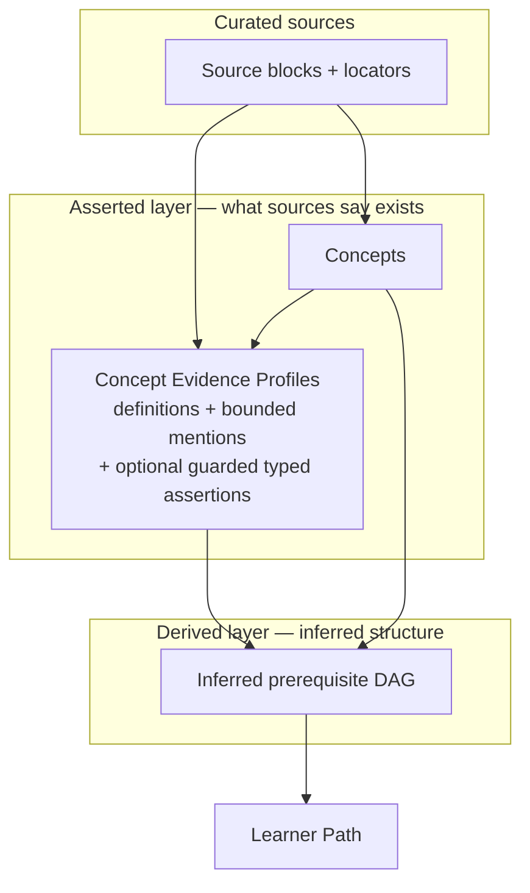

# Knowledge Graph Core — Complexity Reset

## Summary

Re-center the project on its real product path — concept admission → enrichment
prerequisite inference → learner path — by replacing the asserted-claim layer with
source-grounded **Concept Evidence Profiles**, demoting typed relations to optional
guarded evidence, and treating quality measurement as disposable defect-fixing
scaffolding rather than standing infrastructure.

## Problem Frame

The measurement layer has outgrown the product it measures. Gate 2 carries an oracle
independence triangle (author + audit models), a scoring-only neural label aligner, two
more neural judges, plus freeze / quarantine / human-review machinery — while the
published graph is ~15 concepts / 4 claims and every downstream product surface
(difficulty, learner state) is mocked. Effort has concentrated on scoring an upstream
proxy (admission label F1) rather than on the product the goals actually name: a
personalized learning path.

The asserted-claim layer is the second source of misplaced weight. Claims are extracted,
gated, retried, and recall-chased — yet the learner path never reads them. The path is
ordered by a prerequisite DAG that **Graph Enrichment infers** by judging concept pairs
(ADR-0019); sources rarely state prerequisites verbatim (ADR-0016 says so explicitly). So
claim recall feeds the product only indirectly, as the evidence substrate enrichment
reasons over — and in claim-sparse domains that substrate degrades to "label-dominated"
guessing (already noted in the prior TODO).

The fix is to stop investing in the proxy and the unused engine, and to feed enrichment
better raw evidence directly. This is greenfield with hard-reset allowed, so the reduction
is a rewrite, not a migration.

## Key Decisions

- **Concept Evidence Profiles replace asserted claims as the core artifact.** The
  Learner-Neutral Core Concept Graph becomes *Concepts + Evidence Profiles*. All
  prerequisite structure lives exclusively in the derived enrichment layer. This produces
  a clean split: the asserted layer records what sources say *exists*; the derived layer
  owns all inferred *structure*.

- **Measurement is disposable scaffolding.** The existing frozen oracle results are used
  once to drive the admission-precision fix, then the references and the triangle/aligner
  harness are deleted. The durable quality bar is rule-14 expert read of representative
  real output, plus the inline production judges and the verbatim-evidence floor.

- **Optional assertions are typed only when the type improves enrichment.** MVP types are
  `defines` and `explicit-prerequisite-hint`. They are source-grounded evidence items
  inside CEPs, guarded by verbatim + entailment checks, and never published as
  authoritative graph relations. The broad six-relation registry is retired.

- **The speculative method stack stays mocked behind its ports.** Bradley-Terry
  difficulty, IRT/KT learner modeling, the embedding canonicalization cascade, the
  embedding blocking tier, interpretable non-LLM prerequisite signals, clustering,
  anomaly detection, and synthetic priors are cut from the near-term roadmap. Deterministic
  identity (ADR-0015) remains the sole merge authority.

- **Affected ADRs are rewritten in place, not superseded.** Version control holds the
  history; the ADR set stays a current description of the system rather than an archive of
  reversals.

## Visualization

The asserted/derived split after the reset — the asserted layer carries no edges:

## Requirements

**Concept Evidence Profiles**

- R1. Each admitted Concept carries a Concept Evidence Profile: one or more verbatim
  definition snippets, a bounded set of substantive mention passages, and optional typed
  assertions.
- R2. Every CEP element retains per-source provenance (curated source + source block +
  character locator / heading path).
- R3. CEPs are append-only across sources: a multi-source Concept accumulates the union of
  its evidence without overwriting prior evidence.
- R4. Mention passages per Concept are bounded by salience so enrichment evidence packets
  stay focused; the bound is a tunable knob.

**Claim layer teardown**

- R5. Asserted claims are no longer published as a headline graph artifact; the published
  asserted graph is Concepts + Evidence Profiles, with no asserted edges.
- R6. The broad six-relation registry is retired. The only typed assertions are `defines`
  and `explicit-prerequisite-hint`, retained as guarded evidence inside CEPs and never
  published as authoritative relations.
- R7. Claim-extractor recall is no longer a goal; recall-chasing logic and the unused
  relation-extraction surface are removed.

**Measurement teardown**

- R8. The existing frozen oracle results are used to fix the admission-precision defects,
  after which the frozen references and the oracle triangle + label aligner +
  quarantine-of-disagreement harness are deleted.
- R9. The durable quality bar is rule-14 expert inspection of representative real output,
  plus the inline production judges and the verbatim-evidence floor.
- R10. The verbatim-evidence floor grounds the entire CEP; the entailment judge is scoped
  to guarding only the optional typed assertions.

**Critical-path investment**

- R11. Enrichment prerequisite judgment reasons over pairs of Concept Evidence Profiles
  (definitions + bounded mentions), not over published claims or labels alone.
- R12. Concept admission precision defects are fixed: the cross-domain optional precision
  leak (out-of-domain illustrative examples admitted optional) and core-poor under-tiering.
- R13. Conflated concept labels (one label naming two concepts) are split into atomic
  Concepts during admission.

**Cuts and mocks**

- R14. Difficulty stays the DAG-depth mock behind `DifficultyPort`; learner state stays
  the empty mock behind `LearnerStatePort`. No Bradley-Terry or IRT/KT work.
- R15. The embedding canonicalization cascade and the embedding blocking tier are cut from
  the roadmap; deterministic domain-scoped identity stays the sole merge authority.

**ADR and vocabulary updates**

- R16. ADR-0002, 0005, 0007, and 0016 are rewritten in place to describe the
  Concepts + Evidence Profiles model and prerequisite edges as exclusively derived
  enrichment output.
- R17. The oracle ADRs 0013 and 0022 are rewritten in place down to the lighter quality
  bar (no standing benchmark, no aligner), not deleted.
- R18. `CONTEXT.md` is updated: the `Claim`, `Relation Registry`, and `Asserted Relation`
  terms are revised, and `Concept Evidence Profile` plus the two optional-assertion types
  are added.

## Acceptance Examples

- AE1. **Covers R6.** When the extractor surfaces a grounded relation between two concepts,
  it is recorded as a typed CEP assertion only if its type is `defines` or
  `explicit-prerequisite-hint`; any other relation is kept as an untyped mention passage,
  not a typed assertion, and nothing is published as an authoritative graph edge.
- AE2. **Covers R3.** When a Concept already admitted from source A is admitted again from
  source B, its CEP gains source B's definition and mention evidence with source-B
  provenance, and source A's evidence remains intact.
- AE3. **Covers R8, R9.** Once the admission-precision defects pass expert inspection, the
  frozen references and the oracle harness are removed in the same change, and subsequent
  milestones are judged by rule-14 inspection rather than a recomputed oracle score.
- AE4. **Covers R5.** Opening the published graph in Admin Lab shows Concepts with their
  evidence profiles and zero asserted edges; prerequisite edges appear only when viewing a
  Derived Graph Layer.

## Scope Boundaries

**Deferred for later (mocked behind ports)**
- Real difficulty calibration (Bradley-Terry, anchors, uncertainty intervals).
- Learner modeling and personalization (IRT/KT, adaptive expansion, synthetic priors,
  learner simulations).
- Interpretable non-LLM prerequisite signals and clustering.

**Cut from the roadmap**
- Embedding canonicalization cascade and the embedding blocking tier.
- Standing benchmark infrastructure (oracle triangle, second-judge audit, label aligner,
  quarantine-of-disagreement) beyond the one-time admission-precision fix.
- DOCX / PPTX ingestion (already de-scoped; remains so).

## Dependencies / Assumptions

- The enrichment pair-judgment quality improves with richer CEP evidence packets versus
  label-dominated packets. This is the load-bearing bet behind the claim→CEP pivot and is
  validated by rule-14 inspection of the resulting inferred DAG and learner path, not by a
  standing metric.
- The inline production judges (concept-vs-proposition, claim-entailment) and the
  verbatim-evidence floor are retained and remain trustworthy as the only automated gates.
- Hard reset of the database and removal of claim/registry tables is permitted (AGENTS
  rules 8, 9); the single initial migration is rewritten accordingly.

## Outstanding Questions

**Deferred to planning**
- The exact salience bound for CEP mention passages (R4) and how salience is scored.
- Whether `explicit-prerequisite-hint` evidence should be passed to enrichment as a weighted
  prior or treated identically to other mention evidence.
- The CEP storage shape within the JSONB artifact envelope and its JSON_TABLE query
  surface for Admin Lab.

## Sources / Research

- `CONTEXT.md` — domain vocabulary being revised (Claim, Relation Registry, Asserted
  Relation; adding Concept Evidence Profile).
- `docs/adr/` — ADR-0002, 0005, 0007, 0013, 0016, 0019, 0022 are the load-bearing records
  for this reset; ADR-0015 (deterministic identity) and ADR-0019 (enrichment derived
  layer) are unchanged and define the path the reset preserves.
- `docs/plans/TODO.md` — current TODO #1 (admission precision levers) feeds R12/R13; TODO
  #4 (richer enrichment evidence) is promoted to the critical path as R11.
