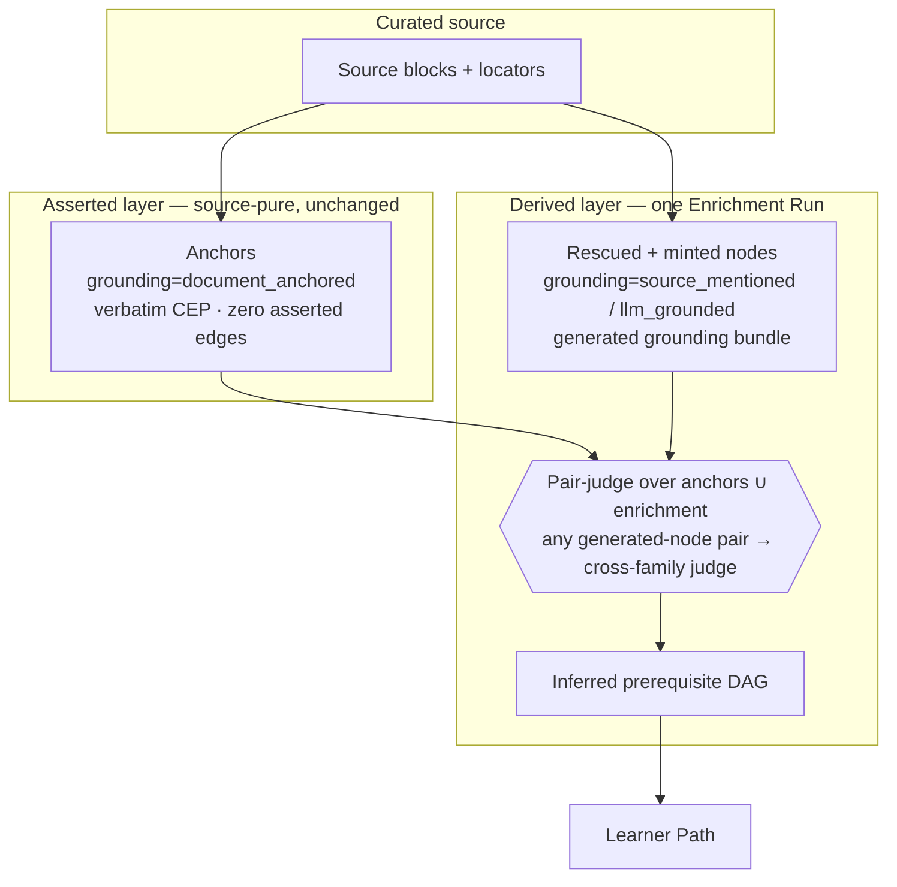

# Derived-Layer Prerequisite Enrichment

## Summary

Add a derived-layer enrichment operation that mints prerequisite concept *nodes* — not
just edges — so a sparse source still yields a usable learner path. Every concept gains a
`grounding_origin` that separates document-anchored concepts from LLM-grounded ones, while
the asserted core stays exactly as source-pure as it is today. A precondition admission-recall
fix ensures we enrich the *residual* gap, not concepts the document already defines.

---

## Problem Frame

A real run produced only four core concepts — too sparse for a meaningful learner path. The
sparsity is structural, not a tuning artifact:

- Admission only admits a concept to the asserted core if it has a verbatim **Definition
  Passage** (ADR-0005, ADR-0007). No definition in the source → not a Concept.
- Graph Enrichment (ADR-0019) adds **edges, never nodes** — it judges pairs of *already-published*
  concepts and infers `inferred-prerequisite-of`. Its only predicate is that edge.

So the concept set is exactly `{concepts the document defines verbatim}`. A thin source yields a
handful of anchors, the DAG can only wire those anchors, and the learner path inherits the
sparsity. Tuning admission cannot escape this ceiling: the derived layer can densify *edges* but
can never introduce the missing *nodes* a learner needs — the prerequisites the author assumed,
and the concepts the source mentions but never defines.

A second-order risk hides in the fix. If enrichment mints LLM-grounded nodes *over* an admission
stage that is silently under-recalling, generated nodes will paper over concepts that are sitting
defined in the source. So recall must be fixed first, and enrichment must fill only what remains.

---

## Key Decisions

- **Grounding provenance becomes a first-class concept attribute.** "Separate document-grounded
  anchors from LLM-grounded enrichment" is modeled as a `grounding_origin` axis carried by every
  concept, orthogonal to the concept's pedagogical `role`. This is the spine of the feature and
  matches current practice (anchor-constrained extraction with per-element provenance).

- **All enrichment lives in the derived layer; the asserted core is untouched.** No enrichment node
  is ever published into an asserted graph version. This keeps the project's source-purity
  guarantee intact and routes world-knowledge content to the derived/projection layer where it
  belongs. It also resolves a prior tension cleanly: the reset retired the old "missing-concept
  proposal" because it fed the *asserted core* (the wrong consumer); this revives missing-concept
  generation but routes it to the *learner path* (the right one).

- **LLM grounding is a generated bundle, not a synthetic source.** The enrichment operation emits
  the node plus a CEP-shaped grounding bundle directly, rather than generating a document and
  pushing it through the real ingestion pipeline. Lighter, and it keeps the real/synthetic source
  boundary unambiguous.

- **Admission recall is fixed before enrichment runs.** A precondition step verifies and repairs
  under-recall so anchors reflect everything the source genuinely defines, then enrichment fills the
  residual.

- **Generated-node ordering must be cross-family.** The current pair-judge (`kg-prerequisite-judgment`)
  routes to DeepSeek — the same family as the extractor and the grounding generator — which makes the
  generation→grounding→judgment self-loop a monoculture. Any pair involving a generated node must be
  ordered by a different model family (gpt-oss-120b via `kg-independent-judge`).

- **ADR impact.** ADR-0019 is generalized from edge-only derivation to node+edge derivation, and a
  new ADR records the grounding-origin model, its non-verbatim trust contract, and the cross-family
  generated-node judge.

### The model

| Axis | Values (this milestone) | Reserved |
|---|---|---|
| `grounding_origin` | `document_anchored`, `source_mentioned`, `llm_grounded` | `web_grounded` |
| `role` | `anchor`, `prerequisite` | `bridge`, `application`, `misconception` |
| `layer` | `asserted` (only when `document_anchored`), else `derived` | — |

---

## Requirements

### Admission recall (precondition)

- R1. Before enrichment, diagnose whether admission drops concepts the source actually defines
  (concepts that carry a verbatim Definition Passage) on the sparse fixture, and fix the under-recall.
  The fix must not relax the Definition-Passage requirement — it recovers wrongly-dropped anchors,
  it never admits undefined concepts.

### Grounding model and invariants

- R2. Every concept carries a `grounding_origin` ∈ {`document_anchored`, `source_mentioned`,
  `llm_grounded`}, with `web_grounded` reserved for later.
- R3. Every concept carries a `role` ∈ {`anchor`, `prerequisite`}, with `bridge`, `application`,
  and `misconception` reserved for later.
- R4. `layer` is an invariant of `grounding_origin`, not an independent choice: only
  `document_anchored` may be `asserted`; `source_mentioned`, `llm_grounded`, and `web_grounded` are
  always `derived`. `llm_grounded` combined with `asserted` is an impossible state.
- R5. The asserted Learner-Neutral Core Concept Graph is unchanged — anchors only, verbatim evidence
  floor, zero asserted edges. No enrichment node is ever published into an asserted graph version.
- R6. Prerequisite ordering is an `inferred-prerequisite-of` edge in the Derived Graph Layer, never
  a node attribute. `role = prerequisite` records why a node was minted, not an ordering.

### Enrichment node operation

- R7. A derived-layer enrichment operation mints `llm_grounded` prerequisite nodes the source assumes
  but does not teach, and rescues `source_mentioned` concepts (mentioned in the source, no Definition
  Passage).
- R8. Each minted node carries a CEP-shaped generated grounding bundle — a definition passage, a
  bounded set of mention-like passages, and the generating model's rationale — tagged by
  `grounding_origin` and stored as an inspectable, swappable artifact.
- R9. Generated grounding is explicitly exempt from the deterministic verbatim-evidence floor, because
  no source quote exists to verify. The exemption is tied to the `grounding_origin` tag and recorded,
  never a silent skip.
- R10. Grounding generation is conditioned on the anchors the node scaffolds, so generated text stays
  tied to the source's framing rather than free-floating world knowledge.
- R11. The bundle is structured so a later `web_grounded` upgrade replaces the generated passages with
  cited external passages in place, without changing node identity.

### Prerequisite ordering and judge independence

- R12. Prerequisite ordering runs over the union of anchors and enrichment nodes within one Enrichment
  Run; the asserted version still contains only anchors.
- R13. Any pair where at least one node is generated (`llm_grounded`, later `web_grounded`) is ordered
  by a judge of a different model family than the generator — gpt-oss-120b via `kg-independent-judge`.
  Anchor-anchor ordering must not regress onto a new model without re-validation. (Mechanism — a
  dedicated generated-node-ordering alias versus repointing `kg-prerequisite-judgment` — is a planning
  choice; the dedicated alias is preferred because it leaves validated anchor-only ordering untouched.)
- R14. The shipped direction-bias mitigations are retained: the judge names the prerequisite by its
  exact canonical label, and may return `uncertain` (flagged for review and excluded from learner paths).

### Quality and inspection

- R15. Admin Lab and learner-path surfaces visually distinguish anchors from enrichment nodes and expose
  each enrichment node's `grounding_origin` and grounding bundle. Enrichment is never silently merged
  into the authoritative set.
- R16. The milestone is validated by rule-14 inspection of one sparse fixture — the recovered anchors,
  the minted and rescued nodes with their grounding, the resulting prerequisite DAG, and the learner
  path — judged useful and traceable, not by a standing metric. A both-orders consistency check on
  generated-node pairs is an optional measured probe during inspection, not a default symbolic gate
  (AGENTS rule 16).

---

## Acceptance Examples

- AE1. **Covers R4, R5.** Opening the published asserted graph shows only anchors with zero asserted
  edges. The rescued and minted nodes appear only when viewing the Derived Graph Layer; no path exists
  by which an `llm_grounded` node enters an asserted version.
- AE2. **Covers R1.** A concept the document defines verbatim but that the prior run dropped is recovered
  as an anchor (`document_anchored`, `asserted`) after the recall fix — not minted later as an
  `llm_grounded` node.
- AE3. **Covers R8, R9.** A minted prerequisite node carries a generated definition plus the model's
  rationale, tagged `llm_grounded`; the verbatim-floor check on it is recorded as not-applicable-by-grounding
  rather than failing the run.
- AE4. **Covers R13.** A pair `{anchor, llm_grounded node}` is routed to the gpt-oss-120b judge; a pair
  `{anchor, anchor}` stays on the existing prerequisite-judgment path.
- AE5. **Covers R7, R6.** A source that mentions a concept without defining it yields a `source_mentioned`
  rescued node whose prerequisite relationship to an anchor is expressed as an `inferred-prerequisite-of`
  edge, not as an attribute on the node.

---

## Scope Boundaries

**Deferred for later**
- `bridge`, `application`, and `misconception` roles. When `misconception` lands, model it as a
  satellite annotation on a concept (the Brown & Burton "buggy rule" shape), not as a DAG node with
  prerequisite edges.
- `web_grounded` grounding. The grounding tag and bundle are forward-designed to accept external
  citations, but no web retrieval ships in this milestone.

**Unchanged from the complexity reset**
- Difficulty stays the DAG-depth mock behind `DifficultyPort`; learner state stays the empty mock
  behind `LearnerStatePort`.
- Embedding canonicalization and the embedding blocking tier stay cut; deterministic identity
  (ADR-0015) stays the sole merge authority.
- No standing benchmark or oracle harness — rule-14 inspection plus the inline judges and the
  verbatim-evidence floor remain the quality bar.

---

## Dependencies / Assumptions

- **Load-bearing bet.** Generated grounding produces prerequisite orderings good enough to densify the
  learner path usefully. This is validated by rule-14 inspection of the inferred DAG and path, not by a
  standing metric. The cross-family judge and the derived-layer quarantine keep the self-loop's errors
  non-authoritative and inspectable rather than eliminating them.
- **The generator is DeepSeek-family** (AGENTS rule 5: production extraction is DeepSeek V4 Flash, thinking
  disabled). This is *why* the generated-node judge must be non-DeepSeek (gpt-oss-120b) — the independence
  requirement (R13) depends on this assumption holding.
- Hard reset of the database and the single initial migration is permitted (AGENTS rules 8, 9).

---

## Outstanding Questions

**Deferred to planning**
- How missing prerequisite nodes are *proposed* — recommended default is an anchor-driven, bounded pass
  ("what must a learner understand before this anchor?") rather than unbounded graph-wide gap-filling,
  to keep densification controlled.
- The bound on minted nodes per anchor and per run, to prevent runaway densification.
- Where `source_mentioned` rescue candidates come from — discovery candidates, rejected/optional admission
  proposals, or mention passages inside anchor CEPs.
- The generated-bundle storage shape within the JSONB artifact envelope and its JSON_TABLE query surface.
- The R13 mechanism (dedicated generated-node-ordering alias versus repointing `kg-prerequisite-judgment`).
- Whether the R16 both-orders consistency check earns its keep.

---

## Sources / Research

**ADRs (the asserted/derived split this extends)**
- `docs/adr/0002-define-learner-neutral-core-concept-graph.md`, `docs/adr/0005-admit-atomic-concepts-before-evidence-profiles.md`,
  `docs/adr/0007-extract-concept-evidence-profiles-in-concept-context.md` — the verbatim-definition admission gate.
- `docs/adr/0016-retire-relation-registry-keep-two-cep-assertions.md`, `docs/adr/0019-graph-enrichment-derived-layer.md` —
  the derived layer that today adds edges only; this milestone generalizes it to nodes.
- `docs/adr/0013-verify-quality-by-real-source-inspection.md`, `docs/adr/0015-deterministic-cross-source-identity.md`.

**Code locations**
- `packages/infrastructure-litellm/src/enrichmentAdapters.ts` — `PREREQUISITE_JUDGE_MODEL = "kg-prerequisite-judgment"`;
  the judge already names the prerequisite by exact label and supports `uncertain`.
- `packages/infrastructure-litellm/src/extractionAdapters.ts` — `kg-independent-judge` (gpt-oss-120b), chosen as cross-family
  independent of the DeepSeek extractor.
- `litellm/config.yaml` — `model_group_alias` maps `kg-prerequisite-judgment` → `deepseek-v4-flash-no-thinking` (same family
  as the extractor) and `kg-independent-judge` → `openrouter/openai/gpt-oss-120b`.
- `packages/application/src/runGraphEnrichment.ts` — the Enrichment Run orchestration this operation extends.

**External best practice**
- Anchor-constrained extraction with per-element provenance tracking for hallucination detection — [AEVS, MDPI 2025](https://www.mdpi.com/2073-431X/15/3/178).
- Dual (grounded + derived) knowledge-structure graphs for personalized learning paths — [GraphRAG, arXiv 2506.22303](https://arxiv.org/pdf/2506.22303).
- Prerequisite pruning and difficulty-graded sequencing — [KG learning-path survey, MDPI](https://www.mdpi.com/2079-9292/15/1/238); [adaptive curriculum sequencing, arXiv 2506.13092](https://arxiv.org/pdf/2506.13092).
- Misconceptions as buggy-rule annotations (Brown & Burton, 1978), informing the deferred `misconception` role shape.

**Prior brainstorm**
- `docs/brainstorms/2026-06-15-kg-core-complexity-reset-requirements.md` — the reset that produced the current asserted/derived
  split and retired the old missing-concept proposal.
