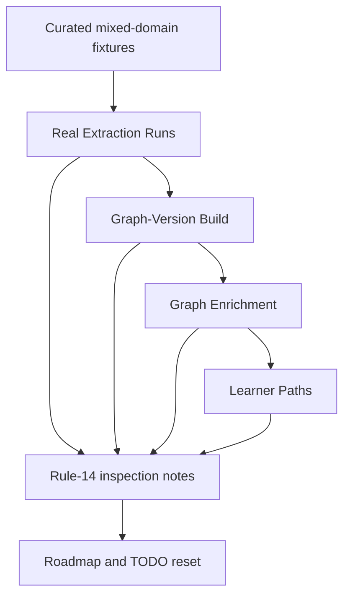

# Evaluation-First Roadmap Reset

## Summary

Run real multi-domain LLM graph generations before changing the roadmap again. The next plan should use
inspected asserted graphs, Derived Graph Layers, and Learner Paths as evidence for what to keep, remove,
defer, or tune.

---

## Problem Frame

The 2026-06-15 complexity reset and 2026-06-16 derived-layer prerequisite enrichment work are already
implemented. They should not keep driving `docs/plans/TODO.md` as if they were live plans. Their durable
architecture now lives in `CONTEXT.md` and the ADR set.

The remaining method stack is intentionally tempting: canonicalization cascades, prerequisite signals,
Bradley-Terry difficulty, clustering, learner simulation, and IRT/KT all sound aligned with the product
goals. But several are mocked, deferred, or explicitly removed by current ADRs. Rebuilding them before
inspecting real output would add carrying cost without knowing which failure actually blocks useful
Learner Paths.

The current evidence is also narrow. The latest validation is a Rust-heavy success with known caveats:
single-fixture coverage, mild generated-node granularity redundancy, and a mint cap that bound exactly.
The next durable decision must come from real mixed-domain runs, not from method-stack completeness.

---

## Key Decisions

- **Evaluation gates roadmap changes.** Do not add or restore graph methods until real-source runs show
  the current pipeline's concrete failure mode.
- **Completed brainstorms become historical inputs.** Keep the reset and enrichment brainstorms as
  completed context, but remove their work from the live TODO surface once the new roadmap is written.
- **Low-complexity durability wins.** Prefer a small evaluation loop and targeted fixes over broad
  reconstruction of embeddings, scoring harnesses, or learner-modeling infrastructure.
- **Mocks remain valid until they block inspection.** DAG-depth difficulty and empty learner state stay
  behind ports unless the evaluation shows they prevent judging Learner Path usefulness.

---

## Evaluation Shape

---

## Requirements

**Evaluation gate**

- R1. Run real Extraction Runs, Graph-Version Builds, Enrichment Runs, and Learner Path generations on a
  small mixed-domain fixture set before adding downstream graph methods.
- R2. Cover at least one non-software native fixture before tuning extraction prompts, generated-node
  caps, schemas, or admission behavior.
- R3. Inspect each run's asserted Concepts, Concept Evidence Profiles, enrichment nodes, inferred
  prerequisite DAG, and generated Learner Path as one end-to-end product surface.
- R4. Record run-specific quality issues under `tmp/`, not as a standing benchmark or oracle harness.

**Decision rules**

- R5. Treat an observed defect as roadmap-worthy only when it appears in real output and materially
  affects graph reliability, provenance, auditability, or Learner Path usefulness.
- R6. Prefer removing or deferring modules whose value is not visible in inspected output.
- R7. Keep symbolic hard vetoes limited to provable guarantees, such as verbatim evidence verification.
- R8. Keep prompts and tool-schema descriptions domain-neutral; do not tune from fixture-specific
  expected answers.

**Roadmap cleanup**

- R9. Rewrite `docs/plans/TODO.md` so completed reset and enrichment milestones do not read as active
  roadmap work.
- R10. Keep the live TODO to the next evaluation loop and any fixes directly earned by that loop.
- R11. Do not update ADRs for speculative method-stack preferences; update ADRs only after a durable
  architectural decision changes.

**Deferred method stack**

- R12. Keep Bradley-Terry difficulty, anchor concepts, uncertainty intervals, and learner simulations
  deferred until baseline path quality is good enough that difficulty calibration is the limiting factor.
- R13. Keep IRT/KT and personalized learner-state modeling post-MVP until the learner-neutral graph passes
  the static quality gate.
- R14. Keep embedding canonicalization, embedding blocking, clustering, and non-LLM prerequisite signals
  out of the roadmap unless a measured module beats the current deterministic or exhaustive behavior.
- R15. Keep cross-source identity deterministic unless an explicit measured identity experiment justifies a
  reversible alias or merge-assistance layer that cannot mutate graph identity on its own.

---

## Acceptance Examples

- AE1. **Covers R1, R3.** A biology fixture is processed through extraction, publication, enrichment, and
  Learner Path generation, and the inspection notes discuss the asserted anchors, rescued or minted nodes,
  prerequisite ordering, and path usefulness together.
- AE2. **Covers R5, R10.** If a run admits extra operation-like Concepts but the resulting path remains
  useful and auditable, TODO records the caveat without creating a prompt-tuning task.
- AE3. **Covers R6, R12.** If path ordering fails because prerequisite edges are wrong, the next task fixes
  enrichment judgment before introducing Bradley-Terry difficulty.
- AE4. **Covers R9.** `docs/plans/TODO.md` no longer presents the 2026-06-15 reset or 2026-06-16 enrichment
  implementation units as live work; they remain summarized only as completed context or historical source
  material.
- AE5. **Covers R14, R15.** If deterministic identity yields same-domain duplicate Concepts, the next step is
  a scoped identity experiment or inspection workflow, not an embedding cascade that can silently merge
  Concepts.

---

## Success Criteria

- At least two non-Rust domains have fresh real-use inspection notes covering extraction through Learner
  Path generation.
- The resulting roadmap has 3-7 live tasks ordered by dependency and value.
- Every live task names the real-output defect or product gap that earned it.
- No deferred method is reintroduced only because it appears in the long-term goal stack.

---

## Scope Boundaries

**In scope**

- Real LLM graph generation and inspection across mixed curated fixtures.
- Roadmap and TODO cleanup based on inspected output.
- Targeted deletion, deferral, or simplification recommendations for redundant modules.

**Deferred**

- Personalized graph construction from Learner State.
- Bradley-Terry difficulty calibration and synthetic IRT priors.
- Embedding or clustering modules for identity, blocking, or prerequisite inference.
- DOCX and PPTX fixture expansion unless the evaluation loop proves native and existing mixed-format
  fixtures are insufficient.

**Not a goal**

- Recreating a standing oracle benchmark or model-authored gold set.
- Preserving backward compatibility with completed greenfield implementation choices.
- Making the authoritative asserted graph learner-specific.

---

## Dependencies / Assumptions

- The existing reset and enrichment implementations are available as the baseline to evaluate.
- LiteLLM aliases continue to route production extraction and judges through their ports.
- The current fixture matrix supplies enough domain variation to expose the next high-value defect.
- Hard database reset and single-migration rewrites remain allowed during development.

---

## Outstanding Questions

**Resolve before planning**

- Which fixture set should be the first evaluation batch: Gate 1 native fixtures only, or Gate 1 plus the
  already-ingested PDF fixture?

**Deferred to planning**

- The exact commands, run IDs, and inspection report filenames.
- The final TODO wording after the evaluation results are known.
- Whether the older brainstorm artifacts should remain in `docs/brainstorms/` as historical records or
  be moved only if the project adopts an archive convention.

---

## Sources / Research

- `AGENTS.md` - greenfield reset rules, Deep Module Architecture, rule-14 validation, domain-neutral prompt
  constraints, and symbolic-gate limits.
- `CONTEXT.md` - authoritative vocabulary for Concepts, CEPs, Graph Enrichment, Derived Graph Layers,
  Enrichment Nodes, Learner Paths, and Learner State.
- `docs/adr/README.md` and linked ADRs - accepted architecture for source-pure asserted graphs,
  deterministic identity, CEP extraction, derived-layer enrichment, deferred learner modeling, and real-use
  quality validation.
- `docs/plans/README.md` - live planning documents should stay current, with TODO limited to recommended
  next implementation tasks, completed groups, and latest validation.
- `docs/plans/TODO.md` - current live roadmap already flags non-Rust validation before prompt, cap, or
  schema tuning.
- `fixtures/README.md` - canonical mixed-domain fixture matrix for real-use quality runs.
- `docs/brainstorms/2026-06-15-kg-core-complexity-reset-requirements.md` - completed reset context.
- `docs/brainstorms/2026-06-16-derived-layer-prerequisite-enrichment-requirements.md` - completed
  derived-layer enrichment context.
