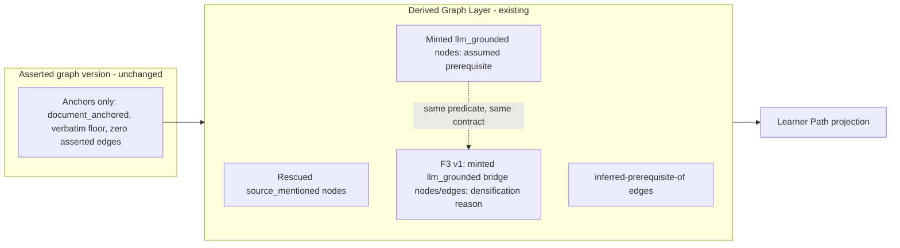

# Enrichment Evaluation and Graph Densification (F3 v1)

## Summary

Run a real mixed-domain evaluation of Graph Enrichment prerequisite ordering (F1) that gates the next
experiment. If ordering passes, build F3 v1: a graph-densification experiment that adds a new LLM
proposal trigger to fill sparse or disconnected gaps in the existing Derived Graph Layer, on the
existing `inferred-prerequisite-of` predicate, with every new node and edge marked `llm_grounded` and
kept outside the authoritative core until measured.

---

## Problem Frame

The Learner-Neutral Core Concept Graph and its Derived Graph Layer are built and validated across four
domains, but Learner Path quality has only been inspected as a side effect of other milestones. The
live roadmap defers the long-term method stack until real output names the concrete failure that earns
the next module. That evaluation has never been run as its own gated step.

Two product gaps are now suspected. First, prerequisite ordering inside the derived layer may be wrong
in ways a path read would expose (F1). Second, the derived graph may be too sparse — concepts a learner
needs to bridge are mentioned or implied but never connected, leaving paths thin or disconnected (F3).
The second is the more interesting frontier, but densifying a graph whose ordering is already wrong only
amplifies noise, so the ordering evaluation must come first and gate the densification work.

A natural instinct is that LLM-proposed nodes and edges need a new separate layer, explicit source
marking, and a supersession of the embeddings ADR. Most of that already exists: the Derived Graph Layer
stores enrichment-created nodes and edges separately from the asserted graph, and the Grounding Origin
axis already tags generated nodes `llm_grounded`. The real architectural decision F3 raises is narrower
than it first appears — a new minting *reason*, not a new layer or a reversal of the embeddings removal.

---

## Key Decisions

- **F1 evaluation gates the F3 experiment.** Real mixed-domain Learner Path inspection runs first. F3
  proceeds only if prerequisite ordering passes; if it fails, the named ordering defect becomes the next
  plan instead. This protects against densifying a noisy graph.

- **F3 v1 stays prerequisite-only.** A gap-filled connection is a prerequisite the source did not state,
  carried on the existing `inferred-prerequisite-of` predicate. No relatedness or association edge type
  enters in v1, so Learner Path ordering consumes F3 output unchanged and ADR-0016 is untouched.

- **F3 reuses the Derived Graph Layer, not a new layer.** New bridge nodes and edges are Enrichment
  Nodes tagged `llm_grounded`, stored in the derived layer, never published asserted. The existing
  two-stage minting and generated-grounding contract (ADR-0019, ADR-0023) applies as-is.

- **ADR-0012 is not superseded.** F3 v1 uses no embeddings. Sparse regions are read from the pairs
  exhaustive same-domain judgment already declined; the LLM proposes bridges over those gaps. Embeddings
  stay deferred as a future cost-bound pair-selection tier under ADR-0012's existing measured-module
  clause. The only ADR change is a clarifying amendment to ADR-0019 admitting a densification minting
  reason alongside the existing assumed-prerequisite reason.

- **F3 v1 is EXPERIMENT_ONLY.** It is kept outside the authoritative pipeline and measured against the
  current exhaustive/deterministic behavior before any promotion, consistent with roadmap R6 and R14.

---

## Layer placement

---

## Requirements

**F1 enrichment evaluation (gate)**

- R1. Run real Extraction Runs, Graph-Version Build, Enrichment Run, and Learner Path generation over at
  least two non-Rust fixtures before starting F3.
- R2. For each fixture, judge the generated Learner Path `PASS` or `FIX_FIRST` on prerequisite-ordering
  correctness: no concept appears before something it genuinely requires.
- R3. Confirm each ordering step traces to CEP evidence or a grounded derived node.
- R4. Record, as the evidence that earns F3, where the derived graph is too sparse or disconnected —
  concepts a learner would need to bridge that no `inferred-prerequisite-of` edge connects.
- R5. Record run-specific findings under `tmp/`, not as a standing benchmark or oracle harness.

**F3 v1 densification experiment (conditional on F1 PASS)**

- R6. Add a densification proposal trigger that proposes bridge concepts and edges over sparse or
  disconnected regions of one Enrichment Run's derived graph.
- R7. Carry every F3 connection on the existing `inferred-prerequisite-of` predicate; introduce no new
  edge predicate in v1.
- R8. Tag every F3-created node `llm_grounded` and store it as an Enrichment Node in the Derived Graph
  Layer; never enter the asserted graph.
- R9. Generate each F3 node's grounding through the existing two-stage minting and generated-grounding
  bundle contract; route any pair touching a generated node through the cross-family generated-node
  judge.
- R10. Derive sparse regions without embeddings in v1, using the pairs exhaustive same-domain judgment
  already declined.
- R11. Keep F3 v1 outside the authoritative pipeline and measure its output against the current derived
  layer before considering promotion.

**Scope discipline**

- R12. Keep prompts and tool-schema descriptions domain-neutral; do not tune from fixture-specific
  expected answers (AGENTS rule 17).
- R13. Amend ADR-0019 to admit the densification minting reason; do not supersede ADR-0012 or change
  ADR-0016.

---

## Acceptance Examples

- AE1. **Covers R2, R4.** A biology Learner Path is generated and read by a domain-literate reviewer.
  The ordering is prerequisite-correct (PASS on F1), and the reviewer notes two concepts the source
  implies but the derived graph leaves unconnected — recorded as the concrete sparsity evidence for F3.

- AE2. **Covers R1, R6.** If F1 inspection finds wrong prerequisite ordering on any fixture, F3 does not
  start; the ordering defect becomes the next plan instead.

- AE3. **Covers R7, R8.** F3 proposes a bridge concept between two otherwise-disconnected Concepts. It
  appears as a `llm_grounded` Enrichment Node connected by `inferred-prerequisite-of` edges in the
  Derived Graph Layer, and the asserted graph version is byte-for-byte unchanged.

- AE4. **Covers R11.** F3 output is inspected beside the same graph version's non-F3 enrichment. If the
  bridges add noise or unsupported connections, F3 stays EXPERIMENT_ONLY and is not promoted.

---

## Success Criteria

- At least two non-Rust fixtures have fresh F1 inspection notes covering ordering correctness and
  sparsity, with an explicit PASS / FIX_FIRST verdict per path.
- F3 v1, if reached, produces bridge nodes and edges that are traceable, `llm_grounded`, confined to the
  derived layer, and leave the asserted graph identity unchanged.
- The next roadmap task names the real-output defect or product gap that earned it — a named ordering
  defect, or measured F3 densification value.

---

## Scope Boundaries

**Deferred for later**

- F2 missing-concept recall (the rescue-durability judge's drop/recall balance) — fine-tune after F1.
- Baseline node difficulty (Bradley-Terry over a small anchor set) — now sits behind F3, still earned
  only when ordering quality makes difficulty the limiting factor.
- A relatedness/association edge type and any non-prerequisite derived predicate.
- Embeddings as a cost-bound pair-selection or sparsity-detection tier — only as a future measured
  module under ADR-0012.

**Outside this product's identity**

- IRT/KT, personalized learner-state modeling, learner simulation, and non-LLM clustering signals.
- Any F3 node or edge entering the authoritative asserted graph.
- Embeddings as a Concept merge, alias, or identity authority (ADR-0012 stands).

---

## Dependencies / Assumptions

- The existing Derived Graph Layer, two-stage minting, generated-grounding bundle, and cross-family
  generated-node judge are the baseline F3 extends.
- Exhaustive same-domain pair judgment makes sparse regions observable from declined pairs, so F3 v1
  needs no new similarity signal.
- LiteLLM aliases continue to route production extraction and judges through their ports.
- Hard database reset and single-migration rewrites remain allowed during development.

---

## Outstanding Questions

**Deferred to planning**

- The exact fixture set for the F1 batch: existing native mixed fixtures only, or plus the ingested PDF
  fixture.
- How sparse regions are selected for F3 proposal (e.g., disconnected components, anchors with no
  incoming prerequisite) and the per-run bound on F3 proposals.
- The measurement F3 is judged by before any promotion is reconsidered.

---

## Sources / Research

- `AGENTS.md` — greenfield reset rules, rule-14 real-use validation, domain-neutral prompts (rule 17),
  symbolic-gate limits (rule 16).
- `CONTEXT.md` — Derived Graph Layer, Enrichment Node, Grounding Origin, `inferred-prerequisite-of`,
  Learner Path vocabulary.
- `docs/adr/0012-remove-embeddings-deterministic-identity-only.md` — embeddings barred from identity;
  future embedding mechanism allowed only as a measured module that cannot create or merge on its own.
- `docs/adr/0019-graph-enrichment-derived-layer.md` — derived-layer node/edge derivation, two-stage
  minting, exhaustive same-domain judgment, single `inferred-prerequisite-of` predicate.
- `docs/adr/0023-grounding-origin-model-and-cross-family-generated-node-judge.md` — `llm_grounded`
  origin, per-provenance verbatim floor, cross-family generated-node judge.
- `docs/plans/TODO.md` — live roadmap deferring the method stack until real output earns it.
- `docs/brainstorms/2026-06-16-evaluation-first-roadmap-reset-requirements.md` — evaluation-gates-roadmap
  discipline this brainstorm operates under.
