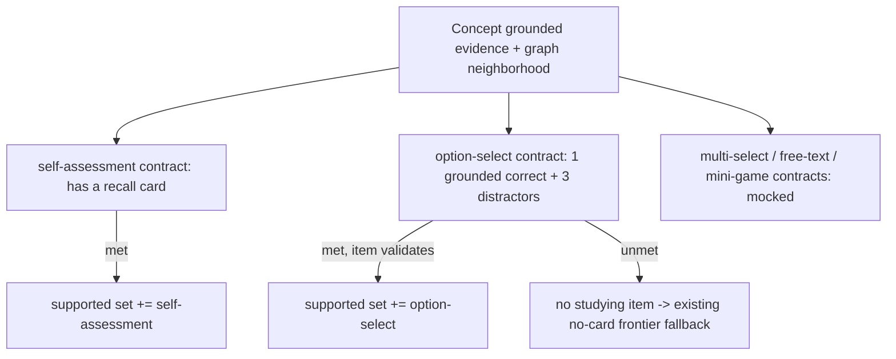

# Study surface polish + typed study items

## Summary

Improve the just-shipped study loop in two plans: a study-surface pass (legible
nodes, button-vs-tag distinction, frontier-zoomed graph, uninterrupted advance)
that also folds in two quick calibration-correctness fixes; and a typed Study
Item model where option-select drives studying while self-assessment is kept
only for calibration, and each concept's supported item types are computed from
its grounded evidence.

## Problem Frame

The learner-calibrated study loop now runs end-to-end with real self-assessed
responses, and the 2026-06-21 rule-14 evaluation classified it `PASS` for the
skip-ahead proof while recording defects to fix before building further. Two
classes of defect surfaced. The study surface has real legibility and
interaction friction — enrichment and locked nodes are near-invisible on the
light canvas, buttons are indistinguishable from tags, the graph frames the
whole DAG rather than the learner's working region, and answering a card drops
the learner out of flow. Separately, the loop's only study mechanic is
self-assessment, which the product will not keep: studying should move to
auto-graded items, and a concept should be able to carry several item types.
The recorded uncertain-edge over-seeding and the always-same-cards calibration
re-save are correctness gaps in the same calibration path.

## Key Decisions

- **Two plans, calibration correctness folded into the lighter one.** Plan 1 is
  the study-surface pass plus the two calibration fixes (a quick fix that does
  not warrant its own plan). Plan 2 is the typed Study Item model. The plans
  share no ordering dependency beyond Plan 2 rendering items that Plan 1's
  surface displays.

- **Compute supported item types from evidence; never store a concept→type
  map.** Each item type declares a grounding contract — the evidence it needs.
  A concept supports a type when its evidence satisfies that contract, and the
  supported set is the byproduct of attempting generation, not a hand-kept
  table. This follows Automatic Item Generation practice (each type is an item
  model that applies to any content fitting its schema) and the codebase's
  earn-it-from-grounded-evidence contract. A second source of truth would drift
  (rule 18).

- **Studying becomes auto-graded option-select; the self-assessed study path is
  removed.** Self-assessment retreats entirely to calibration. Studying writes a
  real graded outcome from a click — no judge and no self-report in the study
  loop. Per greenfield rule 18 the prior self-assessed study path is deleted,
  not kept alongside.

- **Distractors are generated but sibling-conditioned.** Generation is the
  uniform mechanism so every concept can yield a studying item regardless of
  neighborhood density; the generator is conditioned on sibling-concept evidence
  so wrong answers read like real domain answers. The correct answer stays
  source-grounded; distractors are labeled `generated` (ADR-0025 provenance). A
  thin-neighborhood concept degrades to less-sibling-like distractors, never to
  no item.

- **Calibration re-save is latest-wins in the fold, not a row delete.** The
  append-only Response Log (ADR-0025) is preserved; a later self-report on a
  node supersedes the earlier one when mastery is folded.

- **Calibration propagation honors the router's trust model.** Propagation
  excludes `uncertain` edges to match `classifyAdaptedNodes` readiness, so
  "I know it" seeds only prerequisites the router itself trusts.

The supported-type computation is a source-of-truth fan-out:

## Requirements

**Study surface: visibility & interaction (Plan 1)**

- R1. Node fills that currently collide with the near-white canvas — enrichment
  (`--secondary`) and locked (`--muted`) — render with enough contrast to be
  legible; every node state is distinguishable against the canvas.
- R2. Interactive controls (buttons) are visually distinct from non-interactive
  tags (badges) so a learner can tell what is clickable, including the
  neutral/adapted graph control.
- R3. The study graph opens zoomed and centered on the frontier target's
  immediate neighborhood (about five nodes visible) rather than fit to the whole
  DAG; pan and zoom still reach the rest of the graph.
- R4. After a study item is answered, the next frontier item opens automatically
  in the same view so studying is uninterrupted.

**Calibration correctness (Plan 1)**

- R5. Re-submitting calibration supersedes a learner's prior answer on the same
  item via latest-wins when mastery is folded; the append-only Response Log is
  preserved with no row deletion.
- R6. Calibration propagation excludes `uncertain` edges and guards cycles, so
  an "I know it" rating seeds only prerequisites the router trusts and cannot
  credit an entire connected component through distrusted edges.

**Typed Study Item model (Plan 2)**

- R7. The study-item model carries an explicit item-type discriminant; the Card
  Bank generalizes into a typed Study Item Bank in which the self-assessment
  card is one type among several.
- R8. Self-assessment is used only for calibration and option-select is used for
  studying; the prior self-assessed study path is removed.
- R9. An option-select item presents four visible options with exactly one
  correct; the learner clicks the correct option and the outcome is auto-graded
  without a judge or self-report.
- R10. Option-select distractors are generated, conditioned on sibling-concept
  evidence, and labeled `generated`; the correct answer stays source-grounded.
- R11. A deterministic guard enforces that an option-select item has four
  distinct options, exactly one keyed correct, and a grounded correct answer,
  failing closed otherwise.
- R12. A concept's supported item types are computed from its grounded evidence
  against each type's grounding contract — the supported set is the types that
  yielded at least one valid item — and are never stored as a concept→type map.
- R13. A concept that yields no valid studying item supports only self-assessment
  and is surfaced through the existing no-card frontier fallback unchanged.
- R14. Item types beyond option-select and self-assessment (multi-option-select,
  free-text, mini-games) are mocked behind the discriminant and not implemented
  this round; the model accommodates them without a further reshape.

**Guards (both plans)**

- R15. All behavior is read and projection over the authoritative graph and the
  Derived Graph Layer; neither is mutated, and generated item content is labeled
  honestly per ADR-0025.
- R16. No population difficulty calibration (IRT / KT / Bradley-Terry); intrinsic
  difficulty stays `EXPERIMENT_ONLY`.

## Acceptance Examples

- AE1. **Covers R4, R8, R9.** A learner clicks the correct option on a frontier
  item; that node turns mastered and the next frontier item opens automatically
  in the same view, with no manual node click and no "got it / missed it"
  prompt.
- AE2. **Covers R5.** A learner marks an item "I know it", then re-calibrates and
  marks the same item "not sure"; the later answer wins in the fold while both
  rows remain in the append-only log.
- AE3. **Covers R6.** In a subgraph with an uncertain-edge cycle, calibrating one
  node seeds mastery only along certain edges; the goal is not auto-credited
  through uncertain edges.
- AE4. **Covers R10, R11.** A generated option-select item for a concept with
  several siblings draws distractor flavor from sibling evidence; the guard
  rejects a candidate set with duplicate options or with zero or more than one
  keyed-correct option.
- AE5. **Covers R12, R13.** A concept whose evidence cannot yield a valid
  option-select item supports only self-assessment, is flagged
  cardless-for-studying on the frontier, and routes through the existing no-card
  fallback.

## Scope Boundaries

**Deferred for later**

- Multi-option-select, free-text / LLM-graded items, and connect-concepts
  mini-games — mocked behind the type discriminant; the next types to implement.
- Population difficulty calibration (IRT / KT / Bradley-Terry) — data-blocked
  (ADR-0014, ADR-0024).
- Performance-driven / incremental graph growth — remains under the narrowed F3
  guard.
- The separate Learner app — modules stay transfer-ready inside Admin Lab.
- Spaced-repetition scheduling, real auth, and learner accounts.

**Outside this product's identity (for now)**

- The study surface is a consumer of the authoritative graph, never an editor of
  it. Item generation and calibration live in the downstream projection; the
  learner-neutral core graph and the Derived Graph Layer are never mutated by
  learner activity or by item generation.

## Dependencies / Assumptions

- The reused loop core is unchanged except where R5/R6 fix calibration: the
  mastery fold, frontier selection, and the append-only Response Log keep their
  shapes. Studying swaps the self-assessed write for an auto-graded option-select
  write through the same append path.
- Sibling-conditioned generation reuses the existing forced-tool card generator
  and the same-domain / same-enrichment neighborhood already available at
  bank-build time.
- A demo enrichment with a clean single-domain prerequisite chain and minted
  enrichment nodes exists (the Rust ownership DAG); the mechanism is
  domain-general and runs on any manifest enrichment.
- Learner identity stays mocked (a picked or created `learnerStateRef`, no
  accounts or auth).
- Item-type support is computed eagerly at Study Item Bank build time for the two
  enabled types; lazy generation is not required for this round.

## Outstanding Questions

**Deferred to Planning**

- The exact contrast treatment for R1 — recolor the affected fills, raise the
  canvas-to-node contrast, or add an outline — and how locked vs enrichment stay
  distinct from each other once both are legible.
- The button-vs-tag treatment for R2 — solid/elevated buttons against
  bordered-pill badges, or a separate interactive register — within the shadcn
  base-ui system.
- How "about five nodes" for R3 is derived (fixed zoom, prerequisite-cone radius,
  or neighbor count) and how it recenters as the frontier advances.
- How an answered item triggers the R4 advance given the current
  `revalidatePath` re-fold (auto-open the new frontier target's item after
  re-render).
- Where `supportedItemTypes` is persisted alongside the Study Item Bank, and the
  Study Item Bank artifact-version bump.
- How sibling evidence is selected and passed to the distractor generator, and
  whether a sibling-poor concept changes the distractor strategy or just the
  prompt context.

## Sources / Research

- Graph rendering, node fills, and fit-to-all zoom:
  `apps/admin-lab/src/components/DerivedGraphExplorer.tsx` (node fills at
  `:154-189`), `apps/admin-lab/src/lib/cytoscapeElkLayout.ts:68` (`cy.fit`).
- Theme tokens behind the visibility defect:
  `apps/admin-lab/src/app/globals.css` (`--secondary` / `--muted` at
  `oklch(0.97)` on a `--background` of `oklch(0.985)`).
- Button / badge shared variant palette: `apps/admin-lab/src/components/ui/button.tsx`,
  `apps/admin-lab/src/components/ui/badge.tsx`.
- Study flow and the post-answer drop-out:
  `apps/admin-lab/src/components/study/StudySession.tsx:36-46`;
  side sheet `apps/admin-lab/src/components/study/StudySideSheet.tsx`;
  recall card `apps/admin-lab/src/components/study/RecallCard.tsx`.
- Calibration re-save and propagation: `apps/admin-lab/src/app/admin/lab/study/actions.ts`
  (`submitCalibration` append at `:85`), `apps/admin-lab/src/components/study/CalibrationSweep.tsx`,
  `packages/application/src/calibration.ts` (`propagateSelfReport`,
  `prerequisiteAncestors`), `packages/application/src/adaptivePathProjection.ts`
  (`classifyAdaptedNodes` readiness excludes uncertain edges).
- Card model to generalize: `packages/application/src/generateCardBank.ts`; ADR-0025
  (Card Bank / Response Log keyed to derived nodes; grounding provenance).
- Recorded defects this addresses: `tmp/2026-06-21-study-loop/rule-14-evaluation.md`
  (uncertain-edge over-seeding; calibration always-same-cards).
- Governing decisions: ADR-0025 (Card Bank, provenance), ADR-0024 (intrinsic
  difficulty; calibration data-blocked), ADR-0014 (defer learner modeling),
  ADR-0019 (Derived Graph Layer), CONTEXT.md (asserted layer has no edges).
- Prior brainstorm this extends:
  `docs/brainstorms/2026-06-21-learner-calibrated-study-loop-requirements.md`
  (R6 self-assessed studying is superseded here).
