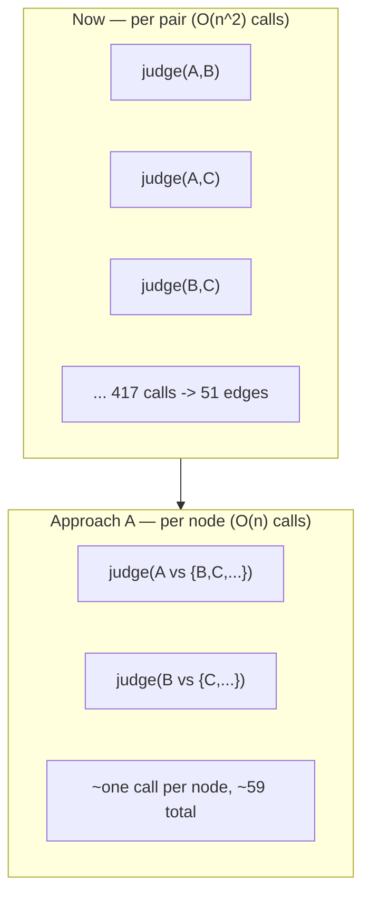

# Enrichment Speed and Token Reduction

## Summary

Make Graph Enrichment generate the same-sized graph far faster and cheaper by replacing the
per-pair prerequisite judge with one batched judge call per node, while keeping coverage
exhaustive. Measure first (LiteLLM-native token/cost plus worker-side stage timing) so the
dominant cost is fixed by evidence, and shape the per-node unit so future learner-driven
incremental growth and parallel extraction/study-item generation slot in without rework.

---

## Problem Frame

A full generation run (`scripts/seed-demo.sh`: extract 6 sources → build → enrich → generate
study items → seed learners) takes ~45 minutes. The chain is fully serial — one source extracted
at a time, enrichment at `judgeConcurrency: 4`, study items per node in sequence — and the worker
emits no per-stage timing, so the time split across stages is currently assumed, not measured.

Within enrichment the cost is quadratic by construction. `sameDomainPairs` in
`packages/application/src/runGraphEnrichment.ts` enumerates every unordered same-domain pair and
fires one forced-tool judge per pair. For the linked enrichment `a78cb25f` that is **417 judge
calls** across 59 derived nodes, and those 417 calls produced only **51 certain edges** — ~88% of
the most expensive work returns "no relation." One domain (machine learning systems, 23 nodes)
is 253 of the 417 calls, partly because both the PDF and Markdown of the same paper sit in it.

Wall-clock is the pain today (debug generation by one developer). Token spend becomes the pain at
~5× test users. The graph's current *concept count* is correct — the goal is the same graph,
generated faster and cheaper, not a smaller graph.

---

## Key Decisions

- **Approach A: node-centric batched judging, enrichment first.** Collapse the per-pair judge
  into one batched forced-tool call per node over its same-domain candidates. On the current
  manifest this takes enrichment from ~417 calls toward ~one-per-node (~59) and roughly halves
  tokens, because each concept's evidence is serialized once per call instead of once per pair.
  Other modules adopt the same pattern later.

- **Keep coverage exhaustive — no candidate pruning now.** Every relation the pairwise pass would
  evaluate is still evaluated, just regrouped. No pair is silently dropped, so the change carries
  no quality-regression risk and does not trip AGENTS rule 16's measured-veto requirement.

- **Measure before and after, using LiteLLM's own stats.** Tokens and cost attribute to pipeline
  stage through LiteLLM spend tracking (request tags → `LiteLLM_SpendLogs` → `/spend/tags`); the
  app only *labels* requests, honoring the standing "no app-level cost capture" rule. Per-stage
  wall-clock is timed in the worker, which LiteLLM cannot see.

- **The node-centric unit is also the incremental-growth primitive.** "Enrich one node against an
  existing layer" is the same operation as a batched per-node judge, so the reshape that buys speed
  now is the foundation for future learner-driven graph extension — designed for, not built now.

- **Defer embeddings; reframe them for similarity tasks, not prerequisites.** The deliberately
  small, incrementally grown graph keeps exhaustive batched judging affordable, so embeddings are
  not needed for prerequisite candidate selection. Evaluate them later only where the signal is
  similarity/recall (distractors, related-concept suggestion, missing-concept candidate recall) —
  never as the identity/merge authority (ADR-0012) and never as a silent veto (rule 16).

---

## Approach A: per-pair → per-node

Coverage is identical (every same-domain relation is still evaluated); only the call grouping
changes. Symbolic disposal (weak-edge cut → cycle removal → transitive reduction) and intrinsic
difficulty are unchanged downstream.

---

## Requirements

**Measurement (baseline-first)**

- R1. A repeatable measurement records per-stage wall-clock for a full generation run, so the
  dominant time sink is identified by evidence rather than assumption.
- R2. Per-call token usage and cost attribute to pipeline stage through LiteLLM-native spend
  tracking; the app labels each request with a stage tag and computes/stores no cost itself.
- R3. The current-state run is baselined before the enrichment change and re-measured after using
  the same instrument, so the improvement is proven against the baseline.

**Node-centric batched enrichment (Approach A)**

- R4. Enrichment judges prerequisite relations per node over its same-domain candidates in batched
  forced-tool calls, replacing the per-pair judge loop in
  `packages/application/src/runGraphEnrichment.ts`.
- R5. Coverage equals the exhaustive baseline: every same-domain relation the pairwise pass would
  evaluate is still evaluated; no candidate pair is silently dropped.
- R6. Batched judge output is validated fail-closed (AGENTS rule 6): each returned relation must
  name one of the provided candidate labels with a direction, or it degrades to `uncertain`
  (flagged, path-excluded) — never an invented edge.
- R7. The enrichment unit is structured so that enriching one new node against an existing layer is
  the natural primitive, providing the foundation for future incremental growth.
- R8. The persisted trace stays replay-deterministic (stable node/candidate ordering; results
  collected in input order regardless of completion order), matching the current contract.
- R9. The batched contract is inspected per AGENTS rule 14 against the current pairwise output on
  the existing manifest before it replaces the exhaustive path, and the old path is removed in the
  same change once parity holds (rule 18).

**Parallelism and future-module seams**

- R10. Independent enrichment work runs concurrently with a bounded, configurable degree (the
  existing `judgeConcurrency`, generalized to the per-node unit).
- R11. Extraction-over-sources and study-item generation expose an interface that admits future
  parallelism without an architectural change; the seam is planned now, the parallel
  implementation deferred.

**Deferred embeddings evaluation (Approach B)**

- R12. Embeddings are not adopted for prerequisite candidate selection in this effort.
- R13. A later, separate evaluation assesses embeddings only for non-prerequisite, similarity-driven
  tasks — distractor generation, related-concept suggestion, and learner-driven missing-concept
  candidate recall — each as a recall/generation aid, never the merge authority and never a veto.

---

## Acceptance Examples

- AE1. **Covers R5, R6.** Given a domain of 10 nodes, when the per-node batched judge runs, then
  all 45 ordered relations are still resolved, and a returned relation whose label matches neither
  provided candidate degrades to `uncertain` rather than producing an edge.
- AE2. **Covers R9.** Given the current manifest, when the batched enrichment runs against the
  recorded exhaustive baseline, then the certain-edge set matches within the rule-14 inspection
  before the exhaustive path is deleted.
- AE3. **Covers R2.** Given a full run with stage tags enabled, when `/spend/tags` is queried, then
  token and cost totals are attributable to `enrichment-judge`, `cep-extraction`, `admission`, and
  the other stages without any cost figure computed in application code.

---

## Scope Boundaries

**In scope now**

- Enrichment measurement, the per-node batched judge, bounded concurrency for the per-node unit,
  and the planned (not implemented) seams for parallel extraction and study-item generation.

**Deferred for later**

- Parallel execution of extraction-over-sources and study-item generation (seam now, implementation
  later).
- Learner-driven incremental graph growth (the per-node primitive enables it; the trigger and
  policy are out of scope here and remain governed by the TODO #5 graph-growth guard).
- The embeddings evaluation for similarity tasks (R13).
- Generate-then-verify DAG construction (one generative proposal per domain, judge as verifier) —
  held in reserve if Approach A does not bring wall-clock low enough.
- Removing the double-seeded ML fixture from a single published domain — a seed-config cleanup,
  not part of this architecture change.

---

## Dependencies / Assumptions

- LiteLLM proxy is reachable; activating spend logs requires setting `general_settings.database_url`
  (commented out today) to a Postgres DSN. `store_prompts_in_spend_logs` is already on and
  per-token cost is configured for the production aliases.
- The change reuses the existing forced-tool client and judge aliases; no new model family is
  required.
- The "start small, grow incrementally" product stance holds, keeping `n`-per-domain small — this
  is what makes deferring embeddings safe rather than a deferral of a needed capability.

---

## Outstanding Questions

**Resolve during planning**

- Batched judge schema shape: cardinality bounds on the candidate list and how to chunk a domain
  whose candidate list is large enough to pressure the prompt.
- Whether the cross-family generated-node judge (`kg-generated-prerequisite-judgment`) folds into
  the same batched call or stays a separate per-node call so a generated node is never graded by
  the DeepSeek self-loop.
- LiteLLM spend DB wiring: reuse the app Postgres instance or a separate database.

**Set from the baseline (R3), not pre-committed**

- The concrete wall-clock and token reduction targets — derived from where the measured 45 minutes
  actually goes.

---

## Sources / Research

- Code: `packages/application/src/runGraphEnrichment.ts` (`sameDomainPairs`, the per-pair judge
  loop, `mapWithConcurrency`); `packages/infrastructure-litellm/src/enrichmentAdapters.ts` (judge
  prompt); `packages/infrastructure-litellm/src/LiteLlmForcedToolClient.ts` (no usage capture
  today); `litellm/config.yaml` (`store_prompts_in_spend_logs: true`, `database_url` commented,
  per-token cost set); `scripts/seed-demo.sh` (serial generation chain).
- Measured: enrichment `a78cb25f` — 59 nodes, 417 pairwise calls, 51 certain edges; ML domain 253
  of 417.
- External: [LLM-empowered KG construction survey](https://arxiv.org/html/2510.20345v1) and
  [efficient KG/RAG construction](https://arxiv.org/html/2507.03226v2) (candidate generation +
  blocking, small→large cascades); [pointwise vs listwise reranking tradeoffs](https://zeroentropy.dev/articles/should-you-use-llms-for-reranking-a-deep-dive-into-pointwise-listwise-and-cross-encoders/)
  (batch only small candidate sets); [LiteLLM spend tracking](https://docs.litellm.ai/docs/proxy/cost_tracking)
  and [request tags](https://docs.litellm.ai/docs/proxy/request_tags).
- Constraints: AGENTS rules 3 (small core), 6 (fail-closed forced tools), 16 (no silent symbolic
  veto), 18 (delete superseded path in same change); ADR-0012 (embeddings never the merge
  authority); ADR-0019 (Graph Enrichment); `docs/plans/TODO.md` #5 (graph-growth guard).
