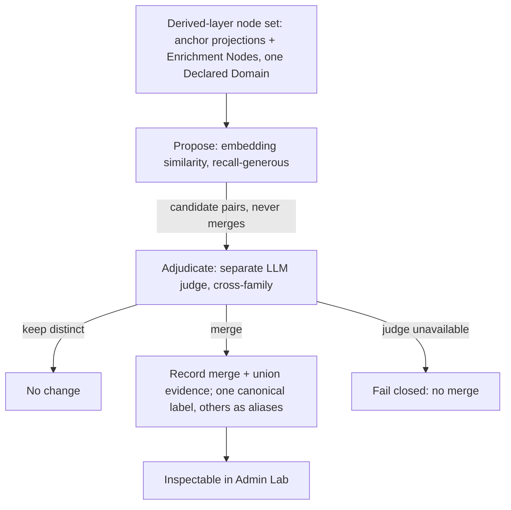

# Enrichment Concept Deduplication and Rescue Precision

## Summary

Add a measured semantic-deduplication pass and a tightened rescue-durability judge to Graph
Enrichment, so the learner-facing derived graph stops splitting one idea into incoherent
duplicate nodes and stops promoting passing asides to high-confidence prerequisites. Embeddings
*propose* same-domain near-duplicate pairs; a separate LLM adjudicator *decides* and records every
merge. Dedup operates only on the Derived Graph Layer — published Concept identity is untouched.

## Problem Frame

Real two-source enrichment run `0a7ed566` (economics + Rust) produced the same idea as two nodes,
ordered incoherently:

- the economics anchor "Propensity to Truck, Barter, and Exchange" beside the rescued
  Enrichment Node "Barter and Exchange";
- "Owner" beside "Ownership (Rust)";
- the anchor "Move semantics" beside the rescued "Function ownership mechanics: move and copy".

Exact-normalized-label identity (ADR-0015) never merges these — by design, it is conservative. Two
of the three pairs are an asserted **anchor** beside a derived **Enrichment Node**, which only
coexist in the Derived Graph Layer. The same run also showed rescue over-reach: RAII became a 0.95
prerequisite of `drop function` despite being a passing cross-language aside the source never
develops. Both defects degrade exactly what a learner sees — fragmented prerequisite chains and a
spurious gate — and neither is reachable by the deterministic identity baseline. This work is now
actionable because the blanket no-embeddings ban is withdrawn (ADR-0012, rule 20).

## Key Decisions

- KD1. **Dedup lives on the derived layer, not published canonicalization.** The majority defect is
  anchor↔Enrichment-Node, which canonicalization *cannot* merge (an Enrichment Node is never
  asserted). Published identity stays deterministic (ADR-0015) and stable (Concept IRI permanence),
  while the uncertain, judgment-based merge decision (rule 19) lives in the regenerable, reversible
  derived layer. Promoting merges into published identity is deferred and may prove unnecessary.
- KD2. **Propose and decide are separate mechanisms.** Embeddings (or, as a fallback, an LLM)
  propose near-duplicate candidate pairs for recall; a separate LLM adjudicator decides each pair
  for precision (rule 20). Raw cosine never merges. Adjudication is single-pass for now;
  self-consistency over merge decisions is deferred until merges are observed to be unstable.
- KD3. **Rescue durability is strengthened, not gated lexically.** The fix is the existing measured,
  drop-only durability judge, with a sharpened domain-neutral rubric (does the source *develop* the
  concept, or merely name it in passing?). No lexical pattern list, phrase whitelist, or
  fixture-derived term list (rules 16/17).
- KD4. **Quality is established by real-use inspection, not tests.** The pass is judged by rule-14
  inspection against the current exact-label baseline on the `0a7ed566` sources. No automated test
  asserts merge correctness or rescue-judgment content (rule 11).

## Dedup pipeline

## Requirements

### Semantic deduplication

- R1. Graph Enrichment runs a semantic-deduplication pass over the Derived Graph Layer node set for
  one published graph version — the union of anchor projections and Enrichment Nodes — scoped within
  a single Declared Domain.
- R2. A propose step surfaces candidate near-duplicate node pairs by embedding similarity. It is
  recall-oriented; a generous threshold is acceptable because precision is the adjudicator's job.
  The propose step never merges.
- R3. A separate adjudicator decides each proposed pair as merge or keep-distinct. The proposer and
  the decider are different mechanisms (rule 20); raw cosine never decides a merge.
- R4. The adjudicator is a measured LLM judge, cross-family from extraction. Its merge judgments are
  treated as non-deterministic quality (rule 19), evaluated by inspection, never by a deterministic
  proxy.
- R5. Every merge is recorded with provenance: the pair, the proposing signal and score, the
  deciding rationale, and the resulting canonical node. Recorded merges are inspectable in Admin Lab.
- R6. A merge preserves both surface labels — one becomes the canonical node label, the other(s) are
  retained as aliases — and unions the merged nodes' evidence and grounding. No source label is
  silently dropped.
- R7. The pass operates only on the derived layer. It never mutates published Concept identity,
  Concept IRIs, or the asserted graph version.

### Rescue durability

- R8. The rescue path admits a `source_mentioned` Enrichment Node only when the source substantively
  develops the concept, not when it is named once in passing as an aside.
- R9. The durability judgment is a measured, drop-only neural judge in domain-neutral rubric language
  (rules 16/17). No lexical pattern list, phrase whitelist, surface-order matcher, or
  fixture-derived term list.
- R10. The durability decision is recorded per candidate so an operator can inspect why a mention was
  rescued or dropped.

### Evaluation and governance

- R11. The pass is evaluated by real-use inspection (rule 14) against the current exact-label
  baseline, re-running enrichment on the `0a7ed566` sources, and classified PASS / FIX_FIRST /
  EXPERIMENT_ONLY / BLOCKED.
- R12. Automated tests cover only the deterministic envelope: merge recording and evidence union,
  alias preservation, the propose/decide separation, and fail-closed tool-argument validation. No
  test asserts merge correctness or judgment content (rule 11).
- R13. If the adjudicator or the propose signal is unavailable, the pass fails closed — no silent
  merge (rule 6).

## Acceptance Examples

- AE1. **Covers R3, R5, R6.** Given a node and a singular/possessive or sub-phrase surface variant
  of the same concept in one domain, when the adjudicator decides merge, then one node remains with
  the other's label as an alias, unioned evidence, and a recorded merge with rationale.
- AE2. **Covers R3, R4.** Given two lexically similar but genuinely distinct concepts, when the pair
  is adjudicated, then they are kept distinct and no merge is recorded.
- AE3. **Covers R2, R3.** Given a pair with very high embedding similarity, the pair is still routed
  to the adjudicator and is not auto-merged on the score alone.
- AE4. **Covers R8, R9.** Given a concept the source names only as a passing aside it does not
  develop, when rescue durability is judged, then the node is not rescued and the reason is recorded.
- AE5. **Covers R13.** Given the adjudicator is unavailable, when the pass runs, then no merge is
  applied and the pass fails closed.

## Scope Boundaries

### Deferred for later

- Promoting validated semantic merges into published Concept identity / canonicalization. Heavier
  and irreversible (Concept IRIs, versioning, RDF export); revisit only if derived-layer dedup
  proves the adjudicator and a concrete need appears.
- Self-consistency / K-sampling over merge decisions — add only if single-pass merges look unstable.
- The whole-set global-DAG and self-validation redesign (TODO #2/#3) and the supersession of the
  per-node batched judge — a separate brainstorm, findings parked in `docs/plans/TODO.md`.

### Outside this work

- World-law / science deterministic validators — a future experiment admissible only where a real
  formal oracle exists; never a domain-general semantic gate (rules 16/19).
- Any lexical or fixture-specific dedup or rescue rule (rules 16/17).
- Mutating the asserted graph or Concept IRIs.

## Dependencies / Assumptions

- An embedding alias wired through LiteLLM (the intended alias is `qwen3-embedding-8b`). To verify in
  planning; if absent, the propose step falls back to LLM-propose over the small per-domain node set.
- An existing measured, drop-only rescue durability judge that this work strengthens rather than
  introduces.
- A cross-family adjudicator alias (`kg-independent-judge`) for merge decisions.
- The `0a7ed566` sources are re-runnable for the baseline comparison.

## Outstanding Questions

### Deferred to planning

- Propose mechanism: embeddings vs LLM-propose, gated on whether the embedding alias is wired
  (codebase check).
- Recall threshold / top-N for the propose step — tuned by inspection, since the adjudicator owns
  precision.
- Whether validated merges should ever be promoted to published identity — a deferred decision, not
  a blocker for this work.
