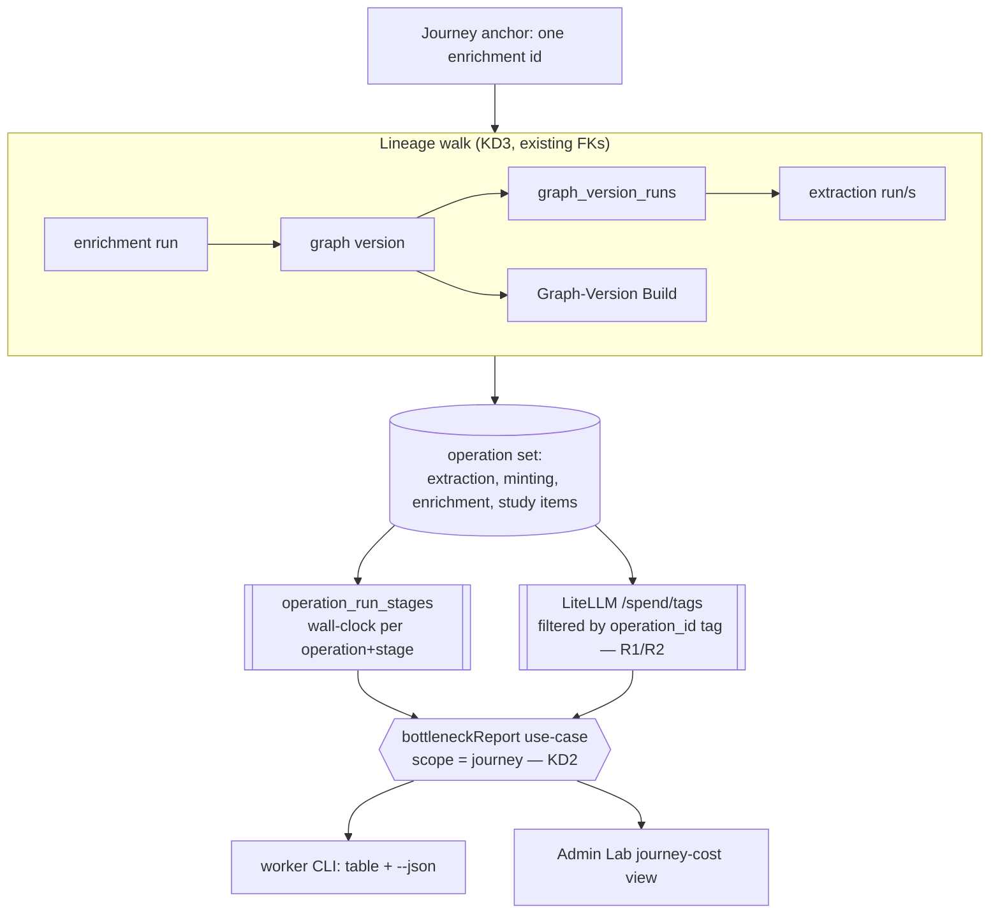

# Per-journey whole-pipeline cost measurement

## Summary

Add a per-journey whole-pipeline cost report: anchor on one document's enrichment, walk
existing lineage back through its graph version to the extraction run(s) that fed it, and roll
up tokens, calls, cost, and wall-clock per stage and per operation across that journey. The
report is a scope widening of the merged single-operation bottleneck report, and its
load-bearing new piece is run-scoped cost attribution — tagging every LLM call with its
`operation_id` so one journey's actual spend can be isolated. Measurement only; optimization is
a gated follow-up.

---

## Problem Frame

Development costs are climbing across runs, and the merged run-observability substrate
([ADR-0029](../adr/0029-persist-shared-operation-stage-timelines.md)) does not yet answer
"what did processing this document cost, end to end, and where did the money go." It surfaces
per-stage cost, but with two limits that matter here.

First, scope: the shipped `bottleneckReport` reports one `operationId` at a time. A document's
real journey spans four operations — extraction, the Graph-Version Build, enrichment, and study
items — and no surface sums them.

Second, and more fundamentally, the cost half is **not run-scoped at all**. The shipped
`bottleneckReport` joins per-operation wall-clock to a *global* per-stage-tag aggregate; its own
comment states it: cost is "the STANDING per-stage aggregate from LiteLLM (global — LiteLLM has
no per-operation scoping)." So today's report can say "stage `admission` cost $X across all runs
ever," never "this run's admission cost $X." For a per-journey cost view, the global cost half
is exactly the part that does not work.

The leading suspected cost driver is Concept Admission re-sending the whole ~23k-token document
on every candidate batch (`tmp/2026-06-25-run-timing-spike/FINDINGS.md`) — but that was measured
for latency on extraction alone, before the cost question, and has never been weighed against
enrichment's generative stages (K-sampled ordering, durability and merge judges, grounding and
study-item generation) at journey scope. The point of this work is to make that comparison real
before anyone changes a prompt.

---

## Key Decisions

- KD1. Run-scoped cost via an `operation_id` request tag. To isolate one run's spend, every LLM
  call carries its `operation_id` as a request tag alongside its existing `STAGE_TAGS` stage tag,
  so `/spend/tags` can attribute cost to a single operation execution. This reuses the
  `tags` array already on `LiteLlmForcedToolClient.call` and the `operation_id` the reporter
  already threads to call sites. Rejected: a time-window join over each stage's timeline
  timestamps — it needs no tagging but is imprecise whenever runs interleave in time.

- KD2. Generalize the existing report's scope; do not add a parallel one. `bottleneckReport`
  remains the single join use-case (the source of truth); its scope widens from one `operationId`
  to `{ operation | journey }`. A second report module would duplicate the join (rule 18).

- KD3. Resolve a journey by walking existing lineage, not by a new pipeline id. enrichment →
  graph version → `graph_version_runs` → extraction run(s), plus that version's Graph-Version
  Build. No new journey/pipeline entity and no orchestration are introduced.

- KD4. Measure-first. This work ships only measurement. The named optimization levers — admission
  payload bloat first — wait for the rollup's evidence and a rule-21 best-practices pass before
  any prompt or provider change.

- KD5. Cost is read live, never computed or stored. Per-journey scope changes which tag the spend
  read filters on, not the rule: cost comes from LiteLLM at report time, and nothing cost-related
  is persisted by the application.

---

## Requirements

### Run-scoped cost attribution

- R1. Every LLM call records its `operation_id` as a request tag in addition to its `STAGE_TAGS`
  stage tag.
- R2. A spend read returns per-operation cost filtered by `operation_id` tag. The application
  reads cost from LiteLLM and never computes or stores it.

### Per-journey rollup

- R3. The report takes one journey anchor (an enrichment id) and resolves the journey's operation
  set by walking lineage to the Graph-Version Build and the extraction run(s) that fed the
  version.
- R4. The report aggregates calls, tokens, cost, and wall-clock per (operation, stage), with
  per-operation subtotals and a journey grand total, so the dominant operation and the dominant
  stage within it are both visible.
- R5. Wall-clock comes from the durable `operation_run_stages` timeline; cost comes from LiteLLM
  scoped by `operation_id`; the two join per (operation, stage).
- R6. When LiteLLM `/spend/tags` is unavailable, the wall-clock half still renders and the cost
  half is marked unavailable, matching the shipped report's graceful degradation.

### Surfaces

- R7. The journey report and the existing single-operation report are the same use-case at
  different scopes; no second report module exists.
- R8. Two thin renderers consume the use-case: a worker CLI for code agents (per-stage table plus
  `--json`) and a read-only Admin Lab view for the admin user. No new persistence; no published
  graph state is mutated.

---

## Data flow

---

## Acceptance Examples

- AE1. Multi-run journey rollup.
  - **Covers R3, R4.** A graph version built from two extraction runs, then enriched.
  - **Given** a journey anchored on the enrichment, **when** the report runs, **then** both
    extraction runs' costs appear, attributed to the `extraction` operation, and the journey
    grand total includes both plus minting, enrichment, and study items.

- AE2. Non-LLM operation.
  - **Covers R4, R5.** The Graph-Version Build has no LLM calls.
  - **Given** the minting operation in the journey, **then** it shows wall-clock from the timeline
    and zero/absent cost, and never invents a cost row.

- AE3. LiteLLM unavailable.
  - **Covers R6.** `/spend/tags` errors at report time.
  - **Given** the cost source is down, **then** the per-operation and per-stage wall-clock still
    render and the cost column is marked unavailable rather than crashing the report.

---

## Scope Boundaries

### Deferred for later

- The actual cost-reduction work (admission payload scoping, cheaper judge providers, prefix
  caching). It follows the rollup and gets its own rule-21 root-cause pass; the rollup names the
  target.
- An aggregate-by-window / all-runs cost view. The same use-case could gain a window scope later;
  per-journey is the v1 answer to the felt pain.
- A remote HTTP renderer over the same use-case. No current consumer.

### Outside this work

- Pipeline orchestration — a single user-triggered end-to-end journey run or a durable workflow
  engine. This reads across existing lineage; it does not drive the operations.
- Any app-side cost computation or storage.
- Learner-facing cost or progress surfaces; this is operator/ingestion-facing.

---

## Dependencies / Assumptions

- Builds on the merged run-observability work: `operation_runs` / `operation_run_stages`, the
  Postgres reporter, the `bottleneckReport` use-case, the timeline read-model, and the
  `LiteLlmStageSpendAdapter`.
- Lineage is walkable in the initial migration: `graph_version_runs` links a graph version to its
  selected extraction runs; `graph_versions.base_graph_version_id` chains versions; enrichment
  runs are JSONB artifacts keyed by `graph_version_id`.
- LiteLLM `/spend/tags` returns one row per individual tag and will return rows for `operation_id`
  tags once emitted. The shipped `isStageTag` projection deliberately keeps only `STAGE_TAGS`
  members, so the journey spend read needs its own `operation_id` filter rather than that
  projection.
- `operation_id` is a uuid already available at every LLM call site through the reporter; adding
  it grows tag cardinality by one tag per run (bounded, no per-token tagging).

---

## Outstanding Questions

### Deferred to Planning

- The exact per-operation spend read: whether `/spend/tags` filters server-side by an
  `operation_id` tag or the adapter filters client-side, and whether to query once per operation
  or once per journey.
- Whether the Graph-Version Build participates in cost attribution at all. It is non-LLM today
  (zero cost rows); confirm it stays wall-clock-only rather than carrying an `operation_id`-tagged
  cost path.
- Tag hygiene: `operation_id` tags accumulate in `LiteLLM_SpendLogs` across many dev runs; whether
  any retention or `/spend/tags` query cost warrants attention.

---

## Sources / Research

- `packages/application/src/bottleneckReport.ts` — the shipped single-operation join; its own
  comment documents the global-cost limitation this work resolves.
- `packages/infrastructure-litellm/src/LiteLlmForcedToolClient.ts` (`tags` → `metadata.tags`) and
  `packages/infrastructure-litellm/src/LiteLlmStageSpendAdapter.ts` (`isStageTag` projection over
  `/spend/tags`) — the tag-emit and spend-read seams R1/R2 extend.
- `packages/infrastructure-postgres/src/migrations/0000_initial_lrnki_schema.sql` —
  `operation_runs` / `operation_run_stages`, the `graph_version_runs` lineage, and the
  `enrichment_run` artifact JSON_TABLE surface.
- `tmp/2026-06-25-run-timing-spike/FINDINGS.md` — admission's ~23k-token re-send as the leading
  known cost lever and the deferred optimization target.
- [ADR-0029](../adr/0029-persist-shared-operation-stage-timelines.md) — the merged substrate this
  generalizes.
