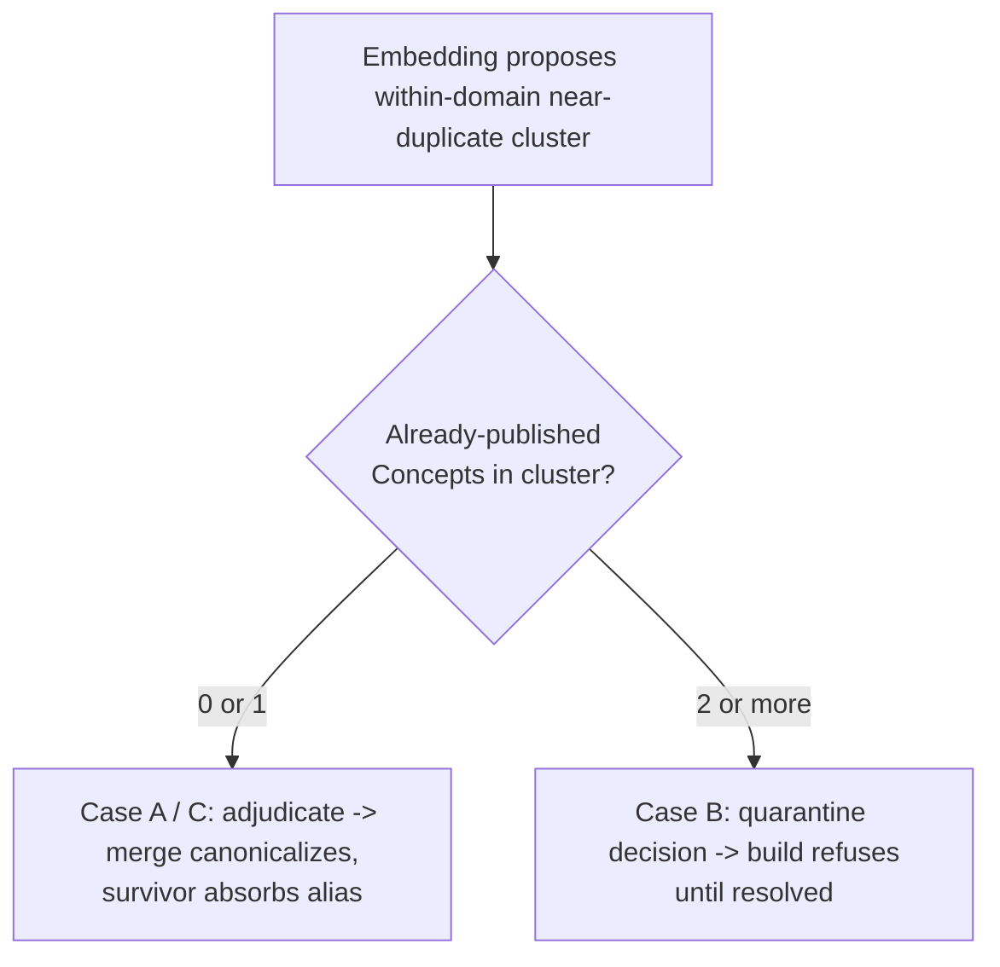

# Published-Concept Semantic Identity Resolution

## Summary

Add a semantic identity-resolution step that runs before the Graph-Version Build and
produces persisted `merge` / `distinct` / `quarantine` decisions over published Concept
candidates. Embeddings propose within-domain near-duplicates and a cross-family
adjudicator decides; the build consumes only the persisted decisions and stays
deterministic. This makes the semantic-deduplication half of ADR-0015 — already
authorized, never implemented — real for source-grounded Concepts.

---

## Problem Frame

Published Concept identity is exact-label-only. `buildGraphVersion.ts:108-168` keys a
Concept on `(declaredDomain, normalizedLabel)` and reuses it only on an exact normalized
match. Obvious same-domain synonyms therefore become separate canonical nodes: the
recorded motivating run `0a7ed566` fragmented "barter" into two Concepts and split
"owner" from "ownership."

The Derived Graph Layer already solved this for its own nodes —
`deduplicateDerivedNodes.ts` proposes near-duplicates by embedding cosine and decides each
pair with a cross-family adjudicator. But that pass deliberately refuses to touch published
identity: it never proposes an anchor↔anchor pair and refuses any cluster with two or more
anchors (`deduplicateDerivedNodes.ts:300`). So the one layer that owns canonical identity is
the one layer with no semantic resolution, and every downstream stage (enrichment ordering,
difficulty, learner paths) inherits the fragmentation.

ADR-0015 already permits the remedy — concepts may merge "through an adjudicated
semantic-deduplication decision under ADR-0012." The decision record is correct; only the
code is missing.

---

## Key Decisions

- **Resolution is a persisted propose-decide artifact consumed by a still-deterministic
  build.** The LLM/embedding work happens before publication and writes recorded decisions;
  `buildGraphVersion.ts` reads decisions and mints identity from them. The build never makes
  a model call, so ADR-0017 holds unchanged. No ADR is rewritten — ADR-0015 and ADR-0012
  already describe this path.

- **Publication state decides what a merge is allowed to do.** A merge that does not retire
  an already-minted IRI is safe and automatic; a merge that would collapse two
  already-published Concepts is destructive and is refused. Concretely: case A (a new run
  candidate ≈ one already-published base Concept) and case C (two new candidates ≈ each
  other) canonicalize normally; case B (a cluster containing two or more already-published
  Concepts) routes to the existing quarantine gate and blocks the build until resolved. This
  preserves ADR-0010 append-only publication and ADR-0015 mint-once-and-never-re-derive, and
  mirrors the derived layer's own "two anchors ⇒ refuse the cluster" rule.

- **Embeddings propose, the adjudicator decides, raw cosine never merges, candidates are
  domain-scoped.** This is the ADR-0012 contract already proven in the derived-node pass,
  applied to published Concepts. Cross-domain same-label pairs stay separate as homographs
  (ADR-0015) and are never proposed.

- **This pass complements derived-node dedup; it does not replace or duplicate it.** Resolving
  published identity at build time means the derived layer's anchors are already canonical,
  so this closes exactly the anchor-collision case the derived pass refuses to decide.

- **The goal is canonicalization correctness, not performance.** Fewer published Concepts
  shrink every downstream prompt, which is a welcome side-effect, but latency and cost work
  is owned by the in-flight pipeline-cost effort and is out of scope here.

---

## Requirements

**Candidate proposal**

- R1. Candidate proposal runs per Declared Domain over the union of the base version's
  published Concepts and the selected runs' admitted-core candidates, so a new source can
  merge into an existing published Concept and two new candidates can merge with each other.
- R2. Each candidate's embedding text includes its canonical label, aliases, and definition
  span — richer than the derived pass's current label-plus-first-evidence text — so synonymy
  and abbreviation are recoverable.

**Adjudication and recorded decisions**

- R3. A cross-family adjudicator decides every proposed pair; cosine similarity orders and
  bounds proposals but never makes a merge.
- R4. Every decision is persisted with both candidate identities, their labels, aliases,
  definitions, and source evidence, the proposed reason, the outcome (`merge` / `distinct` /
  `quarantine`), and the deciding model and configuration.
- R5. Every merge is recorded and inspectable, consistent with ADR-0015.

**Publication-state handling**

- R6. Case A and case C merges canonicalize automatically: the survivor keeps (or mints) the
  IRI and absorbs the other surface label as an alias.
- R7. A cluster containing two or more already-published Concepts is case B: it produces a
  `quarantine` decision and the build refuses to publish until the conflict is resolved,
  reusing the existing quarantine gate at `buildGraphVersion.ts:70`.

**Build consumption and failure**

- R8. The Graph-Version Build consumes only persisted identity decisions and performs no
  model calls, preserving the deterministic, replayable build of ADR-0017.
- R9. The pass fails closed: an embedding failure yields no merge for that domain and is
  surfaced; an adjudicator error degrades that pair to `distinct`; a failure never silently
  changes authoritative identity (ADR-0012).

**Inspection**

- R10. Decisions are inspectable through the Admin Lab read-model (ADR-0011); a human-override
  workflow is deferred — quarantine plus re-run is the v1 escape hatch.

---

## Acceptance Examples

- AE1. Covers R3, R6. Given a base Concept "ownership" and a new run candidate "owner" in the
  same Declared Domain, when the adjudicator returns `merge`, then the published graph carries
  one Concept keeping the base IRI with "owner" recorded as an alias and a persisted merge
  decision.
- AE2. Covers R6. Given two new candidates "barter" and "bartering" in one run and one Declared
  Domain, neither yet published, when the adjudicator returns `merge`, then a single Concept is
  minted with both surface labels and one alias.
- AE3. Covers R7. Given two already-published Concepts that the adjudicator judges identical,
  when the build runs, then a `quarantine` decision is recorded and the build refuses to
  publish rather than retiring either minted IRI.
- AE4. Covers R3, R9. Given a near-duplicate pair above the cosine floor that the adjudicator
  judges genuinely distinct, when resolution runs, then no merge occurs and a `distinct`
  decision is recorded.
- AE5. Covers R9. Given the embedding service fails for one Declared Domain, when resolution
  runs, then that domain produces no merges, the failure is surfaced, and other domains are
  unaffected.

---

## Success Criteria

- The run-`0a7ed566`-class fragmentation collapses on a real re-run: same-domain synonyms the
  adjudicator judges identical publish as one Concept.
- Precision holds: no wrong merge of genuinely distinct same-domain Concepts, evaluated by
  real-source inspection under ADR-0013 and the real-use quality-evaluation skill, not a green
  suite.
- Case B reliably quarantines: a constructed two-already-published collision blocks the build
  instead of silently retiring an IRI.
- The cosine floor and proposal bounds are calibrated against the embedding model's own scale
  on real fixtures, the way the derived-node pass was, rather than assumed.

---

## Scope Boundaries

- Performance and latency reduction — owned by the in-flight pipeline-cost work; only the
  incidental prompt-shrinking side-effect lands here.
- IRI retirement and redirect machinery — case B is refused, not resolved; true
  cross-published-Concept consolidation is a deliberate later identity decision if it ever bites.
- Cross-domain merges — same-label-across-domains stays a flagged homograph (ADR-0015).
- Evidence retrieval before CEP extraction — measured and de-prioritized already (in-window
  mis-picks, zero window misses); revisiting it needs new evidence, not this brief.
- Changes to the derived-node dedup pass — it already exists and is complementary.
- A human-override UI for identity decisions — deferred per R10.

---

## Dependencies / Assumptions

- Reuses the existing embedding and cross-family-adjudicator capability proven in
  `deduplicateDerivedNodes.ts` (qwen3-embedding-8b for proposal; the `kg-independent-judge` /
  gpt-oss-120b class for adjudication), and the existing quarantine gate and refinement-decision
  plumbing in `buildGraphVersion.ts`.
- Resolution needs the base version's published Concepts alongside the selected runs' core
  candidates, both already available to the build.
- Assumes current real fixtures stay small same-domain sets, so per-domain proposal volume is
  modest; if a domain ever grows large, proposal bounding (top-N per node, as the derived pass
  already does) is the lever, not this brief.
- Assumes case B is rare today — most duplication is new-candidate collapse — so refusing it
  costs little operator friction.

---

## Outstanding Questions

**Deferred to planning**

- Whether resolution is a standalone operation or a pre-build step inside build orchestration,
  given the build is its only consumer.
- Whether to reuse the derived pass's adjudication port or add a dedicated concept-identity
  adjudication port, since the inputs differ (published CEP evidence vs derived-node grounding).
- Exact cosine floor, top-N proposal bound, and adjudication concurrency — a calibration probe
  on real fixtures, mirroring the derived pass's tuning.
- Transitive cluster shape when a single cluster mixes one already-published Concept, several new
  candidates, and a second already-published Concept — the case-B rule classifies it by
  already-published count (≥2 ⇒ quarantine), and planning confirms the union-find handles it.

---

## Sources

- `packages/application/src/buildGraphVersion.ts:108-168` — current exact-label published
  identity and the IRI mint-once path; `:70` — the quarantine gate this brief reuses.
- `packages/application/src/deduplicateDerivedNodes.ts` — the propose-decide precedent and the
  `:300` "refuse a multi-anchor cluster" rule this brief mirrors for published identity.
- `packages/application/src/runGraphEnrichment.ts` — the downstream consumer whose anchors
  become canonical once this pass runs.
- ADR-0010 (atomic append-only publication), ADR-0012 (embeddings propose, never merge),
  ADR-0015 (deterministic cross-source identity, semantic-dedup authorized), ADR-0017
  (deterministic LLM-free build).
