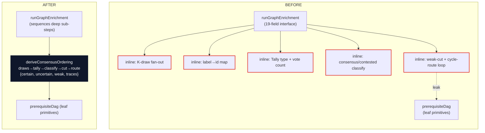
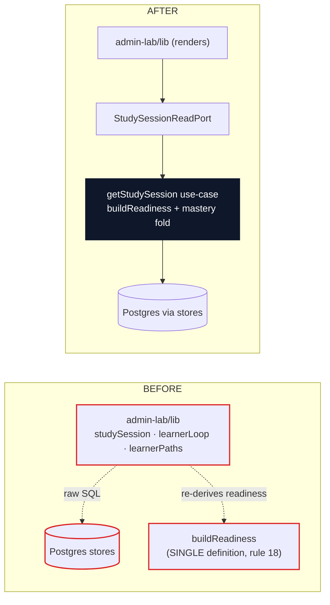
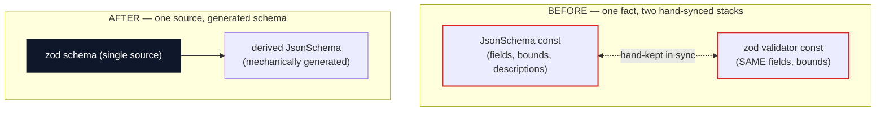
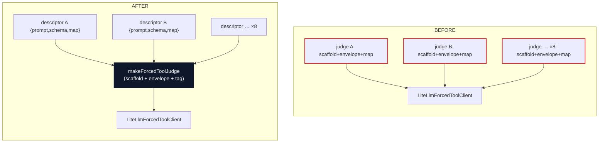

# Architecture deepening opportunities — 2026-06-27

Surfaced by `improve-codebase-architecture`. Each candidate is a **deepening**: turn a shallow
module (interface nearly as complex as the implementation) or a leaked seam into a deep one (a lot
of behaviour behind a small interface), for **locality** (one place to change, one place bugs
concentrate) and **leverage** (one interface paying back across N callers and tests).

Vocabulary is exact on purpose. Architecture terms — *module, interface, implementation, depth,
deep, shallow, seam, adapter, leverage, locality* — come from the skill's `LANGUAGE.md`. Domain
terms — *Graph Enrichment, Derived Graph Layer, CEP, Learner Path, Learner State, Inspection Read
Model, forced named tool schema* — come from `CONTEXT.md`.

**Legend:** solid box = module · dashed line = seam · red edge = leakage across a seam · thick dark
box = deep module.

This is *not* an "add more seams" review. 34 of 38 ports already have exactly one production
adapter (hypothetical seams kept honest by test fakes), so the friction is the opposite: **deep
modules trapped inside an orchestrator**, **shallow seams stamped out repeatedly**, and **one fact
represented twice**. Three of the four candidates are live violations of the project's own rules
(AGENTS rule 18, ADR-0027), not stylistic preferences.

---

## Candidate 1 — Extract the consensus-ordering module from the Graph Enrichment orchestrator

`Strong` · `in-process`

**Files**

- `packages/application/src/runGraphEnrichment.ts` (interface `135–185`; inlined engine `359–506`)
- `packages/application/src/prerequisiteDag.ts` (leaf primitives only)

**Problem** — `runGraphEnrichment` advertises a 19-field interface (several ports it only forwards)
and inlines ~150 lines of K-sampled consensus-ordering policy that `prerequisiteDag` only supplies
leaf primitives for.

**Solution** — Lift the draws → tally → classify → weak-cut → cycle-route policy into one deep
`deriveConsensusOrdering` module behind a small interface; the orchestrator sequences deep sub-steps
instead of micromanaging primitives.

**Before / After**

**Wins**

- locality: ordering policy in one module
- leverage: one interface, replay-testable
- interface absorbs the inline `Tally`
- K-sampling gets a real test surface
- orchestrator stops threading 19 fields

> The consensus engine is the densest, least-testable block in the slice. Its inputs are already
> clean (`byDomain`, `config`, `prerequisiteOrdering` port) and its output is a tidy
> `{certainEdges, uncertainEdges, weakEdges, traces}` — a deep module trying to escape.

---

## Candidate 2 — Move the Learner Study projection behind a use-case + Inspection Read port

`Strong` · `ports & adapters`

**Files**

- `apps/admin-lab/src/lib/studySession.ts` (raw stores `14`; own `withClient` `32–42`;
  `unmetPrerequisites` `49–54`; `selectScopedFrontier` `91–105`)
- `apps/admin-lab/src/lib/learnerLoop.ts` (`buildMasteryMap` `145–151`; raw SQL `262–295`)
- `apps/admin-lab/src/lib/learnerPaths.ts` (raw SQL `64–124`)
- `packages/application/src/adaptivePathProjection.ts` (`buildReadiness` `30–49` — the declared
  single definition of "ready")
- `packages/application/src/responseLogLearnerState.ts` (`loadResponseLogLearnerState` `38–51`)

**Problem** — The admin-lab UI issues raw SQL and re-derives learner-facing readiness/mastery,
duplicating the application's declared *single definition of "ready"* and crossing the Inspection
Read Model seam.

**Solution** — Add a `getStudySession` learner-projection use-case in `application` (reusing
`buildReadiness` / `loadResponseLogLearnerState`) and read it through an inspection port; the UI
calls one interface and renders.

**Before / After**

**Wins**

- locality: readiness in one module
- leverage: one use-case, N surfaces
- UI stops issuing raw SQL
- deletes duplicated frontier ranking
- two definitions of "ready" can't drift

> ⚠️ **Backed by the project's own rules.** `CONTEXT.md:154–158` defines an *Inspection Read Model*
> as returned by an inspection port and distinct from a learner projection "behind an application
> use-case" (avoid "raw UI query, learner projection"). `adaptivePathProjection.ts:25–29` calls
> `buildReadiness` "The SINGLE definition of 'what is ready' (AGENTS rule 18)" — yet
> `studySession.ts:49–105` re-derives it. This is a live ADR-0027 + rule-18 violation with a drift
> risk, not a preference.

---

## Candidate 3 — Single-source the forced-tool schemas

`Strong` · `in-process`

**Files**

- `packages/infrastructure-litellm/src/toolSchemas.ts` (851 lines; e.g. `intrinsicDifficultySchema`
  `465–482` mirrored by `intrinsicDifficultyValidator` `484–487`)

**Problem** — Each forced tool declares a JSON Schema *and* a parallel hand-synced zod validator —
two representations of one fact (33 `additionalProperties:false` mirrored by 43 `.strict()`), plus
the block-evidence shape inlined in zod 8 times.

**Solution** — Declare each tool once (zod) and mechanically derive the JSON Schema at the seam
(e.g. `zod-to-json-schema`); the forced-tool schema and the validator can no longer drift.

**Before / After** (mass diagram — interface vs implementation surface)

**Wins**

- one source per tool shape
- schema and validator cannot drift
- rule 18: second representation generated
- bounded builders collapse to one helper
- ~840-line file mostly absorbed

> ⚠️ **ADR-0006 preserved.** The call stays a forced *named* tool with a JSON schema; only the
> schema's *source* changes (generated from zod, not hand-written beside it). AGENTS rule 18:
> "any second representation must be mechanically generated" — this candidate is that rule applied.
> The three runtime-bounded builders (`buildPrerequisiteOrderingSchema(n)`, the two
> `…ForCandidateKeys(...)`) become one `bounded()` helper and the schema/validator asymmetry
> (enum enforced only JSON-side) disappears.

---

## Candidate 4 — Collapse the judge ports/adapters behind one forced-tool-judge module

`Worth exploring` · `ports & adapters`

**Files**

- `packages/ports/src/index.ts` (8 single-method judge ports: lines `93, 115, 136, 155, 170, 199,
  332, 489`)
- `packages/infrastructure-litellm/src/{extractionAdapters,enrichmentAdapters,dedupAdapters}.ts`
  (~16 near-identical adapters)
- `packages/infrastructure-litellm/src/extractionAdapters.ts:606–617` (`groundedJudgment` — already
  an orphaned shared-helper attempt, dead code)

**Problem** — Eight single-method LLM-judge ports and ~16 adapters repeat the same scaffold (model
const, `messages:[{system},{user}]` envelope ×19, `tags:[…]` ×19) — shallow seams stamped out.

**Solution** — One deep `makeForcedToolJudge({ descriptor, prompt, map })` helper; each judge
declares only its prompt + schema + 1-line mapping. Keep a distinct port only where a second adapter
or fail-closed grounding logic justifies the seam.

**Before / After** (call-graph collapse)

**Wins**

- deletes ~120 lines of scaffold
- leverage: one helper, N judges
- fewer hypothetical seams to learn
- removes orphaned `groundedJudgment`

> ⚠️ **ADR-0006 preserved + scope caveat.** Each judge stays a forced named tool. Only ~10% of the
> adapter family is mechanical boilerplate; prompts (~70%) and fail-closed grounding re-checks
> (`extractionAdapters.ts:418–433, 506–521, 582–602`) are essential and stay as the per-judge
> `prompt`/`map`. So this is leverage at the margins, not a large deletion — worth exploring, below
> Candidates 1–3. The bigger duplication in this family is Candidate 3's schema twin, not the call
> envelope.

---

## Top recommendation

**Candidate 2 — move the Learner Study projection behind a use-case + Inspection Read port.**

It is the one place the review's central thesis is actively violated: a learner-facing projection
with adaptation compute and raw SQL lives in the UI app, crossing the *Inspection Read Model* seam
(ADR-0027) and duplicating the declared single definition of "ready" (AGENTS rule 18). It is the
strongest combination of **locality** (readiness/mastery folds collapse into one module), **leverage**
(one use-case feeding every study surface), and risk reduction (two definitions of "ready" can
silently diverge between the path a learner walks and the operator's view). Candidate 1 (the trapped
consensus engine) is a close second on pure depth.
