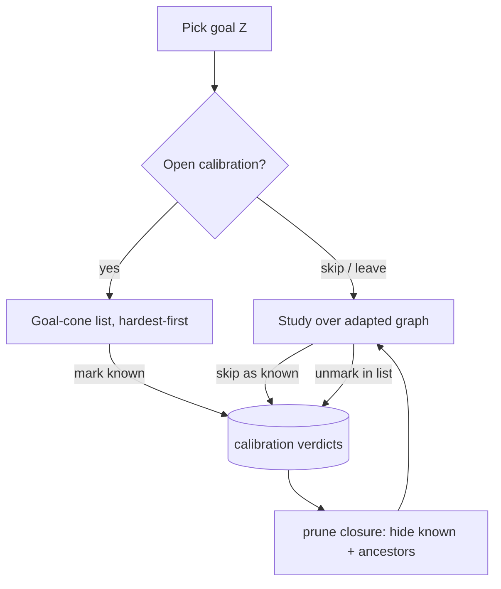

# Calibration as a separate pre-study flow

## Summary

Make calibration a separate, optional pre-study surface: a single managed list of a goal's concepts,
ordered hardest-first by intrinsic difficulty, where the learner marks what they already know. A
"known" mark prunes that concept's prerequisite closure, dropping the implied-known concepts from the
list and hiding the whole known closure from the adapted graph. Marks are self-report only (label +
neutral descriptor, never a question or answer), so calibration can no longer leak study answers.
Unmarking is re-calibration; a "skip as known" button on study items is a second door into the same
known set.

---

## Problem Frame

Calibration today is a branch of the study surface, not a flow of its own. A non-mastered concept with
a `self_assessment` item opens a card that reveals the answer and then asks "did you know it?" — while
the *same* concept also carries an `option_select` study item that tests it. One item spoils the other:
calibrating a concept reveals the answer the learner is later asked to recall.

Two more gaps follow from the same place. Concepts the learner marks known are credited as mastered but
still rendered in the adapted graph, so the graph never gets smaller as the learner declares prior
knowledge. And intrinsic difficulty is computed for every derived node yet drives nothing in learner
behavior — it exists only as an inspectable `EXPERIMENT_ONLY` signal with no consumer, even though it is
exactly the signal that should decide how much calibration a learner needs.

---

## Key Decisions

- **Self-report modality, no answer reveal.** A calibration probe shows only the concept's canonical
  label and a short neutral descriptor pulled from existing grounding — never a study question or its
  answer. This dissolves the answer-leak by construction rather than guarding against it.

- **Managed leveraged list, not a sequential probe.** Calibration is a single list the learner scans
  and toggles, not a one-at-a-time flow with queue state. It is the simplest surface that supports fast
  mark *and* unmark, and unmarking *is* re-calibration, so there is no separate reset action.

- **Difficulty leverages the list via the closure.** The list is ordered hardest-first, and marking a
  concept known prunes its prerequisite closure. The learner only ever marks a few high-difficulty
  concepts and the easy prerequisites fall away — so intrinsic difficulty determines how few marks are
  needed. This is where "calibration quantity from difficulty" lives.

- **Goal-scoped session, graph-wide verdicts.** A calibration session lists one goal's prerequisite
  cone, but verdicts persist per derived node, so a concept marked known while pursuing one goal stays
  known for any later goal whose cone includes it.

- **Reuse the existing pure closure core.** List-shrinking and graph-hiding both use the existing
  trusted-edge down-closure and mastery composition in `packages/application/src/calibrationClosure.ts`
  — one definition of "known via calibration," consumed by both surfaces (AGENTS rule 18).

- **Delete the `self_assessment` study-item type.** It exists only to power the intermixed calibration
  card; concept-level self-report needs no generated item. Removing it collapses study items to
  option-select only and is a same-change cleanup of its generation, storage, read, and the
  [ADR-0026](../adr/0026-typed-study-item-bank.md) / [CONTEXT.md](../../CONTEXT.md) language that defines
  it.

- **Calibration stays `EXPERIMENT_ONLY`.** Difficulty is used only to order and leverage the list; it is
  not promoted to a calibrated learner-modeling signal, and no IRT/KT/population model is introduced
  ([ADR-0024](../adr/0024-learner-neutral-intrinsic-difficulty.md)).

---

## Requirements

**Calibration surface**

- R1. Provide a calibration surface for a chosen goal: a single list of the goal's trusted-edge
  prerequisite cone plus the goal itself, each row a concept showing its canonical label and a short
  neutral descriptor, with a known/unknown toggle. No question or answer text appears on the surface.
- R2. Order the list by intrinsic difficulty, hardest first.
- R3. Toggling a concept to "known" records a `known` calibration verdict; toggling it back returns it
  to the default un-calibrated state. Verdicts are mutable and persist per derived node, independent of
  which goal's session recorded them.
- R4. Marking a concept known hides its prerequisite-ancestors from the list as implied-known; the
  marked concept itself stays in the list, shown as known and able to be unmarked.
- R5. Calibration is optional. A learner may open the surface, mark any subset, leave at any point, or
  never open it; zero verdicts prune nothing.
- R6. Re-calibration is the same surface reopened — marking and unmarking at any time, with no separate
  reset step.

**Adapted-graph integration**

- R7. The adapted graph hides the full known closure (each marked-known concept and its pruned
  prerequisite-ancestors), rendering only the concepts still to learn toward the goal plus the goal.
- R8. Hiding and pruning are learner-projection compute only; they never mutate the published graph or
  the Derived Graph Layer.

**Study-surface integration**

- R9. Each study item carries a "skip as known" action that records a `known` verdict for its concept,
  with the same prune-and-hide effect as marking it on the calibration surface, and reveals no answer.
- R10. The study surface no longer presents calibration as a branch of a study item; the intermixed
  reveal-then-"I knew it" card is removed and calibration lives only on the separate surface.

**Cleanup and trust**

- R11. Remove the `self_assessment` study-item type across generation, storage, and read paths; study
  items become option-select only.
- R12. Source the neutral descriptor from existing grounding (anchor CEP definition/mention, or the
  Generated Grounding Bundle for an `llm_grounded` node), honoring provenance: source descriptors keep
  the verbatim floor, generated descriptors stay labeled generated. No new generation pipeline.
- R13. Calibration and intrinsic difficulty remain `EXPERIMENT_ONLY`; difficulty informs only list
  ordering and closure leverage.

---

## Key Flows

- F1. Calibrate then study.
  - **Trigger:** Learner picks a goal and opens calibration.
  - **Steps:** The list shows the goal-cone concepts hardest-first; the learner marks the ones they
    know; each mark prunes that concept's prerequisite-ancestors from the list; the learner leaves
    calibration and studies.
  - **Outcome:** The adapted graph renders only what is left to learn toward the goal.
  - **Covers:** R1, R2, R4, R7.

- F2. Skip as known during study.
  - **Trigger:** A study item is shown for a concept the learner already knows.
  - **Steps:** The learner clicks "skip as known"; a `known` verdict is recorded; the concept and its
    closure are hidden and the frontier advances. No answer is shown.
  - **Outcome:** The same known set as the calibration surface, reached inline.
  - **Covers:** R3, R7, R9.

- F3. Re-calibrate.
  - **Trigger:** The learner reopens calibration after realizing a mark was wrong.
  - **Steps:** The learner unmarks a previously-known concept; it and its pruned prerequisite-ancestors
    return to the list and to the adapted graph.
  - **Outcome:** The graph reflects the corrected knowledge state.
  - **Covers:** R3, R6, R7.

---

## Acceptance Examples

- AE1. Closure prune.
  - **Covers R4, R7.**
  - **Given** goal Z with prerequisite chain A → B → Z (A is a prerequisite of B, B of Z),
  - **When** the learner marks B known,
  - **Then** A is hidden from the list as implied-known, B stays in the list shown as known, and the
    adapted graph hides both A and B.

- AE2. Optional, no-op when empty.
  - **Covers R5.**
  - **Given** a goal with no calibration verdicts,
  - **When** the learner opens the adapted graph,
  - **Then** every cone concept is visible and the full path to the goal renders.

- AE3. Inline skip reveals nothing.
  - **Covers R9.**
  - **Given** a frontier study item for concept C,
  - **When** the learner clicks "skip as known,"
  - **Then** a `known` verdict is recorded for C, C and its closure are hidden, and no answer was
    displayed.

- AE4. Walking back an implied-known concept (v1 cost).
  - **Covers R4, R6.**
  - **Given** the learner marked B known, which hid prerequisite A,
  - **When** the learner later finds they do not know A,
  - **Then** they unmark B to return both A and B to the list, then re-mark only what they know — A is
    not individually unmarkable while implied-known.

- AE5. Verdicts carry across goals.
  - **Covers R3.**
  - **Given** the learner marked B known while calibrating for goal Z,
  - **When** they later calibrate for goal Y whose cone includes B,
  - **Then** B already appears as known in Y's list.

---

## Scope Boundaries

- Adaptive / sequential one-at-a-time probing (probe hardest, descend on "don't know," stop when the
  queue empties) — deferred; revisit if the list proves insufficient.
- Individually unmarking a transitively-implied (hidden) prerequisite without unmarking its dependent —
  deferred (AE4 documents the v1 path).
- Flow-state remediation: logging wrong answers to propose easier related concepts — future; the
  `struggledNodes` / `suggestRestorations` seam in `packages/application/src/calibrationClosure.ts`
  already exists for it.
- A two-column Known / To-learn shuttle UI — a single-list toggle is chosen instead.
- Promoting intrinsic difficulty or introducing learner modeling (IRT/KT/population) out of
  `EXPERIMENT_ONLY` — out, per [ADR-0024](../adr/0024-learner-neutral-intrinsic-difficulty.md).

---

## Dependencies / Assumptions

- Every derived node carries an intrinsic difficulty score (`concept_difficulties`). Nodes missing a
  score sort last (treated as lowest difficulty), matching the existing default in
  `classifyAdaptedNodes`.
- A short neutral descriptor is derivable from existing grounding for both anchor and enrichment nodes
  without exposing any study question or answer.
- List membership and pruning follow the established trust model: the trusted-edge (`!uncertain`) cone
  over all derived node kinds, matching `pruneClosure` and `classifyAdaptedNodes`.
- Removing the `self_assessment` type updates its typed-union definition in
  [ADR-0026](../adr/0026-typed-study-item-bank.md) and the related
  [CONTEXT.md](../../CONTEXT.md) language in the same change (AGENTS rule 18).
- The calibration surface and the adapted-graph hide are learner-projection use-cases, not raw UI
  queries ([ADR-0027](../adr/0027-serve-inspection-through-read-model-ports.md)); note the existing
  study-projection drift recorded as Candidate 2 in
  [2026-06-27-architecture-deepening-opportunities.md](./2026-06-27-architecture-deepening-opportunities.md).

---

## Outstanding Questions

**Deferred to planning**

- The exact grounding field(s) and length bound for the neutral descriptor (definition passage vs
  mention vs a trimmed generated line).
- Whether "skip as known" warrants a lightweight undo/confirm affordance, given unmarking already lives
  on the calibration surface.

---

## Sources / Research

- Intermixed calibration card and the reveal path: `apps/admin-lab/src/lib/studySession.ts:62-83`.
- Pure calibration core to reuse (prune, compose, struggle/restoration seams):
  `packages/application/src/calibrationClosure.ts`.
- Adapted-graph classification and the single definition of readiness:
  `packages/application/src/adaptivePathProjection.ts`.
- Mutable per-node verdict store: `calibration_verdicts` in
  `packages/infrastructure-postgres/src/migrations/0000_initial_lrnki_schema.sql:713-719`.
- `self_assessment` study-item type to remove: same migration `:625-646`; generation in
  `packages/application/src/generateStudyItemBank.ts`.
- Governing decisions: [ADR-0024](../adr/0024-learner-neutral-intrinsic-difficulty.md),
  [ADR-0026](../adr/0026-typed-study-item-bank.md),
  [ADR-0027](../adr/0027-serve-inspection-through-read-model-ports.md).
