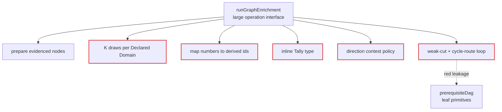
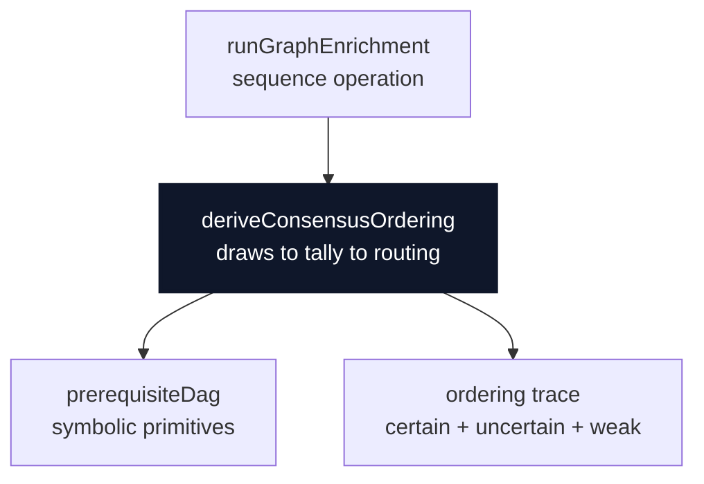
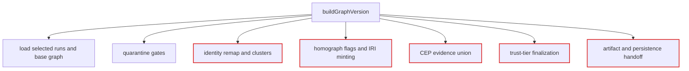
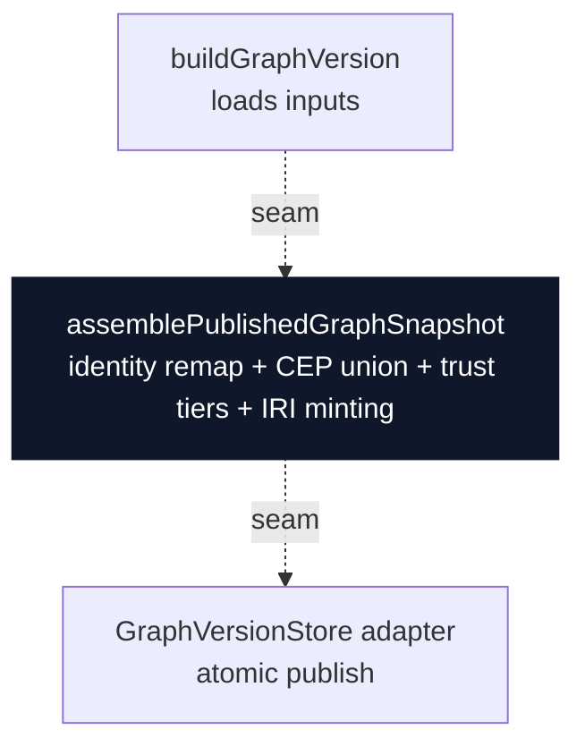
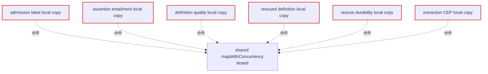
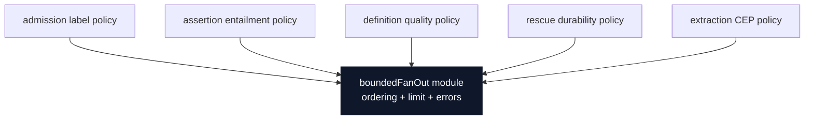
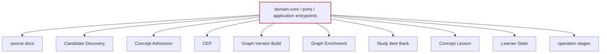
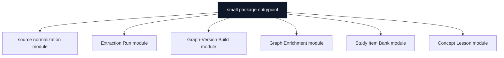
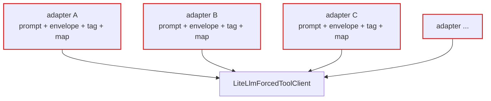
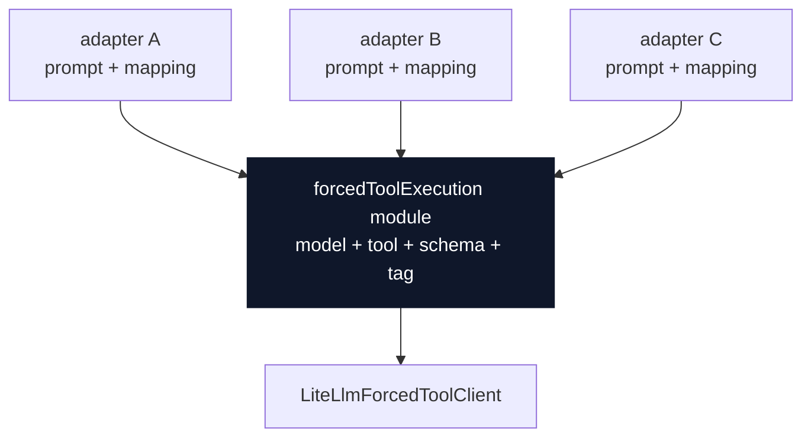

# Architecture Review — 2026-06-29

Surfaced by `improve-codebase-architecture`. Each candidate is a **deepening**: turn a shallow
module into a deep one for **locality** and **leverage**.

Architecture terms use the skill vocabulary: **module**, **interface**, **implementation**,
**depth**, **deep**, **shallow**, **seam**, **adapter**, **leverage**, **locality**.
Domain terms use [CONTEXT.md](../../CONTEXT.md): **Graph Enrichment**, **Graph-Version Build**,
**CEP**, **Derived Graph Layer**, **Study Item Bank**, **Concept Lesson**, **Learner State**.

Legend: solid box = module · dashed line = seam · red edge = leakage · dark box = deep module.

## Candidate 1 — Extract the Graph Enrichment consensus-ordering module

`Strong` · `in-process`

**Files**

- `packages/application/src/runGraphEnrichment.ts`
- `packages/application/src/prerequisiteDag.ts`
- `packages/ports/src/index.ts`

**Problem** — Graph Enrichment is shallow here: the operation interface also owns the whole
consensus-ordering implementation.

**Solution** — Deepen the ordering policy into one module that turns ordered draws into committed,
uncertain, weak-cut, and trace records.

**Before**

**After**

**Benefits**

- locality: one ordering policy
- leverage: one replay surface
- orchestrator stops tallying
- tests hit one interface

## Candidate 2 — Extract the Graph-Version publication assembly module

`Strong` · `in-process`

**Files**

- `packages/application/src/buildGraphVersion.ts`
- `packages/application/src/resolveConceptIdentity.ts`
- `packages/infrastructure-postgres/src/PostgresStores.ts`

**Problem** — Graph-Version Build mixes orchestration with publication assembly, so the pure policy
has poor locality.

**Solution** — Deepen publication assembly behind one pure module; the use-case loads, calls it, then
persists.

**Before**

**After**

**Benefits**

- locality: publication policy
- leverage: pure replay tests
- CEP union isolated
- IRI minting contained

## Candidate 3 — Single-source bounded concurrent fan-out

`Worth exploring` · `local-substitutable`

**Files**

- `packages/application/src/mapWithConcurrency.ts`
- `packages/application/src/executeExtractionRun.ts`
- `packages/application/src/applyAdmissionLabelJudge.ts`
- `packages/application/src/applyAssertionEntailmentJudge.ts`
- `packages/application/src/applyDefinitionPassageQualityJudge.ts`
- `packages/application/src/applyRescuedDefinitionQualityJudge.ts`
- `packages/application/src/applyRescueDurabilityJudge.ts`

**Problem** — Seven bounded-map implementations carry nearly the same interface, but their edge
behavior can drift.

**Solution** — Use one tested fan-out module and keep each caller's fail-open or fail-closed policy
beside the domain transform.

**Before**

**After**

**Benefits**

- locality: concurrency semantics
- leverage: one test surface
- removes deferred copies
- failure ordering explicit

## Candidate 4 — Slice package barrels by project concepts

`Worth exploring` · `in-process`

**Files**

- `packages/domain-core/src/index.ts`
- `packages/ports/src/index.ts`
- `packages/application/src/index.ts`

**Problem** — The package entrypoints are shallow: their interface exposes almost every project
concept at once.

**Solution** — Move source, extraction, publication, enrichment, study, lesson, and operation facts
into concept-owned modules.

**Before**

**After**

**Benefits**

- locality: concept facts
- leverage: smaller imports
- AI navigation improves
- barrels stop leaking

## Candidate 5 — Deepen forced-tool adapter execution

`Speculative` · `ports & adapters`

**Files**

- `packages/infrastructure-litellm/src/extractionAdapters.ts`
- `packages/infrastructure-litellm/src/enrichmentAdapters.ts`
- `packages/infrastructure-litellm/src/dedupAdapters.ts`
- `packages/infrastructure-litellm/src/groundingGenerationAdapters.ts`
- `packages/infrastructure-litellm/src/studyItemGenerationAdapters.ts`
- `packages/infrastructure-litellm/src/conceptLessonGenerationAdapters.ts`
- `packages/infrastructure-litellm/src/intrinsicDifficultyAdapters.ts`

**Problem** — The forced-tool adapters repeat execution scaffolding, while the valuable
implementation is the prompt and mapping.

**Solution** — Deepen the repeated execution path and leave each adapter to own only its prompt,
schema choice, and result mapping.

**Before**

**After**

**Benefits**

- leverage: one caller path
- locality: tag semantics
- prompts remain visible
- less adapter boilerplate

## Top Recommendation

Start with **Candidate 1 — Extract the Graph Enrichment consensus-ordering module**.

It is the highest-leverage deepening: real policy is already concentrated in one dense block, tests
would gain one replayable interface, and the operation module would stop owning the consensus
implementation.
