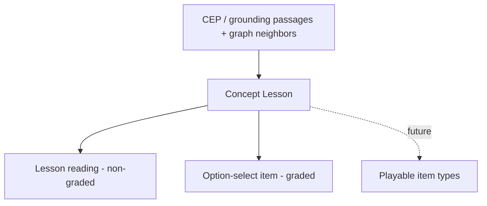

# Concept Lesson — a grounded teaching surface

## Summary

Generate one **Concept Lesson** per derived node — a structured, source-grounded teaching artifact
ordered for low cognitive load — so a learner can finally *learn* a concept, not only be quizzed on
it. The lesson is the learner-neutral substrate the Study Session shows before its option-select
test, and the single source future study-item types derive from.

## Problem Frame

Today a learner can be *tested* but never *taught*. The Study Item Bank produces option-select
quizzes; calibration shows neutral descriptors with answers hidden; nowhere does a learner read the
actual content of a concept. The grounding the system already extracts per concept — definitions,
mentions, generated bundles — is consumed only to manufacture a quiz question and is never surfaced
as something to study. With the Adapted graph and prerequisite structure now landing, the remaining
gap is the teaching surface itself: quality knowledge to absorb, with the ability to test it in the
same flow.

## Key Decisions

- **Concept Lesson is the single substrate.** Every interactive item type is a mechanically-derived
  projection of the lesson, not an independent re-derivation from raw passages (AGENTS rule 18). This
  iteration re-points existing option-select generation to read the lesson, so no item type derives
  from raw passages once a lesson exists.
- **Partly-synthesized, with honest provenance.** A lesson mixes source-cited content
  (definition, examples, formulas where the source supports them) with labeled `generated` content
  (gist, intuition, analogies, applications). Pure-source cannot produce analogies; the lesson
  reuses the existing `source` vs `generated` citation contract section by section and never lets
  generated text masquerade as a source quote.
- **Minted concepts are teachable, fully labeled.** An `llm_grounded` node with no source evidence
  still gets a lesson, produced from its generated grounding bundle and surfaced to the learner as
  model-generated. The honest label, not absence, communicates trust level; ADR-0030 later raises
  the quality of low-confidence synthesis via web-grounding rather than blocking the lesson today.
- **Optional and domain-neutral first.** Sections are independently optional; a section that cannot
  be produced or grounded is absent, never a placeholder. Prompts never assume a section applies — a
  humanities concept simply has no formulas or notation (AGENTS rule 17).
- **Reading is non-graded.** A lesson view writes no Response Log row; only option-select produces a
  graded observation, preserving [ADR-0026](../adr/0026-typed-study-item-bank.md).
- **Theory now, experience next, games deferred but designed for.** This iteration ships the
  substrate and a thin teaching surface. The lesson structure must not preclude a future game-first
  Learner App ([AGENTS rule 22](../../AGENTS.md)); no game UX ships now.
- **Section order leads with a gist.** A one-line advance organizer opens the lesson to lower
  cognitive load, intuition precedes formal definition (concrete before abstract), and applications
  follow examples where they reinforce a kernel and bridge into graph neighbors.

## Requirements

**Artifact and sections**

- R1. Generate one Concept Lesson per derived node, keyed to `derivedNodeId`, as a learner-neutral
  asset alongside the Study Item Bank.
- R2. A lesson is an ordered set of typed, independently-optional sections: gist, intuition,
  definition (with notation), examples, applications, formulas/methods.
- R3. A section that cannot be produced or grounded is absent, not empty or placeholder, mirroring
  today's reject-on-fail. A lesson is valid only if it meets the minimum — a gist, at least one
  application, and at least one substantive section among definition, examples, or formulas; that
  substantive section is source-cited where the source supports it and otherwise produced from the
  node's generated grounding and labeled `generated`. A node that cannot meet the minimum is recorded
  as lesson-absent with a reason.
- R4. Section prompts are domain-neutral and never assume a section applies.
- R5. The applications section is graph-aware: it draws on the node's sibling, parent, and child
  neighbors in the Derived Graph Layer.

**Provenance and honesty**

- R6. Each section carries grounding provenance using the existing model: source-cited where source
  evidence supports it, `generated` (labeled) otherwise.
- R7. Definition, examples, and formulas are source-cited where the source has them; gist,
  intuition, analogies, and applications are `generated`.
- R8. Source citations verify verbatim against source blocks; generated sections carry no source ids
  and never present as source quotes (reuse the `StudyItemCitation` contract).

**Generation, lifecycle, substrate**

- R9. The lesson is regenerable and never mutates the asserted graph or the Derived Graph Layer; its
  generation imports no graph or enrichment write port.
- R10. Option-select generation is re-pointed to derive from the Concept Lesson in this iteration;
  no study-item type derives from raw passages once a lesson exists.
- R11. Synthesized sections are generated unconditionally in this iteration and labeled `generated`;
  they will later be confidence-gated with a web-grounding fallback per
  [ADR-0030](../adr/0030-confidence-gated-synthesis-with-web-grounding.md).

**Study Session integration**

- R12. The Study Session shows a node's Concept Lesson before its option-select item, so learning and
  testing happen in one flow.
- R13. Reading a lesson writes no Response Log row; only option-select grades.

**Future seams**

- R14. A section may carry an optional generated diagram descriptor; rendering descriptors into
  visuals is out of scope.
- R15. The lesson structure is game-ready — rich enough to feed future playable projections — but no
  game UX ships in this iteration.

## Key Flows

- F1. Lesson generation (per node, at study-item generation time)
  - **Trigger:** A Derived Graph Layer node is processed for its study assets.
  - **Steps:** Gather the node's grounding passages and graph neighbors; produce each applicable
    section, source-citing where the source supports it and labeling the rest `generated`; verify
    source citations verbatim; persist. A node with no producible section is recorded as
    lesson-absent.
  - **Covers:** R1, R2, R3, R5, R6, R7, R8, R9.

- F2. Learner study (Study Session)
  - **Trigger:** A learner opens a frontier node.
  - **Steps:** Show the Concept Lesson (no grade written); present the node's option-select item;
    grading the answer appends a graded Response Log row.
  - **Covers:** R12, R13.

## Acceptance Examples

- AE1. **Covers R3, R4.** A humanities concept with no formal notation produces a lesson with gist,
  intuition, definition, examples, and applications, and **no** formulas/methods or notation —
  no placeholder section appears.
- AE2. **Covers R6, R7, R8.** A concept whose definition appears verbatim in source yields a
  source-cited definition section that verifies against its source block, while the same lesson's
  intuition section is labeled `generated` and carries no source id.
- AE3. **Covers R3.** A node that cannot meet the minimum — gist, an application, and a
  source-grounded section — is recorded as lesson-absent with a reason, rather than persisting a thin
  or all-synthesized lesson.
- AE5. **Covers R3, R7.** An `llm_grounded` minted node is teachable: its substantive sections are
  produced from its generated grounding bundle and the whole lesson is labeled `generated` to the
  learner. ADR-0030 later upgrades low-confidence synthesis to `web_grounded`; it does not gate the
  lesson from existing now.
- AE4. **Covers R12, R13.** A learner opens a frontier node, reads its lesson with no graded row
  written, then answers the option-select item and a single graded row is appended.

## Scope Boundaries

**Deferred for later**

- Real game UX and the Learner App itself — the rule-22 priority, but the step after this one.
- Diagram rendering — only an optional generated descriptor seam exists now.
- Confidence-gated synthesis and the `web_grounded` fallback — owned by
  [ADR-0030](../adr/0030-confidence-gated-synthesis-with-web-grounding.md) (Proposed).
- New graded item types beyond option-select; free-form learner-text answers stay retired (no neural
  learner-text grading returns here).

**Outside this iteration's identity**

- Per-learner personalization of lesson content — the lesson is learner-neutral; personalization
  belongs to downstream projection and the Learner App.

## Dependencies / Assumptions

- Depends on the Derived Graph Layer and enrichment graph context for graph-aware applications (R5).
- Reuses the `StudyItemCitation` / `StudyItemGroundingProvenance` model rather than inventing a new
  provenance vocabulary.
- [ADR-0030](../adr/0030-confidence-gated-synthesis-with-web-grounding.md) (Proposed) will later gate
  synthesized sections; until then synthesis is unconditional (R11).
- "Concept Lesson" is a provisional name chosen to avoid collision with the methodology sense of
  "grounded theory" and with the project's heavy use of "grounding"; its canonical definition lands
  in [CONTEXT.md](../../CONTEXT.md) when the work is built.
- The post-build real-use gate runs on a cleared and re-seeded database so newly lesson-derived
  option-select items are inspected without legacy noise (AGENTS rules 9, 14). The reset belongs to
  that gate, not to this brainstorm — there are no lesson-derived items to inspect until the code
  exists.

## Outstanding Questions

Deferred to planning:

- Q3. Diagram descriptor shape (caption plus a structured form, mermaid-like spec, or other).
- Q4. Where the thin teaching surface renders and how lesson and item compose visually.
- Q5. Final tuning of section ordering and per-section length budgets.

## Sources / Research

- `packages/application/src/generateStudyItemBank.ts` — the parallel per-node asset, reject-on-fail
  pattern, and learner-neutral generation seam this work mirrors.
- `packages/domain-core/src/index.ts` — `StudyItemCitation`, `StudyItemGroundingProvenance`, and the
  typed-union shape the lesson's provenance reuses.
- `packages/infrastructure-litellm/src/groundingGenerationAdapters.ts` — the existing world-knowledge
  synthesis locus that ADR-0030 also gates.
- [ADR-0026](../adr/0026-typed-study-item-bank.md), [ADR-0019](../adr/0019-graph-enrichment-derived-layer.md),
  [ADR-0023](../adr/0023-grounding-origin-model-and-cross-family-generated-node-judge.md),
  [ADR-0002](../adr/0002-define-learner-neutral-core-concept-graph.md), and AGENTS rules 17, 18, 22.
