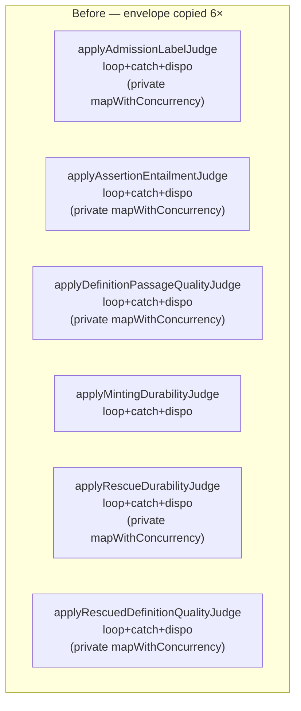
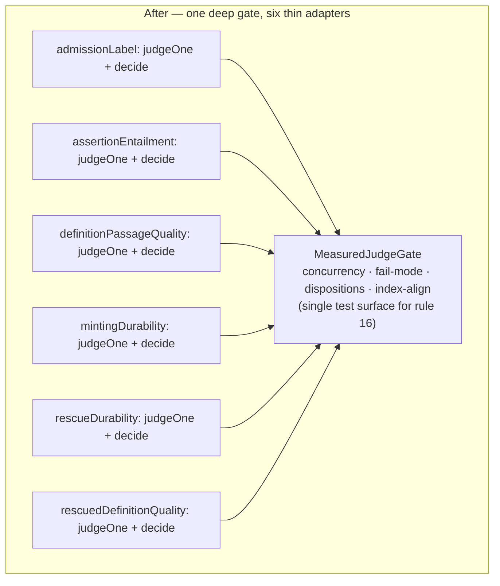
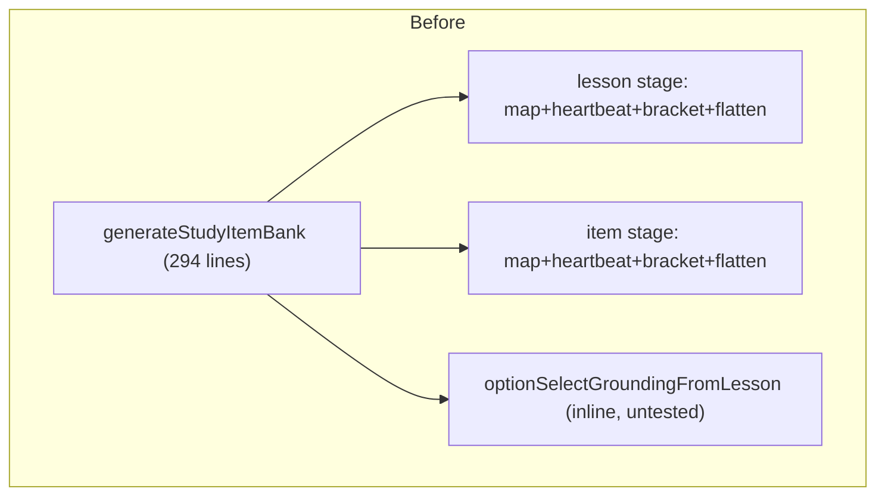
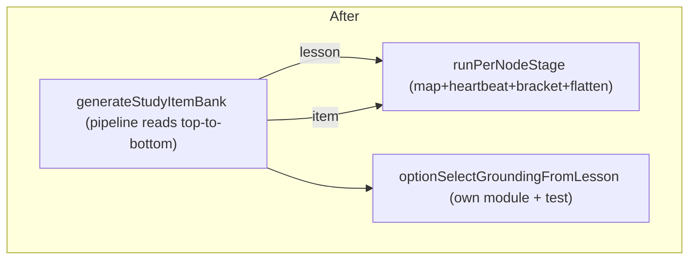

# Architecture Deepening Opportunities — 2026-06-30

Exploration output from `improve-codebase-architecture`. These are **deepening opportunities**:
refactors that turn shallow, repeated modules into deep ones, judged by **leverage** (what callers
get) and **locality** (what maintainers get). Vocabulary follows
[LANGUAGE.md](../../.agents/skills/improve-codebase-architecture/LANGUAGE.md) for architecture and
[CONTEXT.md](../../CONTEXT.md) for the domain.

This is a working document, not a plan. Per the brainstorms README, once a direction is chosen it
should fold into a plan/ADR/TODO and this file should be deleted.

---

## Candidate 1 — A `MeasuredJudgeGate` seam for the six neural judges — **Strong**

### Files

- `packages/application/src/applyAdmissionLabelJudge.ts` (demote-only, fail-closed = preserve recall)
- `packages/application/src/applyAssertionEntailmentJudge.ts` (drop assertion, keep passage; fail-closed = reject)
- `packages/application/src/applyDefinitionPassageQualityJudge.ts` (drop hollow passage; fail-closed = keep + flag)
- `packages/application/src/applyMintingDurabilityJudge.ts` (drop-only; fail-open = keep + `kept_judge_unavailable`)
- `packages/application/src/applyRescueDurabilityJudge.ts` (drop-only; fail-open = keep)
- `packages/application/src/applyRescuedDefinitionQualityJudge.ts` (drop-only; fail-closed-as-preserve = keep + flag)
- Shared utility that should already be the only copy: `packages/application/src/mapWithConcurrency.ts`

### Problem

Each of these six modules is a **measured neural gate over deterministic output** — exactly the
construct AGENTS rule 16 governs ("a deterministic gate over neural output may hard-veto only a
provable guarantee… heuristic gates require an explicit *measured module*"). Read together, they all
implement the **same envelope**:

1. Iterate a per-item population (Candidates, CEP passages, reserved minting proposals, rescued nodes).
2. Call one neural judgment port per item, under **bounded concurrency** (`concurrency ?? 4`).
3. `try/catch` the call and choose a **fail direction** (open = keep, closed = drop/reject/keep-flagged).
4. Map a confident verdict onto a **disposition** — `demote`, `drop assertion`, `drop passage`,
   `drop node` — and record a **reason code** / disposition object **index-aligned** to the input.

The only things that actually vary across the six are (a) the success transform and (b) the fail
direction. Everything else is copied. The copying is not abstract — **five of the six carry their own
private `mapWithConcurrency`** even though `mapWithConcurrency.ts` exists and is imported elsewhere
(`applyMintingDurabilityJudge`, `executeExtractionRun`, `deriveConsensusOrdering`,
`resolveConceptIdentity`, `generateStudyItemBank` all import the shared one). That is a direct
**rule 18** violation: a second representation that is not mechanically generated.

The deeper cost is **locality**. The cross-cutting policy this codebase cares most about —
*how a measured gate behaves under judge failure, and that it can only ever move output in the safe
direction* — has **no single home**. To change concurrency strategy, add retry/backoff, make
"judge unavailable" inspectable (TODO #2 explicitly wants this), or audit that every gate truly
fails safe, a maintainer must read and edit six files and reason about six subtly different
`catch` blocks. The **deletion test** confirms the shape: delete any one judge and no complexity
concentrates (it was a thin per-item policy); but the concurrency + fail-mode + disposition-recording
machinery **reappears six times** — it was never hiding behind an interface, so it leaks into every
caller.

### Solution

Introduce one deep module — a **`MeasuredJudgeGate`** — that owns the envelope. Its interface takes:

- the input population,
- a `judgeOne(item) => verdict` (the per-item neural call),
- a `decide(item, verdict | "unavailable") => disposition` that the caller supplies,
- a declared **fail mode** (`keep` vs `reject`) so the safe direction is a named parameter, not a
  hand-written `catch`,
- optional concurrency.

It returns the transformed population **plus** the index-aligned dispositions. Each `apply*Judge`
collapses to a thin adapter: assemble the per-item prompt inputs, name the fail mode, and write the
`decide` mapping. The duplicated `mapWithConcurrency` copies are deleted (rule 18), and "judge
unavailable" becomes a single observable concept the harness records once — feeding TODO #2's
observability ask for free.

This is a **real seam, not a hypothetical one**: there are already **six adapters** across it.

### Benefits

- **Locality** — fail-safe behaviour, concurrency, and disposition recording concentrate in one
  module with one test surface. Rule 16's "measured gate" contract gets a single enforcement point a
  future explorer can actually find.
- **Leverage** — one harness pays back across six call sites and their tests. New gates (and the
  pipeline keeps growing them) start from `judgeOne` + `decide`, not from re-deriving concurrency and
  `catch` semantics.
- **Tests** — today each judge re-tests "judge throws → safe direction" against its own private loop.
  Against the harness, that property is proven **once**; each adapter test shrinks to "this verdict
  produces this disposition," which is the part that actually carries domain meaning.

### Before / After





```
interface mass, before vs after

 BEFORE  six callers each learn:   loop │ concurrency │ try/catch fail-dir │ dispo record │ index-align
         ▓▓▓▓▓▓  ▓▓▓▓▓▓  ▓▓▓▓▓▓  ▓▓▓▓▓▓  ▓▓▓▓▓▓  ▓▓▓▓▓▓     (× 6, drifting)

 AFTER   one module learns the envelope; six callers each learn:   judgeOne │ decide │ failMode
         ░░  ░░  ░░  ░░  ░░  ░░        +   ▓▓▓▓▓▓ (once)
```

> Note: this candidate **upholds** AGENTS rule 16 rather than contradicting any ADR — it gives the
> rule a concrete module, which the rule's own wording ("an explicit measured module") invites.

---

## Candidate 2 — Collapse the five private `mapWithConcurrency` copies — **Strong (small)**

### Files

`applyAdmissionLabelJudge.ts`, `applyAssertionEntailmentJudge.ts`,
`applyDefinitionPassageQualityJudge.ts`, `applyRescueDurabilityJudge.ts`,
`applyRescuedDefinitionQualityJudge.ts` — vs the canonical `mapWithConcurrency.ts`.

### Problem

`mapWithConcurrency.ts` exists and is the bounded-concurrency primitive used by `executeExtractionRun`,
`deriveConsensusOrdering`, `resolveConceptIdentity`, `generateStudyItemBank`, and
`applyMintingDurabilityJudge`. Yet five other modules ship a **hand-rolled private copy** of the same
worker-pool loop, with slightly different generic signatures (`Promise<void>` vs `Promise<R[]>` vs a
`readonly` variant). This is the cheapest possible **rule 18** violation to close: one fact (bounded
concurrent map preserving input order), six representations.

### Solution

Delete the five private copies; import the shared `mapWithConcurrency`. If a caller needs the index
inside the worker, widen the shared helper's callback to `(item, index)` once (the
`applyMintingDurabilityJudge` import already relies on the index form, so the shared one supports it).

This is independently shippable, but it is also **the first commit of Candidate 1** — do it first and
the judge harness extraction starts from a clean, single primitive.

### Benefits

- **Locality** — one concurrency primitive to reason about for cancellation, error propagation, and
  ordering guarantees, instead of six that can drift.
- **Tests** — `mapWithConcurrency.test.ts` already exists; the five ad-hoc copies are currently
  covered only incidentally through their judges.

### Before / After

```
BEFORE                                   AFTER
mapWithConcurrency.ts      ◀── 5 callers  mapWithConcurrency.ts ◀── 10 callers
applyAdmissionLabelJudge   ▓ own copy
applyAssertionEntailment   ▓ own copy        (private copies deleted)
applyDefinitionPassageQ    ▓ own copy
applyRescueDurability      ▓ own copy
applyRescuedDefinitionQ    ▓ own copy
```

**Recommendation strength:** `Strong` — but small enough that it should be folded into Candidate 1
as step 1 rather than tracked as its own initiative.

---

## Candidate 3 — Deepen the per-node generation stage in `generateStudyItemBank` — **Worth exploring**

### Files

- `packages/application/src/generateStudyItemBank.ts` (294 lines)
- `packages/application/src/assembleConceptLesson.ts`, `selectNodeGrounding.ts`,
  `selectLessonNeighborhood.ts`, `selectSiblingContext.ts`, `optionSelectGuard.ts` (the per-node
  helpers it orchestrates)

### Problem

`generateStudyItemBank` runs the `study_items` operation as **two per-node stages** — a Concept
Lesson stage, then an option-select stage. Both stages share an identical orchestration skeleton:

- define a `generate…ForNode(node)` closure,
- drive `layer.derivedNodes` through `mapWithConcurrency`,
- maintain a hand-rolled `lessonDone` / `studyDone` **heartbeat counter** with a per-item
  `reporter.recordProgress` write,
- wrap in `studyStage(STAGE_TAG, …, total)`,
- **flatten the per-node results back in input order** to keep persisted order deterministic.

That skeleton is written twice in one function, and the function also embeds
`optionSelectGroundingFromLesson` — a 44-line **pure** grounding-derivation function — inline.
The interface a maintainer must hold to safely touch either stage (heartbeat counter discipline,
input-order flattening, stage bracketing, fail-on-persist semantics) is **nearly as complex as the
stage body** — the shallow-module smell.

This is lower-confidence than Candidate 1 because the two stages genuinely differ (lesson vs
item; lesson feeds the second stage in-memory), so the win is real but smaller.

### Solution

Two moves, either independently:

1. Extract a **`runPerNodeStage`** helper that owns the `mapWithConcurrency` + heartbeat counter +
   `studyStage` bracketing + input-order flatten, parameterised by stage tag and the per-node
   closure. `generateStudyItemBank` becomes "lesson stage → persist → item stage → persist," reading
   as the pipeline it is. (Note the overlap with Candidate 1's harness — both are "map over a
   population with progress and ordered results"; worth checking whether one primitive serves both.)
2. Move `optionSelectGroundingFromLesson` to its own module beside `selectNodeGrounding.ts`. It is a
   pure function with a clear contract (lesson → option-select grounding, honouring source vs
   generated provenance) and deserves a direct test surface rather than living as a private function
   in the orchestrator.

### Benefits

- **Locality** — the heartbeat-counter + ordered-flatten discipline is defined once; a future third
  per-node stage (e.g. the games substrate that ADR-0031 / rule 22 anticipates) inherits liveness and
  ordering for free.
- **Leverage** — `generateStudyItemBank` shrinks to the part that is genuinely its own: the
  lesson→item grounding chain (`optionSelectGroundingFromLesson`) and the two-stage ordering.
- **Tests** — the grounding-derivation rules (source nodes require citations; `llm_grounded` nodes
  may fall back to substantive sections; synthesized gist/intuition never become grounding) become
  directly testable instead of reachable only through a full two-stage run.

### Before / After





---

## Candidate 4 — Split the 939-line `ports/src/index.ts` barrel by area — **Speculative**

### Files

- `packages/ports/src/index.ts` (939 lines, ~50 interfaces + read-model types)

### Problem

Every port and read-model type lives in one file. It is already mentally chunked — the file carries
`---` section dividers separating Extraction / Static Refinement, Enrichment, Study, Inspection
read-models, and Observability. The **deletion test** says this is a pass-through *barrel*, so the
concern is not leverage; it is **AI-navigability and locality**: any change to, say, the Study
substrate ports (`StudyItemBankStorePort`, `ConceptLessonStorePort`, `StudyItemGenerationPort`,
`ConceptLessonGenerationPort`) forces a reader to scroll a 939-line file, and every unrelated
inspection-read change shows up in the same file's history.

### Solution

Split into per-area files (`ports/src/extraction.ts`, `enrichment.ts`, `study.ts`, `inspection.ts`,
`observability.ts`) re-exported through `index.ts`. The **interface to callers is unchanged**
(everything still imports from `@lrnki/ports`), so this is purely a locality/navigability move with
zero leverage change — which is exactly why it ranks **Speculative**: do it only if the single file is
demonstrably slowing navigation, not for its own sake.

### Benefits

- **Locality** — port changes land in area-scoped files; git history per area sharpens.
- **AI-navigability** — an agent grepping for "the study ports" lands in a 60-line file, not line 406
  of 939.

### Before / After

```
BEFORE                          AFTER
ports/src/index.ts  (939 LOC)   ports/src/index.ts        (re-export barrel)
  ├ extraction interfaces         ├ extraction.ts
  ├ enrichment interfaces         ├ enrichment.ts
  ├ study interfaces              ├ study.ts
  ├ inspection read-models        ├ inspection.ts
  └ observability                 └ observability.ts
```

---

## Top recommendation

**Start with Candidate 1 (the `MeasuredJudgeGate`), and make Candidate 2 its first commit.**

It is the only `Strong` structural candidate, and it scores highest on both axes the skill optimises:

- **Locality** — it gives AGENTS rule 16's "measured gate over neural output" a single home, and
  collapses six drifting `catch`-block fail-mode implementations into one named, tested contract. The
  pipeline keeps adding judges; this is the seam that stops the envelope from being re-derived each
  time.
- **Leverage + tests** — "judge throws → output moves only in the safe direction" gets proven once
  instead of six times, and it directly advances TODO #2 (make exhausted/unavailable judge calls
  inspectable) by making "judge unavailable" a single recorded concept.

Candidate 2 is non-negotiable cleanup (a live rule 18 violation) and is the natural step 1, so the
harness extraction begins from one concurrency primitive. Candidates 3 and 4 are real but smaller and
can follow once the judge seam exists — Candidate 3 in particular may **reuse** the same
map-with-progress primitive the judge gate needs, so sequencing it after Candidate 1 avoids building
two near-identical helpers.

---

### Which of these would you like to explore?

Pick one and we drop into a grilling conversation on the deepened module's interface — what sits
behind the seam, the fail-mode parameterisation, and which tests survive. If we name the
`MeasuredJudgeGate` concept, that term should also land in `CONTEXT.md`.
