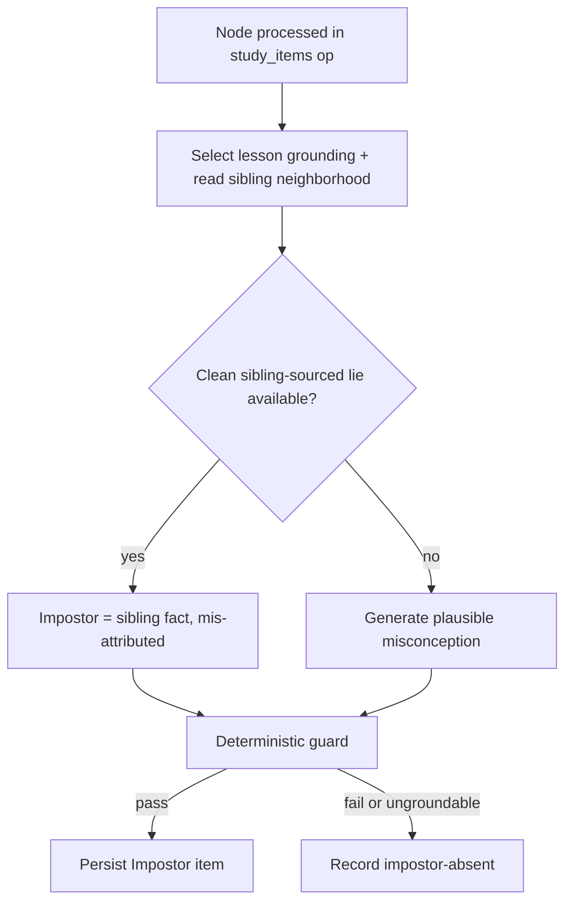

# Impostor study item — requirements

## Summary

Add a second, game-style study item type — the **Impostor** — where the learner reads a few grounded statements about a concept and spots the one plausible lie planted among them. The graph scopes the matchup: the lie is preferentially a true fact about a *confusable sibling* concept, mis-attributed to this node, so the answer is concept understanding, never anything readable off the prerequisite map. A node's study surface becomes a linear sequence of segments — theory, then each study item type in turn — and the Impostor slots in as the next playable segment after option-select.

---

## Canonical References

This brainstorm owns only the Impostor-specific problem framing, requirements, and scope until it is
replaced by an implementation plan or deleted. Canonical contracts remain in:

- [ADR-0026](../adr/0026-typed-study-item-bank.md) for Study Item Bank identity, item typing,
  grading, and Response Log behavior.
- [ADR-0029](../adr/0029-persist-shared-operation-stage-timelines.md) for operation-stage telemetry
  and spend tags.
- [ADR-0031](../adr/0031-concept-lesson-teaching-substrate.md) for the Concept Lesson as the single
  learner-neutral grounding substrate for study assets.
- [AGENTS.md](../../AGENTS.md) for engineering workflow and enforcement rules, including
  learner-facing play, single-source cleanup, prompt neutrality, deterministic gate limits, and graph
  boundary enforcement.

---

## Problem Frame

The engine can already *teach* (the Concept Lesson) and *test* (option-select), but the study
experience is a quiz, not play. The obvious first game, ordering concepts into their prerequisite
chain, was rejected: the Learner App shows the graph, so reconstructing prerequisite order collapses
into tracing arrows already on screen. The design rule that falls out is that a game's answer must be
something the learner *knows*, not something they can *see*. The graph's real, invisible asset is
knowing which concepts are *confusable neighbors* — exactly the knowledge an Impostor item turns into
the challenge.

---

## Key Decisions

- Impostor over build-the-chain. Ordering is a tracing exercise once the prerequisite map is visible; a planted lie cannot be read off the graph and forces real concept discrimination. Build-the-chain is parked, possibly returning later as a capstone played with the map hidden.
- Hybrid lie-sourcing. Prefer a true fact about a real confusable sibling, mis-attributed here, because it targets the exact confusion the graph predicts; mint a freshly generated misconception only when no clean sibling-sourced lie exists — the same reuse-the-real-thing-first pattern the codebase already favors for grounding.
- Linear segment sequence over a picker. A node's surface is an ordered list of segments (`[theory] → [option-select] → [impostor] → [future games]`) played one after another. This generalizes today's lesson-before-item behavior and removes any "which item?" chooser; the picker belongs to the deferred metagame.
- Graded like option-select. Each game segment is auto-graded and writes a graded Response Log entry that folds into the node's existing 0.7 mastery threshold, rather than being a non-graded bonus that never moves mastery.

---

## Requirements

**Mechanic and content**

- R1. The Impostor is a new study item type for one derived node: a small set of statements about the concept, all true except exactly one false statement (the impostor), which the learner must select.
- R2. The true statements derive from the node's Concept Lesson source-cited content under
  [ADR-0031](../adr/0031-concept-lesson-teaching-substrate.md). The impostor is the only false
  statement in the set.

**Lie sourcing**

- R3. Lie sourcing is hybrid: prefer a true fact about a confusable graph sibling presented as if it were about this node; fall back to a freshly generated plausible misconception when no clean sibling-sourced lie exists.
- R4. The sibling set is read from the existing Derived Graph Layer. Generation creates no node, edge, or "fake sibling," and the impostor never becomes a graph entity — it is item content only.

**Grounding and honesty**

- R5. True statements carry source-grounded provenance with verbatim citations where the lesson
  supports them; the impostor carries generated provenance with no source citation and never
  masquerades as a source quote. This reuses the citation contract from
  [ADR-0026](../adr/0026-typed-study-item-bank.md) and the lesson substrate from
  [ADR-0031](../adr/0031-concept-lesson-teaching-substrate.md).
- R6. Every item ends with a post-answer reveal that names the impostor and explains why it is false — for a sibling-sourced lie, that it is actually true of the named sibling. The reveal is required content, not optional polish: a wrong guess must never leave a misconception unresolved.

**Generation and guard**

- R7. Impostor items are generated within the existing `study_items` operation through a forced named
  tool schema, carrying a dedicated LiteLLM spend tag distinct from option-select and lesson
  generation ([ADR-0006](../adr/0006-use-forced-named-tool-schemas.md),
  [ADR-0029](../adr/0029-persist-shared-operation-stage-timelines.md)).
- R8. A deterministic guard accepts or rejects on structural and provenance guarantees only: exactly
  one impostor; every true statement verifies verbatim against its cited lesson passage; the impostor
  is labeled `generated` with no source citation; the impostor is distinct from every true statement.
  Semantic quality — the lie's plausibility, the truths' correctness, the reveal's teaching value —
  is judged by real-use inspection, not the guard.
- R9. When neither a sibling-sourced nor a groundable generated impostor can be produced for a node, the node is recorded impostor-absent with a reason rather than emitting a placeholder, mirroring lesson-absent and rejected-item handling.

**Study Session integration**

- R10. A node's study surface is an ordered linear sequence of segments — theory (the Concept Lesson), then each study item type in turn — rendered one after another with no item-picker. The Impostor renders as the next segment after option-select.
- R11. Adding the type is a localized union extension: one new arm of the typed study-item union and its view and sheet mappings, inherited by both the Admin Lab and the future Learner App without per-surface rework.

**Grading, state, and boundaries**

- R12. Answering an Impostor is auto-graded from the server-keyed impostor and appends a graded,
  append-only Response Log entry under [ADR-0026](../adr/0026-typed-study-item-bank.md). The node's
  mastery folds across all its graded observations at the existing threshold, so moving through the
  segment sequence adds one graded observation per game segment.
- R13. The item type is learner-neutral: it carries graph facts and grounded content only. Points,
  levels, streaks, and game juice live solely in downstream projections and are out of this iteration;
  generation imports no graph or enrichment write port.

---

## Key Flows

- F1. Impostor generation (per node, inside the `study_items` operation)
  - **Trigger:** A derived node is processed during study-item generation, after its Concept Lesson is assembled.
  - **Steps:** Select the node's lesson grounding and read its confusable-sibling neighborhood; attempt a sibling-sourced mis-attributed lie; if none is clean, generate a plausible misconception; run the deterministic guard; persist the item or record impostor-absent.
  - **Covered by:** R2, R3, R4, R7, R8, R9

- F2. Learner plays the Impostor segment
  - **Trigger:** The learner reaches a frontier node whose surface includes an Impostor segment.
  - **Steps:** Move through the theory segment, then option-select, then the Impostor segment showing the statement set; the learner selects the impostor; the answer is auto-graded and a Response Log row is appended; the reveal names the impostor and why it is false; the learner continues to the next segment.
  - **Covered by:** R6, R10, R12

---

## Acceptance Examples

- AE1. Sibling-sourced lie. **Covers R3, R5, R6.** **Given** a node with a confusable sibling whose true fact reads as plausibly-but-falsely about this node, **when** the item generates, **then** the impostor is that sibling fact labeled `generated`, and the reveal states it is actually true of the named sibling.
- AE2. Generated fallback and absence. **Covers R3, R9.** **Given** a node with no clean sibling-sourced lie, **when** the item generates, **then** a freshly generated plausible misconception is used and labeled `generated`; **and** if no groundable impostor can be produced at all, the node is recorded impostor-absent with a reason.
- AE3. Honesty invariant at the guard. **Covers R5, R8.** **Given** a generated item, **when** the guard runs, **then** every true statement verifies verbatim against its cited lesson passage and the impostor carries no source citation; **and** an item whose "true" statement fails verbatim verification is rejected.
- AE4. Grading and mastery fold. **Covers R12.** **Given** the learner answers the Impostor, **when** it is graded, **then** a graded Response Log row is appended and folds into the node's mastery at the 0.7 threshold alongside the option-select observation.
- AE5. Wrong-guess reveal. **Covers R6.** **Given** the learner picks a true statement and misses the impostor, **when** the answer is submitted, **then** the reveal still clearly marks the real impostor and why it is false, so the learner does not leave reinforcing the misconception.

---

## Success Criteria

- Real-use inspection across at least two domains shows impostor lies are plausible, true statements
  are actually true and verbatim-grounded, and reveals teach the distinction.
- The honesty invariant holds on inspected output: every true statement is source-cited verbatim against its stored passage, and every impostor is labeled `generated` with no source citation.
- Zero graph mutation: the Derived Graph Layer and asserted graph are byte-identical before and after item generation.
- Domain-neutral generation: the prompt and schema carry no fixture concepts; the type fires across
  mixed-domain sources or records impostor-absent honestly where grounding is too thin.

---

## Scope Boundaries

Deferred for later:

- The metagame — points, XP, levels, the world-map, the "choose what to master" picker, and unlock juice. The linear segment sequence is its interim.
- Build-the-chain and the other candidate mechanics (sibling-discrimination "which is it?", match-the-application). Build-the-chain may return as a hidden-map capstone.
- Per-section theory segmentation (swipeable lesson cards). Theory stays a single segment for now.
- Confidence-gated synthesis for generated lies (ADR-0030, Proposed). Generated misconceptions are produced unconditionally this iteration.

---

## Dependencies / Assumptions

- Depends on the shipped Concept Lesson substrate as the single grounding source for true statements
  ([ADR-0031](../adr/0031-concept-lesson-teaching-substrate.md)).
- Assumes the Derived Graph Layer exposes a usable confusable-sibling neighborhood per node; the option-select generator already consumes `siblings` read-only as prompt context.
- Assumes most nodes have enough source-cited lesson content to supply the true statements; nodes that do not are recorded impostor-absent rather than padded.

---

## Outstanding Questions

Deferred to Planning:

- Number of statements per item (e.g., three vs four) and whether it is fixed or scales with available grounding.
- Segment order within a node (Impostor before or after option-select) and whether theory remains one segment or later becomes per-section cards.
- The operational definition of a "confusable sibling" for lie-sourcing — direct siblings only or a broader same-domain neighborhood — and how the generator is told which sibling fact reads as plausibly-but-falsely about this node.
- Whether all segments are mandatory to reach mastery or each is an independent optional graded observation, given the existing "skip as known" affordance.
- The interaction and render shape of the Impostor segment (tap-to-pick, etc.) — a Learner App projection detail.

None of these block planning; each can be settled during implementation or a measure-first pass.

---

## Sources / Research

- `packages/application/src/studySessionProjection.ts:84` — the typed study-item union plus its view/sheet mappings; adding a type is "a new arm of this union... inherited by every surface."
- `packages/ports/src/index.ts:433` — `StudyItemGenerationPort`; `siblings` is already consumed read-only as prompt context to flavor distractors (`:443`), the seam the Impostor reuses.
- `packages/application/src/optionSelectGuard.ts` — the deterministic structural/provenance guard pattern to mirror for R8.
- `packages/application/src/assembleConceptLesson.ts` — lesson assembly and authoritative provenance re-derivation; the source of true statements.
- [ADR-0026](../adr/0026-typed-study-item-bank.md),
  [ADR-0031](../adr/0031-concept-lesson-teaching-substrate.md),
  [ADR-0029](../adr/0029-persist-shared-operation-stage-timelines.md), and
  [ADR-0030](../adr/0030-confidence-gated-synthesis-with-web-grounding.md) (Proposed — relevant to
  generated lies, deferred).
- [AGENTS.md](../../AGENTS.md).
