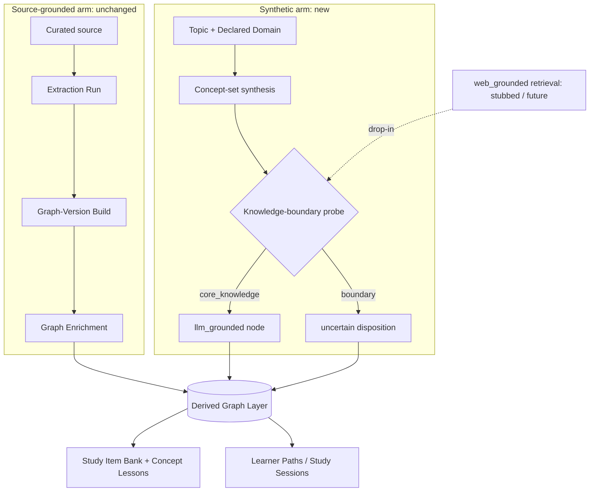

# Synthetic topic generation

## Summary

Add a synthetic generation arm: a topic plus a Declared Domain produces a free-standing,
anchor-less Derived Graph Layer of `llm_grounded` Concepts, gated per-concept by a small
cross-family knowledge-boundary probe, and consumed by the existing study and projection stack.
The asserted graph stays source-grounded; web retrieval is stubbed as a clean future drop-in.

---

## Problem Frame

Every Processing Journey today begins with a curated source: a registered file parsed into a
`StructuredDocument` whose blocks anchor every downstream quote. When no good source exists for a
topic, the pipeline cannot cover it at all — there is no entry point that produces a learnable graph
from a topic alone.

The planned "type a topic, get a course" product needs exactly that entry point. It must be built so
the eventual web-grounding upgrade is a drop-in rather than a re-architecture. The risk to manage is
honesty: source-less generation invites confident hallucination, and the asserted graph's evidence
contract ([ADR-0002](../adr/0002-define-learner-neutral-core-concept-graph.md),
[CONTEXT.md](../../CONTEXT.md)) must not be diluted to accommodate it.

---

## Key Decisions

- **Synthetic content stays derived-only.** A synthetic run produces a free-standing Derived Graph
  Layer; the asserted graph stays source-pure.
  [ADR-0023](../adr/0023-grounding-origin-model-and-cross-family-generated-node-judge.md) already
  classifies every non-`document_anchored` origin as derived and exists precisely to represent
  source-absent content without weakening the asserted evidence contract.

- **A new origin operation, not Graph Enrichment.** Enrichment is parasitic on a published asserted
  base — it projects anchors, then mints *their* prerequisites
  ([ADR-0019](../adr/0019-graph-enrichment-derived-layer.md)). A topic has no anchors, so the
  synthetic arm is a new front end that emits a Derived Graph Layer directly and reuses only the
  downstream machinery.

- **One synthesis seam owns grounding origin.** The stage emits the origin per node (`llm_grounded`
  now), so `web_grounded` and its retrieval branch drop in later without restructuring.

- **The confidence probe is the safety gate, built now.** A small, cross-family model runs a
  self-consistency knowledge-boundary check, reusing the existing K-sample → aggregate →
  route-to-`uncertain` pattern ([ADR-0028](../adr/0028-measure-non-deterministic-quality-with-non-deterministic-methods.md)).
  This sharpens [ADR-0030](../adr/0030-confidence-gated-synthesis-with-web-grounding.md): moderate
  sampling temperature with semantic agreement, not "low temperature," because consistency methods
  need enough diversity to expose a confidently-wrong answer.

- **The bridge to authority is curate-and-extract.** If synthetic content ever needs to be
  authoritative, its source is registered as a curated source and run through the existing extraction
  arm. No derived node is promoted; no asserted "synthetic" origin is introduced.

- **A course is a projection.** "Type a topic, get a course" is a Learner Path / Study Session over
  the derived layer ([ADR-0032](../adr/0032-keep-learner-app-in-flow-through-mastery-aligned-game-ux.md));
  no new primitive is introduced for it.

---

## Requirements

**Synthetic generation operation**

- R1. A new generation operation takes a topic and a Declared Domain and produces a free-standing
  Derived Graph Layer, running no Extraction Run and no Graph-Version Build.
- R2. The operation generates the initial concept set from the topic and Declared Domain alone — a
  source-less analog of Candidate Discovery. The set is generated, not gated for coverage or grain in
  this build.
- R3. Every node in the layer is `llm_grounded` with a Generated Grounding Bundle and records the
  verbatim-floor exemption `not_applicable_by_grounding`; no node claims source-verbatim provenance.
- R4. The layer carries no anchor projections and never writes to the asserted graph.
- R5. Prerequisite ordering and intrinsic difficulty run over the synthetic layer using the existing
  derived-layer machinery, unchanged.

**Confidence / safety probe**

- R6. Each synthesized concept is probed for the model's knowledge boundary by a dedicated
  small-parameter LiteLLM alias, independent (cross-family) from the synthesizer.
- R7. The probe samples K times at moderate temperature and aggregates semantic agreement into a
  structured verdict returned via a forced named tool
  ([ADR-0006](../adr/0006-use-forced-named-tool-schemas.md)), reusing the existing sample-and-aggregate
  harness.
- R8. A `core_knowledge` verdict synthesizes from parametric knowledge; a `boundary` verdict routes
  the node to an `uncertain`-style disposition — retained and inspectable in the layer, excluded from
  trusted learner-facing surfaces.

**Learner-facing reuse**

- R9. Study Item Bank and Concept Lesson generation run over the synthetic layer keyed to
  `derived_node_id`, reusing the existing generators
  ([ADR-0026](../adr/0026-typed-study-item-bank.md),
  [ADR-0031](../adr/0031-concept-lesson-teaching-substrate.md)).
- R10. Learner Paths and Study Sessions project over the synthetic layer with no new primitive.

**Coexistence and the future web seam**

- R11. The source-grounded arm is unchanged; a Processing Journey is either source-grounded or
  synthetic, and both coexist.
- R12. Web retrieval is stubbed. The synthesis stage decides grounding origin as an emitted property
  so `web_grounded` and its retrieval branch replace the stub later without restructuring; on a
  `boundary` verdict, retrieval will then take the place of the `uncertain` route.
- R13. No asserted "synthetic" grounding origin is introduced, and generated text is never registered
  as a curated source to smuggle synthetic content through the source-grounded arm.

---

## Acceptance Examples

- AE1. Covers R8.
  - **Given** a synthesized concept the probe scores `core_knowledge`,
  - **When** the layer is built,
  - **Then** the node is `llm_grounded`, synthesized from parametric knowledge, and eligible for
    trusted learner-facing surfaces.
- AE2. Covers R8, R12.
  - **Given** a synthesized concept the probe scores `boundary` (web retrieval stubbed),
  - **When** the layer is built,
  - **Then** the node is recorded with an `uncertain`-style disposition: present and inspectable in
    the layer, excluded from trusted learner paths, and never confidently taught.
- AE3. Covers R3, R4.
  - **Given** any synthetic node,
  - **When** its grounding is inspected,
  - **Then** it carries `not_applicable_by_grounding`, cites no source block, and produced no asserted
    Concept, edge, or graph-version write.

---

## Scope Boundaries

**Deferred for later**

- Web search / `web_grounded` activation and the retrieval branch (the mocked component).
- A set-quality gate over the generated concept set (coverage, grain, redundancy).
- The full learner-facing "type a topic, get a course" product.

**Outside this product's identity**

- Synthetic content never enters the asserted graph; the source-grounded contract
  ([ADR-0002](../adr/0002-define-learner-neutral-core-concept-graph.md), [CONTEXT.md](../../CONTEXT.md))
  is untouched.
- No new asserted "synthetic" grounding origin.
- No treating generated text as a curated source to route synthetic content through the
  source-grounded arm.

---

## Dependencies / Assumptions

- **Verify in planning:** the current Derived Graph Layer store tolerates a layer with zero anchor
  projections — every existing layer has anchors, so an anchor-less layer is unproven against the
  store.
- This build sharpens [ADR-0030](../adr/0030-confidence-gated-synthesis-with-web-grounding.md)
  (Proposed): the probe half lands now with moderate temperature + semantic agreement; the
  web-retrieval half stays deferred.
- A new small-parameter, cross-family LiteLLM alias must be configured and routed (AGENTS rule 5).
- The concept-set generation prompt and the probe prompt stay domain-neutral and are never tuned with
  expected topics or concepts (AGENTS rule 17).

---

## Outstanding Questions

**Deferred to Planning**

- When a `boundary` node is a necessary prerequisite of a `core_knowledge` node, does excluding it
  from trusted surfaces leave an acceptable gap, or should the path stop short? Resolve by the
  existing `uncertain`-edge handling plus real-use inspection.
- K (sample count), the moderate-temperature value, and the semantic-agreement threshold for the
  probe.
- The exact small-parameter alias/model, cross-family from the DeepSeek synthesizer.
- How the concept-set generation prompt bounds set size and grain without a quality gate.
- Whether the synthetic layer reuses the existing Derived Graph Layer storage shape with an empty
  anchor set or needs a distinct artifact (tied to the representability assumption above).

---

## Sources / Research

- **Problem class (AGENTS rule 21):** knowledge-boundary / hallucination detection for open-ended
  generation. Recognized signals: self-consistency over samples (SelfCheckGPT) and semantic entropy;
  both need sampling diversity, which is why moderate temperature beats low. Selective/adaptive
  retrieval (retrieve only when uncertain) is the conventional `web_grounded` branch.
- **Code seams to reuse / parallel:**
  - `packages/application/src/executeExtractionRun.ts` — the `StructuredDocument`-based source arm the
    synthetic arm runs beside.
  - `packages/application/src/runGraphEnrichment.ts`, `deriveConsensusOrdering.ts`,
    `mapWithConcurrency.ts` — downstream derived machinery and the sample-and-aggregate harness.
  - `packages/application/src/generateStudyItemBank.ts`, `assembleConceptLesson.ts` — study generators
    keyed to `derived_node_id`.
  - `apps/kg-worker/src/knowledgeGraphWorker.ts` — operation command surface where a synthetic-journey
    command plugs in.
  - `packages/infrastructure-ingestion/` — confirms ingestion already spans pdf/html/markdown/plaintext,
    so the gap is no-source, not input format.
