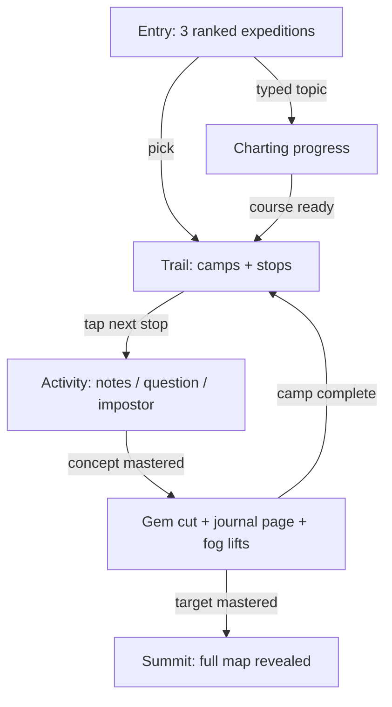

# Learner App v1 — Expedition Journal quest surface

## Summary

Build the first learner-facing surface: a mobile-first quest experience in an **Expedition Journal**
fiction, served as a separate route tree inside the existing web app. The learner picks an expedition
from ~3 readiness-ranked targets or creates one from a typed topic, then climbs
camp-by-camp along a stop-per-activity trail. Rewards are three renderings of the same mastery truth:
a gem collection, finished journal pages, and a fog-of-war map reveal.

---

## Problem Frame

The study loop is complete end to end — recommendation, stateful ladder, lessons, graded items — but
its only surface is the Admin Lab study route, which speaks operator language ("Wave", raw state
badges) and is shaped for inspection, not play. Rule 22 and
[ADR-0032](../adr/0032-keep-learner-app-in-flow-through-mastery-aligned-game-ux.md) make playful,
mastery-aligned game UX a first-class goal, and the next milestone is handing a working demo to a
real learner who receives no onboarding and no operator help. Nothing today answers "what do I do
next?" in a learner's vocabulary, and nothing lets a learner create their own course without an
operator running worker commands.

---

## Key Decisions

- **Same app, strict import boundary — not a second app.** The learner surface is a separate route
  tree in the existing web app whose components import only the application package (never operator
  components). Extraction into a standalone app later is an import-discipline problem, not a rewrite.
- **Expedition Journal is the sole v1 fiction, built as a theme token layer.** Palette and fiction
  vocabulary (specimen/gem, Camp, Examine) live in one token layer so a second theme is additive
  later. No user-facing theme picker in v1.
- **Stop-per-activity trail with the gem as concept capstone.** Every trail stop is one activity
  (field notes = Concept Lesson, question = option-select, spot-the-fake = impostor); the concept's
  gem sits at the end of its cluster. This is a display transform of the existing per-node segment
  order — the projection is unchanged.
- **Rewards are mastery re-renders; nothing is spendable.** Gems are keys, never consumables, and
  there is no XP, points, or streak economy. All three reward surfaces derive from existing learner
  state and the derived graph, so they cannot drift from truth
  ([ADR-0032](../adr/0032-keep-learner-app-in-flow-through-mastery-aligned-game-ux.md)).
- **The self-serve course door ships live, not stubbed.** Typed topic uses Synthetic Topic
  Generation. Charting takes minutes, so the surface shows real stage progress from the shared operation timelines
  ([ADR-0029](../adr/0029-persist-shared-operation-stage-timelines.md)) instead of pretending to be
  instant.
- **Hand-rolled trail plus one animation library; no gamification or graph framework.** Research
  found Duolingo-style paths are always hand-built; the hard parts (ordering, gating) already live in
  the application projection. Motion covers gem transitions, the pulsing next-stop, and the summit
  celebration. Gamification kits (points/streak/leaderboard components) were considered and rejected
  as parallel-objective mechanics.
- **The Admin Lab study route is superseded and deleted in the same change** (rule 18). Operator
  inspection of enrichments, operations, and runs is untouched.
- **Fiction vocabulary is UI copy only.** "Expedition", "Camp", "gem", "journal page" name existing
  projections (Learner Path target cone, topological tier, mastered concept, mastered review); no new
  domain types. Operator wording ("Wave") disappears from learner-facing copy.

---

## Actors

- A1. **Learner** — receives a link, plays unassisted on a phone. Identified by a shareable learner
  reference (URL slug); no account, auth, or onboarding.
- A2. **Operator** — prepares source-grounded enrichments in the Admin Lab as before; not involved in
  the learner's session.

---

## Requirements

**Entry and course creation**

- R1. The entry screen presents about three readiness-ranked expedition targets, each showing the
  target concept, expedition size, and readiness; fully ready expeditions rank first.
- R2. The learner can create an expedition from a typed topic plus domain, producing a fully
  generated course through Synthetic Topic Generation.
- R3. While a course is being charted, the learner sees live stage-level progress; they can leave and
  return without losing the in-flight expedition.
- R4. All learner state keys to the learner reference; two learners can use the same deployment
  side by side.

**Trail and progression**

- R6. The trail renders one cluster per concept: a theory stop, one stop per study item, and the gem
  capstone, in the existing segment order.
- R7. Camps are topological tiers; a camp unlocks automatically when mastery gating opens it — no
  spend, no manual unlock.
- R8. The quest header always shows the target concept, learner reference, progress, and the single
  next stop; at any moment exactly one clearly marked "next" affordance is visible.
- R9. A stop opens its activity full-screen (field notes to read, question to answer, fake specimen
  to spot); grading and mastery folding stay as shipped.
- R10. The learner can skip a stop's concept as already known, with the existing verdict semantics.
- R11. Reopening the app resumes the learner's active expedition at the current frontier; position is
  derived from mastery, with only the active-expedition choice persisted.

**Rewards**

- R12. Mastering a concept cuts its gem: the capstone fills, and the collection view shows all gems
  earned across expeditions. Gems are never consumed.
- R13. Each mastered concept becomes a finished journal page (its lesson content and the learner's
  results) that the learner can browse anytime; this is the review surface.
- R14. A survey map shows the expedition's territory with unmastered regions fogged; mastery lifts
  the fog, and completing the expedition triggers a single summit celebration revealing the whole
  range.

**Surface and boundaries**

- R15. The surface is mobile-first responsive; every interaction works on a phone.
- R16. Learner-route components import only the application package's public surface.
- R17. The superseded Admin Lab study route and its learner-facing components are deleted in the
  same change.
- R18. All gating and rewards derive from existing mastery projections; the only new persisted
  learner state is the active-expedition reference.

---

## Key Flows

- F1. **Guided climb.** **Trigger:** learner opens their link. **Steps:** entry shows ranked
  expeditions → pick one → trail opens at the current frontier → tap the marked next stop → complete
  the activity → gem cuts when the concept masters → next camp unlocks → summit on target mastery.
  **Covers R1, R6–R9, R12, R14.**
- F2. **Chart your own course.** **Trigger:** learner types a topic. **Steps:**
  charting starts → live stage progress renders → learner may leave → on return the expedition is
  ready and appears among their expeditions. **Covers R2–R3.**
- F3. **Return visit.** **Trigger:** learner reopens their link days later. **Steps:** active
  expedition resumes at the mastery-derived frontier; journal and gem collection reflect everything
  earned so far. **Covers R11–R13.**

---

## Acceptance Examples

- AE1. **Covers R6, R12, R13, R14.** Given a frontier concept with a lesson and two study items, when
  the learner completes the last graded stop and the concept's mastery folds to mastered, then the
  gem capstone fills, a journal page for the concept appears, and its map region unfogs.
- AE2. **Covers R7.** Given all concepts in Camp 2 are mastered, when the projection recomputes, then
  Camp 3's stops change from locked to available with no learner action.
- AE3. **Covers R2, R3.** Given a learner starts a typed-topic expedition and closes the browser mid-charting, when
  they return, then the entry screen shows the expedition still charting with its current stage, and
  later shows it ready.
- AE4. **Covers R10, R12.** Given a learner skips a frontier concept as known, when the closure
  prunes, then the affected gems render as collected-by-declaration (calibration verdict), consistent
  with existing skip semantics.

---

## Scope Boundaries

**Deferred for later**

- Additional game mechanics and item types beyond lesson, option-select, and impostor.
- Theme swapping (the token layer enables it; no picker ships).
- The ADR-0032 support ladder: adaptive mechanic selection, hints, Learner-Scoped Scaffolds.
- The calibration pre-study list; v1 keeps only per-stop "skip as known".
- Native/standalone app extraction; auth and real accounts.

**Outside this product's identity**

- Spendable currency, XP, points, streaks, leaderboards, and social competition — parallel
  objectives that ADR-0032 forbids from displacing mastery.

---

## Dependencies / Assumptions

- Course charting is minutes-long and costs real LLM spend per generated course; the demo accepts
  both, and the async progress UX (R3) is the mitigation, not speed work.
- The Knowledge-Boundary Probe has never routed a real concept to `boundary`
  (`docs/plans/TODO.md` item 2); until calibrated, generated courses contain only
  `core_knowledge` concepts and the trusted-surface holdout is unexercised.
- Intrinsic-difficulty distortion (`docs/plans/TODO.md` item 1) may affect ordering quality inside
  generated courses; acceptable for the demo.
- Readiness-ranked recommendations exist only for enrichments with generated study items; the entry
  screen assumes at least a few charted expeditions are present on first load.

---

## Outstanding Questions

**Deferred to Planning**

- Final fiction copy (for example whether tiers read "Camp 3" or stay unlabeled on a continuous
  trail) and the full vocabulary token set.
- Whether the survey map reuses the existing graph explorer with fog styling or a simpler custom
  render.
- How the entry screen scopes "your expeditions" versus globally available ones per learner
  reference.

---

## Sources / Research

- Shipped projection and surface: `packages/application/src/getStudySession.ts`,
  `packages/application/src/studySessionProjection.ts` (states, segment order, sheet contents,
  skip-as-known), `apps/admin-lab/src/components/study/QuestLadder.tsx` (tier grouping; the "Wave"
  copy), worker entry `apps/kg-worker/src/knowledgeGraphWorker.ts` (`generate-synthetic-layer`).
- Learner identity precedent: `learner_state_ref` on `calibration_verdicts` and `response_log` in
  `packages/infrastructure-postgres/src/migrations/0000_initial_lrnki_schema.sql`.
- Governing decisions: [ADR-0032](../adr/0032-keep-learner-app-in-flow-through-mastery-aligned-game-ux.md)
  (flow, pleasures, forbidden parallel objectives),
  [ADR-0026](../adr/0026-typed-study-item-bank.md) / [ADR-0031](../adr/0031-concept-lesson-teaching-substrate.md)
  (item types and lesson substrate), [ADR-0029](../adr/0029-persist-shared-operation-stage-timelines.md)
  (charting progress), [ADR-0027](../adr/0027-serve-inspection-through-read-model-ports.md)
  (projection boundary the import discipline leans on).
- Library research (2026): Duolingo-style paths are hand-rolled in practice
  ([react-duolingo clone](https://github.com/bryanjenningz/react-duolingo),
  [Next.js Duolingo clone](https://www.youtube.com/watch?v=dP75Khfy4s4));
  [Motion](https://motion.dev/docs/react) is the default React animation choice
  ([comparison](https://blog.logrocket.com/best-react-animation-libraries/)) and covers the
  celebration burst ([confetti example](https://motion.dev/examples/react-confetti));
  gamification component kits ([survey](https://trophy.so/blog/gamification-ui-libraries)) were
  rejected as parallel-objective mechanics.
