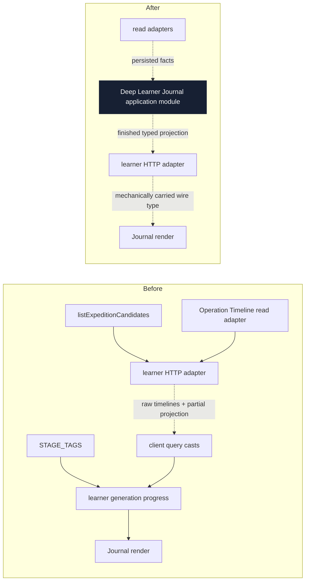
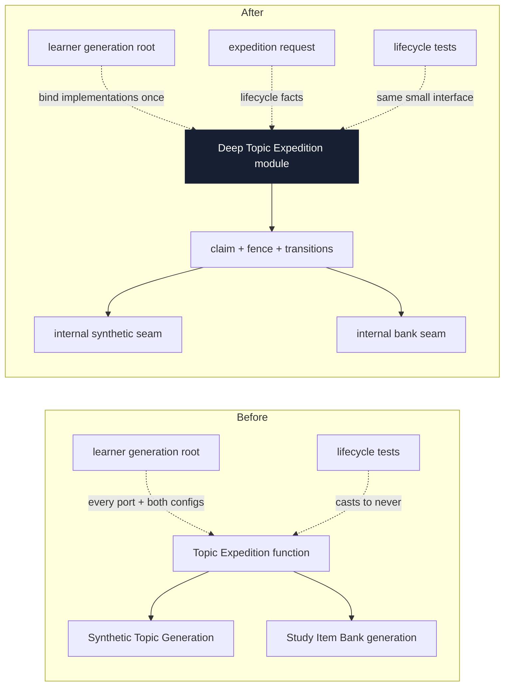
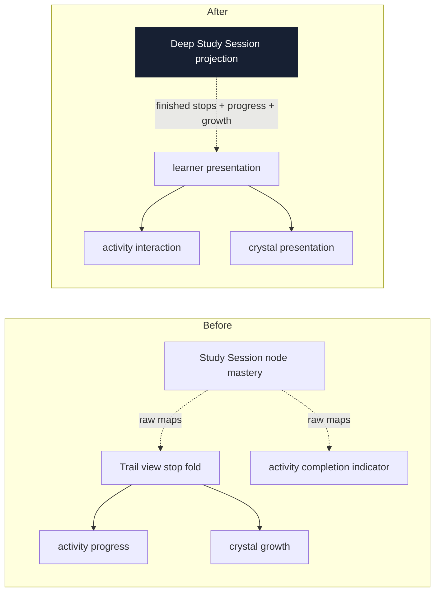

# Architecture deepening review

Date: 2026-07-11

Legend: a solid box is a **module**; a dashed arrow crosses a **seam**; a thick dark box is the
proposed **deep** module. Recommendation strengths are `Strong`, `Worth exploring`, or
`Speculative`.

This review uses the architecture language in
[the architecture skill](../../.agents/skills/improve-codebase-architecture/LANGUAGE.md) and the
project language in [CONTEXT.md](../../CONTEXT.md). It does not propose interfaces yet.

The completed 2026-07-07 review was checked through git history. This review does not re-propose its
implemented operation-catalog, learner-grading, Neural Stage Descriptor, neural-client policy, or
operation-liveness work. It also preserves the prior rejection of grouping `runGraphEnrichment`
inputs: that operation still has one caller. Candidate 1 was different—the duplicated Derived
Graph Layer completion behavior had two real callers—and has since been completed (2026-07-11).

---

## Candidate 1 — Collapse Derived Graph Layer completion into one deep module

**COMPLETED 2026-07-11** via plan 2026-07-11-001 (plan deleted after both rule-14 gates passed).
One internal `completeDerivedGraphLayer` module in `@lrnki/application` now owns judgment-context
construction through atomic persistence for both Graph Enrichment and Synthetic Topic Generation;
current status lives in [TODO.md](../plans/TODO.md), and its nine grilling decisions are realized
in the module and its focused test suite.

---

## Candidate 2 — Make the Learner Journal a finished application projection

**SHIPPED 2026-07-12** (plan deleted after consolidation; outcome in
[TODO.md](../plans/TODO.md)). One `@lrnki/application` module (`expeditionJournal.ts`) returns the
finished journal/catalog projections behind `getExpeditionJournal`/`getExpeditionCatalog`; owned
rows cross the seam as a status-discriminated finished union; the routes are thin mappers; the
Learner App derives its types from `AppType` via `InferResponseType` and dropped every port import
and stage-policy module. The accepted grilling decisions all landed (14-stage progress denominator
fixing the layer-purpose blank, projection-owned tiers, Explore curation tightening, mechanical wire
carry). `CONTEXT.md` defines **Expedition Journal**. Rule-14 gate PASS (evidence
`tmp/2026-07-12-expedition-journal-projection/`).

**Recommendation strength: Strong**  
**Dependency category: ports & adapters**

**Files (at framing time; all resolved by the shipped work)**

- `packages/application/src/listExpeditionCandidates.ts` (deleted), which returned candidates plus
  partly enriched `LearnerExpedition` port types
- [`app.ts`](../../apps/learner-api/src/app.ts), where `/journal` appended raw operation timelines
  after the application call
- [`queries.ts`](../../apps/learner-app/src/lib/queries.ts), where `JournalView` was reconstructed
  from application and port types and every response passed through an unchecked generic cast
- `apps/learner-app/src/learn/generationProgress.ts` (deleted), where the Learner App imported
  `STAGE_TAGS` and `OperationTimelineDetail` to derive learner-visible progress

**Problem**

The learner-facing journal crosses three seams before it becomes usable: the application returns a
partial projection, the HTTP adapter stitches Inspection Read Models onto it, and the Learner App
learns operation-stage ordering and port types to finish generation progress; meanwhile
`unwrap<T>` erases the typed HTTP response and asserts the expected result.

This is not just file size. The interface requires the Learner App to know `STAGE_TAGS`, the
enrichment-versus-study-items phase split, `OperationTimelineDetail`, and `LearnerExpedition`. A
stage-order change can compile in the producer while the learner progress estimate silently drifts.
The **deletion test** is positive: deleting `generationProgress.ts` moves its policy back into the
route or application caller.

**Solution**

Deepen the Learner Journal application module so it composes expedition discovery, learner progress,
layer purpose, and generation progress behind one interface and returns a finished learner
projection whose wire type is mechanically carried through the HTTP seam.

**Benefits**

- **Locality:** journal policy lives once
- **Leverage:** one projection, every platform
- Typed seam becomes test surface
- Learner App drops port knowledge
- Stage changes update one module
- HTTP adapter becomes shallow intentionally

**Before / after**

> **ADR warning:** the current UI-side composition conflicts with
> [ADR-0027](../adr/0027-serve-inspection-through-read-model-ports.md), which assigns
> learner-facing read-and-compute composition to application use-cases rather than Inspection Read
> Models consumed by UI code.

**Active-plan coordination:** the expedition-discoverability work (plan 2026-07-10-005, completed
2026-07-11 — see [TODO.md](../plans/TODO.md)) landed the curated Explore + `/catalog` route this
candidate builds on; do not create a competing definition of catalog scope.

---

## Candidate 3 — Deepen Topic Expedition generation behind its lifecycle interface

**Recommendation strength: Strong**  
**Dependency category: in-process**

**Files**

- [`generateTopicExpedition.ts`](../../packages/application/src/generateTopicExpedition.ts), whose
  input is the intersection of nearly the complete Synthetic Topic Generation and Study Item Bank
  interfaces (currently lines 21–27)
- [`learnerGeneration.ts`](../../apps/learner-api/src/learnerGeneration.ts), which assembles and
  forwards the full dependency union (currently lines 37–102)
- [`generateTopicExpedition.test.ts`](../../packages/application/src/generateTopicExpedition.test.ts),
  where all six lifecycle tests cast the call to `never` because the injected sub-operation fakes do
  not satisfy that union
- [`runSyntheticGeneration.ts`](../../packages/application/src/runSyntheticGeneration.ts) and
  [`generateStudyItemBank.ts`](../../packages/application/src/generateStudyItemBank.ts), whose full
  interfaces leak through the orchestrator

**Problem**

`generateTopicExpedition` contains valuable lifecycle behavior—claim fencing, phase transitions,
Declared Domain persistence, transient release, terminal failure, and readiness—but its interface
is almost the sum of both sub-operation implementations, and it forwards the entire input to each
with object spreads.

The module earns its keep under the **deletion test** because the lease and failure behavior would
otherwise spread into the supervisor. Its interface is nevertheless **shallow**: the caller must
know every neural and storage dependency used inside both sub-operations. The casts in every focused
lifecycle test are direct evidence that the interface is not the practical test surface.

**Solution**

Bind the two generation implementations behind internal seams when the Topic Expedition module is
constructed, leaving each per-expedition call to express only lifecycle facts and keeping the
fencing protocol as the module's deep implementation.

**Benefits**

- Interface matches lifecycle knowledge
- **Locality:** fencing stays in one module
- **Leverage:** supervisor passes one request
- Tests need no impossible casts
- Sub-operations keep focused tests
- Dependency union stops leaking

**Before / after**

**Seam note:** there is one production implementation of each sub-operation, so these should remain
internal seams used by the Topic Expedition implementation and its tests—not new public ports with
hypothetical adapters.

---

## Candidate 4 — Let the Study Session own Expedition Trail stop completion

**Recommendation strength: Strong**  
**Dependency category: in-process**

**Files**

- [`studySessionProjection.ts`](../../packages/application/src/studySessionProjection.ts), which
  owns the completion rule but exposes raw lesson-read and latest-outcome maps (currently lines
  282–337 and 390–433)
- [`trailView.ts`](../../apps/learner-app/src/learn/trailView.ts), which reconstructs theory,
  activity, and capstone stops, their completion, section progress, the next stop, and crystal
  growth (currently lines 75–198)
- [`activityProgress.ts`](../../apps/learner-app/src/learn/activityProgress.ts), which recomputes the
  whole trail to resolve one capstone
- [`ActivitySheet.tsx`](../../apps/learner-app/src/components/ActivitySheet.tsx), which checks the
  same completion primitives again for its indicator (currently lines 326–345)
- the shipped event-bound mastery motion (plan 2026-07-10-003, completed 2026-07-11) now reads these
  same derived values in `CrystalGlyph.tsx` / `ActivitySheet.tsx`, so any de-duplication here must
  keep those motion triggers intact

**Problem**

The Study Session module owns node mastery, but the Learner App independently derives stop
completion, section completion, next-stop selection, and crystal growth from raw projection maps,
then the activity module rechecks the same primitives; the one completion rule therefore exists as
several hand-synchronized implementations.

The duplication has already widened since the previous review: `trailView.ts` remains the main fold,
`activityProgress.ts` rebuilds it to resolve a capstone, and `ActivitySheet.tsx` independently decides
whether its indicator is complete. The **deletion test** is positive: deleting the stop fold makes
the completion and growth policy reappear across those callers.

**Solution**

Deepen the Study Session projection so its interface carries finished Expedition Trail stops,
per-stop completion, section progress, next-stop identity, and concept growth, leaving the Learner
App to apply themed vocabulary and interaction presentation only.

**Benefits**

- One completion implementation
- **Locality:** progress changes stay upstream
- **Leverage:** every surface agrees
- Motion consumes stable events
- Tests hit the projection seam
- Raw mastery maps stop leaking

**Before / after**

**ADR fit:** This enforces the “one rule” in [CONTEXT.md](../../CONTEXT.md) and the application-owned
learner projection required by [ADR-0027](../adr/0027-serve-inspection-through-read-model-ports.md)
and [ADR-0032](../adr/0032-keep-learner-app-in-flow-through-mastery-aligned-game-ux.md).

**Active-plan coordination:** the learner-interaction system (plan 2026-07-10-003, completed
2026-07-11) already added event-bound motion consumers of the raw projection maps, so Candidate 4
now inherits those consumers — a de-duplication here must migrate them behind the Study Session
interface rather than leave them reading raw maps.

---

## Not promoted to candidates

- `packages/domain-core/src/index.ts` (1,751 lines) and `packages/ports/src/index.ts` (1,257 lines)
  still need internal concern-based file structure for AI navigability. A pure file split would not
  deepen either interface, so it is worthwhile locality maintenance rather than one of this review's
  deepening candidates.
- Explicit adapter construction in the kg-worker and learner generation roots remains composition
  work. The shared neural-client policy is already deep; hiding all remaining wiring would only move
  it.
- `generateStudyItemBank.ts` is large, but its single interface already hides lesson, blueprint,
  option-select, matching, impostor, validation, and persistence behavior. Internal extraction may
  improve locality while editing an item type, but the current module passes the depth test.
- Optional enrichment adapters used by `ENRICH_DISABLE_DEDUP` and
  `ENRICH_DISABLE_MINTING_DURABILITY` are measured alternate behavior, not accidental missing
  wiring. Do not erase those seams without first retiring the measurement need.

---

## Top recommendation

Candidate 1 (the original top recommendation) is completed. Of the remaining candidates,
**Candidate 2 — Make the Learner Journal a finished application projection** is the strongest
next seam; Candidates 3 and 4 stay behind it per their dependency notes above.
