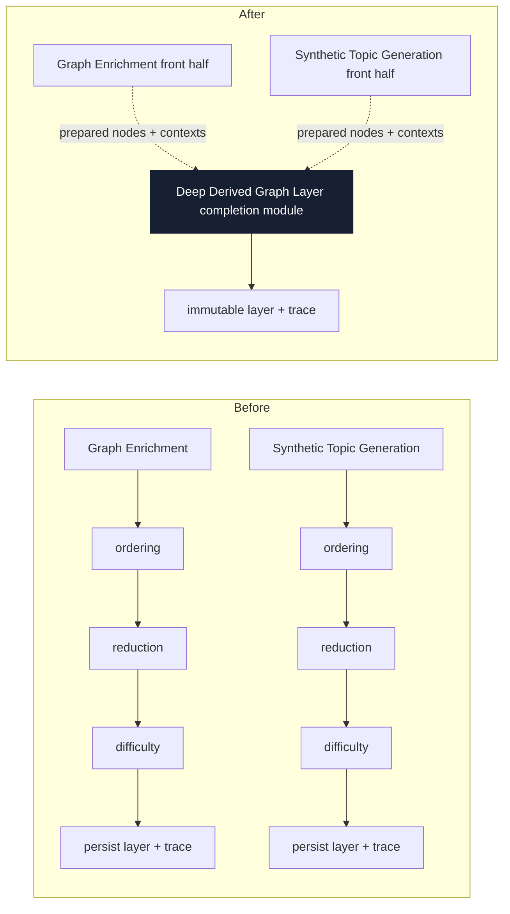
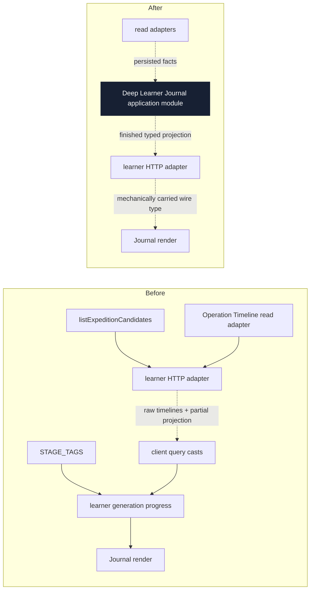
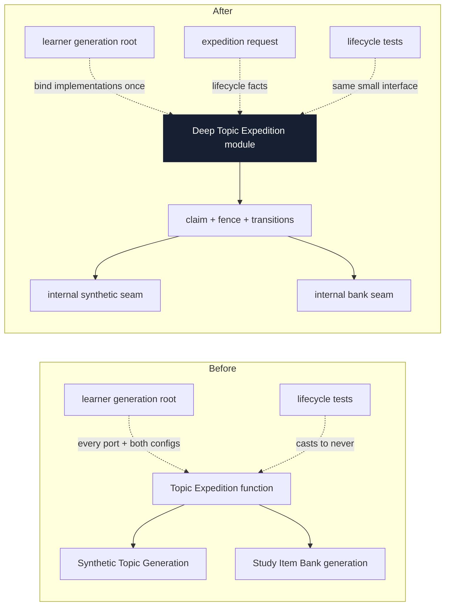
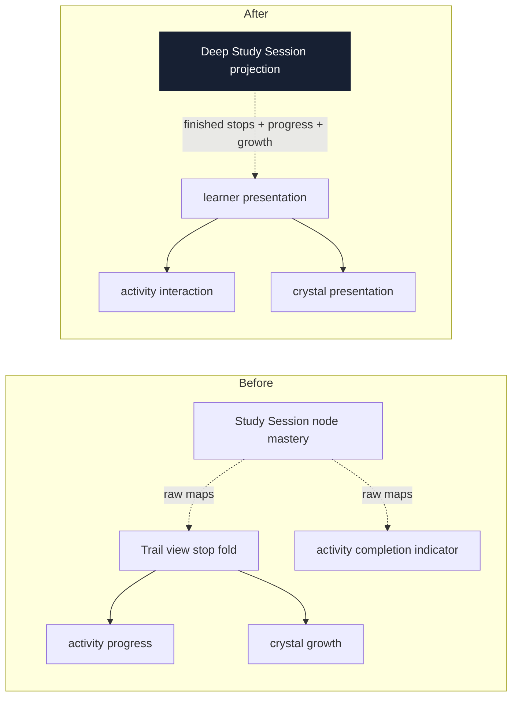

# Architecture deepening review

Date: 2026-07-11

Legend: a solid box is a **module**; a dashed arrow crosses a **seam**; a thick dark box is the
proposed **deep** module. Recommendation strengths are `Strong`, `Worth exploring`, or
`Speculative`.

This review uses the architecture language in
[the architecture skill](../../.agents/skills/improve-codebase-architecture/LANGUAGE.md) and the
project language in [CONTEXT.md](../../CONTEXT.md). It does not propose interfaces yet.

The completed 2026-07-07 review was checked through git history. This review does not re-propose its
implemented operation-catalog, learner-grading, Neural Stage Descriptor, neural-client policy, or
operation-liveness work. It also preserves the prior rejection of grouping `runGraphEnrichment`
inputs: that operation still has one caller. Candidate 1 below is different—the duplicated
Derived Graph Layer completion behavior has two real callers.

---

## Candidate 1 — Collapse Derived Graph Layer completion into one deep module

**Recommendation strength: Strong**  
**Dependency category: ports & adapters**

**Files**

- [`runGraphEnrichment.ts`](../../packages/application/src/runGraphEnrichment.ts), especially the
  ordering, symbolic disposal, intrinsic difficulty, trace, and persistence implementation
  (currently lines 330–450)
- [`runSyntheticGeneration.ts`](../../packages/application/src/runSyntheticGeneration.ts), the
  parallel implementation (currently lines 195–292)
- [`deriveConsensusOrdering.ts`](../../packages/application/src/deriveConsensusOrdering.ts) and
  [`prerequisiteDag.ts`](../../packages/application/src/prerequisiteDag.ts), which are already shared
  one level lower
- [`runGraphEnrichment.test.ts`](../../packages/application/src/runGraphEnrichment.test.ts) and
  [`runSyntheticGeneration.test.ts`](../../packages/application/src/runSyntheticGeneration.test.ts)

**Problem**

Graph Enrichment and Synthetic Topic Generation each implement the same ordering → consensus →
transitive reduction → intrinsic difficulty → Derived Graph Layer persistence behavior, so the
high-level policy and trace assembly have two homes even though ADR-0019 defines one artifact and
both implementations already call the same low-level functions.

The duplication includes the ordering configuration fields, edge-disposition assembly, stage
brackets, difficulty invocation, artifact metadata, and terminal persistence. The source comment in
`runSyntheticGeneration.ts` describes this as an “identical reused back half,” but only the
individual algorithms are reused; the orchestration remains copied. The **deletion test** is
positive: deleting either copy makes the complete behavior reappear in that producer.

**Solution**

Deepen one Derived Graph Layer completion module that accepts already-prepared nodes and
provenance-appropriate judgment contexts, then owns ordering, reduction, difficulty, trace
dispositions, artifact assembly, and persistence for both producers while their distinct front
halves remain local.

**Benefits**

- **Locality:** ordering policy lives once
- **Leverage:** two producers, one interface
- Tests hit one completion seam
- Trace dispositions cannot drift
- Shared configuration has one home
- Future producers reuse the guarantee

**Before / after**

**ADR fit:** This deepens the shared implementation of
[ADR-0019](../adr/0019-graph-enrichment-derived-layer.md),
[ADR-0024](../adr/0024-learner-neutral-intrinsic-difficulty.md), and
[ADR-0028](../adr/0028-measure-non-deterministic-quality-with-non-deterministic-methods.md); it does
not merge the two producers or their lifecycles.

### Grilling decisions

1. **The deep module owns completion through persistence.** Graph Enrichment and Synthetic Topic
   Generation keep their distinct front halves and existing operation-timeline shells. After a
   producer prepares its nodes and producer-specific trace facts, the deep module owns the shared
   ordering, symbolic reduction, intrinsic difficulty, common edge dispositions, Derived Graph
   Layer and artifact assembly, and atomic persistence. A compute-only module was rejected because
   it would leave trace and persistence policy duplicated; moving the whole operation shell was
   rejected because it would invert control over the distinct producer front halves.
2. **The deep module owns judgment-context construction.** Producers supply completed nodes and the
   source-specific evidence facts already available from their front halves. The module derives the
   provenance-appropriate prerequisite-ordering and intrinsic-difficulty contexts, applies the
   mention cap, records evidence-free ordering exclusions, and verifies node/context coverage. Having
   producers supply finished contexts was rejected because it would expose alignment invariants and
   preserve duplicated provenance rules; a separate context module was rejected as a shallow seam
   whose output exists only for completion.
3. **Completion configuration has one shape and one default authority.** The shared ordering sample
   count, direction-contest threshold, edge-confidence floor, prompt budget, and mention cap remain
   flat fields embedded in both producer configurations, but their type and current defaults are
   defined once. Each producer still hashes its complete configuration with its own Neural Stage
   Descriptor set. Separate defaults were rejected because they could drift without intent; hidden
   module defaults were rejected because configuration identity would become less transparent. The
   flat runtime shape is preserved so a behavior-preserving refactor does not cause false config-hash
   churn.
4. **Producer trace facts cross the seam as a discriminated contribution.** A source-grounded
   contribution carries Graph Enrichment's grounding, rescue, rescued-definition, minting, and merge
   dispositions; a synthetic contribution carries Synthetic Topic Generation's grounding and
   Knowledge-Boundary Probe dispositions. The deep module owns every common trace field and assembles
   the complete `EnrichmentRunTrace`, making invalid producer/fact combinations unrepresentable.
   Partial traces and trace-builder callbacks were rejected because they would leave producers
   coupled to common trace assembly and its invariants.
5. **Use one constructed completion module with one operation.** The composition point binds the
   existing prerequisite-ordering, intrinsic-difficulty, and Enrichment Run store ports once; the
   module exposes one `complete` operation whose request is discriminated by the trace-contribution
   variant and carries the current operation's stage bracket. Stateful construction was rejected
   because it exposes invalid partial states, two producer-specific operations were rejected because
   their interfaces could drift, and a new injected completion port was rejected as a hypothetical
   seam with one production adapter. The single operation keeps the leverage of one interface while
   retaining source-grounded/synthetic caller clarity in its request type.
6. **The completion interface enforces provable structural guarantees.** Before persistence it
   rejects duplicate node identities, a trace variant inconsistent with `graphVersionId`, invalid
   references under each trace field's lifecycle contract, invalid prerequisite endpoints, and
   difficulty output that does not cover every surviving node exactly once. Surviving-node fields
   must name surviving nodes; historical trace fields may name a deliberately dropped or absorbed
   node only when their disposition or merge record proves that lifecycle. Any violation fails the
   operation and persists nothing. Trusting callers was rejected because these are module invariants;
   normalizing or dropping malformed data was rejected because it would hide programming defects and
   silently alter authoritative output. These checks judge structure only, never neural semantics.
7. **The completion interface becomes the shared test surface.** Ordering, evidence exclusions,
   symbolic reduction, intrinsic-difficulty coverage, trace assembly, validation failures, and atomic
   persistence move to focused completion-module tests. Each producer keeps tests for its distinct
   front half plus one handoff test proving it supplies the correct contribution and returns the
   persisted layer. Redundant producer-level assertions of shared policy are deleted; the Postgres
   adapter's persistence integration tests remain. Keeping both old suites was rejected as a second
   test representation; testing only through producers was rejected because the new interface would
   not become the test surface.
8. **Real-use verification covers both producers.** After deterministic verification, execute one
   curated-source Graph Enrichment and one Synthetic Topic Generation through production LiteLLM,
   then inspect nodes, prerequisite edges, intrinsic difficulties, exclusions, producer-specific
   trace facts, and persisted artifacts. Record each result as `PASS` or `FIX_FIRST` with concrete
   evidence under `tmp/`; a foundational defect blocks completion. A Graph-Enrichment-only gate was
   rejected because it would leave the synthetic contribution and null-`graphVersionId` path
   unverified, and deterministic-only verification was rejected under the project's real-use quality
   discipline.
9. **Preserve producer behavior except for the new structural guarantees.** Prompts, model aliases,
   sampling, operation stages, public producer return types, summary hooks, persistence shapes, and
   configuration hashes remain unchanged. The only intentional behavior change is that a provable
   structural violation now fails before persistence. Broader producer-interface cleanup was rejected
   as scope expansion; a move-only refactor was rejected because it would omit the selected module
   guarantees.

---

## Candidate 2 — Make the Learner Journal a finished application projection

**Recommendation strength: Strong**  
**Dependency category: ports & adapters**

**Files**

- [`listExpeditionCandidates.ts`](../../packages/application/src/listExpeditionCandidates.ts), which
  returns candidates plus partly enriched `LearnerExpedition` port types
- [`app.ts`](../../apps/learner-api/src/app.ts), where `/journal` appends raw operation timelines
  after the application call (currently lines 154–179)
- [`queries.ts`](../../apps/learner-app/src/lib/queries.ts), where `JournalView` is reconstructed from
  application and port types and every response passes through an unchecked generic cast
- [`generationProgress.ts`](../../apps/learner-app/src/learn/generationProgress.ts), where the
  Learner App imports `STAGE_TAGS` and `OperationTimelineDetail` to derive learner-visible progress
- [`2026-07-10-005-fix-expedition-catalog-discovery-plan.md`](../plans/2026-07-10-005-fix-expedition-catalog-discovery-plan.md),
  which currently owns journal/catalog edits

**Problem**

The learner-facing journal crosses three seams before it becomes usable: the application returns a
partial projection, the HTTP adapter stitches Inspection Read Models onto it, and the Learner App
learns operation-stage ordering and port types to finish generation progress; meanwhile
`unwrap<T>` erases the typed HTTP response and asserts the expected result.

This is not just file size. The interface requires the Learner App to know `STAGE_TAGS`, the
enrichment-versus-study-items phase split, `OperationTimelineDetail`, and `LearnerExpedition`. A
stage-order change can compile in the producer while the learner progress estimate silently drifts.
The **deletion test** is positive: deleting `generationProgress.ts` moves its policy back into the
route or application caller.

**Solution**

Deepen the Learner Journal application module so it composes expedition discovery, learner progress,
layer purpose, and generation progress behind one interface and returns a finished learner
projection whose wire type is mechanically carried through the HTTP seam.

**Benefits**

- **Locality:** journal policy lives once
- **Leverage:** one projection, every platform
- Typed seam becomes test surface
- Learner App drops port knowledge
- Stage changes update one module
- HTTP adapter becomes shallow intentionally

**Before / after**

> **ADR warning:** the current UI-side composition conflicts with
> [ADR-0027](../adr/0027-serve-inspection-through-read-model-ports.md), which assigns
> learner-facing read-and-compute composition to application use-cases rather than Inspection Read
> Models consumed by UI code.

**Active-plan coordination:** Candidate 2 touches the exact journal route and projection being
changed by [plan 2026-07-10-005](../plans/2026-07-10-005-fix-expedition-catalog-discovery-plan.md).
Explore it through that plan or after the plan lands; do not create a competing definition of
catalog scope.

---

## Candidate 3 — Deepen Topic Expedition generation behind its lifecycle interface

**Recommendation strength: Strong**  
**Dependency category: in-process**

**Files**

- [`generateTopicExpedition.ts`](../../packages/application/src/generateTopicExpedition.ts), whose
  input is the intersection of nearly the complete Synthetic Topic Generation and Study Item Bank
  interfaces (currently lines 21–27)
- [`learnerGeneration.ts`](../../apps/learner-api/src/learnerGeneration.ts), which assembles and
  forwards the full dependency union (currently lines 37–102)
- [`generateTopicExpedition.test.ts`](../../packages/application/src/generateTopicExpedition.test.ts),
  where all six lifecycle tests cast the call to `never` because the injected sub-operation fakes do
  not satisfy that union
- [`runSyntheticGeneration.ts`](../../packages/application/src/runSyntheticGeneration.ts) and
  [`generateStudyItemBank.ts`](../../packages/application/src/generateStudyItemBank.ts), whose full
  interfaces leak through the orchestrator

**Problem**

`generateTopicExpedition` contains valuable lifecycle behavior—claim fencing, phase transitions,
Declared Domain persistence, transient release, terminal failure, and readiness—but its interface
is almost the sum of both sub-operation implementations, and it forwards the entire input to each
with object spreads.

The module earns its keep under the **deletion test** because the lease and failure behavior would
otherwise spread into the supervisor. Its interface is nevertheless **shallow**: the caller must
know every neural and storage dependency used inside both sub-operations. The casts in every focused
lifecycle test are direct evidence that the interface is not the practical test surface.

**Solution**

Bind the two generation implementations behind internal seams when the Topic Expedition module is
constructed, leaving each per-expedition call to express only lifecycle facts and keeping the
fencing protocol as the module's deep implementation.

**Benefits**

- Interface matches lifecycle knowledge
- **Locality:** fencing stays in one module
- **Leverage:** supervisor passes one request
- Tests need no impossible casts
- Sub-operations keep focused tests
- Dependency union stops leaking

**Before / after**

**Seam note:** there is one production implementation of each sub-operation, so these should remain
internal seams used by the Topic Expedition implementation and its tests—not new public ports with
hypothetical adapters.

---

## Candidate 4 — Let the Study Session own Expedition Trail stop completion

**Recommendation strength: Strong**  
**Dependency category: in-process**

**Files**

- [`studySessionProjection.ts`](../../packages/application/src/studySessionProjection.ts), which
  owns the completion rule but exposes raw lesson-read and latest-outcome maps (currently lines
  282–337 and 390–433)
- [`trailView.ts`](../../apps/learner-app/src/learn/trailView.ts), which reconstructs theory,
  activity, and capstone stops, their completion, section progress, the next stop, and crystal
  growth (currently lines 75–198)
- [`activityProgress.ts`](../../apps/learner-app/src/learn/activityProgress.ts), which recomputes the
  whole trail to resolve one capstone
- [`ActivitySheet.tsx`](../../apps/learner-app/src/components/ActivitySheet.tsx), which checks the
  same completion primitives again for its indicator (currently lines 326–345)
- [`2026-07-10-003-feat-learner-interaction-system-plan.md`](../plans/2026-07-10-003-feat-learner-interaction-system-plan.md),
  whose U5 will add event-bound mastery motion to these values

**Problem**

The Study Session module owns node mastery, but the Learner App independently derives stop
completion, section completion, next-stop selection, and crystal growth from raw projection maps,
then the activity module rechecks the same primitives; the one completion rule therefore exists as
several hand-synchronized implementations.

The duplication has already widened since the previous review: `trailView.ts` remains the main fold,
`activityProgress.ts` rebuilds it to resolve a capstone, and `ActivitySheet.tsx` independently decides
whether its indicator is complete. The **deletion test** is positive: deleting the stop fold makes
the completion and growth policy reappear across those callers.

**Solution**

Deepen the Study Session projection so its interface carries finished Expedition Trail stops,
per-stop completion, section progress, next-stop identity, and concept growth, leaving the Learner
App to apply themed vocabulary and interaction presentation only.

**Benefits**

- One completion implementation
- **Locality:** progress changes stay upstream
- **Leverage:** every surface agrees
- Motion consumes stable events
- Tests hit the projection seam
- Raw mastery maps stop leaking

**Before / after**

**ADR fit:** This enforces the “one rule” in [CONTEXT.md](../../CONTEXT.md) and the application-owned
learner projection required by [ADR-0027](../adr/0027-serve-inspection-through-read-model-ports.md)
and [ADR-0032](../adr/0032-keep-learner-app-in-flow-through-mastery-aligned-game-ux.md).

**Active-plan coordination:** Candidate 4 should shape or follow U5 of
[plan 2026-07-10-003](../plans/2026-07-10-003-feat-learner-interaction-system-plan.md). Adding more
motion consumers to the raw maps first will increase the later interface migration.

---

## Not promoted to candidates

- `packages/domain-core/src/index.ts` (1,751 lines) and `packages/ports/src/index.ts` (1,257 lines)
  still need internal concern-based file structure for AI navigability. A pure file split would not
  deepen either interface, so it is worthwhile locality maintenance rather than one of this review's
  deepening candidates.
- Explicit adapter construction in the kg-worker and learner generation roots remains composition
  work. The shared neural-client policy is already deep; hiding all remaining wiring would only move
  it.
- `generateStudyItemBank.ts` is large, but its single interface already hides lesson, blueprint,
  option-select, matching, impostor, validation, and persistence behavior. Internal extraction may
  improve locality while editing an item type, but the current module passes the depth test.
- Optional enrichment adapters used by `ENRICH_DISABLE_DEDUP` and
  `ENRICH_DISABLE_MINTING_DURABILITY` are measured alternate behavior, not accidental missing
  wiring. Do not erase those seams without first retiring the measurement need.

---

## Top recommendation

Start with **Candidate 1 — Collapse Derived Graph Layer completion into one deep module**. It is the
clearest real seam: two producers already promise the same Derived Graph Layer semantics, already
share the low-level algorithms, and still duplicate the policy that turns those algorithms into an
immutable layer and trace. Deepening it improves correctness locality without colliding with any
active implementation plan.
