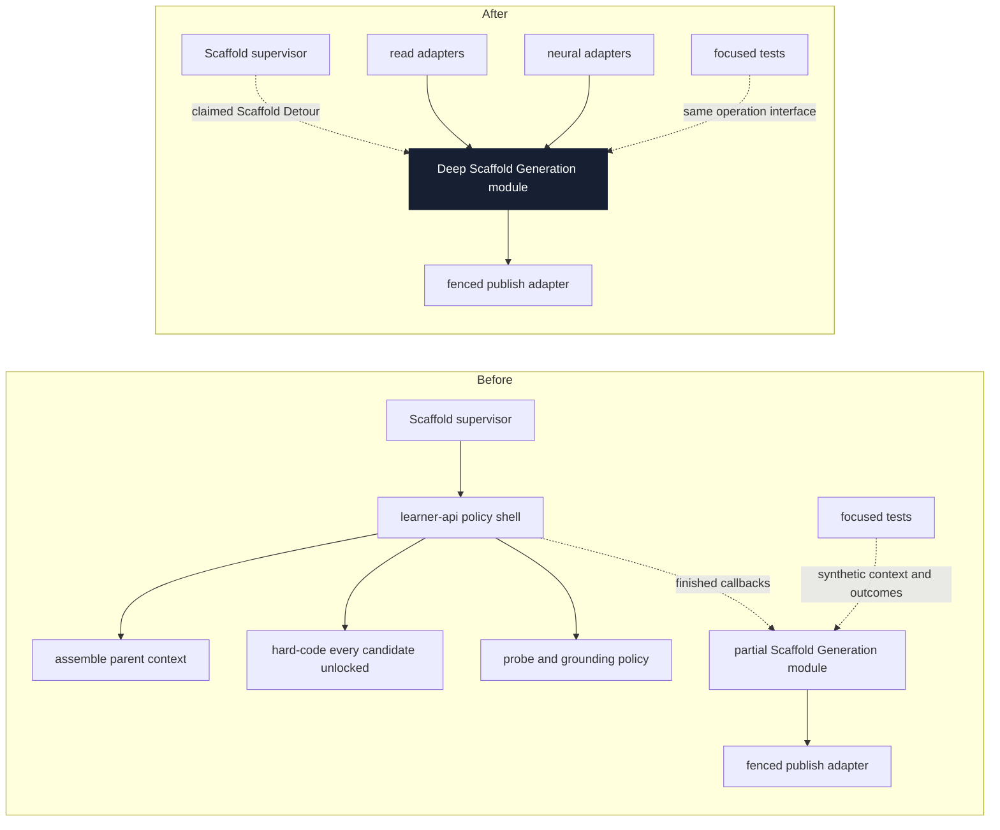
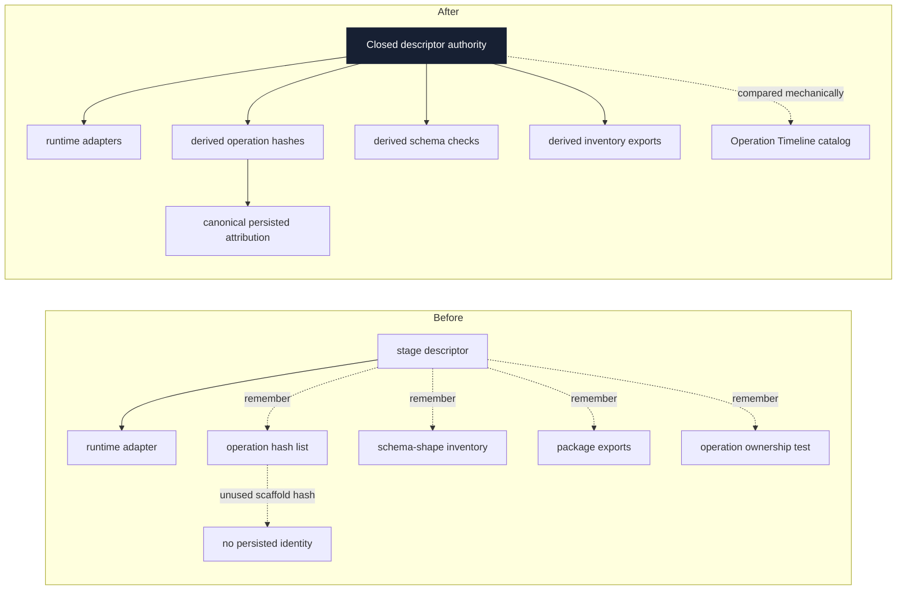
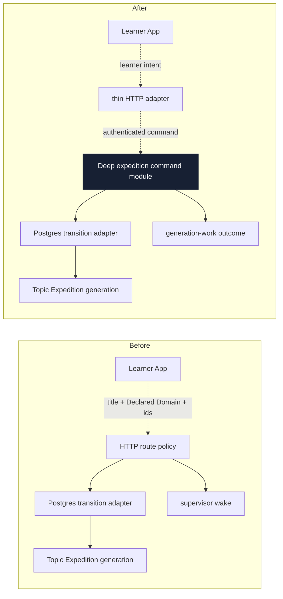

# Architecture deepening review

Date: 2026-07-16. Status: **review findings; no candidate accepted yet**.

This review applies the architecture vocabulary in
[the architecture skill](../../.agents/skills/improve-codebase-architecture/LANGUAGE.md) and the
project language in [CONTEXT.md](../../CONTEXT.md). It proposes directions, not interfaces.

The completed 2026-07-07 and 2026-07-11 architecture reviews were checked through git history and
their shipped outcomes were checked against [TODO.md](../plans/TODO.md). This review does not
re-propose the completed operation catalog, learner grading, Neural Stage Descriptor conversion,
neural-client policy, operation liveness, Derived Graph Layer completion, Expedition Journal,
Topic Expedition generation, or Study Session trail-authority work. Candidate 2 below is a new
post-conversion registration failure in Scaffold Generation, not a proposal to undo the Neural
Stage Descriptor decision.

Recommendation strengths are `Strong`, `Worth exploring`, or `Speculative`.

---

## Candidate 1 — Put all Scaffold Generation policy behind its application seam

**Recommendation strength: Strong**

### Files

- [`learnerScaffoldGeneration.ts`](../../packages/application/src/learnerScaffoldGeneration.ts),
  especially the `loadParentContext` and `groundConcept` callbacks in `ScaffoldGenerationDeps`
- [`learnerScaffoldGeneration.ts`](../../apps/learner-api/src/learnerScaffoldGeneration.ts), which
  implements parent-context assembly, exact-reuse eligibility inputs, parent-grounding selection,
  the Knowledge-Boundary Probe branch, and Generated Grounding Bundle creation
- [`learnerScaffoldGeneration.test.ts`](../../packages/application/src/learnerScaffoldGeneration.test.ts),
  whose tests supply already-finished context and grounding outcomes rather than crossing the
  production seam
- [`learnerScaffold.ts`](../../packages/domain-core/src/learnerScaffold.ts), where the claimed
  Scaffold Detour already carries the learner identity needed by the missing policy
- [ADR-0037](../adr/0037-persist-learner-scoped-scaffold-detours.md), which owns exact-reuse and
  source-less grounding rules

### Problem

The application module describes itself as the deep Scaffold Generation module, but two callbacks
delegate most of the load-bearing policy to its sole production caller:

- `loadParentContext` decides which Derived Graph Layer nodes are eligible exact-reuse candidates,
  which nodes have a Concept Lesson and option-select item, and what verified parent grounding is
  available.
- `groundConcept` decides when parent grounding is sufficient, when to run the Knowledge-Boundary
  Probe, how to synthesize a Generated Grounding Bundle, and when empty grounding becomes a
  `boundary` result.

The production implementation is therefore a second, untested 183-line policy module in the
`learner-api` composition root. The application tests prove behavior only after a caller has already
made those decisions. This is the functional-core/caller-integration failure mode the skill warns
about: the extracted pure implementation is tested, while the consequential bugs can live in how it
is called.

There is already a concrete contract gap. Exact reuse must reject a locked included node, and the
application implementation tests that rule. The production caller sets `isLocked: false` on every
reuse candidate because its callback receives only an enrichment id and parent derived-node id. The
claimed Scaffold Detour has `learnerStateRef`, but that fact never reaches the callback, so the
current interface cannot represent the learner-specific rule. A locked node can consequently be
admitted as a reference Support Step; downstream reference routing does not restore the missing
generation-time rejection.

The storage interface amplifies the same problem. A focused generation test must fake every method
of the 13-method `ScaffoldDetourStorePort`, including many methods generation cannot call. The
interface is not the practical test surface.

**Deletion test:** deleting the `learner-api` policy shell would not remove its complexity. Parent
context, learner-specific reuse eligibility, probing, and grounding would have to reappear in the
next caller. That behavior belongs behind the Scaffold Generation seam.

### Solution

Deepen the application-owned Scaffold Generation module so it owns parent-context loading,
learner-specific exact-reuse eligibility, source-less grounding decisions, generation, and fenced
publication as one operation. Keep Postgres, LiteLLM, and operation-timeline adapters in the
composition root, but make that root bind adapters rather than implement Scaffold Detour policy.

Derive locked status from the same learner-stateful Study Session facts that own trail gating. Bind
the finished generation module once per process, as Topic Expedition generation already is, so one
call represents one claimed Scaffold Detour and tests cross the same interface as production.

No public interface shape is selected here; that belongs in the grilling pass.

### Benefits

- **Locality:** exact reuse, grounding sufficiency, probing, and terminal publication change in one
  module.
- **Leverage:** every supervisor or future durable-orchestration adapter gets the full Scaffold
  Generation contract from one call.
- The accepted locked-node guarantee becomes representable and testable through the production
  interface.
- Focused tests stop manufacturing a supposedly finished `ScaffoldParentContext` and stop faking
  unrelated aggregate-store methods.
- The `learner-api` file becomes composition and instrumentation rather than a second policy home.

### Before / after

**ADR fit:** this enforces [ADR-0001](../adr/0001-adopt-greenfield-deep-module-architecture.md),
[ADR-0027](../adr/0027-serve-inspection-through-read-model-ports.md),
[ADR-0030](../adr/0030-confidence-gated-synthesis-with-web-grounding.md), and
[ADR-0037](../adr/0037-persist-learner-scoped-scaffold-detours.md). It does not move Scaffold
Detours, Support Steps, or Learner State into the learner-neutral graph.

---

## Candidate 2 — Close the Neural Stage Descriptor registration and attribution loop

**Recommendation strength: Strong**

### Files

- [`configHashes.ts`](../../packages/infrastructure-litellm/src/configHashes.ts), where
  `scaffoldGenerationNeuralStageDescriptors` lists only outline and content generation and where an
  otherwise-unused `scaffoldGenerationConfigHash` exists
- [`index.ts`](../../packages/infrastructure-litellm/src/index.ts), which exports every other
  operation's descriptor set and config hash but not Scaffold Generation's
- [`configHashes.test.ts`](../../packages/infrastructure-litellm/src/configHashes.test.ts), whose
  descriptor-to-operation check omits Scaffold Generation
- [`mimoDescriptorShape.test.ts`](../../packages/infrastructure-litellm/src/mimoDescriptorShape.test.ts),
  which assembles another manual descriptor inventory
- [`learnerScaffoldGeneration.ts`](../../apps/learner-api/src/learnerScaffoldGeneration.ts), whose
  actual operation runs outline generation, content generation, Scaffold Content Congruence, the
  Knowledge-Boundary Probe, grounding generation, and embedding-backed probe agreement
- [`0000_initial_lrnki_schema.sql`](../../packages/infrastructure-postgres/src/migrations/0000_initial_lrnki_schema.sql),
  where Scaffold Detours, Support Steps, and operation timelines persist no scaffold config identity
- [ADR-0034](../adr/0034-neural-stage-descriptors-dotprompt-config-hashes.md), which owns mechanical
  neural-operation attribution

### Problem

The Neural Stage Descriptor implementation is deep for executing one forced-tool stage, but its
operation registration remains a set of parallel manual lists. Scaffold Generation demonstrates
that the lists can drift:

- Runtime generation now uses five LLM stage tags plus embedding-backed probe agreement.
- Its config-hash descriptor list contains only the two original scaffold descriptors. It omits the
  shared Knowledge-Boundary Probe and grounding descriptors and the later Scaffold Content
  Congruence descriptor.
- The existing scaffold hash is not exported, called, or persisted. Changing any Scaffold
  Generation prompt, schema, model alias, or retry budget therefore changes no persisted config
  identity.
- The descriptor ownership test loops over extraction, Graph Enrichment, Synthetic Topic
  Generation, and Study Item Bank lists only. The operation-timeline catalog knows about the new
  stage tag, but that separate completeness check cannot detect a descriptor missing from a config
  hash or an operation with no attribution sink.

Even wiring the current hash would be incorrect because its input set is incomplete and it omits
operation-level behavior such as the parent-grounding threshold, Knowledge-Boundary Probe config,
and embedding model. This contradicts the already accepted attribution decision; it is not a reason
to reopen that decision.

**Deletion test:** deleting `configHashes.ts` would spread hash assembly back across composition
roots, so the module earns its keep. The missing scaffold registration shows that its current
interface is still too shallow: callers must remember which parallel inventories and persistence
shapes complete the operation.

### Solution

Make descriptor discovery closed and mechanically derive the all-descriptor inventory,
operation-specific hash membership, export surface, and descriptor-shape checks from one authority.
Keep the application-owned Operation Timeline catalog separate as ADR-0034 requires, but compare the
two authorities mechanically so every neural operation has complete stage ownership.

Make Scaffold Generation consume a hash over every behavior-affecting descriptor and operation knob,
then persist that identity at one canonical attribution point attached to the generated result or
its operation. The grilling pass should choose that persisted home; this review deliberately does
not select an interface or data shape. Measurement-only descriptors should be explicitly classified
as such rather than omitted ad hoc.

### Benefits

- **Locality:** registering a neural stage or operation updates one descriptor authority.
- **Leverage:** config hashing, schema-shape checks, exports, and completeness tests derive from the
  same registration.
- Generated Support Steps become attributable to the behavior that produced them.
- A future operation cannot ship with a computed-but-unreachable hash or without a persistence
  destination.
- The post-ADR drift found here becomes a failing test instead of a review finding.

### Before / after

**ADR fit:** this completes, rather than revisits,
[ADR-0034](../adr/0034-neural-stage-descriptors-dotprompt-config-hashes.md) and preserves the
separate operation ownership catalog required by
[ADR-0029](../adr/0029-persist-shared-operation-stage-timelines.md).

---

## Candidate 3 — Move expedition selection and Topic Expedition launch behavior out of HTTP routes

**Recommendation strength: Strong**

### Files

- [`app.ts`](../../apps/learner-api/src/app.ts), especially `/expedition/choose`,
  `/expedition/activate`, `/expedition/start`, and `/expedition/retry`
- [`index.ts`](../../packages/ports/src/index.ts), where `NewLearnerExpedition` and the broad
  `LearnerExpeditionStorePort` expose persistence and generation-lifecycle facts to callers
- [`PostgresLearnerExpeditionStore.ts`](../../packages/infrastructure-postgres/src/PostgresLearnerExpeditionStore.ts),
  which owns atomic active switching, reset guards, claiming, and fenced progress
- [`app.test.ts`](../../apps/learner-api/src/app.test.ts), whose DB-free expedition coverage stops at
  authentication and transport validation
- [`actions.ts`](../../apps/learner-app/src/lib/actions.ts), which echoes candidate title and Declared
  Domain back across the HTTP seam when choosing an existing expedition
- [ADR-0035](../adr/0035-separate-learner-app-static-spa-typed-api.md), which requires learner HTTP
  routes to map to application use-cases

### Problem

The read side is deep: the Expedition Journal application module returns a finished projection, and
Topic Expedition generation owns the claimed generation lifecycle. The write side between them is
still split across the HTTP adapter and Postgres adapter.

The HTTP routes choose aggregate identity, construct complete persistence inputs, set `generating`
or `ready`, decide activation, look up an existing row, reset retries, and wake the process
supervisor. The Postgres adapter then owns the transactional half of those transitions. To
understand one learner action, a maintainer must follow route state construction, store transition
guards, client echo fields, and supervisor wake behavior.

`/expedition/choose` also treats client-echoed `title` and `declaredDomain` as write authority for an
existing enrichment instead of resolving the authoritative candidate facts server-side. The unused
`enrichmentId` field on the activation transport is a smaller sign that the route interface and
behavior have drifted.

This is the current expedition command family that performs aggregate behavior directly rather
than mapping to an application module. It contradicts the accepted route policy in ADR-0035.
Successful command behavior has no focused application test surface; the DB-free route tests cover
only the outer transport and authentication seam.

**Deletion test:** removing the route-owned state construction would not eliminate the transition
knowledge. It would have to move into another HTTP adapter or be rediscovered by a future caller.
The Postgres methods are deep for atomic persistence, but persistence cannot own candidate
authority, command outcomes, or process wake intent by itself.

### Solution

Put expedition selection, activation, Topic Expedition launch, and retry behavior behind an
application-owned module. Let it resolve authoritative candidate facts, mint identities, choose
valid transitions, and report whether generation work was requested. Keep atomic active switching,
claiming, fencing, and reset writes inside the Postgres adapter; keep transport validation,
authentication, and status mapping in the HTTP adapter.

The existing Topic Expedition generation module remains unchanged behind the claim seam. No exact
command interface is selected here.

### Benefits

- **Locality:** learner command rules live beside Expedition Journal and Topic Expedition behavior,
  not half in routes and half in persistence.
- **Leverage:** another transport adapter can reuse the same transitions without reconstructing
  persistence rows.
- Routes become the thin mappers ADR-0035 specifies.
- Candidate title and Declared Domain stop round-tripping as client-authoritative facts.
- Tests can exercise successful, stale, foreign, and retry command outcomes without Hono or
  Postgres.

### Before / after

**ADR fit:** this enforces [ADR-0001](../adr/0001-adopt-greenfield-deep-module-architecture.md) and
[ADR-0035](../adr/0035-separate-learner-app-static-spa-typed-api.md). It does not merge Extraction
Runs, Graph-Version Builds, Enrichment Runs, or Topic Expedition generation into one lifecycle.

---

## Small cleanup to carry with a selected candidate

`ScaffoldDetourStorePort.claim` has no production caller; only Postgres tests and broad application
fakes invoke or implement it. The supervisor replaced that path with `claimNextGenerating`. Delete
the superseded method, adapter implementation, and test-only setup under rule 18 when Candidate 1 is
touched. This is worthwhile cleanup, not a deepening candidate by itself.

---

## Not promoted to candidates

- `packages/domain-core/src/index.ts` is now 1,847 lines and `packages/ports/src/index.ts` is 1,545
  lines. The prior review's internal concern-based file split remains worthwhile for AI
  navigability, but a pure move behind unchanged barrels would not deepen either interface. Treat
  it as locality maintenance, not an architecture candidate.
- `apps/kg-worker/src/knowledgeGraphWorker.ts` is 1,065 lines after gaining quality-audit commands.
  Its adapter wiring and dispatch remain composition work; moving each command into a similarly
  sized pass-through module would fail the deletion test. Internal extraction may still improve
  navigation when that file is next changed.
- `recallChallenge.ts` is 831 lines, but it is a strong deep-module exemplar: one factory-bound
  interface hides lineup selection, event folding, concurrency handling, grading, persistence, and
  key-free projection, and its focused tests cross that interface. File size alone is not a split
  signal.
- `studySessionTrail.ts` is re-used from many learner modules and some callers recompute its pure
  projection. The completed prior review deliberately made that module the one Study Session trail
  authority; there is no second policy implementation to consolidate, so this review does not
  re-propose that candidate.
- `crystalFormationLayout.ts`, `GuardianFight.tsx`, and `ActivitySheet.tsx` are large but have small
  caller-facing interfaces and focused behavior tests. Their internal size currently buys leverage
  and locality rather than exposing shallow seams.
- Topic and Scaffold supervisors already adapt two real queues to the shared
  `createGenerationSupervisor` scheduler. Queue-specific claim and run hooks are legitimate
  adapters; hiding them behind another pass-through module would not deepen the scheduler.

---

## Top recommendation

Start with **Candidate 1**. It is the only finding where the current seam makes an accepted learner
behavior impossible to express: production marks every exact-reuse candidate unlocked while the
application test suite proves only the unreachable locked-candidate branch. Deepening Scaffold
Generation fixes that locality failure and makes the production interface the test surface.

Candidate 2 should be resolved in the same implementation plan or immediately after it, because a
reworked Scaffold Generation operation should not ship another behavior change without correct
mechanical attribution. Candidate 3 is independent and can follow without touching neural or
learner-neutral graph behavior.
