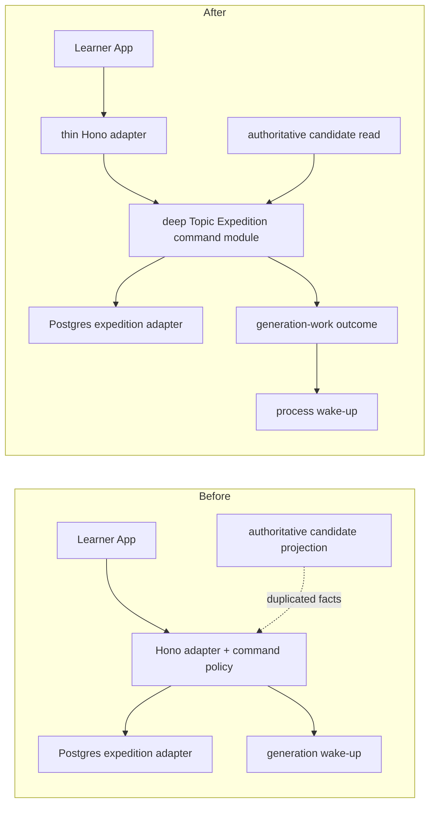
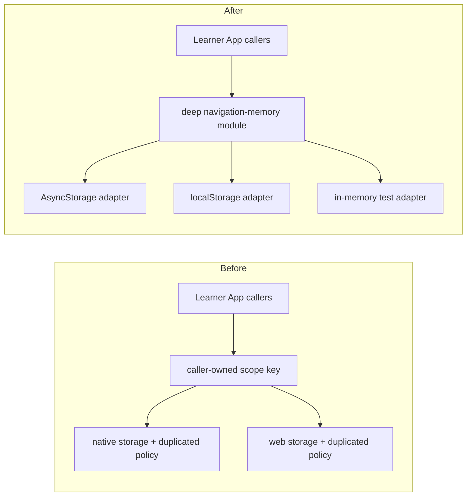
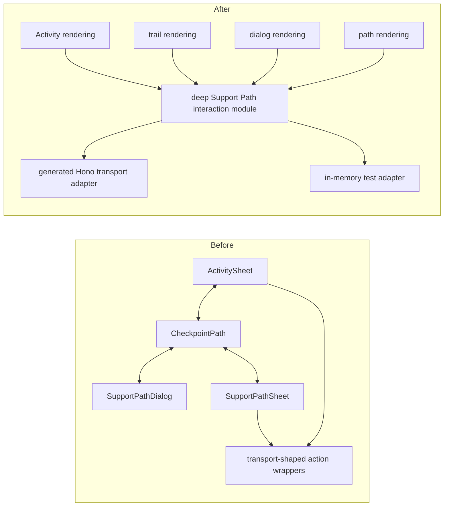
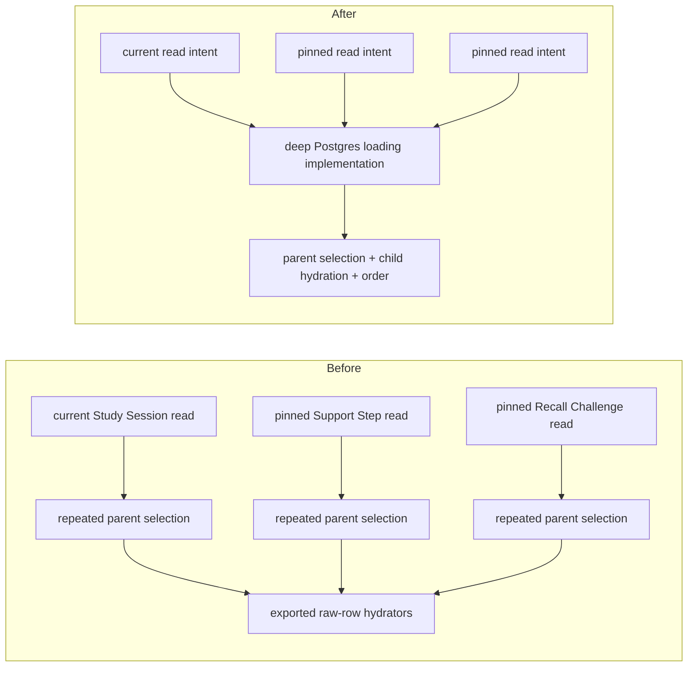
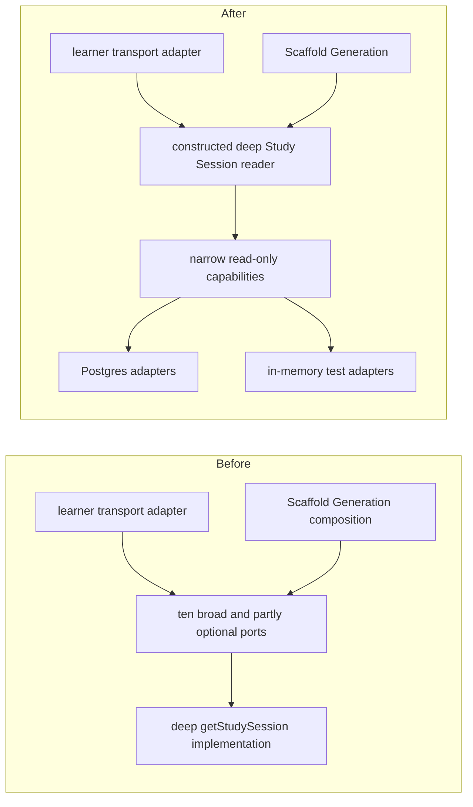

# Architecture deepening review

**Status:** Candidate 3's Source Expedition adoption slice is accepted by the active curated-source
plan. Candidates 4–7 remain shaping findings; original numbering is retained for stable references.
Candidate 2 is implemented and its durable mechanics are source-owned.

## Review question

Which recently changing parts of lrnki would gain meaningful depth by moving substantial
implementation behind a smaller interface, improving locality, leverage, and the test surface?

This review weighted the last 80 commits, then inspected the current source, tests, project language,
and governing ADRs in the affected areas. The deletion test was applied to each suspected shallow
module: if removing it merely moves a little code, it is not a deepening target; if removing it forces
substantial implementation or policy to spread across callers, that implementation needs one owner.
Historical architecture reviews were checked only to avoid proposing work that has already shipped.

## Recommendation summary

| Original rank | Candidate | Strength | Why it made the cut |
| ---: | --- | --- | --- |
| 3 | Move Topic Expedition commands out of the Hono adapter | **Accepted for Source Expedition adoption** | The active plan moves authoritative source candidate qualification/adoption behind one application seam; paused synthetic start/retry are not reopened. |
| 4 | Own navigation memory once over raw platform storage adapters | **Strong — top unplanned recommendation** | Native and web files duplicate policy, and leaked identity construction has already caused a collision defect. |
| 5 | Deepen the Learner App's Support Path interaction lifecycle | **Worth exploring** | Important sequencing and projected-state replacement are spread across two entry paths, rendering modules, and transport-shaped wrappers. |
| 6 | Deepen persisted Study Item and Concept Lesson loading | **Worth exploring** | Raw row shapes and current-versus-pinned selection policy leak across three Postgres implementations. |
| 7 | Narrow the Study Session reader's construction seam | **Worth exploring** | The implementation is deep, but its interface accepts broad write-capable ports and optional wiring that changes projection completeness. |

## Candidate 3 — Move Topic Expedition commands out of the Hono adapter

**Recommendation strength:** Accepted for the Source Expedition adoption slice — tracked by
[plan U2](../plans/2026-08-25-001-qualify-curated-source-learner-workflow.md#u2--deep-source-expedition-qualification-and-adoption).
Synthetic Topic start/retry remain paused and outside that unit.

### Files

- [`apps/learner-api/src/app.ts`](../../apps/learner-api/src/app.ts), especially the choose,
  activate, start, and retry routes
- [`apps/learner-app/src/lib/actions.ts`](../../apps/learner-app/src/lib/actions.ts), especially
  `chooseCandidateExpedition`
- [`expeditionJournal.ts`](../../packages/application/src/expeditionJournal.ts), especially
  authoritative candidate derivation
- [`packages/ports/src/index.ts`](../../packages/ports/src/index.ts), especially
  `LearnerExpeditionStorePort`
- [`PostgresLearnerExpeditionStore.ts`](../../packages/infrastructure-postgres/src/PostgresLearnerExpeditionStore.ts)
- [`topicGenerationSupervisor.ts`](../../apps/learner-api/src/topicGenerationSupervisor.ts)
- [`apps/learner-api/src/app.test.ts`](../../apps/learner-api/src/app.test.ts)

### Problem

The Hono adapter currently owns application policy for selecting, activating, starting, and retrying
Topic Expeditions:

- Choose accepts client-echoed `title` and `declaredDomain` and persists them, although the
  authoritative candidate projection already derives those facts server-side.
- Activate validates an optional `enrichmentId` but never reads it.
- Start mints identity, constructs the lifecycle row, chooses its status, and schedules generation.
- Retry schedules generation even when the conditional reset legitimately changes no row.

The Postgres implementation correctly owns atomic active switching, conditional retry, claiming, and
fencing; those guarantees should remain there. The missing module is the application policy above
those writes. Current route coverage proves anonymous rejection but does not provide a successful
command test surface.

### Deletion test

Positive. Replacing Hono would not remove the need to resolve authoritative candidate facts, mint
identity, select transitions, and decide whether generation work was requested. Leaving that policy
inside a transport adapter guarantees it must be rebuilt for another entrypoint.

### Solution direction

Move Topic Expedition command behavior into one application module. Keep Hono responsible for
transport validation, learner authentication, and result mapping. Keep Postgres responsible for
atomic persistence transitions. Keep supervisor wake-up as process composition driven by the
application outcome rather than an unconditional route side effect.

The persistence dependencies are local-substitutable, with Postgres production adapters and in-memory
test adapters. The Hono-to-application call and supervisor signal are in-process dependencies; no
generic workflow port is justified.

### Benefits and test surface

- **Locality:** candidate authority and lifecycle transition policy live together in application
  code rather than across projection, route, and store implementations.
- **Leverage:** another transport or process entrypoint can use the same implementation.
- **Tests:** the application interface becomes the successful-behavior test surface for candidate
  resolution, stale or foreign selection, activation, missing/non-failed retry, and whether work was
  actually requested.
- **Adapters:** route tests narrow to validation, authentication, and result mapping; Postgres tests
  retain atomic-transition invariants.

### Before / after

### ADR fit

This enforces [ADR-0001](../adr/0001-adopt-greenfield-deep-module-architecture.md) and the typed,
thin transport-adapter direction in
[ADR-0035](../adr/0035-separate-learner-app-static-spa-typed-api.md). No durable persistence guarantee
moves out of the Postgres adapter.

## Candidate 4 — Own navigation memory once over raw platform storage adapters

**Recommendation strength:** Strong

### Files

- [`navMemory.ts`](../../apps/learner-app/src/lib/navMemory.ts)
- [`navMemory.web.ts`](../../apps/learner-app/src/lib/navMemory.web.ts)
- [`guardianEntry.ts`](../../apps/learner-app/src/lib/guardianEntry.ts), especially `recallScopeKey`
- [`JournalSplashCoordinator.tsx`](../../apps/learner-app/src/components/JournalSplashCoordinator.tsx)
- [`CheckpointPath.tsx`](../../apps/learner-app/src/components/CheckpointPath.tsx)
- [`CrystalVista.tsx`](../../apps/learner-app/src/components/CrystalVista.tsx)
- [`CheckpointPath.test.tsx`](../../apps/learner-app/src/components/CheckpointPath.test.tsx)

### Problem

The native and web navigation-memory files are almost line-for-line duplicate implementations. Their
real variation is raw storage—AsyncStorage on native and `localStorage` on web—but both files own key
composition, serialization, corruption handling, per-memory failure defaults, reward-key validation,
and deduplication.

Guardian scope identity also leaks outside the module. `recallScopeKey` knows that a Recall Challenge
scope requires both kind and anchor, while navigation memory accepts only an opaque string. A prior
Leg/summit collision is protected by a caller test that imports the real key helper while mocking the
memory module, demonstrating that the invariant and its test surface are split across seams.

### Deletion test

The high-level navigation-memory module passes: deleting it would spread key construction, parsing,
failure defaults, and storage access into unrelated callers. The platform implementations are too
broad, however, because deleting either one's policy merely reveals a duplicated copy in the other.
The small key helper is also shallow by itself. The opportunity is to deepen the existing module,
not add another wrapper.

### Solution direction

Keep one navigation-memory implementation that owns logical identity, key construction,
serialization, validation, and loss semantics. Put only raw key-value mechanics behind native and web
storage adapters. This is a local-substitutable dependency with two real production adapters and a
natural in-memory test adapter.

### Benefits and test surface

- **Locality:** a new lossable navigation memory is implemented once rather than copied into native
  and web files.
- **Leverage:** Journal splash, Guardian arrival, and Crystal Vista reward presentation use one
  implementation without increasing their interface.
- **Tests:** exercise learner isolation, section/summit identity separation, expedition-scoped Vista
  snapshots, validation/deduplication, and each memory's intended failure default through the deep
  interface with an in-memory adapter.
- **Adapters:** retain small conformance checks for AsyncStorage and `localStorage`; presentation
  tests may continue mocking the high-level interface.

### Before / after

### ADR fit

This strengthens [ADR-0035](../adr/0035-separate-learner-app-static-spa-typed-api.md) by keeping
platform variation behind file-level adapters with one shared implementation. It preserves
[ADR-0032](../adr/0032-keep-learner-app-in-flow-through-mastery-aligned-game-ux.md): this remains
lossable presentation memory, never Learner State, mastery, progress, or reward authority.

## Candidate 5 — Deepen the Learner App's Support Path interaction lifecycle

**Recommendation strength:** Worth exploring

### Files

- [`ActivitySheet.tsx`](../../apps/learner-app/src/components/ActivitySheet.tsx)
- [`CheckpointPath.tsx`](../../apps/learner-app/src/components/CheckpointPath.tsx)
- [`SupportPathDialog.tsx`](../../apps/learner-app/src/components/SupportPathDialog.tsx)
- [`SupportPathSheet.tsx`](../../apps/learner-app/src/components/SupportPathSheet.tsx)
- [`apps/learner-app/src/lib/actions.ts`](../../apps/learner-app/src/lib/actions.ts), especially the
  Scaffold Detour transport wrappers
- [`ActivitySheet.test.tsx`](../../apps/learner-app/src/components/ActivitySheet.test.tsx),
  [`CheckpointPath.test.tsx`](../../apps/learner-app/src/components/CheckpointPath.test.tsx), and
  [`SupportPathSheet.test.tsx`](../../apps/learner-app/src/components/SupportPathSheet.test.tsx)

### Problem

The rendering modules are individually useful, but the interaction protocol is distributed:

- `ActivitySheet` owns term selection, request state, and close-before-root-handoff sequencing.
- `CheckpointPath` owns separate progress/path identities, generating/failed/ready routing,
  retry/hide behavior, checkpoint-reference routing, and overlay handoffs.
- `SupportPathSheet` owns projected plus optimistic completion, generated-versus-reference mutation
  selection, pending state, and advancement.
- `actions.ts` mirrors transport routes and owns some cache refreshes.
- Generating/failed/ready dialog state is mapped in more than one place.

The effective interface is therefore larger than the declared props and wrappers: callers must know
which identity survives, which surface closes first, which mutation refreshes the Study Session, when
the projected state replaces optimistic state, and which reference returns to the ordinary trail.
Recent Support Path changes repeatedly crossed these files.

The test seam follows the same split. `CheckpointPath.test.tsx` replaces the Support Path node, sheet,
and dialog with test doubles, so it does not exercise the root-owned progress-to-path handoff with the
real rendering modules. `ActivitySheet.test.tsx` proves only its callback half while replacing the
transport-shaped wrappers.

### Deletion test

The rendering modules pass: deleting the dialog or sheet would concentrate substantial rendering,
accessibility, and step-flow implementation in callers. Keep them. Individual action wrappers do not
pass; deleting one usually moves a typed transport call and cache refresh into its caller. The
cross-caller callback protocol also exposes sequencing rather than hiding it.

### Solution direction

Explore replacing the shallow transport wrappers and callback protocol with one deeper Support Path
interaction module. Retain the rendering modules. Keep React Query mechanics as an internal seam and
the generated Hono transport as the production adapter; use a coherent in-memory adapter for
interaction tests instead of isolated function mocks.

The transport dependency is remote-owned: its learner process is in this repository, while the
production call still crosses a process seam. That justifies a production Hono adapter and an
in-memory test adapter without turning React Query or overlay state into public ports.

This candidate needs grilling because some close/open timing is presentation-specific. The deeper
module should own shared interaction state and authoritative projection replacement without absorbing
rendering or recreating server-owned mastery, eligibility, grading, or Scaffold Generation policy.

### Benefits and test surface

- **Locality:** request, retry, hide, read, grade, refresh, and projected-state replacement change in
  one interaction implementation where they are genuinely shared.
- **Leverage:** the Explorable Term entry and the existing Support Path trail entry cross one seam.
- **Tests:** drive request → generating/ready/refused, retry, hide, generated grading, pinned neutral
  reference grading, and handoff results through the deeper interface with an in-memory adapter.
- **Rendering tests:** retain focused visual and accessibility coverage; replace transport-mock tests
  that merely restate the interaction implementation.

### Before / after

### ADR fit

This can align with [ADR-0032](../adr/0032-keep-learner-app-in-flow-through-mastery-aligned-game-ux.md),
[ADR-0035](../adr/0035-separate-learner-app-static-spa-typed-api.md), and
[ADR-0037](../adr/0037-persist-learner-scoped-scaffold-detours.md), provided the implementation keeps
generated Support Steps scaffold-scoped, pinned references neutral, and all durable learner policy on
the server-owned side of the transport seam.

## Candidate 6 — Deepen persisted Study Item and Concept Lesson loading

**Recommendation strength:** Worth exploring

### Files

- [`PostgresLearnerLoopStores.ts`](../../packages/infrastructure-postgres/src/PostgresLearnerLoopStores.ts),
  especially `hydrateStudyItemRows`, `StudyItemRow`, `hydrateConceptLessonRows`, and `LessonRow`
- [`PostgresLearnerScaffoldStore.ts`](../../packages/infrastructure-postgres/src/PostgresLearnerScaffoldStore.ts)
- [`PostgresLearnerRecallChallengeStore.ts`](../../packages/infrastructure-postgres/src/PostgresLearnerRecallChallengeStore.ts)
- Their corresponding database-backed tests in
  [`packages/infrastructure-postgres/src`](../../packages/infrastructure-postgres/src)

### Problem

The shared hydrators already hide substantial child-row stitching, but their exported interface is
still SQL plus raw persistence rows. Every caller must repeat the full parent column list and know the
persisted parent shape.

Callers also own a consequential selection distinction:

- ordinary Study Session reads select only current, non-superseded Study Items and Concept Lessons;
- pinned Support Step references and Recall Challenge lineups resolve exact identities even after
  supersession.

Adding a persisted field requires coordinated edits to several parent queries, raw row types, and the
hydrator. A new caller can apply the wrong currentness rule and silently break durable replay. Raw
internal types from one Postgres implementation are therefore functioning as a shallow interface for
unrelated Postgres implementations.

### Deletion test

The hydrators pass: deleting them would duplicate multi-query child stitching and discriminated Study
Item reconstruction. The recommendation is to deepen them, not wrap them. Complete selection,
current-versus-pinned intent, raw row shapes, hydration, and order preservation need one internal
Postgres owner.

### Solution direction

Deepen the existing concrete Postgres implementation so callers request the required current or
identity-pinned behavior without exchanging raw rows. Keep this internal to infrastructure-postgres;
a new public port or generic SQL adapter would be a hypothetical seam with no leverage.

### Benefits and test surface

- **Locality:** persisted shape, parent selection, child hydration, and current/pinned semantics move
  behind one implementation interface.
- **Leverage:** ordinary Study Sessions, pinned Support Steps, and Recall Challenge lineup replay use
  the same loading implementation.
- **Tests:** preserve database-backed behavior tests at the existing outward port interfaces: current
  reads exclude superseded assets, pinned reads retain exact identities, every Study Item family
  hydrates fully, and caller order is retained.
- **Avoid shallow tests:** do not create tests for SQL helper mechanics when the outward behavior can
  prove the invariant.

### Before / after

### ADR fit

This preserves source-owned typed Study Items and Concept Lessons, Postgres-owned stitching, and the
code-first persisted shape governed by
[ADR-0039](../adr/0039-own-persisted-shape-in-code-first-drizzle-schema.md). It does not justify
exposing schema tables to application code or replacing runtime queries with generated migration
artifacts.

## Candidate 7 — Narrow the Study Session reader's construction seam

**Recommendation strength:** Worth exploring

### Files

- [`getStudySession.ts`](../../packages/application/src/getStudySession.ts)
- [`studySessionProjection.ts`](../../packages/application/src/studySessionProjection.ts)
- [`apps/learner-api/src/app.ts`](../../apps/learner-api/src/app.ts), especially the Study Session
  route composition
- [`apps/learner-api/src/learnerScaffoldGeneration.ts`](../../apps/learner-api/src/learnerScaffoldGeneration.ts)
- [`getStudySession.test.ts`](../../packages/application/src/getStudySession.test.ts)
- Broad store interfaces in [`packages/ports/src/index.ts`](../../packages/ports/src/index.ts)

### Problem

`getStudySession` is already a deep module: it coordinates many reads and returns a finished Study
Session rather than leaking projection rules. Its construction seam is shallow, however. It accepts
ten broad store/read implementations, several optional, and callers reconstruct the persistence
assembly transcript.

The source comment says no write port is imported and mutation is structurally impossible, but the
accepted interfaces expose writes including persistence, response append, lesson-read mutation, and
Scaffold/Recall Challenge transitions. The implementation happens not to call them; the type system
does not enforce the claimed invariant. Focused test adapters contain many unrelated methods that
throw `not used` solely to satisfy these broad interfaces.

Optional dependencies have also accumulated feature by feature. The same `getStudySession` call can
return materially different sections depending on which implementations a composition root remembered
to supply. The learner route and Scaffold Generation each know a long but different construction
transcript.

### Deletion test

`getStudySession` passes: deleting it would spread coordinated reads, Recall Challenge projection,
and Study Session composition across callers. Do not add a sibling pass-through wrapper. Deepen the
existing module by reducing its construction interface and making the read-only invariant structural.

### Solution direction

Explore one owner for the complete Study Session read set, with narrow read capabilities rather than
broad write-capable store ports. Callers should express Study Session intent rather than individually
assembling persistence implementations. The exact construction shape is intentionally undecided.

These are real local-substitutable seams: production has Postgres adapters and focused tests have
in-memory adapters. Keep `composeStudySession` as a separate pure implementation and keep learner
projection out of Admin Lab inspection read ports.

### Benefits and test surface

- **Locality:** the complete read set and feature wiring change in one application module.
- **Leverage:** the learner transport adapter and Scaffold Generation opening-session authority use
  the same constructed reader.
- **Tests:** a narrower interface removes unused write methods from test adapters and makes omitted
  feature wiring explicit instead of silently projecting empty sections.
- **Preserve depth:** tests continue through `getStudySession`; pure projection tests remain separate.

### Before / after

### ADR fit

This reinforces [ADR-0001](../adr/0001-adopt-greenfield-deep-module-architecture.md), preserves the
learner-projection ownership in
[ADR-0027](../adr/0027-serve-inspection-through-read-model-ports.md), and keeps the Hono
implementation as an adapter under
[ADR-0035](../adr/0035-separate-learner-app-static-spa-typed-api.md).

## Tempting false positives rejected

- **Better Auth and learner sign-in:** `authClient.ts`, `session.ts`, and `queries.ts` already hide
  transport choice, OAuth return, atomic query-cache replacement, naming, and logout behind small
  interfaces with focused tests. Recent churn reflects an intentional authority replacement, not a
  shallow module.
- **Topic Expedition lifecycle construction:** `generateTopicExpedition.ts` already hides the
  process-lived lifecycle behind a small constructed interface. Re-proposing that completed
  deepening would add no leverage.
- **Learner map and long `CheckpointPath`:** deterministic route geometry and Android bitmap-cap
  behavior already sit behind small interfaces with regression tests. File length alone is not a
  depth signal.
- **Large `generateStudyItemBank.ts`:** its interface hides Concept Lesson generation, blueprint
  planning, all activity families, verification, and atomic persistence. Internal editing locality may
  improve, but size alone fails the deletion test for a new external seam.
- **Large `domain-core` and `ports` barrels:** splitting files would improve navigation, not depth,
  leverage, or the test surface.
- **Generic Better Auth, SQL, or neural-operation ports:** each would create a hypothetical adapter
  seam or merely move composition. Existing owned/external adapters already sit at the justified
  seams.

## Top remaining recommendation

Execute candidate 3's accepted Source Expedition slice through the active plan. Among work without a
plan owner, candidate 4 is next: navigation-memory policy still spans two platform implementations.

## Open decisions

1. For candidate 5, which interaction transitions are genuinely shared and which close/open timings
   must remain inside rendering modules?
