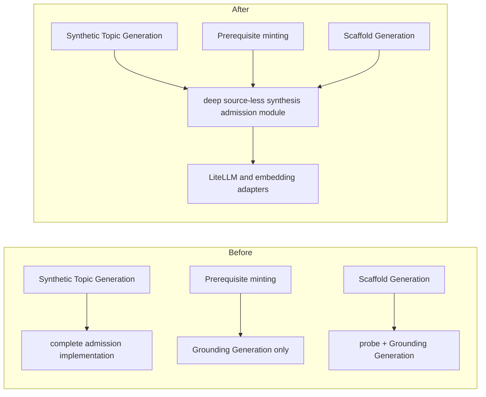
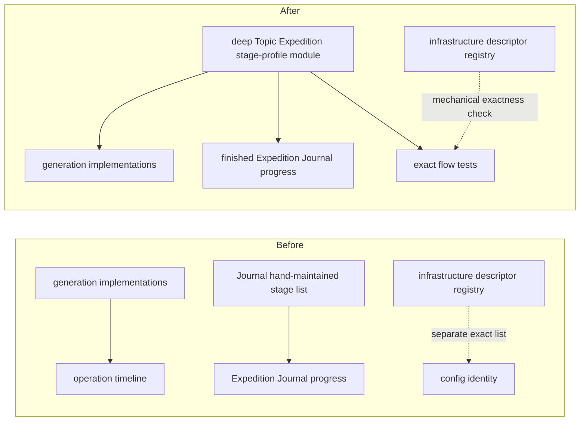
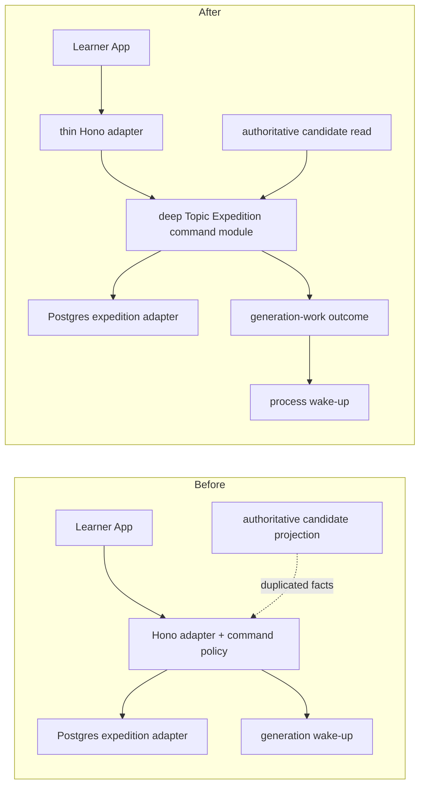
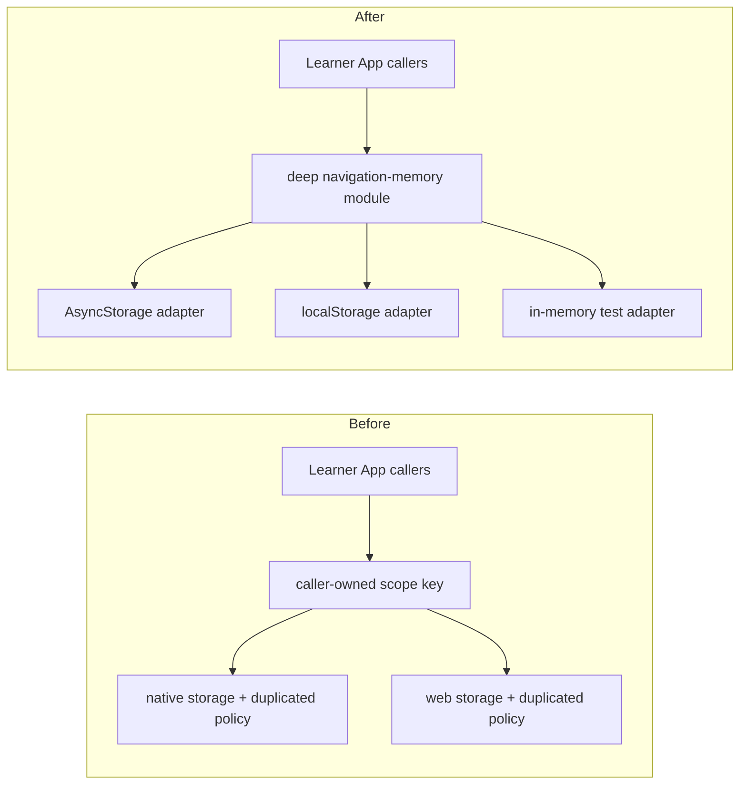
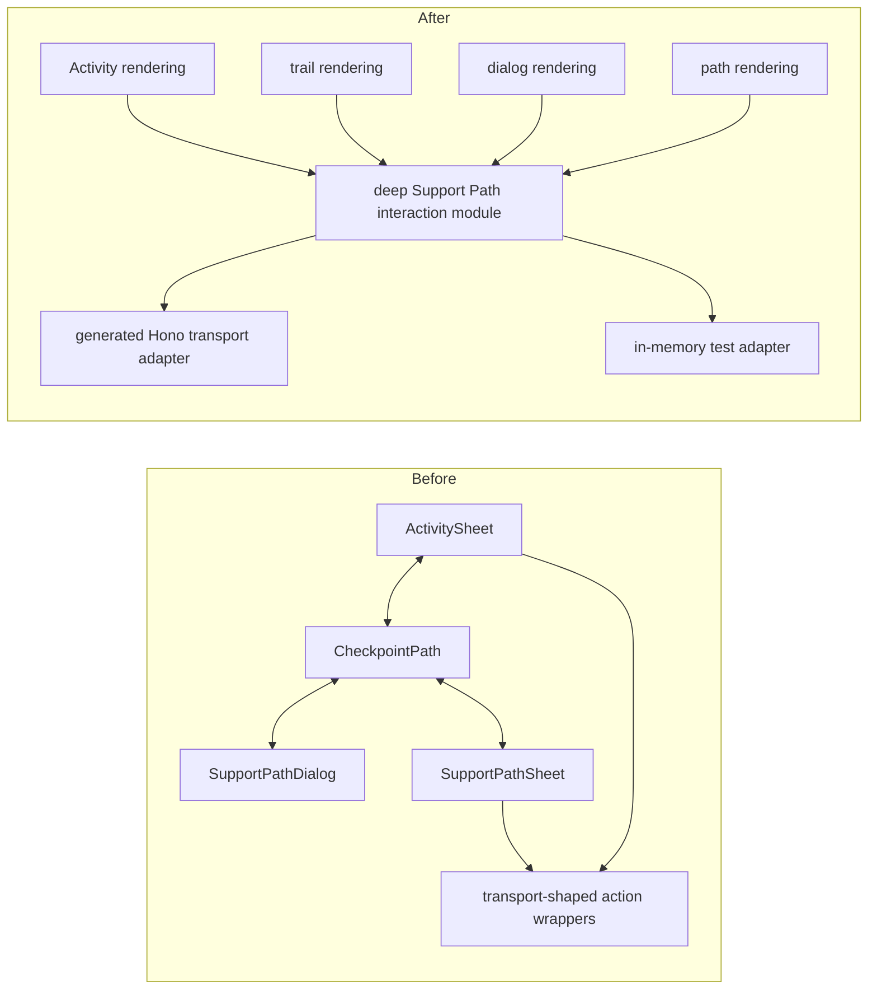
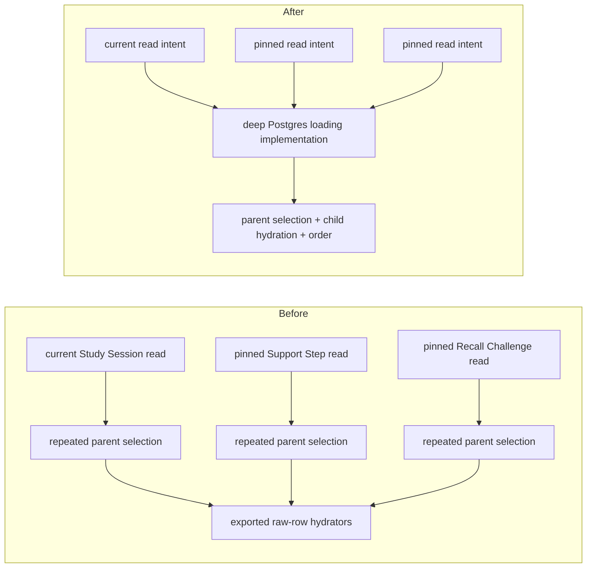
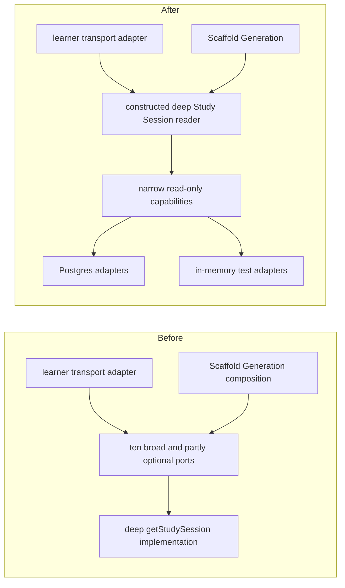

# Architecture deepening review

**Status:** Candidate 1 is accepted and has a Ready
[implementation plan](../plans/2026-08-19-001-deepen-source-less-grounding-admission.md). Its problem
framing, requirements, and scope remain canonical here; the other candidates remain shaping findings.

## Review question

Which recently changing parts of lrnki would gain meaningful depth by moving substantial
implementation behind a smaller interface, improving locality, leverage, and the test surface?

This review weighted the last 80 commits, then inspected the current source, tests, project language,
and governing ADRs in the affected areas. The deletion test was applied to each suspected shallow
module: if removing it merely moves a little code, it is not a deepening target; if removing it forces
substantial implementation or policy to spread across callers, that implementation needs one owner.
Historical architecture reviews were checked only to avoid proposing work that has already shipped.

## Recommendation summary

| Rank | Candidate | Strength | Why it made the cut |
| ---: | --- | --- | --- |
| 1 | Put source-less synthesis admission behind one shared module | **Strong — top recommendation** | One accepted policy has three consumers, but only one has the complete implementation. |
| 2 | Give Topic Expedition generation one application-owned stage profile | **Strong** | A hand-maintained second representation has already omitted three running stages and reports false indeterminate progress. |
| 3 | Move Topic Expedition commands out of the Hono adapter | **Strong** | Presentation facts are accepted as authority, one transport field is unused, and successful command policy has no application test surface. |
| 4 | Own navigation memory once over raw platform storage adapters | **Strong** | Native and web files duplicate policy, and leaked identity construction has already caused a collision defect. |
| 5 | Deepen the Learner App's Support Path interaction lifecycle | **Worth exploring** | Important sequencing and projected-state replacement are spread across two entry paths, rendering modules, and transport-shaped wrappers. |
| 6 | Deepen persisted Study Item and Concept Lesson loading | **Worth exploring** | Raw row shapes and current-versus-pinned selection policy leak across three Postgres implementations. |
| 7 | Narrow the Study Session reader's construction seam | **Worth exploring** | The implementation is deep, but its interface accepts broad write-capable ports and optional wiring that changes projection completeness. |

Candidates 1 and 2 are related but not the same decision. Candidate 1 owns factual admission of
source-less content; candidate 2 owns Topic Expedition's observable generation sequence. If candidate
1 changes stage orchestration, candidate 2 should be assessed in the same implementation plan or its
immediate follow-up so progress cannot drift again.

## Candidate 1 — Put source-less synthesis admission behind one shared module

**Recommendation strength:** Strong — top recommendation

### Files

- [ADR-0030](../adr/0030-confidence-gated-synthesis.md) and
  [ADR-0037](../adr/0037-persist-learner-scoped-scaffold-detours.md)
- [`runSyntheticGeneration.ts`](../../packages/application/src/runSyntheticGeneration.ts), especially
  `runSyntheticGeneration` and `validateVerificationPlan`
- [`enrichmentNodeMinting.ts`](../../packages/application/src/enrichmentNodeMinting.ts), especially
  `assembleEnrichmentNodes`
- [`learnerScaffoldGeneration.ts`](../../packages/application/src/learnerScaffoldGeneration.ts),
  especially `ScaffoldGenerationConstruction` and the generated Support Step path
- [`learnerScaffoldGeneration.ts` composition](../../apps/learner-api/src/learnerScaffoldGeneration.ts)
- [`packages/ports/src/index.ts`](../../packages/ports/src/index.ts), especially the Grounding Generation
  and grounding-verification ports
- [`runSyntheticGeneration.test.ts`](../../packages/application/src/runSyntheticGeneration.test.ts),
  [`enrichmentNodeMinting.test.ts`](../../packages/application/src/enrichmentNodeMinting.test.ts), and
  [`learnerScaffoldGeneration.test.ts`](../../packages/application/src/learnerScaffoldGeneration.test.ts)

### Problem

[ADR-0030](../adr/0030-confidence-gated-synthesis.md) is the canonical decision for admitting
learner-facing source-less world knowledge. Current consumers implement different subsets of that
decision:

| Consumer | Knowledge-Boundary Probe | Grounding Generation | Independent claim verification | Bounded verified regeneration |
| --- | --- | --- | --- | --- |
| Synthetic Topic Generation | Yes | Yes | Yes | Yes |
| Model-grounded prerequisite minting | No | Yes | No | No |
| Generated Support Steps | Yes | Yes | No | No |

The complete probe → draft → claim-targeted plan → draft-blind answer → drop-only comparison → bounded
regeneration implementation lives inside `runSyntheticGeneration`. Model-grounded prerequisite
minting passes a durability-approved proposal directly through Grounding Generation and admits the
result into a Derived Graph Layer. Scaffold Generation probes and grounds a generated label, then
uses the unchecked Grounding Bundle to generate a Support Step.

The current port requests and comments also expose Synthetic Topic Generation's `topic` context as if
it were the shared concept. Tests mirror the fragmentation: the synthetic tests prove passage
coverage, draft isolation, drop-only output, and retries, while the other two consumers can prove only
their shorter local sequences.

### Deletion test

Positive. Deleting the roughly 139-line admission implementation inside `runSyntheticGeneration`
does not eliminate its complexity. Conforming implementations would have to recreate the same probe,
verification, monotonicity, rejection-feedback, and retry behavior in three callers. The fact that
two callers currently omit parts of it is direct evidence that the seam is misplaced.

### Solution direction

Put the complete source-less synthesis admission implementation behind one small interface and have
all three consumers cross that seam. Keep minting durability separate: durability and factual
admission judge different harm classes. The accepted external interface and Scaffold-specific
artifact policy are recorded below.

The neural dependencies are true external dependencies with production LiteLLM/embedding adapters
and focused in-memory test adapters. Deterministic plan coverage, drop-only enforcement, retry
accounting, and admission stay inside the module as implementation rather than becoming more ports.

### Benefits and test surface

- **Locality:** probe policy, claim verification, rejection sampling, and monotonic admission change
  in one module.
- **Leverage:** Synthetic Topic Generation, prerequisite minting, and Scaffold Generation receive the
  same guarantees from one implementation.
- **Tests:** move detailed admission cases from the synthetic caller to the deeper interface. Keep
  consumer tests focused on their own behavior: Derived Graph Layer assembly and persistence,
  prerequisite proposal/durability, and fenced Support Step publication.
- **End-to-end application invariant:** no unadmitted source-less draft can reach a Derived Graph
  Layer or an immutable generated Support Step.

### Before / after

### ADR fit and accepted scope

This directly enforces [ADR-0001](../adr/0001-adopt-greenfield-deep-module-architecture.md),
[ADR-0030](../adr/0030-confidence-gated-synthesis.md), and the generated Support Step requirement in
[ADR-0037](../adr/0037-persist-learner-scoped-scaffold-detours.md). It preserves the distinct
operation identities and Grounding Origin rules owned by
[ADR-0019](../adr/0019-graph-enrichment-derived-layer.md) and
[ADR-0023](../adr/0023-grounding-origin-model-and-cross-family-generated-node-judge.md).

**Accepted 2026-08-19 — admission target:** Candidate 1 must cover every positive factual claim in
the final generated Support Step persisted for the learner. An admitted Grounding Bundle is necessary
grounding, but it cannot attest to factual claims introduced by the later neural content draft. The
treatment of intentionally incorrect distractors and answer-key correctness remains a separate harm
class governed by the accepted decision below.

**Accepted 2026-08-19 — rejection unit:** Any rejected positive factual claim rejects the complete
structured Support Step content draft. Verification may return a rejection reason, but it may not
delete, rewrite, or partially salvage learner-facing fields. A subsequent bounded attempt starts from
the admitted Grounding Bundle and produces a fresh complete draft.

**Accepted 2026-08-19 — exercise verification:** Intentionally incorrect distractors are outside
positive-claim factual admission. After factual admission, the complete exercise must pass a separate
answer-key verification stage that checks the keyed answer and all distractors without exposing the
key to the judge. Either stage rejects the complete Support Step content draft. The design should
reuse or deepen the existing Study Item key-verification behavior rather than mixing the two harm
classes into the source-less admission module; the accepted interface boundary is recorded below.

**Accepted 2026-08-19 — attempt ownership:** Grounding Bundle admission remains an earlier bounded
process. One `contentDraftAttempts` envelope owns each complete Support Step content attempt across
generation, structural validation, congruence, positive-claim factual admission, and answer-key
verification; those checks do not add nested regeneration loops. Exhaustion omits that generated
step, preserving other safe steps. If none survive, the existing atomic Scaffold Detour failure
behavior remains authoritative.

**Accepted 2026-08-19 — durable evidence:** Each immutable generated Support Step persists its final
payload and admitted Grounding Bundle. The existing Scaffold Detour link to the publishing operation,
config hash, and timeline remains the operation identity; step rows do not duplicate it. The final
positive-claim projection is mechanically derived from the payload. Raw verification questions and
answers, rejected drafts, rejection feedback, discarded attempts, and redundant pass flags do not
persist.

**Accepted 2026-08-19 — unavailable dependencies:** Required factual-admission and answer-key
dependencies never fail open. Their unavailability aborts the claimed generation attempt without
consuming a content-draft attempt or publishing any steps. Infrastructure-only failure follows the
existing fenced release and supervisor retry; deterministic forced-tool exhaustion follows the
existing failed disposition. A resolved factual or key rejection remains content evidence and
consumes the owning artifact's draft budget.

**Accepted 2026-08-19 — module scope:** The external shared module owns the complete
Knowledge-Boundary Probe, Grounding Generation, draft-blind claim verification, rejection feedback,
and bounded Grounding Bundle regeneration sequence. Callers retain durability judgments, domain role
and identity assembly, final Support Step content generation and answer-key verification, persistence,
and fenced publication. A narrower claim-admission implementation remains an internal seam reused by
both Grounding Bundle admission and the Support Step content-attempt implementation.

**Accepted 2026-08-19 — external interface direction:** Source-less Grounding Admission is a
constructed application module whose factory binds the required neural and embedding ports plus one
shared policy configuration. An operation binds its required `StageBracket` once and receives one
batch-only `admitBatch` method; a singleton is a one-candidate batch. The module owns input
validation, bounded concurrency, stable result ordering, stage waves, selective retry, and
all-or-nothing dependency failure. It exposes no `one` convenience method, caller callbacks,
artifact-kind switch, per-caller attempt tuning, or speculative grounding-strategy registry.

Each batch candidate supplies an opaque run-local correlation key, Canonical Concept Label, Declared
Domain, and exactly one closed grounding context: an originating topic or one scaffolded anchor with
admitted Definition Passages. The context belongs to each candidate because anchor-less generated
Support Steps use their own labels as topics. Both current anchored consumers have exactly one real
anchor; a multi-anchor variant waits for a second implemented shape.

The ordered outcome union is `admitted`, `held_out / knowledge_boundary`, or
`rejected / grounding_verification_exhausted`. All resolved outcomes carry the correlation key and
measured Knowledge-Boundary Probe summary; admission carries the Generated Grounding Bundle and
rejection may carry a reason. Raw probe draws, verification questions and answers, rejected drafts,
feedback, and attempt counts remain hidden. Required dependency unavailability and deterministic
contract violations throw without returning a partial batch.

The Generated Grounding Bundle becomes owner-neutral: its enclosing Enrichment Node or generated
Support Step owns durable identity. The bundle retains its generated passages, Grounding Origin,
generating model, rationale, and owner-neutral grounding references rather than repeating
`derivedNodeId` or graph-specific `scaffoldedAnchorConceptIds`. Web-grounded retrieval remains
deferred; no public union or strategy seam is added before that policy and a second implementation
exist.

**Accepted 2026-08-19 — caller dispositions:** Synthetic Topic Generation retains a measured
Knowledge-Boundary Probe holdout in its existing trace and treats exhausted factual rejection as a
deterministic whole-operation failure before persistence. Prerequisite minting creates no node for
either non-admission and records a new Source-less Grounding Admission disposition separately from
the durability disposition. Scaffold Generation omits either non-admitted generated step and keeps
safe reference/generated peers; its existing no-surviving-step failure remains the aggregate rule.

For prerequisite minting, reservation scope follows judgment scope. A `knowledge_boundary` holdout
is Canonical Concept Label + Declared Domain scoped because the probe never receives an anchor, so
the label remains reserved for the Enrichment Run. A `grounding_verification_exhausted` rejection is
label + grounding-context scoped, so the reservation is released and a later same-domain anchor may
propose and independently admit a different anchor-conditioned bundle within the existing run
bounds.

**Accepted 2026-08-19 — internal claim admission:** The package-internal claim-admission seam owns
claim-targeted planning, complete target coverage, draft-blind answering, exact answer correlation,
and independent factual judgments; it returns judgments over code-owned target identities, never a
rewritten artifact. The Grounding Bundle policy may drop rejected original passages monotonically
and requires a surviving Definition Passage. The generated Support Step policy rejects the complete
structured payload when any positive target is rejected.

The Support Step positive-claim projection is pure and exhaustive over learner-facing positive
content: generated lesson section text and items, any generated diagram caption/specification,
question text including its presuppositions, explanation, and the server-keyed correct option. The
step label is the already-admitted grounding subject rather than a second projected claim; ids,
provenance markers, and intentionally incorrect distractors are excluded. Unsupported new payload
fields fail closed until the projection handles them.

**Accepted 2026-08-19 — Answer-Key Verification:** Generalize the existing candidate-truth port and
deterministic option-select veto policy so neutral Study Items and generated Support Steps share the
same key-hidden question. Present every candidate in deterministic key-independent order and never
send `isCorrect` or positional key information. A confidently false key or confidently true
distractor rejects the whole draft; a resolved `unclear` verdict does not become a neural hard veto
under rule 16. Neutral Study Items retain their existing two-round `verifyGuardedItems` envelope and
unavailability policy. Scaffold Generation invokes only the one-shot judgment inside its owning
`contentDraftAttempts` envelope, and required unavailability throws without consuming another
content draft.

The congruence judgment remains a fail-open quality re-pick, not an assurance gate. Its resolved
negative verdict consumes the current content attempt; its unavailability skips only that veto and
continues to required positive-claim admission and Answer-Key Verification rather than admitting the
draft early.

**Accepted 2026-08-19 — shared policy and attribution:** One canonical Source-less Grounding
Admission policy supplies the probe behavior and Grounding Bundle attempt budget to all three
consumers; callers cannot tune behavioral admission independently. Candidate/probe/verification
concurrency remains execution policy. Every affected operation config hash includes the shared
behavioral policy, embedding model, and exact neural descriptors while excluding execution-only
widths. The Operation Timeline catalogs every admission and Answer-Key Verification stage under each
operation that can execute it; shared-stage ownership is derived and compared mechanically rather
than maintained as a second hand list.

## Candidate 2 — Give Topic Expedition generation one application-owned stage profile

**Recommendation strength:** Strong

### Files

- [`runSyntheticGeneration.ts`](../../packages/application/src/runSyntheticGeneration.ts)
- [`completeDerivedGraphLayer.ts`](../../packages/application/src/completeDerivedGraphLayer.ts)
- [`generateStudyItemBank.ts`](../../packages/application/src/generateStudyItemBank.ts)
- [`operationTimelineCatalog.ts`](../../packages/application/src/operationTimelineCatalog.ts)
- [`expeditionJournal.ts`](../../packages/application/src/expeditionJournal.ts), especially
  `EXPECTED_TOPIC_GENERATION_STAGE_PLAN` and `generationFacts`
- [`expeditionJournal.test.ts`](../../packages/application/src/expeditionJournal.test.ts)
- [`configHashes.ts`](../../packages/infrastructure-litellm/src/configHashes.ts) and
  [`configHashes.test.ts`](../../packages/infrastructure-litellm/src/configHashes.test.ts)

### Problem

Topic Expedition progress spans Synthetic Topic Generation on the `enrichment` timeline and Study
Item Bank generation on the `study_items` timeline. The broad operation catalog cannot describe that
flow by itself because its `enrichment` entry also contains Graph Enrichment-only stages. The
Expedition Journal therefore carries a second, flow-specific list.

That list has already drifted. Synthetic Topic Generation executes these stages, but the Journal's
expected plan omits them:

- `grounding-verification-question-planning`
- `grounding-verification-answering`
- `grounding-factuality-revision`

While any omitted stage is running, `generationFacts` treats it as unknown and returns indeterminate
progress. Completed omitted stages do not advance the count, while the Study Item Bank offset still
assumes the older six-stage synthetic phase.

The current test proves only that every manually listed stage belongs to the broad catalog. It does
not prove that every stage actually used by Topic Expedition generation belongs to the flow-specific
profile. Its hard-coded total restates the same incomplete representation. Repository history shows
that the grounding-verification change updated orchestration, the broad catalog, neural descriptors,
config hashing, and tests, but not the Journal list.

### Deletion test

Positive. Deleting the manual list does not remove the need for Topic Expedition-specific sequence
knowledge; deriving from the broad catalog would include stages from the wrong flow. Deleting the
Journal progress implementation would instead spread phase and progress interpretation back into
learner-facing callers. The knowledge needs one application owner shared by producers and the
finished Journal projection.

### Solution direction

Keep the Expedition Journal's finished interface, but put the Topic Expedition flow-specific stage
profile and progress interpretation behind one in-process application module. Producers, Journal
projection, and exactness tests should cross the same seam. No adapter is justified: this is
deterministic in-process implementation, not a substitutable dependency.

The infrastructure neural-descriptor registry remains the outward authority for model configuration
and hashing. A mechanical exactness check may compare it with the application profile without making
application code depend on infrastructure. The exact interface must represent conditional stages
honestly; descriptor registration does not mean every successful run executes every optional stage.

### Benefits and test surface

- **Locality:** adding, removing, or conditionally routing a Topic Expedition stage changes one
  application module.
- **Leverage:** Synthetic Topic Generation, Study Item Bank generation, Journal progress, and their
  tests share the same flow knowledge.
- **Tests:** replace permissive subset coverage with an exact profile assertion, then exercise every
  running stage through the finished Journal interface.
- **Conditional behavior:** successful runs may still omit optional domain inference, activity-family
  generation, or judgments while completing their phase correctly.

### Before / after

### ADR fit

This preserves the existing operation identities, strengthens the finished learner projection in
[ADR-0027](../adr/0027-serve-inspection-through-read-model-ports.md), and closes the
stage-registration/reporting drift guarded by
[ADR-0029](../adr/0029-persist-shared-operation-stage-timelines.md). It does not reopen the
already-shipped Expedition Journal architecture.

## Candidate 3 — Move Topic Expedition commands out of the Hono adapter

**Recommendation strength:** Strong

### Files

- [`apps/learner-api/src/app.ts`](../../apps/learner-api/src/app.ts), especially the choose,
  activate, start, and retry routes
- [`apps/learner-app/src/lib/actions.ts`](../../apps/learner-app/src/lib/actions.ts), especially
  `chooseCandidateExpedition`
- [`expeditionJournal.ts`](../../packages/application/src/expeditionJournal.ts), especially
  authoritative candidate derivation
- [`packages/ports/src/index.ts`](../../packages/ports/src/index.ts), especially
  `LearnerExpeditionStorePort`
- [`PostgresLearnerExpeditionStore.ts`](../../packages/infrastructure-postgres/src/PostgresLearnerExpeditionStore.ts)
- [`topicGenerationSupervisor.ts`](../../apps/learner-api/src/topicGenerationSupervisor.ts)
- [`apps/learner-api/src/app.test.ts`](../../apps/learner-api/src/app.test.ts)

### Problem

The Hono adapter currently owns application policy for selecting, activating, starting, and retrying
Topic Expeditions:

- Choose accepts client-echoed `title` and `declaredDomain` and persists them, although the
  authoritative candidate projection already derives those facts server-side.
- Activate validates an optional `enrichmentId` but never reads it.
- Start mints identity, constructs the lifecycle row, chooses its status, and schedules generation.
- Retry schedules generation even when the conditional reset legitimately changes no row.

The Postgres implementation correctly owns atomic active switching, conditional retry, claiming, and
fencing; those guarantees should remain there. The missing module is the application policy above
those writes. Current route coverage proves anonymous rejection but does not provide a successful
command test surface.

### Deletion test

Positive. Replacing Hono would not remove the need to resolve authoritative candidate facts, mint
identity, select transitions, and decide whether generation work was requested. Leaving that policy
inside a transport adapter guarantees it must be rebuilt for another entrypoint.

### Solution direction

Move Topic Expedition command behavior into one application module. Keep Hono responsible for
transport validation, learner authentication, and result mapping. Keep Postgres responsible for
atomic persistence transitions. Keep supervisor wake-up as process composition driven by the
application outcome rather than an unconditional route side effect.

The persistence dependencies are local-substitutable, with Postgres production adapters and in-memory
test adapters. The Hono-to-application call and supervisor signal are in-process dependencies; no
generic workflow port is justified.

### Benefits and test surface

- **Locality:** candidate authority and lifecycle transition policy live together in application
  code rather than across projection, route, and store implementations.
- **Leverage:** another transport or process entrypoint can use the same implementation.
- **Tests:** the application interface becomes the successful-behavior test surface for candidate
  resolution, stale or foreign selection, activation, missing/non-failed retry, and whether work was
  actually requested.
- **Adapters:** route tests narrow to validation, authentication, and result mapping; Postgres tests
  retain atomic-transition invariants.

### Before / after

### ADR fit

This enforces [ADR-0001](../adr/0001-adopt-greenfield-deep-module-architecture.md) and the typed,
thin transport-adapter direction in
[ADR-0035](../adr/0035-separate-learner-app-static-spa-typed-api.md). No durable persistence guarantee
moves out of the Postgres adapter.

## Candidate 4 — Own navigation memory once over raw platform storage adapters

**Recommendation strength:** Strong

### Files

- [`navMemory.ts`](../../apps/learner-app/src/lib/navMemory.ts)
- [`navMemory.web.ts`](../../apps/learner-app/src/lib/navMemory.web.ts)
- [`guardianEntry.ts`](../../apps/learner-app/src/lib/guardianEntry.ts), especially `recallScopeKey`
- [`JournalSplashCoordinator.tsx`](../../apps/learner-app/src/components/JournalSplashCoordinator.tsx)
- [`CheckpointPath.tsx`](../../apps/learner-app/src/components/CheckpointPath.tsx)
- [`CrystalVista.tsx`](../../apps/learner-app/src/components/CrystalVista.tsx)
- [`CheckpointPath.test.tsx`](../../apps/learner-app/src/components/CheckpointPath.test.tsx)

### Problem

The native and web navigation-memory files are almost line-for-line duplicate implementations. Their
real variation is raw storage—AsyncStorage on native and `localStorage` on web—but both files own key
composition, serialization, corruption handling, per-memory failure defaults, reward-key validation,
and deduplication.

Guardian scope identity also leaks outside the module. `recallScopeKey` knows that a Recall Challenge
scope requires both kind and anchor, while navigation memory accepts only an opaque string. A prior
Leg/summit collision is protected by a caller test that imports the real key helper while mocking the
memory module, demonstrating that the invariant and its test surface are split across seams.

### Deletion test

The high-level navigation-memory module passes: deleting it would spread key construction, parsing,
failure defaults, and storage access into unrelated callers. The platform implementations are too
broad, however, because deleting either one's policy merely reveals a duplicated copy in the other.
The small key helper is also shallow by itself. The opportunity is to deepen the existing module,
not add another wrapper.

### Solution direction

Keep one navigation-memory implementation that owns logical identity, key construction,
serialization, validation, and loss semantics. Put only raw key-value mechanics behind native and web
storage adapters. This is a local-substitutable dependency with two real production adapters and a
natural in-memory test adapter.

### Benefits and test surface

- **Locality:** a new lossable navigation memory is implemented once rather than copied into native
  and web files.
- **Leverage:** Journal splash, Guardian arrival, and Crystal Vista reward presentation use one
  implementation without increasing their interface.
- **Tests:** exercise learner isolation, section/summit identity separation, expedition-scoped Vista
  snapshots, validation/deduplication, and each memory's intended failure default through the deep
  interface with an in-memory adapter.
- **Adapters:** retain small conformance checks for AsyncStorage and `localStorage`; presentation
  tests may continue mocking the high-level interface.

### Before / after

### ADR fit

This strengthens [ADR-0035](../adr/0035-separate-learner-app-static-spa-typed-api.md) by keeping
platform variation behind file-level adapters with one shared implementation. It preserves
[ADR-0032](../adr/0032-keep-learner-app-in-flow-through-mastery-aligned-game-ux.md): this remains
lossable presentation memory, never Learner State, mastery, progress, or reward authority.

## Candidate 5 — Deepen the Learner App's Support Path interaction lifecycle

**Recommendation strength:** Worth exploring

### Files

- [`ActivitySheet.tsx`](../../apps/learner-app/src/components/ActivitySheet.tsx)
- [`CheckpointPath.tsx`](../../apps/learner-app/src/components/CheckpointPath.tsx)
- [`SupportPathDialog.tsx`](../../apps/learner-app/src/components/SupportPathDialog.tsx)
- [`SupportPathSheet.tsx`](../../apps/learner-app/src/components/SupportPathSheet.tsx)
- [`apps/learner-app/src/lib/actions.ts`](../../apps/learner-app/src/lib/actions.ts), especially the
  Scaffold Detour transport wrappers
- [`ActivitySheet.test.tsx`](../../apps/learner-app/src/components/ActivitySheet.test.tsx),
  [`CheckpointPath.test.tsx`](../../apps/learner-app/src/components/CheckpointPath.test.tsx), and
  [`SupportPathSheet.test.tsx`](../../apps/learner-app/src/components/SupportPathSheet.test.tsx)

### Problem

The rendering modules are individually useful, but the interaction protocol is distributed:

- `ActivitySheet` owns term selection, request state, and close-before-root-handoff sequencing.
- `CheckpointPath` owns separate progress/path identities, generating/failed/ready routing,
  retry/hide behavior, checkpoint-reference routing, and overlay handoffs.
- `SupportPathSheet` owns projected plus optimistic completion, generated-versus-reference mutation
  selection, pending state, and advancement.
- `actions.ts` mirrors transport routes and owns some cache refreshes.
- Generating/failed/ready dialog state is mapped in more than one place.

The effective interface is therefore larger than the declared props and wrappers: callers must know
which identity survives, which surface closes first, which mutation refreshes the Study Session, when
the projected state replaces optimistic state, and which reference returns to the ordinary trail.
Recent Support Path changes repeatedly crossed these files.

The test seam follows the same split. `CheckpointPath.test.tsx` replaces the Support Path node, sheet,
and dialog with test doubles, so it does not exercise the root-owned progress-to-path handoff with the
real rendering modules. `ActivitySheet.test.tsx` proves only its callback half while replacing the
transport-shaped wrappers.

### Deletion test

The rendering modules pass: deleting the dialog or sheet would concentrate substantial rendering,
accessibility, and step-flow implementation in callers. Keep them. Individual action wrappers do not
pass; deleting one usually moves a typed transport call and cache refresh into its caller. The
cross-caller callback protocol also exposes sequencing rather than hiding it.

### Solution direction

Explore replacing the shallow transport wrappers and callback protocol with one deeper Support Path
interaction module. Retain the rendering modules. Keep React Query mechanics as an internal seam and
the generated Hono transport as the production adapter; use a coherent in-memory adapter for
interaction tests instead of isolated function mocks.

The transport dependency is remote-owned: its learner process is in this repository, while the
production call still crosses a process seam. That justifies a production Hono adapter and an
in-memory test adapter without turning React Query or overlay state into public ports.

This candidate needs grilling because some close/open timing is presentation-specific. The deeper
module should own shared interaction state and authoritative projection replacement without absorbing
rendering or recreating server-owned mastery, eligibility, grading, or Scaffold Generation policy.

### Benefits and test surface

- **Locality:** request, retry, hide, read, grade, refresh, and projected-state replacement change in
  one interaction implementation where they are genuinely shared.
- **Leverage:** the Explorable Term entry and the existing Support Path trail entry cross one seam.
- **Tests:** drive request → generating/ready/refused, retry, hide, generated grading, pinned neutral
  reference grading, and handoff results through the deeper interface with an in-memory adapter.
- **Rendering tests:** retain focused visual and accessibility coverage; replace transport-mock tests
  that merely restate the interaction implementation.

### Before / after

### ADR fit

This can align with [ADR-0032](../adr/0032-keep-learner-app-in-flow-through-mastery-aligned-game-ux.md),
[ADR-0035](../adr/0035-separate-learner-app-static-spa-typed-api.md), and
[ADR-0037](../adr/0037-persist-learner-scoped-scaffold-detours.md), provided the implementation keeps
generated Support Steps scaffold-scoped, pinned references neutral, and all durable learner policy on
the server-owned side of the transport seam.

## Candidate 6 — Deepen persisted Study Item and Concept Lesson loading

**Recommendation strength:** Worth exploring

### Files

- [`PostgresLearnerLoopStores.ts`](../../packages/infrastructure-postgres/src/PostgresLearnerLoopStores.ts),
  especially `hydrateStudyItemRows`, `StudyItemRow`, `hydrateConceptLessonRows`, and `LessonRow`
- [`PostgresLearnerScaffoldStore.ts`](../../packages/infrastructure-postgres/src/PostgresLearnerScaffoldStore.ts)
- [`PostgresLearnerRecallChallengeStore.ts`](../../packages/infrastructure-postgres/src/PostgresLearnerRecallChallengeStore.ts)
- Their corresponding database-backed tests in
  [`packages/infrastructure-postgres/src`](../../packages/infrastructure-postgres/src)

### Problem

The shared hydrators already hide substantial child-row stitching, but their exported interface is
still SQL plus raw persistence rows. Every caller must repeat the full parent column list and know the
persisted parent shape.

Callers also own a consequential selection distinction:

- ordinary Study Session reads select only current, non-superseded Study Items and Concept Lessons;
- pinned Support Step references and Recall Challenge lineups resolve exact identities even after
  supersession.

Adding a persisted field requires coordinated edits to several parent queries, raw row types, and the
hydrator. A new caller can apply the wrong currentness rule and silently break durable replay. Raw
internal types from one Postgres implementation are therefore functioning as a shallow interface for
unrelated Postgres implementations.

### Deletion test

The hydrators pass: deleting them would duplicate multi-query child stitching and discriminated Study
Item reconstruction. The recommendation is to deepen them, not wrap them. Complete selection,
current-versus-pinned intent, raw row shapes, hydration, and order preservation need one internal
Postgres owner.

### Solution direction

Deepen the existing concrete Postgres implementation so callers request the required current or
identity-pinned behavior without exchanging raw rows. Keep this internal to infrastructure-postgres;
a new public port or generic SQL adapter would be a hypothetical seam with no leverage.

### Benefits and test surface

- **Locality:** persisted shape, parent selection, child hydration, and current/pinned semantics move
  behind one implementation interface.
- **Leverage:** ordinary Study Sessions, pinned Support Steps, and Recall Challenge lineup replay use
  the same loading implementation.
- **Tests:** preserve database-backed behavior tests at the existing outward port interfaces: current
  reads exclude superseded assets, pinned reads retain exact identities, every Study Item family
  hydrates fully, and caller order is retained.
- **Avoid shallow tests:** do not create tests for SQL helper mechanics when the outward behavior can
  prove the invariant.

### Before / after

### ADR fit

This preserves source-owned typed Study Items and Concept Lessons, Postgres-owned stitching, and the
code-first persisted shape governed by
[ADR-0039](../adr/0039-own-persisted-shape-in-code-first-drizzle-schema.md). It does not justify
exposing schema tables to application code or replacing runtime queries with generated migration
artifacts.

## Candidate 7 — Narrow the Study Session reader's construction seam

**Recommendation strength:** Worth exploring

### Files

- [`getStudySession.ts`](../../packages/application/src/getStudySession.ts)
- [`studySessionProjection.ts`](../../packages/application/src/studySessionProjection.ts)
- [`apps/learner-api/src/app.ts`](../../apps/learner-api/src/app.ts), especially the Study Session
  route composition
- [`apps/learner-api/src/learnerScaffoldGeneration.ts`](../../apps/learner-api/src/learnerScaffoldGeneration.ts)
- [`getStudySession.test.ts`](../../packages/application/src/getStudySession.test.ts)
- Broad store interfaces in [`packages/ports/src/index.ts`](../../packages/ports/src/index.ts)

### Problem

`getStudySession` is already a deep module: it coordinates many reads and returns a finished Study
Session rather than leaking projection rules. Its construction seam is shallow, however. It accepts
ten broad store/read implementations, several optional, and callers reconstruct the persistence
assembly transcript.

The source comment says no write port is imported and mutation is structurally impossible, but the
accepted interfaces expose writes including persistence, response append, lesson-read mutation, and
Scaffold/Recall Challenge transitions. The implementation happens not to call them; the type system
does not enforce the claimed invariant. Focused test adapters contain many unrelated methods that
throw `not used` solely to satisfy these broad interfaces.

Optional dependencies have also accumulated feature by feature. The same `getStudySession` call can
return materially different sections depending on which implementations a composition root remembered
to supply. The learner route and Scaffold Generation each know a long but different construction
transcript.

### Deletion test

`getStudySession` passes: deleting it would spread coordinated reads, Recall Challenge projection,
and Study Session composition across callers. Do not add a sibling pass-through wrapper. Deepen the
existing module by reducing its construction interface and making the read-only invariant structural.

### Solution direction

Explore one owner for the complete Study Session read set, with narrow read capabilities rather than
broad write-capable store ports. Callers should express Study Session intent rather than individually
assembling persistence implementations. The exact construction shape is intentionally undecided.

These are real local-substitutable seams: production has Postgres adapters and focused tests have
in-memory adapters. Keep `composeStudySession` as a separate pure implementation and keep learner
projection out of Admin Lab inspection read ports.

### Benefits and test surface

- **Locality:** the complete read set and feature wiring change in one application module.
- **Leverage:** the learner transport adapter and Scaffold Generation opening-session authority use
  the same constructed reader.
- **Tests:** a narrower interface removes unused write methods from test adapters and makes omitted
  feature wiring explicit instead of silently projecting empty sections.
- **Preserve depth:** tests continue through `getStudySession`; pure projection tests remain separate.

### Before / after

### ADR fit

This reinforces [ADR-0001](../adr/0001-adopt-greenfield-deep-module-architecture.md), preserves the
learner-projection ownership in
[ADR-0027](../adr/0027-serve-inspection-through-read-model-ports.md), and keeps the Hono
implementation as an adapter under
[ADR-0035](../adr/0035-separate-learner-app-static-spa-typed-api.md).

## Concrete defect uncovered that does not justify another module

The kg-worker constructs `conceptLessonRedundancyJudge` in
[`knowledgeGraphWorker.ts`](../../apps/kg-worker/src/knowledgeGraphWorker.ts), but its
`generateStudyItemBank` call does not pass that adapter. The learner-side composition does pass it in
[`learnerGeneration.ts`](../../apps/learner-api/src/learnerGeneration.ts), while
[`generateStudyItemBank.ts`](../../packages/application/src/generateStudyItemBank.ts) makes the
dependency optional. The two production roots therefore apply different Concept Lesson redundancy
policy even though [ADR-0031](../adr/0031-concept-lesson-teaching-substrate.md) owns one policy.

This is a correctness defect and evidence against optional policy dependencies, but it does not pass
the deletion test for a new module. The bounded correction is to make policy completeness structural
and wire the existing adapter; it should not wait for an architecture candidate to be selected.

## Tempting false positives rejected

- **Better Auth and learner sign-in:** `authClient.ts`, `session.ts`, and `queries.ts` already hide
  transport choice, OAuth return, atomic query-cache replacement, naming, and logout behind small
  interfaces with focused tests. Recent churn reflects an intentional authority replacement, not a
  shallow module.
- **Topic Expedition lifecycle construction:** `generateTopicExpedition.ts` already hides the
  process-lived lifecycle behind a small constructed interface. Re-proposing that completed
  deepening would add no leverage.
- **Scaffold Generation lifecycle construction:** `learnerScaffoldGeneration.ts` is likewise already
  deep. Candidate 1 concerns missing shared source-less admission, not moving its lifecycle again.
- **Learner map and long `CheckpointPath`:** deterministic route geometry and Android bitmap-cap
  behavior already sit behind small interfaces with regression tests. File length alone is not a
  depth signal.
- **Large `generateStudyItemBank.ts`:** its interface hides Concept Lesson generation, blueprint
  planning, all activity families, verification, and atomic persistence. Internal editing locality may
  improve, but size alone fails the deletion test for a new external seam.
- **Large `domain-core` and `ports` barrels:** splitting files would improve navigation, not depth,
  leverage, or the test surface.
- **Generic Better Auth, SQL, or neural-operation ports:** each would create a hypothetical adapter
  seam or merely move composition. Existing owned/external adapters already sit at the justified
  seams.

## Top recommendation

Start with candidate 1: one source-less synthesis admission module.

It is the only candidate where an accepted cross-consumer policy is fully implemented in one caller
and observably absent from two others. The deepening therefore improves architecture and closes a
current learner-facing assurance gap at the same time. It also has clear leverage across three
consumers, real production and test adapters, a positive deletion test, and a precise existing body of
tests that can move to the deeper interface.

Candidate 2 should follow closely because the missing verification stages already demonstrate that
Topic Expedition progress cannot safely depend on a hand-maintained partial list.

## Open decisions

1. For candidate 2, which stages are unconditional, conditional, or repeated in the Topic Expedition
   profile?
2. For candidate 5, which interaction transitions are genuinely shared and which close/open timings
   must remain inside rendering modules?

Candidate 1 has no remaining product or module-shape decision. Its accepted interface direction,
outcomes, evidence, retry, caller, and policy requirements above are ready for an implementation
plan; exact file layout, migration sequence, and implementation units belong to that plan.
