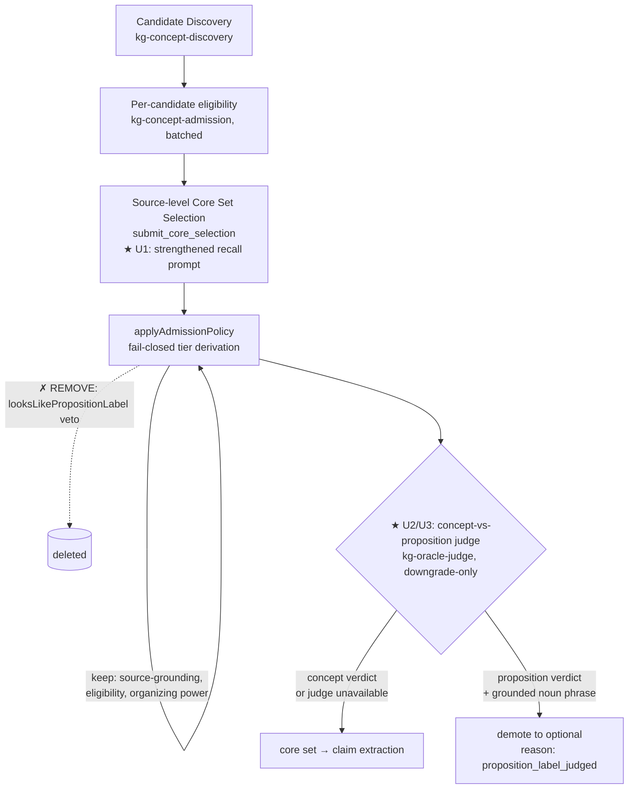

# feat: Admission recall + measured concept-vs-proposition judge

## Summary

Concept Admission is now the binding recall bottleneck. ADR-0020's semantic judge fixed
claim *over-rejection*, but the v28 ML PDF run still produced 7 definitions and only **1**
verified concept-to-concept relation — because the concept-to-concept claim space is
**starved at admission**. Established, substantively-taught domain concepts (Monte Carlo
Tree Search, Evolutionary Search, AutoML, Overfitting) are demoted to `optional`, while a
proposition-shaped pseudo-concept ("Operator Set as Bottleneck to Performance") is selected
`core`. With few or wrong `core` endpoints, claims have nothing to connect.

This plan fixes admission along two independent axes:

- **Recall (prompt):** strengthen the neural Core Set Selection stage to reliably *retain*
  established, multi-aspect domain concepts the source actually teaches.
- **Precision (measured judge):** replace the deterministic `looksLikePropositionLabel`
  lexical veto with a measured neural **concept-vs-proposition admission judge** — a
  forced-tool, downgrade-only, fail-closed stage on an independent model alias, mirroring
  ADR-0020. The hardcoded copula/verb/participle list is deleted.

Promotion is gated on a frozen agent-authored oracle (rule 11) showing the judge is
precision-first (rule 16), then validated by real re-runs on the ML PDF + Rust + Biology
fixtures with explicit real-use inspection (rule 14).

---

## Problem Frame

The admission `core` decision is produced by a two-stage neural pipeline
(`LiteLlmConceptAdmissionAdapter`: per-candidate eligibility, then source-level
`submit_core_selection`), followed by a deterministic boundary
(`applyAdmissionPolicy`) that derives the effective tier fail-closed. Two defects in this
path starve downstream claims:

1. **Recall miss (selection prompt).** The Core Set Selection prompt over-demotes. On a
   method paper it treats established domain concepts as illustrative/case-study vehicles
   and leaves them `optional`, even when the source substantively teaches them. The v28 run
   improved to 6 core of 69 but still omitted MCTS, Evolutionary Search, AutoML, Overfitting.

2. **Precision miss (deterministic lexical veto).** `looksLikePropositionLabel`
   (`packages/domain-core/src/index.ts:86`) hard-vetoes `core → optional` when a label
   matches a hardcoded closed list of copulas / finite verbs / participles+`by`. This is the
   exact "closed connective list / surface-order matcher" AGENTS rule 16 forbids as a silent
   veto. It fails both ways: it **missed** "Operator Set as Bottleneck to Performance" (no
   listed verb), and would **wrongly demote** a legitimate concept such as "Right to Be
   Forgotten" (`be` + complement). Per rule 16 a deterministic gate may hard-veto only to
   enforce a *provable* guarantee; "is this label a proposition?" is a semantic judgment, not
   a provable property, so a lexical matcher is the wrong mechanism. The temptation to add
   `bottleneck` / `as…to` patterns to chase the v28 miss is explicitly forbidden by rule 16.

The fix must raise recall without re-introducing the precision noise the eligibility
evaluation already documented (`tmp/core-concept-eligibility-quality-evaluation.md`), and
must keep the symbolic layer minimal (rule 16) and measured (rule 3, rule 14).

---

## Requirements

| ID | Requirement | Trace |
|----|-------------|-------|
| R1 | Established, substantively-taught domain concepts are reliably selected `core` (recall lever). | TODO #4 |
| R2 | Proposition/claim-shaped labels are demoted to their underlying noun phrase via neural judgment, not a lexical list. | TODO #4, rule 16 |
| R3 | The concept-vs-proposition decision is a measured neural module: forced named tool, independent model alias, downgrade-only, fail-closed. The deterministic `looksLikePropositionLabel` veto is removed. | AGENTS rule 16, ADR-0020 precedent |
| R4 | The judge earns its veto via a frozen agent-authored oracle showing precision-first behavior *before* it enters the core path. | AGENTS rule 11, rule 16, ADR-0011 |
| R5 | Source-grounding of the canonical label (a provable substring property) stays deterministic and authoritative. | AGENTS rule 16, ADR-0005 |
| R6 | Improved admission demonstrably unblocks concept-to-concept claim recall; real re-runs on ML PDF + Rust + Biology are inspected and recorded. Selection stability target is ~85%, not 100% (chasing perfect reproducibility is out of scope). | AGENTS rule 14, user direction |

---

## Key Technical Decisions

- **KTD1 — Replace the lexical veto with a measured neural judge (not expand it).** The
  concept-vs-proposition call is semantic; per rule 16 it cannot be a hardcoded matcher. This
  reuses the ADR-0020 judge pattern exactly. *Rejected:* extending the copula/verb list to
  catch "Operator Set as Bottleneck…" — rule 16 forbids growing a heuristic gate to chase
  coverage.

- **KTD2 — Clean axis split: prompt owns recall, judge owns precision.** The selection prompt
  is the only lever that can *retain* a concept (R1); the judge is **downgrade-only** and can
  only demote a proposition (R2/R3). It never resurrects an `optional` candidate. This keeps
  each axis independently measurable and matches the ADR-0020 downgrade-only invariant.

- **KTD3 — Independent model family for the judge.** The judge runs on `kg-oracle-judge`
  (Mistral Small), a different family than admission's `kg-concept-admission` (DeepSeek), so
  the judge is not the extractor grading its own homework — same rationale as ADR-0020.

- **KTD4 — Keep label source-grounding deterministic.** `proposedCanonicalLabelGrounded`
  enforces a provable substring property and is a rule-16-permitted veto; it stays in
  `applyAdmissionPolicy` unchanged (R5).

- **KTD5 — Fail-closed = preserve precision, not recall.** A schema-valid `proposition`
  verdict whose extracted underlying noun phrase is source-grounded demotes the candidate. On
  transport failure, schema-invalid response, or an ungrounded noun phrase, the candidate
  **keeps** the neural selection's `core` decision (the judge can only demote on a confident,
  grounded positive). This preserves the recall the prompt produced and never demotes on
  absent text.

- **KTD6 — Stability is not engineered.** No self-consistency / majority-vote machinery.
  Target ~85% selection agreement across runs; accept current variance. (Deferred — see Scope.)

- **KTD7 — ADR-0021 is written at implementation time, after measurement.** Per repo ADR
  rules ("no speculative or pending decisions") and the ADR-0020 precedent (committed with its
  implementation), the ADR is authored once the judge is measured and promoted, not now. A
  ready draft lives in the Documentation Plan below.

---

## High-Level Technical Design

Admission stage flow (the new judge is the only added stage; everything upstream is unchanged):



Judge contract (forced named tool, mirrors `ClaimEntailmentJudgmentPort`):

```text
input:  declaredDomain, label (proposed canonical), aliases, evidenceQuotes (verbatim)
output: labelKind ∈ { concept | proposition_or_claim }
        underlyingNounPhrase: string   // the concept to fall back to when proposition
        groundingSpan: string          // minimal verbatim sub-quote, fail-closed grounded
        rationale: string
```

*Directional only — field names and exact wording are settled during implementation.*

---

## Implementation Units

### U1. Strengthen Core Set Selection recall prompt

- **Goal:** Reliably retain established, substantively-taught domain concepts as `core` (R1).
- **Requirements:** R1, R6.
- **Dependencies:** none.
- **Files:** `packages/infrastructure-litellm/src/extractionAdapters.ts` (the
  `selectionUser` / selection system prompt inside `LiteLlmConceptAdmissionAdapter`).
- **Approach:** Add an explicit retention rule: an established, named domain concept
  (algorithm, method, model, named phenomenon) that the source treats substantively with two
  distinct organizing aspects must be selected `core` even when the source is a method/survey
  paper that also *uses* it — being used by the source's contribution is not grounds for
  demotion. Tighten the existing illustrative-demotion clause so it fires only when evidence
  is drawn *only* from a case-study/example section (it currently over-fires on method
  papers). Replace generic calibration with the real v28 failure cases: MCTS / Evolutionary
  Search / AutoML / Overfitting = `core` when substantively taught; "Operator Set as
  Bottleneck to Performance" = demote to the noun phrase "Operator Set". Do not add a fixed
  count target.
- **Patterns to follow:** existing calibration-example style already in the selection prompt
  (ownership/move; DNA replication/Meselson-Stahl).
- **Test scenarios:** `Test expectation: none (prompt-only change).` Verification is the U5
  real-use re-run; deterministic policy behavior is unchanged.
- **Verification:** ML PDF re-run selects the four established ML concepts as `core` when the
  source teaches them substantively (inspected in U5).

### U2. Add the concept-vs-proposition admission judge port + adapter + schema

- **Goal:** A measured neural judge that classifies an admitted-`core` label as concept vs
  proposition/claim, with a source-grounded underlying noun phrase (R2, R3).
- **Requirements:** R2, R3, R5.
- **Dependencies:** none (parallel with U1).
- **Files:**
  - `packages/domain-core/src/index.ts` — add `AdmissionLabelJudgment` type.
  - `packages/ports/src/index.ts` — add `AdmissionLabelJudgmentPort` (`readonly model`,
    `judge(...)`), documented like `ClaimEntailmentJudgmentPort`.
  - `packages/infrastructure-litellm/src/toolSchemas.ts` — add
    `admissionLabelJudgmentSchema` + `admissionLabelJudgmentValidator` (forced tool,
    `labelKind` enum, `underlyingNounPhrase`, `groundingSpan`, `rationale`).
  - `packages/infrastructure-litellm/src/extractionAdapters.ts` — add
    `LiteLlmAdmissionLabelJudgmentAdapter` on `kg-oracle-judge`; fail-closed grounding via
    `evidenceQuoteMatches` (reuse the deterministic evidence normalizer).
- **Approach:** Mirror `LiteLlmClaimEntailmentJudgmentAdapter`. The judge sees the label,
  aliases, and the candidate's verbatim mention/eligibility evidence. It returns `concept`
  unless the label asserts a full predication; on `proposition_or_claim` it returns the
  underlying noun phrase. Ground `groundingSpan` (and the noun phrase against source text)
  with the same normalizer used by the evidence floor; an ungrounded positive is treated as
  `concept` (fail-closed precision — KTD5).
- **Patterns to follow:** `LiteLlmClaimEntailmentJudgmentAdapter` and `groundedJudgment`
  (`extractionAdapters.ts:410-532`); `claimEntailmentJudgmentSchema` in `toolSchemas.ts`.
- **Test scenarios** (`packages/infrastructure-litellm/src/extractionAdapters.test.ts`):
  - Schema/validator accepts a well-formed `proposition_or_claim` verdict and a `concept`
    verdict; rejects missing `labelKind` (fail-closed arg validation, rule 6).
  - Grounding: a `proposition_or_claim` verdict with a `groundingSpan` absent from the
    evidence is downgraded to `concept` (ungrounded positive cannot demote).
  - Grounding tolerates formatting noise the evidence normalizer handles (markdown markers,
    typographic quotes).
- **Verification:** adapter unit tests green; a real probe classifies "Operator Set as
  Bottleneck to Performance" as proposition and "Monte Carlo Tree Search" as concept.

### U3. Compose the judge stage; remove the deterministic proposition veto

- **Goal:** Wire the judge as a downgrade-only stage after `applyAdmissionPolicy`, and delete
  the lexical veto (R3, R5, KTD2, KTD4, KTD5).
- **Requirements:** R2, R3, R5.
- **Dependencies:** U2.
- **Files:**
  - `packages/application/src/applyAdmissionLabelJudge.ts` *(new)* — composed stage.
  - `packages/application/src/executeExtractionRun.ts` — call the stage on `core` candidates
    after `applyAdmissionPolicy`, before claim extraction; add the port to the input bag.
  - `packages/application/src/applyAdmissionPolicy.ts` — remove the `looksLikePropositionLabel`
    import, the `propositionShaped` branch, and `proposition_shaped_label`; keep
    `proposedCanonicalLabelGrounded`, eligibility, organizing-power, and `illustrativeOnly`.
  - `packages/domain-core/src/index.ts` — delete `looksLikePropositionLabel` and its now-dead
    `PROPOSITION_*` constant sets (greenfield, no back-compat). Verify no other importers.
  - App composition root + CLI wiring that constructs `executeExtractionRun` inputs — pass the
    new adapter (same wiring point as `claimEntailmentJudge`).
- **Approach:** Mirror `applyEntailmentJudge` (downgrade-only, bounded concurrency,
  try/catch → keep-core on failure per KTD5). On a grounded `proposition_or_claim` verdict,
  set tier `optional`, record reason `proposition_label_judged`, and surface the underlying
  noun phrase in the boundary trace for the Run Inspector. The judge runs only on the handful
  of `core`-selected candidates, so cost is bounded.
- **Patterns to follow:** `applyEntailmentJudge.ts` (downgrade-only, `mapWithConcurrency`,
  fail-closed `catch`); its wiring in `executeExtractionRun.ts:114-167`.
- **Test scenarios** (`packages/application/src/applyAdmissionLabelJudge.test.ts` +
  edits to `applyAdmissionPolicy.test.ts`):
  - A `core` candidate judged `proposition_or_claim` (grounded) is demoted to `optional` with
    `proposition_label_judged`; a `concept` verdict leaves tier `core`.
  - Judge transport failure / schema-invalid / ungrounded verdict leaves tier `core`
    (fail-closed = preserve recall, KTD5).
  - Only `core` candidates are judged (`optional`/`reject`/`quarantine` are untouched).
  - `applyAdmissionPolicy.test.ts`: delete the `proposition_shaped_label` veto test; assert a
    proposition-shaped label is **no longer** demoted by the policy alone (now the judge's
    job); keep the source-grounding and eligibility tests green.
- **Verification:** `pnpm check` green; proposition demotion now traces to the judge stage,
  not the deleted lexical function.

### U4. Frozen admission oracle + measurement harness (promotion gate)

- **Goal:** Prove the judge is precision-first before it enters the authoritative path (R4).
- **Requirements:** R4.
- **Dependencies:** U2.
- **Files:** `tmp/admission-oracle/` (gitignored, rule 10) — `labels.json`
  (agent-authored, `needs_human_review: true`, rule 11) and `measure.ts`.
- **Approach:** Hand-label a small set of real admitted labels drawn from prior runs as
  `concept` or `proposition_or_claim`: positives ("Operator Set as Bottleneck to
  Performance", "Division of Labour Limited by the Extent of the Market"), hard negatives
  ("Monte Carlo Tree Search", "AutoML", "Right to Be Forgotten", "Survival of the Fittest").
  Run the real judge over the set; report precision (proposition verdicts that are truly
  propositions) and recall, plus false demotions of true concepts. Mirror
  `tmp/claim-oracle/measure.ts`.
- **Patterns to follow:** `tmp/claim-oracle/` oracle + `measure.ts` from ADR-0020.
- **Test scenarios:** `Test expectation: the harness is the measurement.` Promotion gate:
  zero false demotions of true concepts (precision-first); recover the known propositions.
- **Verification:** measurement recorded; gate result stated PASS/FIX_FIRST in the U5 eval.

### U5. Real-use re-run, quality evaluation, and doc updates

- **Goal:** Confirm admission + claim recall improved on real fixtures and record it (R6).
- **Requirements:** R1, R6, AGENTS rule 14.
- **Dependencies:** U1, U3, U4.
- **Files:** `tmp/admission-recall-quality-evaluation.md` (new eval, rule 14 template);
  `docs/plans/TODO.md`; `docs/adr/0021-*.md` (draft below); `docs/adr/README.md`; project
  memory.
- **Approach:** Re-run extraction on the ML PDF (fixture #4), Rust ch.4.1, and Biology
  §14.3 with real LLM calls. Inspect: do the established ML concepts now appear `core`? Is
  "Operator Set as Bottleneck to Performance" demoted (traced to the judge)? Did the number
  of verified concept-to-concept claims increase? Classify PASS / FIX_FIRST /
  EXPERIMENT_ONLY / BLOCKED. Record selection stability across 2-3 runs against the ~85%
  target (no engineering, just observation per KTD6).
- **Test scenarios:** `Test expectation: real-use inspection (no unit test).`
- **Verification:** quality-eval note written with concrete before/after examples; if PASS,
  ADR-0021 authored and TODO/memory updated.

---

## Scope Boundaries

**In scope:** admission Core Set Selection recall (prompt); a measured concept-vs-proposition
neural judge replacing the lexical veto; removal of `looksLikePropositionLabel`; oracle +
measurement; real-use re-run and docs.

### Deferred to Follow-Up Work

- **Selection stability engineering.** Self-consistency / majority-vote across runs. Target
  ~85% is accepted; not engineered (KTD6).
- **`isExplicitlyIllustrative` heuristic** (`executeExtractionRun.ts:226`). Another hardcoded
  lexical pattern feeding a core→optional demotion (same rule-16 shape). Could later fold into
  the judge or become its own measured module; out of scope here to keep the judge narrow.
- **Gate 2 oracle triangle + benchmark arms (TODO #1).** Unblocked by this work but must run
  *after* it so scores aren't distorted by the admission defect.
- **Claim extractor direction-prompt tightening** (borderline `is-a` general-vs-specific,
  ADR-0020 caveat). Separate claim-side lever.

**Out of scope (product identity):** DOCX/PPTX fixtures (de-scoped); real difficulty
(Bradley-Terry) and IRT/KT learner modeling (ADR-0014 deferred).

---

## Risks & Dependencies

- **Recall prompt regresses precision.** Strengthening retention could re-admit
  vocabulary-sized or illustrative concepts (the instability documented in
  `tmp/core-concept-eligibility-quality-evaluation.md`). *Mitigation:* the judge removes
  propositions independently; U5 inspection is the gate; no publication from these runs.
- **Judge over-demotes true concepts (false positive).** Would *lose* recall. *Mitigation:*
  KTD5 fail-closed keeps `core` unless the verdict is confident + grounded; U4 promotion gate
  requires zero false demotions before the judge is trusted.
- **Selection non-reproducibility** (temp 0 still varies). Accepted at ~85% (KTD6); a single
  good run is still operator-selected for publication, never auto-latest (rule 11).
- **Dependency:** real LLM calls require LiteLLM + Postgres services up (the ML PDF, fixture
  #4, must already be registered). U5 is BLOCKED if services/fixtures are unavailable — state
  the caveat rather than claiming verification.

---

## Documentation Plan

- **TODO.md** — reframe item 4 to point at this plan as the active task; keep the claim-recall
  and admission-selection notes consolidated.
- **ADR-0021 (at implementation time, KTD7)** — draft:
  > **Title:** Measured concept-vs-proposition admission judge replaces the lexical label veto
  > **Decision:** The concept-vs-proposition classification of an admitted-`core` label is
  > decided by a bounded LLM judge (forced named tool, independent alias `kg-oracle-judge`),
  > not a hardcoded lexical matcher. It is downgrade-only (demotes `core → optional`, never
  > resurrects) and fail-closed (keeps `core` on transport failure, schema-invalid response,
  > or an ungrounded verdict). The deterministic `looksLikePropositionLabel` veto is removed.
  > Label source-grounding stays deterministic (a provable substring property). The judge
  > enters the core path only after a frozen oracle shows it is precision-first. Realizes
  > AGENTS rule 16 (replace a false-negative heuristic gate with a measured neural judge);
  > supersedes the proposition-label portion of ADR-0005's deterministic boundary.
- **docs/adr/README.md** — add the ADR-0021 link.
- **Project memory** — mark the stale "definition-gate fix in progress" note complete and
  record the admission-judge work as the active lever.

---

## Real-Use Quality Evaluation (planned, rule 14)

- **Milestone:** admission recall + concept-vs-proposition judge.
- **Fixture and source type:** ML PDF #4 (`2507.02554v2.pdf`), Rust ch.4.1 (Markdown),
  Biology §14.3 (HTML).
- **Real model calls used:** yes (DeepSeek admission, Mistral judge).
- **Result:** to be classified after inspection (PASS / FIX_FIRST / EXPERIMENT_ONLY / BLOCKED).
- **Useful output / Defects / Changes / Caveats / Safe to continue:** to be filled in U5.

---

## Sources & Research

- `docs/adr/0005-admit-concepts-before-claims.md`; `docs/adr/0020-semantic-claim-entailment-judge.md`.
- AGENTS rules 3, 6, 11, 14, 16; `CONTEXT.md` (Concept Admission, Core Set Selection).
- Code: `packages/infrastructure-litellm/src/extractionAdapters.ts`,
  `packages/application/src/{applyAdmissionPolicy,applyEntailmentJudge,executeExtractionRun}.ts`,
  `packages/domain-core/src/index.ts:86`, `packages/ports/src/index.ts`.
- Evidence: `tmp/claim-entailment-judge-quality-evaluation.md`,
  `tmp/core-concept-eligibility-quality-evaluation.md`, `tmp/claim-oracle/`.
