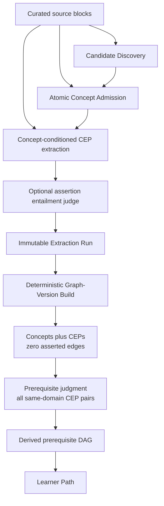
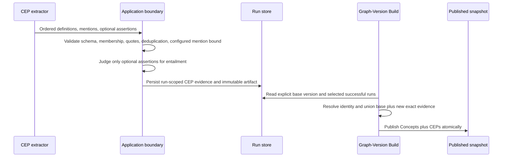
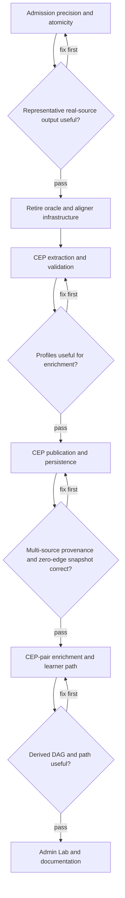

# refactor: Reset the core graph around Concept Evidence Profiles

## Summary

Replace the asserted-claim graph with Concepts carrying source-grounded Concept Evidence Profiles, then make Graph Enrichment judge exhaustive same-domain CEP pairs to produce the only graph edges. Fix admission precision and atomicity first, use the frozen oracle results once, remove the standing benchmark harness, and keep difficulty and learner state mocked behind their existing ports.

---

## Problem Frame

The current system spends most of its complexity on asserted claims and benchmark infrastructure even though the learner path consumes neither. Publication stores six relation types and claim evidence, while Graph Enrichment reconstructs weak concept context from sparse claims before independently inferring the prerequisite DAG.

The reset makes the product path explicit: Concept Admission decides the small set of Concepts; Concept Evidence Profiles preserve what curated sources teach about each Concept; Graph Enrichment owns prerequisite structure; Learner Path projects that derived structure. Breaking contracts and resetting PostgreSQL are expected because the application is unreleased (see origin: `docs/brainstorms/2026-06-15-kg-core-complexity-reset-requirements.md`).

---

## Requirements

### Concept Evidence Profiles

- R1. Every admitted Concept has a Concept Evidence Profile containing at least one verified meaning-bearing definition passage, up to a configured number of ranked substantive mention passages per source, and optional guarded typed assertions.
- R2. Every CEP element carries the curated source, source block, verbatim quote, heading path, and source locator needed for inspection without reconstructing provenance from claims.
- R3. Each graph version explicitly names a base graph version plus newly selected runs; publication unions the base CEP evidence with new source evidence so later versions cannot replace previously published evidence.
- R4. Mention selection is neural and salience-ordered; the application enforces only schema validity, verbatim grounding, deduplication, and the configurable default bound of six passages per Concept per source.

### Asserted-Layer Reset

- R5. A published asserted graph snapshot contains Concepts and CEPs and exposes no asserted edges.
- R6. The only typed CEP assertions are `defines` and `explicit-prerequisite-hint`; both remain evidence inside a CEP and never become authoritative graph relations.
- R7. Broad claim extraction, relation-recall retries, missing-concept proposals from claim extraction, claim conflict gates, and the six-relation registry are removed.

### Quality Posture

- R8. Existing frozen oracle outputs guide the admission fixes once; after expert inspection passes, the oracle author/auditor, label aligner, scoring code, aliases, schemas, tests, and frozen references are removed in the same milestone.
- R9. Durable validation consists of representative real-source inspection, retained inline production judges, and deterministic verbatim-evidence verification.
- R10. Verbatim grounding applies to every CEP element; the neural entailment judge accepts or rejects only optional typed assertions.

### Critical Product Path

- R11. Prerequisite judgment receives both Concepts' CEP definitions, bounded mentions, and labeled typed assertions; it does not reconstruct context from claims or infer from labels alone.
- R12. Admission rejects out-of-domain illustrative material and avoids core-poor source selections without a lexical or heading-pattern hard veto.
- R13. Admission can split one discovered conflated label into multiple atomic Concepts while retaining parent-candidate and source-evidence provenance.

### Cuts, Mocks, and Documentation

- R14. `DifficultyPort` remains backed by DAG depth and `LearnerStatePort` remains backed by the empty learner state.
- R15. The embedding canonicalization cascade, embedding-based prerequisite blocking, and candidate groups are removed from implementation and roadmap documentation; deterministic domain-scoped normalized-label identity remains the sole merge authority.
- R16. ADR-0002, ADR-0005, ADR-0007, and ADR-0016 are rewritten in place for the CEP asserted layer and exclusively derived prerequisite edges.
- R17. ADR-0013 and ADR-0022 are rewritten in place to record the lighter quality posture and the retirement of standing oracle and alignment infrastructure.
- R18. `CONTEXT.md` and repository documentation use Concept Evidence Profile language and remove the Relation Registry and Asserted Relation model.

---

## Key Technical Decisions

- **CEP is the published Concept context:** `GraphSnapshot` will carry each Concept with one `ConceptEvidenceProfile`; there is no sibling asserted-edge collection. This keeps enrichment and Admin Lab reads self-contained while preserving the existing immutable graph-version boundary.
- **Definition passages are meaning-bearing source text:** a definition passage need not use a lexical “X is Y” form, but it must be a verbatim passage that establishes the Concept's meaning. An admitted candidate with no verified definition passage cannot enter a successful run.
- **Mention salience is an ordered neural choice:** the concept-conditioned evidence-profile extractor returns passages from most to least useful for enrichment. Extraction configuration owns `maxMentionsPerConceptPerSource`, defaults it to six, includes it in the configuration hash and artifact, and keeps the first configured number of distinct verified passages per source without lexical salience heuristics or a composite score.
- **CEP extraction replaces claim extraction through a port:** a new concept-conditioned CEP extraction port returns definition passages, ranked mentions, and optional assertions through one forced named tool schema. It removes relation-recall retries and the missing-concept escape hatch rather than adapting the broad claim contract.
- **Typed assertions are guarded evidence, not edges or priors:** `defines` may target a literal and `explicit-prerequisite-hint` may target an admitted Concept. Both require verbatim evidence and assertion entailment; prerequisite hints are passed to enrichment with their type label but no numeric boost or deterministic direction override.
- **Atomic admission is a one-to-many decision:** one discovered Candidate may yield multiple atomic admission proposals with stable run-local keys and a shared parent candidate key. Labels and positive criterion evidence remain source-grounded, and Core Set Selection operates over the atomic proposals.
- **Domain relevance stays neural:** admission gains an explicit source-role and Declared-Domain relevance judgment. The current heading/text regex for illustrative sections is removed because it is a heuristic semantic veto prohibited by project rule 16.
- **Publication unions exact evidence identities:** a build declares `baseGraphVersionId` (`null` only for the initial build) and newly selected run IDs, then deduplicates the cumulative evidence by Concept identity plus source, block, quote, evidence kind, and assertion target. It never overwrites source A when source B contributes evidence to the same Concept.
- **All same-domain pairs are judged:** the small core makes exhaustive pair judgment the simplest correct behavior. `EmbeddingPort`, cosine clustering, candidate-group persistence, and embedding configuration disappear from enrichment. Pair calls use configurable bounded concurrency defaulting to four, preserve deterministic result order, and fail the run without persistence if any pair exhausts the forced-tool retry budget.
- **The single migration is rewritten:** run evidence, published CEP evidence, and optional assertions become relational query surfaces; complete run and graph snapshots remain immutable JSONB artifacts with PostgreSQL 18 `JSON_TABLE` inspection views. Extraction-run and graph-version stores persist normalized rows and their artifact envelopes in one transaction.
- **Inline judges get production language:** the retained independent judge alias and ports are renamed away from oracle terminology and narrowed to concept-vs-proposition admission and optional-assertion entailment.
- **Quality gates sequence the reset:** admission must pass real-source inspection before oracle teardown; CEP extraction must pass before publication changes; published CEPs must pass before enrichment and Admin Lab are treated as complete.

---

## High-Level Technical Design

### Component Topology

### Evidence and Publication Flow

### Quality-Gated Delivery

---

## Implementation Units

### U1. Fix admission precision and emit atomic Concepts

- **Goal:** Make admission reject illustrative out-of-domain material, retain a sufficient core set, and split conflated Candidates into atomic Concepts before downstream CEP work.
- **Requirements:** R12, R13
- **Dependencies:** None
- **Files:**
  - Modify `packages/domain-core/src/index.ts`
  - Modify `packages/ports/src/index.ts`
  - Modify `packages/application/src/applyAdmissionPolicy.ts`
  - Modify `packages/application/src/applyAdmissionPolicy.test.ts`
  - Modify `packages/application/src/applyAdmissionLabelJudge.ts`
  - Modify `packages/application/src/applyAdmissionLabelJudge.test.ts`
  - Modify `packages/application/src/executeExtractionRun.ts`
  - Modify `packages/application/src/executeExtractionRun.test.ts`
  - Modify `packages/infrastructure-litellm/src/extractionAdapters.ts`
  - Modify `packages/infrastructure-litellm/src/toolSchemas.ts`
  - Modify `packages/infrastructure-litellm/src/extractionAdapters.test.ts`
  - Modify `apps/kg-worker/src/knowledgeGraphWorker.ts`
- **Approach:** Change the admission result from exactly one decision per discovered Candidate to one or more atomic proposals linked to the parent candidate. Add semantic source-role and Declared-Domain relevance to the forced admission contract, run Core Set Selection over atomic proposals, and remove the deterministic illustrative-section regex. Preserve the downgrade-only concept-vs-proposition judge as an independent neural guard.
- **Execution note:** Change the admission contracts and focused tests first, then run real extraction against the known failing sources before any CEP implementation. The fixture-specific defects and expected corrections in these test scenarios are the durable implementation checklist; disposable `tmp/` reports are supplementary evidence, not an execution prerequisite.
- **Patterns to follow:** Forced named schemas plus Zod validation in `packages/infrastructure-litellm/src/toolSchemas.ts`; application-owned effective decisions in `packages/application/src/applyAdmissionPolicy.ts`; deterministic identity normalization in `packages/domain-core/src/index.ts`.
- **Test scenarios:**
  1. A discovered “The stack and the heap” Candidate returns two source-grounded atomic proposals; both retain the parent key and distinct evidence, and Core Set Selection can tier them independently.
  2. Duplicate atomic keys, an atom for an unknown parent Candidate, or an ungrounded atomic label fail closed without creating a publishable core Concept.
  3. Out-of-domain algorithm and SQL examples used only to illustrate an educational-technology source are rejected by the neural source-role decision rather than retained as optional.
  4. A substantively taught established Concept in a method paper remains eligible for core even when the paper uses it as part of another system.
  5. A proposition-shaped atomic label is downgraded by the retained semantic judge, while nominal concepts such as “Right to Be Forgotten” remain core.
  6. A judge transport or schema failure preserves the bounded fail-closed behavior already defined for admission without invoking a lexical fallback.
- **Verification:** Real runs over Rust, InstructKG, and at least one method-paper fixture show atomic labels, no out-of-domain optional leak, and a source core set useful enough to feed enrichment. Record a rule-14 evaluation as `PASS` before U2.

### U2. Use the oracle results once and remove the standing measurement harness

- **Goal:** Complete the admission milestone by deleting benchmark infrastructure after U1 passes expert inspection, while retaining the two inline production judges under non-oracle names.
- **Requirements:** R8, R9, R10, AE3
- **Dependencies:** U1
- **Files:**
  - Delete `packages/quality-lab/package.json`
  - Delete `packages/quality-lab/README.md`
  - Delete `packages/quality-lab/src/index.ts`
  - Delete `packages/quality-lab/src/admissionOracle.ts`
  - Delete `packages/quality-lab/src/admissionOracle.test.ts`
  - Delete `packages/quality-lab/tsconfig.json`
  - Delete `packages/infrastructure-litellm/src/oracleAdapters.ts`
  - Modify `packages/domain-core/src/index.ts`
  - Modify `packages/ports/src/index.ts`
  - Modify `packages/infrastructure-litellm/src/index.ts`
  - Modify `packages/infrastructure-litellm/src/toolSchemas.ts`
  - Modify `packages/infrastructure-litellm/src/extractionAdapters.ts`
  - Modify `packages/infrastructure-litellm/src/extractionAdapters.test.ts`
  - Modify `litellm/config.yaml`
  - Modify `packages/infrastructure-ingestion/src/DoclingStructuredDocumentParser.ts`
  - Modify `apps/kg-worker/src/knowledgeGraphWorker.ts`
  - Modify `pnpm-lock.yaml`
  - Modify `README.md`
  - Modify `fixtures/README.md`
- **Approach:** Compare U1 outputs with the durable fixture-specific expectations in U1 and, when present, the already-frozen human-reviewed diagnoses under `tmp/`; do not regenerate a new standing benchmark. Remove oracle types, ports, adapters, schemas, label alignment, package wiring, aliases, and the frozen oracle/alignment/measurement artifacts under `tmp/`. Rename the retained independent production judge alias and comments so admission and assertion entailment no longer depend on “oracle” vocabulary.
- **Execution note:** U1 and U2 form one milestone: do not leave the admission fix merged while the disposable harness remains as supported infrastructure.
- **Patterns to follow:** The existing LiteLLM alias boundary remains authoritative; only the benchmark roles disappear.
- **Test scenarios:**
  1. No source package imports oracle reference, audit, alignment, scoring, or quarantine types after deletion.
  2. Concept-vs-proposition judgment still uses a forced named tool and its production alias after oracle aliases are removed.
  3. The retained judge rejects malformed tool arguments and preserves its existing grounded-span behavior.
  4. Workspace typechecking and dependency resolution succeed without the quality-lab package.
- **Verification:** Repository search finds no standing oracle or label-aligner code outside rewritten historical documentation and no frozen oracle/alignment artifacts remain under `tmp/`, while real admission remains inspectable through Extraction Runs.

### U3. Replace claim extraction with Concept Evidence Profile extraction

- **Goal:** Produce one validated run-scoped CEP per admitted atomic Concept and remove the broad relation-extraction behavior from the application core.
- **Requirements:** R1, R2, R4, R6, R7, R10, AE1
- **Dependencies:** U1, U2
- **Files:**
  - Modify `packages/domain-core/src/index.ts`
  - Modify `packages/ports/src/index.ts`
  - Modify `packages/application/src/executeExtractionRun.ts`
  - Modify `packages/application/src/executeExtractionRun.test.ts`
  - Create `packages/application/src/applyEvidenceProfilePolicy.ts`
  - Create `packages/application/src/applyEvidenceProfilePolicy.test.ts`
  - Create `packages/application/src/applyAssertionEntailmentJudge.ts`
  - Create `packages/application/src/applyAssertionEntailmentJudge.test.ts`
  - Delete `packages/application/src/applyClaimPolicy.ts`
  - Delete `packages/application/src/applyClaimPolicy.test.ts`
  - Delete `packages/application/src/applyEntailmentJudge.ts`
  - Delete `packages/application/src/applyEntailmentJudge.test.ts`
  - Modify `packages/application/src/index.ts`
  - Modify `packages/infrastructure-litellm/src/extractionAdapters.ts`
  - Modify `packages/infrastructure-litellm/src/extractionAdapters.test.ts`
  - Modify `packages/infrastructure-litellm/src/toolSchemas.ts`
  - Modify `packages/infrastructure-litellm/src/index.ts`
  - Modify `packages/infrastructure-postgres/src/schema.ts`
  - Modify `packages/infrastructure-postgres/src/migrations/0000_initial_lrnki_schema.sql`
  - Modify `packages/infrastructure-postgres/src/PostgresStores.ts`
  - Modify `packages/infrastructure-postgres/src/PostgresArtifactRepository.ts`
  - Modify `packages/infrastructure-postgres/src/index.ts`
  - Create `packages/infrastructure-postgres/src/PostgresStores.test.ts`
  - Modify `packages/infrastructure-postgres/package.json`
- **Approach:** Introduce CEP domain types for definition passages, ranked mention passages, and typed assertions. Replace `ConceptConditionedClaimExtractionPort` with a concept-conditioned evidence-profile port and invoke it for every `core` or `optional` atomic Concept. The forced tool may emit only `defines`, `explicit-prerequisite-hint`, or untyped evidence; the application validates candidate membership, verbatim quotes, unique evidence, definition completeness, and `maxMentionsPerConceptPerSource` from extraction configuration. General relationships survive only as untyped mention passages. Replace run-claim persistence with run-scoped CEP evidence rows and make `ExtractionRunStorePort.persist` accept the immutable extraction artifact so PostgreSQL writes the run, evidence, and artifact envelope in one transaction.
- **Execution note:** Apply the real-use quality evaluation immediately after this unit; do not begin persistence redesign if the profiles are noisy, redundant, or too weak for prerequisite judgment.
- **Patterns to follow:** `evidenceQuoteMatches` remains the deterministic evidence floor; semantic assertion acceptance stays in a composed neural stage; semantic outputs are not vetoed by new lexical rules.
- **Test scenarios:**
  1. With the default configuration, a profile with two verified definition passages, eight ordered verified mentions, and duplicate evidence keeps both definitions and the first six distinct mentions.
  2. A non-default mention limit is honored, recorded in the extraction configuration hash and artifact, and never changes the neural order.
  3. A profile quote referencing an unknown block or non-verbatim text is removed; any admitted profile left without a definition passage makes the run unsuccessful.
  4. `defines` with a literal object and `explicit-prerequisite-hint` with an admitted Concept object survive only when the assertion-entailment judge accepts their verified evidence.
  5. Any invented assertion type fails schema validation; an ordinary taxonomic, structural, contrast, or uses passage remains available as an untyped mention rather than a typed assertion.
  6. An assertion judge failure rejects the typed assertion but preserves the underlying verified passage in the CEP.
  7. Claim retry, conflict, missing-concept proposal, and recall-feedback behavior is absent from the extraction run.
  8. The immutable extraction artifact contains CEPs for core and optional Concepts and no claim collection.
  9. A database or artifact-write failure rolls back the complete Extraction Run, including normalized CEP rows and the artifact envelope.
- **Verification:** Real CEPs from Rust, biology, and economics have useful meaning-bearing definitions, focused mentions, exact provenance, and no unsupported typed assertions. Record defects and stop on `FIX_FIRST`.

### U4. Persist and publish append-only CEP unions with no asserted edges

- **Goal:** Rewrite the relational and JSONB storage model so an explicit base graph version plus selected Extraction Runs publish immutable Concepts, cumulative multi-source CEP unions, and no asserted relations.
- **Requirements:** R2, R3, R5, R6, R7, AE1, AE2
- **Dependencies:** U3
- **Files:**
  - Modify `packages/domain-core/src/index.ts`
  - Modify `packages/ports/src/index.ts`
  - Modify `packages/application/src/buildGraphVersion.ts`
  - Modify `packages/application/src/buildGraphVersion.test.ts`
  - Modify `packages/infrastructure-postgres/src/schema.ts`
  - Modify `packages/infrastructure-postgres/src/migrations/0000_initial_lrnki_schema.sql`
  - Modify `packages/infrastructure-postgres/src/PostgresStores.ts`
  - Modify `packages/infrastructure-postgres/src/PostgresStores.test.ts`
  - Modify `packages/infrastructure-postgres/package.json`
  - Modify `packages/infrastructure-postgres/src/index.ts`
  - Modify `packages/infrastructure-postgres/src/PostgresArtifactRepository.ts`
  - Modify `scripts/reset-db.sh`
- **Approach:** Remove the remaining relation and published-claim tables, add graph-version-scoped CEP evidence and optional-assertion rows, and expand published evidence references with heading paths and locators. Emit versioned graph-snapshot artifacts whose nested CEPs are flattened by new `JSON_TABLE` views. A build accepts an explicit `baseGraphVersionId` plus newly selected run IDs, resolves deterministic Concept identities across both inputs, remaps optional assertion targets through those identities, omits assertions whose targets are absent from the new graph version, then unions and exact-deduplicates cumulative source evidence. Change `GraphVersionStorePort.publish` to accept its artifact envelope so PostgreSQL writes graph-version rows and `artifact_versions` in the same transaction, matching the extraction transaction introduced in U3.
- **Execution note:** Reset and reinitialize PostgreSQL after rewriting the single migration; no compatibility migration or dual-read path is needed.
- **Patterns to follow:** Atomic publication transaction in `PostgresGraphVersionStore`; explicit run selection in `runsForBuildByIds`; immutable JSONB envelopes in `PostgresArtifactRepository`.
- **Test scenarios:**
  1. Covers AE2. Version A publishes source A; version B explicitly bases on A and selects source B, producing one Concept whose CEP retains definitions and mentions from both sources and records complete provenance.
  2. Repeated identical evidence from one source is deduplicated, while different quotes or locators from that source remain distinct.
  3. A selected run containing an admitted Concept without a complete CEP causes the build to fail before publication.
  4. Covers AE1. A published snapshot contains optional typed assertions inside profiles but no asserted edge collection or relation-registry dependency.
  5. Existing Concept IRIs are reused across graph versions under ADR-0015 even when the evidence union changes.
  6. A failed build leaves the previous graph version untouched and writes no partial CEP rows.
  7. The rewritten `JSON_TABLE` views flatten run candidates, CEP evidence, and typed assertions from the new artifact versions.
  8. Database initialization contains no relation registry or claim tables and supports a clean reset.
  9. Assertion targets are remapped after candidate merge or split, and assertions whose targets are not published in the same graph version are omitted.
  10. Failure while writing either an extraction or graph-snapshot artifact rolls back the corresponding normalized rows; no authoritative relational state exists without its immutable artifact.
- **Verification:** A real incremental multi-source build produces a self-contained snapshot with zero asserted edges and inspectable source-specific CEP evidence. Database queries and artifact views agree on evidence counts and locators. Record a rule-14 evaluation and stop on `FIX_FIRST` before beginning enrichment work.

### U5. Make Graph Enrichment judge exhaustive same-domain CEP pairs

- **Goal:** Remove embedding blocking and feed prerequisite judgment directly from both Concepts' published CEPs.
- **Requirements:** R11, R14, R15
- **Dependencies:** U4
- **Files:**
  - Modify `packages/domain-core/src/index.ts`
  - Modify `packages/ports/src/index.ts`
  - Modify `packages/application/src/runGraphEnrichment.ts`
  - Modify `packages/application/src/runGraphEnrichment.test.ts`
  - Modify `packages/infrastructure-litellm/src/enrichmentAdapters.ts`
  - Modify `packages/infrastructure-litellm/src/index.ts`
  - Modify `packages/infrastructure-litellm/src/toolSchemas.ts`
  - Modify `packages/infrastructure-postgres/src/schema.ts`
  - Modify `packages/infrastructure-postgres/src/migrations/0000_initial_lrnki_schema.sql`
  - Modify `packages/infrastructure-postgres/src/PostgresEnrichmentStores.ts`
  - Modify `apps/kg-worker/src/knowledgeGraphWorker.ts`
  - Modify `litellm/config.yaml`
- **Approach:** Delete `EmbeddingPort`, the embedding adapter and alias, cosine clustering, candidate groups, and cluster configuration. Generate every unordered pair within each Declared Domain and judge them with configurable bounded concurrency defaulting to four while preserving deterministic pair/result ordering. Pass each Concept's definitions, ranked mentions, and labeled typed assertions to the forced-tool prerequisite judge. An explicit prerequisite hint is evidence the neural judge may use, not a deterministic edge or confidence increment. If any pair exhausts the forced-tool retry budget, fail the enrichment run without persisting a partial Derived Graph Layer. Preserve weak-edge cutting, uncertainty handling, cycle removal, transitive reduction, DAG-depth difficulty, and empty learner state.
- **Execution note:** Start with a failing enrichment test that proves a pair receives both complete CEPs and that an explicit hint cannot bypass the prerequisite judge.
- **Patterns to follow:** Same-domain pair isolation and deterministic graph disposal in `packages/application/src/runGraphEnrichment.ts`; forced bounded prerequisite output in `packages/infrastructure-litellm/src/enrichmentAdapters.ts`.
- **Test scenarios:**
  1. A domain with three Concepts judges exactly three unordered pairs; no cross-domain pair reaches the judge.
  2. Each judge call receives both Concepts' definition passages, bounded mentions, source provenance, and typed assertions.
  3. A pair with no CEP evidence is impossible in a published snapshot and fails closed if an invalid snapshot is injected.
  4. An `explicit-prerequisite-hint` appears as labeled evidence, but a judge outcome of `none` creates no edge and a reversed directed outcome follows the judge.
  5. `none` judgments are dropped, `uncertain` judgments remain inspectable and path-excluded, and directed judgments still pass through confidence, cycle, and transitive-reduction processing.
  6. The persisted Derived Graph Layer and trace contain no embedding model or candidate-group fields.
  7. Difficulty remains `dag-depth-mock`, and learner-path projection behavior remains unchanged for an equivalent DAG.
  8. Pair calls never exceed the configured concurrency, persisted traces retain deterministic pair order, and one exhausted pair failure leaves no partial enrichment run.
- **Verification:** A real enrichment run over a CEP-backed graph yields an expert-useful prerequisite DAG and learner path without label-only reasoning. Record a rule-14 result and stop before UI completion if foundational edges are misleading.

### U6. Reshape worker, Admin Lab, and export surfaces around CEPs

- **Goal:** Make operator-facing and boundary outputs show the new asserted/derived split without silently computing or publishing edges.
- **Requirements:** R5, R9, R11, AE4
- **Dependencies:** U4, U5
- **Files:**
  - Modify `apps/kg-worker/src/knowledgeGraphWorker.ts`
  - Delete `apps/kg-worker/src/admissionVarianceProbe.ts`
  - Modify `apps/admin-lab/src/lib/inspection.ts`
  - Create `apps/admin-lab/src/lib/inspection.test.ts`
  - Modify `apps/admin-lab/src/lib/publishedSnapshot.ts`
  - Modify `apps/admin-lab/src/lib/demoSnapshot.ts`
  - Modify `apps/admin-lab/src/components/GraphExplorer.tsx`
  - Create `apps/admin-lab/src/components/GraphExplorer.test.tsx`
  - Create `apps/admin-lab/src/components/DerivedGraphExplorer.tsx`
  - Create `apps/admin-lab/src/components/DerivedGraphExplorer.test.tsx`
  - Modify `apps/admin-lab/src/app/admin/lab/page.tsx`
  - Create `apps/admin-lab/src/app/admin/lab/enrichments/page.tsx`
  - Create `apps/admin-lab/src/app/admin/lab/enrichments/[enrichmentId]/page.tsx`
  - Modify `apps/admin-lab/src/app/admin/lab/runs/page.tsx`
  - Modify `apps/admin-lab/src/app/admin/lab/runs/[runId]/page.tsx`
  - Modify `apps/admin-lab/src/components/AdminShell.tsx`
  - Modify `apps/admin-lab/package.json`
  - Modify `packages/infrastructure-rdf-export/src/index.ts`
  - Create `packages/infrastructure-rdf-export/src/index.test.ts`
  - Modify `packages/infrastructure-rdf-export/package.json`
- **Approach:** Replace run claim counts and claim tables with CEP completeness, definition, mention, and optional-assertion inspection. Make the published view a searchable master-detail Concept list with the evidence inspector as the primary surface; do not mount an edge-free Cytoscape canvas. Add read-only Enrichment Run list/detail pages whose Cytoscape and textual views inspect a Derived Graph Layer independently of learner paths. Export only Concept identity, labels, and aliases from the asserted snapshot; do not add CEP evidence annotations without a separate export requirement.
- **Execution note:** Use the shadcn skill for component changes and verify the live Admin Lab with representative published and derived data.
- **Patterns to follow:** Server-only loaders in `apps/admin-lab/src/lib/inspection.ts`; read-only UI posture in `AdminShell`; Cytoscape remains reserved for derived graph visualization.
- **Test scenarios:**
  1. Covers AE4. A snapshot with CEP assertions renders zero asserted edges and exposes definitions, mentions, provenance, and assertion labels in Concept details.
  2. A multi-source CEP groups evidence by source without dropping heading paths or locators.
  3. Run summaries report profile completeness and evidence counts rather than verified/rejected claim counts.
  4. Definition-only profiles, zero mentions, zero assertions, multiple source groups, no search matches, and no selected Concept render explicit non-loading states.
  5. A dedicated Enrichment Run detail renders its Derived Graph Layer independently; the learner-path detail continues to render inferred prerequisite edges for its explicit Enrichment Run.
  6. JSON-LD export contains Concept identity, labels, and aliases but no asserted relation or CEP evidence triples.
  7. Database unavailable renders an error with configuration guidance, a healthy database with no published version renders an empty state, and demo data appears only in explicitly labeled demo mode.
  8. Concept search and selection are keyboard operable with managed focus and accessible names; evidence uses semantic headings and source groups; every Cytoscape derived graph has an equivalent textual node-and-edge representation.
- **Verification:** Browser inspection confirms the published view has zero edges, Concept evidence is usable for defect inspection, and a Derived Graph Layer still displays prerequisite edges separately. Record a rule-14 Admin Lab evaluation.

### U7. Rewrite ADRs, vocabulary, and current project documentation

- **Goal:** Make the repository describe only the post-reset architecture and remove stale claim, registry, benchmark, and embedding-blocking guidance.
- **Requirements:** R16, R17, R18
- **Dependencies:** U1-U6
- **Files:**
  - Modify `CONTEXT.md`
  - Modify `docs/adr/0002-define-learner-neutral-core-concept-graph.md`
  - Modify `docs/adr/0005-admit-concepts-before-claims.md`
  - Modify `docs/adr/0007-extract-claims-in-concept-context.md`
  - Modify `docs/adr/0009-apply-conservative-refinement.md`
  - Modify `docs/adr/0012-measure-embedding-sidecars.md`
  - Modify `docs/adr/0013-use-mixed-format-oracle-suite.md`
  - Modify `docs/adr/0016-closed-six-relation-registry.md`
  - Modify `docs/adr/0019-graph-enrichment-derived-layer.md`
  - Modify `docs/adr/0022-measured-label-aligner-for-oracle-scoring.md`
  - Modify `docs/adr/README.md`
  - Modify `README.md`
  - Modify `fixtures/README.md`
  - Modify `docs/plans/TODO.md`
  - Modify `docs/plans/concept-first-implementation.md`
- **Approach:** Rewrite affected ADRs in place so they describe the current decisions rather than preserving superseded claim and benchmark designs. Update ADR-0009 from asserted-claim refinement to deterministic Concept identity plus CEP evidence union. Remove the future embedding identity cascade from ADR-0012 and embedding pair blocking from ADR-0019 while preserving ADR-0015's deterministic identity and ADR-0019's separate Derived Graph Layer decision. Update domain definitions for Concept Evidence Profile, Definition Passage, Mention Passage, Optional Typed Assertion, and the asserted/derived split.
- **Patterns to follow:** One durable decision per ADR; current-state language in `CONTEXT.md`; compact live-plan rules in `docs/plans/README.md`.
- **Test scenarios:** Test expectation: none -- this unit changes architecture and vocabulary documentation only; repository searches and link validation provide verification.
- **Verification:** Repository search finds no live architectural statement that the published core contains asserted claims, a relation registry, standing oracle scoring, an embedding canonicalization cascade, or embedding pair blocking. ADR links remain valid and the TODO reflects only remaining work.

---

## Acceptance Examples

- AE1. When evidence describes a relation outside `defines` or `explicit-prerequisite-hint`, the passage remains untyped CEP evidence and no asserted edge is published.
- AE2. When source B contributes evidence to a Concept already present from source A, the next graph version contains both sources' evidence and locators.
- AE3. Once Rust, InstructKG, and method-paper admission outputs pass expert inspection, the oracle and label-aligner infrastructure is removed and later milestones use rule-14 inspection.
- AE4. The Admin Lab published graph shows Concepts with evidence profiles and no edges; prerequisite edges appear only when an operator explicitly opens a Derived Graph Layer.

---

## System-Wide Impact

- **Domain contracts:** `ExtractionRunResult`, `RunForBuild`, `GraphSnapshot`, evidence references, and enrichment traces change shape. Compatibility aliases are intentionally not retained.
- **LLM boundary:** Admission and CEP extraction remain forced-tool operations through LiteLLM. The broad claim schema and oracle schemas disappear; the production assertion judge remains forced-tool and independently modeled.
- **Persistence:** The initial migration is rewritten and local databases reset. Claim and relation tables are removed; CEP and assertion rows become the authoritative inspection surfaces.
- **Publication:** Stable Concept identity remains unchanged. Each atomic graph-version publication declares its base version and newly selected runs, and cumulative evidence becomes edge-free and evidence-rich.
- **Enrichment:** Pair count becomes `n(n-1)/2` within each Declared Domain. This is acceptable only while the core remains intentionally small; pair counts, concurrency, failures, and deterministic pair order must remain visible in run output and traces.
- **Admin Lab:** Operator inspection shifts from claims to profile quality. The UI remains read-only and never mutates a published graph.
- **RDF boundary:** Export remains Concept-focused and stops implying authoritative source relations.
- **Developer workflow:** The quality-lab package and admission variance probe are removed. Representative real runs and inspection notes under `tmp/` become the milestone gate.

---

## Risks and Mitigations

- **Neural salience may select redundant or shallow mentions:** inspect one narrow real fixture immediately after U3, tune the forced-tool rubric, and stop before persistence if profiles do not improve prerequisite reasoning.
- **“Definition passage” may be interpreted too lexically:** define it as meaning-bearing evidence in prompts and tests; do not introduce a connective whitelist.
- **Atomic splitting may create duplicate Concepts:** validate run-local keys, source-grounded labels, and exact normalized duplicates before Core Set Selection; deterministic publication identity remains the final merge authority.
- **Exhaustive pair judgment may grow quadratically:** keep the core small, report pair counts, use bounded concurrency without changing deterministic output order, fail atomically on exhausted calls, and defer any future blocking mechanism until a larger graph demonstrates a measured need.
- **Typed prerequisite hints may anchor the judge too strongly:** present them as labeled evidence alongside all other CEP evidence and verify with cases where the final judgment is `none` or reversed.
- **Oracle removal can erase useful diagnoses:** encode the known fixture-specific defects in U1 tests and verification before deletion; treat disposable reports as supplementary and retain no benchmark machinery.
- **Migration rewrite can leave UI queries stale:** land storage, loaders, and their integration tests before treating the Admin Lab milestone as complete; reset rather than support dual schemas.
- **Large breaking surface can hide stale terminology:** finish with repository-wide searches for claim, relation-registry, oracle, alignment, embedding-blocking, artifact-version, and UI count vocabulary.

---

## Deferred to Follow-Up Work

- Real difficulty calibration, Bradley-Terry anchors, and uncertainty intervals.
- Learner modeling, IRT/KT, adaptive expansion, and synthetic priors.
- Interpretable non-LLM prerequisite signals, clustering, and anomaly detection.
- Any future cost-bound pair-selection mechanism; it must be measured against exhaustive same-domain judgment before it can veto pairs.
- DOCX and PPTX curated-source expansion.

## Outside This Reset

- Learner-facing UI.
- Automatic ontology import.
- Compatibility support for existing local graph, claim, or oracle data.
- Reintroduction of asserted graph relations under another name.

---

## Documentation and Operational Notes

- Reset PostgreSQL after the migration rewrite; do not add a second migration.
- Bump extraction, graph snapshot, and enrichment artifact schema versions when their payloads change.
- Keep generated evaluation artifacts and logs under gitignored `tmp/`; stable curated source files remain under `fixtures/`.
- Each U1, U3, U4, U5, and U6 milestone must include the real-use quality note required by `.agents/skills/real-use-quality-evaluation/SKILL.md`.
- Update pipeline configuration hashes whenever admission, CEP extraction, assertion judging, or prerequisite prompts and schemas change.

---

## Sources and Research

- `docs/brainstorms/2026-06-15-kg-core-complexity-reset-requirements.md` defines the reset, requirements, acceptance examples, and allowed hard reset.
- `CONTEXT.md` supplies the current domain vocabulary that U7 must rewrite.
- `packages/application/src/executeExtractionRun.ts` shows the current claim-conditioned orchestration and retry behavior being removed.
- `packages/application/src/buildGraphVersion.ts` provides the deterministic identity, union, quality-gate, and atomic publication patterns to preserve.
- `packages/application/src/runGraphEnrichment.ts` shows the current claim reconstruction and embedding blocking being replaced by CEP-pair judgment.
- `packages/infrastructure-postgres/src/migrations/0000_initial_lrnki_schema.sql` is the single authoritative migration and existing `JSON_TABLE` pattern.
- `apps/admin-lab/src/lib/inspection.ts` and `apps/admin-lab/src/components/GraphExplorer.tsx` define the current read-only inspection surfaces.
- When present, `tmp/gate2-oracle-quality-evaluation.md`, `tmp/gate2-oracle-label-aligner-quality-evaluation.md`, and `tmp/admission-recall-quality-evaluation.md` provide supplementary evidence for the durable fixture-specific expectations encoded in U1 before U2 removes the harness and frozen artifacts.
- `tmp/vertical-slice-enrichment-quality-evaluation.md` records the label-dominated enrichment limitation and the embedding tier's failure to earn a hard-gating role.
- No applicable institutional learnings exist under `docs/solutions/`.
