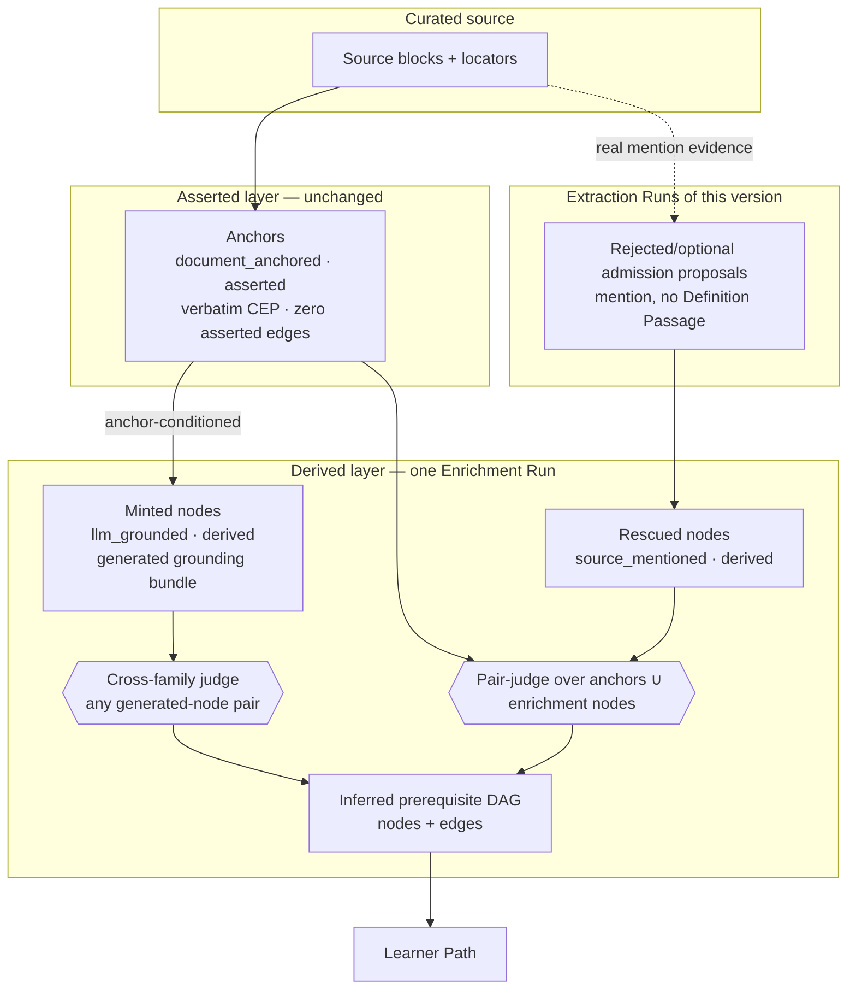
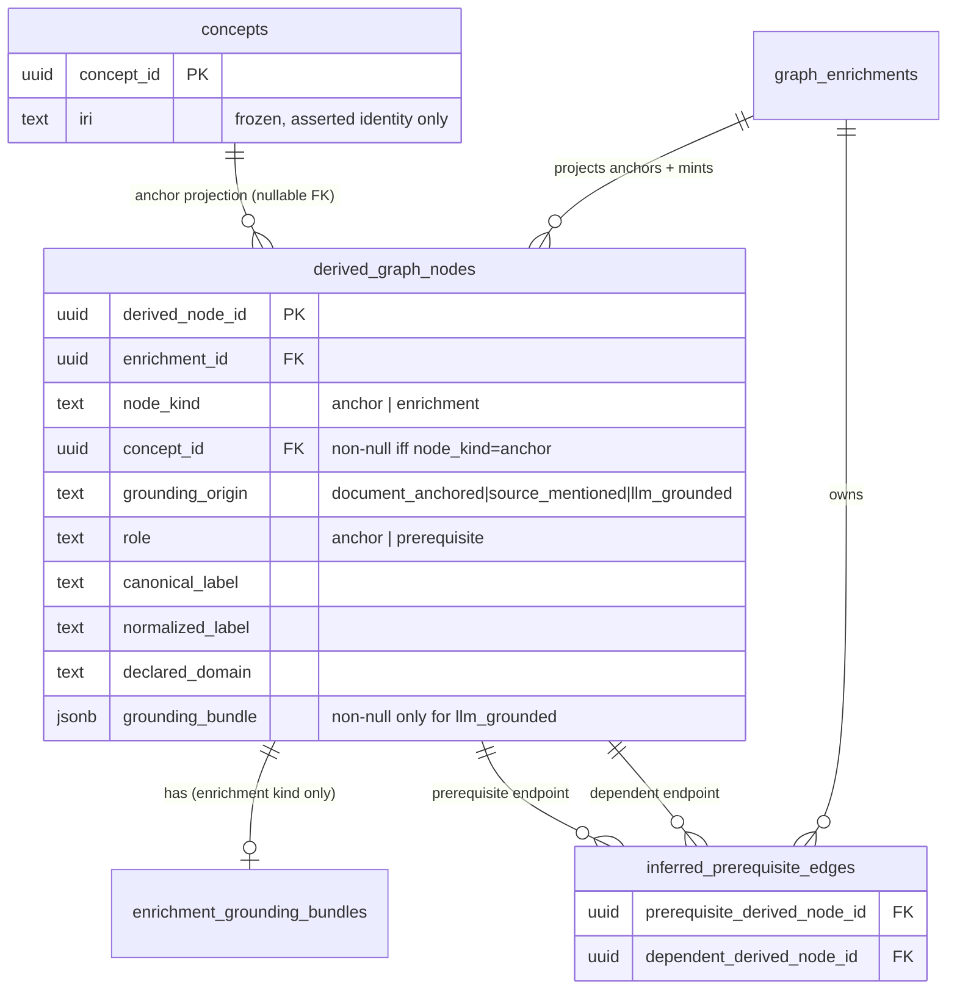

# feat: Derived-layer prerequisite enrichment — mint nodes, not just edges

## Implementation Handoff — 2026-06-16

Work is intentionally paused after U4. Do not continue U5-U7 by adding placeholder
or fabricated prerequisite labels and then testing around that behavior. The next
session should first tighten the enrichment-node proposal design so `llm_grounded`
nodes are proposed by an explicit, inspectable operation rather than by local
string construction.

Completed commits on branch `feat/derived-layer-prerequisite-enrichment`:

- `7849c31 feat(graph): add grounding model and repair admission recall` — U1 and U2.
- `387f7fe feat(graph): persist derived graph nodes` — U3.
- `52fc43e feat(graph): add grounding generation port` — U4.

Current state:

- The worktree was clean at handoff.
- The local database was reset during U3 and reinitialized from the single
  initial migration.
- Registered fixture source IDs changed after the reset; the Rust fixture source
  ID observed after reset was `4c5dbe0b-9352-4f28-853b-6b7ffc972c37`.
- `runGraphEnrichment` still only projects asserted anchors into the derived node
  space and still judges anchor-anchor pairs. U5-U7 are not implemented.

Known continuation constraints:

- Add a real proposal operation for missing prerequisites before minting
  `llm_grounded` nodes. A `GroundingGenerationPort` generates grounding for a
  chosen node label; it does not itself justify which node labels should exist.
- Do not encode prerequisite-ness as a node attribute. Ordering remains only the
  `inferred-prerequisite-of` edge.
- Update downstream readers before claiming U3 is integrated end-to-end:
  Admin Lab and learner-path SQL may still reference old concept endpoint
  columns (`concept_id`, `prerequisite_concept_id`, `dependent_concept_id`)
  while the migration now stores derived-node endpoints.
- If `DifficultyPort` is extended to score enrichment nodes, change the port to
  accept derived node IDs or derived node descriptors; do not fabricate asserted
  `Concept` values for generated nodes.
- U9 rule-14 validation has not been run for the node-minting milestone because
  U5-U8 are not implemented.

## Summary

Generalize Graph Enrichment from an edge-only operation into a **node + edge** derivation so a sparse source still yields a usable learner path. Every concept gains a `grounding_origin` axis (`document_anchored` / `source_mentioned` / `llm_grounded`) and a `role` (`anchor` / `prerequisite`), with `layer` an *invariant* of grounding — only `document_anchored` may be `asserted`. A precondition admission-recall fix ensures enrichment fills the *residual* gap rather than papering over concepts the source already defines. Minted (`llm_grounded`) prerequisite nodes carry a CEP-shaped generated grounding bundle exempt from the verbatim floor (the exemption recorded, never silent), and any prerequisite pair involving a generated node is ordered by a **cross-family** judge. The asserted Learner-Neutral Core Concept Graph is untouched: anchors only, verbatim evidence floor, zero asserted edges.

This plan covers the full origin scope (R1–R16, AE1–AE5). It defers `bridge`/`application`/`misconception` roles and `web_grounded` retrieval (forward-designed only), and keeps difficulty/learner-state as their current mocks (see origin: `docs/brainstorms/2026-06-16-derived-layer-prerequisite-enrichment-requirements.md`).

---

## Problem Frame

A real run produced only four core concepts — too sparse for a meaningful learner path. The sparsity is *structural*, not a tuning artifact:

- Admission admits a concept to the asserted core only if it has a verbatim **Definition Passage** (ADR-0005, ADR-0007). No definition in the source → not a Concept.
- Graph Enrichment (ADR-0019) adds **edges, never nodes** — `runGraphEnrichment` judges pairs of *already-published* concepts (`packages/application/src/runGraphEnrichment.ts`) and infers `inferred-prerequisite-of`. Its only predicate is that edge.

So the published concept set is exactly `{concepts the document defines verbatim}`. A thin source yields a handful of anchors, the DAG can only wire those anchors, and the learner path inherits the sparsity. The derived layer can densify *edges* but can never introduce the missing *nodes* a learner needs.

A second-order risk hides in the fix: if enrichment mints LLM-grounded nodes *over* an admission stage that is silently under-recalling, generated nodes paper over concepts sitting defined in the source. So recall is fixed first, and enrichment fills only what remains.

---

## Requirements Traceability

| Req | Summary | Units |
|---|---|---|
| R1 | Diagnose + fix admission under-recall before enrichment; never relax the Definition-Passage floor | U2 |
| R2 | Every concept carries `grounding_origin` ∈ {document_anchored, source_mentioned, llm_grounded} | U1 |
| R3 | Every concept carries `role` ∈ {anchor, prerequisite} | U1 |
| R4 | `layer` is an invariant of `grounding_origin`; `llm_grounded + asserted` is impossible | U1 |
| R5 | Asserted graph unchanged — anchors only, verbatim floor, zero asserted edges; no enrichment node ever published asserted | U1, U3, U5, U8 |
| R6 | Prerequisite ordering is an edge in the Derived Graph Layer, never a node attribute | U1, U5 |
| R7 | Enrichment mints `llm_grounded` prerequisite nodes and rescues `source_mentioned` concepts | U5 |
| R8 | Each minted node carries a CEP-shaped generated grounding bundle, inspectable + swappable | U3, U4 |
| R9 | Generated grounding exempt from the verbatim floor, tied to `grounding_origin`, recorded never silent | U6 |
| R10 | Grounding generation conditioned on the anchors the node scaffolds | U4, U5 |
| R11 | Bundle structured so a `web_grounded` upgrade replaces passages in place without changing node identity | U3, U4 |
| R12 | Ordering runs over anchors ∪ enrichment nodes within one run; asserted version still anchors-only | U5 |
| R13 | Any pair with ≥1 generated node ordered by a cross-family judge (gpt-oss-120b); anchor-anchor unchanged | U7 |
| R14 | Retain direction-bias mitigations: exact-label naming + `uncertain` | U7 |
| R15 | Admin Lab + learner-path surfaces distinguish anchors from enrichment nodes; expose grounding | U8 |
| R16 | Validate by rule-14 inspection of one sparse fixture; both-orders probe optional, not a default gate | U9 |

Acceptance Examples: AE1 (R4/R5) → U8/U9; AE2 (R1) → U2; AE3 (R8/R9) → U6; AE4 (R13) → U7; AE5 (R7/R6) → U5.

---

## Key Technical Decisions

**KTD1 — Grounding/role/layer as a node descriptor; `layer` derived, impossible states unrepresentable.**
`grounding_origin` and `role` are new axes (the current `Concept` type in `packages/domain-core/src/index.ts` is pure identity). `layer` is computed from `grounding_origin` (R4), never an independent field. Model the derived-node descriptor so `llm_grounded + asserted` cannot be constructed — a discriminated union where `asserted` is reachable only from `document_anchored` — plus a single `assertLayerInvariant`/`layerOf(groundingOrigin)` function that is the one authority. Asserted `Concept`s are `document_anchored` anchors by construction; enrichment nodes are `source_mentioned` or `llm_grounded` and always `derived`.

**KTD2 — One unified `derived_graph_nodes` table; edges reference derived nodes only; `concepts` stays the frozen identity store.**
The asserted `concepts` table is the frozen-IRI identity store (ADR-0015) and must never be widened or referenced from every edge endpoint. The derived layer instead owns a *complete* node space: a single `derived_graph_nodes` table (scoped to an `enrichment_id`) holds one row per node in the run's graph — `node_kind: anchor | enrichment`, with a nullable `concept_id` that back-references `concepts` for anchor rows only. `inferred_prerequisite_edges` and `concept_difficulties` reference `derived_graph_nodes` **exclusively**, so the asserted/derived seam collapses to exactly one column (`derived_graph_nodes.concept_id`) instead of smearing a kind-discriminator across every edge endpoint and difficulty row. Anchor rows are a per-run *projection* of the asserted snapshot (denormalized `canonical_label`/`normalized_label`/`declared_domain` for traversal), never a competing identity — `concepts` remains the sole merge authority (ADR-0015), and minted/rescued nodes never enter the asserted layer (R5/AE1). Chosen over (a) the dual-FK / per-endpoint `node_kind`-discriminator design (pushes union-resolution into every downstream consumer), (b) reusing `concepts` (would corrupt asserted identity), and (c) JSONB-only nodes (loses the relational query surface ADR-0003 requires). Slightly more upfront write work — enrichment materializes anchor-projection rows — buys a single, well-defined boundary everywhere downstream.

**KTD3 — Generated grounding bundle = CEP-shaped, per-passage provenance, swappable artifact (R8, R11).**
A bundle holds one-or-more definition passages, a bounded set of mention-like passages, and the generating model's rationale — the same *shape* as a published CEP, so the Admin Lab renders it with familiar machinery. Each passage carries its own `grounding_origin` tag and (for real passages) source/block/quote/locator. A `web_grounded` upgrade later replaces the generated passages in place, keyed by `derived_node_id`, without changing node identity. Stored as an immutable JSONB artifact plus a normalized relational surface for inspection.

**KTD4 — Verbatim floor applies per-passage by provenance; the exemption is recorded (R9, AE3).**
`evidenceQuoteMatches` (the deterministic floor in `packages/domain-core/src/index.ts`) is a legitimate hard gate *only* for passages that claim a source quote. A `llm_grounded` passage has no source quote to verify, so it is exempt — but the exemption is written as an explicit `verbatim_check: not_applicable_by_grounding` disposition on the node, never a silent skip. `source_mentioned` rescue evidence and anchor evidence remain fully verbatim-gated. This keeps AGENTS rule 16 satisfied: the floor still hard-vetoes every passage that asserts a verifiable source claim.

**KTD5 — `source_mentioned` rescue draws from member runs' rejected/optional admission proposals (confirmed with user).**
Rescue candidates are concepts the source *mentions but never defines*. The cleanest, fully-provenanced source is the rejected/optional `AdmissionProposal`s of the Extraction Runs that built the graph version (resolved via `graph_version_run_memberships`): they carry real verbatim mention evidence and a `failed_*`/non-core tier. Enrichment gains a *read* dependency on the run store for the version's member runs. Rejected alternatives: anchor-CEP-mention mining (noisier, no admission evidence) and the union of both (larger residual). A rescued node is `source_mentioned`/`derived`; it is never promoted into the asserted version.

**KTD6 — Missing-prerequisite minting is an anchor-driven bounded pass (resolves origin open questions 1–2).**
For each anchor, ask "what must a learner understand before this anchor that the source assumes but does not teach?" rather than unbounded graph-wide gap-filling. Bounds are configurable on the enrichment config: default ≤2 minted nodes per anchor and a per-run cap (default 12) to prevent runaway densification. The generator is DeepSeek-family (AGENTS rule 5) — which is precisely *why* the generated-node judge must be non-DeepSeek (KTD7).

**KTD7 — Generated-node ordering uses a dedicated cross-family judge alias; anchor-anchor ordering is untouched (R13).**
Add a dedicated `kg-generated-prerequisite-judgment` LiteLLM alias → `openrouter/openai/gpt-oss-120b` (the same model `kg-independent-judge` already uses), and route any pair where ≥1 node is generated (`llm_grounded`, later `web_grounded`) to a second `LiteLlmPrerequisiteJudgmentAdapter` bound to it. Anchor-anchor pairs stay on `kg-prerequisite-judgment` → DeepSeek, so the validated anchor-only ordering does not silently regress onto a new model. Chosen over repointing `kg-prerequisite-judgment` (would force re-validation of all anchor-only ordering) per the origin's stated preference. Direction-bias mitigations (R14) — exact-canonical-label naming and `uncertain` → flagged/path-excluded — are reused unchanged from the existing adapter.

**KTD8 — The recall fix is diagnosis-first and recovers anchors, never mints them (R1, AE2).**
A concept the document defines verbatim but that the prior run dropped must be recovered as a `document_anchored` anchor *before* enrichment runs, not minted later as `llm_grounded`. The fix repairs admission/core-set-selection recall without relaxing the Definition-Passage requirement; the exact repair is identified by rule-14 inspection of the sparse fixture (execution-time discovery), so U2 is scoped as diagnose-then-repair.

---

## High-Level Technical Design

The grounding model (this milestone's axis values and the layer invariant):

| Axis | Values (this milestone) | Reserved |
|---|---|---|
| `grounding_origin` | `document_anchored`, `source_mentioned`, `llm_grounded` | `web_grounded` |
| `role` | `anchor`, `prerequisite` | `bridge`, `application`, `misconception` |
| `layer` | `asserted` (iff `document_anchored`), else `derived` | — |

End-to-end flow (asserted layer stays source-pure; all minting is in the Enrichment Run):



Node-identity / persistence shape (KTD2):



*Both edge endpoints are plain FKs into `derived_graph_nodes`; the asserted/derived distinction is read from `derived_graph_nodes.node_kind` (and `grounding_origin`), never duplicated onto the edge. A CHECK enforces the kind invariant on the node row — `node_kind=anchor` ⇒ `concept_id` non-null, `grounding_origin=document_anchored`, `grounding_bundle` null; `node_kind=enrichment` ⇒ `concept_id` null, `grounding_origin ∈ {source_mentioned, llm_grounded}`. `node_kind` is a denormalized discriminator whose value must equal `layerOf`'s anchor/enrichment split — the U1 grounding invariant stays the single authority.*

---

## Output Structure

New files concentrate in three places (derived-node persistence, grounding generation, and the enrichment-node operation). Indicative layout:

```
packages/
  domain-core/src/index.ts            # + grounding/role/layer types, EnrichmentNode, GeneratedGroundingBundle, layerOf()
  ports/src/index.ts                  # + GroundingGenerationPort; extend EnrichmentRunStorePort/DerivedGraphLayer
  application/src/
    runGraphEnrichment.ts             # mint + rescue + union pair-judging + cross-family routing
    enrichmentNodeMinting.ts          # NEW: anchor-driven bounded proposal + rescue assembly
    verbatimFloorByGrounding.ts       # NEW: per-passage floor + recorded exemption
  infrastructure-litellm/src/
    enrichmentAdapters.ts             # + cross-family judge wiring
    groundingGenerationAdapters.ts    # NEW: LiteLlmGroundingGenerationAdapter
    toolSchemas.ts                    # + grounding-generation forced tool schema
  infrastructure-postgres/src/
    migrations/0000_initial_lrnki_schema.sql   # rewritten in place (DB reset)
    PostgresEnrichmentStores.ts       # persist/hydrate enrichment nodes + bundles
litellm/config.yaml                   # + kg-generated-prerequisite-judgment alias
apps/
  kg-worker/src/knowledgeGraphWorker.ts        # wire grounding port + cross-family judge; bump config hash
  admin-lab/src/lib/derivedGraph.ts            # node kind/grounding in view model
  admin-lab/src/components/DerivedGraphExplorer.tsx  # visual distinction + bundle inspection
```

The per-unit `**Files:**` lists are authoritative; the implementer may adjust layout.

---

## Implementation Units

### U1. Grounding model and layer invariant

**Goal:** Introduce `grounding_origin`, `role`, and the derived `layer` invariant as first-class domain types, with `llm_grounded + asserted` made unrepresentable.
**Requirements:** R2, R3, R4, R6; foundation for R5.
**Dependencies:** none.
**Files:**
- `packages/domain-core/src/index.ts` (add `GroundingOrigin`, `ConceptRole`, `GraphLayer`, `layerOf()`, the `DerivedGraphNode` union — `anchor`-projection | `EnrichmentNode` — and the `EnrichmentNode` descriptor; annotate `Concept` as `document_anchored`/`anchor`/`asserted` by construction)
- `packages/domain-core/src/groundingModel.test.ts` (new)
- `packages/ports/src/index.ts` (thread the new types where `DerivedGraphLayer` and enrichment ports reference nodes)

**Approach:** `GroundingOrigin = "document_anchored" | "source_mentioned" | "llm_grounded"` (reserve `web_grounded` in a comment, not the union). `layerOf(origin)` returns `"asserted"` only for `document_anchored`, else `"derived"` — the single authority for R4. Model `EnrichmentNode` as the derived-only descriptor (`source_mentioned | llm_grounded`, always `derived`) so an asserted+llm_grounded value cannot be constructed, and `DerivedGraphNode = AnchorProjection | EnrichmentNode` as the unified node-space type that `derived_graph_nodes` persists (KTD2) — `node_kind` is derived from which variant it is, never an independent flag. `role = prerequisite` is a *minting reason*, not an ordering — ordering stays an edge (R6).
**Patterns to follow:** the existing discriminated unions in `domain-core` (`ExtractedTypedAssertion`, `PublishedTypedAssertion`) and the single-authority pattern of `normalizeConceptLabel`.
**Test scenarios:**
- `layerOf("document_anchored")` → `asserted`; `layerOf("source_mentioned")` and `layerOf("llm_grounded")` → `derived`. *Covers R4.*
- Constructing an `EnrichmentNode` with `grounding_origin: "llm_grounded"` yields `layer: "derived"`; the type does not admit `asserted`. *Covers R4.*
- An asserted `Concept` resolves to `role: anchor`, `grounding_origin: document_anchored`. *Covers R2, R3.*
- `role` carries no ordering field; a `prerequisite` node has no prerequisite/dependent attribute. *Covers R6.*

---

### U2. Admission-recall diagnosis and fix (precondition)

**Goal:** Recover concepts the sparse fixture defines verbatim but that the prior run dropped, without relaxing the Definition-Passage requirement, so enrichment fills only the residual.
**Requirements:** R1; AE2.
**Dependencies:** U1.
**Files:**
- `packages/infrastructure-litellm/src/extractionAdapters.ts` (admission/core-set-selection prompt repair, if the diagnosis points there)
- `packages/application/src/applyAdmissionPolicy.ts` and/or `applyAdmissionLabelJudge.ts` (boundary repair, if the diagnosis points there)
- `packages/application/src/executeExtractionRun.ts` (only if recall feedback wiring is needed)
- corresponding `*.test.ts` for whichever boundary changes
- `tmp/u2-recall-diagnosis.md` (rule-14 diagnostic note; gitignored)

**Approach:** Diagnose-then-repair. First run the sparse fixture and inspect which concepts carry a verbatim Definition Passage yet were dropped (rejected, demoted out of core, or lost in Core Set Selection). The repair targets the specific drop cause — likely over-strict Core Set Selection demotion or the three-test eligibility gate — and must keep the verbatim Definition-Passage floor intact. Recovered concepts publish as `document_anchored` anchors (U1), not later-minted `llm_grounded` nodes.
**Execution note:** Diagnosis is rule-14-first on the sparse fixture with real model calls — identify the exact under-recall cause before changing any boundary; do not pre-commit a fix in code.
**Patterns to follow:** the downgrade-only, fail-closed-preserves-recall discipline already in `applyAdmissionLabelJudge` and `groundedAdmissionLabelJudgment`.
**Test scenarios:**
- A fixture concept with a verbatim Definition Passage that the prior run dropped is admitted `core` after the fix. *Covers R1, AE2.*
- A concept with *no* Definition Passage is still not admitted core (the floor is not relaxed). *Covers R1.*
- Regression: the previously-correct rejections on the Rust/InstructKG fixtures still reject (no precision loss). *Covers R1.*
- The recovered concept publishes as `document_anchored`/`asserted`, never `llm_grounded`. *Covers AE2.*

---

### U3. Derived-layer node persistence and storage shape

**Goal:** Persist the unified `derived_graph_nodes` space (anchor projections + enrichment nodes) and the generated grounding bundles, with `inferred_prerequisite_edges`/`concept_difficulties` referencing derived nodes only, plus a JSON_TABLE inspection surface. Asserted tables unchanged.
**Requirements:** R8, R11; supports R5.
**Dependencies:** U1.
**Files:**
- `packages/infrastructure-postgres/src/migrations/0000_initial_lrnki_schema.sql` (rewrite in place: add `derived_graph_nodes` with the `node_kind` CHECK, `enrichment_grounding_bundles` + passage rows, repoint `inferred_prerequisite_edges` and `concept_difficulties` to `derived_node_id`, add JSON_TABLE views)
- `packages/infrastructure-postgres/src/PostgresEnrichmentStores.ts` (persist/hydrate nodes + bundles + generalized edges)
- `packages/infrastructure-postgres/src/PostgresStores.test.ts` (round-trip)
- `packages/domain-core/src/index.ts` (`GeneratedGroundingBundle`, extend `DerivedGraphLayer` with `derivedNodes`)
- `packages/ports/src/index.ts` (extend `EnrichmentRunStorePort.persist`/`getLayer`)

**Approach:** New `derived_graph_nodes(derived_node_id, enrichment_id, node_kind, concept_id?, grounding_origin, role, canonical_label, normalized_label, declared_domain, …)` with a CHECK tying `node_kind` to `concept_id` presence and `grounding_origin` (KTD2). The enrichment run projects each asserted anchor into a `node_kind=anchor` row (nullable `concept_id` back-reference) and writes minted/rescued nodes as `node_kind=enrichment` rows. `inferred_prerequisite_edges` carries two plain FKs (`prerequisite_derived_node_id`, `dependent_derived_node_id`) into `derived_graph_nodes`; `concept_difficulties` repoints from `concept_id` to `derived_node_id`. Generated grounding bundle stored both as an immutable JSONB artifact (the swappable unit, R11) and a normalized passage surface tagged by `grounding_origin`. Single migration rewritten and DB reset (AGENTS rules 8, 9).
**Patterns to follow:** the existing `graph_version_concept_evidence_profiles` + `graph_version_evidence_passages` CEP shape; the `artifact_*` JSON_TABLE views and `enrichment_run.v2` artifact envelope already in `PostgresEnrichmentStores.ts`.
**Test scenarios:**
- Persist an Enrichment Run with edges among anchor-projection and enrichment nodes; hydrate reproduces every node's `node_kind`/`grounding_origin` and both edge endpoints. *Covers R8.*
- An anchor-projection row carries a non-null `concept_id`; an enrichment row carries a null `concept_id` — the `node_kind` CHECK rejects the inverse. *Covers R8 (KTD2 invariant).*
- A grounding bundle round-trips with per-passage `grounding_origin` tags intact. *Covers R8.*
- The asserted `concepts`/`graph_version_*` tables and the published snapshot are byte-for-byte unchanged after an enrichment run. *Covers R5.*
- A JSON_TABLE view flattens `derived_graph_nodes` (one row per node with node_kind/grounding_origin/role) for the Admin Lab. *Covers R8.*
- Replacing a node's bundle artifact (simulated `web_grounded` upgrade) keeps the same `derived_node_id` and edges. *Covers R11.*

---

### U4. Anchor-conditioned grounding generation port and adapter

**Goal:** Generate a CEP-shaped grounding bundle for a minted node, conditioned on the anchors it scaffolds, behind an explicit port.
**Requirements:** R8, R10; R11 (shape).
**Dependencies:** U1, U3.
**Files:**
- `packages/ports/src/index.ts` (`GroundingGenerationPort`)
- `packages/infrastructure-litellm/src/groundingGenerationAdapters.ts` (new `LiteLlmGroundingGenerationAdapter`)
- `packages/infrastructure-litellm/src/toolSchemas.ts` (forced tool schema + zod validator for the bundle)
- `packages/infrastructure-litellm/src/groundingGenerationAdapters.test.ts` (new)

**Approach:** `GroundingGenerationPort.generate({ declaredDomain, nodeLabel, scaffoldedAnchors: {label, definitionQuotes}[] })` → a `GeneratedGroundingBundle` (definition passage(s), bounded mention-like passages, generating-model rationale), every passage tagged `llm_grounded`. Forced named tool schema (AGENTS rule 6), arguments validated and failed-closed at the boundary. The prompt conditions generation on the scaffolded anchors' framing so generated text stays tied to the source's vocabulary rather than free-floating world knowledge (R10). Generator is DeepSeek-family (AGENTS rule 5) — routed through an existing extraction alias, never a raw provider.
**Patterns to follow:** `LiteLlmEvidenceProfileExtractionAdapter` (forced-tool, bounded, validated) and the schema/validator pairs in `toolSchemas.ts`.
**Test scenarios:**
- Given an anchor with a definition quote, the adapter returns a bundle whose passages are all tagged `llm_grounded` and whose rationale references the anchor. *Covers R8, R10.*
- A malformed tool argument (missing definition passage) fails closed at the boundary rather than producing a partial bundle. *Covers R8.*
- The bundle shape carries per-passage provenance slots that a later `web_grounded` passage can fill in place. *Covers R11.*
- Integration: the adapter calls the DeepSeek-family alias via LiteLLM, not a raw provider. *Covers R10 (AGENTS rule 5).*

---

### U5. Enrichment node operation: rescue + mint + union ordering

**Goal:** Extend `runGraphEnrichment` to rescue `source_mentioned` nodes from member runs' rejected/optional proposals, mint `llm_grounded` nodes via an anchor-driven bounded pass, and run prerequisite ordering over the union of anchors and enrichment nodes — leaving the asserted version untouched.
**Requirements:** R7, R5, R6, R10, R12; AE5.
**Dependencies:** U1, U3, U4 (and U2 conceptually — recall fixed first).
**Files:**
- `packages/application/src/enrichmentNodeMinting.ts` (new: anchor-driven bounded proposal, rescue assembly, bounds)
- `packages/application/src/runGraphEnrichment.ts` (orchestrate rescue + mint + union pair set; persist nodes)
- `packages/application/src/runGraphEnrichment.test.ts`
- `packages/application/src/enrichmentNodeMinting.test.ts` (new)
- `packages/ports/src/index.ts` (enrichment reads member-run proposals; add the read method to the run store port)
- `packages/infrastructure-postgres/src/PostgresEnrichmentStores.ts` / extraction run store (member-run proposal read)

**Approach:** Load the published snapshot (anchors) as today. **Rescue:** via `graph_version_run_memberships`, read the member Extraction Runs' rejected/optional `AdmissionProposal`s that have a verbatim mention but no Definition Passage; dedupe by normalized label within domain; emit `source_mentioned`/`derived` nodes carrying their real mention evidence (KTD5). **Mint:** for each anchor, an anchor-conditioned bounded pass (U4) proposes `llm_grounded` prerequisite nodes the source assumes but does not teach; apply per-anchor (default ≤2) and per-run (default 12) caps (KTD6). **Union:** add rescued + minted nodes to the same-domain node set fed to pair judging; ordering produces `inferred-prerequisite-of` edges over the union (R6 — relationships are edges, not node attributes). No enrichment node is ever written to an asserted version (R5).
**Patterns to follow:** the existing `sameDomainPairs` + `mapWithConcurrency` deterministic-order machinery in `runGraphEnrichment.ts`; the bounded per-source caps in `executeExtractionRun.ts`.
**Test scenarios:**
- A member-run proposal with a mention but no definition becomes a `source_mentioned` rescued node; its relationship to an anchor is an `inferred-prerequisite-of` edge, not a node attribute. *Covers R7, R6, AE5.*
- An anchor with no upstream prerequisite among existing nodes yields ≥1 `llm_grounded` minted node (respecting the per-anchor cap). *Covers R7.*
- Per-run cap is enforced: minted-node count never exceeds the run bound. *Covers R7 (bounded densification).*
- Rescue dedupes a concept that appears in two member runs to a single node. *Covers R7 (KTD5).*
- After the run, the published asserted snapshot has the same concepts and zero asserted edges. *Covers R5, R12.*
- Pair set spans anchors ∪ enrichment nodes; no cross-domain pair is produced. *Covers R12.*

---

### U6. Verbatim-floor exemption by grounding origin

**Goal:** Apply the deterministic verbatim floor per-passage by provenance — real-source passages verify verbatim, generated passages are exempt — and record the exemption explicitly.
**Requirements:** R9; AE3.
**Dependencies:** U3, U5.
**Files:**
- `packages/application/src/verbatimFloorByGrounding.ts` (new)
- `packages/application/src/verbatimFloorByGrounding.test.ts` (new)
- `packages/application/src/runGraphEnrichment.ts` (apply during node assembly; record dispositions)

**Approach:** For each grounding-bundle passage: if it claims a source quote (`document_anchored` anchor evidence, `source_mentioned` rescue evidence) run `evidenceQuoteMatches` and fail closed on mismatch; if it is `llm_grounded` it has no source quote, so record a `verbatim_check: not_applicable_by_grounding` disposition keyed to the node — never a silent skip. The floor still hard-vetoes every passage asserting a verifiable source claim (AGENTS rule 16 preserved).
**Patterns to follow:** `evidenceQuoteMatches` and `normalizeEvidenceText` in `domain-core`; the `dispositions[]` recording pattern in `EnrichmentRunTrace`.
**Test scenarios:**
- A `source_mentioned` passage whose quote does not match its cited block is rejected. *Covers R9 (floor intact for real passages).*
- A `llm_grounded` passage is accepted with a recorded `not_applicable_by_grounding` disposition. *Covers R9, AE3.*
- The recorded exemption is queryable on the node, not absent. *Covers R9 (recorded, never silent).*
- A minted node's verbatim-floor outcome is `not-applicable-by-grounding` rather than a run failure. *Covers AE3.*

---

### U7. Cross-family generated-node ordering

**Goal:** Route any prerequisite pair involving a generated node to a cross-family judge (gpt-oss-120b), leaving anchor-anchor ordering on the existing DeepSeek judge unchanged, with direction-bias mitigations retained.
**Requirements:** R13, R14; AE4.
**Dependencies:** U1, U5.
**Files:**
- `litellm/config.yaml` (add `kg-generated-prerequisite-judgment` → `openrouter/openai/gpt-oss-120b`)
- `packages/infrastructure-litellm/src/enrichmentAdapters.ts` (export the alias constant; reuse `LiteLlmPrerequisiteJudgmentAdapter`)
- `packages/application/src/runGraphEnrichment.ts` (route by node kind in the pair)
- `packages/application/src/runGraphEnrichment.test.ts`
- `apps/kg-worker/src/knowledgeGraphWorker.ts` (construct the second judge; bump `PIPELINE_CONFIG_HASH`)

**Approach:** Add the dedicated alias and a second `LiteLlmPrerequisiteJudgmentAdapter` bound to it. In the pair loop, a pair where ≥1 endpoint is an enrichment node with a generated (`llm_grounded`, later `web_grounded`) origin routes to the cross-family judge; a pair of two anchors stays on `kg-prerequisite-judgment` → DeepSeek (no regression). Both judges retain the exact-canonical-label naming and `uncertain` → flagged/path-excluded behavior (R14) already in the adapter — reuse, do not re-implement (KTD7).
**Patterns to follow:** the existing `LiteLlmPrerequisiteJudgmentAdapter` and its `uncertain`/named-label fail-closed mapping; the dual-client wiring in `knowledgeGraphWorker.buildContext`.
**Test scenarios:**
- A `{anchor, llm_grounded node}` pair is dispatched to the gpt-oss-120b judge. *Covers R13, AE4.*
- An `{anchor, anchor}` pair is dispatched to the DeepSeek `kg-prerequisite-judgment` path. *Covers R13, AE4.*
- A `{llm_grounded, source_mentioned}` pair (both derived, one generated) routes cross-family. *Covers R13.*
- The cross-family judge still names the prerequisite by exact canonical label and can return `uncertain` (path-excluded). *Covers R14.*
- Anchor-anchor ordering output is unchanged versus the pre-change baseline on a fixture. *Covers R13 (no regression).*

---

### U8. Admin Lab and learner-path inspection

**Goal:** Visually distinguish anchors from enrichment nodes across the derived-graph and learner-path surfaces and expose each enrichment node's `grounding_origin` and grounding bundle; keep the asserted view anchors-only/zero-edges.
**Requirements:** R15; AE1, AE5.
**Dependencies:** U3, U5, U7.
**Files:**
- `apps/admin-lab/src/lib/derivedGraph.ts` (node kind + grounding_origin + bundle in `DerivedGraphNode`/view model)
- `apps/admin-lab/src/lib/enrichments.ts` (load enrichment nodes, grounding, kind)
- `apps/admin-lab/src/components/DerivedGraphExplorer.tsx` (visual distinction + bundle inspection panel)
- `apps/admin-lab/src/lib/derivedGraph.test.ts` (view-model)

**Approach:** Extend the read-only loaders and the pure view model so each node carries `grounding_origin`/`role`/kind; render anchors and enrichment nodes with distinct Cytoscape styling and surface each enrichment node's grounding bundle (definition/mentions/rationale + the recorded verbatim disposition) in an inspection panel. The published asserted Graph Explorer stays a zero-edge anchors-only inspector (no path by which an `llm_grounded` node appears there). Enrichment is never silently merged into the authoritative set. UI uses shadcn base-ui + Cytoscape (AGENTS rule 15).
**Patterns to follow:** the existing `DerivedGraphExplorer` Cytoscape render + equivalent textual representation, and the read-only `withClient` loaders in `lib/enrichments.ts`.
**Test scenarios:**
- The view model tags each node with its kind/grounding_origin and the textual representation distinguishes anchors from enrichment nodes. *Covers R15.*
- An enrichment node's grounding bundle (and its recorded verbatim disposition) is present in the detail view model. *Covers R15, AE3.*
- The published asserted view shows only anchors and zero edges; no enrichment node appears. *Covers R5, AE1.*
- A rescued `source_mentioned` node renders with its prerequisite edge to an anchor, not as an attribute. *Covers AE5.*
- Test expectation: Cytoscape canvas styling itself is verified by rule-14 visual inspection in U9, not unit-tested.

---

### U9. Rule-14 validation and ADR updates

**Goal:** Validate the milestone by rule-14 inspection of one sparse fixture end-to-end and record the architectural decisions (generalize ADR-0019; new ADR for the grounding model).
**Requirements:** R16; AE1–AE5 end-to-end.
**Dependencies:** U1–U8.
**Files:**
- `docs/adr/0019-graph-enrichment-derived-layer.md` (generalize edge-only → node+edge derivation)
- `docs/adr/0023-grounding-origin-model-and-cross-family-generated-node-judge.md` (new)
- `docs/adr/README.md` (link 0023)
- `CONTEXT.md` (vocabulary: grounding_origin, role, enrichment node, generated grounding bundle)
- `docs/plans/TODO.md` (roll completed work into COMPLETED; refresh VALIDATION)
- `tmp/u9-derived-enrichment-quality-evaluation.md` (rule-14 note; gitignored)

**Approach:** Run the sparse fixture through register → extraction (post-recall-fix) → publish → enrichment (rescue + mint) → learner path with real model calls. Inspect: recovered anchors, rescued + minted nodes with grounding, the resulting prerequisite DAG, and the learner path — judged useful and traceable per the rule-14 SKILL. The R16 both-orders consistency check is run *only* as an optional measured inspection probe, not wired as a default symbolic gate (AGENTS rule 16). Classify PASS / FIX_FIRST / EXPERIMENT_ONLY / BLOCKED and act before claiming completion.
**Execution note:** This unit is the rule-14 gate itself — fire real LLM calls; passing unit tests alone is not sufficient (AGENTS rules 13, 14).
**Test scenarios:**
- Test expectation: none (validation + documentation unit) — quality is established by the rule-14 evaluation note, not new automated tests.
- The evaluation note records the sparse-fixture learner path before vs. after (densification is real and traceable). *Covers R16.*
- The note states the load-bearing-bet caveat: generated grounding produces useful orderings, kept non-authoritative by the cross-family judge + derived-layer quarantine. *Covers R16.*

---

## Scope Boundaries

### In scope
R1–R16 and AE1–AE5: the grounding model, the recall precondition, the node-minting enrichment operation, generated grounding, cross-family ordering, inspection surfaces, and rule-14 validation.

### Deferred for later (origin)
- `bridge`, `application`, and `misconception` roles. When `misconception` lands, model it as a satellite annotation on a concept (Brown & Burton "buggy rule" shape), not a DAG node with prerequisite edges.
- `web_grounded` grounding. The grounding tag and bundle are forward-designed to accept external citations (R11), but no web retrieval ships in this milestone.

### Unchanged from the complexity reset (origin)
- Difficulty stays the DAG-depth mock behind `DifficultyPort`; learner state stays the empty mock behind `LearnerStatePort`.
- Embedding canonicalization and the embedding blocking tier stay cut; deterministic identity (ADR-0015) stays the sole merge authority.
- No standing benchmark or oracle harness — rule-14 inspection plus the inline judges and the verbatim-evidence floor remain the quality bar.

### Deferred to follow-up work (plan-local)
- DOCX/PPTX curated-source expansion (existing TODO #1) — orthogonal to this milestone.
- Tuning the minted-node bounds (per-anchor / per-run caps) beyond the defaults, pending rule-14 evidence.

---

## Risks & Dependencies

- **Load-bearing bet (origin).** Generated grounding must produce prerequisite orderings good enough to densify the learner path usefully. *Mitigation:* validated by rule-14 inspection (U9), not a standing metric; the cross-family judge (U7) and derived-layer quarantine keep the self-loop's errors non-authoritative and inspectable rather than eliminating them.
- **Repointing edges/difficulty to `derived_graph_nodes` is the riskiest schema change (U3).** Moving `inferred_prerequisite_edges`/`concept_difficulties` off the `concepts` FK onto the unified derived-node space touches the persistence contract the Admin Lab and learner path read, and adds the per-run anchor-projection write. *Mitigation:* the unified table confines the asserted/derived seam to one column (KTD2), shrinking the downstream blast radius; single-migration rewrite + DB reset (AGENTS rules 8, 9); round-trip tests in U3 before U5 consumes it.
- **Recall fix is execution-discovery-shaped (U2).** The exact under-recall cause is unknown until the sparse fixture is inspected. *Mitigation:* U2 is explicitly diagnose-then-repair with a rule-14 gate; the Definition-Passage floor is never relaxed, bounding the blast radius.
- **Generator/judge independence depends on the generator staying DeepSeek-family (origin assumption).** R13's value collapses if the generator and judge converge to one family. *Mitigation:* the dedicated `kg-generated-prerequisite-judgment` alias pins gpt-oss-120b; bump `PIPELINE_CONFIG_HASH` on any model/prompt change so runs stay attributable.
- **Dependency:** DeepSeek + gpt-oss-120b via LiteLLM, Postgres 18, and Docling for the sparse fixture must be reachable for the U9 rule-14 run; if unavailable, U9 is `BLOCKED` and the milestone is not quality-verified.

---

## ADR Impact

- **ADR-0019** generalized from edge-only derivation to **node + edge** derivation: Graph Enrichment may mint `source_mentioned` and `llm_grounded` derived nodes (never asserted), ordering remains the `inferred-prerequisite-of` edge.
- **New ADR-0023** records the grounding-origin model (the three-axis table + `layer` invariant), the non-verbatim trust contract for generated grounding (the recorded floor exemption), and the cross-family generated-node judge.
- Numbers 0020–0021 remain unissued (per `docs/adr/README.md`).

---

## Sources & Research

**Origin:** `docs/brainstorms/2026-06-16-derived-layer-prerequisite-enrichment-requirements.md`

**Code anchors verified during planning:**
- `packages/application/src/runGraphEnrichment.ts` — exhaustive same-domain pair judging; the operation U5 extends.
- `packages/infrastructure-litellm/src/enrichmentAdapters.ts` — `kg-prerequisite-judgment`; named-label + `uncertain` direction-bias mitigations reused by U7.
- `packages/infrastructure-litellm/src/extractionAdapters.ts` — admission/core-set-selection prompts (U2) and `kg-independent-judge` (gpt-oss-120b) precedent for U7.
- `litellm/config.yaml` — `model_group_alias` map; `kg-prerequisite-judgment` → DeepSeek, `kg-independent-judge` → gpt-oss-120b.
- `packages/domain-core/src/index.ts` — `Concept` (pure identity, no grounding axis); `evidenceQuoteMatches` verbatim floor.
- `packages/infrastructure-postgres/src/migrations/0000_initial_lrnki_schema.sql` — `inferred_prerequisite_edges`/`concept_difficulties` FK to `concepts` (the U3 repoint-to-`derived_graph_nodes` point); `artifact_*` JSON_TABLE surface.
- `apps/kg-worker/src/knowledgeGraphWorker.ts` — end-to-end orchestration + `PIPELINE_CONFIG_HASH`.
- `apps/admin-lab/src/components/DerivedGraphExplorer.tsx`, `apps/admin-lab/src/lib/{enrichments,derivedGraph}.ts` — read-only derived-graph rendering U8 extends.

**External (origin):** AEVS anchor-constrained extraction with per-element provenance (MDPI 2025); dual grounded+derived knowledge-structure graphs (GraphRAG, arXiv 2506.22303); KG learning-path / curriculum sequencing surveys; Brown & Burton (1978) buggy-rule shape for the deferred `misconception` role.
