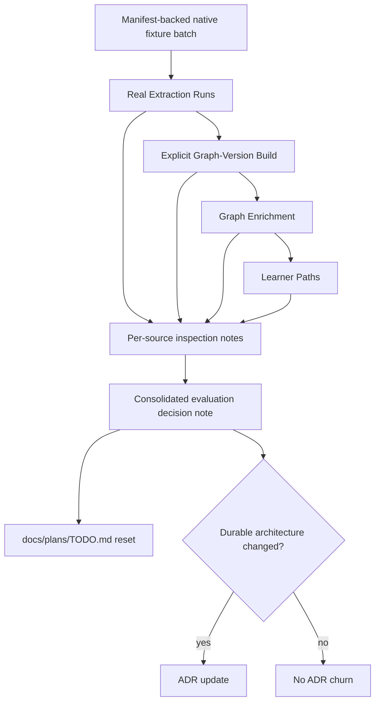

# feat: Evaluation-first roadmap reset

## Summary

Use the manifest-backed native fixture set to run and inspect the current extraction-to-Learner-Path pipeline before changing roadmap priorities. The plan keeps new benchmark machinery out of scope, records run-specific inspection notes under `tmp/`, and rewrites the live roadmap so every active task is earned by inspected output.

---

## Problem Frame

The complexity reset and derived-layer enrichment work are complete enough to be evaluated rather than extended by method-stack inertia. Current validation is Rust-heavy and already surfaced caveats around extra operation-like Concepts, generated-node granularity redundancy, and a minting cap that bound exactly.

The origin document requires the next roadmap update to come from real mixed-domain output. Local research also found a fixture-definition mismatch: `fixtures/README.md` describes Gate 1 as three native fixtures, while `fixtures/manifest.json` registers `fixtures/markdown/datalab-output-2602.17111v1.pdf.md` as a native Markdown educational-technology fixture in the Gate 1 manifest. This plan treats the runnable native batch as the manifest-backed set and includes documentation cleanup before interpreting results.

---

## Requirements

**Evaluation Batch**

- R1. Define the first evaluation batch from `fixtures/manifest.json` native-parser entries, including Rust, biology, economics, and InstructKG educational technology.
- R2. Keep the Gate 2 Docling PDF fixture as follow-up evidence only when the native batch leaves an ingestion-format question unresolved.
- R3. Run real Extraction Runs, Graph-Version Builds, Enrichment Runs, and Learner Path generations before adding downstream graph methods.
- R4. Inspect each source's asserted Concepts, Concept Evidence Profiles, enrichment nodes, inferred prerequisite DAG, and Learner Path together as one product surface.

**Decision Rules**

- R5. Record run-specific quality issues under `tmp/`, not in a reusable benchmark or oracle harness.
- R6. Promote a defect into roadmap work only when inspected output shows it materially affects graph reliability, provenance, auditability, or Learner Path usefulness.
- R7. Preserve domain-neutral prompts and tool schemas; do not tune from fixture-specific expected answers.
- R8. Keep symbolic hard vetoes limited to provable guarantees such as verbatim evidence verification.

**Roadmap Cleanup**

- R9. Rewrite `docs/plans/TODO.md` so completed reset and enrichment milestones no longer read as active work.
- R10. Keep the live TODO to three to seven tasks ordered by dependency and value.
- R11. Every live TODO task must name the real-output defect or product gap that earned it.
- R12. Do not update ADRs for speculative method-stack preferences; update ADRs only if the evaluation creates a durable architectural decision.

**Deferred Method Stack**

- R13. Keep Bradley-Terry difficulty, anchor concepts, uncertainty intervals, and learner simulation deferred until baseline path quality makes difficulty calibration the limiting problem.
- R14. Keep IRT/KT and personalized learner-state modeling post-MVP until the learner-neutral graph passes the static quality gate.
- R15. Keep embedding canonicalization, embedding blocking, clustering, and non-LLM prerequisite signals out unless a measured module beats current deterministic or exhaustive behavior.
- R16. Keep cross-source identity deterministic unless a measured identity experiment justifies a reversible assistance layer that cannot mutate graph identity on its own.

---

## Key Technical Decisions

- KTD1. **Use the manifest as the executable batch source:** `fixtures/manifest.json` is what `worker:kg register-from-manifest` reads, so the plan resolves the Gate 1 ambiguity by aligning docs and evaluation notes to the manifest-backed native entries.
- KTD2. **Evaluate the current pipeline before changing it:** Real runs should use the existing ports and worker operations so failures reflect the current architecture rather than a new evaluation harness.
- KTD3. **Build one inspection note per source plus a consolidated decision note:** Per-source notes keep observed defects tied to concrete run IDs, while the consolidated note decides what earns live roadmap work.
- KTD4. **Use Admin Lab and persisted artifacts as inspection surfaces:** Run, enrichment, and Learner Path views already expose the data needed for rule-14 inspection, so the plan extends inspection practice rather than creating a parallel scoring UI.
- KTD5. **Rewrite TODO after evidence, not before:** `docs/plans/TODO.md` should remain the live roadmap surface, but its active tasks should be derived from the consolidated inspection results.

---

## High-Level Technical Design

---

## Scope Boundaries

### In Scope

- Native-parser real LLM runs for Rust, biology, economics, and InstructKG educational technology fixtures.
- Run-specific inspection notes covering extraction, publication, enrichment, and Learner Path quality.
- A consolidated evaluation note that decides which defects earn roadmap work.
- `docs/plans/TODO.md` cleanup based on inspected output.
- Fixture documentation cleanup so Gate 1/native batch definitions match executable manifest behavior.

### Deferred to Follow-Up Work

- Running the Gate 2 Docling PDF fixture as additional evidence if the native batch raises a format-specific concern.
- ADR updates only if the evaluation produces a durable architecture decision.
- Targeted prompt, cap, schema, identity, or enrichment changes discovered by the evaluation.

### Outside This Plan

- A standing oracle benchmark, model-authored gold set, or reusable scoring harness.
- Reintroducing embeddings, clustering, Bradley-Terry difficulty, IRT/KT, or personalized learner-state modeling without an observed limiting defect.
- Fixture-specific prompt calibration or schema wording.
- Making the asserted graph learner-specific.

---

## Implementation Units

### U1. Normalize Native Batch Definition

- **Goal:** Make the first evaluation batch explicit and align fixture docs with the manifest-backed runnable set.
- **Requirements:** R1, R2, R7
- **Dependencies:** None
- **Files:**
  - `fixtures/README.md`
  - `fixtures/manifest.json`
  - `packages/infrastructure-ingestion/src/MarkdownStructuredDocumentParser.test.ts`
- **Approach:** Treat `fixtures/manifest.json` as the operational source of truth because worker registration reads it. Update `fixtures/README.md` so Gate 1/native-parser coverage includes the InstructKG Markdown fixture and distinguishes native Markdown converted ahead of time from Gate 2 Docling-at-ingestion fixtures. Avoid changing fixture contents or manifest identity unless the docs expose a real manifest defect.
- **Patterns to follow:** Existing fixture documentation separates source content under `fixtures/` from generated outputs under `tmp/`; parser tests already use the InstructKG Markdown fixture as a native Markdown structure-pass fixture.
- **Test scenarios:**
  - Existing Markdown parser fixture test continues to parse `fixtures/markdown/datalab-output-2602.17111v1.pdf.md` through the native Markdown parser and excludes non-teachable sections.
  - Fixture documentation names the same native batch entries that the manifest registers, without moving the PDF/Docling fixture into native Gate 1.
- **Verification:** A reader can identify the native evaluation batch from `fixtures/README.md` and see the same entries in `fixtures/manifest.json`.

### U2. Run Native Fixture Pipeline and Capture IDs

- **Goal:** Produce fresh real output for each native fixture through extraction, publication, enrichment, and Learner Path generation.
- **Requirements:** R3, R4, R5, R7, R8
- **Dependencies:** U1
- **Files:**
  - `apps/kg-worker/src/knowledgeGraphWorker.ts`
  - `tmp/evaluation-first-roadmap-reset/<source-slug>-inspection.md`
  - `tmp/evaluation-first-roadmap-reset/run-index.md`
- **Approach:** Use the existing worker operations and explicit run/version IDs. Register manifest fixtures if needed, run extraction for the native batch, sanity-check successful extraction artifacts before selecting them for publication, enrich the resulting graph version, and compute representative Learner Paths for inspectable target Concepts in each domain. Keep all IDs and first-pass observations in `tmp/`.
- **Execution note:** Fire real LLM calls through the existing LiteLLM aliases; do not mock extraction or judges for this milestone.
- **Patterns to follow:** `apps/kg-worker/src/knowledgeGraphWorker.ts` separates Extraction Runs, explicit Graph-Version Builds, Enrichment Runs, and Learner Path computation. Prior rule-14 notes in `tmp/u9-derived-enrichment-quality-evaluation.md` and `tmp/dehack-prompt-quality-evaluation.md` show the desired inspection-note shape.
- **Test scenarios:**
  - No new automated test is required for the real LLM run sequence; this unit verifies by persisted run artifacts and human inspection notes.
  - If worker behavior must change to make the batch selectable without manual ID mistakes, add a focused worker test that proves source selection follows manifest fixture IDs rather than latest-run assumptions.
- **Verification:** Each native fixture has a fresh Extraction Run ID, selected successful runs have a Graph-Version Build ID, at least one Enrichment Run exists over that version, and representative Learner Path IDs are recorded with source-specific inspection notes.

### U3. Inspect End-to-End Product Quality

- **Goal:** Turn raw run output into concrete quality findings that can drive roadmap decisions.
- **Requirements:** R4, R5, R6, R7, R8, R13, R14, R15, R16
- **Dependencies:** U2
- **Files:**
  - `tmp/evaluation-first-roadmap-reset/<source-slug>-inspection.md`
  - `tmp/evaluation-first-roadmap-reset/consolidated-findings.md`
  - `apps/admin-lab/src/lib/inspection.ts`
  - `apps/admin-lab/src/lib/enrichments.ts`
  - `apps/admin-lab/src/lib/learnerPaths.ts`
- **Approach:** Inspect asserted anchors, CEP completeness, read-only quality issues, enrichment-node grounding, prerequisite DAG shape, and Learner Path usefulness for each source. Use Admin Lab loaders and persisted artifacts as the inspection surface; only change loader code if a necessary field is present in storage but invisible to inspection.
- **Patterns to follow:** Admin Lab loaders are read-only and use JSONB artifact envelopes plus relational query surfaces. Existing derived graph and learner path views already distinguish anchors, `source_mentioned` nodes, `llm_grounded` nodes, uncertain edges, and path membership.
- **Test scenarios:**
  - If inspection loader fields are extended, add or update tests in `apps/admin-lab/src/lib/inspection.test.ts`, `apps/admin-lab/src/components/DerivedGraphExplorer.test.tsx`, or adjacent learner-path tests so the new field renders from stored data without computing graph state in the UI.
  - Covers AE1. A biology inspection note discusses asserted anchors, rescued or minted nodes, prerequisite ordering, and path usefulness together.
  - Covers AE2. A run with extra operation-like Concepts records whether the path remains useful and auditable before any TODO task is created.
  - Covers AE5. If same-domain duplicate Concepts appear, the finding is routed to an identity experiment or inspection workflow rather than an embedding cascade.
- **Verification:** `tmp/evaluation-first-roadmap-reset/consolidated-findings.md` separates defects that block useful Learner Paths from caveats that should remain monitored.

### U4. Derive Roadmap Tasks From Evidence

- **Goal:** Convert consolidated findings into a small live TODO and remove completed reset/enrichment work from the active roadmap.
- **Requirements:** R6, R9, R10, R11, R12, R13, R14, R15, R16
- **Dependencies:** U3
- **Files:**
  - `docs/plans/TODO.md`
  - `docs/plans/README.md`
  - `docs/adr/README.md`
  - `docs/adr/*.md`
- **Approach:** Rewrite `docs/plans/TODO.md` to keep three to seven active tasks, each with a named inspected defect or product gap. Keep completed reset and enrichment milestones only in the completed context. Leave ADRs untouched unless the consolidated findings require a durable decision that changes architecture.
- **Patterns to follow:** `docs/plans/README.md` defines TODO shape: TODO, COMPLETED, and VALIDATION only. Existing TODO groups completed work by durable outcome rather than per-edit history.
- **Test scenarios:**
  - Test expectation: none -- roadmap documentation changes are reviewed by traceability to consolidated inspection notes rather than automated tests.
  - Covers AE3. If path ordering fails because prerequisite edges are wrong, the live TODO targets enrichment judgment before difficulty calibration.
  - Covers AE4. Completed reset and enrichment implementation units no longer appear as live TODO work.
- **Verification:** Every active TODO item points to a source-specific or consolidated inspection finding, and no deferred method is reintroduced only because it appears in the long-term method stack.

### U5. Preserve Planning and Quality Trail

- **Goal:** Keep the evaluation auditable without turning temporary measurement into permanent product infrastructure.
- **Requirements:** R5, R11, R12
- **Dependencies:** U3, U4
- **Files:**
  - `tmp/evaluation-first-roadmap-reset/run-index.md`
  - `tmp/evaluation-first-roadmap-reset/consolidated-findings.md`
  - `docs/plans/TODO.md`
  - `docs/brainstorms/2026-06-15-kg-core-complexity-reset-requirements.md`
  - `docs/brainstorms/2026-06-16-derived-layer-prerequisite-enrichment-requirements.md`
- **Approach:** Keep run IDs, inspection notes, and caveats in disposable `tmp/` artifacts. Leave older brainstorms as historical records unless a separate archive convention is adopted. Reference completed brainstorms from TODO only as historical context when needed.
- **Patterns to follow:** ADR-0013 keeps quality validation as real-source inspection plus retained production judges and verbatim evidence verification; `docs/plans/README.md` says stale planning docs should be removed from live plans, not necessarily deleted from brainstorm history.
- **Test scenarios:**
  - Test expectation: none -- this unit preserves documentation structure and temporary evidence artifacts without feature-bearing code.
- **Verification:** The live roadmap is concise, the evidence trail is discoverable under `tmp/evaluation-first-roadmap-reset/`, and no new standing harness or permanent benchmark package exists.

---

## Acceptance Examples

- AE1. A biology fixture is processed through extraction, publication, enrichment, and Learner Path generation, and the inspection notes discuss anchors, rescued or minted nodes, prerequisite ordering, and path usefulness together.
- AE2. If a run admits extra operation-like Concepts but the path remains useful and auditable, TODO records the caveat without creating a prompt-tuning task.
- AE3. If path ordering fails because prerequisite edges are wrong, the next task fixes enrichment judgment before introducing Bradley-Terry difficulty.
- AE4. `docs/plans/TODO.md` no longer presents the 2026-06-15 reset or 2026-06-16 enrichment implementation units as live work.
- AE5. If deterministic identity yields same-domain duplicate Concepts, the next step is a scoped identity experiment or inspection workflow, not an embedding cascade that can silently merge Concepts.

---

## Risks & Dependencies

- **Real LLM and LiteLLM availability:** Evaluation requires production aliases and a running proxy. Alias changes may require a LiteLLM proxy restart before runs can proceed.
- **DB state dependence:** Greenfield reset rules allow aggressive DB reset, but run IDs in inspection notes must match the database state used for Admin Lab inspection.
- **Fixture definition drift:** The README/manifest mismatch can make results look incomplete unless U1 resolves it before the batch is interpreted.
- **Best-case fixture bias:** InstructKG and the Gate 2 Docling PDF fixture are both LLM/KG-adjacent papers. Findings from biology and economics should carry more weight for domain-general learner-neutral behavior.
- **Roadmap overreaction:** A single-source caveat should not become roadmap work unless it materially affects graph reliability, provenance, auditability, or Learner Path usefulness.

---

## Documentation Plan

- Update `fixtures/README.md` so Gate 1/native fixtures match the manifest-backed runnable set.
- Rewrite `docs/plans/TODO.md` after inspection, preserving only live evidence-earned tasks, completed context, and latest validation.
- Update ADRs only if the evaluation changes accepted architecture; do not create speculative ADRs for observed caveats.

---

## Sources & Research

- `docs/brainstorms/2026-06-16-evaluation-first-roadmap-reset-requirements.md` defines the evaluation gate, roadmap cleanup, deferred method stack, and acceptance examples.
- `AGENTS.md` supplies greenfield reset rules, Deep Module Architecture, LiteLLM alias constraints, rule-14 real-use validation, symbolic-gate limits, and domain-neutral prompt constraints.
- `CONTEXT.md` defines the canonical vocabulary for Concepts, CEPs, Graph-Version Builds, Graph Enrichment, Derived Graph Layers, Enrichment Nodes, Learner Paths, and Learner State.
- `fixtures/README.md` describes the fixture gates but currently undercounts the native batch.
- `fixtures/manifest.json` is the worker registration source and includes `fixtures/markdown/datalab-output-2602.17111v1.pdf.md` as a native Markdown educational-technology fixture.
- `docs/adr/0013-verify-quality-by-real-source-inspection.md` retires standing oracle machinery in favor of real-source inspection, retained production judges, and deterministic verbatim verification.
- `docs/adr/0017-split-extraction-runs-from-graph-version-builds.md` requires explicit inspected run selection for publication.
- `docs/adr/0019-graph-enrichment-derived-layer.md` and `docs/adr/0023-grounding-origin-model-and-cross-family-generated-node-judge.md` define derived-layer enrichment, generated-node grounding, and cross-family judging.
- `apps/kg-worker/src/knowledgeGraphWorker.ts` exposes the existing operations for registration, extraction, publication, enrichment, source listing, and Learner Path computation.
- `apps/admin-lab/src/lib/inspection.ts`, `apps/admin-lab/src/lib/enrichments.ts`, and `apps/admin-lab/src/lib/learnerPaths.ts` provide the existing read-only inspection surfaces.
- `tmp/u9-derived-enrichment-quality-evaluation.md` and `tmp/dehack-prompt-quality-evaluation.md` are the latest real-use inspection notes and caveats that motivate this plan.
