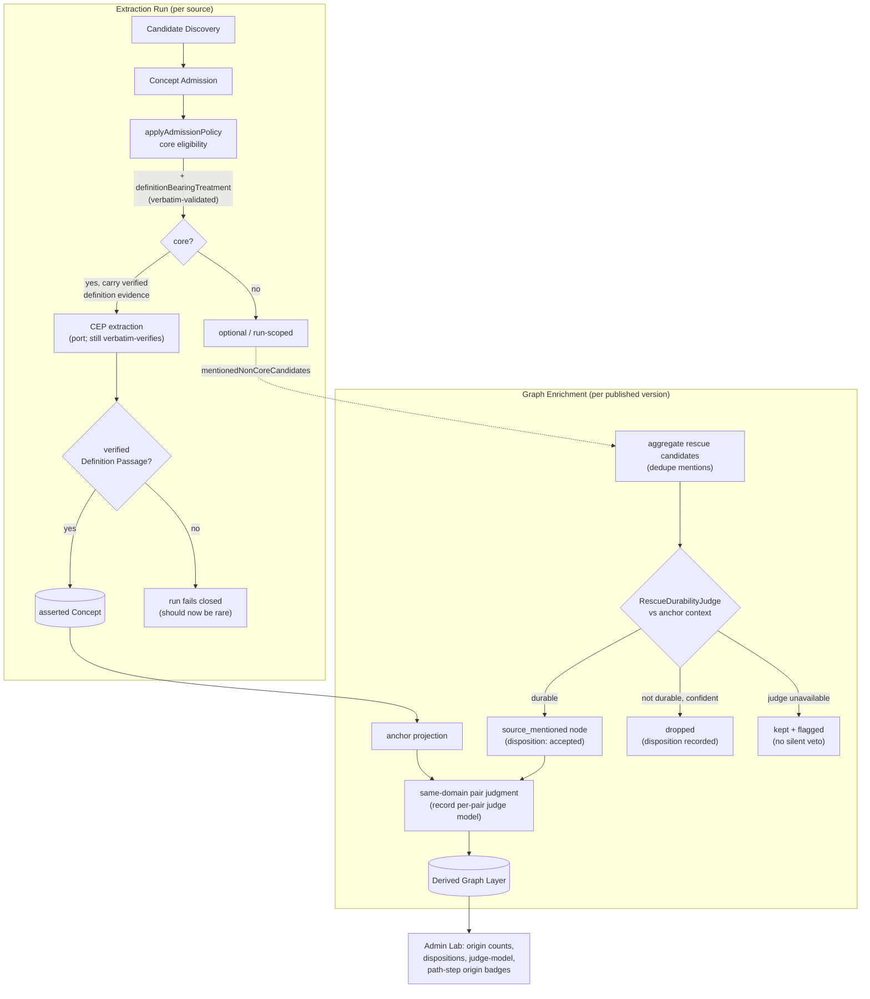

# feat: Evidence-backed node treatment contract (admission + rescue)

## Summary

The pipeline admits and rescues graph nodes **before** it has a durable, evidence-backed treatment
contract for why those nodes deserve to influence a Learner Path. Two symmetric defects, both
confirmed in the 2026-06-16 mixed-domain native batch:

1. **Core admission can select `core` without proving the same evidence will become a verified
   Definition Passage.** Fresh Rust retries failed closed on *String type* and *Heap allocation* —
   admission chose them as core on mention-like evidence the CEP stage then could not turn into a
   Definition Passage, so the whole run failed.
2. **`source_mentioned` rescue promotes too many non-core mentions into derived prerequisite nodes
   without judging whether they are durable prerequisite scaffolds.** InstructKG produced 16 rescued
   nodes for 6 anchors — method artifacts, ablation labels, and pedagogical-role labels — polluting
   the path to *Knowledge Gap Diagnosis*.

The fix is symmetric: give each promotion gate an **evidence-backed treatment contract**. Core
admission must prove definition-bearing source treatment and carry that verified evidence forward into
CEP extraction; rescue must pass a measured durability judgment against anchor context before a derived
node exists. Then expose this provenance pressure end-to-end in Admin Lab and re-run the native batch
behind explicit gates that block deferred method work until admission/rescue quality is no longer the
limiting blocker.

This plan implements TODO items 1–4 as build scope and carries TODO item 5 (keep deferred methods
deferred) forward as an enforced scope boundary (see origin: docs/brainstorms/2026-06-16-evaluation-first-roadmap-reset-requirements.md).

---

## Problem Frame

Both defects share one shape: **a promotion decision made without proving the evidence that justifies
the promotion.** The asserted layer already has three neural judges guarding it
(`applyAdmissionLabelJudge`, `applyAssertionEntailmentJudge`, plus the deterministic verbatim floor),
but neither promotion gate proves the *treatment contract* the downstream consumer depends on:

- `applyAdmissionPolicy` derives `core` eligibility from three positive criteria — standalone learning
  objective, established domain meaning, and organizing power (`packages/application/src/applyAdmissionPolicy.ts`).
  **None checks that the source defines the atom.** `executeExtractionRun` then fails the run closed
  when CEP extraction cannot produce a verified definition (`complete = definitions.length >= 1`,
  `packages/application/src/applyEvidenceProfilePolicy.ts:64`). Admission promises a contract CEP
  extraction cannot keep.
- `assembleEnrichmentNodes` rescues **every** member-run non-core mention with only normalized-label
  dedup (`packages/application/src/enrichmentNodeMinting.ts:64-88`). The derived layer inherited none
  of the asserted layer's precision discipline; the prerequisite judge then orders noise into the path.

Constraints that bound every fix:

- **AGENTS rule 16** — symbolic gates may hard-veto only to enforce a provable guarantee (verbatim
  evidence). No hardcoded lexical deny-lists for role labels, ablations, or course names. A precision
  gate over well-formed LLM output must be a **measured neural judge**, not a phrase whitelist.
- **AGENTS rule 17** — domain-neutral prompts and forced-tool-schema descriptions only. No
  fixture-specific calibration (no Rust terms, no InstructKG artifact names).
- **AGENTS rule 5/6** — LLM calls route through ports with forced named tool schemas; tool arguments
  validated and failed closed at the application boundary.
- **ADR-0023** — a generated/derived node never enters the asserted core; provenance invariants hold.

---

## Requirements

Plan-local requirements, traced to the roadmap (`docs/plans/TODO.md`) and origin brainstorm.

| ID | Requirement | Trace |
|----|-------------|-------|
| R1 | Core admission is reachable only when the source gives the atom definition-bearing treatment, proven by verbatim-validated evidence. | TODO #1; AE2 |
| R2 | The admission-verified definition-bearing evidence is carried into CEP extraction as conditioning context, without bypassing the CEP port or its independent verbatim verification. | TODO #1 |
| R3 | A measured, domain-neutral durability judge decides whether an aggregated `source_mentioned` candidate is a durable prerequisite scaffold against anchor context, before a derived node is created. | TODO #2; origin R5/R6 |
| R4 | Rescue accept/drop dispositions are recorded; the judge drops only on a confident, grounded "not durable" verdict and never silently vetoes on failure (rule 16). | TODO #2 |
| R5 | Admin Lab exposes provenance pressure end-to-end: per-domain origin counts, rescue-judge dispositions, per-pair judge-model provenance, and per-path-step origin badges. UI reads persisted artifacts only. | TODO #3; AE1; origin R3 |
| R6 | Failed runs' quality issues stay inspectable in Admin Lab and failed runs are visibly not publishable. | TODO #1 |
| R7 | Re-run the manifest-backed native batch end-to-end with real LLM calls after the fixes; publish only inspected successful runs; record disposable inspection notes under `tmp/`. | TODO #4; origin R1/R4; AE3 |
| R8 | Do not introduce embeddings, clustering, Bradley-Terry difficulty, IRT/KT, learner-state modeling, or non-LLM prerequisite signals; reconsider only if the re-run shows the remaining blocker is no longer admission/rescue quality. | TODO #5; origin R12–R15; AE5 |

---

## High-Level Technical Design

The two promotion gates and where the evidence-backed checks insert. Bold nodes are new or changed.

*Directional — the prose and per-unit fields are authoritative where they disagree.*

The symmetry: each gate now proves an evidence-backed treatment contract before promotion. Admission
proves the definition exists and hands it forward; rescue proves durability against the anchors the
node would scaffold. Everything downstream (CEP completeness, path cleanliness) follows from closing
these two contracts — not from any new scoring or embedding machinery.

---

## Key Technical Decisions

**KTD1 — Definition-bearing treatment is a fourth admission criterion, not a separate downgrade gate.**
Add `definitionBearingTreatment: AdmissionCriterionProposal` to the forced admission tool schema and
validate it at the boundary with the existing `validateCriterion` helper, then add it to the `core`
eligibility conjunction. This keeps the decision where `core` is chosen and reuses a proven pattern.
*Alternative considered:* a separate post-admission gate that downgrades `core→optional` when no
definition passage is locatable — rejected as a second mechanism doing what one criterion does, and it
would re-run a definition-finding pass admission already has the evidence for. *Rule-16/17 guard:* the
criterion is the **model's** judgment validated only for verbatim grounding (like the other three) — it
is **not** a lexical copula or "X is Y" check; a Definition Passage need not use a copula (CONTEXT.md).

**KTD2 — Carry admission's verified definition evidence into CEP extraction as a hint, not an injected
passage.** The extractor still emits its own CEP and `applyEvidenceProfilePolicy` still independently
verbatim-verifies; the carried evidence is conditioning context so the extractor does not lose the
definition under fan-out. This closes the residual "core but CEP finds no definition" failure **without
bypassing the CEP port** (rule 5) or weakening the verbatim floor (rule 16).

**KTD3 — The rescue durability judge is drop-only and fails open-with-flag.** Mirrors
`applyAdmissionLabelJudge` (downgrade-only, never resurrects). It drops a rescue candidate **only** on a
confident, source-grounded "not durable" verdict; on transport failure, invalid tool args, or an
ungrounded verdict it **keeps** the node with a `kept_judge_unavailable` disposition. Asserted-side
judges fail closed by *preserving recall*; the derived layer's goal is *precision over noise*, but the
same rule-16 principle holds — a measured gate vetoes only on a confident grounded judgment and never
silently. Kept-on-failure preserves the prior behavior and stays inspectable rather than turning the
judge into a fragile hard veto.

**KTD4 — Judge aggregated rescue candidates against anchor context, once per candidate.** The judge runs
after mention-dedup/merge (so it sees a node's full aggregated evidence) and is conditioned on the
same-domain anchors' labels and definition quotes: *is this a durable prerequisite a learner must grasp
before these anchors, or an incidental artifact?* Bounded concurrency, deterministic order. Domain-neutral
rubric naming no fixture patterns. Uses the existing cross-family independent alias (`kg-independent-judge`
/ gpt-oss-120b), so the DeepSeek generator never grades rescue durability.

**KTD5 — Persist new provenance relationally + in the JSONB trace; the UI only reads.** ADR-0019 keeps a
relational query surface for the derived layer. Add rescue dispositions and per-pair judge model to both
the immutable trace artifact and the relational projection so Admin Lab loaders read them without
recompute (rules 11/12).

**KTD6 — Localize config-hash bumps to the contract that changed.** Bump `PIPELINE_CONFIG_HASH`
(`cep-domain-neutral-prompts-v35` → next) when the admission schema changes (U1); bump the enrichment
`enrichmentConfigHash` (`cep-node-enrichment-v1` → next) when the rescue judge is added (U3). A changed
knob re-derives its layer (ADR-0017/0019).

**KTD7 — The re-run is a rule-14 validation gate, not a standing benchmark.** Real LLM calls, inspect
representative output, classify PASS/FIX_FIRST/EXPERIMENT_ONLY/BLOCKED, record disposable notes under
`tmp/` (ADR-0013, rule 11). No oracle harness is reconstructed.

---

## Scope Boundaries

**In scope**

- The two evidence-backed treatment contracts (admission definition-bearing criterion + carried
  evidence; measured rescue durability judge with recorded dispositions).
- End-to-end Admin Lab provenance exposure (origin counts, dispositions, judge-model, path-step badges)
  and failed-run inspectability.
- The post-fix native-batch re-run as a rule-14 gate, with TODO/VALIDATION update.
- In-place ADR refinements where a durable decision changes (ADR-0005 core eligibility; ADR-0019 rescue
  judgment; ADR-0023 only if the provenance contract shifts).

**Deferred (enforced boundary — TODO #5, origin R12–R15)**

- Bradley-Terry difficulty calibration, uncertainty intervals, synthetic IRT priors.
- IRT/KT and personalized learner-state modeling (learner state stays the empty mock).
- Embedding canonicalization, embedding blocking, clustering, and non-LLM prerequisite signals.
- A reversible alias/merge-assistance identity layer (cross-source identity stays deterministic).
- DOCX/PPTX fixture expansion.

**Not a goal**

- A standing oracle benchmark or model-authored gold set.
- Backward compatibility with the pre-fix admission/enrichment config (greenfield; DB reset allowed).
- Making the authoritative asserted graph learner-specific.

---

## Output / Touch Surface

No new top-level directories. Changes cluster in: `packages/domain-core` (types),
`packages/ports` (one new port + two extended), `packages/application` (two policies, two judges,
extraction + enrichment orchestration), `packages/infrastructure-litellm` (admission/extraction schemas
+ one new judge adapter), `packages/infrastructure-postgres` (single migration + enrichment store),
`apps/admin-lab` (loaders + explorer + path view), and `apps/kg-worker` (composition + config hashes).

---

## Implementation Units

### U1. Definition-bearing core-admission criterion

**Goal:** Make `core` eligibility require verbatim-validated evidence that the source gives the atom
definition-bearing treatment, closing the gap where core is selected on mention-like evidence.

**Requirements:** R1.

**Dependencies:** none.

**Files:**
- `packages/domain-core/src/index.ts` — add `definitionBearingTreatment: AdmissionCriterionProposal` to
  `AdmissionProposal`; add the validated counterpart to `RunCandidate["admission"]`.
- `packages/infrastructure-litellm/src/toolSchemas.ts`,
  `packages/infrastructure-litellm/src/extractionAdapters.ts` — add the criterion to the forced
  admission tool schema with a domain-neutral rubric `description`; validate the argument fail-closed.
- `packages/application/src/applyAdmissionPolicy.ts` — validate via `validateCriterion`; add
  `definitionBearingTreatment.passed` to the `eligible` conjunction; record boundary reason code
  `definition_bearing_treatment_missing_verified_evidence`.
- `packages/application/src/applyAdmissionPolicy.test.ts` — scenarios below.
- `apps/kg-worker/src/knowledgeGraphWorker.ts` — bump `PIPELINE_CONFIG_HASH` (KTD6).
- `docs/adr/0005-admit-atomic-concepts-before-evidence-profiles.md` — in-place refinement of the core
  eligibility contract.

**Approach:** Mirror the existing three criteria exactly. Rubric (domain-neutral): the model cites a
source passage that *establishes the concept's meaning* (definition-bearing treatment), distinct from a
bare mention; the boundary verifies that evidence verbatim and retains it on the `RunCandidate` for U2.
Core eligibility = the existing three criteria AND `definitionBearingTreatment`. No lexical/copula check.

**Patterns to follow:** `validateCriterion` and the `eligible` conjunction already in
`applyAdmissionPolicy.ts`; criterion-evidence verbatim handling in the same file.

**Test scenarios:**
- Core proposal with a passed, verbatim-verified definition-bearing criterion → stays eligible, tier `core`. Covers R1.
- Core proposal whose criterion `passed` but whose evidence does not verify verbatim → criterion fails, effective tier corrected to `optional`, boundary reason `definition_bearing_treatment_missing_verified_evidence` recorded. (Reproduces the Rust *String type* / *Heap allocation* failure mode generically.)
- Model marks the criterion `false`/omits it → not core-eligible → `optional`.
- `optional` / `reject` / `quarantine` proposals: criterion does not change their tier (gates `core` only).
- Domain-neutrality: a meaning-bearing passage with no copula ("X is Y") still passes when the model marks it passed and the quote verifies — no lexical whitelist.

**Verification:** `applyAdmissionPolicy.test.ts` passes; a core decision is unreachable without a verified definition-bearing passage.

---

### U2. Carry verified definition-bearing evidence into CEP extraction

**Goal:** Hand the admission-verified definition-bearing passage to CEP extraction as conditioning
context so the verified Definition Passage is reliably produced, eliminating the residual "core but CEP
finds no definition" failure — without bypassing the CEP port or its independent verbatim verification.

**Requirements:** R2.

**Dependencies:** U1.

**Files:**
- `packages/ports/src/index.ts` — `ConceptConditionedEvidenceProfileExtractionPort.extract()` subject
  gains `definitionBearingEvidence: BlockEvidence[]` (the admission-verified passages).
- `packages/application/src/executeExtractionRun.ts` — pass each core subject's validated
  `definitionBearingTreatment.evidence` into the `extract()` subject.
- `packages/application/src/executeExtractionRun.test.ts` — scenarios below.
- `packages/infrastructure-litellm/src/extractionAdapters.ts` — include the carried evidence in the CEP
  prompt as a grounded hint ("the source establishes this concept's meaning here: …"), domain-neutral.

**Approach:** The carried evidence is a **hint**, not an injected passage. The extractor still emits its
own definition passages and `applyEvidenceProfilePolicy` still verbatim-validates against blocks
(unchanged). `complete` semantics unchanged. No port bypass (rule 5), no floor relaxation (rule 16).

**Patterns to follow:** the existing `evidenceNeighborhood` conditioning passed into `extract()` in
`executeExtractionRun.ts`; subject shape already threaded there.

**Test scenarios:**
- `extract()` receives `definitionBearingEvidence` for each core subject (wiring assertion against a stub port).
- With a stub extractor that echoes the hinted definition, a run whose admission verified a definition-bearing passage yields a `complete` core CEP and `status: "succeeded"`. Covers R2.
- `applyEvidenceProfilePolicy` still drops a definition passage that does not verify verbatim, even when it was carried — no bypass. (Integration: stub extractor returns an altered quote.)
- Optional subjects: no `definitionBearingEvidence` required; behavior unchanged.

**Verification:** Fresh extraction over a definition-bearing source produces complete core CEPs; the verbatim floor remains the sole acceptance authority for definition text.

---

### U3. Measured rescue durability judge

**Goal:** Before a `source_mentioned` candidate becomes a derived prerequisite node, a measured neural
judge decides — against anchor context — whether it is a durable prerequisite scaffold; non-durable
mentions are dropped with a recorded disposition. No lexical deny-list (rule 16).

**Requirements:** R3, R4.

**Dependencies:** none (independent of U1/U2; logically applied after).

**Files:**
- `packages/domain-core/src/index.ts` — `RescueDurabilityJudgment` and `RescueDisposition`
  (`accepted` | `dropped` | `kept_judge_unavailable`, with rationale + grounding).
- `packages/ports/src/index.ts` — new `RescueDurabilityJudgmentPort` (mirrors `AdmissionLabelJudgmentPort`).
- `packages/application/src/applyRescueDurabilityJudge.ts` (+ `.test.ts`) — judge aggregated rescue
  candidates against same-domain anchor labels + definition quotes; drop-only; fail-open-with-flag.
- `packages/infrastructure-litellm/src/enrichmentAdapters.ts` (+ `.test.ts`) — new
  `LiteLlmRescueDurabilityJudgmentAdapter` on the `kg-independent-judge` alias, forced tool schema.
- `packages/application/src/enrichmentNodeMinting.ts` (+ `.test.ts`) — accept an optional judge port;
  judge the **aggregated** rescued nodes (post-dedupe/merge) before returning; return dispositions.
- `packages/application/src/runGraphEnrichment.ts` (+ `.test.ts`) — wire the judge port; record rescue
  dispositions in `EnrichmentRunTrace`.
- `apps/kg-worker/src/knowledgeGraphWorker.ts` — wire the adapter; bump `enrichmentConfigHash` (KTD6).
- `docs/adr/0019-graph-enrichment-derived-layer.md` — in-place note that rescue is now durability-judged.

**Approach:** Run once per aggregated rescue candidate, bounded concurrency, deterministic order,
conditioned on the same-domain anchors the node would scaffold. Domain-neutral rubric (KTD4). Drop-only
(KTD3): confident grounded "not durable" → drop + `dropped`; durable → `accepted`; failure/invalid/
ungrounded → keep + `kept_judge_unavailable`. Dispositions flow into the trace (U4 persists them).

**Patterns to follow:** `applyAdmissionLabelJudge.ts` (downgrade/drop-only neural stage, fail-safe
disposition); `LiteLlmAdmissionLabelJudgmentAdapter`; the existing dedupe/merge in
`assembleEnrichmentNodes`.

**Test scenarios:**
- Aggregated rescue candidate judged durable (confident, grounded) → node created, disposition `accepted`.
- Judged non-durable (confident, grounded) → node not created, disposition `dropped` with rationale. (Reproduces the InstructKG role/ablation/method-artifact noise generically — no fixture names in the prompt.) Covers R3.
- Judge transport failure / invalid tool args / ungrounded verdict → node kept, disposition `kept_judge_unavailable`; no silent veto. Covers R4, rule 16.
- Drop-only: the judge never creates a node that was not a rescue candidate, and never affects anchors or minted `llm_grounded` nodes.
- Two member-run mentions of one concept still collapse to a single aggregated node *before* judging (judge sees merged evidence).
- Anchor-only run (judge port omitted) → behavior unchanged (opt-in).

**Verification:** `applyRescueDurabilityJudge.test.ts` + enrichment tests pass; rescued node set is gated by durability with auditable dispositions; failure path keeps-and-flags.

---

### U4. Persist rescue dispositions and per-pair judge-model provenance

**Goal:** Persist the new derived-layer provenance the UI needs — rescue accept/drop dispositions and
which judge model ordered each pair — so Admin Lab reads it without recompute (rules 11/12).

**Requirements:** R5 (data layer).

**Dependencies:** U3.

**Files:**
- `packages/domain-core/src/index.ts` — `EnrichmentRunTrace` carries rescue dispositions (from U3);
  `PrerequisiteJudgmentTrace` gains `judgeModel`.
- `packages/application/src/runGraphEnrichment.ts` — record the judge model actually used per pair
  (cross-family vs DeepSeek) in `judgmentTraces`.
- `packages/infrastructure-postgres/src/PostgresEnrichmentStores.ts` (+ `PostgresStores.test.ts`) —
  persist rescue dispositions and per-pair/per-edge judge model.
- `packages/infrastructure-postgres/src/migrations/0000_initial_lrnki_schema.sql`,
  `packages/infrastructure-postgres/src/schema.ts` — extend the derived-layer schema (single migration,
  rule 8; hard DB reset allowed, rule 9).

**Approach:** Add `judge_model` to `inferred_prerequisite_edges` and a `rescue_dispositions` projection
table (or JSONB-backed view) keyed by `enrichment_id`, mirroring the immutable trace. Keep the
relational query surface that ADR-0019 mandates. Edit the single initial migration in place and reset
the DB rather than adding a second migration.

**Patterns to follow:** existing derived-layer persistence in `PostgresEnrichmentStores.ts`; the
trace→relational projection already there for edges and difficulties.

**Test scenarios:**
- Persist then read back rescue dispositions (`accepted`/`dropped`/`kept_judge_unavailable`) for an enrichment.
- Per-pair judge model persisted and read back: cross-family pairs show the generated-judge alias; anchor-only and anchor/`source_mentioned` pairs show the DeepSeek alias.
- Migration applies cleanly on a fresh database (schema test).
- The relational projection matches the JSONB trace artifact for the same enrichment.

**Verification:** `PostgresStores.test.ts` passes against a reset DB; loaders in U5 can query the new columns/table.

---

### U5. Admin Lab provenance exposure end-to-end

**Goal:** Surface provenance pressure: per-domain origin counts, rescue-judge dispositions, and per-pair
judge-model provenance on the enrichment detail; origin badges on each Learner Path step distinguishing
generated prerequisites from rescued mentions and anchors; failed runs visibly inspectable and
non-publishable.

**Requirements:** R5, R6.

**Dependencies:** U4 (and U3 dispositions).

**Files:**
- `apps/admin-lab/src/lib/enrichments.ts` — load per-domain origin counts (anchor / `source_mentioned`
  / `llm_grounded`), rescue dispositions, and judge-model provenance.
- `apps/admin-lab/src/lib/derivedGraph.ts` — view types for the above.
- `apps/admin-lab/src/components/DerivedGraphExplorer.tsx` (+ `.test.tsx`) — render the per-domain origin
  count summary, a dispositions panel, and per-edge judge model.
- `apps/admin-lab/src/lib/learnerPaths.ts`, `apps/admin-lab/src/components/LearnerPathExplorer.tsx` —
  per-step origin badge.
- `apps/admin-lab/src/lib/inspection.ts` (+ `inspection.test.ts`), `apps/admin-lab/src/app/admin/lab/runs/*` —
  surface failed runs' `ExtractionQualityIssue[]` and mark failed runs not publishable.

**Approach:** shadcn base-ui components (rule 15); Cytoscape rendering unchanged — these are textual/
badge summaries beside the canvas. Everything reads persisted artifacts; no UI recompute (rule 12).
The enrichment loader already returns `grounding_origin`/`node_kind`/`declared_domain` per node — origin
counts are an aggregation; dispositions and judge model come from U4.

**Patterns to follow:** existing read-only loaders in `enrichments.ts` (the `withClient` pattern);
the textual node/edge representation already built in `DerivedGraphExplorer.tsx`; badge usage in `ui/`.

**Test scenarios:**
- A mixed-domain layer renders per-domain origin counts (anchor / `source_mentioned` / `llm_grounded`). Covers R5, AE1.
- A dropped rescue candidate appears in the dispositions panel with its rationale; an accepted one is marked accepted; a `kept_judge_unavailable` one is flagged.
- A Learner Path step from an `llm_grounded` node shows a "generated" badge; from a `source_mentioned` node a "rescued" badge; from an anchor an "anchored" badge.
- Per-edge judge-model provenance is visible (generated vs DeepSeek alias).
- A failed extraction run shows its quality issues and is visibly not publishable.
- Loaders return `undefined` gracefully when `DATABASE_URL` is unset (existing contract).

**Verification:** `DerivedGraphExplorer.test.tsx` + `inspection.test.ts` pass; an operator can read why each derived node and each path step is present, and which model judged it.

---

### U6. Re-run native batch behind explicit gates (rule-14 validation)

**Goal:** Re-run the manifest-backed native batch (Rust, biology, economics, InstructKG) end-to-end with
the two fixes, inspect every surface, gate downstream method work on the result, record disposable
inspection notes, and update the roadmap.

**Requirements:** R7, R8.

**Dependencies:** U1–U5.

**Files:**
- `tmp/<dated>/…` — inspection notes per domain + consolidated findings + rule-14 evaluation note
  (gitignored, rule 10; **not** committed).
- `docs/plans/TODO.md` — update `VALIDATION` and re-derive `TODO` from the outcome (README section rules).

**Approach:** `worker:kg register-from-manifest` → `run-extraction --all` → inspect → `build-graph-version
<inspected successful runs>` → `enrich-graph-version` → `compute-learner-path` per domain → inspect
anchors, CEPs, enrichment nodes + dispositions, prerequisite DAG, and each Learner Path. Apply the
explicit gates:
- **G1 (admission):** fresh Rust retries now produce complete core CEPs, or any remaining failure is
  recorded as a blocker in `docs/plans/BLOCKERS.md` with its run id.
- **G2 (rescue):** the InstructKG path to *Knowledge Gap Diagnosis* is materially cleaner — method/role/
  ablation artifacts dropped with recorded dispositions — while biology/economics paths stay useful.
- **G3 (gate on deferred work):** do **not** proceed to embeddings, difficulty calibration, or learner
  modeling unless the re-run shows the remaining limiting blocker is no longer admission/rescue quality
  (R8, origin R12–R15, AE3/AE5).

**Execution note:** This is the rule-14 milestone — real LLM calls required; classify
PASS/FIX_FIRST/EXPERIMENT_ONLY/BLOCKED per `.agents/skills/real-use-quality-evaluation/SKILL.md` and
fix `FIX_FIRST` defects before any downstream complexity.

**Test scenarios:** `Test expectation: none — real-use validation + docs unit, not behavioral code.`
The deliverable is the inspection notes, the rule-14 classification, the gate outcomes, and the updated
TODO/VALIDATION (and BLOCKERS if G1 fails).

**Verification:** Inspection notes exist under `tmp/` for at least the four native domains; each live
TODO task afterward names a real-output defect; no deferred method is reintroduced.

---

## Risks & Dependencies

- **Overfitting risk (rules 16/17).** The two new model-facing surfaces (admission criterion `description`,
  rescue judge prompt) must stay domain-neutral. *Mitigation:* rubric language names no fixture concepts;
  U6 inspects whether the gates generalize across all four domains, not just the two they were earned from.
- **Rescue judge over-drops valid scaffolds.** A too-aggressive durability judge could strip useful
  prerequisites (e.g. biology's foundational mentions). *Mitigation:* drop-only + fail-open-with-flag
  (KTD3); recorded dispositions make over-drop visible in U5; G2 inspects path completeness, not only noise.
- **Definition-bearing criterion lowers core recall.** Tightening core could drop legitimate concepts a
  thin source mentions but barely defines. *Mitigation:* that is the correct behavior (such concepts can
  be rescued/minted in enrichment, ADR-0023); U6 confirms anchor sets stay learner-relevant.
- **Single migration churn.** U4 edits the one initial migration; requires a DB reset (rule 9) — acceptable
  in greenfield, but coordinate so no inspected run state is needed across the reset.
- **Config-hash propagation.** Both hash bumps re-derive their layers; old runs/enrichments are not
  comparable post-bump. U6 starts from fresh runs.

---

## Documentation Plan

- ADR-0005 in-place refinement (U1): core eligibility now requires definition-bearing treatment.
- ADR-0019 in-place note (U3): rescue is durability-judged before node creation.
- ADR-0023 touched only if the provenance/disposition contract changes materially.
- `docs/plans/TODO.md` rewritten from U6 outcome (README rules). No new ADRs for deferred-method
  preferences (origin R11).

---

## Open Questions (deferred to implementation)

- Exact relational shape for rescue dispositions (dedicated table vs JSONB-backed view) — decide against
  the existing `PostgresEnrichmentStores` projection style during U4.
- Whether per-pair judge model is stored on `inferred_prerequisite_edges` or a separate pair-judgment
  projection — `none`/`uncertain` pairs produce no edge yet still have a judging model; resolve when
  wiring U4 against the persisted trace.
- The precise domain-neutral wording of the rescue-durability rubric — drafted in U3, validated for
  generalization in U6; revise at the root (rubric) if a domain fails, never with fixture-specific text.

---

## Sources & Research

- `docs/brainstorms/2026-06-16-evaluation-first-roadmap-reset-requirements.md` — origin; decision rules
  R5–R8, deferred method stack R12–R15, acceptance examples AE1–AE5.
- `tmp/evaluation-first-roadmap-reset/{consolidated-findings,rust-inspection,instructkg-inspection,biology-inspection,economics-inspection,run-index}.md`
  — the inspected real-output evidence that earned each fix.
- `docs/plans/TODO.md` — roadmap items 1–5.
- ADR-0005 (admission), ADR-0007 (CEP extraction), ADR-0019 (Graph Enrichment), ADR-0023 (grounding
  origin + cross-family judge), ADR-0013 (real-source quality validation).
- Code seams: `packages/application/src/{applyAdmissionPolicy,executeExtractionRun,applyEvidenceProfilePolicy,enrichmentNodeMinting,runGraphEnrichment,applyAdmissionLabelJudge}.ts`;
  `packages/ports/src/index.ts`; `apps/admin-lab/src/lib/enrichments.ts`;
  `apps/admin-lab/src/components/DerivedGraphExplorer.tsx`; `apps/kg-worker/src/knowledgeGraphWorker.ts`.

---

## Real-use quality evaluation (rule 14)

- **Milestone:** Evidence-backed treatment contracts for core admission and `source_mentioned` rescue.
- **Fixture and source type:** manifest-backed native batch — Rust (Markdown), OpenStax biology (HTML),
  Wealth of Nations (plaintext), InstructKG (Markdown).
- **Real model calls used:** yes (U6; extraction + enrichment via LiteLLM production aliases).
- **Result:** to be classified in U6 (target: PASS for biology/economics, fixed FIX_FIRST for Rust
  admission reliability and InstructKG rescue noise).
- **Useful output observed / Defects observed / Changes after inspection / Remaining caveats / Safe to
  continue downstream:** recorded in U6 inspection notes under `tmp/`.
- This plan **is** the rule-14 follow-through for the two FIX_FIRST defects from the 2026-06-16 batch;
  downstream method work stays gated (G3) until the re-run shows admission/rescue quality is no longer
  the limiting blocker.
