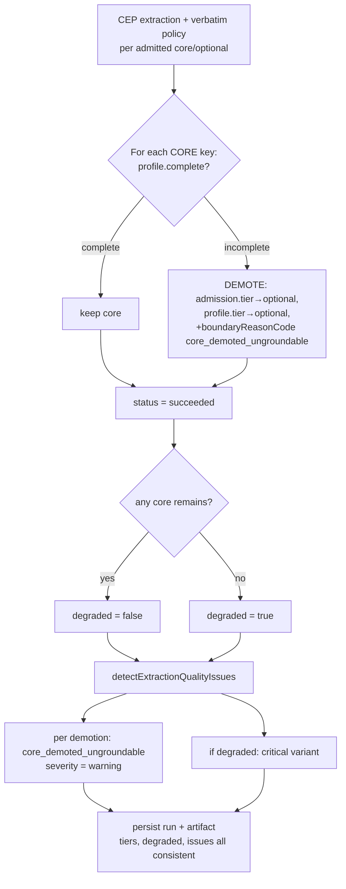

# feat: Demote ungroundable core Concepts instead of failing the run

## Summary

Today a single core Concept that cannot be grounded fails the **entire** extraction run, refusing
publication of the legitimate cores beside it (failed run `7ed1dbc1`: three cores grounded cleanly, one
ungroundable container killed the run). This plan changes the deterministic run-status policy at the
application boundary so an ungroundable core is **demoted to `optional`** and the run **succeeds** with the
remaining grounded cores. The demotion is surfaced as a loud, machine-readable quality issue (operator-
visible in Admin Lab, code-agent-assertable in the run artifact). A run that demotes its *last* core still
publishes, but is flagged `degraded` at the run level with a higher-severity (`critical`) issue and a run-
page banner.

No LLM prompt changes. The two-gate architecture (admission's definition-bearing check, CEP's verbatim
definition check) stays independent — that independence is the defense-in-depth that caught the over-
acceptance, and the brainstorm's A/B experiment empirically refuted tightening the admission prompt
(see origin: `docs/brainstorms/2026-06-17-ungroundable-core-demotion-requirements.md`, finding 4). Three
cheap correctness riders ride along: the `extraction_run.v5`→`v6` artifact-view bug, two stale domain
comments, and surfacing admission's definition evidence beside CEP completeness in Admin Lab.

---

## Problem Frame

A definition-contract split between two independent pipeline stages causes a true-negative to read as a
fatal error:

- **Admission** judged `pedagogical roles` has definition-bearing treatment (citing block-40, which
  actually defines the category's *members* — `DEFINITION`/`EXAMPLE`/`ASSUMPTION`/`NA` — not the container
  itself).
- **CEP extraction** correctly could not produce a verbatim definition of the container, so
  `complete = false`.
- The run-status rule (`executeExtractionRun.ts:159-162`) fails the whole run if *any* core CEP is
  incomplete.

The brainstorm established (via live DB inspection + an isolated admission A/B with real model calls, harness
deleted) that this is a **true negative**: there is nothing valid to ground, refusing to ground it is
correct, the category members are already split into their own `optional` candidates with valid definitions,
and the gate independence is a feature, not redundancy. The defect is therefore in the **run-status
policy**, not in either model stage. The real invariant — *a published core always has a grounded
definition* — should be enforced by **demotion**, not run-death.

This is deterministic policy work at the application boundary (rule 16: the symbolic envelope around the
model), not a prompt or judge change.

---

## Requirements

Carried from the origin requirements document (`Decisions` D1–D5, `Success criteria` 1–5).

- **R1 (D1) — Demote, don't fail.** When an admitted `core` candidate's CEP cannot be grounded (no verbatim
  subject definition survives the verbatim floor), demote it to `optional` and let the run succeed with the
  remaining grounded cores. Deterministic, at the application boundary. No prompt changes.
- **R2 (D2) — Surface demotion as a loud quality issue.** Each demotion emits a high-visibility quality
  issue, consumable two ways: operator-rendered in Admin Lab, and machine-readable in the run
  artifact/relational output so an automated check can assert on it. Demotion **never blocks publication**.
- **R3 (D2, zero-core) — Degraded run marker.** A run that demotes its *last* core still publishes but is
  flagged with a distinct run-level `degraded` sub-status (machine-readable, run-level — confirmed during
  planning), a higher-severity `critical` quality issue, and an Admin Lab run-page banner.
- **R4 (D3) — Keep gates separate.** Do not seed CEP definitions from admission evidence; do not add a
  container-vs-members clause to the admission prompt. Both explicitly out of scope.
- **R5 (D4) — Correctness riders.** Fix the `extraction_run.v5`→`v6` artifact-view filter (use
  `LIKE 'extraction_run.%'`); fix the two stale domain comments; surface admission
  `definitionBearingTreatment.evidence` beside CEP completeness in Admin Lab.
- **R6 (success criteria) — Verified by real re-run.** Re-running the InstructKG source succeeds with
  `pedagogical roles` landing `optional`, the three real cores publishing, the demotion issue visible in
  Admin Lab and present in machine-readable output, no run failed solely for one ungroundable core, v6
  candidates rendering, and no fixture-specific text in any prompt or code (AGENTS rule 17).

### Out of scope (D5, deferred)

- The prune agenda (remove `defines`/entailment path, RDF export, local storage, Docling deferral, rename
  `kg-claim-extraction`) — a separate scope-reduction decision.
- A measured downgrade-only **container judge** (`AdmissionLabelJudgmentPort` pattern) — adopt only if
  accumulated demotion data (the R2 quality issue is the watch mechanism) shows it is frequent or hides real
  recall loss, and only if a small oracle shows it raises precision without discarding valid cores.

---

## Key Technical Decisions

### KTD1 — Demotion is an in-memory tier mutation before run-aggregate assembly

The demotion mutates the in-memory aggregate (`candidate.admission.tier` and the matching
`RunEvidenceProfile.tier`) to `optional` *before* the run result is assembled and persisted. This is the
leverage point: `PostgresStores.ts:149,167` persist `admission.tier` and `profile.tier` verbatim, the
publication build (`PostgresStores.ts:246,258`) only unions CEPs where `ad.tier = 'core'`, and the Admin
Lab `core_count` counts `ad.tier = 'core'`. So one mutation propagates consistently through the relational
projection, the JSON artifact, `core_count`, and the publication path — **no separate demotion plumbing**.

The demotion is recorded on the candidate via a new boundary reason code (e.g.
`core_demoted_ungroundable`) and `modelTier` is left at `core`, preserving the audit trail that admission
selected it as core (mirrors how the admission-label judge records `proposition_label_judged` while
demoting tier).

### KTD2 — The CEP-completeness rule no longer emits `failed`

After demoting every incomplete core to `optional`, all *remaining* cores are complete by construction, so
the completeness rule always yields `succeeded`. The `"failed"` value is retained in the
`ExtractionRunResult["status"]` union and the publication refusal (`PostgresStores.ts:217`) so a genuine
pipeline/persistence error path can still mark a run non-succeeded — but the completeness policy stops
producing it. This is the minimal change; fully removing `"failed"` is a larger, separate refactor and is
not required by the origin document.

### KTD3 — `degraded` is a run-level field, persisted relationally

Per the planning decision, the zero-core degenerate case gets a distinct run-level sub-status, not only a
quality issue. `degraded: boolean` is added to `ExtractionRunResult` (so it lives in the machine-readable
artifact payload for code-agent assertions) **and** persisted as a `degraded boolean` column on
`extraction_runs` (so it is relationally queryable and drives the Admin Lab banner without re-deriving it).
`degraded` is true iff the run succeeded but has zero published cores remaining after demotion.

### KTD4 — `severity` gains a `critical` level

`ExtractionQualityIssue.severity` becomes `"info" | "warning" | "critical"`. A normal demotion (cores
remain) emits a `warning`; a last-core demotion (degraded) emits a `critical`. Admin Lab renders `critical`
with the strongest destructive styling.

### KTD5 — The demotion quality issue keys on the boundary reason code, not tier

`detectExtractionQualityIssues` runs *after* the demotion has already flipped tier to `optional`, so it can
no longer find demoted concepts by `tier === "core"`. It detects them by the `core_demoted_ungroundable`
boundary reason code on the candidate. This also cleanly distinguishes a genuinely core-poor run (admission
found no cores; existing `possible_missing_core_concept`) from a degraded run (cores were demoted) — the two
must not be conflated in the zero-core case.

---

## High-Level Technical Design

Run-status policy transition (the heart of the change):

Old policy (`status = fail if any core incomplete`) is replaced by the demote-then-succeed path. The dashed
contract — admission's definition-bearing evidence vs. CEP's verbatim definition — is left untouched and
remains the independent cross-check (R4).

---

## Implementation Units

### U1. Domain-core type and contract updates

**Goal:** Make the type surface express demotion, degradation, and the new severity, and fix the two stale
contract comments (R5).

**Requirements:** R1, R3, R5 (comment riders), KTD2, KTD3, KTD4.

**Dependencies:** none (foundation for U2–U5).

**Files:**
- `packages/domain-core/src/index.ts` (modify)

**Approach:**
- Extend `ExtractionQualityIssue.severity` to `"info" | "warning" | "critical"` (KTD4).
- Add `degraded: boolean` to `ExtractionRunResult` (KTD3); document it as "succeeded with zero published
  cores after demotion."
- Fix the stale comment at line ~249 (`RunEvidenceProfile` doc) and lines ~379-380 (`ExtractionRunResult`
  doc): the completeness rule is **core-only**, and under the new policy "incomplete core ⇒ demote, not
  fail" (R5). Remove the "(core|optional)" wording and the "makes the Extraction Run unsuccessful" framing.
- No new reason-code enum is required if `boundaryReasonCodes` stays `string[]`; confirm and reuse it for
  `core_demoted_ungroundable`.

**Patterns to follow:** existing union/severity typing in the same file; the audit-trail pattern where
`modelTier` diverges from `tier` (admission-label judge, `proposition_label_judged`).

**Test scenarios:** `Test expectation: none — pure type and comment changes with no behavioral logic;
behavior is exercised by U2/U3 tests.`

**Verification:** `tsc` across the workspace compiles with the widened severity and new field; no consumer
breaks on the `severity` union (Admin Lab handled in U5).

---

### U2. Demote-don't-fail run-status policy in the orchestrator

**Goal:** Replace the fail-the-run completeness rule with demotion, and compute `degraded` (R1, R3, KTD1,
KTD2).

**Requirements:** R1, R3; KTD1, KTD2, KTD5 (sets the boundary reason code U3 keys on).

**Dependencies:** U1.

**Files:**
- `packages/application/src/executeExtractionRun.ts` (modify, lines ~156-177)
- `packages/application/src/executeExtractionRun.test.ts` (modify/extend)

**Approach:**
- After `evidenceProfiles` is assembled, for each core key whose profile is missing or `!complete`:
  mutate that candidate's `admission.tier` to `optional`, push `core_demoted_ungroundable` onto its
  `admission.boundaryReasonCodes`, and set the matching `RunEvidenceProfile.tier` to `optional`. Leave
  `modelTier` and `coreSelected` intact as the audit trail (KTD1).
- Recompute remaining cores after demotion. `status = "succeeded"` from the completeness rule
  unconditionally (KTD2) — every surviving core is complete by construction.
- `degraded = (remaining core count === 0)` (KTD3).
- Set `runResult.degraded` before calling `detectExtractionQualityIssues(runResult)` so the detector sees
  demoted tiers and the degraded flag.
- Do **not** re-run `applyEvidenceProfilePolicy` for demoted concepts — the policy is tier-agnostic in
  behavior (it only stamps `tier`), and the demoted concept's incomplete profile is valid run-scoped
  optional evidence as-is.

**Patterns to follow:** the existing in-place admission mutation downstream of `applyAdmissionLabelJudge`;
the `coreKeys`/`evidenceProfiles.some(...)` derivation already at lines 159-162.

**Test scenarios** (canned ports as *input fixtures* exercising the deterministic envelope, never asserting
model judgment — ADR-0013 / rule 11):
- Happy path: two cores, both CEP extractors return verifiable definitions → no demotion, both stay `core`,
  `status === "succeeded"`, `degraded === false`, no `core_demoted_ungroundable` codes. *Covers R6.*
- Single ungroundable core: one core's extractor returns no verifiable definition, the other grounds → the
  ungroundable one is demoted (`admission.tier === "optional"`, profile `tier === "optional"`,
  `boundaryReasonCodes` includes `core_demoted_ungroundable`, `modelTier === "core"` preserved), the other
  stays `core`, `status === "succeeded"`, `degraded === false`. *Covers R1.*
- Last core demoted (degenerate): the only core is ungroundable → demoted to `optional`,
  `status === "succeeded"`, `degraded === true`. *Covers R3.*
- Optional candidate with no definition is untouched: an `optional` candidate with an incomplete profile is
  not affected by the policy and does not trigger `degraded`. (Edge: confirms the rule is core-only.)
- Extractor returns nothing for a core (empty profile / no row): treated as incomplete → demoted, not a
  crash. (Error path.)

**Verification:** the orchestration tests above pass; a run that previously produced `status: "failed"` for
a single ungroundable core now produces `succeeded` with the concept at `optional`.

---

### U3. Emit demotion quality issues at the right severity

**Goal:** Replace the `status === "failed"` issue branch with demotion-keyed issues, at `warning` for a
normal demotion and `critical` for a degraded run (R2, R3, KTD5).

**Requirements:** R2, R3; KTD4, KTD5.

**Dependencies:** U1, U2.

**Files:**
- `packages/application/src/detectExtractionQualityIssues.ts` (modify)
- `packages/application/src/detectExtractionQualityIssues.test.ts` (modify/extend)

**Approach:**
- Remove the `if (run.status === "failed") { ... insufficient_source_treatment ... }` block (line ~18-33):
  runs no longer fail for this reason.
- Add a pass over `run.candidates` detecting `boundaryReasonCodes.includes("core_demoted_ungroundable")`.
  For each, emit an issue (`stage: "evidence_profile"`, `issueType: "core_demoted_ungroundable"`, the
  concept label/key, and the candidate's evidence quotes via the existing `candidateEvidenceQuotes` helper).
- Severity: `run.degraded ? "critical" : "warning"`. (When degraded, the single last-core demotion is the
  `critical` issue; if multiple demotions occur in a degraded run, they all read `critical`.)
- Rationale text must stay domain-neutral (rule 17): describe the policy ("a core Concept admitted with
  definition-bearing treatment could not be grounded with a verbatim Definition Passage, so it was demoted
  to optional and the run succeeded with the remaining cores"), naming no fixture concept.
- Guard the existing `possible_missing_core_concept` (zero core candidates) so it does **not** double-fire
  as the explanation when the zero-core state was *caused by demotion* (KTD5) — prefer the
  `core_demoted_ungroundable` / `critical` signal in that case. The simplest split: only emit
  `possible_missing_core_concept` when no candidate carries the demotion code.

**Patterns to follow:** the existing `proposition_label_judged` boundary-reason-code detection loop in the
same file (lines ~35-46) — same shape, different code and severity.

**Test scenarios** (canned `ExtractionRunResult` fixtures — deterministic transform under assertion):
- A run with one demoted core (`core_demoted_ungroundable` present, `degraded === false`) → exactly one
  `core_demoted_ungroundable` issue at `warning`, carrying the concept label and evidence quotes. *Covers
  R2.*
- A degraded run (`degraded === true`, one demoted core, zero cores remain) → the `core_demoted_ungroundable`
  issue is `critical`, and `possible_missing_core_concept` does **not** also fire. *Covers R3.*
- A genuinely core-poor run (zero core candidates, no demotion code) → `possible_missing_core_concept` still
  fires; no `core_demoted_ungroundable` issue. (Edge: the two zero-core causes stay distinguishable.)
- A clean run (no demotions) → no `core_demoted_ungroundable` issue; the generic domain-neutral prompt issue
  and any pre-existing issues are unaffected.

**Verification:** detector tests pass; the old `insufficient_source_treatment` failed-branch test is gone or
rewritten; severities match the degraded/non-degraded split.

---

### U4. Persist `degraded` and fix the artifact projection views

**Goal:** Round-trip `degraded` through the relational store and fix the `v5`→`v6` view bug (R3 persistence,
R5 view rider). Single migration only (rule 8); hard-reset the DB after (rule 9).

**Requirements:** R3 (relational persistence), R5 (view fix).

**Dependencies:** U1.

**Files:**
- `packages/infrastructure-postgres/src/migrations/0000_initial_lrnki_schema.sql` (modify)
- `packages/infrastructure-postgres/src/PostgresStores.ts` (modify, insert at line ~125; run-header read at
  line ~211)

**Approach:**
- Add `degraded boolean NOT NULL DEFAULT false` to the `extraction_runs` table (line ~42-52). Keep the
  single initial migration (rule 8); reset/re-init the dev DB rather than adding a second migration (rule 9).
- Change both extraction_run artifact views (lines ~294 and ~314) from
  `WHERE a.artifact_type = 'extraction_run.v5'` to `WHERE a.artifact_type LIKE 'extraction_run.%'` so the
  next artifact bump cannot reintroduce the bug (R5). The app writes `extraction_run.v6`
  (`executeExtractionRun.ts:25`), which is why `artifact_run_candidates` currently projects no rows for
  live runs.
- Persist `runResult.degraded` in the `INSERT INTO extraction_runs (...)` statement (line ~125) and select
  it in the run-header query (line ~211) so it is available to the inspection layer.

**Patterns to follow:** the existing column list and `JSON_TABLE` view definitions in the same migration; the
existing `LIKE 'extraction_run.%'` already used by the quality-issues query in `inspection.ts:184`.

**Test scenarios:** `Test expectation: none for the SQL transform itself — JSON_TABLE projection and the
column round-trip are verified against a live Postgres in U6 (the re-run renders v6 candidates and the
degraded flag), per rule 11 (no test stands in for real-DB behavior).` If a fast relational round-trip test
already exists for `PostgresStores`, extend it to assert the `degraded` column persists and reads back.

**Verification:** after DB reset, a v6 run's candidates project through `artifact_run_candidates`; the
`extraction_runs.degraded` column is written and read; the publication build still refuses non-succeeded
runs unchanged.

---

### U5. Admin Lab: degraded banner, demotion issues, and definition-evidence context

**Goal:** Make the demotion and degradation legible to an operator at a glance (R2 operator path, R3 banner,
R5 definition-evidence rider), and let v6 candidates render (R5/R6, enabled by U4).

**Requirements:** R2, R3, R5, R6 (candidate rendering).

**Dependencies:** U1, U4.

**Files:**
- `apps/admin-lab/src/app/admin/lab/runs/[runId]/page.tsx` (modify)
- `apps/admin-lab/src/lib/inspection.ts` (modify — add `degraded` to `RunSummary` + the header read)

**Approach:**
- `inspection.ts`: add `degraded: boolean` to `RunSummary`, select `er.degraded` in `RUN_SUMMARY_COLUMNS` /
  the header query, and map it in `toRunSummary`.
- Run page header: when `run.degraded`, render a distinct banner/badge near the status (e.g. "Degraded — 0
  published cores") using shadcn base-ui components (rule 15), visually separate from the per-issue table.
- Severity rendering: handle `"critical"` in the quality-issues table (line ~178) with the strongest
  destructive styling, distinct from `warning`.
- The existing "Failure cause" card (line ~116, gated on `run.status !== "succeeded"`) will no longer show
  for demotion runs (they now succeed). Re-point its intent: keep a card that, for demoted concepts, shows
  *which* cores were demoted and *why*, surfacing admission's `definitionBearingTreatment.evidence` beside
  the CEP's (absent) definition so the true-negative-vs-false-negative distinction is a glance, not an
  investigation (R5). This evidence is already projected through the candidate query once U4 fixes the view.
- Now that U4 fixes the view, the `candidates` array is populated for v6 runs; the page's workaround comment
  (lines ~71-74 about the empty candidate list) can be simplified, but the profile-derived blocking-count
  logic may stay as harmless defense.

**Patterns to follow:** existing `Card`/`Badge`/`Table` usage and `tierVariant`/`CriterionBadge` helpers in
the same file; the existing quality-issues table rendering.

**Test scenarios:** `Test expectation: none — server-component rendering and SQL-backed read; visual
correctness is verified by rule-14 real-use inspection in U6.` (No fabricated-model-output assertion; the
rendering is a deterministic view of stored data.)

**Verification:** the re-run page (U6) shows the demoted concept with its admission definition evidence beside
the empty CEP definition, the quality issue at the correct severity, the degraded banner only when zero cores
remain, and the full v6 candidate table.

---

### U6. Real-use quality evaluation: re-run InstructKG and confirm success criteria

**Goal:** Apply the real-use-quality-evaluation skill (rule 14) on the InstructKG source that produced failed
run `7ed1dbc1`, confirming all origin success criteria with real model calls (R6).

**Requirements:** R6 (all success criteria), R2 (machine-readable assertion), rules 13–14.

**Dependencies:** U1–U5.

**Files:**
- `tmp/` (disposable validation outputs only — rule 10; no standing harness, rule 11/ADR-0013)
- `docs/plans/TODO.md` (record the VALIDATION outcome per `docs/plans/README.md`)

**Approach:**
- Fire a real extraction run over the InstructKG source (declared domain "educational technology") via the
  worker path (`apps/kg-worker/src/knowledgeGraphWorker.ts` → `executeExtractionRun`), with DeepSeek V4
  Flash, thinking disabled (rule 5).
- Inspect the produced artifacts as an expert user (skill step 3): admission tiers, the demoted
  `pedagogical roles` candidate, the three real cores, CEP completeness, the demotion quality issue, the
  run-level `degraded` flag, and the Admin Lab rendering.
- Assert the machine-readable path (R2 / success criterion 2): read the run artifact payload
  (`qualityIssues` + `degraded`) and confirm a code-agent check could key on the `core_demoted_ungroundable`
  issue and the run-level flag — this is asserting the deterministic transform of a real run, not model
  judgment (rule 11).
- Classify the milestone `PASS` / `FIX_FIRST` / `EXPERIMENT_ONLY` / `BLOCKED` and record the evaluation note
  (skill's required template), including the N=1 caveat (the demotion-frequency watch lives in the R2 issue).

**Patterns to follow:** the existing rule-14 evaluation notes referenced from `docs/plans/TODO.md`
VALIDATION; the worker invocation already used for prior real runs.

**Execution note:** real model calls required; this unit is verification, not new behavior — run it only
after U1–U5 land.

**Test scenarios:** `Test expectation: none — this is real-source inspection (rule 14), not an automated
test. A green suite is never quality evidence (rule 11). The only "assertion" is the operator/code-agent
read of the real run output described above.`

**Verification (success criteria, origin §Success criteria):**
1. Re-running InstructKG **succeeds**: `pedagogical roles` lands `optional`, the three real cores publish,
   the run is publishable.
2. The demotion produces a quality issue visible in Admin Lab **and** present in machine-readable run output.
3. No run is `failed` solely because one core candidate is ungroundable.
4. v6 runs render their candidates in Admin Lab (v5/v6 view bug fixed).
5. No fixture-specific text in any prompt or code (AGENTS rule 17) — grep the diff for `pedagogical`,
   `INSTRUCTKG`, and other fixture tokens before declaring done.

---

## Risks & Dependencies

- **N=1 evidence (origin open question).** Only one failed run exists; demotion frequency on other sources is
  unknown. Mitigation: the R2 quality issue is the watch mechanism — if demotions become common or hide real
  recall loss, revisit D5's measured container judge. Do **not** build the judge now.
- **Core-set instability under prompt perturbation (origin open question).** Admission output is sensitive to
  prompt edits (observed in the A/B experiment). This plan changes **no prompts**, so it does not perturb
  the stage; flagged for awareness only.
- **Degraded semantics drift.** `degraded` is defined narrowly as "succeeded with zero published cores after
  demotion." Keep the definition single-sourced in U2's computation; do not let Admin Lab or the detector
  re-derive it differently (KTD3/KTD5).
- **`status` union narrowing temptation.** Resist removing `"failed"` from the type (KTD2) — publication
  refusal and genuine error paths still rely on it; full removal is a separate refactor.
- **DB reset required (rule 9).** The migration column change requires a dev-DB reset, not a second
  migration (rule 8). No production data exists (app unreleased).

---

## System-Wide Impact

- **Affected: extraction orchestration** (`executeExtractionRun`) — the run-status contract changes from
  "fail on incomplete core" to "demote on incomplete core, always succeed on completeness."
- **Affected: publication** (`PostgresStores` build) — unchanged code, changed behavior: demoted concepts
  are simply no longer unioned as cores; the failed-run refusal still stands for true error states.
- **Affected: operators** (Admin Lab) — runs that used to be dead-ends are now publishable with a visible
  quality signal; the degraded banner is a new run-level affordance.
- **Affected: downstream code agents** — a new machine-readable signal (`core_demoted_ungroundable` issue +
  run-level `degraded`) to assert on during live test runs.
- **Not affected:** discovery, admission, CEP extraction, the entailment judge, the admission-label judge —
  no prompt or judge changes (R4). The two-gate independence is deliberately preserved.

---

## Sources & Research

- Origin requirements: `docs/brainstorms/2026-06-17-ungroundable-core-demotion-requirements.md` (decisions
  D1–D5, success criteria, the live-DB + A/B findings; experiment harness deleted per its own note).
- Grounding reads (this plan): `packages/application/src/executeExtractionRun.ts` (status logic
  156-177; v6 artifact type at 25), `packages/application/src/detectExtractionQualityIssues.ts`,
  `packages/domain-core/src/index.ts` (types + stale comments 249/379-380),
  `packages/infrastructure-postgres/src/migrations/0000_initial_lrnki_schema.sql` (views 294/314,
  `extraction_runs` 42-52), `packages/infrastructure-postgres/src/PostgresStores.ts` (persist 125/149/167,
  refusal 217, build 246/258), `apps/admin-lab/src/lib/inspection.ts`,
  `apps/admin-lab/src/app/admin/lab/runs/[runId]/page.tsx`.
- Governing rules: AGENTS rules 5, 6, 8, 9, 10, 11, 14, 16, 17; ADR-0007 (CEP-in-context), ADR-0013
  (real-source quality verification), ADR-0017 (extraction-run vs graph-build split).
