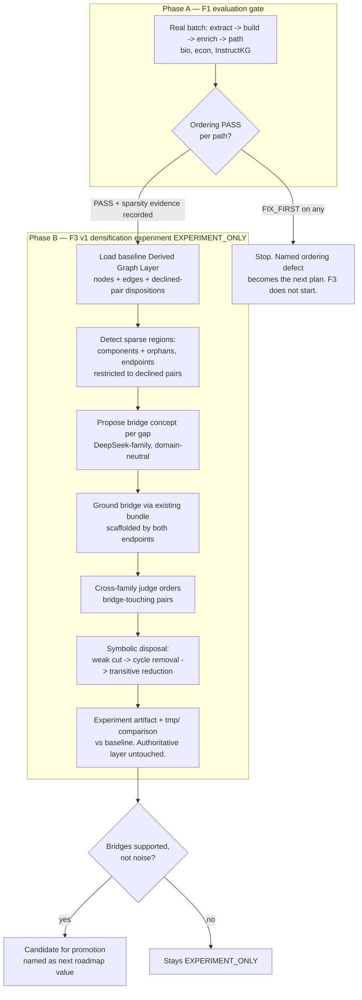

# feat: Enrichment-ordering evaluation gate and F3 v1 graph densification

## Summary

Run a real mixed-domain evaluation of Graph Enrichment prerequisite ordering (F1) over biology,
economics, and InstructKG, with an explicit `PASS` / `FIX_FIRST` verdict per Learner Path. F1 is a hard
gate: only if ordering passes do we build F3 v1 — an `EXPERIMENT_ONLY` densification pass that reads
sparse and disconnected regions of a baseline Derived Graph Layer and proposes `llm_grounded` bridge
concepts over those gaps, carried on the existing `inferred-prerequisite-of` predicate. If F1 fails, the
named ordering defect becomes the next plan and F3 does not start (see origin: `docs/brainstorms/2026-06-17-enrichment-evaluation-and-graph-densification-requirements.md`).

---

## Problem Frame

Learner Path quality has only ever been inspected as a side effect of other milestones, never as its own
gated step. Two product gaps are suspected: prerequisite ordering inside the derived layer may be wrong
(F1), and the derived graph may be too sparse — concepts a learner must bridge are mentioned or implied
but never connected, leaving paths thin or disconnected (F3). Densifying a graph whose ordering is
already wrong only amplifies noise, so the ordering evaluation must come first and gate the densification
work.

F3 looks at first like it needs a new layer, explicit source marking, and a reversal of the embeddings
removal. It does not. `runGraphEnrichment.ts` already mints `llm_grounded` nodes, stores them in the
Derived Graph Layer separately from the asserted graph, tags them by Grounding Origin, orders any pair
touching a generated node with the cross-family judge, and exempts generated grounding from the verbatim
floor with a recorded disposition. The real change F3 introduces is narrow: a new minting **reason** —
densification — that proposes bridges over topological gaps, instead of the existing anchor-driven
assumed-prerequisite reason.

The architectural subtlety is timing. The existing minting runs *before* pair judgment (Step 0 of
`runGraphEnrichment`). Densification must read the *result* of pair judgment — which same-domain pairs
the judge declined, and which nodes sit in disconnected components — so F3 is logically a **second pass**
over a baseline Derived Graph Layer, kept outside the authoritative pipeline and compared against it.

---

## Requirements

Carried from the origin requirements document (R1–R13, AE1–AE4).

**F1 enrichment-ordering evaluation (the gate)**

- R1. Run real Extraction Runs, Graph-Version Build, Enrichment Run, and Learner Path generation over
  biology, economics, and InstructKG before starting F3 (three non-Rust native fixtures; no Docling
  dependency).
- R2. For each fixture, judge the generated Learner Path `PASS` or `FIX_FIRST` on prerequisite-ordering
  correctness: no concept appears before something it genuinely requires.
- R3. Confirm each ordering step traces to CEP evidence or a grounded derived node.
- R4. Record, as the evidence that earns F3, where the derived graph is too sparse or disconnected —
  concepts a learner would need to bridge that no `inferred-prerequisite-of` edge connects.
- R5. Record run-specific findings under `tmp/`, never as a standing benchmark or oracle harness.

**F3 v1 densification experiment (conditional on F1 `PASS`)**

- R6. Add a densification proposal trigger that proposes bridge concepts and edges over sparse or
  disconnected regions of one Enrichment Run's derived graph.
- R7. Carry every F3 connection on the existing `inferred-prerequisite-of` predicate; introduce no new
  edge predicate in v1.
- R8. Tag every F3-created node `llm_grounded` and store it as an Enrichment Node in the Derived Graph
  Layer space; it never enters the asserted graph.
- R9. Generate each F3 node's grounding through the existing two-stage minting and generated-grounding
  bundle contract; route any pair touching a generated node through the cross-family generated-node judge.
- R10. Derive sparse regions without embeddings in v1, using the same-domain pair judgments the
  exhaustive baseline already declined.
- R11. Keep F3 v1 outside the authoritative pipeline and measure its output against the current derived
  layer before considering promotion.

**Scope discipline**

- R12. Keep prompts and tool-schema descriptions domain-neutral; do not tune from fixture-specific
  expected answers (AGENTS rule 17).
- R13. Amend ADR-0019 to admit the densification minting reason; do not supersede ADR-0012 or change
  ADR-0016.

---

## High-Level Technical Design

The F1 gate decides whether Phase B runs at all. F3, when reached, is a second pass that consumes a
baseline Enrichment Run rather than altering the authoritative one.

---

## Key Technical Decisions

- KTD1 — F1 gates F3 with a hard stop. Phase B units do not start until the F1 verdict is `PASS` on
  every inspected path. A `FIX_FIRST` on any fixture ends this plan at U2; the named ordering defect
  becomes a separate plan (AE2). The plan must not present F3 as inevitable.

- KTD2 — F3 is a second pass over a baseline Derived Graph Layer, not a change to `runGraphEnrichment`
  Step 0. Densification needs the pair-judgment result — declined pairs and disconnected components —
  which exists only after the baseline pass. Building it into the existing pre-judgment minting step
  would have no topology to read.

- KTD3 — Topology-primary sparse-region detection with a declined-pair endpoint restriction. Disconnected
  weakly-connected components and orphan anchors (no incoming or outgoing certain edge) are the durable,
  low-complexity core, computed purely from the baseline edge set. Candidate bridge *endpoints* are then
  restricted to same-domain pairs the judge already declined (`none`), crossing a component boundary or
  touching an orphan (R10). Topology decides which regions are sparse; declined pairs decide which
  endpoints to bridge. No embeddings (ADR-0012 stands).

- KTD4 — F3 output is an experiment artifact compared in `tmp/`, never written to the authoritative
  enrichment/derived-graph relational surface (R11). This keeps `EXPERIMENT_ONLY` real, keeps the
  Learner Path projection from consuming unmeasured bridges, and makes the asserted graph trivially
  untouched (AE3).

- KTD5 — Reuse the generated-grounding bundle, the cross-family generated-node judge, and the pure DAG
  disposal helpers unchanged (R9). The only genuinely new code is sparse-region detection (U4) and the
  densification proposal trigger (U5); grounding, judging, and disposal are existing seams.

- KTD6 — A new `mintingReason` facet (`assumed_prerequisite` | `densification`) distinguishes F3 bridge
  nodes from the existing anchor-driven minted nodes on inspection (R13). Existing minted nodes default
  to `assumed_prerequisite`. ADR-0019 is amended to admit the densification reason; ADR-0012 and ADR-0016
  are untouched.

- KTD7 — Measurement is a deterministic connectivity delta plus rule-14 manual judgment. The delta
  (disconnected-component count, orphan count, target reachability before/after) is descriptive context
  in `tmp/`; the actual gate is an expert support/noise inspection of each bridge beside the non-F3
  baseline (AE4). No numeric threshold and no standing harness (R5, R11, ADR-0013) — numbers show that
  connectivity changed, not that a bridge is correct.

---

## Implementation Units

Phase A (U1–U2) is the gate and always runs. Phase B (U3–U8) runs only on an F1 `PASS`.

### U1. Run the F1 real-use batch

- Goal: produce fresh real `extract → build → enrich → compute-learner-path` output over biology,
  economics, and InstructKG so ordering and sparsity can be inspected (R1).
- Requirements: R1.
- Dependencies: none.
- Files: `tmp/2026-06-17-f1-enrichment-eval/` (console transcripts, run/version/enrichment ids, path
  dumps). No source changes.
- Approach: reset the local PG18 database (AGENTS rule 9), `register-from-manifest`, `run-extraction` for
  the three non-Rust sources, `build-graph-version` from the succeeded runs, `enrich-graph-version`,
  then `compute-learner-path` for one representative target Concept per domain. Use the existing
  `apps/kg-worker/src/knowledgeGraphWorker.ts` commands unchanged. If InstructKG fails to publish,
  proceed with biology + economics (still satisfies R1's two-fixture floor) and record the InstructKG
  failure as a caveat.
- Test scenarios: none — real-use evaluation milestone (AGENTS rule 14). The deterministic envelope is
  already covered by existing application tests.
- Verification: at least two non-Rust Learner Paths generated with captured enrichment ids and step
  lists; transcripts saved under `tmp/`.

### U2. Author the F1 inspection notes and gate verdict

- Goal: a domain-literate read of each path producing an explicit `PASS` / `FIX_FIRST` verdict, the
  evidence trace, and the sparsity evidence that earns F3 (R2, R3, R4, R5).
- Requirements: R2, R3, R4, R5.
- Dependencies: U1.
- Files: `tmp/2026-06-17-f1-enrichment-eval/rule-14-evaluation.md`.
- Approach: for each path, judge prerequisite-ordering correctness (no concept before something it
  requires); confirm every ordering step traces to a CEP passage or a grounded derived node; and record
  the specific concepts the source implies but no `inferred-prerequisite-of` edge connects — the concrete
  sparsity evidence for F3 (AE1). State the gate decision plainly.
- Test scenarios: none — evaluation milestone.
- Verification: per-path verdict recorded; if any path is `FIX_FIRST`, the note names the ordering defect
  and states that Phase B does not start (AE2), and this plan ends here.

### U3. Amend ADR-0019 and add the minting-reason facet

- Goal: admit the densification minting reason in the architecture record and make F3 nodes
  distinguishable from anchor-driven minted nodes (R13).
- Requirements: R13.
- Dependencies: U2 (`PASS`).
- Files: `docs/adr/0019-graph-enrichment-derived-layer.md` (clarifying amendment, not a supersession);
  `packages/domain-core/src/index.ts` (`mintingReason` on the `llm_grounded` node and the enrichment
  trace); `packages/domain-core/src/groundingModel.test.ts`.
- Approach: add `mintingReason: "assumed_prerequisite" | "densification"` to the `llm_grounded`
  enrichment node type; existing minted nodes default to `assumed_prerequisite`. Leave `role`,
  `groundingOrigin`, and the `layerOf` invariant unchanged (ADR-0023). The amendment states that
  densification is a second minting reason on the same predicate and contract; it explicitly does not
  supersede ADR-0012 or change ADR-0016.
- Patterns to follow: the discriminated-union node types and `layerOf` authority in
  `packages/domain-core/src/index.ts` / `groundingModel.test.ts`.
- Test scenarios: an `llm_grounded` node carries a `mintingReason`; `layerOf` still maps
  `llm_grounded → derived`; the `llm_grounded + asserted` pairing remains unrepresentable; a
  `document_anchored` node is unaffected. Covers R13.

### U4. Sparse-region detection and connectivity metrics (pure)

- Goal: from a baseline `DerivedGraphLayer` (nodes + certain edges) and the run's declined-pair
  dispositions, compute sparse regions and the bounded candidate bridge endpoints, plus the connectivity
  metrics used for the F3 measurement (R6, R10, KTD3, KTD7).
- Requirements: R6, R10.
- Dependencies: U2 (`PASS`).
- Files: `packages/application/src/sparseRegionDetection.ts`, `packages/application/src/sparseRegionDetection.test.ts`.
- Approach: pure, deterministic functions mirroring `packages/application/src/prerequisiteDag.ts` (sort
  inputs; same edge/disposition set always yields the same output). Compute weakly-connected components
  over certain edges, orphan nodes (degree 0), and candidate gaps = same-domain declined (`none`) pairs
  whose endpoints lie in different components or include an orphan. Expose a sibling
  `connectivityMetrics(layer)` returning component count, orphan count, and reachability of a target.
  Bound the candidate gaps deterministically (reuse a bounds shape analogous to
  `DEFAULT_MINTING_BOUNDS`).
- Patterns to follow: `prerequisiteDag.ts` (`sortEdges`, adjacency maps, deterministic traversal).
- Test scenarios: two disconnected components with a declined cross-component pair → one candidate gap;
  an orphan anchor → a candidate; a declined pair *inside* one connected component → not a candidate; a
  graph with no declined cross-component pairs → no candidates; deterministic ordering across input
  permutations; `connectivityMetrics` counts components/orphans correctly and reflects a target's
  reachable ancestor set. Covers R6, R10.

### U5. Densification bridge-proposal port and adapter

- Goal: a new forced-tool LLM trigger that proposes one bridge concept connecting a sparse-region gap's
  two endpoints (R6), with a domain-neutral prompt and schema (R12).
- Requirements: R6, R12.
- Dependencies: U3.
- Files: `packages/ports/src/index.ts` (new `BridgeConceptProposalPort`);
  `packages/infrastructure-litellm/src/densificationProposalAdapters.ts`;
  `packages/infrastructure-litellm/src/toolSchemas.ts` (new forced-tool schema + validator);
  `packages/infrastructure-litellm/src/densificationProposalAdapters.test.ts`.
- Approach: model the port on `MissingPrerequisiteProposalPort` but trigger on a *gap* (two endpoint
  concepts with their labels and grounding/CEP context) rather than a single anchor. Return
  `proposedLabel` + `rationale`; leave edge direction to the cross-family judge in U6. Generator stays
  DeepSeek-family (AGENTS rule 5), which is why ordering must be cross-family. Validate tool arguments and
  fail closed (AGENTS rule 6). Prompt and the model-facing schema `description` express only
  domain-neutral rubric language — no fixture-derived exemplars (AGENTS rule 17).
- Patterns to follow: `packages/infrastructure-litellm/src/missingPrerequisiteProposalAdapters.ts` and
  its `toolSchemas` entry.
- Test scenarios: a forced-tool response validates and maps to `{ proposedLabel, rationale }`; an
  over-cap response is truncated deterministically; an empty proposal list is allowed; a malformed
  argument fails closed. The canned model response is an input fixture exercising the deterministic
  arg-validation envelope only — no assertion on the model's judgment content (AGENTS rule 11). Covers
  R6, R12.

### U6. Densification experiment orchestration

- Goal: the `EXPERIMENT_ONLY` second pass that turns a baseline Derived Graph Layer into a densified
  variant plus a baseline comparison, reusing existing grounding, judging, and disposal (R6–R11, KTD2,
  KTD4, KTD5).
- Requirements: R6, R7, R8, R9, R10, R11.
- Dependencies: U3, U4, U5.
- Files: `packages/application/src/runDensificationExperiment.ts`,
  `packages/application/src/runDensificationExperiment.test.ts`.
- Approach: input is an existing Enrichment Run's `DerivedGraphLayer` (the baseline). Detect sparse
  regions (U4) → propose a bridge per gap (U5) → ground each bridge via the existing
  `GroundingGenerationPort`, scaffolded by *both* endpoints' labels and definition/grounding text →
  re-apply the verbatim floor (`applyVerbatimFloorByGrounding`, the `llm_grounded` exemption is recorded,
  R9) → order each bridge-touching pair with the injected `generatedPrerequisiteJudge` (cross-family,
  R9) → integrate edges on `inferred-prerequisite-of` (R7) → run `cutWeakEdges → removeCycles →
  transitiveReduction` (`prerequisiteDag.ts`). Tag every bridge node `llm_grounded`, `derived`,
  `mintingReason: "densification"` (R8). Enforce a per-run bridge bound. Return a result holding the
  densified layer, the new bridges/edges, and the before/after connectivity metrics. Persist nothing to
  the authoritative `EnrichmentRunStorePort` (R11, KTD4).
- Patterns to follow: `packages/application/src/runGraphEnrichment.ts` (port wiring, cross-family routing,
  `mapWithConcurrency`, disposal sequence) and `enrichmentNodeMinting.ts` (bounded minting, dedupe).
- Test scenarios: given a baseline layer and mocked proposal/grounding/judge ports fed canned inputs,
  bridge nodes are tagged `llm_grounded` + `derived` + `densification`; new edges carry
  `inferred-prerequisite-of`; the per-run bound is enforced; the cross-family judge (not the DeepSeek
  judge) is invoked for every bridge-touching pair; cycle removal and transitive reduction run over the
  combined edge set; no call is made to the authoritative enrichment store; the input baseline layer is
  not mutated. Canned ports are input fixtures exercising the transform, never the thing asserted
  (AGENTS rule 11). Covers R6, R7, R8, R9, R10, R11.

### U7. Worker experiment command and `tmp/` comparison output

- Goal: an operator-triggered `densify-experiment` command that wires real ports, runs U6 over one
  Enrichment Run, and writes a baseline-vs-densified comparison to `tmp/` — kept out of
  `enrich-graph-version` (R11).
- Requirements: R11, R5.
- Dependencies: U6.
- Files: `apps/kg-worker/src/knowledgeGraphWorker.ts` (new `densify-experiment <enrichmentId>` command;
  reuse `missingPrerequisiteProposal`/`groundingGeneration`/`generatedPrerequisiteJudge` wiring and add
  the new bridge-proposal adapter); experiment artifact appended via the existing
  `PostgresArtifactRepository` (append-only JSONB, no `derived_graph` rows).
- Approach: load the baseline layer via `EnrichmentRunStorePort.getLayer`, run U6, append the experiment
  trace artifact, and write a human-readable `tmp/2026-06-17-f3-densification-experiment/comparison.md`
  with the connectivity delta and per-bridge rows. Print the same summary to the console, matching the
  existing command output style.
- Patterns to follow: the `enrichGraphVersion` and `computeLearnerPathCommand` handlers and `buildContext`
  port wiring in `knowledgeGraphWorker.ts`.
- Test scenarios: the command parses an `enrichmentId` and errors closed when absent; the experiment
  artifact is appended; the `tmp/` comparison file is written; no `derived_graph_*` relational rows are
  written by the command (authoritative surface unchanged). The pure comparison-row computation is
  covered in U4's metrics tests. Covers R11, R5.

### U8. F3 real-use inspection and promotion verdict

- Goal: run `densify-experiment` on one Enrichment Run from the F1 batch, judge the bridges, and decide
  promote vs. stay `EXPERIMENT_ONLY` (R11, AE3, AE4).
- Requirements: R11.
- Dependencies: U7.
- Files: `tmp/2026-06-17-f3-densification-experiment/rule-14-evaluation.md`.
- Approach: report the connectivity delta (KTD7) and inspect each proposed bridge beside the non-F3
  baseline for support vs. noise (AE4). Verify the asserted graph version artifact is byte-for-byte
  unchanged across the experiment (AE3). Record the verdict and name the next roadmap task — a promotion
  candidate with measured densification value, or an explicit reason F3 stays `EXPERIMENT_ONLY`.
- Test scenarios: none — evaluation milestone (AGENTS rule 14).
- Verification: asserted graph version artifact hash identical before and after; at least one bridge
  inspected with a support/noise judgment; explicit promotion verdict recorded; the next roadmap task
  names the earned defect or value.

---

## Scope Boundaries

**Deferred to follow-up work (this product, later)**

- F2 missing-concept recall (the rescue-durability judge's drop/recall balance) — fine-tune after F1.
- Baseline node difficulty (Bradley-Terry over a small anchor set) — sits behind F3, earned only when
  ordering quality makes difficulty the limiting factor.
- Admin Lab rendering of F3 bridges — not required for an `EXPERIMENT_ONLY` `tmp/` comparison; add only
  if F3 is promoted.
- The MLE-bench PDF fixture in the F1 batch — deferred to avoid a Docling-service dependency on the gate.

**Outside this product's identity**

- A relatedness/association edge type or any non-prerequisite derived predicate.
- Embeddings as a cost-bound pair-selection or sparsity-detection tier — only ever a future measured
  module under ADR-0012.
- IRT/KT, personalized learner-state modeling, learner simulation, non-LLM clustering signals.
- Any F3 node or edge entering the authoritative asserted graph, or being written to the authoritative
  enrichment/derived-graph relational surface.

---

## Risks & Dependencies

- F1 may return `FIX_FIRST`. Then Phase B does not start and this plan ends at U2 with a named ordering
  defect (AE2). U3–U8 are explicitly conditional; do not pre-build them.
- Bridge proposals may connect concepts that are not actually prerequisite-related. Mitigations: the
  declined-pair + cross-component restriction (KTD3), the per-run bound, the cross-family judge, and the
  manual support/noise gate (KTD7).
- Grounding a bridge scaffolded by a non-anchor endpoint (a rescued or minted derived node) has no CEP
  `definitionQuotes`. U6 maps such endpoints to their grounding passage text; the `GroundingGenerationPort`
  input is plain strings, so no port change is required.
- InstructKG extraction reliability: a prior run failed on a borderline meta-concept, now resolved by the
  ungroundable-core demotion. If InstructKG still fails to publish, fall back to biology + economics for
  the gate (R1's two-fixture floor holds).
- Dependencies: the existing Derived Graph Layer, two-stage minting, generated-grounding bundle, and
  cross-family generated-node judge are the baseline F3 extends. LiteLLM aliases route production
  extraction and judges through their ports. Hard database reset and single-migration rewrites remain
  allowed during development.

---

## Acceptance Examples

- AE1. Covers R2, R4. A biology Learner Path is generated and read by a domain-literate reviewer. The
  ordering is prerequisite-correct (`PASS` on F1), and the reviewer notes two concepts the source implies
  but the derived graph leaves unconnected — recorded as the concrete sparsity evidence for F3.
- AE2. Covers R1, R6. If F1 inspection finds wrong prerequisite ordering on any fixture, F3 does not
  start; the ordering defect becomes the next plan instead.
- AE3. Covers R7, R8. F3 proposes a bridge concept between two otherwise-disconnected Concepts. It appears
  as a `llm_grounded` enrichment node connected by `inferred-prerequisite-of` edges in the densified
  layer, and the asserted graph version is byte-for-byte unchanged.
- AE4. Covers R11. F3 output is inspected beside the same graph version's non-F3 enrichment. If the
  bridges add noise or unsupported connections, F3 stays `EXPERIMENT_ONLY` and is not promoted.

---

## Success Criteria

- Biology, economics, and InstructKG each have fresh F1 inspection notes covering ordering correctness and
  sparsity, with an explicit `PASS` / `FIX_FIRST` verdict per path (at least two non-Rust fixtures).
- F3 v1, if reached, produces bridge nodes and edges that are traceable, `llm_grounded`, confined to the
  derived layer space, and leave the asserted graph identity unchanged.
- The next roadmap task names the real-output defect or product gap that earned it — a named ordering
  defect, or measured F3 densification value.

---

## Sources / Research

- `packages/application/src/runGraphEnrichment.ts` — the baseline enrichment pass: anchor projection,
  rescue + anchor-driven mint (Step 0, *before* pair judgment), exhaustive same-domain pairing,
  cross-family routing for generated pairs, disposal, difficulty. F3 is a second pass over its output.
- `packages/application/src/enrichmentNodeMinting.ts` — `assembleEnrichmentNodes`, `DEFAULT_MINTING_BOUNDS`,
  the dedupe/`taken`-label authority; the bounding pattern U4/U6 reuse.
- `packages/application/src/prerequisiteDag.ts` — pure deterministic disposal + traversal helpers
  (`cutWeakEdges`, `removeCycles`, `transitiveReduction`, `prerequisiteAncestors`); U4 mirrors this style.
- `packages/ports/src/index.ts` — `MissingPrerequisiteProposalPort`, `GroundingGenerationPort`,
  `PrerequisiteJudgmentPort`, `EnrichmentRunStorePort`; the seams U5/U6 model on and reuse.
- `packages/infrastructure-litellm/src/missingPrerequisiteProposalAdapters.ts` — the forced-tool proposal
  adapter U5 mirrors (domain-neutral prompt, deterministic cap enforcement).
- `apps/kg-worker/src/knowledgeGraphWorker.ts` — the CLI surface; F1 uses existing commands, U7 adds
  `densify-experiment`.
- `docs/adr/0019-graph-enrichment-derived-layer.md`, `docs/adr/0023-grounding-origin-model-and-cross-family-generated-node-judge.md`,
  `docs/adr/0012-remove-embeddings-deterministic-identity-only.md`, `docs/adr/0016-retire-relation-registry-keep-two-cep-assertions.md`
  — the contracts F3 extends (0019, amended) and must not violate (0012, 0016 untouched).
- `fixtures/manifest.json` — the registered biology / economics / InstructKG sources for the F1 batch.
- `docs/plans/TODO.md` — the evaluation-gates-roadmap discipline this plan operates under.
