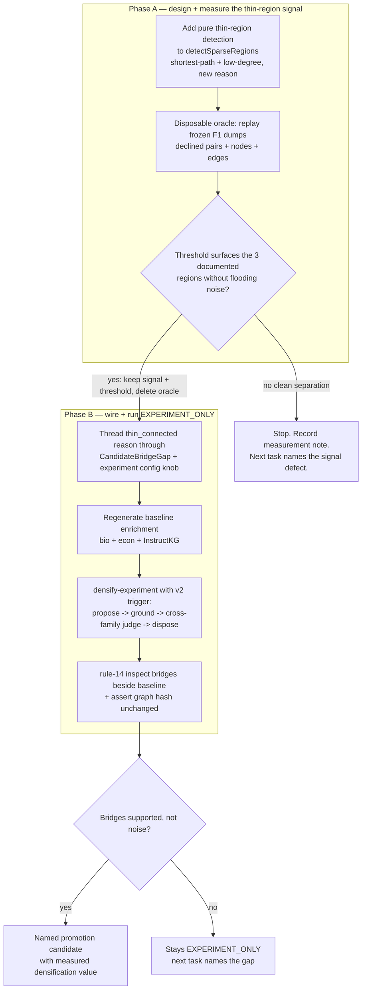

# feat: F3 v2 measured thin-connected-region densification trigger

## Summary

F3 v1 shipped and ran cleanly but proposed **0 bridges**: its sparse-region trigger only fires on
disconnected weakly-connected components and orphan nodes, while the F1 baseline is already
same-domain-connected (3 components = 3 domains, 0 orphans). Densification value is therefore still
**unmeasured** — a trigger/target mismatch, not a verdict that bridging has no value. This plan adds a
**measured, domain-neutral thin-connected-region signal** to the existing detector so F3 can propose
bridges over the *thin-but-connected* sparsity the F1 evaluation actually documented, then runs the
existing experiment harness over a real baseline and records a promotion verdict. It stays
`EXPERIMENT_ONLY` throughout: the asserted graph is byte-for-byte unchanged and no authoritative derived
rows are written (see origin: `docs/brainstorms/2026-06-17-enrichment-evaluation-and-graph-densification-requirements.md`).

This plan covers **TODO #1 only**. TODO #2 (CEP definition-passage precision) and TODO #3 (keep deferred
methods deferred) are out of scope.

---

## Problem Frame

The F1 enrichment-ordering gate passed on all three inspected paths (biology, economics, InstructKG) and
recorded the concrete sparsity that earns densification: three *thin-but-connected* regions where the
source implies a bridge concept the derived graph never connects. The F3 v1 detector
(`packages/application/src/sparseRegionDetection.ts`) discards exactly these cases — line 128,
`if (!touchesOrphan && !crossesComponent) continue;`, drops every declined same-domain pair that sits
inside one connected component. The three documented regions all sit inside one component, so v1 emitted
no candidate gaps and no bridge was ever available for support/noise inspection.

The fix is narrow: teach the detector to also surface declined same-domain pairs that are *topologically
far apart inside one component* — the thin-region signal — without weakening the existing
disconnected/orphan path. The orchestration (`runDensificationExperiment.ts`) and the worker command
(`densify-experiment`) already consume `detectSparseRegions().candidateGaps` generically and never switch
on the gap `reason`, so the new candidates flow end-to-end once the detector emits them.

The discipline that makes this hard is AGENTS rule 16. A thin-region signal that simply emits every
within-component declined pair would flood the experiment with spurious bridges — a heuristic emitter that
silently degrades output. So the signal must be a **measured module**: its keep-threshold is chosen by
measurement against the three F1-documented regions (recall) versus the full declined-pair set (precision)
*before* any bridge is proposed, and the measurement scaffolding is deleted once the threshold is fixed
(rule 11). The signal itself stays a generic topological rule; the three named regions are the evaluation
set only, never encoded into the signal (rule 17).

---

## Requirements

Carried from the origin requirements document (R6–R13, AE3, AE4), narrowed to the v2 trigger. R1–R5 (the
F1 gate) and the F3 v1 mechanism are already COMPLETED; this plan consumes their output.

- **R-V1.** Add a thin-connected-region detection path to `detectSparseRegions` that surfaces declined
  same-domain pairs lying inside one weakly-connected component but separated by a long prerequisite
  shortest-path (and/or touching a low-degree articulation concept). Carried as a new `reason` value;
  the existing `cross_component` / `orphan` behavior is unchanged. (origin R6, R10)
- **R-V2.** The thin-region signal is a measured module (rule 16). Before any bridge is proposed, evaluate
  candidate signals and their thresholds against the three F1-documented regions for recall and against
  the full declined-pair set for precision, using the frozen F1 dumps. Keep only the signal/threshold the
  measurement supports; record the result under `tmp/`; delete the measurement scaffolding (rule 11).
- **R-V3.** Detection stays pure and deterministic — no embeddings (ADR-0012 stands), no model call, no
  store, sorted inputs yielding replay-stable output — mirroring `prerequisiteDag.ts`. (origin R10)
- **R-V4.** The signal and any threshold are domain-neutral topological parameters. Do not encode the
  named F1 regions, fixture concepts, or expected per-source outcomes into the signal or any
  model-facing text (rule 17, origin R12). The three regions are evaluation targets only.
- **R-V5.** Carry every v2 connection on the existing `inferred-prerequisite-of` predicate; introduce no
  new edge predicate. Every v2 node is `llm_grounded`, `derived`, `mintingReason: "densification"`, and
  is grounded + cross-family-judged through the existing seams unchanged. The ADR governance from origin
  R13 (ADR-0019 already amended, ADR-0012 and ADR-0016 untouched) is satisfied with no new ADR change;
  see KTD6. (origin R7, R8, R9, R13)
- **R-V6.** Run the real `densify-experiment` over a regenerated baseline enrichment with the v2 trigger
  enabled, inspect each proposed bridge beside the non-F3 baseline (rule 14), and record a promote vs.
  stay-`EXPERIMENT_ONLY` verdict. The asserted graph version must be byte-for-byte unchanged and no
  authoritative derived rows written. (origin R11, AE3, AE4)
- **R-V7.** Record all findings under `tmp/`, never as a standing benchmark or oracle harness (origin R5,
  ADR-0013).

---

## High-Level Technical Design

The v2 work is a measurement gate (Phase A) that earns a wired trigger and a live experiment (Phase B).
Phase B's live run does not start until the Phase A measurement supports a thin-region signal/threshold;
if no threshold cleanly separates the documented regions from noise, the plan stops at the measurement
note and the next task names the defect.

---

## Key Technical Decisions

- **KTD1 — The thin-region signal is gated by a Phase A measurement, not by intuition.** The keep-decision
  for the signal and its threshold is the disposable oracle in U2, replayed over the frozen F1 dumps. This
  is the rule-16 "earn the emission" discipline: a within-component emitter that floods bridges is the
  failure mode, so the threshold must demonstrably surface the three documented regions (recall) while not
  surfacing the bulk of within-component declined pairs (precision). No live model call happens until this
  passes.

- **KTD2 — Measure on frozen dumps; regenerate only for the live run.** Detection is pure, so U2 replays
  `tmp/2026-06-17-f1-enrichment-eval/{09-derived-nodes,10-derived-edges,18-declined-pair-judgments}.tsv`
  with no DB. The F1 enrichment id (`30f05d4d-...`) is gone after later DB resets, so U6's live experiment
  regenerates a fresh baseline (rule 9). The three thin regions are structural and should reproduce; if a
  region does not reappear in the fresh baseline, that is recorded as a caveat, not a silent gap.

- **KTD3 — Thin-region candidate = a declined same-domain pair, inside one component, with prerequisite
  shortest-path ≥ K hops (and/or an endpoint below a degree floor).** Topology decides which
  within-component pairs are "thin"; the already-declined pair set decides which endpoints are eligible
  (the same declined-pair restriction v1 uses). `K` and any degree floor are chosen by U2's measurement,
  not guessed. Shortest-path is a new pure helper (undirected hop distance over certain edges); degree is
  already computed in `componentMap`.

- **KTD4 — Widen the `reason` union, do not branch the orchestration.** `CandidateBridgeGap.reason` gains
  `"thin_connected"`. `runDensificationExperiment` and the worker command iterate `candidateGaps`
  generically and never switch on `reason`, so the only orchestration-side change is an experiment-config
  knob to enable thin-region detection (so v1 topology-only output stays comparable). Grounding, judging,
  and disposal are reused unchanged (origin R9).

- **KTD5 — Stay `EXPERIMENT_ONLY` and prove it.** F3 v2 output is an appended experiment artifact plus a
  `tmp/` comparison; nothing is written to the authoritative enrichment/derived-graph relational surface,
  and the asserted graph version artifact hash is verified identical before and after (AE3, AE4). No
  numeric promotion threshold and no standing harness — the gate is expert support/noise inspection
  beside the baseline (KTD-equivalent of origin KTD7, ADR-0013).

- **KTD6 — No ADR change.** ADR-0019 was already amended to admit the `densification` minting reason and
  the `mintingReason` facet already exists on `llm_grounded` nodes (prior plan U3). V2 reuses that facet
  unchanged; it adds a detection `reason`, which is an application-level enum, not an architectural
  decision. ADR-0012 and ADR-0016 remain untouched.

---

## Implementation Units

Phase A (U1–U2) is the measurement gate and always runs. Phase B (U3–U6) runs only if U2's measurement
supports a thin-region signal/threshold.

### U1. Pure thin-connected-region detection

- **Goal:** extend `detectSparseRegions` to also emit declined same-domain pairs that sit inside one
  weakly-connected component but are topologically thin (long prerequisite shortest-path and/or a
  low-degree endpoint), carried on a new `reason` value, without changing the existing `cross_component` /
  `orphan` behavior. Add the pure shortest-path helper this needs. (R-V1, R-V3, R-V4)
- **Requirements:** R-V1, R-V3, R-V4.
- **Dependencies:** none.
- **Files:**
  - `packages/application/src/sparseRegionDetection.ts` (add `"thin_connected"` to
    `CandidateBridgeGap["reason"]`; add a `thinRegion` knob to `SparseRegionBounds` —
    `minShortestPathHops`, optional `maxEndpointDegree`, default disabled so v1 callers are unchanged;
    emit thin candidates for within-component declined pairs that pass the threshold).
  - `packages/application/src/prerequisiteDag.ts` (new pure `shortestPathHops(a, b, edges)` /
    `pairwiseHopDistance` helper over undirected certain edges, mirroring the sorted-input deterministic
    style; reused by detection).
  - `packages/application/src/sparseRegionDetection.test.ts` (extend).
  - `packages/application/src/prerequisiteDag.test.ts` (extend, if the shortest-path helper lands here).
- **Approach:** keep the function pure and deterministic — sort inputs, same inputs yield the same output
  (R-V3). Reuse `componentMap`'s component assignment and degree map. For each declined same-domain pair
  whose endpoints share a component, compute the undirected prerequisite hop distance; emit a
  `reason: "thin_connected"` candidate when the distance ≥ `minShortestPathHops` (and, if configured, an
  endpoint degree ≤ `maxEndpointDegree`). Thin candidates are appended after the existing cross-component /
  orphan candidates and share the same `maxCandidateGaps` bound. The threshold values stay generic
  parameters with no fixture-specific defaults (R-V4); the production default for `minShortestPathHops` is
  set in U3 from U2's measured value.
- **Patterns to follow:** `componentMap` and the declined-pair loop already in `sparseRegionDetection.ts`;
  the sorted-input, adjacency-map, deterministic-traversal style in `prerequisiteDag.ts`.
- **Test scenarios:**
  - Two declined same-domain pairs inside one component: one with hop distance ≥ threshold → emitted as
    `thin_connected`; one with hop distance below threshold → not emitted. (happy path + boundary)
  - A declined cross-component pair still emits `cross_component`, and a declined orphan-touching pair
    still emits `orphan`, with thin detection enabled (no regression).
  - A within-component declined pair where an endpoint is below `maxEndpointDegree` → emitted when the
    degree rule is configured; not emitted when only the hop rule is configured. (edge: signal variants)
  - Thin detection disabled (default bounds) reproduces the exact v1 output for the same inputs.
  - Determinism: thin candidates are identical across input permutations and respect `maxCandidateGaps`.
  - `shortestPathHops` returns correct distances on a small chain and a small branching graph, and reports
    unreachable for cross-component endpoints; ignores `uncertain` edges. (happy path + edge)

### U2. Disposable thin-region signal measurement (the gate)

- **Goal:** choose the thin-region signal and threshold by measurement against the three F1-documented
  regions, using the frozen F1 dumps, and record an explicit keep/stop verdict. (R-V2, R-V4, R-V7)
- **Requirements:** R-V2, R-V4, R-V7.
- **Dependencies:** U1.
- **Files:**
  - `tmp/2026-06-18-f3v2-thin-region/` (disposable loader/measurement script reading the frozen F1 TSVs;
    `measurement.md` recording recall/precision per candidate signal and threshold and the chosen value).
  - No `packages/` source under `tmp/`; the script imports the U1 detector and is deleted after the
    threshold is fixed (rule 11).
- **Approach:** parse `tmp/2026-06-17-f1-enrichment-eval/09-derived-nodes.tsv`,
  `10-derived-edges.tsv`, and `18-declined-pair-judgments.tsv` into `detectSparseRegions` inputs.
  **Loader contract (mechanical, must be specified before measuring):** the declined-pair dump is keyed
  by canonical *label*, not by `derivedNodeId`, and carries no domain column, while
  `detectSparseRegions` keys pairs by `aConceptId`/`bConceptId` and requires `pair.declaredDomain` to
  equal both endpoints' domains (`sparseRegionDetection.ts` line ~122 guards). So the loader must (1)
  build a `label → { derivedNodeId, declaredDomain }` map from `09-derived-nodes.tsv`, (2) resolve each
  declined-pair row's two labels to ids and inject the resolved `declaredDomain` (skip + report any row
  whose labels do not resolve, never silently drop), and (3) parse `10-derived-edges.tsv` filtering the
  `uncertain` edges so the component/distance view matches the detector's `!uncertain` edge handling.
  Encode
  the three F1-documented regions as the evaluation set: biology `ultracentrifugation` ↔
  `isotopic labeling of nitrogen (15N vs 14N)`, economics specialization → opulence missing
  `Market Exchange and Distribution`, InstructKG `Semantic Signals` ↔ `Pedagogical Roles` (these live in
  the *evaluation script* and the note, never in `packages/` — R-V4). Sweep candidate signals — hop
  distance ≥ K for a range of K, and the low-degree-endpoint variant — measuring recall (documented
  regions surfaced) and precision (fraction of all within-component declined pairs surfaced). Keep the
  signal/threshold that surfaces the documented regions without flooding; if none separates cleanly,
  record a stop verdict and the plan ends here with a named signal defect.
- **Execution note:** this is a measurement milestone, not a behavior-bearing source change — its only
  durable output is the chosen threshold consumed by U3 and a `tmp/` note. The scaffolding is deleted once
  the threshold is fixed.
- **Test scenarios:** none — disposable measurement scaffolding (rule 11, rule 14). The detector it
  exercises is unit-tested in U1.
- **Verification:** `measurement.md` records, per candidate signal/threshold, which of the three documented
  regions were surfaced and the precision against the full declined-pair set; a single
  signal/threshold is chosen with rationale, or an explicit stop verdict is recorded.

### U3. Wire the measured threshold and the experiment-config knob

- **Goal:** set the production default for the thin-region threshold from U2's measured value and add the
  experiment-config knob that enables thin-region detection in the densification pass, keeping v1
  topology-only output comparable. (R-V1, R-V5)
- **Requirements:** R-V1, R-V5.
- **Dependencies:** U2 (keep verdict).
- **Files:**
  - `packages/application/src/sparseRegionDetection.ts` (set the measured default for `minShortestPathHops`
    / degree floor on a named bounds constant; keep the parameter generic).
  - `packages/application/src/runDensificationExperiment.ts` (extend `DensificationExperimentConfig` /
    `DEFAULT_DENSIFICATION_EXPERIMENT_CONFIG` so the `sparseRegionBounds` passed to `detectSparseRegions`
    carries the thin-region knob, enabled by default; no change to the propose → ground → judge → dispose
    loop).
  - `apps/kg-worker/src/knowledgeGraphWorker.ts` (small edit — see Approach: the `densify-experiment`
    handler currently calls `runDensificationExperiment` with **no** `config` argument, so it always uses
    `DEFAULT_DENSIFICATION_EXPERIMENT_CONFIG`; add a `--no-thin` flag that passes a thin-disabled config to
    reproduce the v1 baseline for comparison, and redirect the hardcoded `outDir`
    (`tmp/2026-06-17-f3-densification-experiment`) to `tmp/2026-06-18-f3v2-thin-region` so the preserved v1
    0-bridge comparison artifact is not overwritten).
  - `packages/application/src/runDensificationExperiment.test.ts` (extend).
- **Approach:** the orchestration already forwards `config.sparseRegionBounds` into `detectSparseRegions`,
  so enabling thin-region detection is a default-config change carrying the measured threshold. Because the
  worker passes no `config` today (`knowledgeGraphWorker.ts` densify-experiment handler), flipping the
  thin knob on in `DEFAULT_DENSIFICATION_EXPERIMENT_CONFIG.sparseRegionBounds` (not the base
  `DEFAULT_SPARSE_REGION_BOUNDS`, which keeps v1 unit callers unchanged) is what makes the live U4 run emit
  thin candidates. Add the `--no-thin` worker flag so the v1 topology-only output stays reproducible for
  the U5 comparison rather than being lost. Do not branch the bridge loop on `reason`; a `thin_connected`
  gap is processed by the same propose/ground/judge/dispose path as a `cross_component` gap (KTD4). The
  measured threshold is a domain-neutral default (R-V4); document its provenance as "set from the U2
  measurement" in a code comment, not the value's fixture origin.
- **Patterns to follow:** the existing `config.sparseRegionBounds` flow at the top of
  `runDensificationExperiment`; the existing arg parsing in the `densify-experiment` command handler.
- **Test scenarios:**
  - With thin-region detection enabled in the experiment config and a baseline layer containing a thin
    within-component declined pair, `runDensificationExperiment` produces a `thin_connected` bridge record
    (mocked proposal/grounding/judge ports as input fixtures only — no assertion on model judgment
    content, rule 11).
  - With the default (v1) config, the experiment reproduces v1 behavior on the same inputs (no thin
    candidates).
  - The per-run `maxBridgesPerRun` bound still caps total bridges across mixed `reason` values.
- *Note:* this unit may be folded into U1 if review finds the config threading trivial; kept separate here
  so the measured-threshold provenance (U2 → U3) is explicit.

### U4. Run the real F3 v2 experiment

- **Goal:** regenerate a baseline enrichment over biology, economics, and InstructKG, then run
  `densify-experiment` with the v2 trigger enabled to produce real bridges for inspection. (R-V6, R-V7)
- **Requirements:** R-V6, R-V7.
- **Dependencies:** U3.
- **Files:** `tmp/2026-06-18-f3v2-thin-region/` (console transcripts, run/version/enrichment/experiment
  ids, baseline-vs-densified comparison). No *new* source changes — runs the `densify-experiment` command
  carrying the U3 worker edits (thin enabled by default, `--no-thin` for the v1 comparison, output
  redirected to this v2 directory). Note: the v1 handler hardcodes its `outDir` to
  `tmp/2026-06-17-f3-densification-experiment`; U3's worker edit redirects it to the v2 directory so the
  preserved v1 0-bridge artifact (cited as the comparison baseline) is not overwritten.
- **Approach:** reset the local PG18 DB (rule 9), `register-from-manifest`, `run-extraction` for the three
  non-Rust sources, `build-graph-version`, `enrich-graph-version` to produce a fresh baseline, then
  `densify-experiment <enrichmentId> [targetDerivedNodeId]` (thin detection on by default after U3) and a
  paired `densify-experiment --no-thin <enrichmentId>` to capture the v1 comparison. Capture the
  connectivity delta and per-bridge rows. If a documented thin region does not reappear in the fresh
  baseline, record it as a caveat (KTD2). If InstructKG fails to publish, proceed with biology + economics.
- **Test scenarios:** none — real-use evaluation milestone (rule 14). The deterministic envelope is covered
  by U1/U3.
- **Verification:** at least one `thin_connected` bridge proposed and grounded over the regenerated
  baseline; the appended experiment artifact and `tmp/` comparison written; no `derived_graph_*` rows
  written for the experiment id.

### U5. F3 v2 real-use inspection and promotion verdict

- **Goal:** judge the v2 bridges beside the non-F3 baseline and decide promote vs. stay
  `EXPERIMENT_ONLY`, with the asserted graph proven unchanged. (R-V6, AE3, AE4)
- **Requirements:** R-V6.
- **Dependencies:** U4.
- **Files:** `tmp/2026-06-18-f3v2-thin-region/rule-14-evaluation.md`.
- **Approach:** for each proposed bridge, inspect support vs. noise beside the baseline path it would
  affect (AE4) — does the bridge name a real intermediate prerequisite the source implies, or an
  unsupported association? Report the connectivity delta as descriptive context only (component/orphan
  counts unchanged is expected; the interesting delta is within-component reachability toward a target).
  Verify the asserted graph version artifact hash is identical before and after (AE3). Record the verdict
  and name the next roadmap task.
- **Test scenarios:** none — evaluation milestone (rule 14).
- **Verification:** asserted graph version artifact hash identical before and after; each proposed bridge
  has a support/noise judgment; explicit promotion verdict recorded; the next roadmap task names the
  earned defect or measured value.

### U6. Roadmap and evidence update

- **Goal:** record the outcome in the live roadmap and validation log per the plans-README discipline.
- **Requirements:** R-V7.
- **Dependencies:** U5.
- **Files:** `docs/plans/TODO.md` (move/replace TODO #1 per the U5 verdict; update VALIDATION with the
  latest run ids and result), `docs/plans/README.md` (archive this plan once complete).
- **Approach:** if F3 v2 earns promotion, replace TODO #1 with the named promotion task; if it stays
  `EXPERIMENT_ONLY`, rewrite TODO #1 with the specific signal/quality defect the run exposed. Keep
  VALIDATION to the latest result only. Do not introduce a standing benchmark (R-V7).
- **Test scenarios:** none — documentation.
- **Verification:** TODO #1 reflects the U5 verdict; VALIDATION names the v2 run ids and result; this plan
  is listed under archived plans.

---

## Scope Boundaries

**Deferred to follow-up work (this product, later)**

- TODO #2 — CEP Definition Passage precision cleanup (heading/citation-like definitions). Independent CEP
  subsystem; explicitly not a blocker for this trigger.
- Admin Lab rendering of F3 bridges — not required for an `EXPERIMENT_ONLY` `tmp/` comparison; add only if
  F3 v2 is promoted.
- A second baseline regeneration for multiple targets — U4 regenerates once; broader target coverage is a
  later step if v2 promotes.

**Outside this product's identity**

- TODO #3 deferred methods — Bradley-Terry difficulty, IRT/KT, learner simulation, embeddings, clustering,
  or non-LLM prerequisite signals. None are reintroduced.
- A relatedness/association edge type or any non-prerequisite derived predicate (ADR-0016 untouched).
- Embeddings as a sparsity-detection or pair-selection tier — only ever a future measured module under
  ADR-0012, which stands.
- Any F3 node or edge entering the authoritative asserted graph or the authoritative enrichment/
  derived-graph relational surface.
- Encoding the named F1 regions, fixture concepts, or expected per-source outcomes into the signal or any
  model-facing text (rule 17).

---

## Risks & Dependencies

- **No clean signal/threshold separation (U2).** The thin-region signal may not surface the three
  documented regions without also flooding the experiment with spurious within-component pairs. Mitigation:
  U2 is an explicit gate — if no threshold separates cleanly, the plan stops at the measurement note and
  the next task names the signal defect (KTD1). Do not pre-build Phase B against an unmeasured threshold.
- **Fresh baseline drift (U4).** The regenerated baseline is a new set of real model calls and may not
  reproduce a documented thin region exactly. Mitigation: KTD2 records any missing region as a caveat;
  the structural regions are expected to reproduce.
- **Bridges that are not real prerequisites.** A within-component bridge may connect concepts that are
  related but not prerequisite-ordered. Mitigations: the declined-pair restriction, the per-run bound, the
  cross-family generated-node judge, and the manual support/noise gate (U5) — all reused from v1.
- **Threshold over-fitting (rule 17).** The measured threshold could drift toward "whatever surfaces the
  three regions." Mitigation: the threshold is a single generic topological parameter measured for
  precision against the *full* declined-pair set, not tuned per region; the regions stay in the disposable
  evaluation script only.
- **Dependencies:** the frozen `tmp/2026-06-17-f1-enrichment-eval/` dumps (U2 inputs); the existing F3 v1
  harness — `runDensificationExperiment`, `BridgeConceptProposalPort` + LiteLLM adapter, the
  generated-grounding bundle, the cross-family generated-node judge, the `prerequisiteDag` disposal
  helpers, and the `densify-experiment` worker command (all reused unchanged). Hard DB reset and
  single-migration rewrites remain allowed during development.

---

## Acceptance Examples

- **AE-V1.** Covers R-V2. The U2 measurement note shows, for the chosen hop threshold, that the three
  F1-documented regions are surfaced as `thin_connected` candidates while only a small fraction of all
  within-component declined pairs are surfaced; a single threshold is chosen with rationale.
- **AE-V2.** Covers origin AE3 (bridge appearance), R-V1, R-V5. With the v2 trigger enabled, `densify-experiment` over the regenerated
  baseline proposes at least one `thin_connected` bridge that appears as an `llm_grounded`,
  `mintingReason: "densification"` Enrichment Node connected by `inferred-prerequisite-of` edges in the
  densified layer.
- **AE-V3.** Covers R-V6, AE3. Across the experiment, the asserted graph version artifact hash is
  byte-for-byte identical and zero authoritative derived rows are written for the experiment id.
- **AE-V4.** Covers R-V6, AE4. Each proposed bridge is inspected beside the non-F3 baseline; if the bridges
  add noise or unsupported connections, F3 v2 stays `EXPERIMENT_ONLY` and the next task names the gap.

---

## Success Criteria

- The thin-region signal is a measured, domain-neutral module with a recorded recall/precision basis for
  its threshold (U2), not a guessed heuristic.
- F3 v2 produces real `thin_connected` bridges over a regenerated baseline that are traceable,
  `llm_grounded`, confined to the derived-layer space, and leave the asserted graph identity unchanged.
- The next roadmap task names the real-output outcome that earned it — measured densification value worth
  promoting, or a specific signal/quality defect that keeps F3 `EXPERIMENT_ONLY`.

---

## Sources / Research

- `packages/application/src/sparseRegionDetection.ts` — the v1 detector; line 128 excludes within-component
  declined pairs, the exact gap U1 closes. `componentMap` already yields component assignment + degree.
- `packages/application/src/prerequisiteDag.ts` — pure deterministic helpers; has cycle removal, transitive
  reduction, topological depth, and `prerequisiteAncestors`, but no shortest-path helper (U1 adds one).
- `packages/application/src/runDensificationExperiment.ts` — the experiment harness; consumes
  `candidateGaps` generically, forwards `config.sparseRegionBounds` to the detector, tags bridges
  `densification`, reuses grounding/cross-family-judge/disposal. No `reason` branching (KTD4).
- `apps/kg-worker/src/knowledgeGraphWorker.ts` — the `densify-experiment <enrichmentId>` command, already
  wired (reads `trace.judgments` for declined pairs, calls `runDensificationExperiment`).
- `tmp/2026-06-17-f1-enrichment-eval/rule-14-evaluation.md` and the `09/10/18` TSV dumps — the three
  documented thin regions and the frozen detector inputs for the U2 measurement.
- `tmp/2026-06-17-f3-densification-experiment/rule-14-evaluation.md` — the v1 0-bridge result that earns
  this trigger.
- `docs/adr/0019-graph-enrichment-derived-layer.md`, `docs/adr/0012-remove-embeddings-deterministic-identity-only.md`,
  `docs/adr/0016-retire-relation-registry-keep-two-cep-assertions.md`,
  `docs/adr/0023-grounding-origin-model-and-cross-family-generated-node-judge.md` — the contracts v2
  reuses (0019, no further amendment needed) and must not violate (0012, 0016 stand).
- `docs/plans/TODO.md` — TODO #1, the task this plan implements; the evaluation-gates-roadmap discipline.
