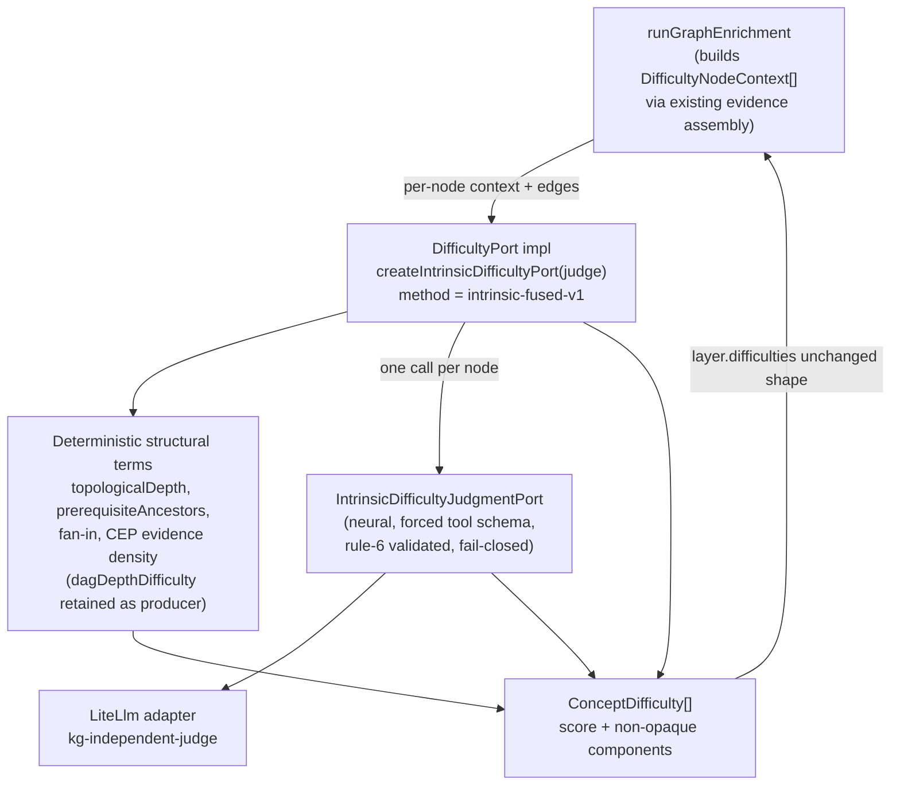

# feat: Remove F3 densification and build learner-neutral intrinsic difficulty

## Summary

Two coupled moves in one milestone. First, remove the F3 graph-densification experiment entirely — it failed its own gate twice and is unmeasured speculative complexity. Second, replace the `dag-depth-mock` difficulty producer behind `DifficultyPort` with a learner-neutral **intrinsic difficulty** signal: a neural source-grounded judge fused with deterministic structural components, exposed through interpretable `components`. Learner-calibrated difficulty (Bradley-Terry / IRT / KT) stays deferred as data-blocked.

---

## Problem Frame

F3 densification has failed twice. v1 produced 0 bridges (its topology-primary trigger only fires on disconnected/orphan gaps, but the same-domain baseline is already connected); v2 stopped before any live run because no domain-neutral threshold can surface the F1-documented economics region without hardcoding known regions (AGENTS rule 17 violation). F1 already judged all three learner paths `PASS` **without** densification, so the value densification chases is not present in inspected output. Keeping it is carrying cost for a refuted idea.

Separately, the difficulty seam is clean but mocked. `DifficultyPort` (`packages/ports/src/index.ts:265`) returns `ConceptDifficulty { score, method, components }`; the mock `dagDepthDifficultyPort` (`packages/application/src/prerequisiteDag.ts:271`) is normalized topological depth + fan-in. Every code comment promises Bradley-Terry as the replacement, but calibrated difficulty needs learner-response data that does not exist. The honest, buildable-now replacement is a **learner-neutral intrinsic** signal grounded in source evidence — it can separate same-depth concepts (the gap worth filling), which a deterministic-only signal cannot.

A verification finding shapes the removal mechanics: this branch has **no commits beyond `main`**. The F3 v2 (`thin_connected`) work exists only as **uncommitted working-tree edits**; the v1 stack (`runDensificationExperiment.ts`, `densificationProposalAdapters.ts`, `BridgeConceptProposalPort`, the `densify-experiment` command) is **committed on `main`**. Removal therefore both discards the v2 edits and deletes the v1 code.

---

## Requirements

### F3 removal

- R1. All F3 densification code is removed: sparse-region detection, the experiment runner, the bridge-proposal port/type/adapter/tool-schema, and the `densify-experiment` worker command. No `densify`-style command remains.
- R2. The `MintingReason` union drops the `"densification"` arm; the live `"assumed_prerequisite"` minting path is unchanged.
- R3. The uncommitted `thin_connected` (F3 v2) edits and the `shortestPathHops` helper added for it are removed.
- R4. Workspace `typecheck` / `test` / `build` are green after removal, with no dangling imports or exports.

### Intrinsic difficulty

- R5. A neural intrinsic-difficulty judgment is routed through a port using a forced named tool schema, with rule-6 argument validation that fails closed on a schema violation.
- R6. The judge rubric is domain-neutral (e.g. abstraction level, technical density, implied background/prerequisite load) and carries no fixture-derived exemplars (rule 17), including in the tool-schema `description` fields.
- R7. A new `DifficultyPort` impl fuses the neural subscore with deterministic structural terms (topological depth, transitive-ancestor count, CEP evidence density, fan-in) and returns the existing `ConceptDifficulty` shape with a new `method` id and non-opaque `components`.
- R8. Difficulty scores all derived nodes (anchors + enrichment nodes); for `llm_grounded` nodes the judge reads the Generated Grounding Bundle (no source quote), without touching the verbatim floor.
- R9. `dagDepthDifficulty` is retained as a component producer; the standalone `dagDepthDifficultyPort` mock is removed.
- R10. The enrichment config hash is bumped to reflect the new `difficulty_method`.

### Documentation & ADR

- R11. The "Bradley-Terry replaces this" comments in `packages/domain-core/src/index.ts`, `packages/ports/src/index.ts`, and `packages/application/src/prerequisiteDag.ts` are rewritten to state: neural intrinsic now; learner-calibrated (IRT/BT) deferred, data-blocked.
- R12. A new ADR-0024 records learner-neutral intrinsic difficulty with calibrated difficulty deferred; ADR-0019 is amended to record densification was tried, measured non-valuable on a connected baseline, and removed; `docs/plans/TODO.md` and `docs/plans/README.md` are updated.

---

## Key Technical Decisions

- KTD1. **Remove F3, do not keep dormant.** It failed its gate twice and is unmeasured; dormant code is carrying cost for a refuted idea. (origin locked decision 1)
- KTD2. **Learner-neutral intrinsic (Fork A), not learner-calibrated (Fork B).** Calibrated difficulty needs learner-response data that does not exist; intrinsic is the honest buildable-now signal. (origin locked decision 2)
- KTD3. **Fuse neural + deterministic structural (A1), not deterministic-only (A2).** A2 cannot separate same-depth concepts, which is exactly the gap worth filling. (origin locked decision 3)
- KTD4. **Widen `DifficultyPort.score` input to carry per-node content.** The current input (`nodeIds` + edges) carries no node content, so a neural judge cannot read sources through it. Pass a per-node context (`DifficultyNodeContext`) assembled the same way the enrichment runner already builds `PrerequisiteConceptContext`. Breaking change, permitted by AGENTS rule 1.
- KTD5. **Two-port split.** A neural `IntrinsicDifficultyJudgmentPort` (infra adapter, forced tool schema) produces the per-node neural subscore; the deterministic fused `DifficultyPort` (application) computes structural terms and blends. This keeps neural judgment behind a port (rule 5) and the fusion math deterministic and testable (rule 11).
- KTD6. **Judge model = cross-family independent judge** (`kg-independent-judge` / gpt-oss-120b), not the DeepSeek generator family. `llm_grounded` nodes are generated by DeepSeek; a same-family difficulty judge would self-grade its own generated grounding. Mirrors the KTD7 cross-family rationale already in the codebase. Verify empirically during rule-14 inspection.
- KTD7. **Difficulty quality is soft-plausibility only.** No oracle exists without learner data, so rule-14 validation is plausibility, not pass/fail verification. Carry intrinsic difficulty at `EXPERIMENT_ONLY` trust for ordering; automated tests cover only the deterministic envelope (rule 11), never the model's difficulty judgment content.

---

## High-Level Technical Design

The fused producer is an application-layer `DifficultyPort` that depends on a neural judgment port and on deterministic structural producers that already live in `prerequisiteDag.ts`. The enrichment runner assembles per-node evidence (reusing its existing context-builder) and hands it to the port; everything downstream of `layer.difficulties` is unchanged because the `ConceptDifficulty` output shape is preserved.



For `llm_grounded` nodes the context carries the Generated Grounding Bundle's generated definition/mention text (no source quote, no verbatim check); for anchors it carries CEP evidence-profile quotes; for `source_mentioned` nodes it carries the rescued mention passages — the same three-way assembly the prerequisite-judge context builder already performs.

---

## Scope Boundaries

### Deferred for later

- Learner-calibrated difficulty (Bradley-Terry / IRT / KT) — data-blocked; stays deferred until a learner-data surface exists.
- Any learner-response capture or telemetry surface; Learner State stays the empty mock (ADR-0014).
- Fusion-weighting tuning beyond a first reasonable blend — resolved empirically during rule-14 inspection (see Open Questions).

### Deferred to follow-up work

- CEP definition-passage precision cleanup (prior TODO #2) — remains a known caveat, not part of this milestone.

### Outside this product's identity

- Densification / bridge proposals — removed, not deferred.
- Changing the learner-path ordering contract: prerequisite structure stays primary; intrinsic difficulty remains the secondary tie-break it is today.

---

## Implementation Units

### U1. Remove the F3 worker command and densify wiring

- Goal: Delete the `densify-experiment` CLI path and all densification wiring from the worker so nothing references F3 infrastructure.
- Requirements: R1, R4
- Dependencies: none
- Files:
  - `apps/kg-worker/src/knowledgeGraphWorker.ts` — remove the `runDensificationExperiment` import, the `LiteLlmBridgeConceptProposalAdapter` import and `ctx.bridgeConceptProposal` wiring, `densifyExperimentCommand`, `renderDensificationComparison`, the `case "densify-experiment"`, and the `densify-experiment` token in the usage string.
- Approach: Pure deletion of the top consumer first so the adapter/port/types become unused but the tree still compiles. Leave the `compute-learner-path` and `enrich-graph-version` commands untouched.
- Patterns to follow: existing command-handler structure in the same file.
- Test scenarios: Test expectation: none — thin CLI wiring with no unit tests; verified by workspace typecheck/build in U6's gate. Confirm no other file imports the removed symbols.
- Verification: `knowledgeGraphWorker.ts` has no `densif`/`bridge` references; worker usage string no longer lists `densify-experiment`.

### U2. Remove the F3 infrastructure adapter, tool schema, and bridge port

- Goal: Delete the neural bridge-proposal adapter, its tool schema, and the port interface it implements.
- Requirements: R1, R4
- Dependencies: U1
- Files:
  - delete `packages/infrastructure-litellm/src/densificationProposalAdapters.ts` and `packages/infrastructure-litellm/src/densificationProposalAdapters.test.ts`
  - `packages/infrastructure-litellm/src/index.ts` — remove the `LiteLlmBridgeConceptProposalAdapter` export
  - `packages/infrastructure-litellm/src/toolSchemas.ts` — remove `bridgeConceptProposalSchema` and `bridgeConceptProposalValidator`
  - `packages/ports/src/index.ts` — remove the `BridgeConceptProposalPort` interface
- Approach: After U1 the adapter is unused; remove it together with its schema and the port it implements. Keep `missingPrerequisiteProposal*` schemas and the `MissingPrerequisiteProposalPort` — those are the live minting path, not F3.
- Patterns to follow: sibling adapters in the same package for export-surface conventions.
- Test scenarios: Test expectation: none for the deletions themselves; the remaining `toolSchemas` tests must stay green (no reference to the removed bridge schema).
- Verification: package builds; no `BridgeConcept`/`bridgeConcept` symbols remain in `packages/infrastructure-litellm` or `packages/ports`.

### U3. Remove the F3 application modules and domain types

- Goal: Delete sparse-region detection, the densification experiment runner, the `shortestPathHops` helper, the `BridgeConceptProposal` type, and collapse `MintingReason`.
- Requirements: R1, R2, R3, R4
- Dependencies: U2
- Files:
  - delete `packages/application/src/sparseRegionDetection.ts` and `packages/application/src/sparseRegionDetection.test.ts`
  - delete `packages/application/src/runDensificationExperiment.ts` and `packages/application/src/runDensificationExperiment.test.ts`
  - `packages/application/src/prerequisiteDag.ts` — remove `shortestPathHops` (the F3 v2 addition); keep `topologicalDepth`, `prerequisiteAncestors`, and `dagDepthDifficulty`
  - `packages/application/src/prerequisiteDag.test.ts` — remove the `shortestPathHops` tests
  - `packages/application/src/index.ts` — drop the `sparseRegionDetection` and `runDensificationExperiment` re-exports and the `shortestPathHops` export
  - `packages/domain-core/src/index.ts` — remove the `BridgeConceptProposal` type; change `MintingReason` to `"assumed_prerequisite"` only
- Approach: `connectivityMetrics`/`detectSparseRegions` are imported only by the deleted experiment runner and re-exported from `index.ts` — confirmed no surviving consumer — so the whole `sparseRegionDetection.ts` is safe to delete. The `mintingReason` field on `LlmGroundedEnrichmentNode` stays; only the union narrows, and the live minting site already sets `"assumed_prerequisite"`.
- Patterns to follow: existing `index.ts` export grouping.
- Test scenarios:
  - `enrichmentNodeMinting` tests stay green after the `MintingReason` collapse (the `"assumed_prerequisite"` path is unchanged).
  - `prerequisiteDag` tests stay green with `shortestPathHops` and its cases removed.
  - Workspace typecheck passes with no unresolved `BridgeConceptProposal` / `sparseRegion` references.
- Verification: no `densif`/`sparseRegion`/`shortestPathHops`/`BridgeConcept` symbols remain in `packages/application` or `packages/domain-core`; full workspace `typecheck` + `test` green (closes the removal half of R4).

### U4. Define the difficulty judge port and widen the DifficultyPort contract

- Goal: Introduce the neural judgment port and the per-node content input the fused producer needs, and rewrite the misleading calibration comments.
- Requirements: R5, R7, R8, R9, R11
- Dependencies: U3
- Files:
  - `packages/ports/src/index.ts` — add `IntrinsicDifficultyJudgmentPort` (input: one node's `{ canonicalLabel, declaredDomain, groundingOrigin, definitions, mentions }`; output: `{ neuralScore: number; rationale: string }` with `neuralScore` in `[0,1]`); widen `DifficultyPort.score` input from `{ nodeIds, prerequisiteEdges }` to `{ nodes: DifficultyNodeContext[]; prerequisiteEdges }`; rewrite the Bradley-Terry comment block.
  - `packages/domain-core/src/index.ts` — add the `DifficultyNodeContext` type; update the `ConceptDifficulty` comment to describe the intrinsic method.
- Approach: Model `DifficultyNodeContext` on `PrerequisiteConceptContext` so the runner can populate it from the same evidence sources. Keep `ConceptDifficulty`'s output shape exactly as-is (consumers `learnerPathProjection`/`computeLearnerPath` read `score`/`components` and must not change).
- Technical design (directional, not specification):
  ```ts
  // ports
  interface IntrinsicDifficultyJudgmentPort {
    readonly model: string;
    judge(input: DifficultyNodeContext): Promise<{ neuralScore: number; rationale: string }>;
  }
  interface DifficultyPort {
    readonly method: string;
    score(input: { nodes: DifficultyNodeContext[]; prerequisiteEdges: InferredPrerequisiteEdge[] }): Promise<ConceptDifficulty[]>;
  }
  ```
- Patterns to follow: `MissingPrerequisiteProposalPort` and `PrerequisiteConceptContext` shapes.
- Test scenarios: Test expectation: none — interface/type scaffolding; behavior lands in U5–U7. Typecheck must surface the now-broken `dagDepthDifficultyPort` and runner call site (both resolved in U6/U7).
- Verification: `packages/ports` and `packages/domain-core` typecheck in isolation; the new interfaces compile.

### U5. Neural intrinsic-difficulty judge adapter and tool schema

- Goal: Implement the forced-tool neural judge with a domain-neutral rubric and rule-6 argument validation.
- Requirements: R5, R6
- Dependencies: U4
- Files:
  - `packages/infrastructure-litellm/src/toolSchemas.ts` — add `intrinsicDifficultySchema` and `intrinsicDifficultyValidator` for a `submit_intrinsic_difficulty` tool (`{ neuralScore: number in [0,1], rationale: string }`)
  - `packages/infrastructure-litellm/src/intrinsicDifficultyAdapters.ts` (new) — `LiteLlmIntrinsicDifficultyJudgmentAdapter implements IntrinsicDifficultyJudgmentPort`, defaulting to the `kg-independent-judge` alias
  - `packages/infrastructure-litellm/src/intrinsicDifficultyAdapters.test.ts` (new)
  - `packages/infrastructure-litellm/src/index.ts` — export the adapter
- Approach: Mirror `LiteLlmMissingPrerequisiteProposalAdapter` for the forced-tool call shape. The system prompt states a domain-neutral rubric (abstraction level, technical density, implied background/prerequisite load) in generic language — no named concepts, no per-source expectations, no fixture exemplars (rule 17). The adapter passes node evidence into the user message; for `llm_grounded` nodes the evidence is the generated grounding text.
- Patterns to follow: `missingPrerequisiteProposalAdapters.ts`, the forced-tool client `LiteLlmForcedToolClient`, and existing `z.object` validators in `toolSchemas.ts`.
- Test scenarios (deterministic envelope only — rule 11; a canned model response is an input fixture, never the thing asserted):
  - Happy path: a well-formed tool argument (`neuralScore: 0.6`, non-empty `rationale`) passes the validator and maps to `{ neuralScore, rationale }`.
  - Edge: boundary `neuralScore` values `0` and `1` validate; the structural mapping is exact.
  - Error / fail-closed: `neuralScore` out of `[0,1]`, missing `rationale`, wrong type, or extra/absent required field is rejected by the validator (rule-6).
  - Rubric audit (static): the schema `description` fields and system prompt contain no fixture-derived exemplars.
- Verification: adapter and schema build; validator tests cover accept and fail-closed paths.

### U6. Fused intrinsic DifficultyPort implementation

- Goal: Build the deterministic fusion producer that blends structural terms with the neural subscore and returns interpretable `components`.
- Requirements: R7, R8, R9
- Dependencies: U4, U5
- Files:
  - `packages/application/src/intrinsicDifficulty.ts` (new) — `createIntrinsicDifficultyPort(judge: IntrinsicDifficultyJudgmentPort): DifficultyPort` with `method = "intrinsic-fused-v1"`
  - `packages/application/src/intrinsicDifficulty.test.ts` (new)
  - `packages/application/src/prerequisiteDag.ts` — remove `dagDepthDifficultyPort`; keep `dagDepthDifficulty` as a component producer
  - `packages/application/src/index.ts` — export `createIntrinsicDifficultyPort`; drop the `dagDepthDifficultyPort` export
- Approach: For each node, compute deterministic structural terms — topological depth (`topologicalDepth`), transitive-ancestor count (`prerequisiteAncestors`), fan-in, and CEP evidence density (count of definitions + mentions in the node context) — and call `judge` once for the neural subscore. Fuse into a single `score` in `[0,1]` and emit every term plus the neural subscore in `components` (all numeric). Fail closed if the judge throws or returns an out-of-range subscore (do not silently substitute structural-only).
- Technical design (directional, not specification): fusion as a weighted blend of a normalized structural composite and the neural subscore; the exact weights are an Open Question resolved during inspection — start with a balanced blend that leaves the neural term able to differentiate same-depth nodes.
- Patterns to follow: `dagDepthDifficulty` for component-map construction; the deterministic graph utilities in `prerequisiteDag.ts`.
- Test scenarios (deterministic envelope — a stub judge returning fixed subscores is an input fixture, never asserted as quality):
  - Happy path: given a small DAG and a stub judge, every node gets a `ConceptDifficulty` with `method = "intrinsic-fused-v1"` and a `components` map containing the structural terms and the neural subscore.
  - Same-depth differentiation: two nodes at equal topological depth with different stub neural subscores receive different `score` values (proves the neural term is not drowned by structural terms).
  - Structural correctness: topological depth, transitive-ancestor count, fan-in, and CEP evidence density match hand-computed values for a fixed graph.
  - Score bounds: fused `score` stays within `[0,1]` across stub subscores `0` and `1`.
  - Fail-closed: a judge that throws or returns an out-of-range subscore makes `score` reject rather than emit a structural-only number.
  - `llm_grounded` node context (generated grounding text) is scored without any verbatim-floor invocation.
- Verification: `intrinsicDifficulty` tests green; `dagDepthDifficultyPort` is gone while `dagDepthDifficulty` remains.

### U7. Wire the fused port into the enrichment runner and worker; bump config hash

- Goal: Produce intrinsic difficulty in real enrichment runs over all derived nodes and bump the config hash.
- Requirements: R8, R10, R4
- Dependencies: U6
- Files:
  - `packages/application/src/runGraphEnrichment.ts` — build `DifficultyNodeContext[]` for all derived nodes (anchors from CEP evidence profiles, `source_mentioned` from rescued passages, `llm_grounded` from the grounding bundle), pass `{ nodes, prerequisiteEdges: reducedEdges }` to the widened port, and bump `enrichmentConfigHash` to a v3 value reflecting the difficulty method.
  - `packages/application/src/runGraphEnrichment.test.ts` — update the difficulty integration to the new input shape with a stub judge.
  - `apps/kg-worker/src/knowledgeGraphWorker.ts` — construct the `LiteLlmIntrinsicDifficultyJudgmentAdapter`, wrap it with `createIntrinsicDifficultyPort`, and inject as `difficulty` in both the `enrich-graph-version` and `compute-learner-path` contexts (replacing `dagDepthDifficultyPort`).
- Approach: Reuse the runner's existing per-node evidence assembly (the `buildPrerequisiteContext` path that draws anchor definitions from `profileByConcept` and enrichment-node passages from node grounding) to populate `DifficultyNodeContext`, so difficulty and the prerequisite judge read the same evidence. Difficulty still scores the union of anchors + enrichment nodes (R8 / handoff constraint).
- Patterns to follow: the existing `input.difficulty.score(...)` call site and `buildPrerequisiteContext` in `runGraphEnrichment.ts`; the worker context construction for other ports.
- Test scenarios:
  - Integration (stub judge): a run over a small fixture produces a `ConceptDifficulty` for every derived node id, including an `llm_grounded` node.
  - Config hash: the persisted layer carries the bumped `enrichmentConfigHash`; the prior value no longer appears.
  - Shape preservation: `layer.difficulties` still satisfies `ConceptDifficulty`, so `learnerPathProjection`/`computeLearnerPath` consume it unchanged.
- Verification: workspace `typecheck` / `test` / `build` all green (closes the addition half of R4); a stubbed enrichment run yields difficulty for all nodes with the new method id.

### U8. ADR-0024, ADR-0019 amendment, and plan-doc updates

- Goal: Record the decision and update the planning docs.
- Requirements: R12
- Dependencies: U7
- Files:
  - `docs/adr/0024-learner-neutral-intrinsic-difficulty.md` (new) — learner-neutral intrinsic difficulty now; learner-calibrated (IRT/BT) deferred as data-blocked.
  - `docs/adr/0019-graph-enrichment-derived-layer.md` — amend to record densification was tried, measured non-valuable on a connected baseline, and removed.
  - `docs/plans/TODO.md` — drop F3 (TODO #1) to a removed/completed note; promote intrinsic difficulty to the active task; CEP precision (#2) and deferred-methods (#3) remain.
  - `docs/plans/README.md` — move the F3 v2 plan to an archived-with-removal note.
- Approach: Follow the existing ADR format and numbering. Keep ADR-0024 focused; cross-link ADR-0019/0014.
- Test scenarios: Test expectation: none — documentation only.
- Verification: ADR-0024 exists and is internally consistent; ADR-0019 carries the removal note; TODO/README reflect the new state.

### U9. Real-use quality evaluation (rule 14)

- Goal: Inspect real intrinsic-difficulty output before treating the milestone as done.
- Requirements: R6, R7, R8 (validation)
- Dependencies: U7
- Files: none (produces an evaluation note in the implementation report / PR summary)
- Approach: Run a real mixed-domain enrichment (Rust, biology, economics, InstructKG) with real LLM calls through the judge adapter. Inspect that, within each domain, foundational concepts score below advanced ones, same-depth concepts are differentiated, scores are source-faithful, and `llm_grounded` nodes are scored from their grounding bundle without breaking the verbatim floor. Confirm the neural term is not drowned by structural terms (redundancy risk). Classify `PASS` / `FIX_FIRST` / `EXPERIMENT_ONLY` / `BLOCKED` and record concrete examples.
- Execution note: This is the AGENTS rule-14 gate; do not promote the difficulty signal beyond `EXPERIMENT_ONLY` trust — there is no oracle without learner data, so this is soft-plausibility inspection, not pass/fail verification.
- Test scenarios: Test expectation: none — human inspection of real model output, never an automated quality assertion (rule 11).
- Verification: an evaluation note is recorded with the required fields (milestone, fixture, real-calls, result, useful output, defects, changes, caveats, safe-to-continue).

---

## Open Questions

- **Fusion weighting** — fixed deterministic blend vs neural-dominant. Resolve empirically during U9 inspection (start with a balanced blend), not by guess at plan time. The same-depth-differentiation test in U6 guards the lower bound (neural term must move the score).
- **Ordering behavior** — default is that intrinsic difficulty stays the secondary tie-break within prerequisite constraints (matches the current contract); verify in U9 that it does not perturb path *selection*.

---

## Risks & Dependencies

- **No hard oracle for difficulty.** Rule-14 validation is soft plausibility, not pass/fail. Mitigation: KTD7 caps trust at `EXPERIMENT_ONLY` for ordering; the explicit caveat is stated in the U9 note.
- **Redundancy risk.** Topological depth already correlates with prerequisite order; if the neural signal is drowned in the fusion, the change adds cost without lift. Mitigation: U6's same-depth-differentiation test and U9 inspection must both show the neural term moves the score.
- **Generated-node grounding is thin.** `llm_grounded` nodes carry only a generated bundle, so their difficulty scores are weaker evidence than anchor scores. Mitigation: note in the U9 inspection; cross-family judge (KTD6) avoids self-grading.
- **Self-grading dependency.** KTD6 depends on the `kg-independent-judge` alias remaining a non-DeepSeek family with working forced tool_choice; verify before the real run.

---

## Success Criteria

- Static: workspace `typecheck` / `test` / `build` green after removal and addition; focused tests cover the deterministic fusion (U6) and rule-6 argument validation of the judge tool args (U5) — never the model's difficulty judgment content (rule 11).
- Real-use (rule 14, U9): a real mixed-domain run produces difficulty scores; expert inspection judges that within each domain foundational concepts score below advanced ones, same-depth concepts are differentiated, scores are source-faithful, and `llm_grounded` nodes are scored from their grounding bundle without breaking the verbatim floor. Classified `PASS` / `FIX_FIRST` / `EXPERIMENT_ONLY` / `BLOCKED` with the soft-plausibility caveat stated.

---

## Sources & Research

- Origin requirements: `docs/brainstorms/2026-06-18-intrinsic-difficulty-and-f3-removal-requirements.md`
- Difficulty seam: `packages/ports/src/index.ts:265` (`DifficultyPort`), `packages/application/src/prerequisiteDag.ts:250-276` (`dagDepthDifficulty`, `dagDepthDifficultyPort`), `packages/domain-core/src/index.ts:890-912` (`ConceptDifficulty`, `DerivedGraphLayer`).
- Difficulty integration + node-context assembly: `packages/application/src/runGraphEnrichment.ts:224` (difficulty call site), `:319-347` (`buildPrerequisiteContext` evidence assembly), `:49` (`enrichmentConfigHash`).
- Difficulty consumers (shape must not change): `packages/application/src/learnerPathProjection.ts:17-46`, `packages/application/src/computeLearnerPath.ts:31-38`.
- Judge-adapter pattern to mirror: `packages/infrastructure-litellm/src/missingPrerequisiteProposalAdapters.ts`, `packages/infrastructure-litellm/src/toolSchemas.ts:410-478`.
- F3 removal surface: `packages/application/src/sparseRegionDetection.ts`, `packages/application/src/runDensificationExperiment.ts`, `packages/infrastructure-litellm/src/densificationProposalAdapters.ts`, `packages/ports/src/index.ts:248` (`BridgeConceptProposalPort`), `packages/domain-core/src/index.ts:688,744` (`MintingReason`, `BridgeConceptProposal`), `apps/kg-worker/src/knowledgeGraphWorker.ts` (`densify-experiment` command).
- Live minting path to preserve: `packages/application/src/enrichmentNodeMinting.ts:159` (`mintingReason: "assumed_prerequisite"`).
- Prior F3 plans being retired: `docs/plans/2026-06-17-002-feat-enrichment-eval-graph-densification-plan.md`, `docs/plans/2026-06-18-002-feat-densification-thin-region-trigger-plan.md`.
