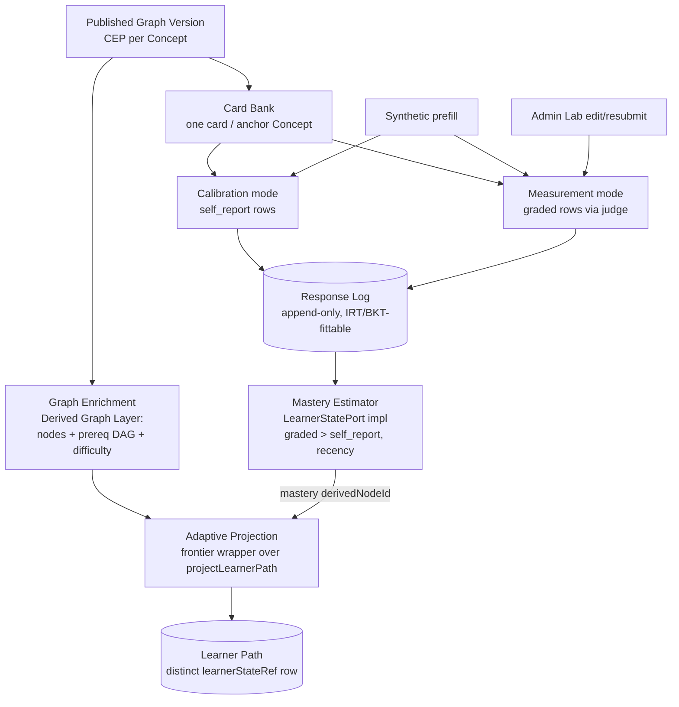
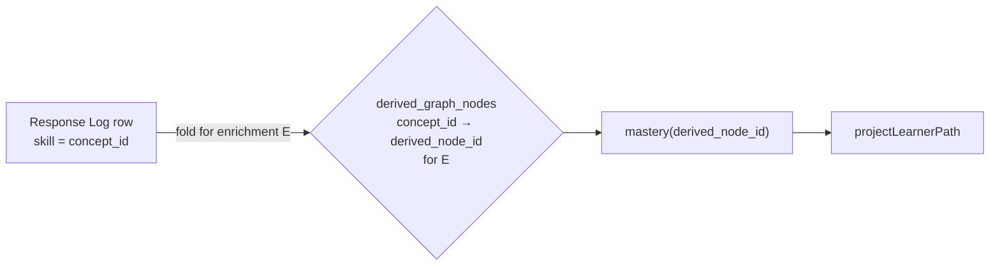

# feat: Learner Recall Loop and Adaptive Path

## Summary

Build a downstream learner-adaptivity loop on top of the published graph: a learner-neutral per-Concept Card Bank, an append-only Response Log (the one irreversible commitment), a thin `EXPERIMENT_ONLY` mastery estimator behind the existing `LearnerStatePort`, and a frontier-advancing adaptive path. Two recall modes (self-report calibration scoped to a target's prerequisite ancestors, and LLM-graded free-form measurement) append to the single log; synthetic prefilled answers seed both for a rule-14 run, and Admin Lab gains its first write surface to review, edit, and resubmit those answers. Real IRT/BKT stay deferred until the log holds responses.

---

## Problem Frame

The architecture already deferred personalization through a clean seam: `LearnerStatePort` (`packages/ports/src/index.ts:269`) exposes `mastery(conceptId) → [0,1]`, and `projectLearnerPath` (`packages/application/src/learnerPathProjection.ts:14`) consumes it — pruning mastered concepts, topo-ordering survivors by prerequisite structure, breaking ties by intrinsic difficulty. Today the port is mocked to `emptyLearnerState` ("knows nothing").

The blocker (ADR-0014, ADR-0024, `docs/plans/TODO.md` #2) is not the estimator algorithm — it is the absence of learner-response **data**. IRT and BKT are fits over a response history; with zero responses any prior is invented precision. This plan builds the data surface (the recall loop that produces responses) plus the minimal adaptivity it unlocks, keeping a real estimator as a later `LearnerStatePort` implementation reading the same log.

---

## Key Technical Decisions

- **`LearnerStatePort` stays synchronous; preload-then-project.** `mastery()` is sync by design (the projection is a pure CLI op, ADR-0011). The estimator loads the Response Log for one `learnerStateRef` into a `Map<derivedNodeId, score>` and returns a sync port — exactly the shape `emptyLearnerState` already satisfies. The port contract never changes (R11, R12).

- **Response Log records the durable asserted `concept_id` as the skill; the estimator resolves it to the active enrichment's `derived_node_id` at fold time.** The projection calls `mastery()` with `derived_node_id`s, but cards/CEPs key on asserted `concept_id`, and only **anchor** derived nodes carry a `concept_id`. Storing the asserted id keeps the log enrichment-independent so an IRT/BKT fit survives re-enrichment without re-collecting answers (R6). The estimator maps `concept_id → derived_node_id` per enrichment using `derived_graph_nodes`. This is the one irreversible schema choice.

- **One card per Concept, two modes off the same card** (resolves Open Question 2). A card carries a question, a graded answer-key with CEP citations, and a self-report prompt (R2). Calibration reads the self-report prompt; measurement grades a written answer against the same answer key. One item, two signal types — honoring "one store, one estimator, one code path" (origin: Key Decisions).

- **Cards cover anchors only.** Anchors are published Concepts with a CEP to condition on; enrichment prerequisite nodes (`source_mentioned` / `llm_grounded`) have no CEP, get no card, and remain unmastered-by-default in the path. Acceptable this milestone — they simply stay included.

- **Thin, honest mastery fold** (resolves Open Question 1). Graded rows always outrank self-report on conflict (R11); recency selects the active prior *only among self-report rows* (re-calibration never outranks an existing graded row, R10, AE1). Anki ratings map `again→0, hard→0.33, good→0.7, easy→1.0`; graded `correct→1.0, partial→0.5, incorrect→0`. No decay curve — that is deferred tuning, not this milestone. Carried at `EXPERIMENT_ONLY` trust.

- **Adaptive path prunes at ≈0.7 and advances the target to the hardest ready unmastered node** (resolves Open Question 3). The current `DEFAULT_MASTERY_THRESHOLD = 1` prunes nothing; the adaptive command passes `masteryThreshold = 0.7` so self-reported "good"/"easy" and graded "correct" prune (partial/incorrect do not). Frontier advancement is a thin wrapper: re-select the target as the highest-difficulty *ready* (all prerequisites mastered) unmastered node, then call `projectLearnerPath` **unchanged** (R13). No new projection core.

- **Grading judge runs cross-family on `kg-independent-judge`.** Card answer keys are generated DeepSeek-family (AGENTS rule 5); the judge that grades a learner answer against that key must not be the generator grading its own homework, mirroring every existing judge port (ADR-0023). Card generation itself stays DeepSeek-family.

- **Admin Lab gains its first write surface via Next.js server actions, learner state only.** Admin Lab is read-only today (`withClient` loaders). Edit-and-resubmit appends Response Log rows and recomputes mastery + path — never touching a published graph or the Derived Graph Layer (AGENTS rule 12, R15).

- **All learner structures are projection-only.** Nothing here mutates the asserted graph or the Derived Graph Layer; learner state is never written into the learner-neutral core (CONTEXT.md "Learner State", AGENTS rule 3).

---

## High-Level Technical Design

The loop and its source-of-truth fan-out. Learner-neutral assets sit beside the Derived Graph Layer; learner-specific state lives only in the Response Log and the projected path.



The skill-identity resolution that keeps the log durable (KTD: asserted id stored, derived id resolved at fold time):



---

## Output Structure

New files (modifications to existing files listed per unit):

```
packages/
  domain-core/src/
    learnerLoop.ts                 # Card, ResponseLogRow, SignalType, ratings, outcomes (or extend index.ts)
  application/src/
    generateCardBank.ts            # + .test.ts
    calibration.ts                 # + .test.ts
    measurement.ts                 # + .test.ts
    responseLogLearnerState.ts     # + .test.ts
    adaptivePathProjection.ts      # frontier wrapper + .test.ts
    syntheticResponses.ts          # + .test.ts
  infrastructure-litellm/src/
    cardGenerationAdapters.ts      # + .test.ts
    answerGradingAdapters.ts       # + .test.ts
    learnerSimulatorAdapters.ts    # + .test.ts (synthetic written answers)
  infrastructure-postgres/src/
    PostgresLearnerLoopStores.ts   # CardBank + ResponseLog stores + .test.ts
apps/admin-lab/src/
  lib/learnerLoop.ts               # read loaders + conflict detection (+ .test.ts)
  app/admin/lab/learner-loop/      # list + detail pages
  app/admin/lab/learner-loop/actions.ts   # server actions (edit/resubmit)
  components/LearnerLoopReview.tsx
```

---

## Requirements

Traceability back to the origin requirements doc. Each maps to the unit(s) that satisfy it.

**Card Bank (learner-neutral) — U1, U2**

- R1. Generate one or more anki-style Q&A cards per published Concept, conditioned on its CEP, via a forced named tool schema routed through LiteLLM (AGENTS rules 5, 6).
- R2. Each card carries a question, a graded answer-key, and a self-report prompt, with the answer-key citing the CEP passages it derives from for traceability.
- R3. The Card Bank is a learner-neutral derived asset keyed to a graph version, regenerable without affecting learner state, never written into the asserted graph or Derived Graph Layer.

**Response Log (the durable commitment) — U3**

- R4. Persist every recall attempt as an immutable append-only row capturing: card (item), concept (skill), signal type (`self_report` | `graded`), self-report confidence or judged outcome plus graded score, evidence-strength weight, response source (`synthetic` | `human`), grader identity, and attempt order/timestamp.
- R5. The log is never mutated or deleted by any operation, including re-calibration; corrections and resubmissions append new rows.
- R6. The log's fidelity is sufficient to fit a per-item IRT model and a per-skill BKT model later without re-collecting responses.

**Recall modes — U4, U5**

- R7. Calibration presents a self-report sweep over a calibration set scoped to the chosen target's prerequisite ancestors; the learner rates recall confidence per concept, producing `self_report` rows at lower evidence weight.
- R8. Calibration may propagate self-reported mastery across the prerequisite DAG so a learner reporting a downstream concept seeds prior mastery on its prerequisite ancestors, reducing questions asked.
- R9. Measurement presents free-form questions; the written answer is graded correct/partial/incorrect against the card's answer-key by a forced-tool LLM judge, producing `graded` rows at higher evidence weight.
- R10. Re-calibration is allowed at any time, recorded as an appended self-report batch; it never resets or outranks existing graded evidence.

**Mastery estimator and adaptive path — U6**

- R11. A mastery estimator folds the Response Log into `mastery(conceptId) → [0,1]` behind the existing `LearnerStatePort`, ranking graded over self-report on conflict and selecting the active self-report prior by recency.
- R12. The initial estimator is deliberately simple, carried at `EXPERIMENT_ONLY` trust; no IRT/BKT/Bradley-Terry calibrated precision in this milestone.
- R13. The path projection consumes the estimator unchanged to skip mastered concepts, and advances the target to the hardest *ready* unmastered concept.

**Synthetic prefill and Admin Lab review — U7, U8**

- R14. A synthetic-answer generator produces prefilled responses for both modes — simulated self-ratings and simulated written answers with their judge grades — written into the log tagged `synthetic`.
- R15. Admin Lab exposes a learner-loop surface to inspect cards, review synthetic answers, edit and resubmit them, and re-run mastery and projection — mutating learner state only, never a published graph.
- R16. Admin Lab surfaces self-report↔graded conflicts (claimed-known but failed graded, or the reverse) as a deliberate calibration signal.

---

## Implementation Units

### U1. Card Bank schema, types, and store

**Goal:** Persist a learner-neutral Card Bank keyed to a graph version, with answer-key citations into CEP passages. No LLM yet — the durable substrate cards land in.

**Requirements:** R2, R3

**Dependencies:** none

**Files:**
- `packages/infrastructure-postgres/src/migrations/0000_initial_lrnki_schema.sql` — add `cards` (`card_id`, `graph_version_id`, `concept_id`, `question`, `answer_key`, `self_report_prompt`, `generating_model`, `config_hash`, `created_at`; `UNIQUE (graph_version_id, concept_id)`) and `card_answer_key_citations` (`card_id`, `source_resource_id`, `source_block_id`, `evidence_quote`); add a `artifact_cards` JSON_TABLE inspection view.
- `packages/domain-core/src/index.ts` — `Card`, `CardAnswerKeyCitation` types.
- `packages/ports/src/index.ts` — `CardBankStorePort` (`persist(cards)`, `getCard(graphVersionId, conceptId)`, `listCardsForVersion(graphVersionId)`).
- `packages/infrastructure-postgres/src/PostgresLearnerLoopStores.ts` — `PostgresCardBankStore`.
- `packages/infrastructure-postgres/src/index.ts` — export the store.
- `packages/infrastructure-postgres/src/PostgresLearnerLoopStores.test.ts` — store roundtrip.

**Approach:** Cards key to `graph_version_id` because the CEP they condition on is per published version (the projection space differs, hence the KTD resolution at fold time). `card_answer_key_citations` mirrors the published-CEP passage shape (`source_resource_id` + `source_block_id` + `evidence_quote`) so citations are verifiable against `graph_version_evidence_passages`. Single-migration discipline (AGENTS rule 8): edit the DDL in place and reset the DB.

**Patterns to follow:** Table + JSON_TABLE view shape in `0000_initial_lrnki_schema.sql`; store class shape in `PostgresEnrichmentStores.ts` (`sql.begin` transaction, normalized rows).

**Test scenarios:**
- Persist a card with two citations, read it back via `getCard`; question, answer-key, self-report prompt, and both citations round-trip.
- `listCardsForVersion` returns only cards for the requested `graph_version_id`.
- Persisting the same `(graph_version_id, concept_id)` twice violates the unique constraint (regeneration replaces via delete-then-insert in one transaction, not silent duplication).
- Test expectation includes the JSON_TABLE view returning one row per card.

**Verification:** Migration applies on a reset DB; store test green; `artifact_cards` view selectable.

---

### U2. Card generation port, adapter, orchestration, and worker command

**Goal:** Generate real cards per published anchor Concept conditioned on its CEP, validating answer-key citations verbatim against stored CEP passages before persisting. First rule-14 checkpoint.

**Requirements:** R1, R2, R3

**Dependencies:** U1

**Files:**
- `packages/infrastructure-litellm/src/toolSchemas.ts` — `cardGenerationSchema` (JsonSchema) + `cardGenerationValidator` (zod).
- `packages/infrastructure-litellm/src/cardGenerationAdapters.ts` — `LiteLlmCardGenerationAdapter` (DeepSeek family, `EVIDENCE_PROFILE_MODEL`) + `.test.ts`.
- `packages/ports/src/index.ts` — `CardGenerationPort`.
- `packages/application/src/generateCardBank.ts` — orchestration + `.test.ts`.
- `packages/application/src/index.ts` — export `generateCardBank`.
- `apps/kg-worker/src/knowledgeGraphWorker.ts` — `generate-cards <graphVersionId>` command + adapter wiring.

**Approach:** For each published Concept's CEP (definitions + mentions + `defines` assertion), the adapter calls a forced tool returning `{ question, answerKey, selfReportPrompt, citations[] }`. The application boundary verifies every citation's `evidenceQuote` is a verbatim substring of the cited published CEP passage (reuse the verbatim check pattern from `verifyEvidenceQuote.ts`); a card with an unverifiable citation is rejected fail-closed (AGENTS rule 6), not silently kept. Prompts stay domain-neutral (AGENTS rule 17) — no fixture-named concepts.

**Patterns to follow:** `groundingGenerationAdapters.ts` (system/user prompt shape, `client.call` with forced tool + validator); `verifyEvidenceQuote.ts` for verbatim validation; the `generate-cards` command mirrors `enrichGraphVersion`'s structure.

**Test scenarios:**
- Deterministic envelope: a canned model response whose citation quote IS a substring of the fixture CEP passage → card persists with citations intact.
- Deterministic envelope: a canned model response whose citation quote is NOT in any cited CEP passage → card rejected, fail-closed, run does not persist that card.
- Validator rejects a tool argument missing `answerKey` or `selfReportPrompt`.
- A Concept with no `definition` passage (thin CEP) still produces a card from mentions, flagged so rule-14 can note weak grounding (origin: Dependencies/Assumptions — note, do not patch per-fixture).
- Test expectation: none for the worker command wiring itself (covered by the orchestration test).

**Execution note:** This is the first unit producing neural output — after it lands, run the rule-14 loop on a real graph version before U3. Do not assert card *content* quality in tests (AGENTS rule 11); inspect real output.

**Verification:** A real `generate-cards` run over an existing mixed-domain graph version produces inspectable cards whose citations verify; rule-14 classification recorded.

---

### U3. Response Log schema, types, and store (the irreversible commitment)

**Goal:** Land the append-only Response Log with enough fidelity to backfit IRT and BKT later. This is the one decision that is expensive to change — get the field set right.

**Requirements:** R4, R5, R6

**Dependencies:** U1

**Files:**
- `packages/infrastructure-postgres/src/migrations/0000_initial_lrnki_schema.sql` — add `response_log` (`response_id`, `learner_state_ref`, `card_id` (item), `concept_id` (skill), `signal_type CHECK IN ('self_report','graded')`, `self_report_rating` nullable `CHECK IN ('again','hard','good','easy')`, `judged_outcome` nullable `CHECK IN ('correct','partial','incorrect')`, `graded_score` nullable real `[0,1]`, `evidence_weight` real, `response_source CHECK IN ('synthetic','human')`, `grader_identity` text nullable, `batch_id` uuid nullable, `attempt_seq` integer, `submitted_answer` text nullable, `created_at`); add CHECKs binding `signal_type='self_report'` to a non-null rating and `signal_type='graded'` to a non-null outcome+score; add `artifact_response_log` view if useful for Admin Lab.
- `packages/domain-core/src/index.ts` — `ResponseLogRow`, `SignalType`, `SelfReportRating`, `JudgedOutcome`.
- `packages/ports/src/index.ts` — `ResponseLogStorePort` (`append(rows)`, `listForLearner(learnerStateRef)`, `listForLearnerConcept(learnerStateRef, conceptId)`, `nextAttemptSeq(learnerStateRef)`). No `update` / `delete` in the port surface.
- `packages/infrastructure-postgres/src/PostgresLearnerLoopStores.ts` — `PostgresResponseLogStore`.
- `packages/infrastructure-postgres/src/PostgresLearnerLoopStores.test.ts` — append + fidelity + immutability.

**Approach:** The port exposes only append + read — there is no mutation API, enforcing R5 structurally rather than by convention. `attempt_seq` is monotonic per `learner_state_ref` (ordered sequence BKT/IRT need); `card_id` gives per-item IRT keys; `concept_id` gives per-skill BKT keys; `graded_score` + `judged_outcome` preserve the partial/binary distinction (AE4). `evidence_weight` encodes graded > self-report. `batch_id` groups one calibration sweep (R10).

**Patterns to follow:** `PostgresEnrichmentStores.ts` store shape; CHECK-constraint discipline in the existing migration (e.g. the `derived_graph_nodes` node-kind CHECK).

**Test scenarios:**
- Append a `self_report` row and a `graded` row for the same learner+concept; both persist with distinct `attempt_seq`, nothing overwritten.
- A `graded` row carrying `judged_outcome='partial'` + `graded_score=0.5` round-trips distinct from a `correct`/`incorrect` row (Covers AE4).
- CHECK rejects a `self_report` row with null rating and a `graded` row with null outcome.
- `listForLearner` returns rows in `attempt_seq` order; two learners' rows never bleed across `learner_state_ref`.
- Re-calibration appends a new `batch_id` without deleting the prior batch (Covers R5, R10).
- Fidelity assertion: the returned row set contains every field an IRT fit (item id, ordered binary/graded outcome) and a BKT fit (skill id, ordered correct/incorrect sequence) require.

**Verification:** Reset-DB migration applies; immutability test green; inspecting a seeded log shows IRT- and BKT-sufficient fields.

---

### U4. Calibration mode — self-report append and DAG propagation

**Goal:** Scope a calibration set to the target's prerequisite ancestors, append self-report rows, and propagate "I know X" down the DAG to reduce questions asked.

**Requirements:** R7, R8, R10

**Dependencies:** U3

**Files:**
- `packages/application/src/calibration.ts` — `buildCalibrationSet`, `appendSelfReportBatch`, `propagateSelfReport` + `.test.ts`.
- `packages/application/src/index.ts` — exports.

**Approach:** `buildCalibrationSet(enrichment, targetConceptId)` collects the target's prerequisite ancestors via `prerequisiteAncestors` (reused from `prerequisiteDag.ts`), maps derived nodes back to the anchor `concept_id`s that have cards, and orders downstream/high-difficulty first (origin: Key Decisions). `appendSelfReportBatch` writes one `batch_id` of `self_report` rows at the lower evidence weight. `propagateSelfReport` implements R8: a "good"/"easy" rating on a concept seeds a (weaker, flagged-propagated) self-report row on its prerequisite ancestors that were not directly rated — source-agnostic so synthetic (U7) and Admin Lab (U8) reuse it. This is the single append code path the brainstorm requires.

**Patterns to follow:** Pure helpers in `prerequisiteDag.ts` (sorted inputs, deterministic); orchestration shape in `computeLearnerPath.ts`.

**Test scenarios:**
- `buildCalibrationSet` for a target returns exactly the target's prerequisite-ancestor concepts that have cards, not the whole graph (Covers R7).
- A "good" rating on a downstream concept propagates seeded self-report rows onto its prerequisite ancestors, and those ancestors are not separately asked (Covers AE3, R8).
- An "again" rating does not propagate mastery downward.
- A second calibration batch appends with a new `batch_id`, leaving the first intact (Covers R10).
- Propagated rows carry a weight/flag distinguishing them from directly-rated rows so the estimator and Admin Lab can tell seeded from claimed.

**Verification:** Calibration test green; a seeded log shows ancestor propagation reducing direct ratings.

---

### U5. Measurement mode and grading judge

**Goal:** Grade a free-form written answer against a card's answer-key with a cross-family forced-tool judge, appending a `graded` row carrying outcome, score, and grader identity.

**Requirements:** R4, R9

**Dependencies:** U1, U3

**Files:**
- `packages/infrastructure-litellm/src/toolSchemas.ts` — `answerGradingSchema` + `answerGradingValidator`.
- `packages/infrastructure-litellm/src/answerGradingAdapters.ts` — `LiteLlmAnswerGradingJudgeAdapter` (`kg-independent-judge`) + `.test.ts`.
- `packages/ports/src/index.ts` — `AnswerGradingJudgePort` (`readonly model`; `grade({ declaredDomain, question, answerKey, submittedAnswer }) → { outcome, score, rationale }`).
- `packages/application/src/measurement.ts` — `gradeAndAppend` + `.test.ts`.
- `apps/kg-worker/src/knowledgeGraphWorker.ts` — wiring for the synthetic measurement path (driven by U7).

**Approach:** `gradeAndAppend` calls the judge with the card's question + answer-key + the learner's submitted answer, maps `{outcome, score}` to a `graded` row at the higher evidence weight, records `grader_identity = judge model`, and appends. The judge is cross-family (`kg-independent-judge`) so it is not the DeepSeek card generator grading its own answer-key (KTD, ADR-0023). Adapter validates tool arguments fail-closed.

**Patterns to follow:** `applyAssertionEntailmentJudge.ts` + its adapter (independent-judge wiring, fail-closed argument validation); `intrinsicDifficultyAdapters.ts` for the forced-tool judge shape.

**Test scenarios:**
- Deterministic envelope: a canned judge response `outcome='partial', score=0.5` appends a `graded` row with that score and `grader_identity` set (Covers AE4, R4).
- A canned `correct` and a canned `incorrect` response map to `graded_score` 1.0 and 0 respectively.
- Validator rejects a judge argument with an out-of-enum outcome or a score outside `[0,1]` (fail-closed).
- The appended row's `signal_type='graded'` and its weight exceeds a self-report row's weight.
- Test expectation: do NOT assert the judge's correctness verdict content (AGENTS rule 11) — only the deterministic transform of a canned verdict into a row.

**Execution note:** The grading judge is neural — its quality is established by rule-14 inspection (U7's run), never by these envelope tests.

**Verification:** Envelope tests green; a real graded answer in the U7 run produces an inspectable row with rationale.

---

### U6. Mastery estimator and adaptive frontier projection

**Goal:** Fold the Response Log into a `LearnerStatePort`, and advance the path target to the hardest ready unmastered node — making the adapted path visibly differ from the mock.

**Requirements:** R11, R12, R13

**Dependencies:** U3, U4, U5

**Files:**
- `packages/application/src/responseLogLearnerState.ts` — `loadResponseLogLearnerState(responseLog, learnerStateRef, conceptToNodeResolver) → Promise<LearnerStatePort>` + `.test.ts`.
- `packages/application/src/adaptivePathProjection.ts` — `selectFrontierTarget` + `projectAdaptivePath` wrapper + `.test.ts`.
- `packages/application/src/computeLearnerPath.ts` — accept a frontier flag + adaptive threshold; default unchanged for the mock path.
- `packages/application/src/index.ts` — exports.
- `apps/kg-worker/src/knowledgeGraphWorker.ts` — `compute-adaptive-path <enrichmentId> <targetConceptId> <learnerStateRef>` command building the log-backed learner state.

**Approach:** The estimator preloads all rows for `learnerStateRef`, computes per-`concept_id` mastery by the fold rule (graded outranks self-report; recency among self-reports only — KTD), maps each `concept_id` to the active enrichment's `derived_node_id` via `conceptToNodeResolver`, and returns a sync `LearnerStatePort` (`learnerStateRef` carries the synthetic learner id). `selectFrontierTarget` finds unmastered nodes whose prerequisites are all mastered (ready) and picks the highest difficulty; `projectAdaptivePath` then calls `projectLearnerPath` **unchanged** with `masteryThreshold = 0.7`. The mock path keeps `emptyLearnerState` + threshold 1.

**Patterns to follow:** `emptyLearnerState` (sync port construction); `projectLearnerPath` / `computeLearnerPath` (do not modify the pure core — wrap it).

**Test scenarios:**
- Fold: a concept with a `graded incorrect` row and a *later* `self_report good` row resolves to mastery 0 — graded outranks self-report regardless of recency (Covers AE1, R11).
- Fold: two self-report rows on one concept resolve to the more recent rating (recency selects the active prior).
- Fold: anki ratings map `again/hard/good/easy → 0/0.33/0.7/1.0`; graded `correct/partial/incorrect → 1.0/0.5/0`.
- Resolution: a `concept_id` with no anchor in the active enrichment is absent from the mastery map (defaults to 0 / unmastered).
- Frontier: given high self-report across a calibration set with no graded rows, the projected path prunes those concepts and targets the hardest ready unmastered node downstream (Covers AE2, R13).
- Threshold: a concept at mastery 0.7 is pruned; one at 0.5 (partial) is retained.
- The adaptive path for a seeded `learnerStateRef` differs from the `mock:empty` path for the same target+enrichment.

**Verification:** Estimator/projection tests green; `compute-adaptive-path` produces a path that skips mastered concepts and advances the target, persisted as a distinct `learner_state_ref` row.

---

### U7. Synthetic prefill generator

**Goal:** Seed both recall modes with synthetic responses tagged `synthetic`, so the end-to-end loop is inspectable pre-launch and drives the rule-14 run.

**Requirements:** R14

**Dependencies:** U4, U5

**Files:**
- `packages/application/src/syntheticResponses.ts` — `synthesizeResponses` + `.test.ts`.
- `packages/infrastructure-litellm/src/learnerSimulatorAdapters.ts` — `LiteLlmLearnerSimulatorAdapter` (DeepSeek family, generates a written answer for a card given a synthetic-learner profile) + `.test.ts`.
- `packages/ports/src/index.ts` — `LearnerAnswerSimulatorPort`.
- `apps/kg-worker/src/knowledgeGraphWorker.ts` — `synthesize-responses <graphVersionId> <enrichmentId> <targetConceptId> <learnerStateRef>` command.

**Approach:** A configurable synthetic-learner profile drives **self-ratings deterministically** (e.g. masters low-difficulty concepts, struggles above a difficulty cutoff) → calibration rows via U4's `appendSelfReportBatch`. **Written answers** are generated by the learner-simulator port (LLM) for a subset of cards, then graded by the real U5 judge → graded rows via `gradeAndAppend`. Both append at `response_source='synthetic'`. Using the real grading judge means the rule-14 run exercises the true measurement path, not a stub. This is `EXPERIMENT_ONLY` scaffolding (origin: Scope Boundaries).

**Patterns to follow:** Deterministic profile logic as pure helpers (testable); LLM simulation behind a port (not asserted in tests, AGENTS rule 11).

**Test scenarios:**
- Deterministic envelope: a profile with cutoff C produces "good"/"easy" self-ratings below C and "hard"/"again" at/above C, written into a single calibration `batch_id`.
- Synthetic graded rows are tagged `response_source='synthetic'` and carry the judge as `grader_identity`.
- The generator routes self-report through U4 and graded through U5 (one code path, not a parallel writer).
- Test expectation: do NOT assert simulated-answer content quality — only the deterministic profile→rating mapping and the tagging/routing.

**Execution note:** This unit produces the milestone's rule-14 artifact (cards → synthetic answers → log → mastery → adapted path). Inspect the full chain on a real mixed-domain graph version and classify PASS/FIX_FIRST/EXPERIMENT_ONLY/BLOCKED before U8.

**Verification:** A real `synthesize-responses` run yields a populated log and an adapted path visibly different from the mock; rule-14 note recorded with provenance legible.

---

### U8. Admin Lab learner-loop surface

**Goal:** Give an operator a surface to inspect cards, review synthetic answers, edit and resubmit them (appending a new graded row and recomputing mastery + path), and see self-report↔graded conflicts.

**Requirements:** R15, R16

**Dependencies:** U6, U7

**Files:**
- `apps/admin-lab/src/lib/learnerLoop.ts` — read loaders (cards, log rows by learner, conflicts) + `.test.ts` for conflict detection.
- `apps/admin-lab/src/app/admin/lab/learner-loop/page.tsx` — list of learner states / cards.
- `apps/admin-lab/src/app/admin/lab/learner-loop/[learnerStateRef]/page.tsx` — detail with answers + conflicts.
- `apps/admin-lab/src/app/admin/lab/learner-loop/actions.ts` — `"use server"` actions: resubmit an edited answer → `gradeAndAppend` → recompute mastery + adaptive path.
- `apps/admin-lab/src/components/LearnerLoopReview.tsx` — review/edit component (shadcn base-ui).
- `apps/admin-lab/src/components/AdminShell.tsx` — add the nav entry.

**Approach:** Read loaders follow the existing `withClient` read-only pattern. The server action is Admin Lab's first **write** path: it appends a new `graded` row (the original synthetic row stays intact, R5/AE5), recomputes the log-backed learner state (U6), recomputes and re-persists the adaptive path, then revalidates. It mutates learner state only — never a published graph or the Derived Graph Layer (AGENTS rule 12). Conflict detection (R16) is a pure function over a learner's rows: flag concepts where the active self-report says known but the latest graded says incorrect, or the reverse.

**Patterns to follow:** `lib/learnerPaths.ts` read loaders + `withClient`; `LearnerPathExplorer.tsx` for rendering; shadcn usage per `.agents/skills/shadcn/SKILL.md`.

**Test scenarios:**
- Conflict detection: a concept with active self-report "good" and latest graded "incorrect" is flagged; a concept where both agree is not (Covers R16).
- Conflict detection: the reverse (claimed-unknown but graded correct) is flagged.
- Server action (deterministic envelope, canned judge): resubmitting an edited answer appends a new graded row, leaves the original synthetic row intact, and the recomputed path reflects the new row (Covers AE5, R15).
- The server action never issues a write against asserted-graph or derived-layer tables (assert the SQL targets only learner-loop tables).
- Test expectation: component rendering has no behavioral assertion beyond conflict badges; styling-only changes carry none.

**Verification:** Operator can open the learner-loop view, edit a synthetic answer, resubmit, and see the path change with the original row preserved; no published-graph mutation.

---

## Acceptance Examples

- AE1. **Covers R10, R11.** A learner fails the graded question on Concept X, then re-calibrates and rates X "good." The path still includes X because graded evidence outranks the later self-report. → U6 fold test.
- AE2. **Covers R7, R13.** A learner self-reports high confidence across a calibration set with no graded rows. The initial path prunes those concepts and targets the hardest ready unmastered concept downstream. → U6 frontier test.
- AE3. **Covers R8.** A learner reports knowing a downstream concept; calibration seeds prior mastery on its prerequisite ancestors without asking each one. → U4 propagation test.
- AE4. **Covers R4, R9.** A free-form answer judged "partial" appends a graded row carrying the partial score and grader identity, distinct from a binary correct/incorrect row. → U5 + U3 tests.
- AE5. **Covers R14, R15.** A synthetic written answer is graded incorrect; an operator edits and resubmits in Admin Lab; a new graded row appends and the recomputed path reflects it, with the original synthetic row intact. → U8 server-action test.

---

## Scope Boundaries

**Deferred for later**
- Real IRT (2PL) / BKT / Bradley-Terry estimators, synthetic IRT priors, anomaly detection, and any forgetting-curve / spaced-repetition scheduling — unblocked only once the log holds real responses and a measured run shows the estimator beats the thin one (ADR-0014, ADR-0024, TODO #2).
- Real human learners and any auth/identity for them — synthetic answers plus Admin Lab review are the only response sources this milestone.

**Outside this layer's identity**
- Any mutation of the asserted graph or the Derived Graph Layer; learner state stays a projection input and never feeds back into the learner-neutral core (CONTEXT.md, AGENTS rule 3).

**Deferred to follow-up work**
- A Cytoscape rendering of the adapted path *delta* (mock vs adapted) in Admin Lab — the existing `LearnerPathExplorer` already renders a persisted path; a side-by-side diff view is a nice-to-have, not required for the rule-14 milestone.
- Tuning the evidence-weight curve and adding any recency decay beyond "most-recent self-report wins."

---

## Risks & Dependencies

- **Thin CEPs yield weak cards.** The open `docs/plans/TODO.md` #1 definition-precision caveat means some Concepts have heading-only or citation-like definitions; cards generated from them may be weak. Note this in the rule-14 run, do not patch per-fixture (AGENTS rule 17).
- **ID-space resolution is load-bearing.** If `conceptToNodeResolver` is wrong, mastery silently fails to prune (keys never match). U6 tests must cover the resolution explicitly, and the rule-14 run must confirm the adapted path actually differs from the mock.
- **Neural quality is unverifiable by tests.** Card generation, the grading judge, and the learner simulator inherit standard caveats — quality is established only by rule-14 inspection (AGENTS rule 11), never by a green suite.
- **Dependency present today:** a published graph version with a Derived Graph Layer (anchors, `inferred-prerequisite-of` edges, intrinsic difficulty) already exists to project from.

---

## Real-Use Quality Evaluation

Per AGENTS rule 14, the milestone's behavior-changing checkpoints each get a rule-14 pass before downstream complexity:

- After **U2** (cards exist): inspect cards on a real graph version — are questions answerable from the cited CEP, do citations verify, are weak-CEP cards flagged?
- After **U7** (full loop seeded): inspect the end-to-end chain (cards → synthetic answers → log → mastery → adapted path) on a real mixed-domain version. Confirm the adapted path skips mastered concepts and advances the target, the log holds IRT- and BKT-sufficient fields with no destructive overwrite across re-calibration, and mastery/difficulty present as `EXPERIMENT_ONLY` with provenance legible.

The evaluation note (Milestone / Fixture / Real model calls / Result / Useful output / Defects / Changes / Caveats / Safe to continue) is recorded in the implementing PR summary.
