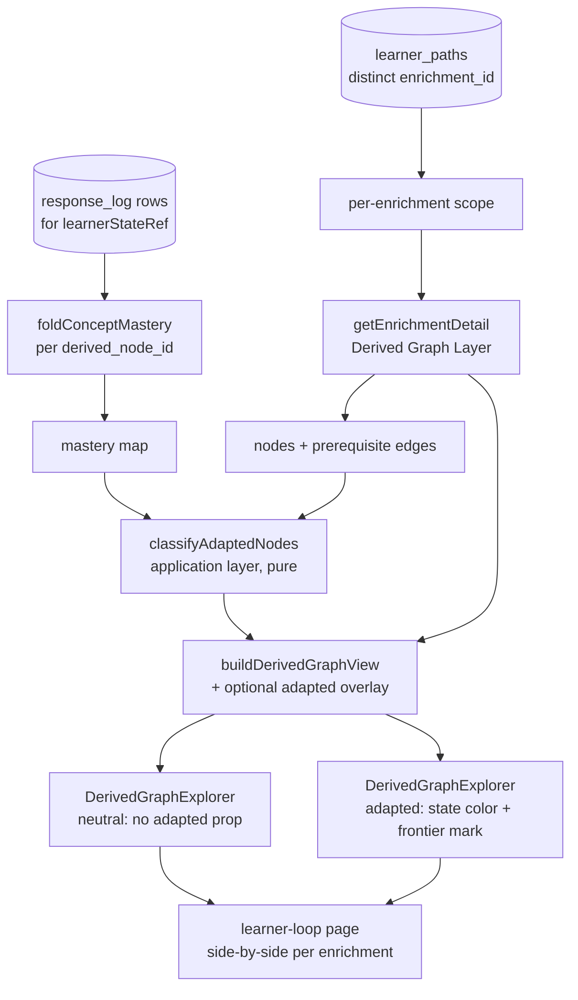

# feat: Adapted-graph comparison view + difficulty-ordering evaluation

## Summary

Add a per-learner Admin Lab view that renders one learner's Derived Graph Layer in two side-by-side states — neutral and learner-adapted (mastered / frontier / locked) — by reusing the single `DerivedGraphExplorer` renderer with a deterministic learner-state overlay, and run a rule-14 difficulty-ordering evaluation of `intrinsic-fused-v1` across the full manifest. The view makes per-learner adaptation legible; the evaluation classifies where intrinsic ordering is plausible and where it distorts, feeding a separately-scoped difficulty fix.

---

## Problem Frame

The recall/adaptive-path loop runs end-to-end across all manifest fixtures at `EXPERIMENT_ONLY` trust, but a learner's adaptation is invisible: it surfaces only as a projected path list and a card-coverage table in `LearnerLoopReview`. There is no way to *see* how responses reshape the graph — which nodes are mastered, which is the working frontier, what is locked behind unmet prerequisites.

The tempting next step — learner-calibrated (population) difficulty (IRT / Bradley-Terry / KT) — is data-blocked: the product collects no real learner responses yet, and fitting on the synthetic simulator would be circular and would violate AGENTS rules 11/13/14. The durable move is to make the existing adaptation legible and to inspect the difficulty signal that already orders paths, so real defects surface before any model is fit on real data later (see origin: `docs/brainstorms/2026-06-20-adapted-graph-view-and-difficulty-eval-requirements.md`).

This work is read-and-projection only. The overlay is a deterministic classification over primitives that already exist (`foldConceptMastery`, `selectFrontierTarget`, the ≈0.7 threshold); no neural surface and no published-graph mutation are introduced.

---

## Requirements

**Adapted-graph comparison view**

- R1. The per-learner review page renders the enrichment's Derived Graph Layer in two states — neutral and learner-adapted — scoped to one learner and one enrichment.
- R2. The adapted overlay classifies each derived node as mastered, frontier (ready and unmastered), or locked (a direct prerequisite unmastered), using the existing mastery fold and frontier readiness at the existing threshold (≈0.7).
- R3. The view behaves identically for real and synthetic responses and shows each response's source, so seeded rows stay distinguishable from real ones.
- R4. The neutral and adapted panels reuse the single existing `DerivedGraphExplorer` renderer with learner state as an optional overlay input; no second graph renderer is introduced.
- R5. Each rendered graph retains an equivalent textual node-and-edge listing for non-visual inspection.
- R6. Node provenance (`document_anchored` / `source_mentioned` / `llm_grounded`) and cardless no-card facts stay visible in both panels; a cardless node on the path is rendered and flagged, never silently dropped.
- R7. Each node's persisted intrinsic difficulty score is surfaced as a visual signal (node size) so an operator can spot ordering defects; the neural rationale is not shown (deferred with the difficulty follow-up).

**Difficulty-ordering evaluation (analysis only)**

- R8. Produce a rule-14 evaluation of `intrinsic-fused-v1` ordering across the full current manifest (all domains), not only the 3-domain 2026-06-18 set, saved under `tmp/`.
- R9. The evaluation checks whether the broad / evidence-thin over-scoring defect is systemic, with concrete per-domain foundational→advanced ordering examples and a `PASS` / `FIX_FIRST` / `EXPERIMENT_ONLY` / `BLOCKED` classification.
- R10. No scoring-formula, fusion-weight, component-shape, or rationale-persistence code change ships in this task; the evaluation only classifies quality and feeds the deferred follow-up.

**Guards**

- R11. No population difficulty calibration (IRT / Bradley-Terry / KT) and no fitting of any difficulty or learner model on synthetic responses.
- R12. The view is read and projection only; it never mutates the published asserted graph or the Derived Graph Layer.

---

## Key Technical Decisions

- KTD1 — Overlay is a deterministic classification, in the application layer. The mastered/frontier/locked classification is a pure function added next to `selectFrontierTarget`, reusing the same mastery threshold, uncertain-edge filter, and direct-prerequisite readiness rule. The classifier and `selectFrontierTarget` share one readiness helper so there is a single source of truth for "what is ready" (AGENTS rule 18). No new neural call; the overlay inherits the mastery fold's `EXPERIMENT_ONLY` trust.
- KTD2 — Reuse the single renderer via an optional prop (R4). `DerivedGraphExplorer` gains an optional `adapted` input. Neutral mode is the component with the prop absent — byte-identical to today's enrichment-page render. No second renderer, no forked component.
- KTD3 — Difficulty encodes as node size; learner state encodes as node color (R7). Size is currently uniform and carries no signal, so mapping difficulty → node diameter composes cleanly with both panels' coloring. The neutral panel keeps node-kind/grounding coloring; the adapted panel recolors by learner state (mastered / frontier / locked) and marks the selected frontier target. The numeric difficulty stays in the textual list. A color ramp was rejected — it collides with the existing node-kind and grounding color semantics.
- KTD4 — Side-by-side, one panel-pair per enrichment. Neutral and adapted render as two canvases side by side (matches the origin's "side by side"; lets an operator compare at a glance). A learner spanning multiple enrichments gets one neutral/adapted pair per distinct enrichment rather than a single picked enrichment, so no enrichment is silently truncated.
- KTD5 — Enrichment scope comes from the learner's persisted paths (R12). Each `learner_paths` row carries `enrichment_id`; the graph panel consumes that enrichment's Derived Graph Layer via the existing read-only `getEnrichmentDetail`. Nothing is recomputed in the UI.
- KTD6 — Difficulty evaluation reads persisted scores only (R10/R11). The evaluation inspects `concept_difficulties` (`intrinsic-fused-v1`) for an existing or freshly-run full-manifest enrichment and writes a `tmp/` artifact. No scoring/fusion/rationale code is touched.

---

## High-Level Technical Design

The overlay is a read-only projection: the response log folds to a per-node mastery map, the map plus the enrichment's edges classify each node, and the classification rides into the renderer as an optional input. The neutral panel is the same render path with no classification.



Per-node classification (directional sketch, not implementation spec). It reuses the same `excludeUncertain` edge filter and ≈0.7 threshold as `selectFrontierTarget`; `mastery` is the folded learner state.

```
for each derived node n in the enrichment:
  if mastery(n) >= threshold                          -> "mastered"
  else if every direct prerequisite of n is mastered  -> "frontier"   (ready + unmastered)
  else                                                -> "locked"     (a direct prereq unmastered)
selectedFrontierTarget = selectFrontierTarget(...)    # the one hardest ready unmastered node, marked distinctly
```

A node with no inbound prerequisite edges has the "every direct prerequisite mastered" predicate vacuously true, so an unmastered root classifies as frontier (AE1).

---

## Implementation Units

### U1. Adapted-node classification in the application layer

- Goal: a pure function that classifies every derived node of an enrichment as mastered / frontier / locked for a given learner state, and reports the selected frontier target — reusing the existing readiness and threshold semantics.
- Requirements: R2, R11 (advances), F1
- Dependencies: none
- Files:
  - `packages/application/src/adaptivePathProjection.ts` (add `classifyAdaptedNodes`; extract a shared direct-prerequisite-readiness helper used by both `selectFrontierTarget` and the new classifier)
  - `packages/application/src/index.ts` (export `classifyAdaptedNodes` and the adapted-state type)
  - `packages/application/src/adaptivePathProjection.test.ts` (new or extend if present)
- Approach: take `{ nodeIds, prerequisiteEdges, difficulties, learnerState, masteryThreshold?, excludeUncertain? }` and return a per-node map of `"mastered" | "frontier" | "locked"` plus `selectedFrontierTarget`. Filter uncertain edges with the same default as the projection (`excludeUncertain = true`). Refactor the direct-prerequisite map and `isMastered` predicate already inside `selectFrontierTarget` into one shared helper so readiness has a single definition (KTD1, AGENTS rule 18). Classify over all nodes in the enrichment, not only a target's ancestor scope, because the view renders the whole layer.
- Patterns to follow: `selectFrontierTarget` and `projectLearnerPath` in `packages/application/src/` — pure, `LearnerStatePort`-driven, no store/clock.
- Test scenarios:
  - Covers AE1. Learner with empty mastery: every node unmastered; nodes with no unmastered direct prerequisite (roots) classify as frontier; deeper nodes classify as locked.
  - Covers AE2. Learner who mastered a node's direct prerequisites: that node is frontier, its mastered prerequisites are mastered, and nodes still depending on an unmastered prerequisite are locked.
  - Threshold boundary: mastery exactly at threshold (0.7) classifies as mastered; just below stays unmastered.
  - Uncertain edges excluded by default — an uncertain prerequisite does not make a node locked (consistent with `projectLearnerPath`); togglable via `excludeUncertain: false`.
  - `selectedFrontierTarget` equals `selectFrontierTarget` output for the same inputs (shared-helper parity); falls back to the goal/empty case when nothing is ready and unmastered.
  - A node with all prerequisites mastered but itself mastered classifies mastered, not frontier.
- Verification: the new tests pass under the package's `tsx --test` runner; `selectFrontierTarget`'s existing behavior is unchanged after the helper extraction.

### U2. Expose overlay inputs from the learner-loop loader

- Goal: give the page, per distinct enrichment in the learner's paths, the Derived Graph Layer plus the learner's folded mastery and a response-source summary — all read-only.
- Requirements: R1, R3, R12, F1
- Dependencies: U1
- Files:
  - `apps/admin-lab/src/lib/learnerLoop.ts` (extend `getLearnerLoopDetail` to also return `masteryByNode` and a `responseSourceSummary`; add `getLearnerAdaptedGraphs(learnerStateRef)` composing it with `getEnrichmentDetail` + `classifyAdaptedNodes`; add a pure helper that dedupes `paths` to distinct enrichments, latest-first)
  - `apps/admin-lab/src/lib/enrichments.ts` (extend the node query in `getEnrichmentDetail` with a `LEFT JOIN cards ON cards.derived_node_id = n.derived_node_id` and populate `hasCard`)
  - `apps/admin-lab/src/lib/derivedGraph.ts` (own the `hasCard: boolean` field on the `DerivedGraphNode` interface — the loader-facing type the JOIN populates)
  - `apps/admin-lab/src/lib/learnerLoop.test.ts` (new — for the pure helpers only)
- Approach: fold the already-loaded response rows to a mastery map with `foldConceptMastery` (do not re-query). Build a `LearnerStatePort`-shaped object from the map and call `classifyAdaptedNodes` per distinct enrichment. `responseSourceSummary` counts `synthetic` vs `human` rows so the page can badge a learner's data origin (R3). Dedupe `paths` by `enrichment_id` keeping the latest (resubmits append new path rows). Card presence is an enrichment-level fact (cards are keyed by `derived_node_id`), so `hasCard` is loaded once in `getEnrichmentDetail` and is available to BOTH the neutral and adapted panels (R6 says both). Keep `withClient` read-only — no write port is imported here (R12).
- Patterns to follow: the existing read-only `withClient` loaders in `learnerLoop.ts` and `enrichments.ts`; `foldConceptMastery` / `loadResponseLogLearnerState` in `@lrnki/application`.
- Test scenarios:
  - Pure dedupe helper: paths across two enrichments yield two scope entries; two paths in one enrichment collapse to one (latest by `created_at`).
  - Pure source-summary helper: mixed `synthetic` + `human` rows produce correct counts; all-synthetic and all-human edge cases.
  - Pure mastery-map assembly: rows fold to the same per-node mastery `foldConceptMastery` produces (graded outranks self-report; latest graded wins).
  - Test expectation: the DB-bound `getLearnerAdaptedGraphs` / `getLearnerLoopDetail` SQL paths are verified by real-use inspection in U6/manual review, not unit tests (they require a live Postgres and follow the established untested-loader pattern); only the extracted pure helpers carry unit scenarios.
- Verification: pure helpers pass under `tsx --test`; loading a real learner returns one scope entry per distinct enrichment with a populated classification and source summary.

### U3. Overlay-aware view-model in `derivedGraph.ts`

- Goal: extend the pure view-model so cytoscape and textual node models optionally carry the adapted state and always carry the difficulty value and cardless flag, with neutral mode unchanged.
- Requirements: R4, R5, R6, R7
- Dependencies: U1, U2 (consumes the `hasCard` field U2 adds to `DerivedGraphNode`)
- Files:
  - `apps/admin-lab/src/lib/derivedGraph.ts` (thread an optional `adapted` classification into `buildDerivedGraphView` and map `hasCard` → `cardless`; add `adaptedState`, `isFrontierTarget`, and `cardless` to the cytoscape/textual node shapes; keep `difficulty` already present)
  - `apps/admin-lab/src/components/DerivedGraphExplorer.test.tsx` (extend the existing pure view-model tests)
- Approach: `buildDerivedGraphView(detail, adapted?)` — when `adapted` is absent the output is identical to today (neutral). When present, each node gains `adaptedState` and an `isFrontierTarget` marker; both representations carry `cardless` (derived from `hasCard`). The textual list already shows difficulty; add the adapted state and a "no card" marker there too (R5/R6). Keep the function JSX-free and pure.
- Patterns to follow: `buildDerivedGraphView` and the `DerivedGraphView` types already in `derivedGraph.ts`; the existing pure-view-model tests in `DerivedGraphExplorer.test.tsx`.
- Test scenarios:
  - Neutral mode (no `adapted` arg) produces the same node/edge view as today — no `adaptedState`, existing assertions still hold.
  - Adapted mode tags each node with its classification and marks the single frontier target.
  - Cardless node carries `cardless: true` in both cytoscape and textual representations.
  - Difficulty value is present on every node for size mapping; null difficulty is preserved (not coerced to 0).
  - Covers R5. Cytoscape and textual node sets stay equal in length and describe the same nodes in adapted mode.
- Verification: extended tests pass under `tsx --test`; neutral-mode snapshot of node/edge shapes is unchanged.

### U4. Render overlay color, frontier mark, and difficulty-size in `DerivedGraphExplorer`

- Goal: teach the single renderer to draw the learner-state overlay and difficulty-as-size while leaving neutral rendering intact.
- Requirements: R4, R5, R6, R7
- Dependencies: U3
- Files:
  - `apps/admin-lab/src/components/DerivedGraphExplorer.tsx` (add optional `adapted` prop; conditional node coloring by `adaptedState`; distinct style for the frontier target; map `difficulty` → node `width`/`height`; render `cardless` marker and `adaptedState` in the textual list; header copy reflects neutral vs adapted)
- Approach: when `adapted` is present, select node `background-color` by state (mastered / frontier / locked) using existing theme tokens, and give the frontier target a stronger border. Map difficulty to a bounded size range in both modes (null difficulty → base size). Keep node-kind shape and grounding dashed-border semantics (those still mean what they mean). Add a small legend so the three states and the size encoding are self-describing. The textual list gains an adapted-state badge and a "no card" badge for cardless nodes (R6).
- Patterns to follow: the existing cytoscape `style` selectors and theme-token `color()` helper already in `DerivedGraphExplorer.tsx`; shadcn `Badge` usage in the textual list.
- Execution note: keep the neutral path a no-op change — verify the enrichment-detail page renders identically before wiring the adapted path.
- Test scenarios: the behavioral logic this unit renders (classification, frontier target, cardless, difficulty value) is unit-tested in U1 and U3; the imperative cytoscape effect is DOM/canvas glue that the codebase does not unit-test (the existing component has only pure view-model tests, per AGENTS rule 14). Verify by real-use inspection: (a) mastered/frontier/locked nodes carry visibly distinct colors; (b) the selected frontier target is marked distinctly from other frontier nodes; (c) node size scales with difficulty and a null-difficulty node renders at base size; (d) a cardless node shows the "no card" marker; (e) a legend names the three states and the size encoding.
- Verification: the enrichment-detail page is visually unchanged (neutral); on the learner page the adapted panel colors nodes by state, marks the frontier target, and scales nodes by difficulty, with a legend and an equivalent textual listing.

### U5. Wire the learner page to render side-by-side panel-pairs per enrichment

- Goal: render, per distinct enrichment in the learner's paths, a neutral and adapted `DerivedGraphExplorer` side by side with a synthetic/real source badge, alongside the existing responses, conflicts, and coverage.
- Requirements: R1, R3, R6, F1
- Dependencies: U2, U4
- Files:
  - `apps/admin-lab/src/app/admin/lab/learner-loop/[learnerStateRef]/page.tsx` (load `getLearnerAdaptedGraphs` alongside `getLearnerLoopDetail`)
  - `apps/admin-lab/src/components/LearnerLoopReview.tsx` (render the per-enrichment neutral/adapted pair and the source badge; keep the existing sections)
- Approach: for each scope entry from `getLearnerAdaptedGraphs`, render a section with two `DerivedGraphExplorer` instances — neutral (no `adapted` prop) and adapted (classification passed) — in a responsive side-by-side layout that stacks on narrow viewports. Badge the learner's data origin from `responseSourceSummary` (synthetic vs real, R3). Render even when adaptation equals neutral (AE1) — never hide a panel.
- Patterns to follow: `LearnerLoopReview.tsx` Card/section structure and the enrichment-detail page's `DerivedGraphExplorer` usage; the existing responsive grid in `DerivedGraphExplorer.tsx`.
- Test scenarios: the per-enrichment grouping and source-summary logic are unit-tested in U2; Next page composition is not unit-tested in this codebase (no page has render tests). Verify by real-use inspection against the acceptance examples: (a) Covers AE3 — a synthetic learner shows neutral + adapted side by side per enrichment, badged synthetic; (b) Covers AE1 — a learner with no mastery shows the adapted panel matching neutral; (c) Covers AE2 — a learner who mastered prerequisites shows the mastered/frontier/locked split; (d) Covers AE4 — a cardless path node is present and flagged; (e) a multi-enrichment learner shows one pair per enrichment, none hidden.
- Verification: opening a synthetic learner shows neutral + adapted side by side per enrichment, badged synthetic; a learner who mastered prerequisites shows the expected mastered/frontier/locked split (AE2); a cardless path node is present and flagged (AE4).

### U6. Difficulty-ordering evaluation across the full manifest (rule-14, analysis only)

- Goal: a rule-14 read of `intrinsic-fused-v1` ordering across all manifest domains, classifying whether the broad/thin over-scoring defect is systemic, saved under `tmp/`.
- Requirements: R8, R9, R10, R11
- Dependencies: none (independent of U1–U5; reads persisted scores)
- Files:
  - `tmp/2026-06-20-intrinsic-difficulty-full-manifest/rule-14-evaluation.md` (the artifact; gitignored `tmp/` per AGENTS rule 10)
- Approach: ensure a published graph version + enrichment spanning all manifest domains exists (software engineering / Rust, molecular biology, economics, educational technology, machine learning systems). If the latest enrichment does not cover all five, run the worker enrich path with real LLM calls to produce one — no scoring code change (R10). Read persisted `concept_difficulties` (method `intrinsic-fused-v1`), and for each domain list concrete foundational→advanced ordering examples and the neural-vs-fused components for broad/evidence-thin nodes. Judge whether the over-scoring defect (broad `source_mentioned` nodes scoring high relative to thin evidence) is systemic across domains. Classify `PASS` / `FIX_FIRST` / `EXPERIMENT_ONLY` / `BLOCKED` and state caveats (mark `BLOCKED` if a model/service/fixture is unavailable). Follow the prior artifact's structure (`tmp/2026-06-18-intrinsic-difficulty/rule-14-evaluation.md`).
- Patterns to follow: the prior rule-14 evaluation at `tmp/2026-06-18-intrinsic-difficulty/rule-14-evaluation.md`; the worker enrich command in `apps/kg-worker/src/knowledgeGraphWorker.ts`; the real-use-quality-evaluation skill note shape.
- Execution note: this is real-use evaluation, not code — produce the artifact, do not modify scoring/fusion/rationale code (R10/R11). The conclusion (where ordering is plausible vs distorts) is the deliverable that triggers the deferred difficulty fix.
- Test scenarios: none — this is an analysis artifact, not behavior-bearing code. The "test" is the rule-14 classification itself.
- Verification: the artifact exists under `tmp/`, covers every manifest domain with concrete ordering examples, gives a single overall classification with per-domain evidence, and ships no scoring/fusion/rationale code change.

---

## Acceptance Examples

- AE1. Covers R2 (U1, U5). Given a learner with no responses, the adapted panel matches the neutral panel: every node unmastered, the frontier sitting at the prerequisite roots.
- AE2. Covers R2 (U1, U5). Given a learner who has mastered a node's direct prerequisites, that node renders as frontier, its prerequisites render as mastered, and nodes still depending on unmastered prerequisites render as locked.
- AE3. Covers R3 (U2, U5). Given a synthetically prefilled learner, the overlay renders the same as for a real learner and the responses/data are badged as synthetic.
- AE4. Covers R6 (U2, U3, U5). Given a cardless derived node on the path, it still appears in the graph flagged as a no-card fact, not omitted.

---

## Scope Boundaries

### Deferred for later (own scope)

- Difficulty scoring-formula fixes (broad/thin over-scoring), fusion-weight tuning, and neural-rationale persistence — triggered once this view surfaces the defects (R7's rationale display rides with this).
- Population difficulty calibration (IRT / Bradley-Terry / KT), once the Game UI and stable per-learner calibration exist.

### Outside this product's identity (for now)

- The learner-facing Domain-Agnostic study Game UI itself.
- A real (non-synthetic) learner response-capture surface.

### Deferred to Follow-Up Work

- None. The whole brainstorm scope is covered by U1–U6; no plan-local sequencing was split out.

---

## Risks & Dependencies

- Two cytoscape instances per enrichment increase per-page layout cost (each runs an async ELK layout). Mitigation: usually one enrichment per learner; bounded canvas heights and the existing stale-guard teardown in `DerivedGraphExplorer`. Watch for jank on multi-enrichment learners.
- The difficulty evaluation may need a fresh full-manifest enrichment with real LLM calls if the latest enrichment does not span all five domains — time and model-availability dependent. If a required model/service is unavailable, the evaluation is `BLOCKED` (rule-14), not silently skipped.
- `learner_paths` can hold multiple rows per enrichment (resubmits append new path ids); the dedupe helper (U2) must keep distinct enrichments only, latest-first, or the page renders duplicate panels.
- The overlay inherits the mastery fold's `EXPERIMENT_ONLY` trust and the intrinsic-difficulty `EXPERIMENT_ONLY` trust (ADR-0024); the view is for operator inspection, not an authoritative learner model. Prerequisite edges remain the primary path constraint; difficulty is secondary.

Dependencies / assumptions carried from origin:

- The mastery fold, `selectFrontierTarget`, and the ≈0.7 threshold are reused unchanged as the source of the overlay's classification.
- `getLearnerLoopDetail` already resolves the learner's enrichment scope and paths; the graph panel consumes that same enrichment's Derived Graph Layer via `getEnrichmentDetail`.
- The synthetic simulator stays behind its port; nothing here is redundant to delete (AGENTS rule 18 has no superseded path to remove).

---

## Sources / Research

- Difficulty method: `packages/application/src/intrinsicDifficulty.ts` (`intrinsic-fused-v1`, `0.55·neural + 0.45·structural`, numeric components only — no rationale persisted).
- Adaptation logic to reuse: `packages/application/src/adaptivePathProjection.ts` (`selectFrontierTarget`, `ADAPTIVE_MASTERY_THRESHOLD = 0.7`), `packages/application/src/learnerPathProjection.ts` (`projectLearnerPath`), `packages/application/src/responseLogLearnerState.ts` (`foldConceptMastery`, `loadResponseLogLearnerState`).
- Renderer + pure view-model to extend: `apps/admin-lab/src/components/DerivedGraphExplorer.tsx`, `apps/admin-lab/src/lib/derivedGraph.ts`, `apps/admin-lab/src/components/DerivedGraphExplorer.test.tsx`.
- Loaders + page to extend: `apps/admin-lab/src/lib/learnerLoop.ts`, `apps/admin-lab/src/lib/enrichments.ts`, `apps/admin-lab/src/app/admin/lab/learner-loop/[learnerStateRef]/page.tsx`, `apps/admin-lab/src/components/LearnerLoopReview.tsx`.
- Manifest scope for the evaluation: `fixtures/manifest.json` — 6 sources across software engineering (Rust), molecular biology, economics, educational technology, machine learning systems.
- Prior difficulty rule-14 read (3 domains, broadly plausible, over-scoring defect noted): `tmp/2026-06-18-intrinsic-difficulty/rule-14-evaluation.md`.
- Worker enrich entry point: `apps/kg-worker/src/knowledgeGraphWorker.ts` (`enrichGraphVersion`, `createIntrinsicDifficultyPort`).
- Governing decisions: ADR-0024 (intrinsic difficulty now, calibration data-blocked), ADR-0014 (defer learner modeling), ADR-0025 (Card Bank / Response Log keyed to derived nodes, enrichment-scoped learner history), CONTEXT.md (asserted layer has no edges).
