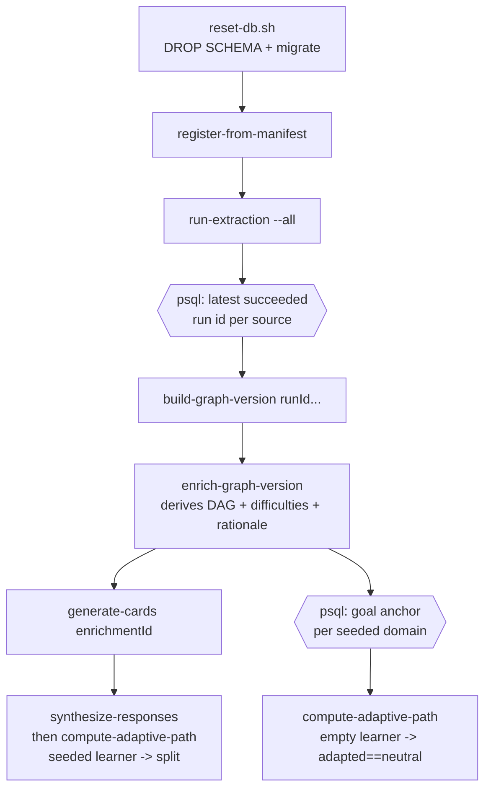
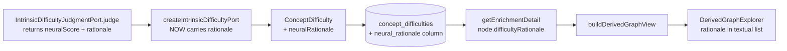

# feat: Repeatable demo-seed + difficulty-rationale persistence for the adapted-graph view

## Summary

Make the just-shipped neutral/adapted graph pair actually reachable and diagnostic. The view code is built and wired, but no learner can render it: the database holds accumulated dev cruft (301 graph versions, 265 enrichments, ~120 learners — ≈115 path-less), and the only full-manifest difficulty enrichment has zero cards and zero learner paths. This plan adds a committed, repeatable demo-seed that resets to one coherent full-manifest state with a few named demo learners, then persists the neural difficulty rationale the judge already produces but the port currently drops — surfacing it on adapted nodes so an operator can explain the broad/thin ordering distortions the rule-14 evaluation found.

---

## Problem Frame

The adapted-graph view (prior plan `docs/plans/2026-06-20-001-feat-adapted-graph-view-difficulty-eval-plan.md`, U1–U6) shipped: `classifyAdaptedNodes`, the overlay loader, the view-model, and the renderer all landed, and the page/component wiring is staged and complete (it renders a neutral + adapted `DerivedGraphExplorer` pair per distinct enrichment, with an explicit "No adapted graph scope" empty-state). The pair is "not visible" for a data reason, not a code reason:

- The freshest full-manifest enrichment `223cfb32` (50 nodes across all five domains, 50 persisted difficulties — the subject of `tmp/2026-06-20-intrinsic-difficulty-full-manifest/rule-14-evaluation.md`) has **0 cards and 0 learner paths**. No learner can render an adapted pair over it.
- The only enrichment with cards + paths + difficulties is the older `41b80e67` (the teachable-cards rerun). Its named learners (`econ-learner-01`, `mt-*`) still resolve, but they are buried under ~115 path-less card-validation learners that each render the empty-state, so the working views are effectively undiscoverable.

The durable fix is a committed, repeatable seed that produces one clean state from empty (AGENTS rule 9 permits aggressive reset; rule 8 keeps a single migration). The seed makes the pair visible; the prior plan's evaluation (and the brainstorm's deferred R7) earned the second half: the rule-14 read found intrinsic ordering `EXPERIMENT_ONLY` with concentrated broad/evidence-thin distortions (e.g. molecular `relationship between DNA structure and replication` fused 0.472 > core `DNA replication` 0.382) and named the actionable lever — "neural difficulty rationales are not stored ... only numeric components are inspectable." The judge already returns `{ neuralScore, rationale }` through a validated forced-tool schema; `createIntrinsicDifficultyPort` keeps the score and drops the rationale. Persisting and surfacing it makes the now-visible view diagnostic, with no scoring-formula change (brainstorm R10; AGENTS rules 16/17). See origin: `docs/brainstorms/2026-06-20-adapted-graph-view-and-difficulty-eval-requirements.md`.

---

## Requirements

**Repeatable demo-seed and visibility**

- R1. A committed, repeatable seed produces one coherent state from an empty database: a published full-manifest graph version, one enrichment carrying difficulties, a Card Bank, and a few named demo learners with synthetic responses and adaptive paths over that single enrichment.
- R2. The seed runs to completion with no manual steps beyond invoking it, and is reproducible after a hard reset.
- R3. After seeding, opening a seeded learner renders the neutral/adapted pair (the brainstorm's R1), not the "No adapted graph scope" empty-state.
- R4. The seed creates at least one learner whose adapted overlay equals neutral (empty mastery), and at least one whose synthetic responses produce a mastered/frontier/locked split, badged as synthetic.

**Difficulty-rationale persistence and display**

- R5. The neural rationale the difficulty judge returns is persisted to `concept_difficulties` rather than dropped at the port boundary.
- R6. The adapted view surfaces each node's persisted rationale alongside its difficulty score (the brainstorm's deferred R7), labeled as a generated rationale, never as a source quote.
- R7. No scoring-formula, fusion-weight, component-shape, or difficulty-prompt change ships; the rationale already exists at the validated port boundary and is only stopped from being discarded.

**Guards**

- R8. No change to concept admission, CEP extraction, graph-version build, or the published asserted-graph identity; the only schema change is the additive `neural_rationale` column on difficulty evidence, applied by editing the single migration in place (AGENTS rules 8, 18).
- R9. No population difficulty calibration (IRT / Bradley-Terry / KT) and no fitting of any difficulty or learner model on synthetic responses (ADR-0024, ADR-0014).

---

## Key Technical Decisions

- KTD1 — Hard reset via a committed repeatable seed, not a surgical prune. The accumulated 301 versions / 265 enrichments / ~120 learners are the visibility problem; clearing only path-less learners would preserve cruft and would not be reproducible. A committed seed survives every future reset (rule 9) and gives real-use evaluation a known starting state.
- KTD2 — Seed the minimum set that exercises every acceptance example. Pick a small number of goal anchors (one or two domains with clear prerequisite chains, e.g. molecular biology and ML systems per the rule-14 read). For each goal, seed an *empty* learner (adaptive path computed with no responses → adapted equals neutral, AE1) and a *synthetically-seeded* learner (`synthesize-responses` then adaptive path → mastered/frontier/locked split, AE2/AE3). This covers AE1–AE4 without simulating many learners.
- KTD3 — Rationale gets a dedicated `neural_rationale text` column, not a `components` key. `ConceptDifficulty.components` is typed `Record<string, number>` and is semantically numeric; a string does not belong there. A dedicated column mirrors the existing `enrichment_grounding_bundles.rationale` column. Because the seed hard-resets, the column is added by editing the single `0000_initial_lrnki_schema.sql` in place — no ALTER migration (rules 8, 18).
- KTD4 — No scoring change; the rationale passthrough is a pure plumbing fix. `createIntrinsicDifficultyPort` already receives `judgment.rationale`; it stops dropping it. The fused score, weights, structural terms, and prompt are untouched (R7; AGENTS rules 16/17). A measured broad/thin down-weight judge stays deferred — the rule-14 read found the distortion concentrated, not systemic, so it has not yet earned a new symbolic/neural gate.
- KTD5 — Seed orchestration lives in `scripts/` over the stable worker CLI. A thin `scripts/seed-demo.sh` shells `reset-db.sh` then the existing worker subcommands, using small `psql -tA` queries to resolve the run IDs (for `build-graph-version`) and the per-domain goal anchors (for `compute-adaptive-path`) between steps. It sits beside `reset-db.sh`, is obviously disposable, and treats the worker commands as the operation surface. If target/run-id resolution proves fragile in bash, fall back to a `tsx` orchestrator reusing the worker's `buildContext()` (deferred to implementation).

---

## High-Level Technical Design

The seed is a linear orchestration over existing worker commands; the rationale fix is a passthrough along an existing data path.

Rationale data path (the fix stops a drop; everything else already exists):

---

## Implementation Units

### U1. Commit and verify the staged adapted-view wiring

- Goal: land the already-staged page/component wiring so the neutral/adapted pair renders, and confirm it renders against a seeded learner.
- Requirements: R3
- Dependencies: none to commit; visual verification depends on U2
- Files:
  - `apps/admin-lab/src/app/admin/lab/learner-loop/[learnerStateRef]/page.tsx` (staged: loads `getLearnerAdaptedGraphs` in parallel, passes to `LearnerLoopReview`)
  - `apps/admin-lab/src/components/LearnerLoopReview.tsx` (staged: renders the per-enrichment neutral/adapted pair, source badge, and empty-state)
- Approach: the diff is already staged and complete from the prior plan's U5; this unit commits it and verifies behavior end-to-end once data exists (U2). No new code unless verification reveals a wiring defect.
- Patterns to follow: existing `LearnerLoopReview` Card/section structure; the enrichment-detail page's `DerivedGraphExplorer` usage.
- Test scenarios: page composition is not unit-tested in this codebase (no page has render tests, per AGENTS rule 14). Verify by real-use inspection after U2: a seeded learner shows the neutral and adapted panels side by side; the empty-state appears only for a learner with no path.
- Verification: opening a seeded learner shows the pair; a path-less learner shows the empty-state alert.

### U2. Repeatable demo-seed script

- Goal: a committed script that resets the database and produces one coherent full-manifest state with a few named demo learners, reproducibly.
- Requirements: R1, R2, R4
- Dependencies: none (uses existing worker commands)
- Files:
  - `scripts/seed-demo.sh` (new — orchestrates `reset-db.sh` + worker subcommands + `psql -tA` lookups)
  - `package.json` (add a `seed:demo` script entry pointing at it)
- Approach: sequence `scripts/reset-db.sh` → `worker:kg register-from-manifest` → `worker:kg run-extraction --all` → resolve the latest succeeded `extraction_runs` id per source via `psql -tA` → `worker:kg build-graph-version <runId>...` → `worker:kg enrich-graph-version <graphVersionId>` → `worker:kg generate-cards <enrichmentId>`. Then, for each seeded goal: resolve a goal anchor `concept_id` from `derived_graph_nodes` (e.g. a high-topo-depth anchor in the chosen domain) via `psql -tA`; create an empty learner with `compute-adaptive-path <enrichmentId> <goalAnchorConceptId> <learnerRef>` (no responses → adapted equals neutral); create a seeded learner with `synthesize-responses <enrichmentId> <targetDerivedNodeId> <learnerRef>` then `compute-adaptive-path` for the same goal. Note the command arg asymmetry — `compute-adaptive-path` takes an anchor `concept_id`, `synthesize-responses` takes a `derived_node_id`; resolve each explicitly. Echo the published `graphVersionId`, `enrichmentId`, and seeded learner refs at the end so the operator knows what to open. Fail fast (`set -euo pipefail`).
- Patterns to follow: `scripts/reset-db.sh` and `scripts/migrate-db.sh` (bash + `psql`, `DATABASE_URL` default); the worker command surface in `apps/kg-worker/src/knowledgeGraphWorker.ts`.
- Execution note: this exercises real LiteLLM calls (extraction, enrichment, difficulty, cards, synthesis); requires the `.env` key and a running Postgres. If a model/service is unavailable the seed cannot complete — surface the failure, do not partially seed silently.
- Test scenarios: none — this is an operational script, not behavior-bearing library code (AGENTS rule 14). The "test" is a successful real run (U5 inspects its output).
- Verification: a fresh `pnpm seed:demo` on an empty database ends with a published full-manifest version, one enrichment with difficulties and cards, and at least one empty and one synthetically-seeded learner whose paths resolve; the script prints their refs.

### U3. Persist the neural difficulty rationale

- Goal: carry the rationale the judge returns all the way to `concept_difficulties` instead of discarding it.
- Requirements: R5, R7, R8
- Dependencies: none
- Files:
  - `packages/domain-core/src/index.ts` (add `neuralRationale: string` to `ConceptDifficulty`)
  - `packages/application/src/intrinsicDifficulty.ts` (set `neuralRationale: judgment.rationale` in the pushed `ConceptDifficulty`; no scoring change)
  - `packages/infrastructure-postgres/src/migrations/0000_initial_lrnki_schema.sql` (add `neural_rationale text NOT NULL` to `concept_difficulties`, edited in place)
  - `packages/infrastructure-postgres/src/PostgresEnrichmentStores.ts` (write the column at the `concept_difficulties` INSERT; select and map it in the difficulty read)
  - `packages/application/src/intrinsicDifficulty.test.ts` (assert the rationale passes through)
  - `packages/infrastructure-postgres/src/PostgresStores.test.ts` (extend the enrichment round-trip to cover `neural_rationale`)
- Approach: add the field to the domain type, populate it from `judgment.rationale` in `createIntrinsicDifficultyPort` (the validated port already returns it), add the column to the single migration (the hard reset recreates the table, so no ALTER), and write/read it in the Postgres store. Keep `components` strictly numeric (KTD3).
- Patterns to follow: the existing `enrichment_grounding_bundles.rationale` column and its write in `PostgresEnrichmentStores.ts`; the existing difficulty INSERT (~line 117) and read (~line 306).
- Test scenarios:
  - Rationale passthrough: a judge stub returning `{ neuralScore, rationale }` yields a `ConceptDifficulty` whose `neuralRationale` equals the stub's rationale; the fused `score` is unchanged from the pre-change formula for the same inputs. (Deterministic transform of model output, not an assertion about model judgment quality — AGENTS rule 11.)
  - Score-unchanged regression: an existing fused-score assertion still holds after the field is added.
  - Postgres round-trip: persisting and reloading a layer preserves `neuralRationale` verbatim on every difficulty row.
- Verification: tests pass under `tsx --test`; the live enrichment round-trip test passes against Postgres; a seeded enrichment's `concept_difficulties` rows carry non-empty `neural_rationale`.

### U4. Surface the rationale in the adapted view

- Goal: show each node's persisted difficulty rationale beside its difficulty score in the renderer, neutral mode unchanged.
- Requirements: R6
- Dependencies: U3 (reads the persisted field)
- Files:
  - `apps/admin-lab/src/lib/enrichments.ts` (select `neural_rationale` in the node difficulty join; map to `difficultyRationale: string | null` on the node)
  - `apps/admin-lab/src/lib/derivedGraph.ts` (carry `difficultyRationale` on the node view-model, both cytoscape and textual shapes, alongside the existing `difficulty`)
  - `apps/admin-lab/src/components/DerivedGraphExplorer.tsx` (render the rationale in the textual node list, labeled as a generated rationale)
  - `apps/admin-lab/src/components/DerivedGraphExplorer.test.tsx` (extend the pure view-model test)
- Approach: `difficultyRationale` follows the identical path `difficulty: number | null` already takes through the loader, view-model, and renderer. Show it in the textual list (where the numeric difficulty already appears) so it is legible without a tooltip; keep it labeled as generated, never a source quote (R6). Neutral and adapted both carry it (it is a node fact), but it is most useful next to the adapted size/color encoding.
- Patterns to follow: the existing `difficulty` field threading in `derivedGraph.ts` (lines ~36, ~127, ~167, ~185) and `enrichments.ts` (line ~136); the textual-list rendering already in `DerivedGraphExplorer.tsx`.
- Test scenarios:
  - View-model carries `difficultyRationale` on each node when present; `null` is preserved (not coerced to empty string) for nodes without a rationale.
  - Neutral and adapted node sets stay equal in length and describe the same nodes (consistent with the prior plan's R5 parity test).
- Verification: extended view-model tests pass; on a seeded learner page each node's rationale appears beside its difficulty, and the enrichment-detail page is otherwise unchanged.

### U5. Rule-14 difficulty re-read on the seeded full-manifest state

- Goal: a rule-14 read confirming the broad/thin distortions are now explainable via the persisted rationale, and judging whether a measured down-weight follow-up is earned — analysis only.
- Requirements: R7, R9 (verifies no scoring change shipped)
- Dependencies: U2, U3, U4
- Files:
  - `tmp/2026-06-20-002-difficulty-rationale/rule-14-evaluation.md` (the artifact; gitignored `tmp/` per AGENTS rule 10)
- Approach: against the freshly seeded enrichment, read the persisted `concept_difficulties` including `neural_rationale`, and for the broad/evidence-thin nodes the prior read flagged (e.g. molecular `relationship between DNA structure and replication`) record whether the now-visible rationale explains the high fused score. Re-confirm per-domain foundational→advanced ordering and classify `PASS` / `FIX_FIRST` / `EXPERIMENT_ONLY` / `BLOCKED`. State explicitly whether a measured broad/thin down-weight judge is now warranted as the next earned step, or whether rationale visibility alone is sufficient operator signal. No scoring/fusion/prompt code is touched.
- Patterns to follow: the prior artifact `tmp/2026-06-20-intrinsic-difficulty-full-manifest/rule-14-evaluation.md` and the real-use-quality-evaluation skill note shape.
- Execution note: analysis artifact, not code; mark `BLOCKED` if a required model/service/fixture is unavailable rather than fabricating a result.
- Test scenarios: none — this is an evaluation artifact (AGENTS rule 14).
- Verification: the artifact exists under `tmp/`, cites concrete rationales for the previously-unexplained broad/thin nodes, gives one overall classification, and recommends whether the deferred down-weight judge is earned.

---

## Acceptance Examples

- AE1. Covers R3, R4 (U1, U2). Given a freshly seeded empty learner, the adapted panel matches the neutral panel — every node unmastered, frontier at the prerequisite roots.
- AE2. Covers R4 (U2). Given a synthetically-seeded learner who mastered a node's direct prerequisites, that node renders as frontier, its prerequisites as mastered, and downstream nodes as locked.
- AE3. Covers R4 (U2). Given the synthetically-seeded learner, the responses are badged as synthetic.
- AE4. Covers R6 (U3, U4). Given a seeded enrichment, each rendered node shows its persisted difficulty rationale beside its difficulty score, labeled as generated.

---

## Scope Boundaries

### Deferred for later (own scope)

- A measured broad/thin down-weight judge or any difficulty scoring-formula / fusion-weight change — triggered only if the U5 read shows rationale visibility is insufficient (AGENTS rules 16/17; brainstorm R10).
- Population difficulty calibration (IRT / Bradley-Terry / KT), once the Game UI and stable per-learner calibration exist (ADR-0024).
- CEP Definition Passage precision cleanup (TODO #2), forced-tool transport hardening (TODO #3), and card-bank citation-exactness labeling (TODO #4) — separate concerns, not blocking this work.

### Outside this product's identity (for now)

- The learner-facing Domain-Agnostic study Game UI.
- A real (non-synthetic) learner response-capture surface.

### Deferred to Follow-Up Work

- None. U1–U5 cover the confirmed scope; no plan-local sequencing was split out.

---

## Risks & Dependencies

- The seed depends on real LiteLLM calls for extraction, enrichment, difficulty, cards, and synthesis. A model/service outage blocks a full reseed; the script must fail loudly, not seed partially. The U5 evaluation is `BLOCKED` (not skipped) if a required model is down.
- `build-graph-version` needs explicit run IDs and `compute-adaptive-path` needs a goal anchor `concept_id`; the seed resolves both via `psql` between steps. If bash/`psql` glue proves fragile, the fallback is a `tsx` orchestrator reusing `buildContext()` (KTD5) — exact resolution SQL is an implementation detail.
- Editing the single migration in place is correct only because the seed hard-resets (rules 8, 9, 18). Any environment not reset by the seed would need a manual reset to pick up the `neural_rationale` column; this is acceptable for an unreleased app with no production data.
- Adding `neural_rationale text NOT NULL` means every difficulty row must supply a rationale. The judge's forced-tool schema already requires `rationale`, so the port always has one; the column is safe as `NOT NULL`.
- The overlay and difficulty stay at `EXPERIMENT_ONLY` trust (ADR-0024); the view is for operator inspection, not an authoritative learner model. Prerequisite edges remain the primary path constraint.

---

## Sources / Research

- Root-cause evidence (live DB, 2026-06-20): full-manifest enrichment `223cfb32` has 50 nodes / 50 difficulties but 0 cards / 0 paths; enrichment `41b80e67` has 50 cards / 50 difficulties / named-learner paths; ~115 of ~120 learners are path-less.
- Difficulty drop point: `packages/application/src/intrinsicDifficulty.ts:27-50` (`judgment.rationale` received, only `neuralScore` kept). Judge contract: `packages/ports/src/index.ts:250-252` (`judge(): Promise<{ neuralScore; rationale }>`). Validated schema: `packages/infrastructure-litellm/src/intrinsicDifficultyAdapters.ts`.
- Difficulty type and storage: `ConceptDifficulty` at `packages/domain-core/src/index.ts:888-893` (`components: Record<string, number>`); `concept_difficulties` DDL at `packages/infrastructure-postgres/src/migrations/0000_initial_lrnki_schema.sql:507-515`; write/read at `packages/infrastructure-postgres/src/PostgresEnrichmentStores.ts:117,306`.
- Existing rationale-column precedent: `enrichment_grounding_bundles.rationale` (`PostgresEnrichmentStores.ts:59-60`).
- View plumbing to extend: `difficulty: number | null` at `apps/admin-lab/src/lib/derivedGraph.ts:36,127,167,185` and `apps/admin-lab/src/lib/enrichments.ts:136`.
- Worker command surface: `apps/kg-worker/src/knowledgeGraphWorker.ts:441-474` (`register-from-manifest`, `run-extraction`, `build-graph-version`, `enrich-graph-version`, `generate-cards`, `synthesize-responses`, `compute-adaptive-path`). Reset/migrate: `scripts/reset-db.sh`, `scripts/migrate-db.sh`.
- Prior difficulty rule-14 read: `tmp/2026-06-20-intrinsic-difficulty-full-manifest/rule-14-evaluation.md`.
- Governing decisions: ADR-0024 (intrinsic difficulty now, calibration data-blocked), ADR-0014 (defer learner modeling), ADR-0025 (Card Bank / Response Log keyed to derived nodes), AGENTS rules 8/9/16/17/18, CONTEXT.md (asserted layer has no edges).
