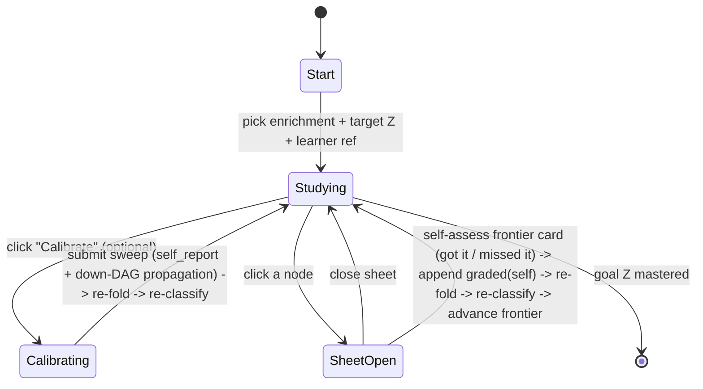
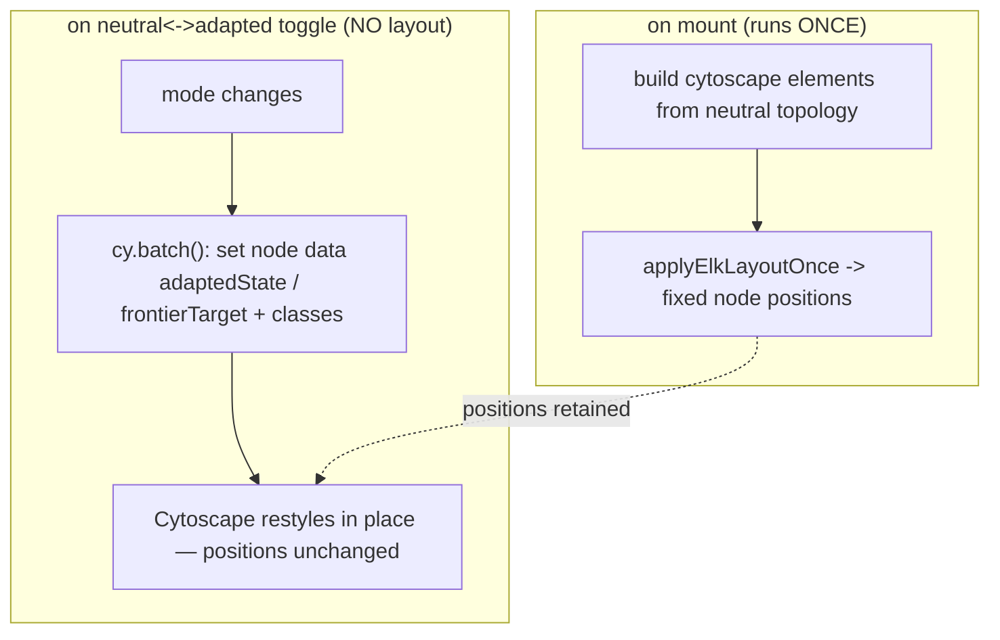
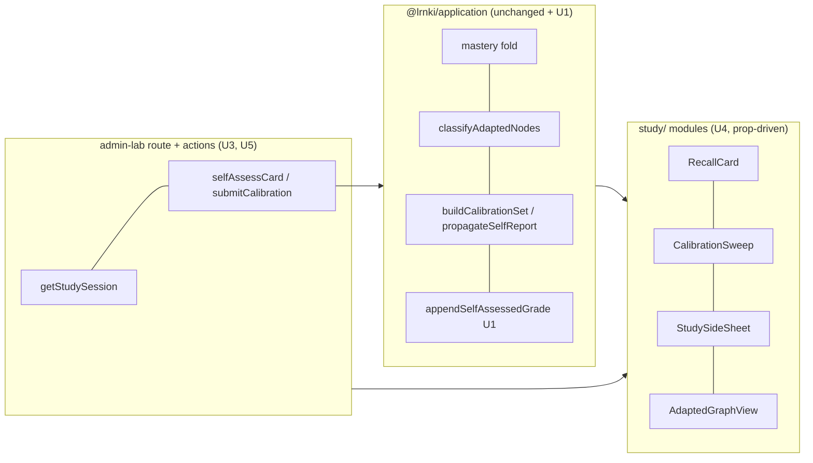

# feat: Learner-calibrated study loop (minimal proof)

## Summary

Add a learner-facing study loop to Admin Lab — built as transfer-ready modules — that drives the **existing** recall / adaptive-path loop with **real** self-assessed responses where the synthetic simulator drives it today. A learner picks a goal node `Z` in one enrichment's Derived Graph Layer, optionally declares prior knowledge through a card sweep, then studies only the unmet gap while a single pinned prerequisite graph re-shapes (mastered / frontier / locked) on each self-assessment. The proof is **divergence**: a learner who declares "I already know X and Y" visibly skips ahead through a different slice of the graph than a learner who knows nothing.

The durable core already exists and is reused unchanged: calibration-set building, down-DAG propagation, the mastery fold, frontier classification, the Card Bank, and the append-only Response Log. This phase adds (1) a small deterministic *self-assessed grade* append to the application core, (2) a single-canvas neutral/adapted toggle that never re-runs layout, and (3) the learner-facing modules + a dedicated Study route that write `responseSource`-tagged rows through the same append path the simulator uses.

Per the brainstorm and the user's planning answers: **calibration is optional**, launched from a separate "Calibrate" button rather than gating study; the **LLM-judge resubmit path is kept** (reused for study assessment next phase); the only removal this phase is the brainstorm-mandated side-by-side neutral/adapted pair.

---

## Problem Frame

The recall / adaptive-path loop runs end-to-end across the manifest fixtures, but every response is synthetic — there is no human in the loop and no learner-facing surface. The 2026-06-20 work made a learner's adaptation visible *to an operator*; it parked the learner-facing study UI and a real response-capture surface as out of scope.

"Calibrated to their needs" only becomes provable against a contrast. A single learner grinding cards looks like a quiz. The weight of the claim sits entirely in the skip-ahead being **real and legible** — a learner routed only through what they are missing — not in grading accuracy. This plan builds the smallest surface that makes that divergence real, reusing the loop and adding only real responses on top of it.

This is greenfield (AGENTS rules 1, 8): no backward compatibility is preserved. The learner surface is a consumer of the authoritative graph, never an editor of it (R16) — all calibration and adaptation live in the downstream projection.

---

## Requirements Traceability

Origin: `docs/brainstorms/2026-06-21-learner-calibrated-study-loop-requirements.md`.

| Requirement | Where addressed |
|---|---|
| R1 — pick target derived node `Z` in one enrichment | U5 (study start page) |
| R2 — optional calibration sweep over `Z`'s prereq ancestors, hardest-first | U3 (loader/action), U4 (`CalibrationSweep`), reuses `buildCalibrationSet` |
| R3 — "I know it" propagates down the DAG, seeding ancestor mastery | U3, reuses `propagateSelfReport` |
| R4 — calibration writes real self-report rows tagged by source | U3, reuses `appendSelfReportBatch` (`responseSource: "human"`) |
| R5 — study only the unmet gap; advance frontier, skip known | U3/U5, reuses `selectFrontierTarget` / `classifyAdaptedNodes` |
| R6 — self-assessed graded response under a `self` grader identity | **U1** (new `appendSelfAssessedGrade`), U3/U4 wiring |
| R7 — each response re-folds mastery + re-selects frontier immediately | U3 (server action + `revalidatePath`), reuses fold |
| R8 — reuse mastery fold, frontier selection, ≈0.7 threshold; prereq primary | U1/U3 (no projection changes) |
| R9 — side sheet gated by node state (frontier/locked/mastered) | U3 (gating helper), U4 (`StudySideSheet`) |
| R10 — neutral + adapted states, switchable via toggle | **U2** (single-canvas toggle) |
| R11 — one pre-computed layout; toggle restyles only, positions fixed | **U2** (layout-once + restyle-only) |
| R12 — tabbed/toggle view supersedes the side-by-side pair (removed) | **U2** (reshape `LearnerLoopReview`, rule 18) |
| R13 — provenance + cardless visible in both states; cardless flagged not dropped | U2 (carried in view-model), U3 (cardless-on-path flag) |
| R14 — equivalent textual node/edge listing retained | U2 (existing textual panel kept) |
| R15 — transfer-ready modules, no Admin-Lab-only coupling | U4 (prop-driven, dependency-injected) |
| R16 — read + projection only; no graph / Derived Graph Layer mutation | U1/U3 (no graph write port imported) |
| R17 — no graph growth / densification this phase | whole plan (only already-minted nodes routed) |
| R18 — no population difficulty/learner-model fitting | whole plan; U6 narrows the F3 guard text only |
| F1 / AE1–AE5 | U5 (flow), U7 (real-use proof) |

---

## Key Technical Decisions

**KTD1 — Self-assessment is a new deterministic append, not `gradeAndAppend`.** "Got it" / "missed it" maps directly to a `graded` row (`got it` → `correct`/1.0, `missed it` → `incorrect`/0) with `graderIdentity: "self"`, no `submittedAnswer`, and **no LLM call** — it never touches `AnswerGradingJudgePort`. This is the rule-11 deterministic envelope (the only thing tests assert), and it is what makes R6 low-complexity. It lives beside `gradeAndAppend` in the application core and reuses `GRADED_EVIDENCE_WEIGHT`; self-grades are distinguished from judge-grades by `graderIdentity` alone, keeping the mastery fold uniform (graded outranks self-report; latest graded wins). This deliberately lets the existing conflict detector fire when a calibrated "I know it" is later self-assessed "missed it" (AE5 territory).

**KTD2 — One pinned canvas, restyle-only toggle.** Today `DerivedGraphExplorer` rebuilds the whole Cytoscape instance and re-runs the ELK layout in a `useEffect` keyed on `[view]`, and `view` changes when `adapted` changes — so the current neutral↔adapted switch *re-lays-out*, violating R11. The fix: run ELK **once** over the neutral topology on mount, then on toggle update only node `data()` attributes + classes via `cy.batch()` — never `cy.layout().run()`, never destroy/recreate. Node positions become layout-owned state, untouched by the mode swap. This is reshaped **in place** on the shared component (AGENTS rule 18): the neutral-only enrichment-detail page keeps calling `<DerivedGraphExplorer detail={...} />` unchanged (no classification → neutral, no toggle); `LearnerLoopReview` and the new Study surface pass a classification → one canvas with an internal toggle, replacing the side-by-side pair (R12).

**KTD3 — The study loop needs no new persistence.** A study session knows its own enrichment + target (the learner picked them), so it re-folds mastery live from the append-only log and re-classifies via the pure `classifyAdaptedNodes` on each response — no stored `learner_path` is required for the adapted view. The study write path imports only `ResponseLogStorePort` (+ read loaders); it structurally cannot mutate a published graph or the Derived Graph Layer (R16). `getStudySession` composes existing read-only loaders (`getEnrichmentDetail`, `listCardsForEnrichment`) with the pure fold/classify.

**KTD4 — Transfer-ready = prop-driven + dependency-injected, not a new package yet.** The reusable modules live under `apps/admin-lab/src/components/study/` and import only `@lrnki/domain-core` types, `@lrnki/application` pure functions, and shadcn `ui` primitives. They receive their server actions and data as props — no Admin-Lab loader or `"use server"` action is imported inside a module — so a later Learner app consumes them unchanged (R15). Standing up a second Next.js scaffold or a shared UI package is explicitly deferred (lower complexity now, mechanical lift later).

**KTD5 — Calibration is an optional, separately-triggered step.** Study-the-gap is the primary surface; a "Calibrate" button optionally launches the sweep. A learner who skips calibration simply studies from zero mastery (roots are the frontier); a learner who calibrates "I know X, Y" seeds prior mastery and skips ahead — which *is* the divergence proof. No requirement is dropped: R2–R5 hold whenever calibration is exercised, and AE1 is demonstrated via the calibrate path (origin answer: planning Q1).

**KTD6 — Keep the LLM-judge resubmit path.** The operator `resubmitAndRecompute` + `resubmitEditedAnswer` action + `LiteLlmAnswerGradingJudgeAdapter` wiring stay (origin answer: planning Q2 — reused next phase for study assessment). The only module removed this phase is the side-by-side pair (R12).

---

## High-Level Technical Design

### Study session state (per learner session)



Each transition that writes a row is a server action + `revalidatePath`; the page re-loads the folded classification and next frontier from the log (R7). No client-held mastery; the DB log is the single source of truth.

### Neutral/adapted toggle — layout once, restyle on switch (KTD2, R11)



Directional guidance, not implementation specification — the split is: a layout effect keyed on topology only, and a restyle effect keyed on `(mode, classification)`.

### Side-sheet content gating (R9)

| Node state | Sheet content |
|---|---|
| frontier | its recall card (question → reveal answer → got it / missed it) |
| frontier + cardless | flagged "no recall card", named, never dropped (R13) |
| locked | names the unmet direct prerequisite(s); **no card** |
| mastered | the card as a review (read-only) |

### Module dependency (transfer boundary, KTD4)



---

## Output Structure

New files under the study surface (existing files elsewhere are modified, not shown):

```
apps/admin-lab/src/
  app/admin/lab/study/
    page.tsx                       # Start: pick enrichment + target + learner ref
    actions.ts                     # selfAssessCard, submitCalibration (read learner state only)
    [learnerStateRef]/
      page.tsx                     # Session surface (server: load getStudySession)
  components/study/
    StudySession.tsx               # Client driver: graph + sheet + optional calibrate
    RecallCard.tsx                 # question -> reveal -> got it / missed it
    CalibrationSweep.tsx           # optional hardest-first sweep, I-know-it / not-sure
    StudySideSheet.tsx             # state-gated sheet (R9)
  lib/
    studySession.ts                # getStudySession loader + pure gating helpers
packages/application/src/
  selfAssessment.ts                # appendSelfAssessedGrade (U1)
  selfAssessment.test.ts
```

`AdaptedGraphView` is the reshaped `DerivedGraphExplorer` (U2), not a new file. The per-unit `**Files:**` lists remain authoritative.

---

## Implementation Units

### U1. Self-assessed grade append (application core)

**Goal:** A deterministic, judge-free append that records a self-assessed recall outcome as one `graded` row.

**Requirements:** R6, R8.

**Dependencies:** none.

**Files:**
- `packages/application/src/selfAssessment.ts` (new)
- `packages/application/src/selfAssessment.test.ts` (new)
- `packages/application/src/index.ts` (export)

**Approach:** `appendSelfAssessedGrade({ learnerStateRef, card: { cardId, derivedNodeId }, outcome: "got_it" | "missed_it", responseSource, responseLog })`. Map `got_it → { judgedOutcome: "correct", gradedScore: 1 }`, `missed_it → { judgedOutcome: "incorrect", gradedScore: 0 }`. Build a `NewResponseLogRow` with `signalType: "graded"`, `graderIdentity: "self"`, `evidenceWeight: GRADED_EVIDENCE_WEIGHT`, `selfReportRating: null`, `submittedAnswer: null`, `batchId: null`, `attemptSeq` from `nextAttemptSeq`. Append one row. Mirrors `gradeAndAppend`'s shape minus the judge call (KTD1). No graph write port; pure deterministic transform over the judged outcome.

**Patterns to follow:** `packages/application/src/measurement.ts` (`gradeAndAppend` row shape, `nextAttemptSeq` usage); `appendSelfReportBatch` in `calibration.ts` for the append idiom.

**Test scenarios:**
- Happy path: `got_it` produces a row with `signalType: "graded"`, `judgedOutcome: "correct"`, `gradedScore: 1`, `graderIdentity: "self"`, `submittedAnswer: null`.
- Happy path: `missed_it` produces `judgedOutcome: "incorrect"`, `gradedScore: 0`.
- Covers R8. Folding `[self_report good]` then `[graded(self) incorrect]` for one node via `foldConceptMastery` yields the graded value (0) — graded outranks self-report, latest graded wins (composes U1 output with the existing fold).
- `attemptSeq` is taken from `nextAttemptSeq` and rows append in monotonic order across two successive calls.
- `responseSource` is passed through verbatim (`"human"` and `"synthetic"` both accepted).
- Edge: the append is the only mutation — the function imports no graph/enrichment/path port (structural R16 check; assert via the function signature/deps, not a runtime mock of a graph store).

---

### U2. Single-canvas neutral/adapted toggle (renderer reshape)

**Goal:** One pinned graph that switches neutral ↔ adapted by restyling nodes only, never re-running layout; the side-by-side pair is removed.

**Requirements:** R10, R11, R12, R13, R14.

**Dependencies:** none.

**Files:**
- `apps/admin-lab/src/components/DerivedGraphExplorer.tsx` (reshape: layout-once + internal toggle)
- `apps/admin-lab/src/lib/derivedGraph.ts` (add a pure `nodeRenderAttrs(mode, classification, nodeId)` helper feeding the restyle)
- `apps/admin-lab/src/lib/derivedGraph.test.ts` (extend)
- `apps/admin-lab/src/components/LearnerLoopReview.tsx` (replace the `2xl:grid-cols-2` pair with one toggling instance; drop the second `<DerivedGraphExplorer>`)
- `apps/admin-lab/src/lib/cytoscapeElkLayout.ts` (only if a "layout once / don't re-fit on restyle" seam is needed)

**Approach:** Split the single `useEffect([view])` into (a) a **layout effect** keyed on neutral topology (nodes/edges identity) that builds the instance and runs ELK once, and (b) a **restyle effect** keyed on `(mode, classification)` that calls `cy.batch()` to set `adaptedState` / `frontierTarget` node data + toggle classes — no `layout().run()`, no `destroy()`. Add an internal segmented control (neutral | adapted) rendered only when a classification is present; absent classification renders neutral with no control (enrichment page unchanged). The textual node/edge panel re-renders for the active mode (R14). Cardless + grounding-origin styling already carried in the view-model stays in both modes (R13). Per AGENTS rule 18, reshape in place — do not leave a parallel renderer.

**Technical design (directional):** positions are Cytoscape-owned after the one-time ELK pass; the restyle path must only mutate node data/classes. A guard (e.g., a `laidOut` ref) prevents the restyle effect from firing a layout. See the HTD toggle flowchart.

**Patterns to follow:** existing `DerivedGraphExplorer` style array (the `adaptedState` selectors already exist — reuse them; move them from "fixed at mount" to "applied on restyle"); `applyElkLayeredLayout` in `cytoscapeElkLayout.ts`.

**Test scenarios:**
- `nodeRenderAttrs("neutral", classification, id)` yields `adaptedState: "none"` / `frontierTarget: "no"` for every node; `nodeRenderAttrs("adapted", …)` yields each node's mastered/frontier/locked state and marks the single frontier target.
- Covers R13. A cardless node carries `cardless: true` in both modes and is present in both the cytoscape and textual node sets (node-set equivalence across modes).
- Covers R14. The textual representation lists every node and every edge for the active mode (count parity with the cytoscape element set).
- Neutral-mode output for an enrichment with no classification is byte-equivalent to the pre-reshape neutral view-model (regression guard for the enrichment-detail page).
- Integration (real-use, not unit — see U7): toggling does not move nodes. *Test expectation: asserted by the rule-14 run, not a unit test (Cytoscape layout is runtime/async; per local convention canvas behavior is not unit-tested).*

---

### U3. Study session loader, gating helpers, and write actions (admin-lab)

**Goal:** Compose existing read-only loaders into one study-session view, gate sheet content by node state, and provide the two judge-free write actions.

**Requirements:** R2, R3, R4, R5, R6, R7, R9, R13, R16.

**Dependencies:** U1.

**Files:**
- `apps/admin-lab/src/lib/studySession.ts` (new: `getStudySession` + pure gating helpers)
- `apps/admin-lab/src/lib/studySession.test.ts` (new)
- `apps/admin-lab/src/app/admin/lab/study/actions.ts` (new: `selfAssessCard`, `submitCalibration`)

**Approach:** `getStudySession(enrichmentId, targetDerivedNodeId, learnerStateRef)` loads `getEnrichmentDetail` + `listCardsForEnrichment` (indexed by `derivedNodeId`), folds the learner's log into mastery (reuse `buildMasteryMap` / `loadResponseLogLearnerState`), runs `classifyAdaptedNodes` over the whole layer, and returns the detail, classification, selected frontier, and per-node sheet payloads. Pure helpers (KTD3): `sheetContentFor(node, classification, cards, edges)` → `{ kind: "frontier_card" | "locked" | "mastered_review" | "cardless", card?, unmetPrerequisiteLabels? }`; `unmetPrerequisites(nodeId, edges, classification)` resolves direct prerequisites that are not mastered. Actions: `selfAssessCard` re-derives the card/node server-side (never trust client answer-key), calls `appendSelfAssessedGrade` (`responseSource: "human"`), `revalidatePath`. `submitCalibration` builds the sweep with `buildCalibrationSet`, applies `propagateSelfReport`, appends via `appendSelfReportBatch` (`responseSource: "human"`), `revalidatePath`. Neither action imports a graph/enrichment write port (R16).

**Patterns to follow:** `apps/admin-lab/src/lib/learnerLoop.ts` (`getLearnerAdaptedGraphs` compose-and-classify; `withClient`; `buildMasteryMap`); `apps/admin-lab/src/app/admin/lab/learner-loop/actions.ts` (server-side re-derivation of card from DB, `revalidatePath`).

**Test scenarios:**
- Covers R9. `sheetContentFor` returns `frontier_card` for a frontier node with a card; `locked` (with named unmet prerequisites, no card) for a locked node; `mastered_review` for a mastered node with a card.
- Covers R9/R13. A frontier node with `hasCard: false` returns `cardless` (flagged, not dropped).
- `unmetPrerequisites` returns only direct prerequisites below threshold, excluding uncertain edges (parity with `classifyAdaptedNodes` readiness).
- Calibration helper path: a `good` rating on a downstream node seeds propagated rows on its ancestors and not on already-rated nodes (reuses `propagateSelfReport`; assert the composed batch shape).
- DB loaders (`getStudySession`, actions): *Test expectation: none — DB-bound, un-unit-tested by local convention; verified by the U7 real-use run.*

---

### U4. Reusable study modules (card, sweep, side sheet)

**Goal:** Prop-driven, transfer-ready presentation modules for the study experience, with no Admin-Lab-only coupling.

**Requirements:** R2, R6, R9, R13, R15.

**Dependencies:** U1 (outcome type), U3 (action/prop shapes).

**Files:**
- `apps/admin-lab/src/components/study/RecallCard.tsx` (new)
- `apps/admin-lab/src/components/study/CalibrationSweep.tsx` (new)
- `apps/admin-lab/src/components/study/StudySideSheet.tsx` (new)
- `apps/admin-lab/src/components/study/studyView.ts` (new: any pure presentation helpers, e.g. reveal/disable logic)
- `apps/admin-lab/src/components/study/studyView.test.ts` (new)

**Approach:** `RecallCard` shows the question, a Reveal control, then answer + "Got it" / "Missed it" buttons; the assessment buttons are disabled until revealed; calls an injected `onAssess(outcome)` prop (KTD4 — no server action imported). `CalibrationSweep` renders the hardest-first calibration items with "I know it" / "Not sure" per item and an injected `onSubmit(ratings)` prop; surfaced only when the learner opts to calibrate. `StudySideSheet` renders the gated content from U3's `sheetContentFor` payload (frontier card via `RecallCard`, locked → named unmet prerequisite, mastered → review, cardless → flag). Use shadcn `sheet`, `card`, `button`, `badge` primitives. Response-source badges keep synthetic/human/`self` legible (R4/R13).

**Patterns to follow:** existing shadcn usage in `apps/admin-lab/src/components/LearnerLoopReview.tsx` (Card/Badge/Button idioms); shadcn skill (`.agents/skills/shadcn/SKILL.md`) for `sheet`.

**Test scenarios:**
- "Got it" / "Missed it" controls are disabled until the answer is revealed; after reveal, selecting one calls `onAssess` with the matching outcome (pure reveal/disable state machine in `studyView.ts`).
- `CalibrationSweep` items render hardest-first and emit the rating set the action expects.
- `StudySideSheet` renders each gated `kind` distinctly (frontier card vs locked-no-card vs mastered review vs cardless flag).
- Module decoupling: the components import no `@/lib/*` loader and no `"use server"` action (R15 — assert via import surface / lint, or a structural test that the module file references only injected props for side effects).
- *Most rendering is verified by the U7 real-use run; unit tests cover only the pure presentation helpers.*

---

### U5. Study route + session surface + nav

**Goal:** A dedicated Study entry where a learner picks a goal and runs the (optionally calibrated) study session against the real loop.

**Requirements:** R1, R5, R7, R10, R11, F1.

**Dependencies:** U2, U3, U4.

**Files:**
- `apps/admin-lab/src/app/admin/lab/study/page.tsx` (new: start — pick enrichment + target + learner ref)
- `apps/admin-lab/src/app/admin/lab/study/[learnerStateRef]/page.tsx` (new: session, server-loads `getStudySession`)
- `apps/admin-lab/src/components/study/StudySession.tsx` (new: client driver composing the toggle graph + sheet + optional calibrate button)
- `apps/admin-lab/src/components/AdminShell.tsx` (add "Study" nav entry + `AdminView` key)

**Approach:** Start page lists enrichments (reuse `listEnrichments`) and, for a chosen enrichment, its candidate target nodes; the learner ref is a free-text field (pick existing or type a new one — identity is mocked, no auth, KTD5). The session page loads `getStudySession` and renders `StudySession`, which mounts the reshaped `DerivedGraphExplorer` (with classification → toggle), wires node clicks to open `StudySideSheet`, exposes a "Calibrate" button that reveals `CalibrationSweep` (optional), and binds U3's actions. Add `{ key: "study", label: "Study", href: "/admin/lab/study", icon: … }` to `VIEWS`. Reuse `export const dynamic = "force-dynamic"`.

**Patterns to follow:** `apps/admin-lab/src/app/admin/lab/learner-loop/[learnerStateRef]/page.tsx` (server-load → client component), `AdminShell` `VIEWS` array, `enrichments` list loader.

**Test scenarios:** *Test expectation: none — page composition is un-unit-tested by local convention (matches the U5 note in the 2026-06-20 plan); the flow is verified end-to-end by the U7 real-use run (F1, AE1–AE4).*

---

### U6. Narrow the F3 guard text

**Goal:** Replace the blanket F3 densification ban with the narrowed guard that permits a future measured, run-scoped growth experiment.

**Requirements:** R18 (guard wording), origin "Key Decisions".

**Dependencies:** none.

**Files:**
- `docs/plans/TODO.md` (task 5 — replace the blanket ban paragraph)

**Approach:** Swap the task-5 "do not reintroduce …" text for the brainstorm's narrowed wording: no ungrounded bridge-node/bridge-edge pass, no embedding/clustering gate, no method-stack-driven growth; performance-driven growth reconsidered **only** as a measured, run-scoped, versioned, provenance-visible experiment validated against held-out / inspected real-use data and benchmarked against the ADR-0019 exhaustive same-domain baseline; learner responses may *propose* candidate prerequisites/edge-audits but must not directly mutate the asserted graph or silently modify a Derived Graph Layer. Verbatim from origin "Key Decisions".

**Test scenarios:** *Test expectation: none — documentation edit.*

---

### U7. Real-use quality evaluation (rule 14)

**Goal:** Prove the milestone — real self-assessed responses drive the loop, the skip-ahead divergence is legible, and the blink-compare positions hold — and record the rule-14 note.

**Requirements:** F1, AE1, AE2, AE3, AE4, AE5; AGENTS rules 13, 14.

**Dependencies:** U5.

**Files:**
- `scripts/seed-demo.sh` (reuse; if needed, a one-line pointer to the clean single-domain Rust enrichment for the demo)
- `tmp/2026-06-21-study-loop/rule-14-evaluation.md` (new, gitignored — the evaluation artifact)

**Approach:** Reset + seed via `scripts/seed-demo.sh` (real LiteLLM calls), pick a clean single-domain enrichment (the Rust ownership DAG) and a target `Z`. Drive the new Study route with **two** learners through real clicks: (1) an empty learner who studies from scratch (roots are frontier); (2) a learner who calibrates "I know X, Y" and visibly skips ahead through a different slice. Inspect: calibration propagation pre-marks ancestors and excludes them from the gap (AE1); a "Got it" turns a frontier node mastered and advances the frontier in the same view (AE2); toggling neutral↔adapted keeps every node in place, only color/state changing (AE3); a locked node's sheet names the unmet prerequisite with no card, and a cardless frontier node is flagged not omitted (AE4); rows are badged by source / `self` grader and a synthetically-prefilled vs real learner render identically (AE5). Classify PASS / FIX_FIRST / EXPERIMENT_ONLY / BLOCKED and record concrete examples. No test asserts model output quality (rule 11) — this is human inspection of real output.

**Execution note:** This is the milestone gate — run it before any downstream complexity (rule 14). Real model calls required; if LiteLLM / Postgres is unavailable, record `BLOCKED` with the exact caveat rather than claiming verification.

**Test scenarios:** *Test expectation: none — this unit IS the real-use evaluation; it produces the rule-14 artifact, not automated tests.*

---

## Scope Boundaries

### Deferred for later
- The separate Learner app — modules are built prop-driven now for clean extraction (KTD4).
- Performance-driven / incremental graph growth — only under the narrowed F3 guard (U6); not built here.
- LLM-graded free-text answers — the LLM-judge resubmit path is **kept** (KTD6) but self-assessment is the proof mechanic; judged study grading is the next-phase upgrade.
- Population difficulty calibration (IRT / KT / Bradley-Terry) — data-blocked (ADR-0014, ADR-0024).
- Spaced-repetition scheduling, real auth, and learner accounts — identity stays a mocked free-text `learnerStateRef`.

### Outside this product's identity (for now)
- The learner surface is a consumer of the authoritative graph, never an editor of it. All calibration and adaptation live in the downstream projection; the learner-neutral core graph and Derived Graph Layer are never mutated by learner activity (R16).

### Deferred to follow-up work
- The generated-judge fail-closed hardening at `packages/application/src/runGraphEnrichment.ts:182` (require the cross-family generated judge when minting is enabled) — its own change, outside this UI scope; the learner modules never run enrichment (origin "Key Decisions").
- A distinct lower evidence weight for self-grades (vs reusing `GRADED_EVIDENCE_WEIGHT`) — deferred; revisit only if the uniform-weight fold misleads inspection (KTD1).

---

## Risks & Dependencies

**Dependencies (reused unchanged):** `calibration.ts` (`buildCalibrationSet`, `propagateSelfReport`, `appendSelfReportBatch`), `adaptivePathProjection.ts` (`classifyAdaptedNodes`, `selectFrontierTarget`, `ADAPTIVE_MASTERY_THRESHOLD`), `responseLogLearnerState.ts` (mastery fold), the Card Bank (`listCardsForEnrichment` / `getCard`), and the append-only Response Log. A demo enrichment with a clean single-domain prereq chain + minted nodes (Rust ownership DAG) exists. Real LiteLLM + Postgres needed for the seed and U7.

**Risks:**
- *Layout regression (KTD2).* If the restyle effect accidentally re-runs layout, R11 breaks silently. Mitigation: a `laidOut` guard + the U7 blink-compare inspection is the acceptance check; the neutral-mode byte-equivalence test guards the enrichment page.
- *Shared-component reshape blast radius.* `DerivedGraphExplorer` feeds three call sites (enrichment detail, learner-loop review, new study surface). Mitigation: the no-classification path stays neutral-only and is regression-tested; reshape in place (rule 18), not a fork.
- *"Immediately" latency (R7).* Server-action + `revalidatePath` re-fetches per response (a round-trip, not optimistic). Acceptable for the proof; flagged so it is not mistaken for a bug.
- *Conflict semantics.* Self-grades reuse `GRADED_EVIDENCE_WEIGHT` and outrank self-report by recency — a learner who calibrates "I know it" then self-assesses "missed it" flips to unmastered. Intended (calibration signal), but called out so U7 reads it as designed, not a defect.

---

## Real-use quality evaluation

Per `.agents/skills/real-use-quality-evaluation/SKILL.md` — to be completed in U7:

```md
- Milestone: learner-facing study loop drives the real recall loop with self-assessed responses; skip-ahead divergence is legible.
- Fixture and source type: clean single-domain enrichment (Rust ownership DAG) via scripts/seed-demo.sh.
- Real model calls used: yes (seed extraction/enrichment/difficulty/cards; study responses are deterministic self-assessment).
- Result: <PASS / FIX_FIRST / EXPERIMENT_ONLY / BLOCKED>
- Useful output observed: <calibration skip-ahead (AE1), frontier advance (AE2), fixed-position toggle (AE3), locked/cardless sheet (AE4), source/self badging (AE5)>
- Defects observed: <…>
- Changes made after inspection: <…>
- Remaining caveats: loop trust stays EXPERIMENT_ONLY (uncalibrated learner model, ADR-0024).
- Safe to continue downstream: <yes / no>
```

---

## Sources & Research

- Reused loop core: `packages/application/src/calibration.ts`, `packages/application/src/adaptivePathProjection.ts`, `packages/application/src/responseLogLearnerState.ts`, `packages/application/src/measurement.ts` (`gradeAndAppend` shape U1 mirrors).
- Card model + grounding: `packages/application/src/generateCardBank.ts`; ports `packages/ports/src/index.ts` (`CardBankStorePort.listCardsForEnrichment` / `getCard`, `ResponseLogStorePort`).
- Response model: `packages/domain-core/src/index.ts` (`ResponseLogRow`, `SignalType`, `JudgedOutcome`, `ResponseSource`, `graderIdentity`).
- Renderer to reshape + pair to remove: `apps/admin-lab/src/components/DerivedGraphExplorer.tsx`, `apps/admin-lab/src/components/LearnerLoopReview.tsx`; view-model `apps/admin-lab/src/lib/derivedGraph.ts`; layout `apps/admin-lab/src/lib/cytoscapeElkLayout.ts`.
- Data loaders to compose: `apps/admin-lab/src/lib/learnerLoop.ts` (`getLearnerAdaptedGraphs`, `buildMasteryMap`), `apps/admin-lab/src/lib/enrichments.ts` (`getEnrichmentDetail`, `listEnrichments`).
- Existing write pattern: `apps/admin-lab/src/app/admin/lab/learner-loop/actions.ts` (server-side re-derivation + `revalidatePath`); kept per KTD6.
- Nav: `apps/admin-lab/src/components/AdminShell.tsx`.
- Demo seed: `scripts/seed-demo.sh`; worker CLI commands in `apps/kg-worker/src/knowledgeGraphWorker.ts`.
- F3 guard: `docs/plans/TODO.md` task 5.
- Governing ADRs: ADR-0019 (Graph Enrichment / Derived Graph Layer), ADR-0024 (intrinsic difficulty; calibration data-blocked), ADR-0014 (defer learner modeling), ADR-0025 (Card Bank / Response Log identity).
- Origin requirements: `docs/brainstorms/2026-06-21-learner-calibrated-study-loop-requirements.md`; prior brainstorm extended: `docs/brainstorms/2026-06-20-adapted-graph-view-and-difficulty-eval-requirements.md`.
