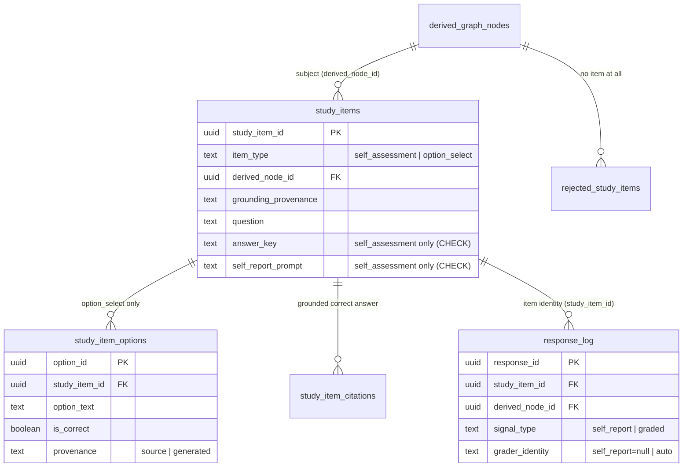
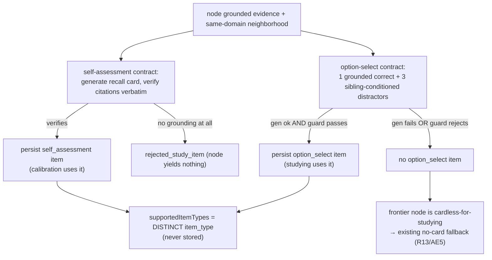

# feat: Typed Study Item model (option-select studying)

## Summary

Generalize the single-card recall loop into a **typed Study Item model**. The Card Bank becomes a Study Item Bank whose items carry an explicit `itemType` discriminant; the existing self-assessment card becomes one type among several. Studying moves to **auto-graded option-select** — four visible options, exactly one keyed correct, a click writes a real `graded` row with no judge and no self-report — while self-assessment retreats entirely to calibration. The prior self-assessed *study* write is deleted, not kept alongside (AGENTS rule 18).

Each item type declares a **grounding contract**, and a concept's supported item types are the byproduct of attempting generation against those contracts — never a stored concept→type map (R12). Option-select distractors are **generated** but conditioned on sibling-concept evidence so wrong answers read like real domain answers; the correct answer stays source-grounded and verified verbatim, distractors are labeled `generated` (ADR-0025 provenance). A deterministic guard fails closed on any malformed option set, and a concept that yields no valid studying item degrades to self-assessment-only through the existing no-card frontier fallback (R13).

This is Plan 2 of the `2026-06-21` brainstorm. It shares no ordering dependency with Plan 1 (study-surface polish + calibration fixes) beyond Plan 1's surface rendering the items this plan produces. It is a downstream projection: it reads the authoritative graph and the Derived Graph Layer and mutates neither (R15).

---

## Problem Frame

The learner-calibrated study loop shipped and passed its rule-14 proof, but its only study mechanic is self-assessment — a learner reveals an answer and self-reports "got it / missed it," writing a `graded(self)` row. The product will not keep self-assessment as the way a learner *studies*: studying should be auto-graded, and a single concept should be able to carry several item types as the bank grows (multi-select, free-text, mini-games later).

Two consequences follow. First, the recall **Card** — a fixed `{ question, answerKey, selfReportPrompt }` shape with one card per node — is too narrow; it must become a typed item with a discriminant so new mechanics slot in without a reshape (R7, R14). Second, the question "which item types does this concept support?" must be answered honestly from the concept's grounded evidence, not from a hand-kept table that would drift the moment evidence regenerates (R12, rule 18).

The brainstorm's governing decision is **earn-it-from-grounded-evidence**: a type is supported when the concept's evidence satisfies that type's grounding contract and generation actually yields a valid item. This mirrors Automatic Item Generation practice — each type is an item model that applies to any content fitting its schema — and the codebase's existing contract that a card exists only when its grounding verifies verbatim (`generateCardBank`).

This is greenfield (AGENTS rules 1, 8, 18): no backward compatibility is preserved, the superseded self-assessed study path is deleted in the same change that introduces option-select, and the single initial migration is edited in place rather than amended by a second migration.

---

## Requirements Traceability

Origin: `docs/brainstorms/2026-06-21-study-surface-polish-and-typed-study-items-requirements.md`. R1–R6 and AE2/AE3 belong to **Plan 1** (study-surface polish + calibration correctness) and are out of scope here.

| Requirement | Where addressed |
|---|---|
| R7 — item-type discriminant; Card Bank → typed Study Item Bank | U1 (model), U4 (persistence), U5 (build) |
| R8 — self-assessment → calibration only; option-select for studying; prior self-assessed study path removed | U6 (write + deletion), U7 (UI) |
| R9 — option-select: four options, one correct, click → auto-graded, no judge/self-report | U3 (generation), U6 (write), U7 (UI) |
| R10 — distractors generated + sibling-conditioned + labeled `generated`; correct stays source-grounded | U3 (generation + sibling selector), U2 (provenance enforcement) |
| R11 — deterministic guard: four distinct options, exactly one keyed correct, grounded correct answer, fail closed | U2 |
| R12 — supported types computed from grounded evidence against each contract; never a stored map | U5 (fan-out), U4 (`supportedItemTypes` query) |
| R13 — no valid studying item → self-assessment only, via the existing no-card frontier fallback | U5 (fan-out outcome), U7 (cardless-for-studying sheet) |
| R14 — other types (multi-select, free-text, mini-games) mocked behind the discriminant, no reshape | U1 (discriminant accommodates them) |
| R15 — read + projection only; no graph / Derived Graph Layer mutation; generated content labeled honestly | U5/U6 (no write port imported), U1 (provenance), U2 (labeling) |
| R16 — no population difficulty calibration (IRT / KT / Bradley-Terry) | whole plan (no unit introduces it) |
| AE1 (R8/R9 portion) — click correct → node mastered, no got-it/missed-it prompt | U6, U7, U8 |
| AE4 — sibling-flavored distractors; guard rejects duplicate / zero-or-multi keyed-correct sets | U2, U3, U8 |
| AE5 — concept with no valid option-select supports only self-assessment, flagged cardless-for-studying | U5, U7, U8 |

The auto-advance half of AE1 (the *next* item opening automatically in the same view, R4) is Plan 1's surface work; Plan 2 delivers the click → auto-graded → mastered + frontier-reselect behavior the advance rides on.

---

## Key Technical Decisions

**KTD1 — Typed Study Item is a discriminated union; the rename is full (rule 18).** `Card` becomes `StudyItem`, a union discriminated by `itemType` (`"self_assessment" | "option_select"`, with `"multi_option_select" | "free_text" | "mini_game"` reserved in the discriminant but unimplemented, R14). The self-assessment variant keeps today's `{ question, answerKey, selfReportPrompt, citations }`; the option-select variant carries `{ question, options: StudyItemOption[] }` with the correct option grounded and distractors `generated`. Per the confirmed scope, the rename travels end to end: the per-item identity `cardId` → `studyItemId`, the column `card_id` → `study_item_id`, the bank/generation/store names, and the governing ADR — so no stale "card" name survives pointing at typed items. ADR-0025 anticipated this ("future multi-card generation may add cards per node"), so this is the evolution it foresaw, recorded in a new ADR-0026 (KTD6).

**KTD2 — Supported types are a query over persisted items, never a stored map (R12, rule 18).** There is no `concept_supported_types` table and no `supportedItemTypes` column. `supportedItemTypes(derivedNodeId)` is `SELECT DISTINCT item_type FROM study_items WHERE derived_node_id = $1`. The supported set is the literal byproduct of which typed items the build managed to generate and persist: self-assessment is supported when a recall card verifies (the existing path), option-select when generation + the deterministic guard both pass. A second representation would drift the instant evidence regenerates.

**KTD3 — One uniform generation mechanism; the correct answer is grounded, distractors are sibling-conditioned and labeled (R10).** Option-select generation runs for *every* node — the uniform mechanism is what lets any concept yield a studying item regardless of neighborhood density. The correct answer is grounded in the node's own evidence and verified verbatim exactly as card answer-keys are today (`evidenceQuoteMatches`). Distractors are generated, conditioned on sibling-concept evidence (same-domain neighbors' labels + a grounding snippet) so they read like real domain answers, and are tagged `provenance: "generated"`. Sibling context is **prompt-context only**: a sibling-poor concept still generates, just with thinner flavor — it degrades to less-sibling-like distractors, never to no item (origin "Key Decisions").

**KTD4 — The option-select guard is a rule-16-permitted deterministic veto, not a heuristic gate.** `validateOptionSelectItem` enforces *provable structural guarantees*: exactly four options, all four distinct after normalization, exactly one flagged correct, and the correct option's text traces to the node's grounding (verbatim/derived, reusing the card-citation verifier). These are the same class of veto as the verbatim-citation check rule 16 explicitly allows — they enforce a checkable property, not a lexical opinion. The guard never inspects distractor *semantics* (that would be the forbidden heuristic gate; distractor quality is judged only by the rule-14 human pass, U8). Failing the guard is **not** a run failure: the node simply does not get an option-select item and falls back to self-assessment-only (R13). This is the rule-11 deterministic envelope and the primary thing the test suite asserts.

**KTD5 — Studying writes a deterministic `graded(auto)` row; the self-assessed study write is deleted.** `appendOptionSelectOutcome` re-derives the keyed-correct option server-side from the DB by `studyItemId` (never trusting the client's correctness claim, mirroring `selfAssessCard`'s node re-derivation), compares it to the chosen option id, and appends one `graded` row — `correct`/1.0 on a match, `incorrect`/0 otherwise — under `graderIdentity: "auto"`, with no `submittedAnswer`, no LLM call, no self-report. In the same change, `appendSelfAssessedGrade`, its `selfAssessment.ts` module, the `selfAssessCard` action, and the RecallCard "Got it / Missed it" study controls are deleted (R8, rule 18). Calibration's `self_report` path (`appendSelfReportBatch` / `propagateSelfReport`) is untouched — self-assessment lives on there, which *is* "self-assessment retreats to calibration."

**KTD6 — New ADR-0026; ADR-0025 amended forward.** ADR-0026 ("Typed Study Item Bank") records the discriminant, the per-type grounding contracts, the generated-distractor provenance, the deterministic guard, and the auto-graded option-select write. ADR-0025 gets a short amendment pointing forward so there is exactly one current source of truth for the item-identity decision.

**KTD7 — Eager build for the two enabled types; lazy generation deferred.** Item-type support is computed eagerly at Study Item Bank build time for the two enabled types (origin "Dependencies / Assumptions"). Per-request lazy generation is not built this round; the build fans out over all nodes and persists everything it can ground.

---

## High-Level Technical Design

### Reshaped persistence (KTD1, KTD2) — directional ERD



`study_items` carries shared fields with type-specific columns gated by a `CHECK` on `item_type` (the same coherence-CHECK idiom `response_log` already uses). `UNIQUE (derived_node_id, item_type)` — at most one item per type per node this round (replacing today's `UNIQUE (derived_node_id)`). The correct option lives in `study_item_options`; its grounding lives in `study_item_citations` (the provenance-tagged union that was `card_answer_key_citations`). Directional — the implementer owns exact column nullability and constraint phrasing.

### Per-node supported-type fan-out (KTD2, R12, R13)



### Option-select studying write (KTD5, R9, AE1)

```mermaid
sequenceDiagram
  participant L as Learner (client)
  participant A as submitOptionSelect (server action)
  participant DB as Postgres (study_items / response_log)
  participant P as classifyAdaptedNodes (pure)
  L->>A: { learnerStateRef, studyItemId, chosenOptionId }
  A->>DB: re-derive keyed-correct option + derived_node_id by studyItemId
  A->>A: appendOptionSelectOutcome — chosen==correct ? graded(correct,1.0) : graded(incorrect,0), graderIdentity="auto"
  A->>DB: append ONE graded row (no judge, no self-report)
  A->>A: revalidatePath(session)
  Note over A,P: re-load → re-fold mastery → re-classify → frontier reselect
  P-->>L: node mastered on a correct answer; next frontier selected (auto-open is Plan 1's R4)
```

These diagrams are directional design guidance, not implementation specification.

---

## Implementation Units

### U1. Typed Study Item domain model + ADR-0026

**Goal:** Replace the single `Card` shape with a `StudyItem` discriminated union that carries `itemType`, accommodates the two enabled types plus the reserved mocked types, and records the decision in an ADR.

**Requirements:** R7, R10 (provenance), R14, R15 (honest labeling).

**Dependencies:** none.

**Files:**
- `packages/domain-core/src/index.ts` (replace `Card` / `CardDraft` / `CardAnswerKeyCitation` / `CardGroundingProvenance` / `RejectedCard` with `StudyItem` union, `StudyItemType`, `StudyItemOption`, `SelfAssessmentItem`, `OptionSelectItem`, `StudyItemDraft` union, `StudyItemCitation`, `RejectedStudyItem`)
- `docs/adr/0026-typed-study-item-bank.md` (new)
- `docs/adr/0025-card-bank-over-derived-graph-layer.md` (short forward-amendment, KTD6)
- `docs/adr/README.md` (index entry for 0026)

**Approach:** Define `StudyItemType = "self_assessment" | "option_select" | "multi_option_select" | "free_text" | "mini_game"`. `StudyItem` is a union keyed on `itemType`; the first two variants are concrete, the latter three are reserved (declared in the discriminant, no payload built this round — R14). `SelfAssessmentItem` keeps `{ question, answerKey, selfReportPrompt, citations }`; `OptionSelectItem` carries `{ question, options }` where `StudyItemOption = { optionId, text, isCorrect, provenance: "source" | "generated", citation?: StudyItemCitation }`. `StudyItemCitation` is the existing provenance-tagged union (`source` carries source ids + verbatim quote; `generated` carries derived-node id + passage text), renamed. Shared fields (`studyItemId`, `graphVersionId`, `enrichmentId`, `derivedNodeId`, `groundingProvenance`, `generatingModel`, `configHash`) live on the base. `StudyItemDraft` is the pre-verification union the generators return. Delete every old `Card*` type name in the same edit (rule 18). ADR-0026 records the discriminant, the per-type grounding contracts, generated-distractor provenance, the deterministic guard, and the auto-graded write; ADR-0025 gets a one-paragraph "superseded by ADR-0026 for item identity" amendment.

**Patterns to follow:** the existing `Card` / `CardAnswerKeyCitation` / `CardGroundingProvenance` definitions in `packages/domain-core/src/index.ts:948-994`; the discriminated-union style already used for `EnrichmentNode` / `DerivedGraphNode`.

**Test scenarios:** `Test expectation: none -- pure type definitions + ADR docs, no runtime behavior. The discriminant is exercised by the guard (U2), the build fan-out (U5), and the store round-trip (U4).`

---

### U2. Deterministic option-select guard + correct-answer grounding verification

**Goal:** A fail-closed validator that promotes an option-select draft to a persistable item only when it satisfies the structural guarantees, and rejects with a reason otherwise.

**Requirements:** R9 (one correct), R10 (labeling), R11, R15.

**Dependencies:** U1.

**Files:**
- `packages/application/src/optionSelectGuard.ts` (new)
- `packages/application/src/optionSelectGuard.test.ts` (new)
- `packages/application/src/index.ts` (export)

**Approach:** `validateOptionSelectItem(draft, grounding)` returns `{ ok: true; item: OptionSelectItem } | { ok: false; reason: string }`. Checks, in order, each failing closed with a distinct reason: (1) exactly four options; (2) all four distinct after whitespace/case normalization; (3) exactly one `isCorrect`; (4) the correct option's citation verifies against the node's grounding passages via the existing verbatim verifier (`evidenceQuoteMatches`) under the grounding's provenance contract — source-grounded correct answers must quote a source passage verbatim, generated-grounding nodes verify against the generated bundle; (5) every non-correct option is labeled `provenance: "generated"`. On success, return the normalized `OptionSelectItem` with `optionId`s assigned. This is the rule-16 veto: structural + provable, never semantic. It mutates nothing and imports no graph write port (R15).

**Patterns to follow:** the citation-verification loop in `packages/application/src/generateCardBank.ts:69-88` (per-citation `evidenceQuoteMatches` against the cited passage, fail-closed); reuse `evidenceQuoteMatches` from `@lrnki/domain-core`.

**Test scenarios:**
- Happy path: four distinct options, one correct whose quote matches a grounding passage, three labeled `generated` → `{ ok: true }` with a normalized item and assigned option ids.
- Covers AE4. Two options with the same normalized text → `{ ok: false }` with a duplicate-option reason.
- Covers AE4. Zero options flagged correct → reject; two flagged correct → reject (distinct reasons).
- Three options / five options → reject (count guarantee).
- Correct option whose quote does **not** verify against any grounding passage → reject (ungrounded-correct reason).
- A non-correct option labeled `provenance: "source"` → reject (distractor must be `generated`, R10).
- Generated-grounding node: correct option quoting the generated bundle verbatim verifies; quoting absent text rejects (provenance-contract parity with card generation).
- Edge: normalization treats `"  Heap "` and `"heap"` as duplicates but `"heap"` and `"stack"` as distinct.

---

### U3. Sibling-conditioned option-select generation (port + adapter + sibling selector)

**Goal:** A forced-tool generator that produces an option-select draft — a grounded correct answer plus three sibling-flavored distractors — conditioned on the node's grounding and its same-domain neighborhood.

**Requirements:** R9, R10.

**Dependencies:** U1.

**Files:**
- `packages/ports/src/index.ts` (rename `CardGenerationPort` → `StudyItemGenerationPort`; add `generateOptionSelect(...)` alongside the existing self-assessment `generate(...)`)
- `packages/infrastructure-litellm/src/cardGenerationAdapters.ts` → rename to `studyItemGenerationAdapters.ts` (adapter implements both methods; DeepSeek family)
- `packages/infrastructure-litellm/src/toolSchemas.ts` (add `optionSelectSchema` + `optionSelectValidator`, forced tool `submit_option_select_item`)
- `packages/infrastructure-litellm/src/index.ts` (export rename)
- `packages/application/src/selectSiblingContext.ts` (new: pure sibling selector)
- `packages/application/src/selectSiblingContext.test.ts` (new)
- `packages/application/src/index.ts` (export)
- `packages/infrastructure-litellm/src/cardGenerationAdapters.test.ts` → rename + extend for the option-select validator

**Approach:** `selectSiblingContext(node, layer)` returns up to N sibling descriptors `{ label, snippet }` drawn from same-`declaredDomain` derived nodes other than the target, ranked prerequisite-adjacent-first then same-domain, each with one grounding snippet (definition preferred). Sibling-poor → fewer or zero descriptors; the generator still runs (KTD3). `generateOptionSelect` takes the node, its grounding passages (same shape the self-assessment generator consumes), and the sibling context, and calls the forced tool `submit_option_select_item` returning `{ question, correctAnswer: { text, citation }, distractors: string[] }`. The system prompt is **domain-neutral rubric language only** (rule 17): "write three plausible but incorrect options in the same domain register as the provided neighbor concepts" — no fixture names, no exemplar lists. The adapter validates tool arguments fail-closed (rule 6); semantic acceptance is *not* done here (that is U2's guard, then U5's verify).

**Patterns to follow:** `packages/infrastructure-litellm/src/cardGenerationAdapters.ts` (forced-tool call shape, domain-neutral system prompt, DeepSeek `EVIDENCE_PROFILE_MODEL`); `cardGenerationSchema` / `cardGenerationValidator` in `packages/infrastructure-litellm/src/toolSchemas.ts:583-620`; the `declaredDomain` + grounding fields already on `DerivedGraphNode` and `DerivedGraphLayer`.

**Test scenarios:**
- `selectSiblingContext`: returns same-domain neighbors only, excludes the target node, ranks prerequisite-adjacent siblings ahead of other same-domain nodes, and caps at N.
- `selectSiblingContext`: a node whose domain has no other members returns an empty sibling set (sibling-poor path — does not throw).
- `optionSelectValidator` rejects tool arguments missing `correctAnswer`, missing `distractors`, or with the wrong distractor count (fail-closed schema validation, rule 6).
- `optionSelectValidator` accepts a well-formed argument set (shape only — no assertion on distractor *content*, rule 11 / rule 17).
- `Test expectation: distractor quality is NOT unit-tested -- it is established only by the U8 real-use pass (AGENTS rules 11, 13, 14).`

---

### U4. Typed Study Item Bank persistence reshape (migration + Postgres store)

**Goal:** Persist typed study items, their options, their grounded-answer citations, and no-item rejections, and expose `supportedItemTypes` as a query — the full rule-18 rename of the card persistence surface.

**Requirements:** R7, R12 (query), R15.

**Dependencies:** U1.

**Files:**
- `packages/infrastructure-postgres/src/migrations/0000_initial_lrnki_schema.sql` (edit in place, rule 8): `cards` → `study_items` (+ `item_type`, type-coherence `CHECK`, `UNIQUE (derived_node_id, item_type)`); new `study_item_options`; `card_answer_key_citations` → `study_item_citations` (FK `study_item_id`); `rejected_cards` → `rejected_study_items`; `response_log.card_id` → `study_item_id` (FK `study_items`); view `artifact_cards` → `artifact_study_items` (+ `item_type`); artifact type `card_bank.v3` → `study_item_bank.v4`
- `packages/infrastructure-postgres/src/PostgresLearnerLoopStores.ts` (`PostgresCardBankStore` → `PostgresStudyItemBankStore`: persist typed items + options + citations in one tx, delete-then-insert per enrichment; `getStudyItem`, `listStudyItemsForEnrichment`, `supportedItemTypes(derivedNodeId)`)
- `packages/infrastructure-postgres/src/index.ts` (export rename)
- `packages/infrastructure-postgres/src/PostgresLearnerLoopStores.test.ts` (rewrite for typed items + options + `supportedItemTypes`)
- `packages/ports/src/index.ts` (`CardBankStorePort` → `StudyItemBankStorePort`; `persist` takes `studyItems` + `rejected`; add `supportedItemTypes`)

**Approach:** `study_items` holds shared columns with `answer_key` / `self_report_prompt` nullable, gated by `CHECK (item_type = 'self_assessment' AND answer_key IS NOT NULL AND self_report_prompt IS NOT NULL) OR (item_type = 'option_select' AND answer_key IS NULL AND self_report_prompt IS NULL)` — the coherence-CHECK idiom `response_log` already uses. `study_item_options` (option_select only) carries `is_correct` and a `provenance` CHECK. `study_item_citations` keeps the existing source/generated provenance CHECK, re-keyed to `study_item_id`. `persist` writes items, options, citations, rejections, and the `study_item_bank.v4` artifact in one transaction, delete-then-insert per enrichment (replay, not mutation). `supportedItemTypes(derivedNodeId)` runs `SELECT DISTINCT item_type` (KTD2 — no stored map). Reset + re-seed the DB after the migration edit (rule 9). Update the `artifact_study_items` JSON_TABLE view to surface `item_type`.

**Patterns to follow:** `PostgresCardBankStore.persist` one-transaction artifact+rows + delete-then-insert at `packages/infrastructure-postgres/src/PostgresLearnerLoopStores.ts:19-63`; the `response_log` coherence `CHECK` at `migrations/0000_initial_lrnki_schema.sql:656-660`; the `card_answer_key_citations` provenance `CHECK` at `:605-609`; the `artifact_cards` JSON_TABLE view at `:403-420`.

**Execution note:** Edit the single existing migration in place and reset the DB — do not add a second migration (rule 8).

**Test scenarios:**
- Persist a node with both a `self_assessment` and an `option_select` item → both round-trip via `listStudyItemsForEnrichment`, options and citations rehydrate, `supportedItemTypes` returns both types.
- Persist a node with only a `self_assessment` item → `supportedItemTypes` returns `["self_assessment"]` only.
- Regeneration (delete-then-insert) replaces a prior bank: re-persisting an enrichment with a different item set leaves no orphaned options/citations (cascade) and no stale rows.
- `UNIQUE (derived_node_id, item_type)` rejects a second item of the same type for one node.
- Type-coherence CHECK: an `option_select` row with a non-null `answer_key`, or a `self_assessment` row with null prompt, is rejected by the DB.
- Option provenance CHECK: an option with an invalid `provenance` value is rejected.
- A `graded` `response_log` row referencing a real `study_item_id` inserts; one referencing an absent id is rejected by the FK.

---

### U5. Study Item Bank build + supported-type fan-out

**Goal:** Replace `generateCardBank` with a typed build that, per node, generates a self-assessment item and an option-select item, verifies and guards each, persists what survives, and records a rejection only when a node yields nothing.

**Requirements:** R7, R12, R13, R15.

**Dependencies:** U2, U3, U4.

**Files:**
- `packages/application/src/generateCardBank.ts` → rename to `generateStudyItemBank.ts` (typed fan-out)
- `packages/application/src/generateCardBank.test.ts` → rename + rewrite for the fan-out
- `packages/application/src/index.ts` (export rename)
- `apps/kg-worker/src/knowledgeGraphWorker.ts` (`generate-cards` command → `generate-study-items`; wire `StudyItemGenerationPort` + `PostgresStudyItemBankStore`; `CARD_BANK_CONFIG_HASH` → `STUDY_ITEM_BANK_CONFIG_HASH`)

**Approach:** `generateStudyItemBank` keeps the existing per-node grounding selection (`selectNodeGrounding`, unchanged) and then fans out: (a) **self-assessment** — generate a recall card and verify citations verbatim exactly as today; on success persist a `self_assessment` item. (b) **option-select** — build sibling context (`selectSiblingContext`), call `generateOptionSelect`, verify the correct answer's citation verbatim, then run `validateOptionSelectItem` (U2); on success persist an `option_select` item. A node persists every type that survives; `supportedItemTypes` is therefore implicit (KTD2). A node that produces **no** item at all (no grounding) is recorded as a `RejectedStudyItem` with the reason — exactly today's no-card semantics, generalized. A node with a self-assessment item but a failed option-select is **not** rejected: it simply lacks an option-select item, which the frontier surfaces as cardless-for-studying (R13). Generation failures on one type never abort the other type or the run. No graph/enrichment write port is imported (R15).

**Patterns to follow:** `generateCardBank` loop structure, grounding selection, and verbatim verification at `packages/application/src/generateCardBank.ts:29-113`; the worker `generateCardsCommand` wiring at `apps/kg-worker/src/knowledgeGraphWorker.ts:410-432`.

**Test scenarios:** Use canned generator responses as **input fixtures** exercising the deterministic envelope (ADR-0013 — allowed as input, never asserting the model's judgment).
- A node whose self-assessment card verifies and whose option-select draft passes the guard → both items persisted; the rejection list does not include it.
- Covers AE5 / R13. A node whose self-assessment verifies but whose option-select draft is guard-rejected → only the `self_assessment` item persisted; node is **not** in the rejection list (it is cardless-for-studying, not item-less).
- A node with no usable grounding → no items, one `RejectedStudyItem` with the grounding reason.
- An option-select generation that throws → the self-assessment item still persists; the run continues to the next node.
- A node whose option-select correct answer cites text absent from its grounding → option-select dropped (verbatim verify fails before the guard), self-assessment unaffected.
- The persisted set matches the fan-out: across a small layer, `supportedItemTypes` per node equals the set of types actually persisted.

---

### U6. Auto-graded option-select write + deletion of the self-assessed study path

**Goal:** A deterministic, judge-free graded append for an option-select answer, plus removal of the now-superseded self-assessed study write in the same change.

**Requirements:** R8, R9, R15, AE1 (write half).

**Dependencies:** U1, U4.

**Files:**
- `packages/application/src/optionSelectOutcome.ts` (new: `appendOptionSelectOutcome`)
- `packages/application/src/optionSelectOutcome.test.ts` (new)
- `packages/application/src/selfAssessment.ts` (**delete**, rule 18)
- `packages/application/src/selfAssessment.test.ts` (**delete**)
- `packages/application/src/index.ts` (drop `appendSelfAssessedGrade` / `SelfAssessmentOutcome` / `SELF_GRADER_IDENTITY` exports; add the option-select outcome export)
- `apps/admin-lab/src/app/admin/lab/study/actions.ts` (`selfAssessCard` → `submitOptionSelect`; re-derive keyed-correct option server-side by `studyItemId`; `submitCalibration` updated to read `self_assessment` items via `listStudyItemsForEnrichment` and the renamed identity field)
- `packages/application/src/calibration.ts`, `packages/application/src/syntheticResponses.ts` (+ their tests) (rename the `cardId` item-key field to `studyItemId` through the calibration / synthetic-response shapes, KTD1)
- `packages/application/src/measurement.ts` (rename `cardId` → `studyItemId` in the grade-append row shape)

**Approach:** `appendOptionSelectOutcome({ learnerStateRef, item: { studyItemId, derivedNodeId }, chosenOptionId, correctOptionId, responseSource, responseLog })` maps `chosenOptionId === correctOptionId` → `{ judgedOutcome: "correct", gradedScore: 1 }`, else `{ judgedOutcome: "incorrect", gradedScore: 0 }`, builds one `NewResponseLogRow` with `signalType: "graded"`, `graderIdentity: "auto"`, `evidenceWeight: GRADED_EVIDENCE_WEIGHT`, `selfReportRating: null`, `submittedAnswer: null`, `attemptSeq` from `nextAttemptSeq`, and appends it — structurally identical to the deleted self-assessed append minus the self-grader identity. The server action `submitOptionSelect` re-derives the keyed-correct option from the DB by `studyItemId` (never trusts a client correctness claim), then calls the append and `revalidatePath`. The whole self-assessed *study* path (`selfAssessment.ts`, `selfAssessCard`, the RecallCard assess controls in U7) is deleted in this change — calibration's `self_report` path is untouched.

**Patterns to follow:** the deleted-but-mirrored `appendSelfAssessedGrade` shape at `packages/application/src/selfAssessment.ts:28-55`; server-side re-derivation in `selfAssessCard` at `apps/admin-lab/src/app/admin/lab/study/actions.ts:33-57`; `gradeAndAppend` row shape + `GRADED_EVIDENCE_WEIGHT` in `packages/application/src/measurement.ts`.

**Test scenarios:**
- Covers AE1 (write half). `chosenOptionId === correctOptionId` → one `graded` row, `judgedOutcome: "correct"`, `gradedScore: 1`, `graderIdentity: "auto"`, `submittedAnswer: null`.
- A wrong choice → `judgedOutcome: "incorrect"`, `gradedScore: 0`, still `graderIdentity: "auto"`.
- Folding `[graded(auto) correct]` for a node via `foldConceptMastery` yields the mastered value (composes the new write with the existing fold; graded outranks self-report).
- `attemptSeq` taken from `nextAttemptSeq`; two successive appends are monotonic.
- `responseSource` passes through verbatim (`"human"` / `"synthetic"`).
- Structural R15: `appendOptionSelectOutcome` imports no graph/enrichment/path write port (assert via dependency surface).
- Deletion guard: `appendSelfAssessedGrade` / `SELF_GRADER_IDENTITY` are no longer exported and have no importers (rule 18 — grep-style structural check or a removed-export assertion).

---

### U7. Typed study UI — option-select module, supported-type-aware sheet, loader

**Goal:** Render the studying frontier as an auto-graded option-select item, route concepts with no studying item to the cardless-for-studying fallback, and feed it all from the typed loader — with the self-assessed study controls removed.

**Requirements:** R8, R9, R13, R15, AE1 (UI half), AE5.

**Dependencies:** U1, U4, U6.

**Files:**
- `apps/admin-lab/src/components/study/OptionSelectCard.tsx` (new: four options, click → `onSelect(optionId)`, immediate keyed feedback)
- `apps/admin-lab/src/components/study/studyView.ts` (reshape `SheetContent`: frontier `option_select` | `cardless`; drop `frontier_card` / `assessmentDisabled` / `SelfAssessmentOutcome`; add `StudyOptionSelectView`; keep `mastered_review` read-only)
- `apps/admin-lab/src/components/study/studyView.test.ts` (update)
- `apps/admin-lab/src/components/study/StudySideSheet.tsx` (render `option_select` via `OptionSelectCard`; cardless-for-studying flag; mastered review)
- `apps/admin-lab/src/components/study/RecallCard.tsx` (reduce to read-only review **or** delete if `mastered_review` inlines its answer; the "Got it / Missed it" controls are removed, R8)
- `apps/admin-lab/src/components/study/StudySession.tsx` (`onAssess` → `onSelect` calling `submitOptionSelect`; keep the calibrate path)
- `apps/admin-lab/src/lib/studySession.ts` (typed loader: produce option-select view models for studying, self-assessment items for calibration, supported-type-aware sheet payloads)
- `apps/admin-lab/src/lib/studySession.test.ts` (update gating helpers)
- `apps/admin-lab/src/app/admin/lab/study/page.tsx` (any `Card`-name follow-through from the loader rename)

**Approach:** The side sheet's frontier branch now renders `OptionSelectCard` when the node has an `option_select` item, and the **cardless-for-studying** flag (the existing no-card fallback styling) when it does not — even if the node has a self-assessment item, since self-assessment is calibration-only now (R8, R13, AE5). `OptionSelectCard` shows the question and four options; clicking an option calls the injected `onSelect(optionId)` and may show immediate keyed feedback, but the authoritative grade is the server re-derivation (U6). `studyView.ts` keeps the transfer-ready, prop-only contract (no loader/action import, R15). The loader splits items by type: option-select items drive `sheetByNode`; self-assessment items feed `calibrationItems`. `mastered_review` shows the answer read-only. The self-assessed "Got it / Missed it" controls are deleted with the path (R8).

**Patterns to follow:** the state-gated sheet in `apps/admin-lab/src/components/study/StudySideSheet.tsx`; the injected-callback / no-coupling module contract in `RecallCard.tsx` and `studyView.ts`; the loader split in `apps/admin-lab/src/lib/studySession.ts:111-193`; the `onAssess` transition + `revalidatePath` re-render in `StudySession.tsx:36-46`.

**Test scenarios:**
- Pure helper: a frontier node with an `option_select` item → sheet kind `option_select` with the option view model; a frontier node with no `option_select` item → `cardless` (flagged), regardless of whether a `self_assessment` item exists (R13/AE5).
- Pure helper: option ordering is deterministic for a given item (stable render across re-folds).
- `OptionSelectCard` calls `onSelect` with the clicked option id and disables further input while `pending` (no double-submit).
- Module decoupling (R15): the study modules import no `@/lib/*` loader and no `"use server"` action (import-surface check).
- `Test expectation: end-to-end rendering + the auto-graded advance are verified by the U8 real-use run, not unit tests (canvas/route composition is un-unit-tested by local convention).`

---

### U8. Real-use quality evaluation (rule 14)

**Goal:** Prove the milestone — typed items generate on a real enrichment, option-select distractors are domain-plausible and honestly labeled, the guard rejects malformed sets, the supported-type fan-out is correct, and a click auto-grades and masters a frontier node — and record the rule-14 note.

**Requirements:** AE1, AE4, AE5; AGENTS rules 11, 13, 14.

**Dependencies:** U5, U6, U7.

**Files:**
- `scripts/seed-demo.sh` (reuse; regenerate the Study Item Bank via the renamed `generate-study-items` worker command)
- `tmp/2026-06-21-typed-study-items/rule-14-evaluation.md` (new, gitignored)

**Approach:** Reset + seed via real LiteLLM calls, then run `generate-study-items` on a clean single-domain enrichment (the Rust ownership DAG). **Inspect the produced artifacts as an expert user:** (1) for several concepts, read the generated option-select items — is the correct answer source-grounded and the three distractors plausible, domain-register, and *wrong* (AE4)? Are distractors labeled `generated` and the correct answer labeled by its real provenance (R15)? (2) confirm the guard's rejections are real malformations, not valid items wrongly vetoed (rule 16 false-negative check) — if valid items are being discarded, that is `FIX_FIRST`. (3) verify the supported-type fan-out: spot-check that `supportedItemTypes` per node equals the items actually generated, and find at least one concept that supports only self-assessment and confirm it routes to the cardless-for-studying fallback (AE5/R13). (4) drive the Study route: click the correct option on a frontier node → one `graded(auto)` row, node mastered, frontier reselects, no got-it/missed-it prompt (AE1); click a wrong option → `incorrect`, node not mastered. Classify `PASS` / `FIX_FIRST` / `EXPERIMENT_ONLY` / `BLOCKED` with concrete examples. No test asserts model output quality (rule 11) — this is human inspection of real output.

**Execution note:** This is the milestone gate — run it before any downstream complexity (rule 14). Real model calls required; if LiteLLM / Postgres is unavailable, record `BLOCKED` with the exact caveat rather than claiming verification. Distractor quality is the headline risk: read real items, do not infer quality from a green suite.

**Test scenarios:** `Test expectation: none -- this unit IS the real-use evaluation; it produces the rule-14 artifact, not automated tests.`

---

## Scope Boundaries

### Deferred for later
- Multi-option-select, free-text / LLM-graded items, and connect-concepts mini-games — mocked behind the type discriminant (R14); the next types to implement.
- Lazy / per-request item generation — the build is eager for the two enabled types this round (KTD7).
- Population difficulty calibration (IRT / KT / Bradley-Terry) — data-blocked (ADR-0014, ADR-0024); intrinsic difficulty stays `EXPERIMENT_ONLY` (R16).
- Performance-driven / incremental graph growth — remains under the narrowed F3 guard.
- The separate Learner app — study modules stay transfer-ready (prop-driven) inside Admin Lab.
- Spaced-repetition scheduling, real auth, and learner accounts — identity stays a mocked `learnerStateRef`.

### Outside this product's identity (for now)
- The study surface is a consumer of the authoritative graph, never an editor of it. Item generation and calibration live in the downstream projection; the learner-neutral core graph and the Derived Graph Layer are never mutated by learner activity or by item generation (R15).

### Deferred to follow-up work
- Plan 1 (study-surface polish + calibration correctness fixes R1–R6) — sibling plan, no ordering dependency beyond Plan 1's surface rendering Plan 2's items.
- A distinct evidence weight for `graded(auto)` outcomes vs reusing `GRADED_EVIDENCE_WEIGHT` — deferred; revisit only if the uniform weight misleads the rule-14 inspection.
- Multiple items per (node, type) — the schema allows one per type this round (`UNIQUE (derived_node_id, item_type)`); relaxing it is a later change when multi-card generation lands.

---

## Alternative Approaches Considered

- **Store `supportedItemTypes` as a column/table (rejected).** A persisted concept→type map would be a second source of truth that drifts the instant evidence regenerates (rule 18, R12). Deriving it as `SELECT DISTINCT item_type` keeps one source of truth and makes "supported" mean exactly "we generated a valid item."
- **Pick distractors from real sibling concepts instead of generating them (rejected).** Reusing neighbor concepts as distractors fails for thin neighborhoods (a sparse concept would get no item) and risks accidentally-correct distractors. Generation is the uniform mechanism (KTD3); sibling evidence conditions it for plausibility without gating availability.
- **A semantic LLM judge to vet distractors at build time (deferred, not this round).** The deterministic guard (U2) enforces only structural guarantees; distractor *quality* is judged by the rule-14 human pass (U8). If U8 shows systematic distractor defects, the measured-judge path (rule 16) is the right next step — added then, not pre-built.
- **Narrow rename keeping `card_id` as the response-log key (considered, rejected per confirmation).** Smaller diff, but leaves a stale "card" name pointing at typed items — exactly the drift rule 18 forbids. The user confirmed the full rename.

---

## Risks & Dependencies

**Dependencies (reused unchanged):** the per-node grounding selection (`selectNodeGrounding`) and verbatim verifier (`evidenceQuoteMatches`); the mastery fold, `classifyAdaptedNodes`, and the scoped frontier; calibration's `self_report` path (`buildCalibrationSet`, `propagateSelfReport`, `appendSelfReportBatch`); the append-only Response Log; the same-domain neighborhood already available on `DerivedGraphLayer` at build time. A clean single-domain enrichment (Rust ownership DAG) exists. Real LiteLLM + Postgres are needed for the seed and U8.

**Risks:**
- *Distractor quality (headline).* Generated distractors may be implausible, off-domain, or accidentally correct. Mitigation: sibling-conditioning (KTD3) + the U8 real-use inspection as the acceptance gate; the guard cannot catch a *plausible-but-actually-correct* distractor, so U8 must read real items. If systematically poor, escalate to a measured neural judge (rule 16), not to expanding the deterministic guard.
- *Guard over-veto (rule 16 false negatives).* If `validateOptionSelectItem` rejects valid items (e.g., over-aggressive normalization treating distinct answers as duplicates), concepts silently lose option-select support. Mitigation: U2's normalization is conservative and U8 explicitly inspects rejections for valid-item loss.
- *Rename blast radius (rule 18).* The `card → study item` rename touches domain-core, ports, both infrastructure packages, the application core, the worker, and the study UI. Mitigation: the grep-enumerated consumer list is the unit file lists; the DB is reset (rule 9), so no data-migration risk; one transaction-scoped store keeps the artifact and rows consistent.
- *Single migration edit (rule 8).* Editing `0000_initial_lrnki_schema.sql` in place plus a DB reset is the intended greenfield path; the risk is forgetting a dependent view/FK. Mitigation: U4 lists the views (`artifact_study_items`) and the `response_log` FK explicitly.

---

## Real-use quality evaluation

Per `.agents/skills/real-use-quality-evaluation/SKILL.md` — to be completed in U8:

```md
- Milestone: typed Study Item Bank with auto-graded option-select studying; supported types computed from grounded evidence.
- Fixture and source type: clean single-domain enrichment (Rust ownership DAG) via scripts/seed-demo.sh + generate-study-items.
- Real model calls used: yes (extraction/enrichment/difficulty + self-assessment and option-select generation).
- Result: <PASS / FIX_FIRST / EXPERIMENT_ONLY / BLOCKED>
- Useful output observed: <grounded correct answers; sibling-plausible distractors (AE4); correct supported-type fan-out; cardless-for-studying fallback (AE5); click → graded(auto) → mastered (AE1)>
- Defects observed: <distractor quality; guard over/under-veto; fan-out mismatches>
- Changes made after inspection: <…>
- Remaining caveats: loop trust stays EXPERIMENT_ONLY; distractor quality is model-dependent and not test-guaranteed.
- Safe to continue downstream: <yes / no>
```

---

## Sources & Research

- Card model to generalize: `packages/domain-core/src/index.ts:948-994` (`Card`, `CardDraft`, `CardAnswerKeyCitation`, `RejectedCard`); Response Log `:1004-1032`.
- Generation pipeline to fan out: `packages/application/src/generateCardBank.ts` (grounding selection + verbatim verify + fail-closed); adapter `packages/infrastructure-litellm/src/cardGenerationAdapters.ts`; schema `packages/infrastructure-litellm/src/toolSchemas.ts:583-620`.
- Ports: `packages/ports/src/index.ts:319-384` (`CardBankStorePort`, `ResponseLogStorePort`, `CardGenerationPort`).
- Persistence + schema: `packages/infrastructure-postgres/src/PostgresLearnerLoopStores.ts:16-138`; migration `packages/infrastructure-postgres/src/migrations/0000_initial_lrnki_schema.sql` (`cards` `:577-590`, `card_answer_key_citations` `:596-610`, `rejected_cards` `:616-625`, `response_log` `:637-662`, `artifact_cards` view `:403-420`).
- Self-assessed study write to delete: `packages/application/src/selfAssessment.ts`; action `apps/admin-lab/src/app/admin/lab/study/actions.ts`.
- Study UI to reshape: `apps/admin-lab/src/components/study/{StudySession,StudySideSheet,RecallCard,studyView}.tsx?`; loader `apps/admin-lab/src/lib/studySession.ts`.
- Sibling neighborhood at build time: `DerivedGraphLayer` / `DerivedGraphNode` (`declaredDomain`, grounding) in `packages/domain-core/src/index.ts:715-913`.
- Worker wiring: `apps/kg-worker/src/knowledgeGraphWorker.ts:410-432` (`generate-cards`).
- Recorded defects context (Plan 1 territory, not addressed here): `tmp/2026-06-21-study-loop/rule-14-evaluation.md`.
- Governing ADRs: ADR-0025 (Card Bank / Response Log identity, provenance — amended here), ADR-0023 (cross-family generated-node judge), ADR-0019 (Derived Graph Layer), ADR-0024 (intrinsic difficulty; calibration data-blocked), ADR-0014 (defer learner modeling). New: ADR-0026 (Typed Study Item Bank).
- Origin requirements: `docs/brainstorms/2026-06-21-study-surface-polish-and-typed-study-items-requirements.md`. Prior plan extended: `docs/plans/2026-06-21-001-feat-learner-calibrated-study-loop-plan.md`.
