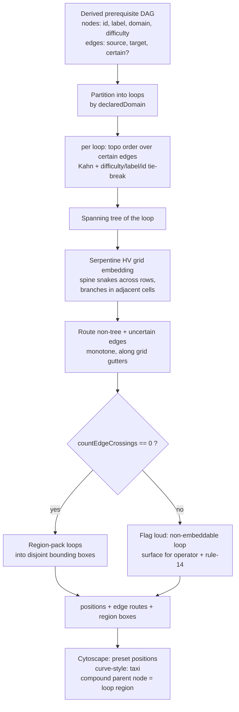

# feat: FFX sphere-grid graph layout — per-loop planar meander with provable zero crossings

## Summary

Replace the golden-angle spiral placement (`apps/admin-lab/src/lib/cytoscapeSpiralLayout.ts`) with a Final-Fantasy-X-sphere-grid layout: each learning loop (one declared domain) is embedded as a serpentine meander on a grid lattice with right-angle "track" edges that never cross, and the loops are packed into visually separated regions. The layout stays in-house, pure, synchronous, and deterministic, and "edges never cross" becomes a tested invariant — a deterministic crossing counter that asserts zero on real fixtures, not a hope.

---

## Problem Frame

The spiral layout topologically orders nodes onto a Fermat/phyllotaxis spiral (prerequisites near the center), but it draws edges as straight beziers between arbitrary spiral positions. On the 50-node mixed-domain graph the edges cross densely — the spiral's own rule-14 note records *"it still has dense edge crossings… a placement fix, not graph untangling"* (`tmp/2026-06-21-spiral-study-advance/rule-14-evaluation.md`). The graph is meant to be the legible spine of the study experience and the future home of per-concept mastery bonuses (gamification, out of scope here); a tangled hairball undercuts both.

Two structural facts make a clean solution reachable rather than NP-hard in practice:

- Enrichment judges **only same-domain CEP pairs** (`packages/domain-core/src/index.ts:800,908` — *"The exhaustive same-domain design (ADR-0019 reset): every same-domain CEP pair is judged exhaustively"*). Cross-domain edges cannot exist, so grouping loops by domain yields **zero cross-loop crossings by construction**.
- The per-domain subgraphs are small and sparse — the F3 enrichment evals repeatedly describe them as "thin"/"sparse" (`tmp/2026-06-17-f1-enrichment-eval/rule-14-evaluation.md`). Sparse near-trees have trivial crossing-free grid embeddings.

---

## Key Technical Decisions

- **In-house pure geometry + Cytoscape-native `taxi` edges; no ELK/dagre.** Research verdict on the elkjs question: ELK's `layered` algorithm *minimizes* crossings (Sugiyama/barycenter) — it does **not** guarantee zero, so it cannot deliver the requested "never cross" property or let us prove it. The orthogonal "track" aesthetic ELK would provide is already in Cytoscape core via `curve-style: taxi` (since 3.5.0, built for trees/DAGs). Re-adding `cytoscape-elk` would re-introduce the async, ~1.5 MB GWT-compiled dependency just removed in `eb322d0`, regressing the pure/synchronous/testable architecture, for a capability we don't need it for. The durable path keeps the geometry in-house and provable.
- **Loop = declared domain.** This equals the connected-component boundary here (same-domain edges only), so domain grouping both matches the learner's mental model and guarantees no inter-region edges. A domain that internally splits into >1 component is packed as one region; each component is still embedded crossing-free.
- **Spanning-tree serpentine HV grid embedding.** General HV-planarity is NP-complete, so we do not attempt to decide it for arbitrary DAGs. We embed a deterministic spanning tree of each loop as a boustrophedon (serpentine) snake on integer grid coordinates — trees are always planar and grid-embeddable — then add the non-tree edges back. Non-tree/reconvergent edges are the FFX "loop-backs"; they are the only crossing risk and are bounded (sparse graphs have few).
- **Provable zero crossings via a pure crossing counter.** The geometry module emits node positions *and* edge route polylines; a pure `countEdgeCrossings` does segment-intersection (shared endpoints excluded) and is asserted `=== 0` in unit tests and on the real seeded enrichment. Taxi routes are configured to stay monotone within each edge's endpoint bounding box, so the right-angle rendering cannot add a crossing that the straight-segment model lacks.
- **Fail loud, never silent-cross.** If a real loop cannot be embedded crossing-free (non-planar, or non-tree edges that force a crossing), the module returns a flagged result the explorer surfaces to the operator (rule 14 / rule 16: surface, don't silently veto). It does not silently render crossings as if clean.
- **Pin-once + viewport-only recenter preserved.** Layout runs once per topology; the neutral↔adapted mode toggle and frontier advance never re-run it — recenter remains pan/zoom only. This carries forward the pinned-position blink-compare architecture the spiral commit established.
- **Gamification mastery-bonus seam is skipped, not built.** Per the transfer/mock constraint, the layout leaves a typed per-node overlay extension point (the existing `data()`-attr restyle path already proves this works) and builds no bonus mechanic.

---

## High-Level Technical Design

The pure module is everything above the Cytoscape box; it imports no Cytoscape and is fully unit-testable. The Cytoscape applier consumes its output, applies `preset` positions, and configures taxi edges + compound region parents.

---

## Requirements

### Layout correctness
- R1. Within every rendered loop, edges never cross: the pure crossing counter returns `0` on all unit fixtures and on the real seeded mixed-domain enrichment.
- R2. Each learning loop (one declared domain) occupies its own visually separated region with a domain label; no edge connects two regions.
- R3. Edges render as orthogonal right-angle tracks (Cytoscape `taxi`), evoking the FFX sphere grid.
- R4. Each loop's spine is laid out as a serpentine meander on an integer grid lattice, with branches/loop-backs forming the sphere-grid feel.

### Architecture and durability
- R5. The geometry is a pure module with no Cytoscape import, deterministic and synchronous, and unit-testable under `tsx --test`.
- R6. Layout runs once per topology; the neutral↔adapted toggle and frontier advance never re-run it (positions stay pinned); recenter is viewport-only.
- R7. The superseded spiral module and its test are deleted in the same change that supersedes them; both explorers import only the new module; no dead exports remain.
- R8. Both Cytoscape canvases — the derived-graph explorer and the learner-path explorer — use the shared new layout.

### Preservation
- R9. Difficulty→node-size encoding and the learner-state restyle (mastered/frontier/locked fills, frontier-target ring, dashed `llm_grounded` border, enrichment-node shape) are preserved unchanged.

### Robustness
- R10. When a loop cannot be embedded crossing-free, the module returns a flagged, operator-visible result rather than silently rendering crossings.

---

## Implementation Units

### U1. Pure FFX-meander layout geometry module

- Goal: a Cytoscape-free module that turns a derived graph into per-loop serpentine grid positions, edge route polylines, region boxes, and a provable crossing count.
- Requirements: R1, R4, R5, R10.
- Dependencies: none.
- Files:
  - `apps/admin-lab/src/lib/sphereGridLayout.ts` (new)
  - `apps/admin-lab/src/lib/sphereGridLayout.test.ts` (new)
- Approach:
  - Input shape mirrors today's layout inputs (id, label, `domain`, `difficulty`; edges with `source`, `target`, `uncertain`). Partition nodes into loops by `domain`.
  - Per loop: reuse the existing Kahn topological-sort logic (certain edges only, difficulty→label→id tie-break, deterministic cycle break) from the spiral module — port it into this module since the spiral file is being deleted (R9). Build a deterministic spanning tree (certain edges first, topo order), then place the topo spine boustrophedon-style on integer grid coordinates (row 0 left→right, row 1 right→left, …) so consecutive spine nodes are grid-adjacent; attach tree branches into adjacent free cells.
  - Add non-tree and uncertain edges as monotone routes (uncertain edges are drawn but do not influence placement, matching today). Compute `countEdgeCrossings(positions, routes)` (segment intersection, shared endpoints excluded). If `> 0` after placement, return the loop flagged as non-embeddable (R10) rather than throwing.
  - Region-pack loop bounding boxes into disjoint regions (simple deterministic shelf packing; ~5 loops of ≤~12 nodes). Output absolute positions, region boxes (id, domain, rect), and a `crossings`/`flagged` summary.
- Patterns to follow: the pure/exported-helper style of the current `cytoscapeSpiralLayout.ts` (`orderNodesForSpiral`, `spiralPositions`) and its test file; keep the same input/edge typing conventions.
- Test scenarios:
  - Single chain (A→B→C→D): serpentine positions are grid-adjacent in topo order; `countEdgeCrossings === 0`.
  - Tree with branches (one node with two dependents): branches occupy distinct adjacent cells; crossings `=== 0`.
  - Reconvergent DAG (diamond A→B, A→C, B→D, C→D): non-tree edge routed; crossings `=== 0`, or loop flagged if unavoidable — assert it is one of those two, never an unflagged crossing.
  - Multi-domain input: regions are disjoint (no bounding-box overlap); no route connects two regions; total crossings `=== 0`.
  - Determinism: identical input yields byte-identical positions across two runs.
  - Uncertain edges are placed/drawn but excluded from spine/spanning-tree selection (mirror the spiral test's uncertain-edge case).
  - Isolated node (no edges): placed without error; single-node loop forms its own region.
  - Certain-edge cycle: terminates deterministically (port the spiral cycle test).
  - Crossing counter sanity: a hand-built crossing fixture returns `> 0`; coincident endpoints do not count.
- Verification: `pnpm --filter @lrnki/admin-lab test` green for the new suite; crossing assertions hold on every fixture.

### U2. Cytoscape applier, taxi edges, and spiral-module deletion

- Goal: render the new layout on both canvases with right-angle taxi edges, preserve the pin-once + viewport-recenter architecture, and delete the superseded spiral module in the same change.
- Requirements: R3, R6, R7, R8, R9.
- Dependencies: U1.
- Files:
  - `apps/admin-lab/src/lib/cytoscapeSphereGrid.ts` (new — `applySphereGridLayout(cy, isStale, focusNodeIds?)` + viewport-only `recenterOnFocus` ported from the spiral module)
  - `apps/admin-lab/src/components/DerivedGraphExplorer.tsx` (swap import + applier call; set edge `curve-style: taxi` with `taxi-direction`/`taxi-turn`/`taxi-turn-min-distance`; keep all node-state selectors and difficulty-size untouched)
  - `apps/admin-lab/src/components/LearnerPathExplorer.tsx` (same swap + taxi edges)
  - `apps/admin-lab/src/lib/cytoscapeSpiralLayout.ts` (delete)
  - `apps/admin-lab/src/lib/cytoscapeSpiralLayout.test.ts` (delete)
- Approach: the applier mirrors `applySpiralLayout`'s contract (compute once, `cy.batch()` position write, `isStale`/`destroyed` guards, focus-fit or fit-all at the end) so the explorers' layout/restyle/advance-recenter effects keep their current structure. Replace `curve-style: bezier` + `control-point-step-size` with `taxi` config in both style sheets. Confirm the `!node.isParent()` filter and node-state selectors continue to target concept nodes only. Delete the spiral file and test; no compatibility shim (greenfield hard reset).
- Patterns to follow: the existing one-time layout effect and viewport-only recenter effect in `DerivedGraphExplorer.tsx` (keyed on `layoutView` / `focusNodeIds`); preserve the pinned-position behavior exactly.
- Test scenarios:
  - Existing `DerivedGraphExplorer.test.tsx` still passes after the import/edge-style swap (adjust only references to the removed module).
  - No source file references `cytoscapeSpiralLayout`, `applySpiralLayout`, `spiralPositions`, `orderNodesForSpiral`, or `MAX_FOCUS_ZOOM` after deletion (grep clean).
  - Test expectation for taxi styling: none beyond render-smoke — edge curve-style is declarative config, verified visually in U4, not unit-asserted.
- Verification: `pnpm --filter @lrnki/admin-lab test` and `typecheck` green; grep for the old symbols returns nothing; both canvases render non-empty.

### U3. Loop-separation region chrome

- Goal: make each loop read as a distinct FFX cluster — a labeled, bounded region per domain.
- Requirements: R2.
- Dependencies: U1, U2.
- Files:
  - `apps/admin-lab/src/components/DerivedGraphExplorer.tsx` (region rendering + caption/legend)
  - `apps/admin-lab/src/lib/derivedGraph.ts` (optional small helper to map nodes→domain region metadata if needed by the view model)
- Approach: render each loop as a Cytoscape **compound parent node** (domain = parent, concepts = children) so the region box + domain label come from core Cytoscape and move with the packed positions; style parents with a subtle border/fill and exclude them from all concept-node selectors (`node` selectors gain a `[nodeKind]`/non-parent guard). Update the canvas caption/legend to explain that each bordered region is one domain/learning loop. The learner-path canvas is single-domain, so its region is the whole board (no extra chrome needed there).
- Patterns to follow: the existing node-state selector layering in `DerivedGraphExplorer.tsx`; the legend/`LegendSwatch` pattern for caption updates.
- Test scenarios:
  - View-model/helper test (if a helper is added): nodes group into the expected per-domain regions; a single-domain graph yields one region.
  - Test expectation for the compound-parent styling: none — visual chrome verified in U4.
- Verification: multi-domain enrichment renders one labeled bordered region per domain with no inter-region edges; single-domain path view is unaffected.

### U4. Crossing invariant on real data + rule-14 evaluation

- Goal: prove the zero-crossing property on the real graph and inspect the FFX aesthetic as an expert user (AGENTS rule 14).
- Requirements: R1, R10.
- Dependencies: U1, U2, U3.
- Files:
  - `apps/admin-lab/src/lib/sphereGridLayout.test.ts` (add a real-shape fixture case)
  - `tmp/2026-06-21-ffx-sphere-grid/rule-14-evaluation.md` (new evidence, gitignored)
- Approach: feed the layout the node/edge shape of the seeded mixed-domain enrichment used by the spiral eval (`56e55b9a-…`) and assert `countEdgeCrossings === 0` (or an explicit, justified flagged-loop list). Then run the study/derived-graph surface in the browser, screenshot each domain region, and judge: edges are right-angle and non-crossing, loops are visually separated, the meander reads like a sphere grid, difficulty-size and learner-state overlays survived, and frontier advance still recenters without relayout. Record PASS/FIX_FIRST with concrete evidence per the real-use-quality-evaluation skill.
- Execution note: run the deterministic crossing assertion first; do the visual rule-14 pass only once it is green.
- Test scenarios:
  - Real-shape mixed-domain fixture: `countEdgeCrossings === 0`, or every flagged loop is individually justified in the eval note.
  - Covers R1. Regression guard: the crossing assertion fails if a future change reintroduces a crossing layout.
- Verification: crossing test green on real-shape data; rule-14 note records inspected screenshots and a PASS (or a FIX_FIRST with the defect fixed before downstream work).

---

## Risks & Dependencies

- General HV-planarity is NP-complete — we do not solve it. Mitigation: embed the spanning tree (polynomial, always planar) and treat non-tree edges as bounded additions with a fail-loud crossing check. On today's sparse near-trees this embeds cleanly; the invariant test + flag catch any future graph that doesn't.
- Future F3 graph densification (deferred) could add enough non-tree edges to break per-loop planarity. The fail-loud flag (R10) surfaces this rather than regressing silently; revisit the embedding then, not now.
- Cytoscape `taxi` routing geometry may not match the module's straight-segment crossing model exactly. Mitigation: configure taxi to route monotonically within each edge's endpoint bounding box (so it cannot add a crossing straight edges lack) and confirm visually in the U4 rule-14 pass.
- Compound parent nodes change selector scope. Mitigation: guard every concept-node style selector against parents (the codebase already filters `!node.isParent()` in placement).

---

## Scope Boundaries

### Deferred to follow-up work
- The gamification mastery-bonus mechanic: this plan leaves only a typed per-node overlay seam and builds nothing.
- F3 graph densification and its interaction with planarity.

### Outside this change
- The published asserted-graph view — it has zero edges and no canvas (AE4).
- Any change to enrichment data, edge generation, or learner modeling.
- Re-introducing a graph-layout library (ELK/dagre/klay): explicitly rejected per the KTD.

---

## Sources / Research

- ELK `layered` is Sugiyama crossing *minimization*, not a planarity guarantee; supports ORTHOGONAL/polyline/spline routing — [ELK Layered reference](https://eclipse.dev/elk/reference/algorithms/org-eclipse-elk-layered.html), [Layered algorithm overview](https://deepwiki.com/eclipse-elk/elk/2.1-layered-layout-algorithm).
- `cytoscape-elk` wraps the async, GWT-compiled elkjs — [cytoscape.js-elk](https://github.com/cytoscape/cytoscape.js-elk), [elkjs](https://github.com/kieler/elkjs).
- Cytoscape core `curve-style: taxi` gives right-angle edges for trees/DAGs since 3.5.0 — [Cytoscape.js docs](https://js.cytoscape.org/), [3.5.0 release notes](https://blog.js.cytoscape.org/2019/03/06/3.5.0-release/).
- HV-planarity is NP-complete; trees have polynomial crossing-free grid embeddings — [Drawing HV-Restricted Planar Graphs](https://arxiv.org/pdf/1904.06760), [Grid straight-line embeddings of trees](https://www.sciencedirect.com/science/article/abs/pii/S0020019021001253).
- Same-domain edge enforcement: `packages/domain-core/src/index.ts:800,908`. Sparse-graph evidence: `tmp/2026-06-17-f1-enrichment-eval/rule-14-evaluation.md`. Spiral crossing caveat: `tmp/2026-06-21-spiral-study-advance/rule-14-evaluation.md`.
