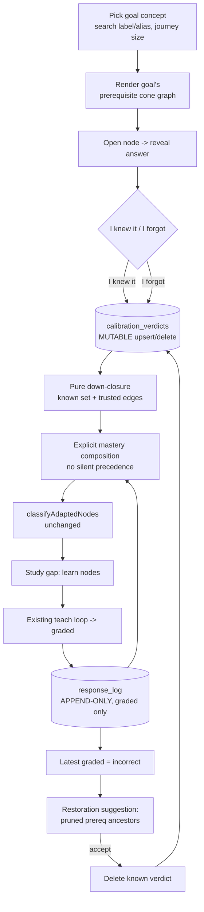
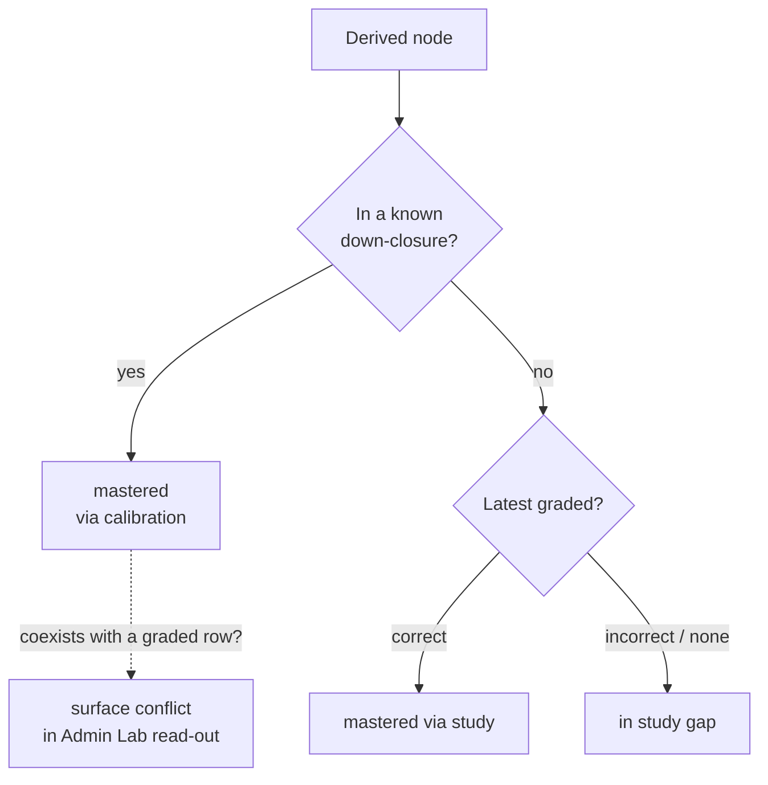

# feat: Graph-dissolved calibration & goal-first study loop

## Summary

Replace the separate weighted self-report calibration sweep with explicit calibration dissolved
into the study graph. The learner picks a goal concept first, then self-assesses nodes on the
goal's prerequisite cone: revealing a node's answer and tapping **"I knew it"** hard-prunes its
trusted prerequisite down-closure; **"I forgot"** keeps the node in the study gap. Calibration is
a **mutable verdict** per `(learner, node)` stored apart from the append-only response log (kept
for graded study only). A graded miss while studying the gap surfaces a **restoration
suggestion** to revisit related skipped prerequisites. All evidence weights are removed.

---

## Problem Frame

Two Admin Lab defects share one root cause (see origin). `buildCalibrationSet` scopes calibration
to a goal's prerequisite *ancestors only*, so a DAG-root goal yields an empty sweep; and
`selectScopedFrontier` collapses a root goal's scope to itself, so a pre-existing graded-correct
row classifies it `mastered` and fires "Goal reached" on entry. Both messages are correct given
the data — the fix is structural. The deeper issue is that the only "adapt from the start"
mechanism today (the weighted self-report sweep) is weak-evidence, a separate mode, and degenerate
for root goals. This plan dissolves calibration into per-node taps on the cone graph, makes it
explicit/deterministic/mutable, and retires the weighted apparatus.

---

## Requirements

Plan requirements reuse the origin R-IDs for traceability (see origin). They group into six
concerns.

### Goal-first entry
- R1. Goal selected first via concept search (label/alias); enrichment becomes a secondary
  switcher defaulting to latest.
- R2. Each goal candidate shows journey size (prerequisite-cone count); larger cones first.
- R3. A DAG-root goal is labeled "foundational — studied directly," selectable, and opens an
  honest single-node screen — never empty-calibration, never premature "Goal reached."

### Calibration dissolved into the graph
- R4. Study screen renders the goal's prerequisite cone as a cytoscape graph, goal marked.
- R5. Opening a node reveals its `self_assessment` card, then a binary choice: "I knew it" →
  `known` verdict + treat the prerequisite down-closure as mastered; "I forgot" → `learn` verdict
  (stays in gap).
- R6. The answer reveal is required before the choice.
- R7. Every choice is reversible (re-open to change/clear); reversal is a delete/overwrite of
  mutable state, no stale rows.
- R8. Down-closure walks trusted (`!uncertain`) prerequisite edges only.
- R9. Remaining `learn` nodes form the study gap, studied via the existing teach loop (unchanged).

### Explicit state & determinism
- R10. Calibration is a mutable verdict per `(learner, node)` stored separately from the
  append-only response log; no evidence weights.
- R11. Pruning is fully deterministic: `known` set + trusted edges → a fixed, unit-testable
  down-closure.
- R12. No signal silently overrides another; mastery composition is explicit and verdict/graded
  coexistence is surfaced, not silently resolved.

### Restoration re-calibration
- R13. Struggle = latest graded `incorrect` on a gap node, derived from existing graded rows (no
  new measurement type).
- R14. A struggle surfaces the struggled node's pruned prerequisite ancestors as restoration
  suggestions; accepting one clears its `known` verdict (returns to gap). Minimal v1: no ranking,
  no thresholds, suggestion derived on read (not persisted).

### Reset
- R15. Per-node reset = the R7 reversibility.
- R16. Per-learner reset = explicit operator nuke of all verdicts + all graded rows.
- R17. Per-goal/enrichment reset deferred.

### Removals (AGENTS rule 18, same change)
- R18. Retire `CalibrationSweep.tsx`, the "Calibrate" toggle, `propagateSelfReport`,
  `buildCalibrationSet`, the `0.3`/`0.15` constants, `appendSelfReportBatch`, and the
  `evidence_weight` column. Collapse the response log to graded-only (drop the `self_report`
  signal type, the `self_report_rating` column, and the fold's self-report branch). Re-home
  conflict detection onto verdict-vs-graded. Reshape/mock the synthetic simulator.

---

## High-Level Technical Design

The loop and the two-store split. Calibration verdicts are *current intent* (mutable); graded
study is *historical evidence* (append-only). They feed an explicit composition — never a silent
precedence — that the existing classifier consumes unchanged.

Mastery composition (R12) — explicit, with coexistence surfaced rather than resolved by a hidden
rule:

---

## Key Technical Decisions

- KTD1. **Calibration = mutable verdict store, separate from the measurement log.** Calibration is
  current intent (`known`/`learn`), naturally upsert/delete; the response log stays append-only for
  graded evidence. Splitting by nature is simpler and more explicit than reusing the log.
- KTD2. **Down-closure derived, not materialized.** A pure function computes `{X} ∪
  prerequisiteAncestors(X)` over trusted edges at read time. Reversal is a single verdict delete;
  no seeded rows to reconcile (R7, R11).
- KTD3. **No weights.** Drop `evidence_weight` (write-only today — no decision logic reads it) and
  the `0.3`/`0.15` constants (R10, rule 18).
- KTD4. **Explicit composition, no silent precedence.** Calibration `known` masters its closure;
  graded outcomes drive only un-pruned nodes; coexistence is surfaced (R12). This deliberately
  removes the fold's "graded always outranks self-report" rule from the calibration path.
- KTD5. **Collapse response log to graded-only.** With the sweep gone, `self_report` rows have no
  writer; drop the signal type, the `self_report_rating` column, the coherence CHECK branch, and
  the fold's self-report branch. Re-home `detectConflicts` onto (verdict `known` vs graded
  `incorrect`).
- KTD6. **Restoration derived from existing graded misses.** No new measurement type; the
  suggestion is a pure mapping computed on read and not persisted (R13, R14).
- KTD7. **Reset = per-node (reversibility) + per-learner nuke.** Per-goal deferred — extra scoping
  for little debug payoff (R15–R17).
- KTD8. **Goal search within the selected enrichment** for v1 (resolves origin open question 2).

---

## Implementation Units

### Phase 1 — Persistence & domain reshape

### U1. Calibration verdict store + response-log collapse

- **Goal:** Add the mutable `calibration_verdicts` table and its store/port; collapse
  `response_log` to graded-only; reflect both in domain types. The single source of calibration
  truth and the simplified measurement log.
- **Requirements:** R10, R12, R16, R18.
- **Dependencies:** none.
- **Files:**
  - `packages/infrastructure-postgres/src/migrations/0000_initial_lrnki_schema.sql` — add
    `calibration_verdicts (learner_state_ref, derived_node_id, verdict, updated_at, PRIMARY KEY
    (learner_state_ref, derived_node_id), verdict CHECK IN ('known','learn'))`; on `response_log`
    drop `evidence_weight`, drop `self_report_rating`, set `signal_type CHECK IN ('graded')`,
    remove the self_report branch of the coherence CHECK; update `artifact_response_log` view and
    the comment block asserting "no UPDATE/DELETE path" (still true for the log; the verdict table
    is explicitly mutable).
  - `packages/domain-core/src/index.ts` — add `CalibrationVerdict` type + `Verdict = 'known' |
    'learn'`; from `ResponseLogRow`/`NewResponseLogRow` drop `evidenceWeight`, `selfReportRating`;
    `SignalType = 'graded'`; remove `SelfReportRating` and `ratingToMastery`'s input type usage.
  - `packages/ports/src/index.ts` — add `CalibrationVerdictStorePort` (`upsert`, `delete`,
    `listForLearner`, `clearLearner`); trim `ResponseLogStorePort` of self-report-only helpers if
    any remain.
  - `packages/infrastructure-postgres/src/PostgresLearnerLoopStores.ts` — add
    `PostgresCalibrationVerdictStore`; update `PostgresResponseLogStore` row mapping (drop dropped
    columns).
  - `packages/infrastructure-postgres/src/PostgresLearnerLoopStores.test.ts` — update fixtures;
    add verdict-store coverage.
- **Approach:** Greenfield single migration (rule 8) — edit the one SQL file in place, no second
  migration. The verdict table is deliberately mutable (upsert/delete), unlike the log. Keep
  `derived_node_id`/`learner_state_ref` typing consistent with `response_log` (uuid / text).
- **Patterns to follow:** `PostgresResponseLogStore` for store shape and the `withClient`/`sql`
  tagged-template style; the existing coherence-CHECK style in the migration.
- **Test scenarios:**
  - Happy: upsert `known` then read back; upsert same node `learn` overwrites (one row, not two).
  - Edge: `delete` a verdict removes it; `clearLearner` removes all of a learner's verdicts only.
  - Edge: `verdict` CHECK rejects a value outside `known`/`learn`.
  - Integration: a graded row round-trips through `PostgresResponseLogStore` with the dropped
    columns absent (no `evidence_weight`/`self_report_rating` referenced).
  - Covers AE5. `clearLearner` plus log-clear leaves the learner with zero verdicts and zero rows.
- **Verification:** Migration applies on a fresh DB (rule 9 reset); store CRUD works; no
  `evidence_weight`/`self_report_rating`/`self_report` token remains in schema or types.

### U2. Retire the weighted self-report calibration path

- **Goal:** Delete the weighted sweep machinery and the self-report fold branch; reshape the
  synthetic simulator; fix exports. Leaves graded measurement + the (new) verdict path only.
- **Requirements:** R18, R12.
- **Dependencies:** U1.
- **Files:**
  - `packages/application/src/calibration.ts` — **delete** `propagateSelfReport`,
    `buildCalibrationSet`, `appendSelfReportBatch`, `SELF_REPORT_EVIDENCE_WEIGHT`,
    `PROPAGATED_SELF_REPORT_EVIDENCE_WEIGHT`, `CalibrationItem`, `SelfReportInput` (delete the file
    if nothing remains).
  - `packages/application/src/calibration.test.ts` — delete (replaced by U3 tests).
  - `packages/application/src/responseLogLearnerState.ts` — drop `ratingToMastery` and the
    self-report branch of `foldConceptMastery` (graded-only fold).
  - `packages/application/src/responseLogLearnerState.test.ts` — update fixtures to graded-only.
  - `packages/application/src/syntheticResponses.ts` — reshape `synthesizeResponses` to seed
    `calibration_verdicts` (deterministic from difficulty) + graded answers; drop
    `buildCalibrationSet`/`appendSelfReportBatch` usage. Scaffolding (EXPERIMENT_ONLY) — mock if
    reshape is heavier than its value.
  - `packages/application/src/index.ts` — remove deleted exports.
  - `packages/application/src/measurement.test.ts`, `optionSelectOutcome.ts/.test.ts` — drop
    `evidenceWeight` assertions/fields; `GRADED_EVIDENCE_WEIGHT` removed.
- **Approach:** Mechanical deletion guided by the U1 type changes — the compiler surfaces every
  caller. Synthetic simulator stays outside the authoritative core.
- **Patterns to follow:** existing `syntheticResponses.ts` structure (one append path) — keep the
  "single write path" property when retargeting to verdicts.
- **Test scenarios:**
  - Happy: `foldConceptMastery` over graded-only rows returns the latest graded outcome's mastery.
  - Edge: a node with no graded rows folds to 0.
  - Regression: grep finds zero references to the deleted symbols/weights across packages + apps.
  - Test expectation for synthetic reshape: deterministic verdict seeding from difficulty is
    unit-tested if kept; none if mocked (state which).
- **Verification:** `tsc`/test suite green after deletions; grep-clean for retired symbols.

### Phase 2 — Deterministic calibration core (pure)

### U3. Pure prune closure, mastery composition, restoration suggestion

- **Goal:** The durable, transfer-ready heart: three pure deterministic functions over a fixture
  DAG. No store, no clock, no model.
- **Requirements:** R8, R11, R12, R13, R14.
- **Dependencies:** U1 (types).
- **Files:**
  - `packages/application/src/calibrationClosure.ts` (new) — `pruneClosure(knownNodeIds,
    trustedEdges): Set<string>` = union over each `known` X of `{X} ∪ prerequisiteAncestors(X)`;
    `composeMastery({ knownClosure, gradedByNode }): Record<string, number>` (calibration-known →
    mastered; else graded mastery; surface coexistence flags); `suggestRestorations({
    struggledNodeIds, knownClosure, trustedEdges }): Record<string, string[]>` mapping each
    struggled node to its pruned prerequisite ancestors; `struggledNodes(gradedRows): string[]`
    (latest graded `incorrect`).
  - `packages/application/src/calibrationClosure.test.ts` (new) — fixture-DAG coverage.
  - `packages/application/src/index.ts` — export the new functions/types.
- **Approach:** Reuse `prerequisiteAncestors` from `prerequisiteDag.ts` and the `!uncertain` filter
  convention. Keep functions edge-shape-agnostic (accept the minimal `ReadinessEdge` shape) so the
  Admin Lab loader and a future Learner app share one definition (rule 18).
- **Execution note:** Implement test-first — these encode the success-criteria determinism.
- **Patterns to follow:** `prerequisiteDag.ts` (pure, sorted-input determinism) and
  `adaptivePathProjection.ts`'s `ReadinessEdge` minimal-shape pattern.
- **Test scenarios:**
  - Covers R11. `pruneClosure` over a fixture DAG (`A→B→D`, `C→D`, `E→D`): `known={D}` →
    `{D,A,B,C,E}`; `known={B}` → `{B,A}`; ordering-independent, idempotent.
  - Covers R8. An ancestor reachable only via an uncertain edge is excluded from the closure.
  - Edge: closure terminates on an uncertain-edge cycle (seen-set guard) and never credits the
    goal through uncertain edges.
  - Covers R12. `composeMastery`: a `known`-closure node is mastered even with a coexisting graded
    `incorrect`, and the coexistence is flagged (not silently dropped).
  - Covers R14. `suggestRestorations`: struggled node `Y` with pruned ancestor `A` → `{Y:[A]}`; a
    struggled node whose ancestors are all unpruned → empty; non-struggled nodes → absent.
  - Edge: `struggledNodes` picks the *latest* graded per node (a later `correct` clears an earlier
    `incorrect`).
- **Verification:** All pure-function tests pass; no import of stores/clock/model.

### Phase 3 — Goal-first entry

### U4. Goal-first study start

- **Goal:** Reshape the study-start surface to pick a goal concept first (search by label/alias,
  journey-size ordering, foundational-root labeling); enrichment becomes a secondary switcher.
- **Requirements:** R1, R2, R3.
- **Dependencies:** U3 (cone-size helper) — reuses `prerequisiteAncestors`.
- **Files:**
  - `apps/admin-lab/src/lib/derivedGraph.ts` — surface `aliases` on `DerivedGraphNode` (currently
    label-only) for alias search; add a journey-size (cone-count) helper or expose certain edges.
  - `apps/admin-lab/src/lib/enrichments.ts` — `getEnrichmentDetail` to include aliases.
  - `apps/admin-lab/src/app/admin/lab/study/page.tsx` — reorder to goal-first: a searchable goal
    list (label/alias) with journey-size badges, larger-cone-first ordering, and a
    "foundational — studied directly" tag for zero-prerequisite goals; enrichment selector demoted
    to a secondary control defaulting to latest.
  - `apps/admin-lab/src/app/admin/lab/study/StudyStartForm.tsx` — minor: it already carries
    `targetDerivedNodeId`; ensure it works from the goal-first flow.
- **Approach:** Compute journey size as `prerequisiteAncestors(node, certainEdges).size` per
  candidate. Search is client-side over the loaded enrichment's nodes (scope = selected enrichment,
  KTD8). Keep server-rendered step pattern.
- **Patterns to follow:** the existing three-step query-param flow in `page.tsx`; badge usage from
  the current goal list.
- **Test scenarios:**
  - Happy: goals list orders by descending cone size; search matches label and alias substrings.
  - Covers R3. A zero-prerequisite goal renders with the "foundational" tag and remains selectable.
  - Edge: an enrichment with no nodes renders the existing empty state.
  - Test expectation: journey-size + search filtering are pure helpers — unit-test those; the page
    wiring is exercised in U8 real-use inspection.
- **Verification:** Picking the economics root goal is selectable and tagged foundational; goal
  search returns it by label.

### Phase 4 — Calibration dissolved into the graph

### U5. Reveal-answer binary self-assessment card

- **Goal:** Turn the side-sheet card into reveal-then-binary-choice (`I knew it` / `I forgot`) for
  calibration, keeping the modules transfer-ready (injected callbacks, no loader/action imports).
- **Requirements:** R5, R6, R7.
- **Dependencies:** U3 (verdict/choice types).
- **Files:**
  - `apps/admin-lab/src/components/study/studyView.ts` — replace `CalibrationChoice`
    (`know_it`/`not_sure`) + `calibrationRatingFor` with the binary verdict mapping
    (`known`/`learn`); update `SheetContent` to a calibration kind carrying the card + current
    verdict; keep `nextStudyTarget`/`shouldAcceptSheetOpenChange`.
  - `apps/admin-lab/src/components/study/studyView.test.ts` — update for the binary mapping;
    drop the `CalibrationSweep.tsx` reference in the transfer-ready file list.
  - `apps/admin-lab/src/components/study/RecallCard.tsx` — add reveal control gating the answer,
    then `I knew it` / `I forgot` buttons (disabled until revealed, R6); show current verdict;
    injected `onVerdict`/`onClear`.
  - `apps/admin-lab/src/components/study/StudySideSheet.tsx` — render the calibration card kind;
    wire reveal + verdict callbacks; keep the locked / mastered-review kinds.
- **Approach:** Labels are learner-voice `I knew it` / `I forgot` (effect described in helper
  text). Reuse the existing reveal-gates-assess pattern already in `RecallCard`/`OptionSelectCard`.
- **Patterns to follow:** current `RecallCard` reveal gating; `studyView.ts` "no Admin-Lab import"
  contract (rule 18 transfer-ready).
- **Test scenarios:**
  - Covers R5. The verdict mapping returns `known` for "I knew it", `learn` for "I forgot".
  - Covers R6. Assess buttons are disabled until the answer is revealed.
  - Happy: re-opening a node with an existing verdict shows it as current (supports R7 reversal).
  - Test expectation: pure mapping/guards unit-tested; visual behavior verified in U8.
- **Verification:** Card reveals then offers the binary choice; transfer-ready file list no longer
  references the deleted sweep.

### U6. Verdict actions, loader rewiring, reset, retire sweep UI

- **Goal:** Wire calibration end-to-end: server actions upsert/delete verdicts and reset a learner;
  the study-session loader scopes the graph to the goal cone and composes mastery via U3; the
  driver removes the Calibrate toggle/sweep and fixes the root-goal screen.
- **Requirements:** R3, R4, R7, R9, R12, R16, R18.
- **Dependencies:** U1, U2, U3, U4, U5.
- **Files:**
  - `apps/admin-lab/src/app/admin/lab/study/actions.ts` — replace `submitCalibration`
    (sweep/propagate) with `setVerdict({learner, derivedNodeId, verdict})`, `clearVerdict(...)`,
    and `resetLearner({learner})` (clears verdicts + graded rows, R16); keep `submitOptionSelect`.
  - `apps/admin-lab/src/lib/studySession.ts` — load verdicts; build `knownClosure` via U3; compose
    mastery via U3 (replacing the graded-fold-only `buildMasteryMap` feed for calibration);
    classify; **fix `selectScopedFrontier`** so a DAG-root goal opens a single-node study screen
    instead of classifying mastered → null frontier (R3); drop `calibrationItems`/`buildCalibrationSet`.
  - `apps/admin-lab/src/components/study/StudySession.tsx` — remove the Calibrate toggle and
    `CalibrationSweep`; tapping a cone node opens the reveal/verdict card (U5); a foundational root
    renders the honest single-node screen; wire `setVerdict`/`clearVerdict`/`resetLearner`.
  - `apps/admin-lab/src/components/study/CalibrationSweep.tsx` — **delete**.
  - `apps/admin-lab/src/lib/learnerLoop.ts` — re-home `detectConflicts` to (verdict `known` vs
    graded `incorrect`); `buildMasteryMap` graded-only.
  - `apps/admin-lab/src/lib/learnerLoop.test.ts` — update conflict + mastery fixtures.
- **Approach:** Verdict writes mutate learner state only (no graph/derived-layer write port —
  preserve the rule-12 structural guarantee). Each action `revalidatePath`s the session route so
  the server recomputes closure + classification and the driver re-renders (the existing
  re-fold-on-response pattern). The root-goal fix: when the goal's trusted-edge cone is just
  itself, render its own study item directly rather than treating an existing graded row as
  "everything mastered."
- **Patterns to follow:** existing `actions.ts` (`revalidatePath`, learner-state-only mutation),
  `getStudySession` loader composition, the `StudySession` re-fold/advance effect.
- **Test scenarios:**
  - Covers AE2. `setVerdict known` on a high node removes it + its trusted closure from the gap;
    `clearVerdict` returns them (R7/R8/R11 via U3, exercised through the loader).
  - Covers AE1/R3. The economics root goal opens a single-node screen — no empty-calibration, no
    "Goal reached."
  - Covers AE5/R16. `resetLearner` clears verdicts + graded rows.
  - Covers R12. The loader marks a `known` node mastered even with a coexisting graded `incorrect`,
    and surfaces the coexistence to the conflict read-out.
  - Integration: a verdict write → `revalidatePath` → recomputed classification re-renders.
  - Edge: tapping a locked / mastered node still shows its existing gated sheet kind.
- **Verification:** Real session: pruning visibly collapses the cone; reset returns to clean slate;
  no Calibrate toggle remains.

### U7. Restoration re-calibration nudge

- **Goal:** Surface restoration suggestions when the learner misses a gap node, letting them
  restore related skipped prerequisites.
- **Requirements:** R13, R14.
- **Dependencies:** U3, U6.
- **Files:**
  - `apps/admin-lab/src/lib/studySession.ts` — compute `suggestRestorations` (U3) from the
    learner's graded misses + current `knownClosure`; expose on the session payload.
  - `apps/admin-lab/src/components/study/StudySession.tsx` — render a non-blocking nudge listing
    suggested skipped prerequisites for struggled nodes; a "restore" affordance calls
    `clearVerdict` (U6) to return the node to the gap.
- **Approach:** Suggestion is derived on read (not persisted, KTD6). Restore reuses the U6
  `clearVerdict` action and the same recompute path. Keep v1 minimal — no ranking/thresholds.
- **Patterns to follow:** the session-payload + driver render pattern from U6; the existing
  source-summary badge area for non-blocking surfacing.
- **Test scenarios:**
  - Covers R13/R14. A graded `incorrect` on `Y` whose pruned ancestor is `A` surfaces `A` as a
    suggestion; accepting restores `A` to the gap.
  - Edge: no graded misses → no nudge; struggled node with no pruned ancestors → no suggestion.
  - Edge: a later `correct` on `Y` clears the suggestion (latest-graded wins, via U3).
  - Integration: restore → `revalidatePath` → `A` re-appears in the gap classification.
- **Verification:** Real session: missing a downstream item nudges restoration of the right
  skipped prerequisite; accepting re-lights it.

### Phase 5 — Quality

### U8. Real-use quality evaluation

- **Goal:** Per AGENTS rule 14 and the real-use-quality skill, inspect representative real-use
  output before declaring the milestone done.
- **Requirements:** Success criteria; R3, R5, R14, R16.
- **Dependencies:** U1–U7.
- **Files:** none (inspection + evaluation note in the PR/implementation report; scratch under
  `tmp/`).
- **Approach:** Run two cones with real data: the economics root goal *Surplus Produce of Labour*
  (root-goal fix, R3) and a deep-narrow Rust cone (prune + restoration depth). Inspect: the
  goal-first picker + journey sizes; the cone graph collapse on "I knew it" and its reversal; the
  single-node root screen; a graded miss surfacing the correct restoration suggestion; per-learner
  reset to clean slate.
- **Test expectation:** none — this is inspection, not automated tests (rule 14: a green suite is
  never quality evidence for neural-adjacent output).
- **Verification:** Evaluation note classifies the result PASS / FIX_FIRST / EXPERIMENT_ONLY /
  BLOCKED with concrete examples and caveats; foundational defects fixed before closing.

---

## Acceptance Examples

- AE1. **Root goal opens cleanly.** Given the economics root goal, When the learner opens the study
  screen, Then a single-node "foundational — studied directly" screen renders — no
  empty-calibration message, no "Goal reached." (R3; U4, U6)
- AE2. **Prune + reverse.** Given a goal cone, When the learner reveals a high node and taps "I
  knew it," Then the node and its trusted prerequisite down-closure leave the gap; When they
  re-open and clear it, Then the cone returns. (R5/R7/R8/R11; U3, U5, U6)
- AE3. **No silent override.** Given a `known` node that also has a graded `incorrect` row (post
  reset/replay), Then the node is mastered via calibration AND the coexistence is surfaced in the
  read-out — never silently resolved. (R12; U3, U6)
- AE4. **Restoration.** Given the learner pruned `A` (a prerequisite of `Y`) and is studying the
  gap, When they answer `Y` incorrectly, Then `A` is suggested for restoration; When they accept,
  Then `A` returns to the gap. (R13/R14; U3, U7)
- AE5. **Reset.** Given a learner with verdicts and graded rows, When the operator triggers
  per-learner reset, Then all verdicts and graded rows are cleared. (R16; U1, U6)

---

## Scope Boundaries

### Deferred for later
- Per-goal/enrichment reset (R17) — per-node + per-learner ship now.
- Restoration ranking / failure-count thresholds / persisted suggestions — v1 is minimal (R14).
- Goal search across all published enrichments — v1 is within the selected enrichment (KTD8).

### Outside this product's identity
- Adaptive probe selection / poset binary search (origin non-goal).
- Soft / weighted / probabilistic pruning and any evidence-weight gradient.
- A three-way "worth exploring" choice — superseded by restoration suggestions.
- Real learner modeling / IRT / KT (ADR-0014, ADR-0024).
- Graph granularity and new study-item types (separate tracks).

---

## Risks & Dependencies

- **Schema collapse ripple.** Dropping `evidence_weight`/`self_report_rating`/`self_report` touches
  many fixtures across `domain-core`, `infrastructure-postgres`, and `application` tests. Mitigation:
  U1 lands the type/schema change first so the compiler enumerates every site; U2 is mechanical.
- **`detectConflicts` behavior change.** Re-homing from self-report-vs-graded to verdict-vs-graded
  changes what the Admin Lab flags. Mitigation: explicit unit fixtures in U6; surface coexistence
  rather than drop it (R12).
- **Append-only invariant edit.** The migration comment and coherence CHECK encode "no UPDATE/DELETE
  on the log." The log stays append-only; only the *new verdict table* is mutable — keep the comment
  accurate so the next reader isn't misled (rule 18).
- **Synthetic simulator reshape.** EXPERIMENT_ONLY scaffolding; mock rather than over-invest if the
  verdict-seeding reshape costs more than its inspection value.
- **Cytoscape tap → reveal card.** The graph already opens a side sheet on node tap; reuse that path
  rather than adding a new interaction model.

Dependencies/assumptions (origin): per-node `self_assessment` items remain the calibration surface
(59/59 economics coverage verified); trusted `inferred-prerequisite-of` edges are the substrate; the
`studyView.ts` contract stays the shared transfer-ready definition.

---

## Sources / Research

- Empty-calibration root cause: `packages/application/src/calibration.ts` `buildCalibrationSet`
  (prerequisite-ancestor scope).
- Premature completion: `apps/admin-lab/src/lib/studySession.ts` `selectScopedFrontier`
  (root scope = itself).
- Mastery fold + threshold: `packages/application/src/responseLogLearnerState.ts`
  `foldConceptMastery`; `packages/application/src/adaptivePathProjection.ts`
  `classifyAdaptedNodes` / `ADAPTIVE_MASTERY_THRESHOLD` (0.7).
- `evidence_weight` is write-only: no decision logic reads it — `foldConceptMastery` ranks by
  `signalType` + recency (confirmed by grep; only stored and asserted in two tests).
- Conflict detection to re-home: `apps/admin-lab/src/lib/learnerLoop.ts` `detectConflicts`.
- Graph tap → side sheet interaction: `apps/admin-lab/src/components/DerivedGraphExplorer.tsx`
  (`onNodeSelect`), `apps/admin-lab/src/components/study/StudySideSheet.tsx`.
- Response-log schema + coherence CHECK: `packages/infrastructure-postgres/src/migrations/0000_initial_lrnki_schema.sql`
  (response_log DDL, `artifact_response_log` view).
- Pure DAG helpers to reuse: `packages/application/src/prerequisiteDag.ts` `prerequisiteAncestors`.
