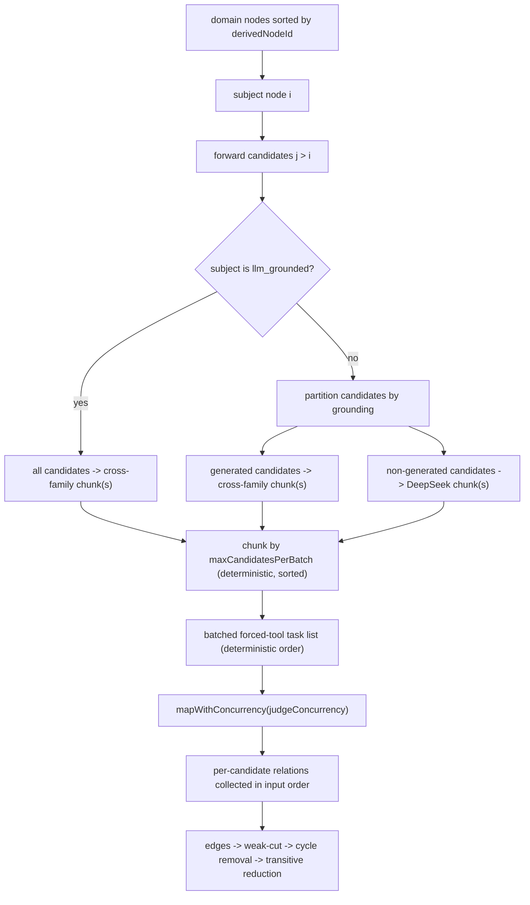
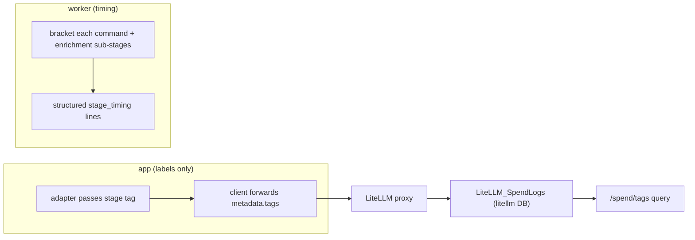

# perf: Enrichment speed and token reduction via per-node batched judging

## Summary

Stand up a measure-first instrument (LiteLLM-native spend tags + worker-side per-stage
wall-clock), baseline the current generation run, then reshape Graph Enrichment from one
forced-tool judge per same-domain pair to one batched judge call per node over its
same-domain candidates. Coverage stays exhaustive, so the graph is unchanged; the per-pair
path is deleted in the same change once a rule-14 parity inspection confirms the certain-edge
set holds. The per-node unit is also factored as the future incremental-growth primitive, and
the bounded-concurrency seam generalizes to extraction and study-item generation (wired now,
parallelism deferred).

---

## Problem Frame

A full generation run (`scripts/seed-demo.sh`) takes ~45 minutes, fully serial, and the worker
emits no per-stage timing — so the time split is assumed, not measured. Within enrichment the
cost is quadratic by construction: `sameDomainPairs` in
`packages/application/src/runGraphEnrichment.ts` enumerates every unordered same-domain pair
and fires one forced-tool judge per pair. On enrichment `a78cb25f` that was **417 judge calls**
producing only **51 certain edges** — ~88% of the most expensive work returns "no relation,"
and one domain (machine learning systems, 23 nodes) accounts for 253 of the 417 calls, partly
because both the PDF and Markdown of the same paper sit in it.

Wall-clock is the pain today (one developer debugging generation); token spend becomes the pain
at ~5× test users. The graph's concept count is already correct — the goal is the **same graph,
generated faster and cheaper**, not a smaller graph. Per AGENTS rule 13, this is a real-LLM,
real-use change measured against a recorded baseline.

---

## High-Level Technical Design

### Per-node batched judging with split routing

Each domain's nodes are sorted by stable `derivedNodeId`. Subject node `i` is judged in one
batched call against its **forward** candidates (`j > i`), which covers every unordered relation
exactly once — identical coverage to the `for i, for j>i` pairwise loop, regrouped from
O(n²) calls into ~O(n). Candidates are split by routing class so the DeepSeek generator never
grades its own minted output, and a per-batch cap chunks large candidate lists deterministically.

The judge returns, per candidate, a relation (`prerequisite` / `none` / `uncertain`) naming the
prerequisite concept by its verbatim label — carrying over the existing named-label mitigation.
The application maps each result fail-closed: a `prerequisite` relation whose label matches
neither the subject nor that candidate degrades to `uncertain` (flagged, path-excluded), never
an invented edge. Symbolic disposal and intrinsic difficulty downstream are unchanged.

### Measurement seam

Token/cost attribution rides LiteLLM-native spend tracking; the app only labels requests. Wall
-clock — which LiteLLM cannot see — is timed in the worker.

---

## Key Technical Decisions

- KTD1. Per-node forward-candidate batching. Subject node `i` is judged against forward
  candidates (`j > i`) in one batched call, covering each unordered relation exactly once.
  Rationale: regroups calls without dropping any relation (R5), so it carries no
  quality-regression risk and does not trip AGENTS rule 16's measured-veto requirement.

- KTD2. Generated-node ordering stays a separate cross-family call. A subject's forward
  candidates split into generated-touching (subject or candidate is `llm_grounded` → the
  `kg-generated-prerequisite-judgment` cross-family alias) and pure-DeepSeek, yielding up to two
  batched calls per node. Rationale: preserves the ADR-0023 invariant that the DeepSeek
  generator never grades its own minted output; folding into one mixed call would either break
  that guard or over-route everything cross-family.

- KTD3. Candidate-list cap with deterministic chunking. A configurable `maxCandidatesPerBatch`
  splits an over-cap candidate list (within a routing class) into sorted chunks → multiple
  batched calls. Rationale: keeps listwise judge quality (pointwise-vs-listwise reranking
  tradeoff) while staying ~O(n) in the small-graph regime. The exact cap is tuned in the rule-14
  pass (Open Questions), not pre-committed.

- KTD4. Spend attribution via LiteLLM-native tags; app labels only.
  `LiteLlmForcedToolClient.call` accepts `tags` and forwards them as `metadata.tags`; each
  adapter passes its stage tag. Rationale: honors the standing "no app-level cost capture" rule
  — the app computes and stores no cost; `/spend/tags` does the attribution.

- KTD5. Worker-side per-stage wall-clock. The worker brackets each top-level command and the
  enrichment sub-stages (rescue+mint, batched judging, symbolic disposal, difficulty), emitting
  structured timing lines. Rationale: stage wall-clock is invisible to LiteLLM and is the
  evidence R1 requires.

- KTD6. The per-node operation is the incremental-growth primitive. The batched judge is factored
  as a `judgeNodeAgainstCandidates(subject, candidates)` boundary so "enrich one new node against
  an existing layer" is the same call. Rationale: the reshape that buys speed now is the
  foundation for future learner-driven extension — designed-for, not triggered (the trigger stays
  out of scope under the TODO #5 graph-growth guard).

- KTD7. Parity-gated deletion of the per-pair path. The pairwise certain-edge set is recorded as
  a disposable baseline before the reshape; the reshape deletes `sameDomainPairs` and the per-pair
  loop in the same change; the rule-14 inspection confirms parity against the recorded baseline.
  Rationale: satisfies AGENTS rule 18 (delete the superseded path in the same change) without
  keeping a stale second path alive just to diff against.

- KTD8. One shared bounded-concurrency helper. Extract a single `mapWithConcurrency` for the
  per-node unit and the two new seams; leave the four other duplicate copies
  (`applyAdmissionLabelJudge`, `applyAssertionEntailmentJudge`, `applyRescueDurabilityJudge`,
  `executeExtractionRun`) untouched. Rationale: lifts the helper the seams need without a
  same-PR five-call-site consolidation that exceeds this change's scope.

---

## Requirements

Carried from the origin requirements doc (R-IDs preserved for traceability;
see origin: `docs/brainstorms/2026-06-22-enrichment-speed-and-token-reduction-requirements.md`).

**Measurement (baseline-first)**

- R1. A repeatable measurement records per-stage wall-clock for a full generation run, so the
  dominant time sink is identified by evidence rather than assumption.
- R2. Per-call token usage and cost attribute to pipeline stage through LiteLLM-native spend
  tracking; the app labels each request with a stage tag and computes/stores no cost itself.
- R3. The current-state run is baselined before the enrichment change and re-measured after using
  the same instrument, so the improvement is proven against the baseline.

**Node-centric batched enrichment (Approach A)**

- R4. Enrichment judges prerequisite relations per node over its same-domain candidates in batched
  forced-tool calls, replacing the per-pair judge loop in
  `packages/application/src/runGraphEnrichment.ts`.
- R5. Coverage equals the exhaustive baseline: every same-domain relation the pairwise pass would
  evaluate is still evaluated; no candidate pair is silently dropped.
- R6. Batched judge output is validated fail-closed (AGENTS rule 6): each returned relation must
  name one of the provided candidate labels with a direction, or it degrades to `uncertain`
  (flagged, path-excluded) — never an invented edge.
- R7. The enrichment unit is structured so that enriching one new node against an existing layer is
  the natural primitive, providing the foundation for future incremental growth.
- R8. The persisted trace stays replay-deterministic (stable node/candidate ordering; results
  collected in input order regardless of completion order), matching the current contract.
- R9. The batched contract is inspected per AGENTS rule 14 against the current pairwise output on
  the existing manifest before it replaces the exhaustive path, and the old path is removed in the
  same change once parity holds (rule 18).

**Parallelism and future-module seams**

- R10. Independent enrichment work runs concurrently with a bounded, configurable degree (the
  existing `judgeConcurrency`, generalized to the per-node unit).
- R11. Extraction-over-sources and study-item generation expose an interface that admits future
  parallelism without an architectural change; the seam is planned now, the parallel
  implementation deferred.

**Deferred embeddings evaluation (Approach B)**

- R12. Embeddings are not adopted for prerequisite candidate selection in this effort.
- R13. A later, separate evaluation assesses embeddings only for non-prerequisite, similarity-driven
  tasks — never the merge authority and never a veto. No code in this plan.

---

## Implementation Units

### U1. LiteLLM request stage-tagging

- Goal: Every production LLM request carries a stage tag so `/spend/tags` attributes token/cost
  to pipeline stage, with no cost computed or stored in application code (R2, AE3).
- Requirements: R2. Covers AE3.
- Dependencies: none.
- Files:
  - `packages/infrastructure-litellm/src/LiteLlmForcedToolClient.ts` — `call` accepts optional
    `tags?: string[]` and includes `metadata: { tags }` in the request body when present.
  - `packages/infrastructure-litellm/src/stageTags.ts` (new) — stage-tag constants
    (`enrichment-judge`, `generated-enrichment-judge`, `cep-extraction`, `concept-discovery`,
    `admission`, `admission-label-judge`, `assertion-entailment`, `rescue-durability`,
    `intrinsic-difficulty`, `study-item-generation`, `answer-grading`, `learner-simulation`).
  - Each adapter in `packages/infrastructure-litellm/src/` (extraction, enrichment, study-item,
    grading, simulation adapters) — pass its stage tag on every `client.call`.
  - `litellm/config.yaml` — make the already-active spend wiring self-documenting: the dedicated
    `litellm` DB is provisioned by `scripts/docker/postgres/01-init-litellm-db.sh` and wired via
    `docker-compose.yml`; `store_prompts_in_spend_logs` is already true. No app DB change.
  - `packages/infrastructure-litellm/src/LiteLlmForcedToolClient.test.ts`
- Approach: The two shared client instances (`discoveryClient`, `deterministicClient`) are reused
  across many stages, so the tag must travel per call from the adapter, not per client. Add the
  `tags` pass-through at the transport and the stage constant at each adapter. The transport stays
  a neutral forwarder — it never reads, sums, or persists usage (KTD4). Verify the tag
  mechanism against the running proxy (LiteLLM v1.88.1): `metadata.tags` is consumed by the proxy
  for spend logging and is not a provider param, so `drop_params: true` should not strip it —
  confirm a tag reaches `LiteLLM_SpendLogs` before tagging every stage.
- Patterns to follow: the existing `extra_body`/`temperature`/`seed` conditional spread in
  `callOnce` for shape; the per-adapter model-alias constants already exported from the enrichment
  adapter.
- Test scenarios:
  - Happy path: `call` with `tags: ["enrichment-judge"]` includes `metadata.tags` in the POST body.
  - Edge: `call` with no `tags` omits `metadata` entirely (no empty key).
  - Edge: tags pass-through does not alter `tool_choice`, `strict`, or validator behavior.
  - Covers AE3. No assertion on model output content (rule 11); the body shape is the deterministic
    envelope under test.
- Verification: a tagged forced-tool call round-trips through LiteLLM and the tag appears in
  `LiteLLM_SpendLogs`; `/spend/tags` returns a non-empty row for the tag.

### U2. Worker per-stage wall-clock timing

- Goal: A full generation run emits per-stage wall-clock so the dominant time sink is evidence,
  not assumption (R1).
- Requirements: R1.
- Dependencies: none.
- Files:
  - `apps/kg-worker/src/knowledgeGraphWorker.ts` — a small timing helper that brackets each
    top-level command and emits a structured `stage_timing` line (`stage`, `ms`).
  - `packages/application/src/runGraphEnrichment.ts` — optional sub-stage timing hook (rescue+mint,
    batched judging, symbolic disposal, difficulty) surfaced through an injected `onStageTiming`
    callback so the application stays free of console I/O.
  - `scripts/seed-demo.sh` — the existing `step` function may print elapsed wall-clock per step as
    a convenience; the worker lines remain the single structured source.
- Approach: Each `worker:kg` command runs as its own process in the serial chain, so per-command
  timing plus enrichment sub-stage timing together give the full-run split. Keep the timing helper
  deterministic (monotonic clock) and side-effect-only (logging), never part of a persisted
  artifact.
- Patterns to follow: the existing `step()`/`console.log` reporting in the worker and seed script.
- Test scenarios:
  - Happy path: the timing helper returns a non-negative integer ms and emits one structured line
    per bracketed stage.
  - Edge: a throwing stage still reports its (partial) timing before the error propagates.
- Verification: running the seed chain prints a `stage_timing` line per stage with plausible
  monotonic durations summing toward the full run.

### U3. Capture the current-state baseline

- Goal: Record the pre-change baseline with the U1+U2 instrument — per-stage wall-clock, per-tag
  token/cost via `/spend/tags`, and the enrichment **certain-edge set** — so the improvement is
  proven against it (R3) and the parity gate (R9/AE2) has a fixed reference.
- Requirements: R3. Feeds R9, AE2.
- Dependencies: U1, U2.
- Files:
  - `tmp/2026-06-22-enrichment-baseline/` (gitignored, disposable per AGENTS rules 10/11) — the
    recorded wall-clock split, `/spend/tags` totals, and the certain-edge set from a current-state
    full run on the existing manifest.
- Approach: No code. Run the unchanged pipeline once via `scripts/seed-demo.sh` (real LLM calls)
  with the instrument active; persist the three artifacts to `tmp/`. This run still uses the
  per-pair path — it is the last exercise of that path before U5 deletes it.
- Test expectation: none — this is a measurement/run unit; its deliverable is the recorded
  baseline artifact, not code.
- Verification: `tmp/` holds the wall-clock split, the per-tag spend totals, and the exact
  certain-edge set (prerequisite→dependent derived-node pairs) for the manifest run.

### U4. Batched per-node prerequisite judge (schema + adapter)

- Goal: A forced-tool batched judge that, given a subject concept and a bounded list of candidate
  concepts, returns a per-candidate relation naming the prerequisite by verbatim label, mapped to
  typed judgments fail-closed (R4, R6).
- Requirements: R4, R6. Covers AE1.
- Dependencies: none; consumed by U5.
- Files:
  - `packages/infrastructure-litellm/src/toolSchemas.ts` — new `batchedPrerequisiteJudgmentSchema`
    + validator (subject + candidate list → array of `{candidateRef, relation, prerequisiteLabel,
    confidence, rationale}`); delete the single-pair `prerequisiteJudgmentSchema`/validator
    (rule 18).
  - `packages/infrastructure-litellm/src/enrichmentAdapters.ts` — `judge` becomes batched; delete
    the per-pair rendering/mapping. The generated-node adapter reuses the same batched adapter with
    the `kg-generated-prerequisite-judgment` alias (as today).
  - `packages/ports/src/index.ts` — `PrerequisiteJudgmentPort.judge` reshaped to
    `judge({ declaredDomain, subject, candidates }) → BatchedPrerequisiteJudgment` (delete the
    `{a, b}` shape).
  - `packages/domain-core/src/index.ts` — batched judgment result type; reuse
    `PrerequisiteConceptContext` for each side.
  - `packages/infrastructure-litellm/src/enrichmentAdapters.test.ts`
- Approach: Keep the named-label mitigation from the per-pair adapter — the model copies the
  verbatim label of the concept that must be understood first; the application matches it against
  the subject and that candidate, failing closed to `uncertain` on no match. Rubric and schema
  `description` fields stay domain-neutral (AGENTS rule 17). The schema tolerates a bounded
  candidate list; the application enforces the cap (U5). Each result identifies its candidate by
  `candidateRef` = the candidate's verbatim canonical label (labels are unique within a domain batch
  under ADR-0015 dedup); a `candidateRef` matching no provided candidate is dropped fail-closed,
  never mapped to a guessed candidate.
- Patterns to follow: the existing `LiteLlmPrerequisiteJudgmentAdapter` label-normalization and
  fail-closed mapping; the `strict:true` + zod re-validation contract in `toolSchemas.ts`.
- Test scenarios (deterministic envelope over a canned tool response — rule 11):
  - Happy path: a candidate whose `prerequisiteLabel` equals the subject label → directed edge
    (subject is prerequisite); equals the candidate label → directed edge (candidate is
    prerequisite).
  - Covers AE1: a relation whose label matches neither subject nor that candidate → `uncertain`,
    not an edge.
  - Edge: `relation: "none"` → dropped (no edge); `relation: "uncertain"` → flagged, path-excluded.
  - Edge: per-candidate results map to the correct candidate derived-node ids regardless of array
    order.
  - Error: a tool response missing a required field fails the validator (fail-closed, rule 6).
  - Error: a result whose `candidateRef` matches no provided candidate is dropped (fail-closed),
    not mapped to a guessed candidate.
- Verification: the adapter returns one typed judgment per candidate; no candidate produces an edge
  whose label was never provided.

### U5. Reshape runGraphEnrichment to per-node batched judging

- Goal: Replace the per-pair enumeration and loop with per-node forward-candidate batched calls
  (split routing + deterministic chunking + bounded concurrency), factor the incremental-growth
  primitive, and delete the per-pair path in the same change (R4, R5, R7, R8, R9, R10; rules 16, 18).
- Requirements: R4, R5, R7, R8, R9, R10. Covers AE1, AE2.
- Dependencies: U4. (The U3 recorded baseline must exist before this unit's deletion is accepted
  via the U7 parity gate.)
- Files:
  - `packages/application/src/runGraphEnrichment.ts` — delete `sameDomainPairs` and the per-pair
    `mapWithConcurrency(pairs, ...)` loop; add per-domain sort → forward-candidate selection →
    routing split (KTD2) → chunking (KTD3) → deterministic batched-task list → bounded-concurrency
    map → flatten per-candidate results to edges, collected in input order.
  - `packages/application/src/runGraphEnrichment.ts` (`GraphEnrichmentConfig`) — add
    `maxCandidatesPerBatch`; update the `judgeConcurrency` / `maxMentionsPerConceptInPair` comments
    to the per-node unit semantics.
  - `packages/application/src/judgeNodeAgainstCandidates.ts` (new) — the reusable per-node boundary
    (KTD6), called by `runGraphEnrichment` for each subject; shaped so a future incremental path
    can call it with one new subject against an existing candidate set.
  - `docs/adr/0019-graph-enrichment-derived-layer.md` — amend in place
    ("amended 2026-06-22 — per-node batched judging; coverage unchanged, call grouping regrouped");
    update the "every unordered same-domain pair … one forced-tool judge per pair" prose.
  - `litellm/config.yaml`, `packages/ports/src/index.ts`,
    `packages/infrastructure-litellm/src/enrichmentAdapters.ts` — replace the stale
    "every same-domain CEP pair is judged" / "ONE same-domain concept pair" comments so exactly one
    source of truth describes the contract (rule 18).
  - `packages/application/src/runGraphEnrichment.test.ts`
- Approach: Forward batching (subject `i` vs candidates `j > i`) makes the union of batched calls
  cover the same unordered relations as the pairwise loop (KTD1). Routing split keeps generated
  candidates on the cross-family judge (KTD2). The unit of work for `mapWithConcurrency` becomes a
  batched-call task `(subject, candidate-chunk, judge)`; `judgeConcurrency` now bounds concurrent
  batched calls (R10). Deterministic node/candidate ordering and input-order collection preserve
  the replay contract (R8). A batched call that exhausts the forced-tool retry budget still throws,
  failing the run before persistence (unchanged contract).
- Patterns to follow: the existing domain grouping + stable-id sort in `sameDomainPairs`; the
  existing `mapWithConcurrency` input-order collection; the generated-vs-DeepSeek routing already
  expressed in the per-pair `isGenerated` branch.
- Test scenarios (fake judge port returning canned per-candidate relations — rule 11):
  - Covers AE1: a single domain of 10 nodes yields all 45 unordered relations resolved across the
    per-node forward batches (no pair missing, none double-counted).
  - Coverage under chunking: a domain whose forward candidate list exceeds `maxCandidatesPerBatch`
    splits into deterministic sorted chunks and still resolves every relation exactly once.
  - Routing: a generated (`llm_grounded`) candidate is sent to the cross-family judge; a
    non-generated candidate to the DeepSeek judge; a generated **subject** routes all its candidates
    cross-family.
  - Determinism (R8): results collect in stable node/candidate order regardless of completion order
    (resolve fakes out of order, assert stable trace).
  - Error: a batched call exhausting the retry budget fails the run and persists no layer.
  - Disposition: `uncertain` and `none` outcomes appear in the trace dispositions as before.
- Verification: enrichment over the manifest produces a certain-edge set matching the U3 baseline
  (confirmed in U7); `sameDomainPairs` and the single-pair schema/port no longer exist anywhere
  (grep clean).

### U6. Shared concurrency helper and parallel-ready seams

- Goal: Generalize bounded concurrency to a single shared helper and expose extraction-over-sources
  and study-item generation as unit lists driven through it at degree 1 — the seam now,
  parallelism deferred (R10, R11).
- Requirements: R10, R11.
- Dependencies: U5.
- Files:
  - `packages/application/src/mapWithConcurrency.ts` (new) — the single shared helper (input-order
    preserving, bounded, rejection-propagating); `runGraphEnrichment.ts` imports it.
  - `packages/application/src/generateStudyItemBank.ts` — replace the sequential
    `for (const node of layer.derivedNodes)` loop with a unit list driven through the shared helper
    at a configurable degree defaulting to 1.
  - `apps/kg-worker/src/knowledgeGraphWorker.ts` (`runExtraction`) and/or a new
    `packages/application/src/runExtractionOverSources.ts` — express per-source extraction as an
    independent unit list driven through the shared helper at degree 1.
  - `packages/application/src/mapWithConcurrency.test.ts`
- Approach: The seam is the unit-list-plus-bounded-mapper shape, not actual parallel execution: the
  default degree stays 1 so behavior is unchanged, but raising it later needs no architectural
  change (R11). Leave the four other duplicate `mapWithConcurrency` copies untouched (KTD8) — their
  consolidation is deferred follow-up.
- Patterns to follow: the input-order collection already in `runGraphEnrichment`'s
  `mapWithConcurrency`; the per-node iteration in `generateStudyItemBank`; the per-source loop in
  the worker's `runExtraction`.
- Test scenarios:
  - Happy path: the shared helper preserves input order when tasks resolve out of order.
  - Edge: in-flight count never exceeds the limit; limit ≥ item count degrades to "all at once."
  - Error: a single task rejection propagates and aborts the batch (matches current enrichment
    fail-fast).
  - Characterization: extraction and study-item drivers produce output identical to the prior
    sequential path at degree 1 (same items, same order).
- Verification: one `mapWithConcurrency` lives in `application`; extraction and study-item
  generation route through it; the demo seed produces the same study items as before.

### U7. Real-use quality evaluation and parity gate

- Goal: Re-measure with the same instrument, prove the improvement against the U3 baseline, confirm
  the certain-edge set is unchanged (the rule-14 parity gate for KTD7), and record the concrete
  targets — per AGENTS rule 14 (R3, R5, R9; AE1–AE3).
- Requirements: R3, R5, R9. Covers AE1, AE2, AE3.
- Dependencies: U3, U5, U6.
- Files:
  - `tmp/2026-06-22-enrichment-after/` (gitignored) — post-change wall-clock split, `/spend/tags`
    totals, and certain-edge set.
  - `tmp/2026-06-22-enrichment-rule14.md` — the required evaluation note (milestone, fixture,
    real-model-calls yes, PASS/FIX_FIRST/EXPERIMENT_ONLY/BLOCKED, useful output, defects, changes,
    caveats, safe-to-continue).
- Approach: No production code (defect fixes excepted). Run the changed pipeline on the existing
  manifest with real LLM calls; diff the certain-edge set against the U3 baseline (AE2 parity);
  confirm a 10-node domain resolved all 45 relations (AE1); read `/spend/tags` to confirm
  per-stage attribution with no app-computed cost (AE3); record the realized wall-clock and token
  reduction as the targets that were "set from the baseline." If parity fails, treat it as
  FIX_FIRST and revisit U5 (tune `maxCandidatesPerBatch` or the routing) before continuing
  downstream — the deletion in U5 is only accepted once parity holds.
- Test expectation: none — this is the rule-14 real-use evaluation; a green unit suite is never the
  quality evidence (rules 11/14). Quality is established by inspecting real model output.
- Verification: the evaluation note records concrete edge-set parity, the measured before/after
  split, and an explicit PASS (or a recorded defect + fix) before a PR is opened.

---

## Acceptance Examples

- AE1. Covers R5, R6. Given a domain of 10 nodes, when the per-node batched judge runs, then all 45
  relations are still resolved, and a returned relation whose label matches neither provided
  candidate degrades to `uncertain` rather than producing an edge. (U4, U5)
- AE2. Covers R9. Given the current manifest, when the batched enrichment runs against the recorded
  exhaustive baseline, then the certain-edge set matches within the rule-14 inspection before the
  exhaustive path is deleted. (U3, U5, U7)
- AE3. Covers R2. Given a full run with stage tags enabled, when `/spend/tags` is queried, then
  token and cost totals are attributable to `enrichment-judge`, `cep-extraction`, `admission`, and
  the other stages without any cost figure computed in application code. (U1, U7)

---

## Scope Boundaries

**In scope now**

- Enrichment measurement, the per-node batched judge, bounded concurrency for the per-node unit,
  and the planned (not implemented) seams for parallel extraction and study-item generation.

**Deferred to follow-up work**

- Consolidating the four other `mapWithConcurrency` copies (`applyAdmissionLabelJudge`,
  `applyAssertionEntailmentJudge`, `applyRescueDurabilityJudge`, `executeExtractionRun`) into the
  shared helper.

**Deferred for later (origin scope boundaries)**

- Parallel execution of extraction-over-sources and study-item generation (seam now, implementation
  later).
- Learner-driven incremental graph growth (the per-node primitive enables it; the trigger and
  policy remain governed by the TODO #5 graph-growth guard).
- The embeddings evaluation for similarity tasks (R12, R13).
- Generate-then-verify DAG construction — held in reserve if Approach A does not bring wall-clock
  low enough.
- Removing the double-seeded ML fixture from a single published domain — a seed-config cleanup, not
  part of this architecture change.

---

## Risks & Dependencies

**Risks**

- Batched judgments could shift even though coverage is identical: a node judged alongside many
  candidates is a different prompt context than the same node judged against one. Mitigation: the
  candidate cap + deterministic chunking (KTD3) and the rule-14 parity gate (U7) — if parity fails,
  tune the cap/routing before accepting the U5 deletion.
- Determinism is edge-set / inspection-level, not bit-exact: DeepSeek's MoE is already
  non-deterministic across processes (noted in the worker), so parity is judged on the certain-edge
  set, matching the existing contract — not a byte diff.
- `/spend/tags` only populates when LiteLLM runs against its DB: spend logs require the proxy
  started via compose (which sets `DATABASE_URL` to the `litellm` database). A bare proxy without
  that wiring will not attribute spend.
- Tag-name stability: attribution correctness depends on stable, unique stage-tag strings; a typo
  silently mis-buckets a stage.

**Dependencies / assumptions**

- LiteLLM proxy reachable; the dedicated `litellm` spend DB is already provisioned
  (`scripts/docker/postgres/01-init-litellm-db.sh`) and wired (`docker-compose.yml`).
  `store_prompts_in_spend_logs` is already true and per-token cost is set on the production aliases.
- The change reuses the existing forced-tool client and judge aliases; no new model family.
- The "start small, grow incrementally" stance keeps `n`-per-domain small, which is what makes
  exhaustive batched judging affordable and deferring embeddings safe.

---

## Open Questions

Set from the baseline (R3), not pre-committed:

- The concrete wall-clock and token-reduction targets — derived in U3/U7 from where the measured
  ~45 minutes actually goes.
- The `maxCandidatesPerBatch` value — tuned in the U7 rule-14 pass against batched-judge quality
  on the largest domain (machine learning systems), not fixed up front.

---

## Sources / Research

- Code: `packages/application/src/runGraphEnrichment.ts` (`sameDomainPairs`, the per-pair judge
  loop, `mapWithConcurrency`); `packages/infrastructure-litellm/src/enrichmentAdapters.ts` (judge
  prompt + named-label mitigation); `packages/infrastructure-litellm/src/LiteLlmForcedToolClient.ts`
  (no usage capture today; the tag pass-through lands here);
  `packages/infrastructure-litellm/src/toolSchemas.ts` (forced-tool schemas + zod validators);
  `apps/kg-worker/src/knowledgeGraphWorker.ts` (`buildContext` shared clients; the serial command
  chain); `scripts/seed-demo.sh` (serial generation chain); `litellm/config.yaml`
  (`store_prompts_in_spend_logs: true`, per-token cost set, `database_url` comment moot under
  compose); `docker-compose.yml` + `scripts/docker/postgres/01-init-litellm-db.sh` (the dedicated
  `litellm` spend DB, already provisioned).
- `mapWithConcurrency` is duplicated across five application files today; U6 lifts one shared copy
  and leaves the rest (KTD8).
- Measured: enrichment `a78cb25f` — 59 nodes, 417 pairwise calls, 51 certain edges; ML domain 253
  of 417.
- External: LLM-empowered KG construction survey (arxiv 2510.20345v1) and efficient KG/RAG
  construction (arxiv 2507.03226v2) — candidate generation + small→large cascades; pointwise vs
  listwise reranking tradeoffs (zeroentropy.dev) — batch only small candidate sets (motivates
  KTD3); LiteLLM cost tracking and request tags docs (docs.litellm.ai).
- Constraints: AGENTS rules 3 (small core), 6 (fail-closed forced tools), 13 (real-use eval), 14
  (rule-14 inspection), 16 (no silent symbolic veto), 17 (domain-neutral prompts), 18 (delete
  superseded path in same change); ADR-0012 (embeddings never the merge authority); ADR-0019 (Graph
  Enrichment — amended here); ADR-0023 (cross-family generated-node judge); `docs/plans/TODO.md` #5
  (graph-growth guard).
