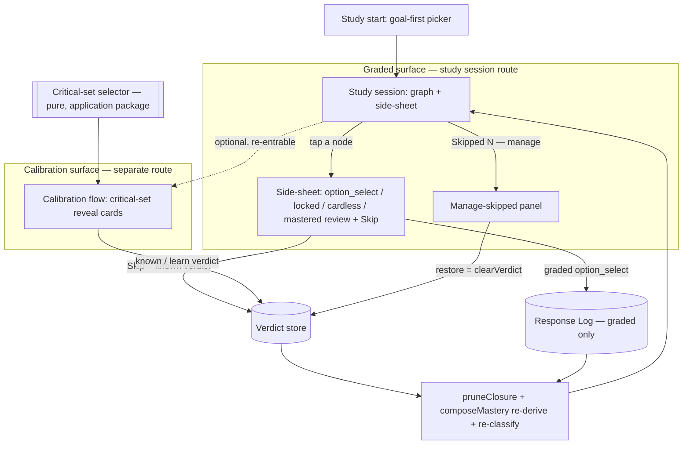

# feat: Separate calibration flow, critical-set probing & study-leak fix

## Summary

Move calibration off every study-graph node onto its own re-entrable screen that probes a small **flat critical set** (ranked by intrinsic difficulty, then trusted down-closure leverage). Add a per-node **skip / manage-skipped** affordance and a per-card difficulty stat. Deleting the dissolved-on-every-node arm makes calibration (reveal allowed) and graded study (no reveal) physically separate surfaces, which closes the same-sheet answer leak. The verdict store, prune closure, restoration nudge, and graded-only Response Log are reused unchanged — the only new domain logic is one pure critical-set selector.

---

## Problem Frame

Real-use inspection of the unmerged dissolved-calibration branch surfaced two defects. First, a **same-sheet answer leak**: a cone node's side sheet renders the reveal/verdict calibration card and, under "Or study it now:", the auto-graded `option_select` card for the *same* node — handing the learner the answer directly above its graded item and contaminating the graded-only Response Log the refactor was built around (`apps/admin-lab/src/components/study/StudySideSheet.tsx`). Second, **weak reversibility**: marking a node "I knew it" prunes its down-closure but every node stays on the canvas, so the only reversal path was re-clicking the now-mastered node — meaning any later move to hide mastered nodes would delete the reversal affordance.

Both trace to one root cause: calibration was dissolved *onto every node of the study graph*, fusing two different epistemic acts (self-report reveal vs. measured graded study) onto one surface and making "calibrate everything" the only model. Separating the surfaces fixes the leak structurally and makes calibration re-entrable, which decouples reversibility from node visibility. Calibration also becomes the first real consumer of the intrinsic-difficulty signal.

---

## High-Level Technical Design

Two physically-separate surfaces share one verdict core. The study session (graded surface) stays the home base; the calibration flow is a separate, optional, re-entrable route. A pure selector chooses the critical set the calibration flow probes. Every write re-derives the prune closure and re-classifies on the server.

The leak is closed by construction: `RecallCard` (reveal) renders only on the calibration route and in the mastered read-only review; the study-graph side sheet never renders a reveal card beside a graded item.

---

## Requirements

Requirements are carried from the origin doc (see origin: `docs/brainstorms/2026-06-23-separate-calibration-flow-and-critical-set-requirements.md`) and grouped by capability. R-IDs match the origin for traceability.

### Separate calibration flow

- R1. Calibration is a distinct, re-entrable surface (its own route/screen), not a per-node affordance on the study graph. It is **optional** — the learner can study the graph without calibrating; it is never a gate. Re-entering overwrites prior verdicts (the primary reversal path).
- R2. The flow presents the flat critical set as a list of reveal cards. Each card reveals the `self_assessment` answer, then offers one binary choice — "I knew it" (`known` verdict → prune trusted down-closure) or "I forgot" (`learn` verdict → stays in gap). Reveal-before-choice is retained as the honesty check.
- R3. Re-opening the flow shows the learner's prior verdict per critical node, changeable or clearable.

### Critical-set selection

- R4. The critical set is a flat (non-adaptive) subset of the goal's trusted prerequisite cone.
- R5. The set is deterministic given the cone, the trusted edges, and the difficulty scores.
- R6. Selection rule: rank cone nodes by intrinsic difficulty (primary), breaking ties by trusted down-closure size (secondary); take a small tunable count; always include the goal's direct trusted prerequisites. Nodes with no difficulty score fall back to leverage order so a missing signal degrades gracefully rather than dropping the node.
- R7. The critical set is a reversible heuristic starting point, never a correctness gate. A noisy difficulty score can only reorder/resize the probe set; skip and restoration correct any miss.

### Per-card difficulty stat

- R8. Each card (calibration reveal and graded study) shows its node's intrinsic difficulty value as a clearly-labeled operator inspection stat, so the operator can judge whether difficulty-driven selection is sensible (AGENTS rule 14). The future Learner app may hide it; the transfer-ready card carries it as optional inspection data.

### Manual skip & un-skip

- R9. Any non-mastered study-graph node offers "Skip — I already know this," writing the same `known` verdict and the same deterministic trusted down-closure as a calibration "I knew it."
- R10. A "Skipped (N) — manage" affordance lists skipped nodes and restores any (`clearVerdict`, returning it to the gap) — the reversal path for manual skips.

### Answer-leak fix & removals

- R11. Calibration (reveal allowed) and graded study (no reveal) are separate surfaces. Tapping a study-graph node opens graded study (`option_select`, no answer reveal) plus the skip control — never the calibration reveal card.
- R12. Over-inclusion is corrected by the skip button (R9); over-pruning is corrected by the existing restoration nudge (`suggestRestorations`). No new struggle signal or threshold is added.
- R13. Delete the per-node dissolved-calibration arm: the `calibration` `SheetContent` variant and its `optionItem` field, the "Or study it now:" stacking block, and the calibration node-tap path. Do not delete the Admin Lab neutral↔adapted toggle.

---

## Key Technical Decisions

- KTD1. **Separate route for the calibration flow.** A distinct route segment under the learner's study path, not an in-page mode that swaps the graph. Physically-separate surfaces make the leak structurally impossible (a reveal card cannot co-render with a graded item), and the re-entrable URL is the reversal path (R1, R11).
- KTD2. **Calibration is optional, never a gate.** The study session remains the home base; calibration is an offered, re-entrable step. The critical set is a reversible heuristic (R7), so nothing about graph study depends on having calibrated first.
- KTD3. **Critical-set selector is a pure application-layer function.** It lives beside `pruneClosure` / `prerequisiteAncestors` in `@lrnki/application`, takes (goal, trusted edges, difficulty-by-node, count), and returns an ordered node-id list. Ranking is difficulty desc → leverage desc → id (deterministic total order); null-difficulty nodes fall back to leverage order rather than being dropped; the goal's direct trusted prerequisites are always unioned in. The tunable count is a named default constant, not a magic literal (R4–R6).
- KTD4. **Reuse the verdict core unchanged — one mechanism, three entry points.** Skip = `known` verdict upsert; un-skip / restore = `clearVerdict`; re-calibrate = overwrite. No schema change, no new domain function beyond the selector. Down-closure pruning means one high "I knew it" removes a whole sub-cone, so probing a small set plus the skip button is sufficient coverage (rules 1, 8, 18).
- KTD5. **Difficulty stat is optional inspection data on the transfer-ready cards.** A plain labeled value (no chart) carried by `RecallCard` and `OptionSelectCard` via an optional prop, so a later Learner app can hide it without a contract change (R8).
- KTD6. **A cardless critical node is kept and flagged, never dropped.** A node the selector picks but that has no `self_assessment` item appears in the calibration list flagged "no answer to reveal," with the verdict choice still available — mirroring the existing "cardless, never dropped" handling. The reveal honesty check applies only where there is an answer to reveal.
- KTD7. **Delete the dissolved-calibration arm in the same change that introduces the replacement (rule 18).** The `calibration` `SheetContent` variant, the `optionItem` field, the "study it now" block, and the calibration node-tap branch are removed as the separate flow lands — no compatibility shim, no "for reference" retention.

---

## Implementation Units

### U1. Pure critical-set selector + fixture tests

- Goal: Add the deterministic critical-set selector — the only new domain logic — as a pure function over a fixture DAG.
- Requirements: R4, R5, R6, R7.
- Dependencies: none.
- Files:
  - `packages/application/src/criticalSet.ts` (new)
  - `packages/application/src/criticalSet.test.ts` (new)
  - `packages/application/src/index.ts` (export the selector + default-count constant)
- Approach: `selectCriticalSet(input: { goalDerivedNodeId, edges, difficultyByNode, count })` returns an ordered `string[]`. Filter to trusted (`!uncertain`) edges. Cone = `prerequisiteAncestors(goal, trustedEdges)` (prerequisites only; the goal itself is the learning target, not probed). Leverage of a node = `prerequisiteAncestors(node, trustedEdges).size`. Rank: difficulty desc, then leverage desc, then id asc; nodes with `null`/absent difficulty sort after scored nodes, ordered by leverage then id (graceful fallback, R6). Take the top `count`, then union the goal's direct trusted prerequisites (the immediate frontier, always included) and re-apply the ranking to the union for display order. Export `DEFAULT_CRITICAL_SET_COUNT` (a small constant, e.g. 5) — tunable, not embedded in the function body. Reuse `prerequisiteAncestors` from `./prerequisiteDag`; do not re-implement traversal.
- Patterns to follow: `packages/application/src/calibrationClosure.ts` (pure, edge-trust filtering, ordering-independent) and `packages/application/src/prerequisiteDag.ts` (`prerequisiteAncestors`). Test style mirrors `packages/application/src/calibrationClosure.test.ts` / the loader test — `node:test`, fixture DAG, `Covers R<N>` prefixes.
- Test scenarios:
  - Covers R6. Ranks cone nodes by difficulty descending (higher-difficulty node precedes lower) on a fixture where order is unambiguous.
  - Covers R6. Breaks a difficulty tie by trusted down-closure size (the node whose `known` answer prunes more prerequisites wins).
  - Covers R6. A node with `null` difficulty is retained and ordered by leverage (fallback), never dropped from the candidate set.
  - Covers R6. The goal's direct trusted prerequisites are always present in the result even when their difficulty/leverage would rank them below the count cutoff.
  - Covers R6. Respects the `count` cap: with more cone nodes than `count`, returns exactly `count` plus any always-included direct prerequisites (deduped).
  - Covers R5. Deterministic — same inputs in any edge/iteration order yield the identical ordered list (id tie-break makes the order total).
  - Edge case: a foundational goal (empty trusted prerequisite cone) returns an empty critical set.
  - Edge case: an uncertain-only edge into the goal is excluded from the cone (trusted-edge filtering matches `pruneClosure`).
- Verification: `criticalSet.test.ts` passes under the package test runner; the selector is exported and importable from `@lrnki/application`.

### U2. Per-card difficulty stat on the transfer-ready cards

- Goal: Carry the intrinsic-difficulty value as labeled, optional inspection data on both card components (R8).
- Requirements: R8.
- Dependencies: none (consumed by U4 and U5).
- Files:
  - `apps/admin-lab/src/components/study/RecallCard.tsx`
  - `apps/admin-lab/src/components/study/OptionSelectCard.tsx`
- Approach: Add an optional `difficulty?: number | null` prop to both components. Render a clearly-labeled badge ("difficulty 0.72", or "difficulty —" when `null`) alongside the existing provenance/state badges. The prop is optional so the transfer-ready contract and any consumer that omits it are unchanged; a future Learner app can simply not pass it. No chart (KTD5). Reuse the existing `Badge` rendering already in both cards.
- Patterns to follow: the existing badge row in both components; the `node.difficulty === null ? "—" : node.difficulty.toFixed(2)` rendering already used in `apps/admin-lab/src/components/DerivedGraphExplorer.tsx`.
- Test scenarios: Test expectation: component rendering verified in the U7 real-use run (this project has no jsdom; see the note in `studyView.test.ts`). The optional prop introduces no pure helper to unit-test.
- Verification: both cards accept and render the difficulty stat without breaking existing callers; the value matches the node's persisted difficulty in the U7 run.

### U3. Loader & contract reshape: critical-set payload, skipped list, leak removal

- Goal: Produce the calibration payload and the skipped list from the loader, thread difficulty into the graded sheet content, and remove the `calibration`/`optionItem` arm from the presentation contract and gating helper (R11, R13).
- Requirements: R2, R3, R8, R10, R11, R13.
- Dependencies: U1.
- Files:
  - `apps/admin-lab/src/components/study/studyView.ts` (delete the `calibration` `SheetContent` variant + `optionItem`; add `difficulty` to the `option_select` variant)
  - `apps/admin-lab/src/lib/studySession.ts` (compute `criticalCards`, `skipped`; reshape `sheetContentFor`; thread difficulty)
  - `apps/admin-lab/src/lib/studySession.test.ts` (drop calibration-arm assertions; add the new frontier→option_select / cardless and skipped-list assertions)
- Approach:
  - In `studyView.ts`, delete `{ kind: "calibration"; ...; optionItem }` and its `optionItem` field; add `difficulty: number | null` to the `option_select` variant. Keep `option_select`, `cardless`, `locked`, `mastered_review`. `RecallCard` is still imported by the side sheet for `mastered_review`.
  - In `studySession.ts`, change `sheetContentFor`: a frontier node returns `option_select` (carrying its `difficulty`) when it has an option item, else `cardless`; remove the `if (card) return { kind: "calibration", ... }` branch. Add `criticalCards: { card: StudyCardView | null; derivedNodeId: string; label: string; difficulty: number | null; verdict: Verdict | null }[]` built from `selectCriticalSet(...)` over the goal cone, ordered by the selector, with `card: null` flagged for cardless critical nodes (KTD6). Add `skipped: { derivedNodeId, label }[]` = the directly-`known` verdicts (R10) — the set whose `clearVerdict` actually returns a node to the gap.
  - Add `criticalCards` and `skipped` to the `StudySession` type.
- Patterns to follow: the existing `sheetContentFor` gating and the `restorations` derivation in `studySession.ts` (directly-`known` set already computed as `directlyKnown`); reuse `selectScopedFrontier`'s trusted-edge scoping idiom for the cone.
- Test scenarios:
  - Covers R11/R13. `sheetContentFor` for a frontier node with a self-assessment now returns `option_select` (when an option item exists), never `calibration`.
  - Covers R11. `sheetContentFor` for a frontier node with neither item returns `cardless`.
  - Covers R8. The `option_select` sheet content carries the node's difficulty value.
  - Covers R10. The skipped-list derivation returns exactly the directly-`known` nodes (not the transitive closure), each with its label.
  - (Regression) `mastered_review` and `locked` behavior is unchanged from the existing loader tests.
- Verification: `studySession.test.ts` passes; `grep` for `kind: "calibration"` / `optionItem` in `studyView.ts` and `studySession.ts` is clean.

### U4. Separate calibration route + flow component

- Goal: Stand up the optional, re-entrable calibration surface that lists the critical-set reveal cards (R1–R3).
- Requirements: R1, R2, R3, R6, R8.
- Dependencies: U1, U2, U3.
- Files:
  - `apps/admin-lab/src/app/admin/lab/study/[learnerStateRef]/calibrate/page.tsx` (new server page)
  - `apps/admin-lab/src/components/study/CalibrationFlow.tsx` (new client component)
- Approach: The page reuses `getStudySession(enrichmentId, target, learnerStateRef)` (one loader, no duplication) and renders `CalibrationFlow` with `session.criticalCards`, `session.target`, and `session.learnerStateRef`; `notFound()` when params or session are missing, mirroring the existing session page. `CalibrationFlow` lists each critical card as a `RecallCard` (reveal → "I knew it" / "I forgot"), passing the node's `difficulty` (R8) and its prior `verdict` (R3); the verdict buttons call the existing `setVerdict` / `clearVerdict` server actions and `revalidatePath` re-renders with fresh verdicts. A cardless critical node renders flagged with the verdict choice available but no reveal control (KTD6). A "Back to study graph" link returns to the session route; an empty critical set (foundational goal) shows a "nothing to calibrate — study directly" state. Calibration is reachable only via the optional entry added in U6 — never auto-forced (KTD2).
- Patterns to follow: `apps/admin-lab/src/app/admin/lab/study/[learnerStateRef]/page.tsx` (server param/searchParam handling, `force-dynamic`, `AdminShell`, back-link); `StudySession.tsx`'s `useTransition` + server-action call shape; `RecallCard` reuse with `verdict`/`onVerdict`/`onClear`.
- Test scenarios: Test expectation: component rendering and the reveal→verdict→re-derive loop are verified in the U7 real-use run (no jsdom). Ordering/selection correctness is covered by U1; the loader payload by U3.
- Verification: opening `/admin/lab/study/<learner>/calibrate?enrichmentId=&target=` lists the difficulty-ranked critical set including the goal's direct prerequisites; revealing then choosing "I knew it" persists a `known` verdict; re-entering shows the prior verdict (R3).

### U5. Study side-sheet reshape: drop calibration arm, add skip + difficulty

- Goal: Remove the reveal-beside-graded leak from the node-tap sheet and add the per-node skip control and difficulty stat (R9, R11, R13).
- Requirements: R8, R9, R11, R13.
- Dependencies: U2, U3.
- Files:
  - `apps/admin-lab/src/components/study/StudySideSheet.tsx`
- Approach: Delete the `content?.kind === "calibration"` block (the `RecallCard` + Separator + "Or study it now:" + `OptionSelectCard` stacking). The sheet now renders `option_select` (graded, passing `difficulty` to `OptionSelectCard`), `cardless`, `locked`, and `mastered_review` (still `RecallCard` read-only — review, no graded item beside it, so no leak). Add a "Skip — I already know this" control shown for non-mastered states (`option_select`, `cardless`, `locked`), wired to a new `onSkip` prop. Update the `StateBadge` / `descriptionFor` switches to drop the `calibration` case. Remove the now-unused `Separator` import if nothing else uses it.
- Patterns to follow: the existing per-kind render blocks and `StateBadge`/`descriptionFor` switches in the same file; the `mastered_review` `RecallCard` read-only usage stays as the model for review.
- Test scenarios: Test expectation: component rendering verified in the U7 real-use run (no jsdom). The gating decisions feeding the sheet are unit-tested in U3.
- Verification: tapping a frontier node shows the graded `option_select` card with a difficulty stat and a Skip control, and never a revealed answer; `grep` for `"Or study it now"` / `optionItem` in this file is clean (R11 success criterion).

### U6. Session driver: skip handler, manage-skipped panel, calibrate entry

- Goal: Wire the skip action, the manage-skipped panel, and the optional calibration entry into the study session driver, and remove the last calibration-path code (R9, R10, R1).
- Requirements: R1, R9, R10, R12, R13.
- Dependencies: U3, U4, U5.
- Files:
  - `apps/admin-lab/src/components/study/StudySession.tsx`
- Approach: Add `onSkip(derivedNodeId)` → `setVerdict({ verdict: "known" })` (same write as a calibration "I knew it"), passed to `StudySideSheet`. Add a "Skipped (N) — manage" panel listing `session.skipped`, each with a "Restore" button calling the existing `clearVerdict` (R10) — sibling to the existing restorations card. Add an optional "Calibrate what you know" link to the new `/calibrate` route (re-entrable, never forced — KTD2). Simplify `onSelect` to read `content.item.studyItemId` for `option_select` only (the `calibration`/`optionItem` branch is gone). Update the header copy that currently says "Tap a node to reveal its answer and mark 'I knew it'/'I forgot'" to graded-study + skip + optional-calibrate language. Keep the auto-advance effect, the coexistence card, and the restorations card unchanged.
- Patterns to follow: the existing `restorations` panel (list + per-item action button calling `clearVerdict`) is the template for the manage-skipped panel; the existing `setVerdict`/`clearVerdict` `useTransition` handlers; the `New session` back-link as the model for the calibrate link.
- Test scenarios: Test expectation: component rendering and the skip→prune / restore→gap loop are verified in the U7 real-use run (no jsdom). The skipped-list derivation is unit-tested in U3; the prune closure in `calibrationClosure.test.ts` (unchanged).
- Verification: tapping a node and pressing Skip prunes its down-closure (the sub-cone leaves the gap); the "Skipped (N)" panel lists it and Restore returns it; a graded miss still surfaces the restoration nudge for skipped prerequisites (R12); the optional Calibrate link opens the separate flow.

### U7. Real-use quality evaluation (AGENTS rules 13, 14)

- Goal: Confirm on real curated graphs that the critical set is sensible and the leak is closed before this milestone is treated as done.
- Requirements: success criteria; R7, R8, R11 (real-use confirmation).
- Dependencies: U1–U6.
- Files: none (evaluation milestone; findings recorded in the PR summary / a disposable `tmp/` note, never a standing harness — ADR-0013).
- Approach: Run the study + calibration surfaces against the economics cone and a deep-narrow Rust cone with real persisted difficulty. Inspect: (1) the calibration flow's critical set is small, difficulty-ranked, and includes the goal's direct prerequisites; (2) each card shows a plausible difficulty stat; (3) "I knew it" visibly shrinks the study gap deterministically and reversibly; (4) re-entering shows prior verdicts; (5) skip prunes and manage-skipped restores; (6) a graded miss still surfaces the restoration nudge; (7) no revealed answer renders beside its graded item (`grep`-clean of the `optionItem` calibration arm and "study it now"). Classify PASS / FIX_FIRST / EXPERIMENT_ONLY / BLOCKED and fix any FIX_FIRST defect before downstream work. The difficulty signal stays EXPERIMENT_ONLY — note the caveat; R7 tolerates it because the set is a reversible heuristic, not a gate.
- Patterns to follow: `.agents/skills/real-use-quality-evaluation/SKILL.md`; the prior dissolved-calibration U8 real-use run as the inspection model.
- Test scenarios: Test expectation: none — this is direct real-use inspection, not an automated test (AGENTS rule 11: tests never validate neural output quality).
- Verification: the evaluation note (template below) is filled with representative correct output and any defects, and the result is PASS (or FIX_FIRST items are resolved) before merge.

---

## Scope Boundaries

- **In scope:** the separate calibration route + flow; the pure flat critical-set selector; the per-card difficulty stat; skip + manage-skipped; the answer-leak fix; the listed removals — all in Admin Lab and the transfer-ready study modules.
- **Deferred for later:** top-down adaptive descent / binary-search probing (v1 is a static flat set; add descent only if real-use shows the flat set leaves the gap too large).
- **Outside this product's identity (future Learner app):** the adapted-only graph that hides mastered/known/skipped nodes. Admin Lab keeps the neutral↔adapted toggle and full graph visibility for operator inspection (AGENTS rule 12). Soft/weighted/probabilistic pruning and real learner modeling (IRT/KT/population difficulty) remain out (ADR-0014, ADR-0024).

---

## Risks & Dependencies

- **Difficulty signal is EXPERIMENT_ONLY.** `intrinsic-fused-v1` (ADR-0024) carries a known broad/thin distortion (TODO #1). This is the cold-start selection signal but only reorders/resizes the probe set; R7 + skip + restoration make a noisy score non-fatal. Surface the caveat in the U7 note; do not treat the selector's output as authoritative mastery.
- **Persisted-difficulty dependency.** The selector reads `node.difficulty` from the Derived Graph Layer (`getEnrichmentDetail`); nodes without a persisted difficulty exercise the leverage fallback (R6) — verify both paths appear in the U7 fixtures.
- **Typed-item dependency.** `self_assessment` items remain the calibration reveal surface and `option_select` items the graded surface (ADR-0026). A critical node lacking a `self_assessment` item is the cardless case (KTD6).
- **Trusted-edge substrate.** The Derived Graph Layer's trusted `inferred-prerequisite-of` edges are the cone/closure/critical-set substrate; the selector filters `!uncertain` exactly as `pruneClosure` does, so calibration credits only what readiness trusts.
- **No schema or domain-core change.** The verdict store, `pruneClosure`/`composeMastery`, `suggestRestorations`, and the graded-only Response Log are reused unchanged; the only new domain function is the selector. A regression here would most likely surface as a contract drift in `studyView.ts` — covered by the U3 grep + tests.

---

### Real-use quality evaluation

- Milestone: separate calibration flow + flat critical-set probing + skip/manage-skipped + answer-leak removal (U7 gate).
- Fixture and source type: economics cone + deep-narrow Rust cone (real curated Derived Graph Layers with persisted difficulty).
- Real model calls used: not applicable — no new LLM call is added; calibration/skip/restore are deterministic over persisted verdicts and difficulty. (Difficulty was produced by an earlier enriched run.)
- Result: to be recorded in U7 (target PASS).
- Useful output observed: to be recorded — small difficulty-ranked critical set incl. direct prerequisites; difficulty stat per card; deterministic reversible gap-shrink; prior verdicts on re-entry.
- Defects observed: to be recorded — fix any FIX_FIRST (e.g., implausible critical set, leak not grep-clean) before downstream work.
- Changes made after inspection: to be recorded.
- Remaining caveats: difficulty signal remains EXPERIMENT_ONLY (TODO #1), tolerated under R7.
- Safe to continue downstream: gated on the U7 result.
