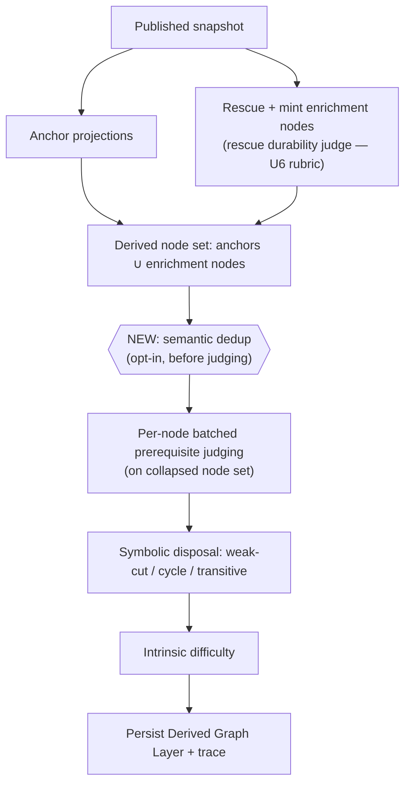
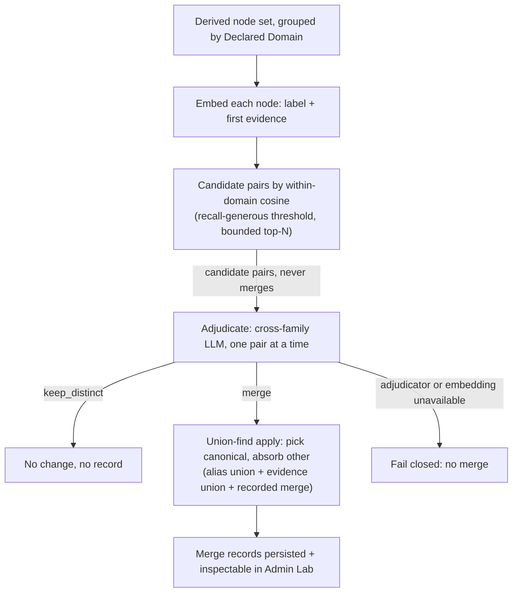

# feat: Enrichment semantic deduplication and rescue precision

## Summary

Add a measured semantic-deduplication pass to Graph Enrichment that collapses same-domain
near-duplicate Derived Graph Layer nodes, and sharpen the existing rescue-durability rubric so a
passing aside stops becoming a high-confidence prerequisite. Embeddings *propose* candidate
near-duplicate pairs; a separate cross-family LLM adjudicator *decides* each merge and records it.
The pass operates only on the regenerable Derived Graph Layer — published Concept identity is never
touched.

---

## Problem Frame

Real two-source enrichment run `0a7ed566` (economics + Rust) split one idea into incoherent
duplicate nodes and promoted an aside to a spurious gate:

- the economics anchor "Propensity to Truck, Barter, and Exchange" beside the rescued Enrichment
  Node "Barter and Exchange";
- the anchor "Owner" beside the rescued "Ownership (Rust)";
- the anchor "Move semantics" beside the rescued "Function ownership mechanics: move and copy";
- RAII became a 0.95 prerequisite of `drop function` despite being a passing cross-language aside
  the source never develops.

Exact-normalized-label identity (ADR-0015) never merges these by design — it is conservative, and
most pairs are an asserted **anchor** beside a derived **Enrichment Node**, which only coexist in
the Derived Graph Layer and which canonicalization cannot merge (an Enrichment Node is never
asserted). Both defects degrade exactly what a learner sees: fragmented prerequisite chains and a
spurious gate. This is now actionable because the blanket no-embeddings ban is withdrawn (ADR-0012,
AGENTS rule 20).

---

## High-Level Technical Design

The dedup pass is a new sub-stage inserted into `runGraphEnrichment` **after** the derived node set
is assembled (anchors ∪ rescued ∪ minted) and **before** per-node prerequisite judging, so duplicate
nodes never reach the judge and prerequisite chains form on the collapsed set.



The dedup sub-stage itself separates proposing from deciding (AGENTS rule 20):



---

## Key Technical Decisions

- KTD1. Dedup lives on the Derived Graph Layer, never published canonicalization. The majority
  defect is anchor↔Enrichment-Node, which canonicalization cannot merge. Published identity stays
  deterministic (ADR-0015) and Concept IRIs permanent (R7); the uncertain merge decision (rule 19)
  lives in the regenerable, reversible derived layer (see origin: KD1).
- KTD2. Propose and decide are separate mechanisms. Embeddings propose candidate pairs for recall; a
  separate cross-family LLM adjudicator decides each pair for precision. Raw cosine never merges — a
  very-high-similarity pair is still routed to the adjudicator (R2, R3, AE3; see origin: KD2).
- KTD3. Embeddings-only propose, no LLM-propose fallback. The `qwen3-embedding-8b` alias is already
  wired in `litellm/config.yaml`, so the brainstorm's "fall back to LLM-propose if absent" branch is
  moot. When embeddings are unavailable at runtime the pass fails closed (no dedup) rather than
  carrying a second, dead propose path (AGENTS rule 18, R13).
- KTD4. Dedup runs before per-node prerequisite judging. Collapsing duplicates first makes the
  inferred chains coherent (the stated defect) and shrinks the judge's forward-candidate set.
- KTD5. The merge record is the single source of truth for absorbed evidence. A merge keeps the
  canonical node, removes the absorbed node, adds the absorbed label as a derived-layer alias on the
  canonical node, and records the absorbed node's evidence in the merge record. Absorbed evidence is
  threaded into the canonical node's prerequisite-judge context at runtime and shown in Admin Lab.
  Anchor node types and the published CEP are NOT mutated; study-item evidence re-union is deferred
  (R6, AGENTS rule 18).
- KTD6. Canonical-node selection is deterministic and recorded. An anchor always wins over an
  enrichment node (preserves Concept identity / IRI permanence, R7); same-kind ties break by evidence
  count, then by stable derived-node id. The reason code is stored on the merge record so replay and
  audit are deterministic.
- KTD7. Fail-closed everywhere; deterministic-envelope tests only. Adjudicator transport failure,
  invalid tool arguments, or embedding-signal failure all yield no merge (R13, AE5, AGENTS rule 6).
  No automated test asserts which pair should merge or what a rubric verdict should be (AGENTS rules
  11/19, R12).
- KTD8. Rescue durability is strengthened by rubric, not by a lexical gate. The existing measured,
  drop-only judge gets a sharpened domain-neutral axis — does the source *develop* the concept or
  merely name it in passing — with no pattern list, phrase whitelist, or fixture-derived terms
  (AGENTS rules 16/17; see origin: KD3).

---

## Requirements

### Semantic deduplication

- R1. Graph Enrichment runs a semantic-deduplication pass over the Derived Graph Layer node set (the
  union of anchor projections and Enrichment Nodes) for one published graph version, scoped within a
  single Declared Domain.
- R2. A propose step surfaces candidate near-duplicate pairs by embedding similarity. It is
  recall-oriented with a generous threshold; it never merges.
- R3. A separate adjudicator decides each proposed pair as merge or keep-distinct. Proposer and
  decider are different mechanisms; raw cosine never decides a merge.
- R4. The adjudicator is a measured LLM judge, cross-family from extraction. Its merge judgments are
  non-deterministic quality, evaluated by inspection, never by a deterministic proxy.
- R5. Every merge is recorded with provenance: the pair, the proposing signal and score, the
  deciding rationale, the canonical-selection reason, and the resulting canonical node. Records are
  inspectable in Admin Lab.
- R6. A merge preserves both surface labels — one canonical, the other(s) as aliases — and unions the
  merged nodes' evidence/grounding into the merge record and the canonical node's judge context. No
  source label is silently dropped.
- R7. The pass operates only on the derived layer. It never mutates published Concept identity,
  Concept IRIs, or the asserted graph version.

### Rescue durability

- R8. The rescue path admits a `source_mentioned` Enrichment Node only when the source substantively
  develops the concept, not when it is named once in passing.
- R9. The durability judgment is a measured, drop-only neural judge in domain-neutral rubric
  language. No lexical pattern list, phrase whitelist, surface-order matcher, or fixture-derived term
  list.
- R10. The durability decision is recorded per candidate so an operator can inspect why a mention was
  rescued or dropped. (Already satisfied by the `rescue_dispositions` table; preserved.)

### Evaluation and governance

- R11. The pass is evaluated by real-use inspection against the current exact-label baseline,
  re-running enrichment on the `0a7ed566` sources, and classified PASS / FIX_FIRST / EXPERIMENT_ONLY
  / BLOCKED.
- R12. Automated tests cover only the deterministic envelope: merge recording and evidence union,
  alias preservation, the propose/decide separation, fail-closed tool-argument validation. No test
  asserts merge correctness or judgment content.
- R13. If the adjudicator or the propose signal is unavailable, the pass fails closed — no silent
  merge.

---

## Implementation Units

### U1. Embedding propose seam — port, LiteLLM embedding client, adapter, alias

**Goal:** A measured embedding capability that returns vectors for derived-node texts through
LiteLLM, reusable and fail-closed. First embedding capability since the CEP reset removed the old
clustering tier.

**Requirements:** R2 (propose signal), R4 (routed through LiteLLM, AGENTS rule 5).

**Dependencies:** none.

**Files:**
- `packages/ports/src/index.ts` — add `NodeEmbeddingPort` (`readonly model`, `embed(texts: string[]): Promise<number[][]>`).
- `packages/infrastructure-litellm/src/LiteLlmEmbeddingClient.ts` (new) — thin `POST /v1/embeddings` client mirroring `LiteLlmForcedToolClient`'s constructor options, retry/back-off, and `metadata.tags`.
- `packages/infrastructure-litellm/src/LiteLlmEmbeddingClient.test.ts` (new).
- `packages/infrastructure-litellm/src/dedupAdapters.ts` (new) — `LiteLlmNodeEmbeddingAdapter` implementing `NodeEmbeddingPort` (`kg-node-embedding` default model; validates each row is a finite-number vector, fails closed on shape mismatch).
- `packages/infrastructure-litellm/src/stageTags.ts` — add `nodeEmbedding: "node-embedding"`.
- `packages/infrastructure-litellm/src/index.ts` — export the client + adapter + model constant.
- `litellm/config.yaml` — add `model_group_alias: kg-node-embedding: openrouter/qwen/qwen3-embedding-8b`.

**Approach:** The existing `LiteLlmForcedToolClient` only calls `/v1/chat/completions`; embeddings need a sibling client, not an extension of the forced-tool path. Keep the request shape minimal (`{ model, input: texts }`); parse `data[].embedding`. Batch the per-domain node texts in one call where the alias permits; fail closed (throw) on a non-numeric or wrong-length vector so the application stage can treat the signal as unavailable (R13).

**Patterns to follow:** `LiteLlmForcedToolClient.ts` (constructor options, retry/back-off, tag forwarding); `enrichmentAdapters.ts` (adapter shape, `readonly model`, stage-tag usage).

**Test scenarios:**
- Happy path: client posts to `/v1/embeddings`, parses `data[].embedding` into `number[][]` preserving input order.
- Edge: empty input array returns `[]` without an HTTP call.
- Error path: malformed response (missing `embedding`, non-numeric entries, wrong vector length) throws so the caller can fail closed.
- Error path: HTTP non-200 surfaces as an error after the retry budget (mirror the forced-tool client's `LiteLlmHttpError`).
- Tag: the configured `node-embedding` tag travels in `metadata.tags`; omitted when no tag is set.

**Verification:** `pnpm --filter @lrnki/infrastructure-litellm test` green; a manual one-off embed of two short strings through the local proxy returns equal-length vectors (rule-14, recorded in U7, not a unit test).

---

### U2. Merge-adjudicator seam — port, adapter, tool schema, stage tag

**Goal:** A cross-family LLM judge that decides one proposed pair as merge or keep-distinct, validated
fail-closed.

**Requirements:** R3, R4, R13 (fail-closed adapter), AE2, AE3.

**Dependencies:** none (parallel with U1).

**Files:**
- `packages/domain-core/src/index.ts` — add `NodeMergeAdjudication = { decision: "merge" | "keep_distinct"; rationale: string }`.
- `packages/ports/src/index.ts` — add `NodeMergeAdjudicationPort` (`readonly model`, `adjudicate({ declaredDomain, a, b }): Promise<NodeMergeAdjudication>` where `a`/`b` carry label, aliases, and bounded evidence quotes).
- `packages/infrastructure-litellm/src/toolSchemas.ts` — add `nodeMergeAdjudicationSchema` + `nodeMergeAdjudicationValidator`.
- `packages/infrastructure-litellm/src/dedupAdapters.ts` — add `LiteLlmNodeMergeAdjudicationAdapter` (default model `kg-independent-judge`).
- `packages/infrastructure-litellm/src/dedupAdapters.test.ts` (new).
- `packages/infrastructure-litellm/src/stageTags.ts` — add `nodeMergeAdjudication: "node-merge-adjudication"`.
- `packages/infrastructure-litellm/src/index.ts` — export adapter + model constant.

**Approach:** Forced named tool schema, domain-neutral system prompt: "are these two labels two surface
forms of the SAME domain concept, or genuinely distinct concepts?" presenting both sides' label +
aliases + bounded evidence with neither side privileged. Decision-only output (no scores). The adapter
is a thin caller that validates arguments and returns the typed decision; fail-closed semantics
(transport/validation failure → caller treats as keep-distinct) live in the application stage (U3),
matching how `applyRescueDurabilityJudge` owns the fail-open grounding decision.

**Patterns to follow:** `LiteLlmRescueDurabilityJudgmentAdapter` and `LiteLlmAdmissionLabelJudgmentAdapter`
(forced-tool judge shape, cross-family alias, validator usage); `toolSchemas.ts` existing judge schemas.

**Test scenarios:**
- Happy path: a canned tool-call fixture with `decision: "merge"` maps to `{ decision: "merge", rationale }`; `keep_distinct` likewise (canned response is INPUT fixture only — asserting the deterministic map, not the model's judgment, AGENTS rule 11).
- Error path: validator rejects a response missing `decision` or with an out-of-enum value (fail-closed at the boundary).
- Tag: requests carry the `node-merge-adjudication` stage tag.

---

### U3. Dedup application stage + wiring into enrichment

**Goal:** The deterministic propose→adjudicate→apply orchestration that collapses near-duplicate nodes,
records merges, and is wired into `runGraphEnrichment` before judging. Opt-in like node minting.

**Requirements:** R1, R2, R3, R5, R6, R7, R13; AE1, AE2, AE3, AE5; KTD4, KTD5, KTD6, KTD7.

**Dependencies:** U1, U2.

**Files:**
- `packages/application/src/deduplicateDerivedNodes.ts` (new) — the stage plus exported pure helpers `cosineSimilarity` and `candidatePairsByDomain` (within-domain, threshold + bounded top-N per node).
- `packages/application/src/deduplicateDerivedNodes.test.ts` (new).
- `packages/application/src/runGraphEnrichment.ts` — insert the dedup sub-stage between `allNodes` assembly and `pairingNodes`; thread absorbed grounding into `contextOf`; add config knobs; bump `enrichmentConfigHash`.
- `packages/application/src/index.ts` — export the stage + helpers + types.
- `apps/kg-worker/src/knowledgeGraphWorker.ts` — construct and pass the two new ports into `runGraphEnrichment` (deterministic client for the adjudicator; embedding client for the propose signal); log a merge count line.

**Approach:** Group the derived node set by Declared Domain. For each node build an embed text from its
context (canonical label + first definition or mention, reusing the existing `contextOf` reduction).
Embed per domain; compute within-domain cosine; select candidate pairs above
`dedupSimilarityThreshold`, bounded to `dedupMaxPairsPerNode`. Adjudicate each candidate; on `merge`,
union via union-find so a transitive cluster (A~B, B~C) collapses to one canonical with two records.
Pick the canonical deterministically (KTD6) and absorb the others: add absorbed labels to the
canonical node's derived-layer aliases, accumulate absorbed evidence into
`absorbedGroundingByCanonical`, and emit a `NodeMergeRecord`. Return `{ nodes, merges,
absorbedGroundingByCanonical }`. `contextOf` gains an optional absorbed-grounding argument that appends
absorbed mention/definition quotes to the canonical node's judge context (R6). Any embedding or
adjudicator failure short-circuits that pair (or the whole pass) to no-merge and is surfaced, never
silently swallowed (R13). The stage runs only when both ports are provided (opt-in), bracketed by
`timeStage("enrichment:dedup")`. Bump `enrichmentConfigHash` (e.g. `intrinsic-difficulty-v3` →
`dedup-v1`) because dedup changes the derivation (ADR-0019 enrichment identity).

**Technical design** (directional, not implementation spec):

```text
deduplicateDerivedNodes({ nodes, embedding, adjudicator, config }):
  if !embedding || !adjudicator: return { nodes, merges: [], absorbed: {} }   // opt-in
  for each domain group:
    vectors = embedding.embed(textsFor(group))           // fail → skip domain, no merge
    pairs   = candidatePairsByDomain(group, vectors, threshold, topN)   // never merges
    for pair in pairs:
      decision = adjudicator.adjudicate(pair)             // fail → keep_distinct
      if decision == merge: uf.union(pair.a, pair.b, signal, score, decision.rationale)
  return applyClusters(uf, nodes)   // canonical select + alias/evidence union + records
```

**Patterns to follow:** `runGraphEnrichment.ts` `timeStage` + opt-in port guards (rescue/mint block);
`applyRescueDurabilityJudge.ts` (fail-open-with-flag discipline, `mapWithConcurrency`);
`forwardCandidatesByDomain` (domain grouping + stable-id sort for replay determinism).

**Test scenarios** (canned embedding vectors + canned adjudicator decisions as INPUT fixtures):
- Covers AE3. A pair with cosine far above threshold is still routed to the adjudicator; a stubbed adjudicator that records calls proves no auto-merge on score alone.
- Covers AE1. Adjudicator returns `merge` → absorbed node removed from the returned set; canonical node carries the absorbed label as an alias; absorbed evidence appears in the canonical node's context; one merge record with pair, signal, score, rationale, canonical-selection reason.
- Covers AE2. Adjudicator returns `keep_distinct` → both nodes remain; no merge record.
- Covers AE5 / R13. Adjudicator throws → no merge, node set unchanged, surfaced as unavailable.
- R13 (propose side): embedding port throws for a domain → that domain produces no merges; other domains unaffected; original nodes returned for the failed domain.
- KTD6: anchor↔enrichment merge selects the anchor as canonical; enrichment↔enrichment tie selects by evidence count then stable id (deterministic, asserted on the reason code).
- Union-find: A~B and B~C yield a single canonical and two records; no duplicate/contradictory records.
- Domain scoping (R1): a cross-domain high-similarity pair is never proposed.
- `candidatePairsByDomain`: a below-threshold pair is not proposed; the top-N bound is respected.
- R7: the pass returns only derived-layer structures; no anchor `conceptId` is altered and no published-table write is attempted (asserted by the absence of any published-store dependency in the stage).

**Verification:** `pnpm --filter @lrnki/application test` green; worker run logs a `merges=<n>` line; the
enrichment config hash changed so a re-run produces a new Derived Graph Layer.

---

### U4. Persist merge records

**Goal:** Merge provenance lands in one new normalized table plus the immutable run trace, queryable
without recompute.

**Requirements:** R5, R7; AGENTS rules 7, 8, 18.

**Dependencies:** U3.

**Files:**
- `packages/domain-core/src/index.ts` — add `NodeMergeRecord` (canonical + absorbed snapshot, signal, score, canonical-selection reason, rationale, declared domain) and add `nodeMerges: NodeMergeRecord[]` to `EnrichmentRunTrace`.
- `packages/infrastructure-postgres/src/migrations/0000_initial_lrnki_schema.sql` — add `derived_node_merges` (single initial migration, AGENTS rule 8).
- `packages/infrastructure-postgres/src/PostgresEnrichmentStores.ts` — in `persist`, write `derived_node_merges` rows from `artifact.payload.nodeMerges`; populate `nodeMerges` when building the trace in `runGraphEnrichment.ts`.
- `packages/infrastructure-postgres/src/PostgresEnrichmentStores.test.ts` (new or existing) — round-trip.

**Approach:** Mirror the `rescue_dispositions` table shape and persistence path. `canonical_derived_node_id`
references `derived_graph_nodes` (the canonical survives); `absorbed_derived_node_id` is
correlation-only with no FK (the absorbed node is removed from the layer, exactly as
`rescue_dispositions.derived_node_id` is correlation-only for dropped candidates). Store the absorbed
node's label, aliases, kind, and evidence snapshot as columns/JSONB so Admin Lab reads it without
rehydrating a deleted node. `getLayer` is unchanged — learner-path and study reads do not need merge
records; Admin Lab reads the table directly (U5).

**Patterns to follow:** `rescue_dispositions` table (lines 525–540 of the migration) and its persist
loop in `PostgresEnrichmentStores.ts` (lines 100–113); `writeArtifactEnvelope` transaction boundary.

**Test scenarios:**
- Happy path: persist a layer + trace carrying two merge records → two `derived_node_merges` rows with correct canonical id, absorbed snapshot, signal, score, reason, rationale.
- Integration: the canonical FK resolves to a surviving `derived_graph_nodes` row; the absorbed id (a removed node) persists without FK violation.
- Edge: a run with zero merges writes zero rows and still succeeds.

**Verification:** store test green against a migrated test DB; a real enrichment run writes rows
matching the worker's logged merge count.

---

### U5. Admin Lab merge inspection

**Goal:** An operator can see every merge — canonical ← absorbed, signal + score, rationale — in the
enrichment detail view and its textual equivalent.

**Requirements:** R5; AGENTS rule 12 (inspect, never recompute).

**Dependencies:** U4.

**Files:**
- `apps/admin-lab/src/lib/derivedGraph.ts` — add `NodeMergeView`, add `merges: NodeMergeView[]` to `DerivedGraphDetail`, and include merges in `buildDerivedGraphView`'s textual output (mirroring `rescueDispositions`).
- `apps/admin-lab/src/lib/derivedGraph.test.ts` — view-model coverage.
- `apps/admin-lab/src/lib/enrichments.ts` — in `getEnrichmentDetail`, load `derived_node_merges` and map to `NodeMergeView`.
- `apps/admin-lab/src/app/admin/lab/enrichments/[enrichmentId]/page.tsx` — render a "Semantic merges" section beside the existing rescue-dispositions view.

**Approach:** Follow the rescue-dispositions precedent exactly: a pure view interface in
`derivedGraph.ts`, a SQL read in `enrichments.ts` (`FROM derived_node_merges`), and a read-only table on
the detail page. The textual representation (used by the equivalent non-visual readout and its tests)
lists each merge so a test can assert merges are surfaced.

**Patterns to follow:** `RescueDispositionView` + its load in `getEnrichmentDetail` (lines 80, 151–160 of
`enrichments.ts`) and its render on the detail page; `summarizeOriginCounts` test style.

**Test scenarios:**
- Happy path: `buildDerivedGraphView` includes each merge in the textual output with canonical label, absorbed label, signal, and score.
- Edge: zero merges → an empty merges list, no crash, section renders empty-state.

**Verification:** `pnpm --filter @lrnki/admin-lab test` green; the detail page shows the merges for a
real run; `pnpm build` succeeds.

---

### U6. Sharpen the rescue-durability rubric

**Goal:** A `source_mentioned` node is rescued only when the source develops the concept, not when it
names it once in passing — fixing the RAII spurious-gate defect.

**Requirements:** R8, R9, R10; KTD8; AE4; AGENTS rules 16/17.

**Dependencies:** none (independent of dedup; can land any time).

**Files:**
- `packages/infrastructure-litellm/src/enrichmentAdapters.ts` — sharpen the `LiteLlmRescueDurabilityJudgmentAdapter` system prompt.

**Approach:** Add a domain-neutral axis to the existing precision-first rubric: distinguish a concept
the source *develops* (defines, explains, or builds on across the passage) from one *named in passing*
(a single aside, a cross-reference, a label mentioned once and dropped). No lexical pattern list, phrase
whitelist, surface-order matcher, or fixture-derived term — the judge reasons from meaning and the
candidate's own mention quotes, exactly as today. R10 is already met: `applyRescueDurabilityJudge`
records `accepted` / `dropped` / `kept_judge_unavailable` per candidate into `rescue_dispositions`; no
code change needed there. The application-side fail-open grounding logic is unchanged.

**Patterns to follow:** the current `LiteLlmRescueDurabilityJudgmentAdapter` system prompt (lines
186–193 of `enrichmentAdapters.ts`); `applyAdmissionLabelJudge` rubric discipline.

**Test scenarios:** Test expectation: none -- the rubric is neural; AGENTS rule 11 forbids asserting
judgment content. The existing `applyRescueDurabilityJudge.test.ts` deterministic fail-open/grounding
logic is unchanged and must stay green. Quality is validated by rule-14 inspection in U7 (the RAII
case).

**Verification:** existing application + litellm suites stay green; the RAII→`drop function` gate is
gone in the U7 re-run, recorded with the judge's rationale.

---

### U7. Real-use quality evaluation and governance

**Goal:** Establish that the pass fixes the observed defects without discarding valid nodes, against the
exact-label baseline — the rule-14 gate that licenses keeping this in the core.

**Requirements:** R11, R12, R13; AGENTS rules 13/14/19.

**Dependencies:** U3, U4, U6 (U5 helpful for inspection).

**Files:**
- `docs/adr/0019-graph-enrichment-derived-layer.md` — amend to record the derived-layer dedup sub-stage (reference ADR-0012 for embeddings and ADR-0015 for the published-identity boundary; no new ADR — those already govern).
- `docs/plans/TODO.md` — record the evaluation outcome and any run-scoped quality issues.
- `tmp/` — disposable evaluation report and run artifacts (gitignored, AGENTS rule 10).

**Approach:** Reset/re-init the DB if needed (AGENTS rule 9), re-run the `0a7ed566` economics + Rust
sources through extraction → publish → enrich with dedup enabled. Inspect: do the three duplicate pairs
merge into coherent single nodes? does RAII stop being a 0.95 prerequisite of `drop function`? are any
valid distinct concepts wrongly merged (precision)? Compare the derived node/edge set against an
exact-label baseline run (dedup disabled). Classify PASS / FIX_FIRST / EXPERIMENT_ONLY / BLOCKED with
representative evidence, and write the required real-use evaluation note. If precision regresses (valid
nodes merged), tune `dedupSimilarityThreshold` / top-N or sharpen the adjudicator rubric (domain-neutral
only) before promoting.

**Test scenarios:** Test expectation: none -- this is the rule-14 real-use inspection gate, not a code
unit. Inspection findings and caveats are recorded in the report and TODO, never as a passing test that
stands in for quality (AGENTS rule 11).

**Verification:** an evaluation note exists with the four-way classification, the three merges and the
RAII drop are confirmed (or a FIX_FIRST defect is recorded), and the baseline comparison is attached.

---

## Acceptance Examples

- AE1. Covers R3, R5, R6. A node and a singular/possessive or sub-phrase surface variant in one domain,
  adjudicated `merge` → one node remains with the other's label as an alias, unioned evidence, and a
  recorded merge with rationale. (U3, U4, U5.)
- AE2. Covers R3, R4. Two lexically similar but genuinely distinct concepts, adjudicated → kept
  distinct, no merge recorded. (U2, U3.)
- AE3. Covers R2, R3. A pair with very high embedding similarity is still routed to the adjudicator and
  not auto-merged on score alone. (U3.)
- AE4. Covers R8, R9. A concept named only as a passing aside the source does not develop → not
  rescued, reason recorded. (U6.)
- AE5. Covers R13. Adjudicator unavailable → no merge applied; pass fails closed. (U3.)

---

## Scope Boundaries

### Deferred to follow-up work

- Re-unioning absorbed evidence into study-item generation and difficulty inputs. This work threads
  absorbed evidence into the prerequisite-judge context and the merge record (enough for the chain/gate
  defect); downstream study/difficulty re-union is a separate change.
- Self-consistency / K-sampling over merge decisions — add only if single-pass merges look unstable
  (origin: Scope Boundaries).

### Deferred for later (from origin)

- Promoting validated semantic merges into published Concept identity / canonicalization. Heavier and
  irreversible (Concept IRIs, versioning, RDF export); revisit only if derived-layer dedup proves the
  adjudicator and a concrete need appears.
- The whole-set global-DAG and self-validation redesign and the supersession of the per-node batched
  judge — a separate brainstorm (TODO #2/#3).

### Outside this work (from origin)

- World-law / science deterministic validators — admissible only where a real formal oracle exists;
  never a domain-general semantic gate (AGENTS rules 16/19).
- Any lexical or fixture-specific dedup or rescue rule (AGENTS rules 16/17).
- Mutating the asserted graph or Concept IRIs.

---

## Risks & Dependencies

- The `qwen3-embedding-8b` alias is wired in `litellm/config.yaml` but **no embedding client exists** —
  U1 adds the first one. Risk: the OpenRouter embedding endpoint shape or forced-tag handling differs
  from chat; mitigated by a dedicated client and a real one-off embed check before U3.
- Embeddings are over-recall by design; precision rests entirely on the adjudicator (KTD2). Risk: the
  adjudicator over-merges genuinely distinct concepts. Mitigated by precision-first rubric, fail-closed
  defaults, and the U7 baseline comparison; the lever is threshold/top-N and rubric, never a lexical
  gate.
- MoE adjudication is non-deterministic (AGENTS rule 19). A flip on a genuinely ambiguous pair is
  uncertainty signal, not a bug; single-pass for now, K-sampling deferred. Do not add a deterministic
  test that asserts a specific pair merges.
- Bumping `enrichmentConfigHash` re-derives every Derived Graph Layer for the version (intended). Old
  layers remain queryable by their own enrichment id (append-only store).
- Dependency: the `0a7ed566` economics + Rust sources must be re-runnable for the U7 baseline.
- Dependency: `kg-independent-judge` (gpt-oss-120b) for the adjudicator; confirmed wired and
  forced-tool-capable.

---

## Documentation / Operational Notes

- Amend ADR-0019 (Graph Enrichment) to record the derived-layer dedup sub-stage and its placement
  before prerequisite judging; cite ADR-0012 (embeddings permitted for identity/dedup) and ADR-0015
  (deterministic published identity untouched). No new ADR.
- Two new spend tags (`node-embedding`, `node-merge-adjudication`) extend the closed stage-tag
  vocabulary; never rename existing tags (attribution stability).
- The dedup pass is opt-in: omitting either new port leaves enrichment behavior identical to today, so
  the baseline run in U7 is simply the same command with the ports unset.

---

## Sources / Research

- Origin requirements: `docs/brainstorms/2026-06-23-enrichment-concept-dedup-and-rescue-precision-requirements.md`.
- Pipeline insertion point: `packages/application/src/runGraphEnrichment.ts` (`allNodes` assembly →
  `pairingNodes`; `contextOf` evidence reduction; `timeStage` brackets).
- Rescue judge call site: `packages/application/src/enrichmentNodeMinting.ts` →
  `applyRescueDurabilityJudge.ts`; rubric in `packages/infrastructure-litellm/src/enrichmentAdapters.ts`.
- Embedding alias + judge alias: `litellm/config.yaml` (`qwen3-embedding-8b` model entry;
  `kg-independent-judge` group alias).
- Persistence precedent: `rescue_dispositions` table in
  `packages/infrastructure-postgres/src/migrations/0000_initial_lrnki_schema.sql` and its persist loop
  in `packages/infrastructure-postgres/src/PostgresEnrichmentStores.ts`.
- Admin Lab precedent: `RescueDispositionView` in `apps/admin-lab/src/lib/derivedGraph.ts`, loaded in
  `apps/admin-lab/src/lib/enrichments.ts`.
- Worker composition root: `apps/kg-worker/src/knowledgeGraphWorker.ts` (port wiring, deterministic vs
  default clients).
- Governance: AGENTS rules 5, 6, 7, 8, 10, 11, 16, 17, 18, 19, 20; ADR-0012, ADR-0015, ADR-0019.
