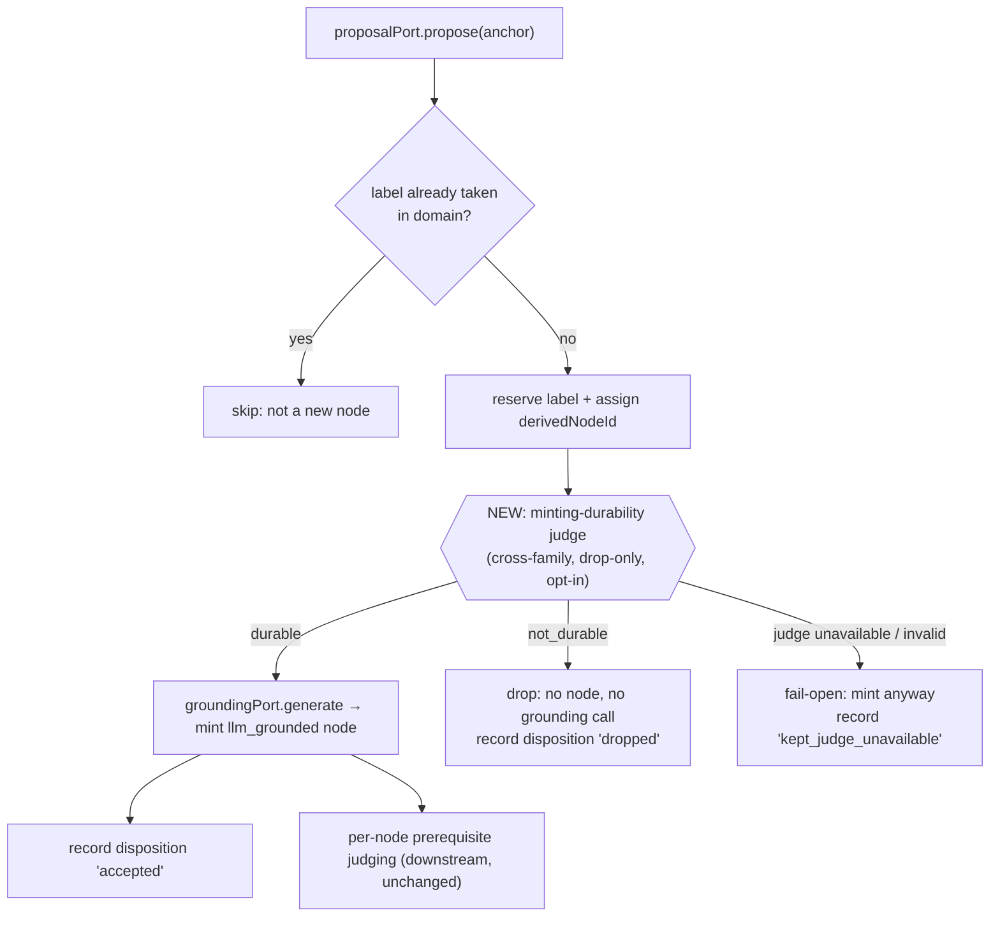

# feat: Minting-durability judge for assumed-prerequisite enrichment nodes

## Summary

Give the assumed-prerequisite **minting** path the same measured, drop-only durability discipline the
rescue path already has, so a concept the source only names in passing can no longer be minted as an
`llm_grounded` prerequisite. A cross-family neural judge decides each proposed label `durable` /
`not_durable` against the anchor it scaffolds, before grounding is generated; `not_durable` proposals
are dropped and recorded. The judge is opt-in and operates only on the regenerable Derived Graph Layer.

---

## Problem Frame

The prior dedup/rescue work (`feat/enrichment-dedup-rescue-precision`, U6) fixed the RAII spurious-gate
defect **on the rescue path** — a `source_mentioned` node the source only names in passing is now
dropped. But the same defect re-enters through the **minting** path, which that work did not scope. On
the `0a7ed566` Rust + economics sources, the assumed-prerequisite proposal pass minted
`RAII (Resource Acquisition Is Initialization)` as an `llm_grounded` node and the prerequisite judge
then ordered `RAII → drop` at confidence 0.85 (and `Destructor → RAII` at 0.96) — the original
`0a7ed566` spurious gate, reached via minting instead of rescue. Which path RAII takes is
non-deterministic run-to-run (`tmp/2026-06-23-dedup-rescue-rule14-evaluation.md`).

The root cause is structural: in `enrichmentNodeMinting.ts`, the proposer
(`missingPrerequisiteProposalAdapters.ts`) names assumed-prior concepts and **every** non-colliding
proposal is minted unconditionally — there is no develops-vs-named-in-passing durability check, unlike
the rescue path's `applyRescueDurabilityJudge`. This plan adds that check for minting.

---

## High-Level Technical Design

The judge slots into the mint loop of `assembleEnrichmentNodes` **between** proposal and grounding
generation, so a dropped proposal never spends a grounding-generation call and never becomes a node.
Three outcomes, mirroring the rescue stage's disposition kinds:



Why the rescue judge cannot simply be reused: a minted node is `llm_grounded` and carries **no source
mention quotes**, so the rescue judge's fail-open *verbatim-grounding-span* safety (a drop must cite a
real sub-quote of the candidate's own mention evidence) has nothing to bind to. The shared asset is the
rubric *language* ("develops vs names in passing"), reused at the prompt level — not the judge module.

---

## Key Technical Decisions

- KTD1. Separate minting-durability judge, not a reuse of the rescue judge. Minted nodes have no source
  mention quotes, so the rescue judge's verbatim-grounding-span contract is structurally unavailable;
  reusing it would be vacuous (every drop ungrounded → fail-open → nothing ever dropped) or circular
  (grounding a drop in the proposer's own generated text). The judges share rubric wording, not code.
- KTD2. The judge's safety is precision-first + measured + recorded, not a grounding-span gate. Because
  the verbatim safety can't transfer, the rule-16 guarantee is met differently: drop-only, "durable
  unless clearly tangential," cross-family, every drop recorded with rationale, fail-open on error, and
  kept only while rule-14 inspection shows it raises precision without discarding valid minted nodes.
- KTD3. Judge before grounding generation. The minting caps (≤2/anchor, ≤12/run) make per-proposal
  judging cheap, and judging upstream of `groundingPort.generate` avoids spending grounding calls on
  dropped proposals and keeps the gate upstream of node identity.
- KTD4. (Revised during implementation.) A minting verdict is scoped to ONE anchor, so a dropped
  proposal's label is RELEASED, not kept reserved: a later same-domain anchor that genuinely depends on
  the concept can re-propose it and be judged independently. The original plan mirrored the rescue
  path's "dropped labels stay taken", but rescue judges a candidate against ALL same-domain anchors
  (a domain-scoped verdict), whereas minting judges against the single proposing anchor — so domain-wide
  reservation of a per-anchor drop would suppress durable prerequisites for other anchors in an
  anchor-ordering-dependent way. Reservation scope now follows verdict scope; accepted/fail-open labels
  still stay reserved because they become real nodes (the dedupe authority's actual job).
- KTD5. Parallel `minting_dispositions` record/table/view, not a generalized disposition table. Rescue
  and minting dispositions are distinct facts with non-overlapping columns (`grounding_span` vs
  `anchor_concept_id`); a unified table forces subtype NULLs and weakens constraints (the single-table
  -inheritance smell). Concrete-table-per-concern matches the shipped `rescue_dispositions` /
  `derived_node_merges` precedent and the Rule of Three (abstract on the third instance, not the
  second). Reusing the existing `RescueDispositionKind` enum is the one safe shared type.
- KTD6. Opt-in and config-hash-bumped, mirroring the rescue/dedup ports. Omitting the judge port leaves
  minting identical to today (the U5 baseline). Bump `enrichmentConfigHash` because minting derivation
  changed.

---

## Requirements

### Minting-durability judging

- R1. The minting pass admits an `llm_grounded` assumed-prerequisite node only when the proposed concept
  is a genuine foundational prerequisite the anchor's material depends on, not a tangential concept the
  source merely names in passing.
- R2. The decision is a measured, drop-only neural judge: it may only remove a proposal, never create or
  reshape one. It is opt-in — when the judge port is absent, minting behaves exactly as today (every
  non-colliding proposal is minted).
- R3. The judge is cross-family from the DeepSeek proposer/generator, routed through a LiteLLM alias
  (`kg-independent-judge`), using a forced named tool schema with fail-closed argument validation.
- R4. The rubric is domain-neutral: no lexical pattern list, phrase whitelist, surface-order matcher, or
  fixture-derived term list. The judge reasons from the proposed concept's meaning, the anchor it
  scaffolds, and the proposer's rationale.
- R5. The judge runs before grounding generation, so a dropped proposal spends no grounding-generation
  call. A dropped proposal's label is RELEASED within its Declared Domain (revised — see KTD4): because
  the verdict is anchor-scoped, a later same-domain anchor that genuinely depends on the concept may
  re-propose it and be judged independently. Accepted and fail-open labels stay reserved (they become
  nodes), preserving deterministic node identity.
- R6. On transport failure or schema-invalid output the proposal is kept and flagged (fail-open), never
  silently vetoed.

### Persistence and inspection

- R7. Every decision (`accepted` / `dropped` / `kept_judge_unavailable`) is recorded with the proposed
  label, the scaffolding anchor, the Declared Domain, and the judge rationale — persisted to its own
  normalized table mirroring `rescue_dispositions` and carried on the immutable enrichment run trace.
- R8. The recorded decisions are inspectable in Admin Lab beside the rescue-durability and
  semantic-merge views, without recompute.

### Evaluation and governance

- R9. The pass is evaluated by real-use inspection (rule 14) against a baseline run with the judge
  disabled, re-running enrichment on the `0a7ed566` economics + Rust sources. Confirm `RAII → drop` no
  longer appears via the minting path (nor rescue) and that no valid minted prerequisite is wrongly
  dropped. Classify PASS / FIX_FIRST / EXPERIMENT_ONLY / BLOCKED.
- R10. Automated tests cover only the deterministic envelope: drop application, label reservation of
  dropped proposals, disposition recording and trace round-trip, fail-open on judge error, budget/cap
  preservation, and fail-closed tool-argument validation. No test asserts which proposal should be
  dropped or what a verdict's content should be (rule 11).
- R11. Bumping `enrichmentConfigHash` re-derives the Derived Graph Layer because minting derivation
  changed.

---

## Implementation Units

### U1. Minting-durability judge seam — domain types, port, tool schema, adapter, tag, alias

**Goal:** A cross-family LLM judge that decides one proposed assumed-prerequisite label as `durable` or
`not_durable`, validated fail-closed. Thin caller; the drop/keep application logic lives in U2.

**Requirements:** R2, R3, R4, R6 (boundary validation).

**Dependencies:** none.

**Files:**
- `packages/domain-core/src/index.ts` — add `MintingDurabilityVerdict = "durable" | "not_durable"` and
  `MintingDurabilityJudgment = { verdict: MintingDurabilityVerdict; rationale: string }`.
- `packages/ports/src/index.ts` — add `MintingDurabilityJudgmentPort` (`readonly model`;
  `judge({ declaredDomain, proposal: { proposedLabel; rationale }, anchor: { canonicalLabel; definitionQuotes } }): Promise<MintingDurabilityJudgment>`).
- `packages/infrastructure-litellm/src/toolSchemas.ts` — add `mintingDurabilityJudgmentSchema` +
  `mintingDurabilityJudgmentValidator` for tool `submit_minting_durability_judgment` (fields `verdict`
  enum, `rationale` string).
- `packages/infrastructure-litellm/src/enrichmentAdapters.ts` — add
  `LiteLlmMintingDurabilityJudgmentAdapter` and `MINTING_DURABILITY_JUDGE_MODEL = "kg-independent-judge"`.
- `packages/infrastructure-litellm/src/enrichmentAdapters.test.ts` (or a new sibling test) — adapter map.
- `packages/infrastructure-litellm/src/stageTags.ts` — add `mintingDurability: "minting-durability"`.
- `packages/infrastructure-litellm/src/index.ts` — export adapter + model constant.

**Approach:** Forced named tool schema, deterministic decoding, decision-only output (no score). The
domain-neutral system prompt asks: is the proposed concept a durable prerequisite the anchor's material
genuinely depends on, or a concept named in passing / tangential (a cross-reference, comparison, aside,
or label dropped without being developed)? Reuse the "develops vs names in passing" wording from
`LiteLlmRescueDurabilityJudgmentAdapter` — but present the proposed label + the proposer's rationale +
the anchor's verbatim definition quotes, since there are no source mention quotes. Precision-first:
return `not_durable` only on a clear judgment. The adapter validates and returns the typed verdict;
the fail-open application semantics live in U2.

**Patterns to follow:** `LiteLlmRescueDurabilityJudgmentAdapter` (cross-family alias, forced-tool shape,
validator usage, rubric discipline); `rescueDurabilityJudgmentSchema` in `toolSchemas.ts`.

**Test scenarios:**
- Happy path: a canned tool-call `{ verdict: "durable", rationale }` maps to the typed judgment;
  `not_durable` likewise (canned response is an INPUT fixture exercising the deterministic map only,
  never asserting the model's judgment content — rule 11).
- Error path: the validator rejects a response missing `verdict` or with an out-of-enum value
  (fail-closed at the boundary).
- Tag: the request carries the `minting-durability` stage tag.

---

### U2. Minting-durability application stage + reshape minting + worker wiring

**Goal:** The deterministic judge-before-grounding orchestration that drops `not_durable` proposals,
records dispositions, reserves dropped labels, and preserves the mint caps — wired opt-in into the
worker. Mirrors `applyRescueDurabilityJudge`'s fail-open discipline.

**Requirements:** R1, R2, R5, R6; KTD1, KTD2, KTD3, KTD4, KTD6; AE1, AE2, AE3, AE4.

**Dependencies:** U1.

**Files:**
- `packages/domain-core/src/index.ts` — add `MintingDisposition` (`derivedNodeId`, `proposedLabel`,
  `normalizedLabel`, `declaredDomain`, `anchorConceptId`, `disposition: RescueDispositionKind`,
  `rationale`). Reuse the existing `RescueDispositionKind` enum (the one safe shared type, KTD5).
- `packages/application/src/applyMintingDurabilityJudge.ts` (new) — judges a batch of reserved proposals
  against their scaffolding anchor; returns kept proposals + dispositions; fail-open on error
  (`kept_judge_unavailable`). Reuse the `mapWithConcurrency` shape from `applyRescueDurabilityJudge.ts`.
- `packages/application/src/applyMintingDurabilityJudge.test.ts` (new).
- `packages/application/src/enrichmentNodeMinting.ts` — in the mint loop, reserve each new proposal's
  label and assign its `derivedNodeId` before grounding; run the optional judge; generate grounding and
  push the node only for kept proposals; emit `mintingDispositions`; thread the new optional
  `mintingDurabilityJudge?` input and add it to the return shape.
- `packages/application/src/enrichmentNodeMinting.test.ts` — extend for the judged path.
- `packages/application/src/runGraphEnrichment.ts` — pass `input.mintingDurabilityJudge` into
  `assembleEnrichmentNodes`; surface `mintingDispositions`; bump `enrichmentConfigHash` (`dedup-v1` →
  `minting-durability-v1`).
- `packages/application/src/index.ts` — export the stage + types.
- `apps/kg-worker/src/knowledgeGraphWorker.ts` — construct `LiteLlmMintingDurabilityJudgmentAdapter` and
  pass it as `mintingDurabilityJudge`; log a `minting dropped=<n>` line.

**Approach:** Keep the deterministic anchor ordering and the existing `take`/`isTaken` dedupe authority.
For each anchor's proposals: skip already-taken labels exactly as today; for each genuinely new label,
`take` it and assign a `derivedNodeId` up front (so a dropped proposal still has a correlation id, as
rescue dispositions do). When the judge port is present, judge the reserved proposals against the anchor
(label + definition quotes) + the proposer's rationale; on `not_durable` record `dropped` and skip
grounding; on error record `kept_judge_unavailable` and mint anyway (fail-open). Mint budget
(`maxMintedPerAnchor`/`maxMintedPerRun`) is consumed only by minted (kept) nodes, so a drop frees no
budget but also costs none. When the judge port is absent, behavior is byte-identical to today and
`mintingDispositions` is empty.

**Technical design** (directional, not implementation spec):

```text
mint(anchor):
  proposals = propose(anchor, existingLabels, maxProposals)
  reserved  = []
  for p in proposals:
    n = normalize(p.proposedLabel)
    if empty(n) or isTaken(domain, n): continue     // existing dedupe, unchanged
    take(domain, n); id = newNodeId()
    reserved.push({ id, label: p.proposedLabel, normalized: n, rationale: p.rationale })
  kept = judge ? applyMintingDurabilityJudge(reserved, anchor) : { keptIds: all(reserved), dispositions: [] }
  for r in reserved where r.id in kept.keptIds and budget>0 and perAnchor<cap:
    bundle = groundingPort.generate(r)               // only kept proposals spend this
    mintedNodes.push(node(r, bundle)); budget--; perAnchor++
  collect kept.dispositions
```

**Patterns to follow:** `applyRescueDurabilityJudge.ts` (fail-open-with-flag, `mapWithConcurrency`,
`record(...)` helper); the existing mint block + `take`/`isTaken` authority in `enrichmentNodeMinting.ts`;
the opt-in port guard for `rescueDurabilityJudge` in `runGraphEnrichment.ts`.

**Test scenarios** (canned verdicts as INPUT fixtures; stubbed proposal/grounding ports record calls):
- Covers AE1. A proposal judged `not_durable` → no minted node for it, no `groundingPort.generate` call
  for it (asserted via a call-recording stub), one `dropped` disposition with the anchor + rationale.
- Covers AE2. A proposal judged `durable` → minted node present, grounding generated, `accepted`
  disposition.
- Covers AE3 / R6. Judge throws → proposal kept and minted, `kept_judge_unavailable` disposition,
  surfaced not swallowed.
- Covers AE4 / R5 (revised). A label dropped for anchor A IS released, so a later same-domain anchor B
  that genuinely depends on it re-proposes it and mints it (independent anchor-scoped verdict); a label
  dropped by every anchor that proposes it is never minted.
- Budget/caps: dropped proposals consume no mint budget; `maxMintedPerAnchor` and `maxMintedPerRun`
  remain enforced deterministically over kept proposals.
- Opt-in (R2): judge omitted → every non-colliding proposal minted exactly as today; zero dispositions;
  node set identical to the pre-change baseline for the same proposals.
- Determinism: anchors processed in stable `conceptId` order; replay yields the same disposition set.

**Verification:** `pnpm --filter @lrnki/application test` and `@lrnki/infrastructure-litellm` green; a
worker run logs a `minting dropped=<n>` line; the config hash changed so a re-run re-derives the layer.

---

### U3. Persist minting dispositions

**Goal:** Minting-durability provenance lands in one new normalized table plus the immutable run trace,
queryable without recompute.

**Requirements:** R7, R11; AGENTS rules 7, 8, 18.

**Dependencies:** U2.

**Files:**
- `packages/domain-core/src/index.ts` — add `mintingDispositions: MintingDisposition[]` to
  `EnrichmentRunTrace`.
- `packages/infrastructure-postgres/src/migrations/0000_initial_lrnki_schema.sql` — add
  `minting_dispositions` (single initial migration, rule 8), mirroring `rescue_dispositions` but with
  `anchor_concept_id` instead of `grounding_span`; `derived_node_id` correlation-only (no FK, since a
  `dropped` proposal has no `derived_graph_nodes` row); `disposition` CHECK reuses the rescue enum
  values.
- `packages/infrastructure-postgres/src/PostgresEnrichmentStores.ts` — in `persist`, write
  `minting_dispositions` rows from the trace; populate `mintingDispositions` when building the trace.
- `packages/infrastructure-postgres/src/PostgresEnrichmentStores.test.ts` — round-trip.

**Approach:** Mirror the `rescue_dispositions` table shape and persistence path exactly (KTD5). Store the
proposed label, normalized label, declared domain, scaffolding `anchor_concept_id`, disposition, and
rationale so Admin Lab reads a dropped proposal without rehydrating a node that was never created.
`getLayer` is unchanged — learner-path and study reads do not need dispositions; Admin Lab reads the
table directly (U4).

**Patterns to follow:** `rescue_dispositions` table + its persist loop in `PostgresEnrichmentStores.ts`;
the `derived_node_merges` parallel-table precedent; `writeArtifactEnvelope` transaction boundary.

**Test scenarios:**
- Happy path: persist a trace carrying two minting dispositions → two `minting_dispositions` rows with
  correct label, anchor id, declared domain, disposition, rationale.
- Integration: a `dropped` disposition (no surviving node) persists with its correlation-only
  `derived_node_id` and no FK violation.
- Edge: a run with zero minting dispositions writes zero rows and still succeeds.

**Verification:** store test green against a migrated test DB; a real enrichment run writes rows matching
the worker's logged drop count.

---

### U4. Admin Lab minting-durability inspection

**Goal:** An operator can see every minting decision — proposed label, scaffolding anchor, disposition,
rationale — in the enrichment detail view and its textual equivalent.

**Requirements:** R8; AGENTS rule 12 (inspect, never recompute).

**Dependencies:** U3.

**Files:**
- `apps/admin-lab/src/lib/derivedGraph.ts` — add `MintingDispositionView`, add
  `mintingDispositions: MintingDispositionView[]` to `DerivedGraphDetail`, and include them in
  `buildDerivedGraphView`'s textual output (mirroring `rescueDispositions`).
- `apps/admin-lab/src/lib/derivedGraph.test.ts` — view-model coverage.
- `apps/admin-lab/src/lib/enrichments.ts` — in `getEnrichmentDetail`, load `minting_dispositions` and
  map to `MintingDispositionView`.
- `apps/admin-lab/src/app/admin/lab/enrichments/[enrichmentId]/page.tsx` — render a "Minting durability"
  section beside the existing rescue-dispositions and "Semantic merges" sections.

**Approach:** Follow the rescue-dispositions precedent exactly: a pure view interface in
`derivedGraph.ts`, a SQL read in `enrichments.ts` (`FROM minting_dispositions`), and a read-only table on
the detail page. The textual representation lists each decision so a test can assert it is surfaced.

**Patterns to follow:** `RescueDispositionView` + its load in `getEnrichmentDetail` and its render on the
detail page; the `NodeMergeView` / "Semantic merges" section added by the dedup work.

**Test scenarios:**
- Happy path: `buildDerivedGraphView` includes each minting disposition in the textual output with
  proposed label, anchor, disposition, and rationale.
- Edge: zero minting dispositions → an empty list, empty-state renders, no crash.

**Verification:** `pnpm --filter @lrnki/admin-lab test` green; the detail page shows minting decisions
for a real run; `pnpm build` succeeds.

---

### U5. Real-use quality evaluation and governance

**Goal:** Establish that the judge removes the RAII-style minting gate without discarding valid minted
prerequisites, against the judge-disabled baseline — the rule-14 gate that licenses keeping this in core.

**Requirements:** R9, R10, R11; AGENTS rules 13/14/16/19.

**Dependencies:** U2, U3 (U4 helpful for inspection).

**Files:**
- `docs/adr/0019-graph-enrichment-derived-layer.md` — amend to record the minting-durability judge as a
  drop-only gate on the assumed-prerequisite minting pass (cite ADR-0023 for the cross-family-judge
  -over-generated-output principle). No new ADR.
- `docs/plans/TODO.md` — record the evaluation outcome; close or re-scope TODO #1.
- `tmp/` — disposable evaluation report and run artifacts (gitignored, rule 10).

**Approach:** Reset/re-init the DB if needed (rule 9). Re-run the `0a7ed566` economics + Rust sources
through extraction → publish → enrich, once with the judge enabled and once disabled (baseline = the same
command with the port unset). Inspect: does RAII stop being minted / stop becoming a ~0.85 prerequisite
of `drop` via the minting path? Are any genuine assumed prerequisites (e.g. foundational variable/scope
concepts) wrongly dropped (precision)? Because path choice (mint vs rescue) is non-deterministic, run a
few times to observe both paths. Classify PASS / FIX_FIRST / EXPERIMENT_ONLY / BLOCKED with
representative evidence and the required real-use note. If precision regresses (valid minted nodes
dropped), sharpen the domain-neutral rubric — never add a lexical or fixture-specific veto (rules 16/17).

**Test scenarios:** Test expectation: none -- this is the rule-14 real-use inspection gate, not a code
unit. Findings and caveats are recorded in the report and TODO, never as a passing test standing in for
quality (rule 11).

**Verification:** an evaluation note exists with the four-way classification; `RAII → drop` via minting
is confirmed gone (or a FIX_FIRST defect is recorded); the judge-disabled baseline comparison is attached.

---

## Acceptance Examples

- AE1. Covers R1, R2, R7. A proposed assumed-prerequisite the source only names in passing, judged
  `not_durable` → not minted, no grounding call spent, disposition recorded `dropped` with the anchor and
  rationale. (U1, U2, U3.)
- AE2. Covers R2. A genuinely foundational proposed prerequisite, judged `durable` → minted as today,
  disposition `accepted`. (U2.)
- AE3. Covers R6. Judge unavailable (transport/validation failure) → proposal kept and minted,
  disposition `kept_judge_unavailable`, surfaced. (U2.)
- AE4. Covers R5 (revised). A proposal dropped for one anchor is RELEASED, so a later same-domain anchor
  for which it is durable re-proposes and mints it; a label no anchor finds durable is never minted. (U2.)
- AE5. Covers R9. On the `0a7ed566` re-run, `RAII → drop` no longer appears via the minting path (nor
  rescue), and no valid minted prerequisite is wrongly dropped. (U5.)

---

## Scope Boundaries

### Deferred to follow-up work

- Self-consistency / K-sampling over minting-durability verdicts (TODO #3). Add only if single-pass
  minting drops look unstable; a verdict flip on an ambiguous proposal is uncertainty signal, not a bug
  (rule 19).
- Folding rescue + minting durability into one shared disposition record/table/view. Revisit only if a
  third durability stage appears (Rule of Three) and the columns genuinely converge (KTD5).
- Re-judging the prerequisite *ordering* of minted nodes — out of scope; this plan gates which minted
  nodes exist, not how the downstream judge orders them.

### Outside this work

- Any lexical or fixture-specific minting veto, including putting "RAII" or any source-named concept in a
  prompt (rules 16/17).
- The O(n²) → whole-set global-ordering redesign and the per-node batched-judge supersession (TODO #2).
- Embeddings in prerequisite derivation (rule 20, ADR-0019); this plan adds no embedding signal.
- Mutating the asserted graph, Concept identity, or Concept IRIs — the judge operates only on the
  Derived Graph Layer.

---

## Risks & Dependencies

- The minting judge lacks the rescue judge's verbatim-grounding safety, so over-dropping valid minted
  prerequisites is the main risk. Mitigated by the precision-first rubric, fail-open default, recorded
  dispositions for inspection, and the U5 judge-disabled baseline; the only lever is domain-neutral
  rubric wording, never a lexical gate (rules 16/17).
- MoE judge non-determinism (rule 19): which path RAII takes (mint vs rescue) is already run-to-run
  non-deterministic, and the verdict itself can flip on ambiguous proposals. Single-pass for now;
  K-sampling deferred (TODO #3). Do not add a deterministic test asserting a specific proposal drops.
- Bumping `enrichmentConfigHash` re-derives every Derived Graph Layer for the version (intended); old
  layers stay queryable by their own enrichment id (append-only store).
- Dependency: the `0a7ed566` economics + Rust sources must be re-runnable for the U5 baseline.
- Dependency: `kg-independent-judge` (gpt-oss-120b), already wired and forced-tool-capable, shared with
  the rescue durability judge and the merge adjudicator.

---

## Documentation / Operational Notes

- Amend ADR-0019 (Graph Enrichment) to record the minting-durability judge as a measured, drop-only gate
  on the assumed-prerequisite minting pass, placed before grounding generation; cite ADR-0023 for the
  cross-family-judge-over-generated-output principle. No new ADR.
- One new spend tag (`minting-durability`) extends the closed stage-tag vocabulary; never rename existing
  tags (attribution stability).
- The judge is opt-in: omitting the port leaves enrichment behavior identical to today, so the U5
  baseline is simply the same command with the port unset.

---

## Sources / Research

- TODO #1 (the residual): `docs/plans/TODO.md`; prior rule-14 evidence of the RAII minting gate in
  `tmp/2026-06-23-dedup-rescue-rule14-evaluation.md`.
- Rescue-path parent pattern this mirrors:
  `docs/brainstorms/2026-06-23-enrichment-concept-dedup-and-rescue-precision-requirements.md` (R8/R9,
  KD3) and `docs/plans/2026-06-23-002-feat-enrichment-dedup-rescue-precision-plan.md` (U6).
- Minting pass to gate: `packages/application/src/enrichmentNodeMinting.ts` (mint block); proposer
  `packages/infrastructure-litellm/src/missingPrerequisiteProposalAdapters.ts`.
- Rescue judge to mirror: `packages/application/src/applyRescueDurabilityJudge.ts`;
  `LiteLlmRescueDurabilityJudgmentAdapter` + `rescueDurabilityJudgmentSchema` in
  `packages/infrastructure-litellm/src/enrichmentAdapters.ts` / `toolSchemas.ts`;
  `RescueDurabilityJudgmentPort` in `packages/ports/src/index.ts`.
- Persistence precedent: `rescue_dispositions` table + persist loop in `PostgresEnrichmentStores.ts`;
  `derived_node_merges` (the parallel-table precedent in the same migration).
- Admin Lab precedent: `RescueDispositionView` / `NodeMergeView` in
  `apps/admin-lab/src/lib/derivedGraph.ts`, loaded in `apps/admin-lab/src/lib/enrichments.ts`.
- Worker composition root: `apps/kg-worker/src/knowledgeGraphWorker.ts`.
- Disposition-record data-modeling tradeoff (KTD5): single-table-inheritance nullable-column problem and
  GitLab's "avoid STI for new tables"; the Rule of Three and "duplication is better than the wrong
  abstraction" — external sources informing the parallel-table choice.
- Governance: AGENTS rules 5, 6, 7, 8, 11, 16, 17, 18, 19; ADR-0019, ADR-0023.
