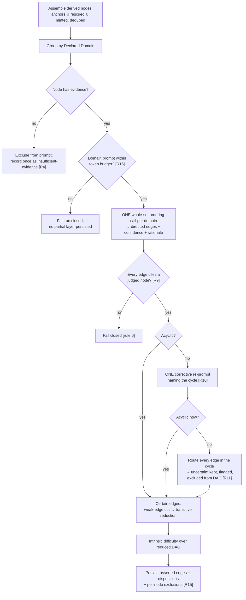

# feat: Whole-Set Prerequisite Ordering

## Summary

Replace exhaustive per-pair / per-node-batched prerequisite judging with **one whole-set judgment
call per Declared Domain** that returns a directed prerequisite DAG over the deduplicated derived
node set (anchors ∪ rescued ∪ minted). The call runs on a single non-DeepSeek ordering alias
(cross-family from the minted-node grounding generator, ADR-0023). The application boundary verifies
acyclicity and node-citation validity, issues **at most one** corrective re-prompt naming a stubborn
cycle, and routes any still-cyclic edges to `uncertain`. The per-node batched judge, the dual
anchor/generated judge routing, and the `removeCycles` lowest-confidence-edge heuristic are deleted in
the same change (rule 18). Ship single-sample.

This plan carries **one deliberate amendment to the origin** (confirmed with the user 2026-06-24):
the origin's R17/R18 promotion gate — "ship as an experiment, A/B-compare against the exhaustive
baseline, promote if more learner-sensible *and* cheaper" — is replaced by an **absolute study-value
gate**. A live inspection of the current output (`tmp/2026-06-24-prerequisite-study-value-evaluation.md`)
established that "neither edge set is ground truth," so parity is the wrong target. Promotion is gated
on whether the whole-set DAG produces *sensible study paths* against a rubric derived from the concrete
defects that inspection found. Net cost staying at or below the exhaustive baseline remains a
secondary check, not the gate.

---

## Problem Frame

Prerequisite edges are currently derived by judging same-domain pairs (regrouped into per-node batched
calls). Pairwise judgment is intransitive by nature — a judge can call A→B, B→C, and C→A all locally
plausible — so cycles are the *expected residue*, mopped up by `removeCycles` dropping the
lowest-confidence edge after the fact. No per-pair call ever sees the whole set, so nothing forces the
edges to cohere globally.

A live inspection of today's persisted production output (minting-durability-enabled run
`7b2ae2a7…`, the two-source Rust + economics fixture) made the learner-facing cost concrete
(`tmp/2026-06-24-prerequisite-study-value-evaluation.md`):

- **Scaffold inversion.** The minting step mints general foundations (`Compiler (software tool)`,
  `Static analysis (programming)`) as assumed prerequisites, but the *separate* per-pair ordering step
  has no global view and ordered `Passing values to functions → Compiler → Memory safety`. A learner
  targeting `Compiler` is told to study Rust's passing-values semantics first — backwards. The minting
  role and the ordering edges are decided by two mechanisms that disagree.
- **Headline burial + over-gating.** `Memory safety` — the entry idea Rust ownership exists to deliver
  — is not a DAG root; its prerequisite closure is **9** nodes (vs **5** in the minting-disabled
  baseline). Targeting the leaf `Return values and ownership transfer` pulls in **12 of 13** software
  nodes (a near-total order). Transitive reduction cannot fix this because the underlying pairwise
  judgments already form a chain.
- **Economics is genuinely good** in the same run (`Self-Love → Propensity to Barter → Division of
  Labour → …`), so the pipeline *can* produce learner-sensible structure. The failure concentrates
  where the node set is tightly coupled and where minted nodes enter — exactly where a per-pair judge's
  lack of a global view bites hardest.

A whole-set DAG changes the correctness model: it is globally self-consistent by construction, has no
privileged subject (so the subject/candidate direction asymmetry the parity fix fought cannot arise),
and converts a purely semantic question ("is this edge right?") into an additional **structural** one
("is the whole thing acyclic?"). Acyclicity is *provable*, so it belongs in the deterministic envelope
and can inform the model (via one corrective re-prompt) without silently vetoing its meaning
(rules 16/19).

---

## Requirements Traceability

Origin requirements (`docs/brainstorms/2026-06-24-whole-set-prerequisite-ordering-requirements.md`) and
where each is honored:

| Origin | Honored in |
|---|---|
| R1 one whole-set call per domain over the deduped node set | U4 |
| R2 directed edge list, each with direction + confidence + rationale | U1, U2 |
| R3 non-edge ⇒ no relation, no disposition recorded | U1, U4 |
| R4 no-evidence node excluded from input, recorded once | U4 (AE5) |
| R5 single non-DeepSeek ordering alias, cross-family from generator | U2, U5 (AE3) |
| R6 DeepSeek stays extractor + grounding generator; only judge moves | U5 |
| R7 remove the two judge aliases + the per-pair routing split (rule 18) | U2, U4, U5 |
| R8 backing model selected by measured sweep, not hard-committed | U7 |
| R9 boundary verifies acyclicity + real-node citation, fail closed (rule 6) | U2, U4 (AE1) |
| R10 one bounded corrective re-prompt naming the cycle | U4 (AE1) |
| R11 still-cyclic ⇒ route cycle edges to `uncertain`, never dropped | U3, U4 (AE2) |
| R12 keep cycle detection; delete the lowest-confidence removal heuristic (rule 18) | U3 |
| R13 certain edges: weak-cut then transitive reduction; uncertain retained outside DAG | U3, U4 |
| R14 Derived Graph Layer output contract unchanged (no migration) | U4 (KTD7) |
| R15 persist asserted edges + dispositions + per-node exclusions; drop the per-pair grid | U1, U4 |
| R16 one call/domain; oversized domain fails closed, no chunking | U4 (AE4) |
| R17 ship single-sample, real-use inspection on Rust + economics | U7 |
| R18 promotion gate → **study-value gate** (amended, see KTD1) | U7 |
| R19 `stage_timing` + `/spend/tags` instrument carries forward unchanged | U5 |

---

## Key Technical Decisions

### KTD1 — Promotion is gated on absolute study value, not A/B parity (amends origin R17/R18)

The origin frames promotion as parity-plus-cheaper against the exhaustive baseline. The live inspection
established that both edge sets are "plausible DAGs over ambiguous concepts; neither is ground truth,"
so matching the baseline is neither necessary nor sufficient. The gate is an **absolute study-value
rubric** derived from the observed defects (full rubric in U7):

| Gate check | Derived from observed defect | Pass condition |
|---|---|---|
| Scaffold orientation | `Passing values → Compiler` inversion | minted/general foundations sit at/near DAG roots, not gated behind domain-specific anchors |
| Closure boundedness | `Return values` closure 12/13 | leaf-target prerequisite closures are shallow; no near-total-order |
| Headline reachability | `Memory safety` closure 9, not a root | central concepts reachable by a short path |
| Coherence preservation | economics already good | the economics chain survives unharmed |
| Cycle inspectability | origin success criteria | every cycle→`uncertain` routing is visible in Admin Lab |

Net cost ≤ exhaustive baseline stays a **secondary** check (the ~1-call-per-domain volume drop should
offset a higher per-token price), not the promotion gate. Evaluated by real-use inspection and
LLM-as-judge where appropriate (rules 13/14/19), never a deterministic proxy.

### KTD2 — Whole-set port shape: `order(domain, nodes, correction?) → edge list`

`PrerequisiteJudgmentPort` (per-subject/candidates) is replaced by a `PrerequisiteOrderingPort` whose
single method takes the Declared Domain and **all evidenced nodes** in it, returning a directed edge
list. The optional `correction` field carries the violating cycle on the *one* re-prompt, keeping the
re-prompt a parameter of the same call rather than a second port method (R10). The per-candidate
`BatchedPrerequisiteJudgment` / `relations` / `candidateRef` shape is deleted (rule 18). There is no
per-edge `uncertain` *outcome* from the judge — it asserts directed edges only; uncertainty re-sources
to cycle-routing (KTD5).

### KTD3 — Edges cite nodes by exact canonical label, validated fail-closed

The whole-set prompt lists each judged node by its exact canonical label; each returned edge cites its
`prerequisiteLabel` and `dependentLabel`. The application maps labels → `derivedNodeId`s and **fails
closed** (rule 6) on any edge whose endpoint matches no node in the judged set, or matches ambiguously
— this *is* R9's real-node-citation guarantee. This mirrors the existing batched adapter's exact-label
matching and keeps the trace human-readable. (Canonical labels are unique within a Declared Domain
after dedup, so the mapping is well-defined.)

### KTD4 — `removeCycles` is split: keep the detector, delete the remover

`findCycleEdges` (deterministic DFS back-edge detection) is retained and promoted to the public
acyclicity verifier and the source of the re-prompt's violating-cycle framing. The
lowest-confidence-edge *removal* loop is deleted (R12, rule 18): under whole-set ordering a surviving
cycle is rare and is genuine epistemic-uncertainty signal (ADR-0028), so it is routed wholesale to
`uncertain` rather than suppressed by dropping one edge and trusting the rest of a structure the model
just contradicted itself on. `cutWeakEdges` and `transitiveReduction` are unchanged.

### KTD5 — `uncertain` is re-sourced from per-pair verdict to cycle-routing (consequence to watch)

Today `uncertain` is the per-pair judge's own "ambiguous direction" outcome (`runGraphEnrichment.ts:322`)
— it currently shields the genuinely ambiguous `Memory safety ↔ Return values` pair from learner paths.
The whole-set judge emits a directed DAG with no natural "uncertain direction" output, so in
single-sample `uncertain` becomes **cycle-routed edges only** (R11). A pair that is genuinely
direction-ambiguous may now be committed as a directed edge. **U7 must inspect for this specifically:**
if direction-instability on ambiguous pairs is the live study-value defect, that is the gate condition
to add K-sampling (TODO #2) — which is the deferred mechanism that re-introduces a richer `uncertain`.
This decision keeps single-sample first (origin scope) while making the K-sampling trigger observable.

### KTD6 — Oversized-domain guard: fail closed, no chunked-DAG merge (R16)

One call per domain. Before the call, estimate the assembled prompt size for the domain; if it exceeds
a configured budget (a safety margin below the chosen model's input context window), the run **fails
closed without persisting a partial layer**. No chunking, no DAG merging (an explicit non-goal). The
concrete token threshold is an execution-time tuning against the selected model and is deferred to U4
implementation; the *fail-loud* behavior is the planning-time commitment.

### KTD7 — No database migration (R14 holds)

`inferred_prerequisite_edges` and `derived_graph_nodes` are unchanged: edges still carry
`{prerequisite_derived_node_id, dependent_derived_node_id, confidence, uncertain, judge_model,
provenance}`. Edge dispositions live only in the JSONB run trace (no relational disposition table for
edges exists), so the per-pair→per-node disposition reshape is a JSONB-only change. The single initial
migration stays untouched (rule 8). The run-trace artifact type is bumped (`enrichment_run.v2` →
`enrichment_run.v3`) to reflect the trace shape change; verify during U4 that nothing reads the old
shape.

---

## High-Level Technical Design

Directional guidance for reviewers, not implementation specification.

### Reshaped enrichment flow + deterministic validation envelope

### What is deleted vs retained (rule 18)

| Deleted in this change | Retained / reshaped |
|---|---|
| `judgeNodeAgainstCandidates.ts` (per-node primitive) | `prerequisiteDag.ts` `findCycleEdges` → acyclicity verifier |
| `forwardCandidatesByDomain` + per-pair routing split | `cutWeakEdges`, `transitiveReduction`, `prerequisiteAncestors`, `topologicalOrder` |
| `removeCycles` lowest-confidence removal loop | `projectLearnerPath` (consumes edges unchanged) |
| `batchedPrerequisiteJudgmentSchema` / validator / batched adapter | the single forced-tool transport pattern + fail-closed validation |
| `kg-prerequisite-judgment` + `kg-generated-prerequisite-judgment` aliases | `stage_timing` + `/spend/tags` instrument (R19) |
| `judgeConcurrency`, `maxCandidatesPerBatch` config knobs | dedup / rescue / minting sub-stages (untouched upstream) |

---

## Output Structure

No new directory hierarchy — this reshapes existing files in `packages/{domain-core,ports,
infrastructure-litellm,application}`, `apps/kg-worker`, `litellm/`, and `docs/adr/`. Per-unit
`**Files:**` are authoritative.

---

## Implementation Units

### U1. Reshape prerequisite domain types and port to whole-set ordering

**Goal:** Replace the per-subject/candidate judgment contract with a whole-set directed-edge-list
contract at the domain + port boundary, so every downstream layer compiles against the new shape.

**Requirements:** R2, R3, R15 (partial); foundation for R1, R5.

**Dependencies:** none.

**Files:**
- `packages/domain-core/src/index.ts` — replace `BatchedPrerequisiteJudgment` with `WholeSetOrdering`
  (`{ edges: WholeSetPrerequisiteEdge[] }`); add `WholeSetPrerequisiteEdge`
  (`{ prerequisiteLabel, dependentLabel, confidence, rationale }`); reshape `PrerequisiteJudgmentTrace`
  to a per-domain ordering trace (model, node count, asserted edges, re-prompt issued, cycle-routed
  edges); change `InferredEdgeDisposition` to drop `cycle_removed` and move `insufficient_evidence` to
  a per-node exclusion record; delete the per-candidate `PrerequisiteJudgment` type or repurpose it as
  the mapped edge.
- `packages/ports/src/index.ts` — rename `PrerequisiteJudgmentPort` → `PrerequisiteOrderingPort` with
  `order({ declaredDomain, nodes, correction? }) → WholeSetOrdering`.
- `packages/domain-core/src/index.test.ts`, `packages/ports/src/*.test.ts` — adjust type-level
  fixtures.

**Approach:** Pure type + interface reshape; no behavior yet. The `EnrichmentRunTrace.dispositions`
keeps `{uncertain, weak_cut, transitive_reduction, kept}`; per-node insufficient-evidence exclusions
become their own trace field (R4/R15). Keep `InferredPrerequisiteEdge` (the persisted edge) unchanged
(KTD7).

**Patterns to follow:** existing port style in `packages/ports/src/index.ts:263`; existing domain-type
doc-comment density in `domain-core/src/index.ts:908`.

**Test scenarios:** `Test expectation: none — pure type/interface reshape with no runtime behavior;
exercised by the consumers in U2–U4.` (Compile-clean typecheck across the workspace is the gate.)

**Verification:** `pnpm -r typecheck` fails only in U2–U4 sites that still reference the old shape;
domain-core and ports compile clean.

---

### U2. Whole-set forced-tool schema, validator, and ordering adapter

**Goal:** A single forced-tool adapter that issues the whole-set ordering call (and its one corrective
re-prompt) over the non-DeepSeek ordering alias, with fail-closed argument validation.

**Requirements:** R2, R5, R9 (schema/arg validity), R7.

**Dependencies:** U1.

**Files:**
- `packages/infrastructure-litellm/src/toolSchemas.ts` — add `prerequisiteOrderingSchema` +
  `prerequisiteOrderingValidator` (object with `edges: [{ prerequisiteLabel, dependentLabel,
  confidence∈[0,1], rationale }]`); **delete** `batchedPrerequisiteJudgmentSchema` /
  `batchedPrerequisiteJudgmentValidator`.
- `packages/infrastructure-litellm/src/enrichmentAdapters.ts` — add
  `LiteLlmPrerequisiteOrderingAdapter implements PrerequisiteOrderingPort`; render the whole node set
  (label + aliases + verbatim/generated evidence) into one prompt; support the `correction` re-prompt
  framing (append the violating cycle as a labeled path and ask for a revised acyclic list);
  **delete** `LiteLlmPrerequisiteJudgmentAdapter`, `PREREQUISITE_JUDGE_MODEL`,
  `GENERATED_PREREQUISITE_JUDGE_MODEL`; add `PREREQUISITE_ORDERING_MODEL = "kg-prerequisite-ordering"`.
- `packages/infrastructure-litellm/src/stageTags.ts` — collapse `enrichmentJudge` +
  `generatedEnrichmentJudge` tags into one `prerequisiteOrdering` tag (R19 attribution continuity).
- `packages/infrastructure-litellm/src/index.ts` — update exports (rule 18: remove dead exports).
- `packages/infrastructure-litellm/src/enrichmentAdapters.test.ts`,
  `packages/infrastructure-litellm/src/toolSchemas.test.ts` — rewrite for the new schema/adapter.

**Approach:** Domain-neutral prompt language only (rule 17): define a prerequisite as "a learner must
understand X before Y," ask for a directed acyclic edge list over the listed concepts, with per-edge
confidence and rationale. **No fixture-derived exemplars** (no Rust/economics concept names). The
forced-tool `description` field is model-facing and must stay domain-general. The adapter validates and
returns typed `WholeSetOrdering`; label→id mapping is the application's job (KTD3), not the adapter's.

**Patterns to follow:** the forced-tool transport + validator pattern in `enrichmentAdapters.ts:85`
and the rescue/minting schemas in `toolSchemas.ts:574`; tag attribution in `stageTags.ts`.

**Test scenarios** (deterministic envelope — rule 11; canned model responses are **input fixtures**
exercising the validator, never assertions about edge quality):
- Happy path: a well-formed `edges` array parses to typed `WholeSetOrdering` in input order.
- Edge case: empty `edges` array (judge asserts no relations) parses to an empty ordering — valid.
- Error path: `confidence` out of `[0,1]` → validator rejects fail-closed (rule 6).
- Error path: missing `dependentLabel` / malformed tool arguments → rejected, surfaced as a retryable
  transport failure, never a partial parse.
- Re-prompt: the adapter, given a `correction`, includes the violating-cycle path in the prompt and
  still returns a validated ordering (transport-level only; the *routing* decision is U4).

**Verification:** schema/validator unit tests green; no references to the deleted batched symbols
remain (`grep` clean); the adapter resolves the single ordering alias.

---

### U3. Split `removeCycles`: retain the detector, delete the removal heuristic

**Goal:** Make cycle detection the public acyclicity verifier and remove the lowest-confidence-edge
removal heuristic, so a surviving cycle becomes routable signal rather than a silent drop (R11, R12).

**Requirements:** R11, R12, R13.

**Dependencies:** U1 (edge types).

**Files:**
- `packages/application/src/prerequisiteDag.ts` — promote `findCycleEdges` to an exported verifier
  returning the violating cycle's edges (for re-prompt framing) or `null`; **delete** `removeCycles`
  and its self-loop/lowest-confidence loop. Leave `cutWeakEdges`, `transitiveReduction`,
  `prerequisiteAncestors`, `topologicalOrder`, `topologicalDepth`, `dagDepthDifficulty` unchanged.
- `packages/application/src/prerequisiteDag.test.ts` — drop `removeCycles` tests; keep/extend
  `findCycleEdges` tests.

**Approach:** This is the symbolic-envelope change. The verifier stays a pure, deterministic,
sorted-input DFS so the same edge set always yields the same violating cycle (replay guarantee). No
edge is ever dropped here anymore; disposal of a stubborn cycle is the application's routing decision
(U4).

**Patterns to follow:** the existing pure-helper discipline and sorted-input determinism in
`prerequisiteDag.ts:1` header.

**Test scenarios** (pure graph algorithm — fully in the deterministic envelope):
- Happy path: an acyclic edge set → verifier returns `null`.
- Cycle detection: `A→B→C→A` → verifier returns exactly that cycle's edges, deterministically, for two
  identical-input runs.
- Edge case: self-loop input (should never occur; the boundary excludes equal endpoints) → detected as
  a cycle, not silently passed.
- Regression guard: no symbol named `removeCycles` is exported or imported anywhere (`grep` clean).

**Verification:** `prerequisiteDag` tests green; `transitiveReduction` + `cutWeakEdges` outputs
unchanged on existing fixtures.

---

### U4. Reshape `runGraphEnrichment` to whole-set ordering + validation envelope

**Goal:** Replace the per-node judging steps with one whole-set ordering call per domain, the
acyclicity-verify → one-reprompt → cycle→`uncertain` envelope, and the asserted-edges-only trace.

**Requirements:** R1, R3, R4, R9, R10, R11, R13, R14, R15, R16.

**Dependencies:** U1, U2, U3.

**Files:**
- `packages/application/src/runGraphEnrichment.ts` — replace Step 1 (`forwardCandidatesByDomain`) +
  Step 2 (`mapWithConcurrency` over `judgeNodeAgainstCandidates`) with: group evidenced nodes by
  domain; exclude no-evidence nodes and record each once (R4); per domain, run the token-budget guard
  (KTD6), call `prerequisiteOrdering.order(...)`, map edge labels→ids fail-closed (KTD3), verify
  acyclicity, issue one corrective re-prompt on a cycle (R10), route still-cyclic edges to `uncertain`
  (R11). Step 4 disposal becomes weak-cut → transitive reduction over certain edges only (no
  `removeCycles`). Reshape the trace to asserted edges + per-node exclusions; bump artifact type to
  `enrichment_run.v3`. Remove the `generatedPrerequisiteJudge` port param, the dual-judge routing, and
  the `judgeConcurrency` / `maxCandidatesPerBatch` config knobs.
- `packages/application/src/judgeNodeAgainstCandidates.ts` — **delete** (rule 18).
- `packages/application/src/judgeNodeAgainstCandidates.test.ts` — **delete**.
- `packages/application/src/runGraphEnrichment.test.ts` — rewrite for the whole-set envelope.
- `packages/application/src/index.ts` — update exports (remove deleted symbols).

**Approach:** The boundary owns every provable guarantee (rules 16/19): node-citation validity and
acyclicity are verified here; the model's *meaning* is never silently vetoed — a stubborn cycle is
*kept and flagged*, not dropped. The single re-prompt is bounded (no agentic loop). `uncertain` edges
are still appended to `prerequisiteEdges` and excluded from the traversable DAG exactly as
`projectLearnerPath` already expects (`excludeUncertain` default true) — so the Derived Graph Layer
output contract is unchanged (R14, KTD7).

**Execution note:** Start with a failing test for the acyclic→persist, cyclic→reprompt→persist, and
cyclic→still-cyclic→route-uncertain contract using a fake `PrerequisiteOrderingPort`; build the
envelope to satisfy them before deleting the per-node path.

**Technical design (directional):** the fake port returns canned edge lists per call so the test drives
the deterministic envelope, never asserting that the *content* of any ordering is "good" (rule 11).

**Patterns to follow:** the `timeStage` bracketing and disposal structure already in
`runGraphEnrichment.ts:289`; fail-closed mapping discipline from the deleted adapter.

**Test scenarios** (deterministic envelope; fake ordering port supplies fixed edge lists):
- Covers AE1 / R9, R10. Given a domain whose first ordering response contains cycle `X→Y→Z→X`, the
  boundary issues exactly one re-prompt naming that cycle; the revised acyclic response persists
  normally.
- Covers AE2 / R11. Given a still-cyclic response after the one re-prompt, every edge in the offending
  cycle is routed to `uncertain` and excluded from the traversable DAG; the rest of the edge set is
  unaffected; nothing is dropped.
- Covers AE5 / R4. Given a derived node with no definition or mention evidence, it is excluded from the
  ordering input and recorded once as an insufficient-evidence exclusion (not per pair).
- Covers AE4 / R16. Given a domain whose nodes + evidence exceed the token budget, the run fails closed
  with no partial layer persisted; it does not chunk.
- R9 (citation). An edge citing a label not in the judged set is rejected fail-closed (rule 6), not
  mapped to a guessed node.
- R3. A pair the judge does not assert produces no edge and no disposition.
- R13. Certain edges pass weak-cut then transitive reduction; `uncertain` edges are retained outside
  the reduced DAG and still appear in the persisted layer.
- Integration: a multi-domain node set issues exactly one ordering call per domain (count the fake
  port's invocations), proving R1 grouping.

**Verification:** enrichment tests green; one `order()` call per domain on the happy path; a real
anchor-only enrichment run persists a layer whose `projectLearnerPath` output is unchanged in shape.

---

### U5. Consolidate LiteLLM aliases and rewire the worker

**Goal:** One non-DeepSeek ordering alias; the worker constructs the single ordering adapter and drops
the generated-judge adapter and routing, with stage-timing/spend attribution intact.

**Requirements:** R5, R6, R7, R8 (alias indirection), R19; AE3.

**Dependencies:** U2, U4.

**Files:**
- `litellm/config.yaml` — replace `kg-prerequisite-judgment` and `kg-generated-prerequisite-judgment`
  in `model_group_alias` with a single `kg-prerequisite-ordering` mapped to the **default** non-DeepSeek
  candidate (initially `openrouter/openai/gpt-oss-120b`; final pick set by U7's sweep). DeepSeek aliases
  for extraction/admission/grounding are untouched (R6). The non-DeepSeek candidate models
  (gpt-oss-120b, mimo-v2.5-pro, qwen3-235b-a22b, llama-4-scout) already exist in `model_list`.
- `apps/kg-worker/src/knowledgeGraphWorker.ts` — construct one `LiteLlmPrerequisiteOrderingAdapter`;
  inject it as `prerequisiteOrdering`; remove the second judge adapter, the `generatedPrerequisiteJudge`
  wiring, and any now-unused `ENRICH_*` flags / config knobs for batching; keep the `onStageTiming` /
  `onDedupSummary` / `onMintingSummary` formatting (R19).
- `packages/infrastructure-litellm/src/index.ts` — export the single ordering model constant.

**Approach:** AE3 falls out structurally: with one cross-family ordering alias and no per-pair routing,
the DeepSeek grounding generator can never grade relations involving its own minted output (ADR-0023).
The alias indirection (R8) means the backing model is a config value the U7 sweep sets, never
hard-committed in app code.

**Patterns to follow:** existing alias block in `litellm/config.yaml:280`; existing adapter
construction in `apps/kg-worker/src/knowledgeGraphWorker.ts`.

**Test scenarios:**
- `kg-prerequisite-ordering` resolves to a non-DeepSeek model; no `kg-*prerequisite-judgment` alias
  remains (config assertion / `grep` clean).
- Worker constructs exactly one ordering adapter; no reference to the deleted generated-judge symbols.
- `Test expectation: none for the YAML alias map itself (pure config); the wiring seam is covered by
  the worker's existing construction smoke path.`

**Verification:** a worker enrichment run logs the `prerequisiteOrdering` stage timing and `/spend/tags`
attributes the ordering stage; `pnpm -r typecheck` clean.

---

### U6. Amend ADRs, CONTEXT, and resolve TODO #1

**Goal:** Keep the single source of truth for the prerequisite-derivation decision accurate (rule 18).

**Requirements:** origin Dependencies/Assumptions (ADR-0019/0023 amendment); R7.

**Dependencies:** U4, U5.

**Files:**
- `docs/adr/0019-graph-enrichment-derived-layer.md` — amend: whole-set ordering call replaces per-pair
  / per-node-batched judging; `removeCycles` split (detector kept, remover deleted); asserted-edges-only
  trace; acyclicity verify + one re-prompt + cycle→`uncertain` in the deterministic envelope; promotion
  gated on study value (KTD1).
- `docs/adr/0023-grounding-origin-model-and-cross-family-generated-node-judge.md` — amend: a single
  cross-family ordering alias replaces the per-pair anchor/generated routing split; the generator still
  never grades its own minted output because the one judge is cross-family.
- `CONTEXT.md` — update the **Graph Enrichment** and **Derived Graph Layer** entries: "judges every
  same-domain pair exhaustively" → "issues one whole-set ordering call per Declared Domain."
- `docs/plans/TODO.md` — mark TODO #1 resolved by this plan; leave TODO #2 (K-sampling) as the gated
  follow-up with its trigger pointing at U7's KTD5 inspection.

**Approach:** Documentation-only; no code. Carry the study-value-gate amendment into ADR-0019 so the
decision record matches what shipped.

**Test scenarios:** `Test expectation: none — documentation. Verified by review against the shipped U1–U5
behavior.`

**Verification:** ADR/CONTEXT statements match the merged code; no doc still describes per-pair or
batched judging as current.

---

### U7. Study-value real-use evaluation and model sweep (rule 14)

**Goal:** Decide, by real-use inspection on the Rust + economics fixtures, whether whole-set ordering
fixes the observed study-value defects and which non-DeepSeek backing model to commit — then promote to
core or hold at `EXPERIMENT_ONLY`.

**Requirements:** R8, R17, R18 (as amended by KTD1), R19.

**Dependencies:** U5.

**Files:**
- `tmp/2026-06-24-whole-set-ordering-rule14/` — run logs, per-candidate edge dumps, closure tables, and
  the evaluation note (gitignored scratch, rule 10).
- `scripts/` — reuse existing extraction/enrichment entrypoints; no new standing harness (ADR-0013).

**Approach:** Real extraction → publish → whole-set enrichment on the two `0a7ed566` fixtures
(`fixtures/markdown/rust-book-ch04-01-what-is-ownership.md`,
`fixtures/plaintext/wealth-of-nations-book1-ch1-3.txt`) with real model calls. Sweep
`kg-prerequisite-ordering` over the provisioned non-DeepSeek candidates (gpt-oss-120b, mimo-v2.5-pro,
qwen3-235b-a22b, llama-4-scout); **confirm forced `tool_choice` per candidate first** (the config
already flags mimo-m3 and llama-4-scout as needing validation). For each candidate, inspect the derived
graph **through the learner-path lens** using the same SQL closure method as
`tmp/2026-06-24-prerequisite-study-value-evaluation.md`, scoring the KTD1 rubric:
1. foundations (`Compiler`, `Static analysis`, `Memory address`) at/near DAG roots, not gated behind
   anchors;
2. bounded leaf closures (compare `Memory safety` and `Return values` closure sizes against the
   inspected baseline of 9 and 12);
3. headline concepts reachable by a short path;
4. economics chain preserved;
5. every cycle→`uncertain` routing visible in Admin Lab.
Also inspect **KTD5**: did any genuinely ambiguous pair (e.g. `Memory safety ↔ Return values`) get
committed as a directed edge? If direction-instability is the live defect, record that as the trigger
to schedule K-sampling (TODO #2). Record net cost via `/spend/tags` as the secondary check (R19).

**Execution note:** This is real-use evaluation, not an automated test (rules 11/14). Pick the backing
model by study value first, cost second; write the alias choice into `litellm/config.yaml` (closing R8).

**Patterns to follow:** the rule-14 note format in `.agents/skills/real-use-quality-evaluation/SKILL.md`
and the SQL closure method already used in `tmp/2026-06-24-prerequisite-study-value-evaluation.md`.

**Test scenarios:** `Test expectation: none — real-use quality evaluation by inspection; a green test
suite is never quality evidence (rule 11). Deliverable is the rule-14 note with a PASS / FIX_FIRST /
EXPERIMENT_ONLY / BLOCKED verdict and the committed model choice.`

**Verification:** the rule-14 note records the per-candidate rubric scores, the chosen model, the
promotion verdict, and explicit caveats; if any rubric check fails, the defect is recorded run-scoped
(rule 17) and the layer is held at `EXPERIMENT_ONLY` rather than promoted.

---

## Scope Boundaries

### Deferred to Follow-Up Work
- **K-sampling / self-consistency for direction-instability (TODO #2).** Ship single-sample first; add
  K only if U7's KTD5 inspection shows direction-instability is the live defect. K× cost then applies to
  the cheaper one-call-per-domain volume, not an O(n²) fan-out.
- **Chunked-DAG merging for oversized domains.** Revisited only if the R16 fail-loud guard fires in
  practice.
- **Weak-edge-cut → `uncertain` instead of drop.** Kept as a drop for now (origin open question);
  revisit if U7 shows low confidence does not predict wrong edges.

### Outside this change's identity
- **Embeddings in prerequisite derivation.** They propose dedup candidates only, never prerequisite
  edges (rule 20, ADR-0012).
- **An agentic self-checking tool-call loop.** Bounded verify-and-route plus one re-prompt only.
- **Re-opening serving determinism.** MoE non-determinism is signal, not a bug (ADR-0028).
- **Cross-domain ordering.** Judgment stays same-domain (ADR-0015).

---

## Risks & Mitigations

- **A candidate model rejects forced `tool_choice` for the edge-list schema.** The config already flags
  mimo-m3 and llama-4-scout as unproven for forced tools. *Mitigation:* U7 confirms forced `tool_choice`
  per candidate before the sweep; gpt-oss-120b (already validated for forced tools) is the safe default.
- **Whole-set ordering trades one defect for another** (e.g. it fixes inversion but flattens the good
  economics chain). *Mitigation:* the KTD1 rubric explicitly includes "economics chain preserved"; U7
  inspects all five checks, and a regression holds the layer at `EXPERIMENT_ONLY`.
- **Committing a genuinely ambiguous direction** now that `uncertain` is cycle-only (KTD5).
  *Mitigation:* U7 inspects for it as the K-sampling trigger; single-sample is explicitly first, not
  final.
- **A large domain blows the context window.** *Mitigation:* KTD6 fail-loud guard; the dedup pass keeps
  the per-domain node set small (rule 3); R16 makes this surface loudly rather than silently truncate.
- **Stale per-pair description leaking into ADR/CONTEXT.** *Mitigation:* U6 updates every single-source-
  of-truth statement in the same change (rule 18).

---

## Open Questions (deferred to implementation)

- The exact token-budget threshold for the R16 guard (tune against the chosen model's context window —
  U4 / U7).
- The precise re-prompt wording for the violating cycle (domain-neutral framing — U2).
- Final `enrichment_run.v3` trace field names for per-node exclusions (U4).
- The committed backing model (resolved by U7's sweep, written to `litellm/config.yaml`).

---

## Sources & Research

- Live study-value inspection of the current output: `tmp/2026-06-24-prerequisite-study-value-evaluation.md`
  (closure sizes, scaffold inversion, roots — the empirical basis for KTD1's rubric).
- Prior real-use evals: `tmp/2026-06-22-enrichment-rule14.md` (per-pair vs batched parity failure;
  "neither edge set is ground truth"), `tmp/2026-06-23-minting-durability-rule14/rule-14-evaluation.md`,
  `tmp/2026-06-23-dedup-rescue-rule14-evaluation.md`.
- Code surfaces: `packages/application/src/runGraphEnrichment.ts`,
  `packages/application/src/judgeNodeAgainstCandidates.ts` (deleted),
  `packages/application/src/prerequisiteDag.ts`, `packages/application/src/learnerPathProjection.ts`,
  `packages/ports/src/index.ts:263`, `packages/domain-core/src/index.ts:911`,
  `packages/infrastructure-litellm/src/{enrichmentAdapters,toolSchemas}.ts`,
  `apps/kg-worker/src/knowledgeGraphWorker.ts`, `litellm/config.yaml:280`.
- ADRs: 0019 (Graph Enrichment), 0023 (cross-family generated-node judge), 0028 (non-deterministic
  quality), 0015 (same-domain identity), 0012 (embeddings propose-only), 0016 (single edge predicate).
- `docs/plans/TODO.md` #1 (this task) and #2 (K-sampling sequencing).
