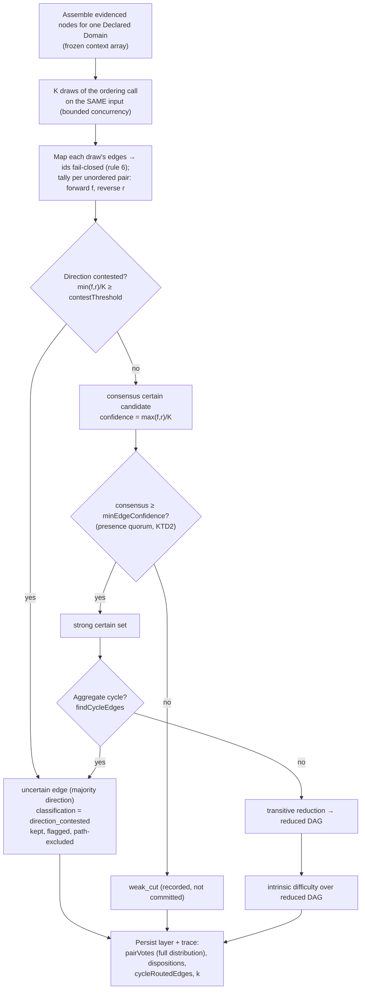

# feat: Prerequisite-Ordering K-Sampling

## Summary

The whole-set ordering stage makes **one** neural call per Declared Domain and commits that single
draw. MoE inference is non-deterministic by architecture (ADR-0028), so the committed prerequisite
edge set inherits the noise of one sample instead of measuring it. A disposable K=8 probe over
published version `9eb3e44d` confirmed two committed defects: a genuinely direction-ambiguous
economics pair flips 7:1 across draws yet is committed CERTAIN at confidence 0.85, and an edge present
in only 1 of 8 draws is committed CERTAIN at the same confidence.

This plan **K-samples the one ordering call per domain**, tallies a per-pair directional vote across
the K draws, routes genuinely direction-contested pairs to `uncertain`, and replaces the model's
self-reported edge confidence with **empirical agreement** (`max(forward, reverse) / K`). That single
consensus number does double duty: it flows into the *existing* weak-edge floor, which therefore
becomes a presence quorum for free — no new quorum mechanism. The single-draw corrective re-prompt has
nothing left to do (acyclicity is enforced on the aggregated set via the existing cycle-routing) and is
**deleted wholesale** (the correction type, port parameter, adapter rendering, and `reprompted` trace
field), per rule 18. K and all thresholds are calibrated in the build's own rule-14 pass, never
hardcoded.

This plan also carries one **user-directed greenfield cleanup folded in at scope time**: the
project-wide `.vN` artifact-version suffix convention is **abolished** (all five artifact types), and
the write-only `schemaVersion` field is removed as dead state (rule 18). This lands first, as a
standalone foundation, so the K-sampling trace-shape change builds on a clean unversioned
`enrichment_run` type and a shape change simply resets the DB (rule 9) rather than bumping a version.

---

## Problem Frame

The shipped whole-set ordering (`docs/plans/2026-06-24-001`) commits one draw from a non-deterministic
distribution. Two failure modes are now empirically confirmed (probe
`tmp/2026-06-24-k-sample-ordering-probe/rule-14-evaluation.md`):

- **Direction instability.** A member-of pair whose prerequisite *direction* is legitimately
  contestable flips 7 forward / 1 reverse across 8 draws, but the single-draw layer commits it as a
  CERTAIN edge at 0.85 — and 1 in 8 draws would commit the *reverse* edge equally confidently. This is
  exactly the epistemic uncertainty ADR-0028 / rule 19 says to *measure and route to `uncertain`*, not
  freeze by a coin flip.
- **Presence instability.** 3 of 15 committed certain edges are presence-unstable; one appears in only
  1 of 8 draws (a lucky-draw over-commit), while robust edges (7/8) risk being missed entirely on a
  single draw. The committed edge *set* is itself one noisy sample.

A 3-model comparison (`tmp/2026-06-24-ordering-model-comparison/`) showed single draws are fragile for
edge presence and latency across models — so this is **not a model-choice problem** to swap away, but an
irreducible distribution to measure (rule 19). The ordering model stays `gpt-oss-120b` (settled).

The fix changes the correctness model: committed edges reflect the **judgment distribution**, contested
directions surface as `uncertain` (excluded from learner paths), barely-supported edges are not
over-committed, and edge confidence becomes a calibrated measure of model agreement.

A second, smaller problem surfaced while scoping: the `.vN` artifact-version suffix is a
backward-compatibility concept that greenfield + aggressive DB reset (rules 8/9) makes meaningless —
no two payload generations ever coexist in a live DB, so the discriminator always holds one value.
It carries no information and has already produced a silent drift (the `enrichment_run` writer emits
`v3` while a DB query surface still filters the dead `enrichment_run.v2`). The user directed abolishing
the convention while the project is in active development.

---

## Requirements Traceability

Origin: `docs/brainstorms/2026-06-24-prerequisite-ordering-k-sampling-requirements.md` (locked Decisions
D1–D9, Success criteria SC). User-directed cleanup added at scope time (see KTD7).

| Origin | Honored in |
|---|---|
| D1 K-sample the one ordering call per domain (one-call-per-domain × K, not O(n²)) | U4 |
| D2 per-pair directional vote tally (forward `f`, reverse `r`) | U2 (type), U4 (tally) |
| D3 direction-contested → `uncertain` (the only genuinely new gate) | U4 |
| D4 consensus confidence `max(f,r)/K` replaces the model self-report | U4 |
| D5 presence quorum reuses the existing weak-edge floor (no new mechanism) | U4 (KTD3) |
| D6 presence-below-quorum → `weak_cut`; direction-contested → `uncertain` | U4 |
| D7 drop the single-draw re-prompt; acyclicity on the aggregate via existing cycle-routing | U2, U3, U4 (KTD4) |
| D8 K + all thresholds calibrated in rule-14, never hardcoded | U6 |
| D9 backing model `gpt-oss-120b` (settled) | U5 (config unchanged), U6 (confirm) |
| SC contested pair → `uncertain`; 1/8 over-commit gone; robust edges kept; consensus conf + vote distribution inspectable; acyclic without re-prompt; cost ≈ K calls/domain | U4 (mechanism), U6 (verify) |
| In-scope: persist per-pair vote distribution to the trace | U2 (type), U4 (write) |
| In-scope: deterministic-envelope tests only (no model-verdict assertions) | U4 |
| User-directed: abolish `.vN` suffix convention project-wide | U1 (KTD7) |

---

## Key Technical Decisions

### KTD1 — The K-loop and per-pair aggregation live in the application boundary, not the adapter

The `LiteLlmPrerequisiteOrderingAdapter` stays a **thin single-call caller** (one `order()` = one draw).
The K-loop, the per-pair vote tally, the contest gate, and consensus-confidence aggregation are the
application's job (`runGraphEnrichment.ts`), exactly where every provable guarantee already lives
(rules 16/19). This preserves the deep-module boundary (AGENTS rule 2): the adapter renders a prompt and
validates one tool response; the boundary owns the measurement. The K draws reuse the existing shared
`mapWithConcurrency` helper for bounded concurrency — the draws are independent and the tally is
order-independent, so concurrency cannot change the aggregate (a tested replay property).

### KTD2 — Consensus confidence is the single number that drives both gates

A committed edge's confidence becomes `max(f, r) / K` (empirical agreement), replacing the per-draw
0.85 self-report (D4). This number simultaneously encodes **presence** (how often the edge appears) and
**direction agreement**. Because it flows into the existing `cutWeakEdges` / `minEdgeConfidence` step,
the weak-edge floor *becomes* the presence quorum with no new mechanism (D5): an edge present in 1/8
draws scores 0.125, falls below the floor, and becomes `weak_cut`; a robust 7/8 edge scores 0.875 and
is kept. Because the floor now gates an *agreement fraction* rather than a model self-report, the floor
value itself is recalibrated in U6 (its prior 0.5 was tuned against 0.85-scale self-reports).

### KTD3 — Two failure modes route to the two existing non-certain destinations

Per D6: **direction-contested → `uncertain`** (kept, flagged, path-excluded — a 7:1 flip is genuine
ambiguity), **presence-below-quorum → `weak_cut`** (a 1/8 edge is weak). Two complementary cycle
mechanisms emerge and are both retained: a *pairwise* direction flip (a 2-cycle, A↔B) is caught by the
contest gate; a *multi-node* aggregate cycle (A→B→C→A, each one-directional) is caught by the existing
`findCycleEdges` cycle-routing on the aggregated certain set. Both feed `uncertain`.

### KTD4 — The single-draw corrective re-prompt is deleted, not kept beside the K path (D7, rule 18)

With K draws there is no single "model's cycle" to re-prompt — acyclicity is enforced on the
*aggregated* certain set via the existing cycle-routing-to-`uncertain` loop. The entire re-prompt
mechanism is removed in the same change that introduces K-sampling: the `PrerequisiteOrderingCorrection`
type, the `correction?` port parameter, the adapter's correction-rendering block, the `cyclePathLabels`
helper, and the `reprompted` trace field. Greenfield has no caller to protect (rules 1/8); a retained
re-prompt path would be a second, dead control flow.

### KTD5 — Disposal reorders to weak-cut → cycle-route (a deliberate change from single-draw)

Under single-draw, the model returned a near-acyclic set and weak-cut was a cosmetic afterthought. The
**K-aggregate is assembled from independent pairwise winners**, so it is more likely to contain a cycle
formed by a low-consensus edge. Therefore weak-cut runs **before** cycle-routing: cutting sub-quorum
edges first prevents one noisy edge from forcing a strong, otherwise-acyclic core into `uncertain`. The
helpers (`cutWeakEdges`, `findCycleEdges`, `transitiveReduction`) are unchanged; only their call order
shifts. This reorder is validated in the U6 rule-14 pass.

### KTD6 — K-sampling intentionally removes per-draw replay determinism (governance)

The pipeline previously advertised replay-determinism ("the same edge set always yields the same
result"). K-sampling deliberately embraces non-determinism — that *is* the measurement (ADR-0028 /
rule 19). A replayed enrichment draws fresh samples and may commit a different edge set. This is correct:
reproducibility of a *published* artifact comes from storing it immutably with provenance and replaying
it (ADR-0017/0019), keyed on `enrichmentId` / `graphVersionId`, never from re-deriving identical model
output. The deterministic guarantee now applies only to the **aggregation given a fixed set of draws**.
The persisted per-pair vote distribution is the immutable record. This is recorded in ADR-0019/0028
(U7).

### KTD7 — Abolish the `.vN` artifact-version suffix convention + the write-only `schemaVersion` field

The `.vN` suffix on artifact-type strings (`enrichment_run.v3`, `graph_snapshot.v2`, `extraction_run.v6`,
`study_item_bank.v4`, `learner_path.v1`) is a payload-generation marker, not a comparison key — every
comparison the project performs is keyed on immutable `enrichmentId` / `graphVersionId` provenance, not
the type string. Under greenfield + DB reset (rules 8/9) no two generations coexist, so the suffix
always holds one value (zero information) and has already caused a silent drift (the stale
`enrichment_run.v2` view). The suffix is abolished project-wide; the artifact type becomes a stable
**kind** discriminator (`enrichment_run`), and every reader collapses to an exact match (the
`extraction_run` readers' `LIKE '…%'` wildcards — which existed only to tolerate the suffix — become
exact `=`). The parallel `schemaVersion` field is **write-only** (the `schema_version` column is
INSERTed but never SELECTed anywhere) — the same ceremony as dead state, so it is removed entirely
(envelope field + DB column + both INSERTs), per rule 18. The K-sampling `enrichmentConfigHash` is a
*different* thing — load-bearing enrichment identity (ADR-0019) that gates re-derivation — and is kept,
renamed to `k-sample-ordering` (no version suffix, consistent with the new convention).

### KTD8 — No new edge persistence; trace is JSONB-only

`inferred_prerequisite_edges` is unchanged: an edge still carries
`{prerequisite_derived_node_id, dependent_derived_node_id, confidence, uncertain, judge_model,
provenance}`. Consensus confidence changes the *value* of `confidence`, not the schema. The per-pair
vote distribution lives only in the JSONB run-trace (`pairVotes`). No edge migration. (The DB *is*
touched, but only for the U1 cleanup — dropping the `schema_version` column.)

---

## High-Level Technical Design

Directional guidance for reviewers, not implementation specification.

### Per-domain K-sampling + aggregation + deterministic disposal

### Vote → disposition decision matrix (illustrative thresholds; calibrated in U6)

| Pair vote across K draws | consensus = max(f,r)/K | Routing |
|---|---|---|
| forward 7, reverse 1 (contested) | 0.875 | **uncertain** (contest gate fires first) |
| forward 7, reverse 0 | 0.875 | **kept** certain |
| forward 1, reverse 0 (lucky draw) | 0.125 | **weak_cut** (below floor) |
| forward 0, reverse 0 (never cited) | — | no edge, no disposition (D-non-edge) |
| winners form A→B→C→A | per edge | strong set is cyclic → **cycle-routed uncertain** |

### What is deleted vs retained (rule 18)

| Deleted in this change | Retained / reshaped |
|---|---|
| `PrerequisiteOrderingCorrection` type + port `correction?` param | `WholeSetOrdering` / per-draw edge schema (one draw is unchanged) |
| adapter correction-rendering block; `cyclePathLabels` helper | `LiteLlmPrerequisiteOrderingAdapter` (thin single-call caller) |
| `reprompted` + `assertedEdges` trace fields | `cutWeakEdges`, `findCycleEdges`, `transitiveReduction` (unchanged; reordered per KTD5) |
| single-draw re-prompt branch in `runGraphEnrichment` | per-domain cycle-routing-to-`uncertain` loop |
| `.vN` suffix on all 5 artifact types; reader LIKE-wildcards | artifact type as stable **kind** discriminator (exact match) |
| write-only `schemaVersion` field + `schema_version` column | `enrichmentConfigHash` (load-bearing identity, renamed `k-sample-ordering`) |
| stale `enrichment_run.v2` migration view filter | the two disposable `tmp/2026-06-24-*ordering*` probe dirs (removed in U7) |

---

## Implementation Units

### U1. Abolish the `.vN` artifact-version suffix + remove the write-only `schemaVersion` field

**Goal:** Remove artifact-version ceremony project-wide so a shape change resets the DB (rule 9) instead
of bumping a version, and fix the latent stale-reader drift. Standalone foundation, independent of
K-sampling.

**Requirements:** KTD7 (user-directed cleanup); unblocks U4's in-place trace-shape change.

**Dependencies:** none.

**Files:**
- `packages/application/src/executeExtractionRun.ts` — `EXTRACTION_RUN_ARTIFACT_TYPE` → `"extraction_run"`;
  delete `EXTRACTION_RUN_SCHEMA_VERSION` + its `schemaVersion:` use.
- `packages/application/src/buildGraphVersion.ts` — `GRAPH_SNAPSHOT_ARTIFACT_TYPE` → `"graph_snapshot"`;
  delete `GRAPH_SNAPSHOT_SCHEMA_VERSION` + use.
- `packages/application/src/runGraphEnrichment.ts` — artifact type literal → `"enrichment_run"`; delete
  the `schemaVersion:` line.
- `packages/application/src/computeLearnerPath.ts` — `"learner_path.v1"` → `"learner_path"`; delete
  `schemaVersion:`.
- `packages/infrastructure-postgres/src/PostgresLearnerLoopStores.ts` — `"study_item_bank.v4"` →
  `"study_item_bank"`; delete `schemaVersion:`.
- `packages/domain-core/src/index.ts` — remove `schemaVersion: string` from the artifact-envelope type
  (around line 617).
- `packages/infrastructure-postgres/src/PostgresArtifactRepository.ts`,
  `packages/infrastructure-postgres/src/PostgresStores.ts` — drop `schema_version` from both INSERT
  column lists + value bindings.
- `packages/infrastructure-postgres/src/migrations/0000_initial_lrnki_schema.sql` — drop the
  `schema_version text NOT NULL` column (line ~248); change every artifact-type filter to exact,
  unversioned matches: `extraction_run.%` (LIKE → `= 'extraction_run'`, lines ~296/316),
  `graph_snapshot.v2` → `= 'graph_snapshot'` (lines ~337/355/374), the stale `enrichment_run.v2` →
  `= 'enrichment_run'` (line ~397), `study_item_bank.v4` → `= 'study_item_bank'` (line ~423).
- `packages/infrastructure-postgres/src/PostgresInspectionRead.ts` — `LIKE 'extraction_run.%'` →
  `= 'extraction_run'` (line ~99).
- `apps/admin-lab/src/lib/enrichments.ts` — `'enrichment_run.v3'` → `'enrichment_run'` (line ~144).
- `packages/infrastructure-postgres/src/PostgresStores.test.ts` — drop `schemaVersion`; unversion every
  artifact-type literal.

**Approach:** Pure rename + dead-field removal; no behavior change. Reset/re-init the dev DB (rule 9) so
no old-typed or `schema_version`-bearing rows linger. After this unit, the artifact type names a *kind*,
not a generation, and all readers match exactly. Grep must show zero `.vN`-suffixed artifact-type
literals and zero `schema_version` / `schemaVersion` references remaining.

**Patterns to follow:** the existing constant style in `executeExtractionRun.ts` / `buildGraphVersion.ts`;
the JSON_TABLE view shape already in the migration.

**Test scenarios** (deterministic; the artifact round-trip is the existing Postgres integration surface):
- Happy path: persisting and reading back each artifact kind round-trips through an exact unversioned
  `artifact_type` match (the existing `PostgresStores.test.ts` round-trips, with suffixes/`schemaVersion`
  removed).
- Regression guard: no `.vN`-suffixed artifact-type string and no `schema_version` column reference
  exists in `packages/**/src` or `apps/**/src` (`grep` clean).
- Edge case: the previously-stale enrichment view now returns rows for a freshly written enrichment
  artifact (proves the dead `v2` filter is fixed, not merely renamed).

**Verification:** `pnpm -r typecheck` clean; Postgres integration tests green against a reset DB; the
admin-lab enrichment loader returns the persisted trace.

---

### U2. K-sampling trace + port types; delete the re-prompt correction

**Goal:** Reshape the domain types and port for K-sampling — a per-pair vote distribution on the trace —
and delete the single-draw re-prompt contract (KTD4), so every downstream layer compiles against the new
shape.

**Requirements:** D2 (vote type), D7 (delete correction); foundation for D3/D4 persistence.

**Dependencies:** none (parallel to U1).

**Files:**
- `packages/domain-core/src/index.ts` — add `PairDirectionVote`
  (`{ prerequisiteDerivedNodeId, dependentDerivedNodeId, forward, reverse, k, consensusConfidence,
  classification: "consensus" | "direction_contested" }`, majority-direction endpoints); reshape
  `PrerequisiteOrderingTrace` to drop `reprompted` + `assertedEdges` and add `k` + `pairVotes:
  PairDirectionVote[]` (keep `declaredDomain`, `judgeModel`, `nodeCount`, `cycleRoutedEdges`); **delete**
  `PrerequisiteOrderingCorrection`. `WholeSetOrdering` / `WholeSetPrerequisiteEdge` (the per-draw shape)
  are unchanged; `InferredPrerequisiteEdge` (the persisted edge) is unchanged (KTD8).
- `packages/ports/src/index.ts` — remove the `correction?` parameter from `PrerequisiteOrderingPort.order`;
  rewrite the doc-comment (no "at-most-one re-prompt"; the application now calls `order` K times on the
  same input and tallies).

**Approach:** Pure type/interface reshape; no runtime behavior. The disposition union
(`uncertain | weak_cut | transitive_reduction | kept`) and `NodeEvidenceExclusion` are unchanged.

**Patterns to follow:** existing port doc-comment density in `packages/ports/src/index.ts:255`; domain
trace-type doc style in `packages/domain-core/src/index.ts:950`.

**Test scenarios:** `Test expectation: none — pure type/interface reshape with no runtime behavior;
exercised by the consumers in U3–U4.` (Workspace typecheck is the gate.)

**Verification:** `domain-core` and `ports` compile clean; remaining typecheck failures are only in the
U3/U4 consumers that still reference the deleted shape.

---

### U3. Ordering adapter: drop correction-rendering, stay a thin single-call caller

**Goal:** Remove the now-dead re-prompt rendering from the ordering adapter (KTD1, KTD4). One `order()`
call = one draw; the K-loop is the application's job.

**Requirements:** D7; supports D1.

**Dependencies:** U2.

**Files:**
- `packages/infrastructure-litellm/src/enrichmentAdapters.ts` — remove the `correction?` parameter and
  the correction-rendering block from `LiteLlmPrerequisiteOrderingAdapter.order`; drop the
  `PrerequisiteOrderingCorrection` import. The schema/validator (`prerequisiteOrderingSchema`,
  `prerequisiteOrderingValidator`) and the single-call transport are unchanged (one draw is identical).
- `packages/infrastructure-litellm/src/enrichmentAdapters.test.ts` — delete the correction/re-prompt
  adapter test; keep the happy-path and validator-rejection tests.

**Approach:** Deletion only. The adapter remains a thin caller that renders the node set, validates one
tool response fail-closed, and returns the typed label-cited ordering. Label→id mapping, tallying, and
acyclicity stay in the boundary.

**Patterns to follow:** the existing thin-caller shape already in
`packages/infrastructure-litellm/src/enrichmentAdapters.ts:68`.

**Test scenarios** (deterministic envelope; canned tool responses are input fixtures for the validator,
never assertions about edge quality — rule 11):
- Happy path: a well-formed `edges` array parses to typed `WholeSetOrdering`.
- Error path: `confidence` out of `[0,1]` → validator rejects fail-closed (rule 6).
- Error path: malformed/missing tool arguments → rejected as a retryable transport failure, never a
  partial parse.
- Regression guard: the adapter no longer accepts or references a `correction` (compile-level; `grep`
  clean of `PrerequisiteOrderingCorrection` in the package).

**Verification:** adapter tests green; no reference to the deleted correction symbol remains; the adapter
resolves the `kg-prerequisite-ordering` alias.

---

### U4. K-loop + per-pair vote aggregation + consensus confidence in `runGraphEnrichment`

**Goal:** Replace the single ordering call + re-prompt branch with K draws, a per-pair directional vote
tally, the direction-contest gate, consensus confidence, the presence-quorum-via-floor, and
cycle-routing on the aggregated set — persisting the vote distribution to the trace. This is the core.

**Requirements:** D1, D2, D3, D4, D5, D6, D7; the in-scope persistence + deterministic-envelope items.

**Dependencies:** U1 (unversioned `enrichment_run` type), U2 (types), U3 (adapter).

**Files:**
- `packages/application/src/runGraphEnrichment.ts` — in the ordering stage (Step 2): for each
  multi-node domain, run K draws of `prerequisiteOrdering.order(...)` on the frozen `contexts` (reuse
  `mapWithConcurrency` for bounded concurrency); map each draw's edges → ids fail-closed (reuse the
  existing label→id guard, rule 6); tally per unordered pair `{forward, reverse}`. Classify each voted
  pair: **direction-contested** (`min(f,r)/K ≥ directionContestMinorityFraction`) → one `uncertain` edge
  in the majority direction with `consensusConfidence` and a contest rationale; else a **consensus**
  certain candidate in the majority direction with `confidence = max(f,r)/K`. Move the weak-edge cut to
  run **before** cycle-routing (KTD5): `cutWeakEdges` on the certain candidates (presence quorum) →
  strong/weak; `findCycleEdges` loop routes any aggregate cycle in the strong set to `uncertain`
  (per-domain `cycleRoutedEdges`); `transitiveReduction` over the acyclic strong set. Build the per-domain
  trace (`k`, `pairVotes`, `cycleRoutedEdges`); drop `reprompted`/`assertedEdges`; **delete** the
  re-prompt branch and the `cyclePathLabels` helper. Add config knobs `orderingSampleCount` (K) and
  `directionContestMinorityFraction`; rename `enrichmentConfigHash` → `k-sample-ordering`. The committed
  edge's `provenance.judgmentRationale` is a deterministically-chosen representative winning-direction
  rationale plus the vote summary.
- `packages/application/src/runGraphEnrichment.test.ts` — rewrite for the K-envelope (fake ordering port
  returns a scripted per-draw sequence).
- `packages/application/src/index.ts` — update exports if the deleted helper was exported.

**Approach:** The boundary owns every provable guarantee (rules 16/19). The K draws are independent and
the tally is order-independent, so concurrency never changes the aggregate. The contest gate is the only
genuinely new gate — it *measures* the flip (rule 19), it does not fabricate a verdict. Consensus
confidence is the single number feeding the existing floor (KTD2/KTD3). No model-verdict content is ever
asserted in a test; canned K-draw sets are inputs to the deterministic aggregation only (rule 11).

**Execution note:** Start with a failing test for the aggregation contract — given a scripted K-draw set,
assert the committed/uncertain/weak split and `consensusConfidence` — before deleting the single-draw
path.

**Technical design (directional):** the fake `PrerequisiteOrderingPort` returns the i-th canned
`WholeSetOrdering` for the i-th call within a domain, so the test drives the tally deterministically
without asserting any ordering is "good".

**Patterns to follow:** the `timeStage` bracketing + disposal structure in
`packages/application/src/runGraphEnrichment.ts:289`; the fail-closed label→id mapping already in the
same stage; `mapWithConcurrency` usage in `packages/application/src/applyRescueDurabilityJudge.ts`.

**Test scenarios** (deterministic envelope; fake ordering port supplies scripted per-draw edge lists):
- D1: a multi-node domain issues exactly K `order()` calls; a singleton domain issues 0 and records an
  empty `pairVotes` (count the fake port's invocations).
- D4: a pair voted forward in 6/8 draws, reverse 0, commits a certain edge with `confidence === 6/8`.
- D3: a pair voted forward 5, reverse 3 (above the contest threshold) is routed to `uncertain`
  (path-excluded), `classification === "direction_contested"`, NOT committed certain.
- D5/D6 (presence quorum): a pair present in 1/8 draws (consensus 0.125, below floor) becomes `weak_cut`
  (recorded, not committed); a 7/8 pair (0.875, above floor) is `kept`.
- KTD5 order: a strong A→B, B→C and a sub-floor C→A → C→A is weak-cut first, leaving an acyclic A→B→C
  (the strong core is NOT routed to uncertain).
- D7: K draws whose per-pair winners form A→B→C→A (each one-directional) → the aggregate strong set is
  cyclic → cycle-routed to `uncertain`; exactly K calls occur (no K+1 correction call; the re-prompt is
  gone).
- Replay property: the same multiset of K draws fed in two different orders yields identical `pairVotes`
  and the identical committed/uncertain/weak split (aggregation is order-independent).
- Non-edge: a pair never cited in any draw produces no edge and no disposition.
- Fail-closed: an off-roster label in any draw fails the run closed (rule 6), never maps to a guessed
  node.
- Trace: `pairVotes` records `forward`/`reverse`/`k`/`consensusConfidence`/`classification` per voted
  pair; `uncertain` edges are appended to `prerequisiteEdges` but excluded from the reduced DAG and the
  difficulty input.

**Verification:** enrichment tests green; K calls per multi-node domain on the happy path; a real
anchor-only run persists a layer whose `projectLearnerPath` output is unchanged in shape (only edge
membership/confidence reflect the distribution).

---

### U5. Worker ordering summary + alias/config confirmation

**Goal:** Surface the K-sampling outcome to operators and confirm no LiteLLM alias change is needed
(model settled).

**Requirements:** operator visibility; D9 (alias unchanged).

**Dependencies:** U4.

**Files:**
- `packages/application/src/runGraphEnrichment.ts` — add an optional `onOrderingSummary` callback (emit
  `{ k, committed, contested, weakCut, cycleRouted }`), mirroring the existing `onDedupSummary` /
  `onMintingSummary` hooks (the application stays free of console I/O).
- `apps/kg-worker/src/knowledgeGraphWorker.ts` — wire `onOrderingSummary` to a structured log line in the
  enrichment command; no adapter construction change (one `LiteLlmPrerequisiteOrderingAdapter` already).
- `litellm/config.yaml` — **no change** (the `kg-prerequisite-ordering` → `gpt-oss-120b` alias is
  settled, D9); confirm only.

**Approach:** Pure plumbing of an existing hook pattern. K lives in `DEFAULT_ENRICHMENT_CONFIG`, so the
worker activates K-sampling without new env flags (calibrated value set in U6).

**Patterns to follow:** the `onDedupSummary` / `onMintingSummary` wiring in
`apps/kg-worker/src/knowledgeGraphWorker.ts:319`.

**Test scenarios:** `Test expectation: none — wiring of an existing callback pattern; covered by the
worker construction smoke path and the U6 real run.`

**Verification:** a worker enrichment run logs the ordering summary (`k`, contested, weak-cut, committed)
and the `prerequisiteOrdering` stage timing; `pnpm -r typecheck` clean.

---

### U6. Rule-14 calibration + real-use evaluation (the promotion gate)

**Goal:** Calibrate K, the direction-contest minority fraction, and the recalibrated weak-edge floor on
real multi-draw output, and decide by inspection whether K-sampling fixes the observed defects — then
promote to core or hold at `EXPERIMENT_ONLY`.

**Requirements:** D8 (calibration), D9 (confirm model), all Success criteria.

**Dependencies:** U5.

**Files:**
- `tmp/2026-06-24-k-sample-ordering-rule14/` — run logs, per-pair vote dumps, closure tables, and the
  evaluation note (gitignored scratch, rule 10).
- `scripts/` — reuse existing extraction/enrichment entrypoints; no new standing harness (ADR-0013).

**Approach:** Real extraction → publish → K-sample enrichment on the same Rust + economics fixtures as
the trigger probe (version `9eb3e44d`: `fixtures/markdown/rust-book-ch04-01-what-is-ownership.md`,
`fixtures/plaintext/wealth-of-nations-book1-ch1-3.txt`) with real `gpt-oss-120b` calls. Sweep candidate
K values and thresholds against the *judgment distribution* (rule 19), inspecting the persisted
`pairVotes`. Verify each Success criterion: (1) the direction-contested `saving of time…` ↔ `three
circumstances…` pair lands in `uncertain`, not a committed certain edge; (2) the 1/8 `drop function →
memory safety` over-commit is no longer a committed certain edge (`weak_cut`); (3) robust edges (e.g.
`heap → pointer`) remain committed; (4) committed certain edges carry consensus-derived confidence and
the vote distribution is inspectable in the trace; (5) the aggregated certain set is acyclic without a
re-prompt; (6) cost stays ≈ K calls/domain. Calibrate so the direction-minority threshold *scales with
K* (a single stray reverse at large K must not route a robust pair to `uncertain`). Record the chosen K,
fraction, and floor in `DEFAULT_ENRICHMENT_CONFIG`.

**Execution note:** Real-use evaluation, not an automated test (rules 11/14). Quality is established by
inspecting real model output; a green suite is never quality evidence. Write the rule-14 note with a
PASS / FIX_FIRST / EXPERIMENT_ONLY / BLOCKED verdict and the committed knob values.

**Patterns to follow:** the rule-14 note format in
`.agents/skills/real-use-quality-evaluation/SKILL.md`; the SQL closure method and the probe's tally in
`tmp/2026-06-24-k-sample-ordering-probe/probe.ts`.

**Test scenarios:** `Test expectation: none — real-use quality evaluation by inspection (rule 11/14).
Deliverable is the rule-14 note + the calibrated knob values committed to DEFAULT_ENRICHMENT_CONFIG.`

**Verification:** the note records the calibrated K/fraction/floor, the per-criterion result, the
promotion verdict, and explicit caveats; a failing criterion is recorded run-scoped (rule 17) and holds
the layer at `EXPERIMENT_ONLY` rather than promoted.

---

### U7. Amend ADRs / CONTEXT / TODO and remove probe scaffolding

**Goal:** Keep the single source of truth for the prerequisite-derivation decision accurate (rule 18) and
clear the disposable measurement scaffolding.

**Requirements:** origin Dependencies/assumptions; KTD6 governance; D8.

**Dependencies:** U6 (committed knob values + verdict).

**Files:**
- `docs/adr/0019-graph-enrichment-derived-layer.md` — amend: K-sample the ordering call; per-pair vote
  tally; direction-contest → `uncertain`; consensus confidence replaces the self-report; presence quorum
  via the existing floor; the single-draw re-prompt deleted; per-draw replay determinism intentionally
  removed (KTD6).
- `docs/adr/0028-non-deterministic-quality.md` — cross-reference: K-sampling is the self-consistency
  measurement this ADR prescribes; reproducibility is the stored immutable artifact, not re-derivation.
- `CONTEXT.md` — update the Graph Enrichment / Derived Graph Layer entries ("one whole-set ordering call
  per domain" → "K whole-set ordering draws per domain, aggregated to consensus edges"); note the
  abolished artifact-version convention (KTD7).
- `docs/plans/TODO.md` — mark TODO #2 resolved by this plan with the U6 verdict; record the artifact-
  version-ceremony abolition.
- Remove `tmp/2026-06-24-k-sample-ordering-probe/` and `tmp/2026-06-24-ordering-model-comparison/`
  (disposable scaffolding, rules 11/13 — gitignored housekeeping).

**Approach:** Documentation + cleanup; no code. Carry the calibrated values and the governance note into
the decision records so they match what shipped.

**Test scenarios:** `Test expectation: none — documentation + scratch cleanup. Verified by review against
the shipped U1–U6 behavior.`

**Verification:** ADR/CONTEXT statements match the merged code; no doc describes single-draw ordering or
the `.vN` suffix as current; the probe dirs are gone.

---

## Scope Boundaries

### Deferred to Follow-Up Work
- **Admin Lab "present/K" surfacing.** The requirements' open question (likely yes, low cost). The full
  vote distribution already lands in the trace and the rule-14 inspection reads it via SQL, so this is a
  presentation nicety, not on the gate's critical path. Revisit if U6 finds operators need it in the UI.
- **Presence-below-quorum → `uncertain` instead of `weak_cut`.** `weak_cut` is the default (D6); revisit
  in U6 only if operator visibility argues for routing both failure modes to `uncertain`.
- **Abolishing `schemaVersion` semantics beyond removal.** If the artifact envelope ever needs a real
  schema marker again, it returns as a *read* field with a consumer, not write-only ceremony.

### Outside this change's identity
- **Changing the ordering model.** Settled: `gpt-oss-120b` (ADR-0028; model-comparison evidence).
- **Any self-consistency *framework* beyond an integer vote tally.** Rule 19's self-consistency *is* the
  tally; do not over-build.
- **Embeddings, bridge nodes, or graph growth** in prerequisite derivation (rule 20 / ADR-0012).
- **Re-opening serving/seed determinism.** MoE non-determinism is signal, not a bug (ADR-0028).
- **O(n²) per-pair or per-node-batched judging.** Already retired.

---

## Risks & Mitigations

- **The contest threshold can't be both sensitive at small K and robust at large K with a binary "any
  reverse" rule.** *Mitigation:* the threshold is a *fraction of K* (`min(f,r)/K`), calibrated in U6 so a
  single stray reverse at large K (small `min/K`) does not route a robust pair to `uncertain`, while the
  genuine 7:1 flip (larger `min/K` at small K) does. Never hardcoded (D8).
- **Recalibrating the weak-edge floor for agreement-scale confidence regresses presence behavior.**
  Consensus `max(f,r)/K` lives on a different scale than the old 0.85 self-report. *Mitigation:* U6
  recalibrates `minEdgeConfidence` against real vote fractions and verifies the 1/8 over-commit drops out
  while robust edges survive.
- **K× latency/cost on the rule-14 loop.** *Mitigation:* K applies to the cheap one-call-per-domain
  volume (not O(n²)); draws run with bounded concurrency (KTD1); K is justified by the calibration, not
  assumed.
- **The DB cleanup (dropping `schema_version`, unversioning types) breaks a reader.** *Mitigation:* U1
  changes every writer, every migration view, and every app loader in one change (rule 18) and resets the
  DB (rule 9); the regression grep + Postgres round-trip tests prove no `.vN` / `schema_version`
  reference survives.
- **Losing per-draw replay determinism surprises a downstream consumer.** *Mitigation:* KTD6 records the
  intentional change; reproducibility is the immutable stored artifact (ADR-0017/0019), and `projectLearnerPath`
  already consumes `uncertain` exclusion unchanged.

---

## Open Questions (deferred to implementation / calibration)

- The committed **K**, **direction-contest minority fraction**, and **recalibrated weak-edge floor**
  (U6 — against real larger-K output; the K=8 probe's 1/8 flip rate is too small to set them).
- The exact denominator for the contest fraction (`min(f,r)/K` vs `min(f,r)/(f+r)`) — evaluate both in
  U6 calibration; the plan commits to a K-scaling fraction, not the specific form.
- The representative-rationale selection for a committed consensus edge's `provenance.judgmentRationale`
  (U4 — deterministic, human-readable; the structured counts live in `pairVotes`).

---

## Sources & Research

- Trigger + design notes: `tmp/2026-06-24-k-sample-ordering-probe/rule-14-evaluation.md` and `probe.ts`
  (the validated forward/reverse tally + three-way classification that ports into U4).
- Model settled: `tmp/2026-06-24-ordering-model-comparison/rule-14-evaluation.md`.
- Shipped baseline: `docs/plans/2026-06-24-001-feat-whole-set-prerequisite-ordering-plan.md`;
  `packages/application/src/runGraphEnrichment.ts` (ordering stage), `prerequisiteDag.ts` (symbolic
  helpers), `mapWithConcurrency.ts` (bounded concurrency).
- Code surfaces touched: `packages/{domain-core,ports,infrastructure-litellm,application,
  infrastructure-postgres}`, `apps/{kg-worker,admin-lab}`, `litellm/config.yaml`, the single migration
  `0000_initial_lrnki_schema.sql`.
- Governance: ADR-0019 (Graph Enrichment), 0028 (non-deterministic quality), 0017 (immutable artifact
  provenance), 0012/rule 20 (embeddings propose-only); AGENTS rules 8/9 (greenfield DB), 11/16/17/19
  (measurement discipline), 18 (single source of truth).
- `docs/plans/TODO.md` #2 (this task).
