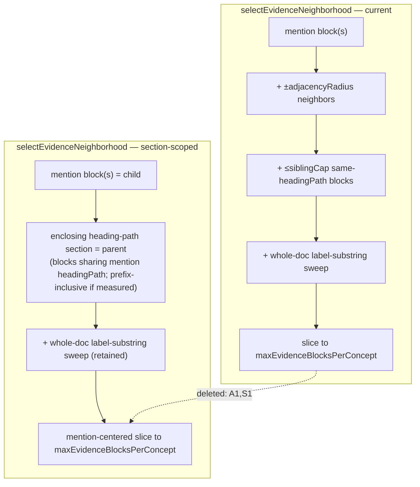
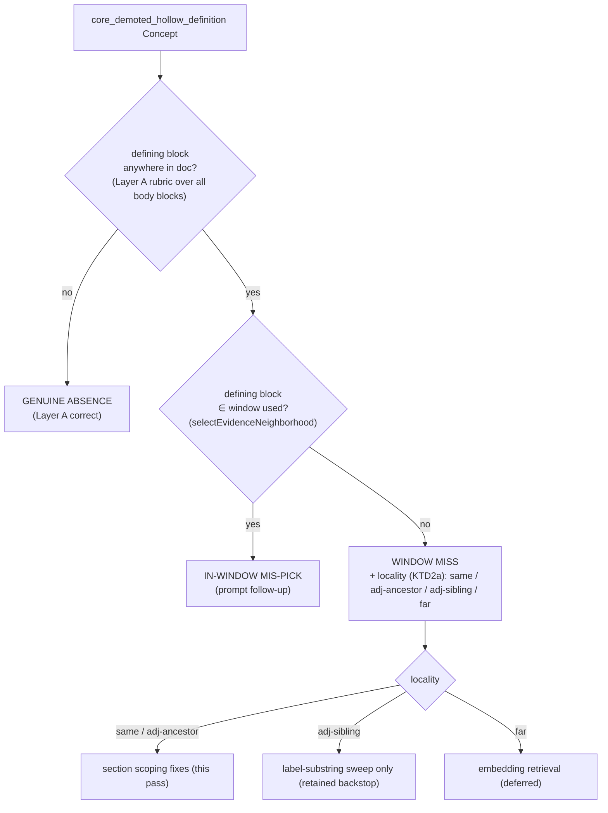

# feat: Section-scoped parent-child CEP definition-evidence retrieval

## Summary

Replace the deterministic `selectEvidenceNeighborhood` window (mention block + ±1 adjacency +
≤4 same-heading siblings, cap 12) with **section-scoped parent-child retrieval**: retrieve on
the precise mention (child block), return the enclosing heading-path section (parent) as the
definition window. This is the rule-21 established method (hierarchical / parent-child
retrieval) applied to the existing structure-aware blocks — no new segmentation.

The work is gated by a **disposable three-way measurement instrument** that attributes every
existing `core_demoted_hollow_definition` demotion on the real fixture to one of three causes
(genuine absence / window miss / in-window mis-pick) and, for window misses, records locality
(same / adjacent / far section). Measurement runs first so the locality distribution — a
structural signal, not fixture content — selects the section-depth rule and justifies deleting
the superseded `adjacencyRadius`/`siblingCap` heuristics (rule 18). Promotion requires a
rule-14 PASS on real model output, not a green suite.

---

## Problem Frame

Layer A (shipped on `feat/cep-definition-quality-judge`) vetoes verbatim-grounded but
meaning-empty Definition Passages and demotes the Concept core→optional under
`core_demoted_hollow_definition`. That reason code conflates three causes (see origin):

1. **Genuine absence** — the source never defines the Concept (Layer A correct; nothing to fix).
2. **Window miss** — a defining block exists in the document but *outside* the extraction
   window `selectEvidenceNeighborhood` put in front of the extractor.
3. **In-window mis-pick** — a defining block was *inside* the window, but the model quoted the
   hollow block (the heading/title/citation) instead.

Only cause (2) is fixed by a retrieval change. Applying a chunking change blindly would spend
carrying cost on causes (1) and (3) it cannot touch. The fix must therefore be *measured into
existence*: quantify the split first, change retrieval to convert same/adjacent-section window
misses into kept definitions, and confirm on real output that the hollow-demotion rate drops
for the right reason.

The change site is well-bounded. `selectEvidenceNeighborhood`
(`packages/domain-core/src/index.ts:63`) has exactly one production caller — the local
`evidenceNeighborhood` helper in `packages/application/src/executeExtractionRun.ts:203`, which
passes the result straight to the CEP extractor as `evidenceNeighborhood`. The config fields to
delete (`siblingCap`, `adjacencyRadius`) are consumed only inside the function, the type
definition, the default constant, the selector test, and one assertion in
`executeExtractionRun.test.ts`. The worker (`apps/kg-worker/src/knowledgeGraphWorker.ts`) and
`runExtractionOverSources.ts` use the default config and need no change beyond the type.

---

## Requirements Traceability

Carried from origin (`docs/brainstorms/2026-06-25-cep-definition-section-retrieval-requirements.md`):

| Origin requirement | Where addressed |
|---|---|
| Scope 1 — section-scoped parent-child retrieval in `selectEvidenceNeighborhood` | U2 |
| Scope 2 — delete `adjacencyRadius` + `siblingCap` heuristics, config fields, dead refs (rule 18) | U2 |
| Scope 3 — disposable three-way measurement instrument under `tmp/` | U1 |
| Scope 4 — before/after validation on the named fixture | U1 (before), U3 (after) |
| Decision — measurement oracle is Layer A judge over the full document; no new judge | U1 |
| Decision — embeddings deferred unless window-miss/**far** dominates | Deferred to Follow-Up Work |
| Decision — in-window mis-pick fix is a domain-neutral prompt clause, separable | Deferred to Follow-Up Work |
| Hard constraint — verbatim floor untouched (ADR-0004/0007) | U2 (retrieval-grouping only), U3 verification |
| Hard constraint — block/locator identity unchanged; no re-segmentation | U2 (operates over existing blocks via `headingPath`) |
| Hard constraint — domain-neutral (rules 3/17) | U2 KTD (structural section rule, no fixture calibration) |
| Hard constraint — real-use gate (rules 13/14) | U3 rule-14 note |
| Success — three-way attribution with defining-block citation | U1 |
| Success — same/adjacent window-miss Concepts retain definitions, no new verbatim failures | U3 |
| Success — genuine-absence Concepts stay demoted (no false recovery) | U3 |
| Success — radius + sibling config gone, one source of truth | U2 |

---

## Key Technical Decisions

**KTD1 — Measure-first sequencing.** Build and run the measurement instrument (U1) before the
retrieval change (U2). The window-miss locality distribution (same / adjacent / far) is the
empirical gate for whether section scoping suffices and what depth rule to use; deleting the
heuristics (rule 18) is justified by that distribution, not assumed. Rationale: the origin's
own decision table keys the fix on the dominant measured cause.

**KTD2 — Section identified by `headingPath`; leaf-section default (incl. the section's own
heading) with prefix fallback informed by measured locality.** The "enclosing section" of a
mention block is derived from its `headingPath` (the existing structure key — no
re-segmentation). **Critical subtlety (verified in `markdownBlocks.ts:140-141`):** a `heading`
block carries its *ancestors'* `headingPath`, not its own — the title is pushed onto the stack
*after* the block is emitted. So a mention paragraph at path `P = ["Method","CA selector"]` does
NOT share a `headingPath` with the `"CA selector"` heading block (whose path is `["Method"]`),
even though that heading opens the section and often carries the defining sentence. A naive
equality rule would silently drop it. Therefore the **leaf-section default** includes a body
block `B` iff `B.headingPath` **equals** `P` **OR** `B` is the heading that opens the section
(`B.blockType === "heading"` and `[...B.headingPath, B.text]` equals `P`). If U1 shows
window-miss/**adjacent-ancestor** cases where the defining block sits in an ancestor section's
intro (a `headingPath` that is a strict prefix of `P`), widen to the **prefix-inclusive** rule:
include blocks whose `headingPath` is a prefix of, or equal to, `P`. The choice is made from the
*structural* locality split, never from fixture concept names (rule 17). This resolves the
origin's "section bounding / how deep" open question.

**KTD2a — Pinned locality predicate (resolved before U1 runs, so the histogram is
reproducible).** For a defining block at path `D` and a mention at path `P`, classify in
`headingPath` terms: **same** = `D` equals `P` (or `D` is the section's opening heading per
KTD2); **adjacent-ancestor** = `D` is a strict prefix of `P` (ancestor-section intro) — *fixed
by the prefix-inclusive widening*; **adjacent-sibling** = `D` and `P` share all but the last
segment (same parent, different leaf) — *NOT fixed by leaf-exact or prefix-inclusive; reachable
only via the retained label-substring sweep*; **far** = otherwise — *fixed only by embeddings
(deferred)*. Section scoping (this pass) therefore targets **same + adjacent-ancestor**; the
diagram's "same/adjacent" branch is read with this precision, not as a claim that every adjacent
case is recovered.

**KTD3 — Section bounded by `maxEvidenceBlocksPerConcept` via a mention-centered slice.** When
an enclosing section exceeds the cap, take a mention-centered contiguous slice *within the
section* (blocks nearest the mention indices) rather than truncating from the top, so the
defining block stays reachable. The `maxEvidenceBlocksPerConcept` bound and the whole-document
label-substring sweep are retained (origin Scope 2); only adjacency + sibling-cap are removed.

**KTD4 — Measurement oracle reuses the Layer A judge over all body blocks; record both
verdicts when a cross-family judge is run.** The instrument feeds **every body block** (full
`text` as `evidenceQuote`, with its real `blockType`/`headingPath`) to the
`DefinitionPassageQualityJudgmentPort.judgeDefinitions` rubric — the same rubric Layer A used to
veto — to locate defining blocks document-wide. A block is "defining" iff
`establishesMeaning === true`. Additionally run `kg-independent-judge` (gpt-oss-120b) over the
same blocks and **record both verdicts, flagging disagreement** (origin open question, lean:
cheap and more honest). No new judge is built. The instrument is disposable (rule 11), deleted
once it has reported (U3).

**KTD4a — Chunk the document-wide scan; a missing index is a scan failure, never a verdict.**
The Layer A adapter fails **open** — a missing or unparseable verdict defaults to `keep`
(`establishesMeaning = true`; see `extractionAdapters.ts`), which is correct for production
recall but wrong for a measurement scan: a full arXiv fixture has hundreds of body blocks, and a
single forced-tool call asked for hundreds of index-aligned judgments will truncate, so dropped
indices would be silently miscounted as **defining** — inflating window-miss / in-window
mis-pick and masking genuine absence, corrupting the exact attribution the plan gates on.
Therefore the instrument batches the scan into bounded chunks (≤ ~20 blocks per
`judgeDefinitions` call) and **asserts that every index in a chunk returned a verdict**; a
missing index is treated as scan failure (re-run / surfaced), never as a definition verdict.
Production Layer A is unchanged — this discipline lives only in the disposable instrument.

**KTD5 — "Window used" is computed by calling `selectEvidenceNeighborhood` itself.** The
instrument reconstructs the per-Concept window by calling the same function the pipeline uses,
so before/after is the identical script run across the U2 commit. In-window mis-pick =
(a defining block ∈ window) AND (the Concept was demoted hollow); window miss = (a defining
block ∉ window) AND (none of the defining blocks are in the window); genuine absence = (no
defining block anywhere).

**KTD6 — Single-fixture measurement; deletion justified structurally.** The measurement runs on
the primary AIRA-dojo fixture (`4c9b0872-...`, source `2507.02554v2`). A second mixed-domain
source is **not** required before deleting the heuristics: the deletion is justified by the
structural fact that section scoping subsumes adjacency + sibling-cap, and the verbatim floor
plus the domain-neutral section rule protect against fixture overfit. A second fixture is a
deferred confidence check, not a blocker.

---

## High-Level Technical Design

Per-mention retrieval, before vs. after. The stored-passage path (verbatim floor) is unchanged;
only the *set of blocks shown to the extractor* changes.



Measurement classification per demoted Concept (U1):



---

## Implementation Units

### U1. Disposable three-way measurement instrument + before snapshot

**Goal:** Quantify, on the real fixture, why each `core_demoted_hollow_definition` Concept was
demoted — genuine absence / window miss / in-window mis-pick — with the defining-block citation
and, for window misses, the locality (same / adjacent / far section). Produces the "before"
snapshot that gates the retrieval change.

**Requirements:** Origin Scope 3, Scope 4 (before), success criterion 1; KTD1, KTD4, KTD5, KTD6.

**Dependencies:** none (operates against shipped Layer A + current `selectEvidenceNeighborhood`).

**Files:**
- `tmp/2026-06-25-cep-defn-retrieval/measure.ts` (create — the instrument)
- `tmp/2026-06-25-cep-defn-retrieval/before.md` (create — captured before snapshot)
- Pattern reference: `tmp/2026-06-24-definition-quality-judge/eval.ts` (in-memory store, real
  LiteLLM adapters, env load)

**Approach:**
- Mirror `eval.ts`: load `.env`, build LiteLLM adapters, register source `4c9b0872-...`, run
  `executeExtractionRun` through an in-memory store, strip null bytes from block text.
- From the run result, take every Concept with `core_demoted_hollow_definition` in
  `admission.boundaryReasonCodes`. For each, gather its mention block IDs and aliases from the
  run candidate.
- **Document-wide defining-block scan (KTD4 / KTD4a):** build a passage list from *all* body
  blocks (`extractableBlocks(document.blocks)`), one passage per block with
  `evidenceQuote = block.text`, real `blockType`/`headingPath`, and call `judgeDefinitions`
  (Layer A adapter) **in bounded chunks (≤ ~20 blocks)**, asserting every index in each chunk
  returns a verdict — a missing index is a scan failure, never read as a definition (KTD4a). A
  block is "defining" for the Concept iff `establishesMeaning === true`. Run the same chunked
  scan with the `kg-independent-judge` adapter; record both verdicts and flag per-block
  disagreement.
- **Window reconstruction (KTD5):** call `selectEvidenceNeighborhood(document.blocks, {mentionBlockIds, labels})` to get the window actually used.
- **Classify:** genuine absence (no defining block), in-window mis-pick (≥1 defining block ∈
  window), window miss (defining block(s) exist but none ∈ window). For window miss, record
  locality per the **pinned KTD2a predicate** (same / adjacent-ancestor / adjacent-sibling / far)
  by comparing each defining block's `headingPath` to the mention's, so the histogram drives the
  leaf-vs-prefix depth choice reproducibly.
- Emit a per-Concept table (Concept label, cause, defining-block IDs + quotes, locality, judge
  agreement) and a cause/locality histogram to `before.md`.

**Patterns to follow:** `tmp/2026-06-24-definition-quality-judge/eval.ts` for harness shape;
`applyDefinitionPassageQualityJudge.ts:44-52` for how passages are built from blocks; the
existing `LiteLlmDefinitionPassageQualityJudgmentAdapter` / `kg-independent-judge` alias.

**Execution note:** This unit's "test" is the real run itself (rule 14) — run it against the
live fixture with real model calls and read the output. No unit tests for disposable `tmp/`
scaffolding.

**Test scenarios:** Test expectation: none — disposable measurement scaffolding under `tmp/`
(rule 11); its correctness is established by inspecting the real-run report, not by unit tests.

**Verification:** `before.md` attributes every `core_demoted_hollow_definition` Concept on the
fixture to exactly one cause with its defining-block citation, and the window-miss rows carry a
same/adjacent/far locality. The cause histogram is readable and the dominant cause is identified.

---

### U2. Section-scoped parent-child retrieval; delete adjacency + sibling-cap heuristics

**Goal:** Replace the adjacency + sibling-cap window with section-scoped parent-child retrieval
keyed on `headingPath`, and delete the superseded `adjacencyRadius`/`siblingCap` config fields
and code in the same change (rule 18). Depth rule chosen from U1's measured locality split.

**Requirements:** Origin Scope 1, Scope 2, success criterion 4; hard constraints
(verbatim-floor untouched, block identity unchanged, domain-neutral); KTD2, KTD3.

**Dependencies:** U1 (locality distribution selects the leaf-vs-prefix depth rule per KTD2).

**Files:**
- `packages/domain-core/src/index.ts` (modify — `selectEvidenceNeighborhood`,
  `EvidenceNeighborhoodConfig`, `DEFAULT_EVIDENCE_NEIGHBORHOOD_CONFIG`; remove `siblingCap`,
  `adjacencyRadius`; section-scoping helper over `headingPath`)
- `packages/domain-core/src/selectEvidenceNeighborhood.test.ts` (rewrite — section-scoping
  behavior; delete radius/sibling-cap assertions)
- `packages/application/src/executeExtractionRun.ts` (modify — type passthrough only; the
  `evidenceNeighborhood` helper and call site stay)
- `packages/application/src/executeExtractionRun.test.ts` (modify — line ~335 config object and
  the `options.evidenceNeighborhoodConfig` type at ~131 drop `siblingCap`/`adjacencyRadius`)

**Approach:**
- New `EvidenceNeighborhoodConfig` keeps only `maxEvidenceBlocksPerConcept`. Remove the
  adjacency loop (`index.ts:89-94`) and the sibling-cap scan (`index.ts:96-103`).
- Add a section helper: given the mention blocks' `headingPath`(s), select body blocks in the
  enclosing section per the KTD2 rule (leaf-exact default; prefix-inclusive if U1 shows
  ancestor-intro misses). Preserve document order; dedup via the existing `candidateIds` set.
- Retain the label-substring sweep (`index.ts:105-110`) and the final
  `maxEvidenceBlocksPerConcept` slice, but make the slice **mention-centered within the section**
  (KTD3) so an oversized section cannot push the defining block past the cap.
- Keep the function pure and deterministic (it remains a domain-core symbolic transform, rule
  19) — section scoping is a retrieval-time grouping only; nothing about stored-passage
  verification changes (hard constraint, ADR-0004/0007).
- Grep for any other reference to the removed fields before finishing (rule 18); the survey in
  Problem Frame lists the only consumers.

**Technical design (directional, not specification):**
```
selectEvidenceNeighborhood(blocks, {mentionBlockIds, labels}, {maxEvidenceBlocksPerConcept}):
  body        = extractableBlocks(blocks)
  mentions    = body ∩ mentionBlockIds            # child blocks
  sectionKeys = distinct headingPaths of mentions
  section     = body where inEnclosingSection(block.headingPath, sectionKeys)  # parent
  candidates  = mentions ++ section ++ labelSubstringSweep(body, labels)  # ordered, deduped
  return mentionCenteredSlice(candidates, mentions, maxEvidenceBlocksPerConcept)
```
where `inEnclosingSection(block.headingPath, sectionKeys)` is the **leaf-section** rule —
`block.headingPath` equals a mention's path, OR `block` is the heading that opens that section
(`blockType === "heading"` and `[...block.headingPath, block.text]` equals the mention path,
per the KTD2 markdownBlocks subtlety) — widened to prefix-inclusive only if U1 warrants. An
empty mention `headingPath` (`[]`, pre-first-heading blocks) is treated as **no enclosing
section**: fall back to mention block(s) + the label sweep, bounded by the cap (KTD3), so an
empty-path mention cannot expand to the whole preamble.

**Patterns to follow:** existing `sameHeadingPath` / `uniqueHeadingPaths` helpers
(`index.ts:115-129`); the existing dedup `addCandidate` closure; current test structure in
`selectEvidenceNeighborhood.test.ts`.

**Test scenarios** (deterministic-envelope only — symbolic transform, rule 11/19; no model
output asserted):
- **Happy path — leaf section returned:** mention in section `["Method","CA selector"]`; a
  defining sibling block in the same `headingPath` is included even when it is non-adjacent
  (the case the old `adjacencyRadius` missed).
- **Section opening heading included (KTD2 subtlety):** the `"CA selector"` heading block —
  which carries `headingPath` `["Method"]`, not `["Method","CA selector"]` — is included for a
  mention at `["Method","CA selector"]` (regression guard against the naive equality rule that
  would drop the section's own defining opening line).
- **Empty-headingPath mention (KTD3 fallback):** a mention block with `headingPath: []` returns
  mention + label sweep bounded by the cap, NOT every pre-first-heading preamble block.
- **Cross-section exclusion:** a block in a *different* `headingPath` (e.g. `["Results"]`) is
  not pulled in by section scoping (only the label sweep may reach it).
- **Prefix-inclusive rule (only if KTD2 selects it):** a defining block in the ancestor section
  `["Method"]` is included for a mention in `["Method","CA selector"]`.
- **Mention-centered cap (KTD3):** section larger than `maxEvidenceBlocksPerConcept` returns a
  slice centered on the mention indices, and the mention block itself is always retained.
- **Label-substring sweep retained:** a block outside the section containing a label substring
  is still included (regression guard for the retained heuristic).
- **Empty mention set:** no mentions → falls back to label sweep only, bounded by the cap
  (mirrors the existing `mentionBlockIds: new Set()` test).
- **Determinism:** identical inputs yield identical output ordering (mirrors existing idempotence test).
- **`executeExtractionRun.test.ts`:** the run still wires the window through; the at-cap config
  test (line ~335) passes with the slimmed config shape and no `siblingCap`/`adjacencyRadius`.

**Verification:** `tsc`/build is clean across the monorepo; no remaining references to
`siblingCap` or `adjacencyRadius` anywhere (grep returns nothing); all selector and
`executeExtractionRun` tests green. One source of truth for the window (success criterion 4).

---

### U3. Before/after validation, rule-14 PASS, instrument teardown

**Goal:** Re-run the U1 instrument against the post-U2 pipeline, confirm same/adjacent
window-miss Concepts now retain a meaning-bearing Definition Passage and are no longer demoted,
genuine-absence Concepts remain demoted, and no new verbatim-floor failures appear — then delete
the instrument (rule 11) and write the rule-14 note.

**Requirements:** Origin Scope 4 (after), success criteria 2, 3, 4; hard constraint real-use
gate (rules 13/14); KTD6.

**Dependencies:** U1, U2.

**Files:**
- `tmp/2026-06-25-cep-defn-retrieval/after.md` (create — captured after snapshot + before/after diff)
- `tmp/2026-06-25-cep-defn-retrieval/` (delete the instrument `measure.ts` after reporting — rule 11/18)
- The plan/PR summary's `### Real-use quality evaluation` note (origin success criteria)

**Approach:**
- Run `measure.ts` unchanged against the post-U2 build (KTD5 — same script, the function output
  is what changed). Capture `after.md`.
- Diff before vs. after: every Concept previously classified window-miss/same or
  window-miss/adjacent should now be either (a) no longer in the demoted set, or (b) carrying a
  surviving non-hollow definition. Genuine-absence Concepts must remain demoted (no false
  recovery). Verify the run's verbatim floor is intact (no new verification failures).
- If `after.md` shows a residual dominant cause of window-miss/**far** or in-window mis-pick,
  record it as a run-scoped quality issue and route to Deferred (do not patch the prompt with
  fixture answers — rule 17).
- Delete `measure.ts` once it has reported; **retain `before.md`/`after.md` in `tmp/`** as the
  rule-14 evidence the PR note cites (single done-state — do not also delete the snapshots).

**Execution note:** Real model calls on the live fixture; this is the rule-14 gate, not a unit
test. Promotion to the PR requires PASS here.

**Test scenarios:** Test expectation: none — validation is real-use inspection (rule 14), not an
automated test. The required evidence is the before/after report and the rule-14 note, not a
green assertion (rules 11/14: a green suite is never reported as quality evidence).

**Verification:** `### Real-use quality evaluation` note records Result: PASS with concrete
before/after numbers — the recovered same/adjacent window-miss Concepts named, genuine-absence
Concepts confirmed still demoted, zero new verbatim failures. The instrument is deleted; no
standing benchmark harness remains in the tree (ADR-0013).

---

## Scope Boundaries

**In scope:** section-scoped parent-child retrieval in `selectEvidenceNeighborhood`; deletion of
`adjacencyRadius`/`siblingCap` and their config fields/tests/dead refs; the disposable three-way
measurement instrument; before/after rule-14 validation on the AIRA-dojo fixture.

**Out of scope (origin "Out of scope" — carried verbatim in intent):**
- Embeddings / vector retrieval (unless the far-definition branch is proven necessary).
- Any change to Layer A's hollow-definition rubric or its categories.
- Any standing benchmark harness — the instrument is deleted after it reports.
- Re-segmentation or overlapping fixed-size chunking — the corpus is already structure-aware;
  block/locator identity stays as-is.

### Deferred to Follow-Up Work
- **In-window mis-pick prompt clause** — if U1/U3 shows mis-pick is a material share, add a
  domain-neutral CEP-extraction rubric clause preferring a meaning-bearing block over a
  heading/title/citation block already in context (rules 16/17). Small, separable; built only if
  measured.
- **Embedding propose-only far-definition retrieval** — built only if measurement shows
  window-miss/**far** dominates (rule 20, EXPERIMENT_ONLY, outside the authoritative core).
- **Second mixed-domain fixture** — a confidence check on the cause distribution before relying
  on it cross-domain; not a blocker for this pass (KTD6).

---

## Risks & Mitigations

- **Section scoping over-includes for large top-level sections, pushing the defining block past
  the cap.** → Mention-centered slice within the section (KTD3) keeps the defining block
  reachable; `maxEvidenceBlocksPerConcept` retained.
- **Leaf-exact rule misses ancestor-intro definitions.** → U1 locality measurement detects this
  (window-miss/adjacent with prefix `headingPath`); KTD2 widens to prefix-inclusive only if
  measured, never speculatively.
- **Measurement oracle (Layer A rubric over all blocks) inherits Layer A's blind spots.** →
  Cross-family `kg-independent-judge` recorded alongside with disagreement flagged (KTD4).
- **Deleting heuristics regresses a case section scoping doesn't cover.** → U3 before/after diff
  must show no net loss of kept definitions and no new verbatim failures before promotion; the
  retained label-substring sweep is a backstop for out-of-section mentions.
- **Domain overfit via the section-depth rule (rule 17).** → The rule keys on structural
  `headingPath` relationships only; the depth choice is informed by the locality *distribution*,
  never by fixture concept names.

---

## Open Questions (resolve during U1 measurement)

- **Scan-vs-live-run judge agreement (rule 19).** The document-wide scan re-judges blocks at the
  instrument's temperature/seed, which is not the live run that produced the demotion; MoE
  routing is non-deterministic, so a block can flip "defining" status between runs. When the
  scan and the demotion disagree on whether a window block is defining, in-window mis-pick vs
  window-miss is ambiguous. Lean: treat the scan verdict as the measurement authority, record
  the disagreement count, and route flipping blocks to an `uncertain` bucket rather than forcing
  a category (signal, not defect — rule 19). Resolve once the disagreement rate is observed.
- **Per-Concept vs global prefix-widening.** If U1's locality split is mixed (some Concepts
  adjacent-ancestor, others same), decide whether the prefix-inclusive widening (KTD2) is a
  single global rule or chosen per-Concept from its own mention depth. Lean: one global rule for
  determinism and one source of truth; revisit only if the split is strongly bimodal.
- **Non-extractable defining text caps the recovery ceiling.** A defining sentence in a
  non-extractable block (caption, table/figure placeholder) is invisible to both the scan and
  section retrieval, so such a Concept reads as genuine absence even when the source defines it.
  Record the count if any appear; it bounds the measurable recovery and is not fixed by this pass.

---

## Dependencies

- Layer A: `applyDefinitionPassageQualityJudge`, `core_demoted_hollow_definition`,
  `mentionedNonCoreCandidates` rescue — shipped on `feat/cep-definition-quality-judge`.
- `selectEvidenceNeighborhood` + `EvidenceNeighborhoodConfig` (`packages/domain-core/src/index.ts`)
  and caller `packages/application/src/executeExtractionRun.ts` — the change site.
- `extractMarkdownBlocks` block model with `headingPath` — the section key (unchanged).
- `DefinitionPassageQualityJudgmentPort` + `LiteLlmDefinitionPassageQualityJudgmentAdapter`;
  `kg-independent-judge` (gpt-oss-120b) alias — measurement oracle.
- Registered fixture source `4c9b0872-652e-4931-b20e-f554d57dfcef` (AIRA-dojo `2507.02554v2`);
  a running LiteLLM proxy + Postgres for the real run.

---

## Sources & Research

- Origin requirements: `docs/brainstorms/2026-06-25-cep-definition-section-retrieval-requirements.md`.
- Established method (rule 21): hierarchical / parent-child retrieval — retrieve on the precise
  child block, return the enclosing parent section. Applied to existing structure-aware blocks;
  no new external dependency.
- Disposable-eval precedent: `tmp/2026-06-24-definition-quality-judge/eval.ts` (Layer A rule-14
  harness) — mirrored for U1.
- Code grounded during planning: `selectEvidenceNeighborhood` (`packages/domain-core/src/index.ts:63`),
  caller `executeExtractionRun.ts:203`, judge `applyDefinitionPassageQualityJudge.ts`, port
  `packages/ports/src/index.ts:114`.
