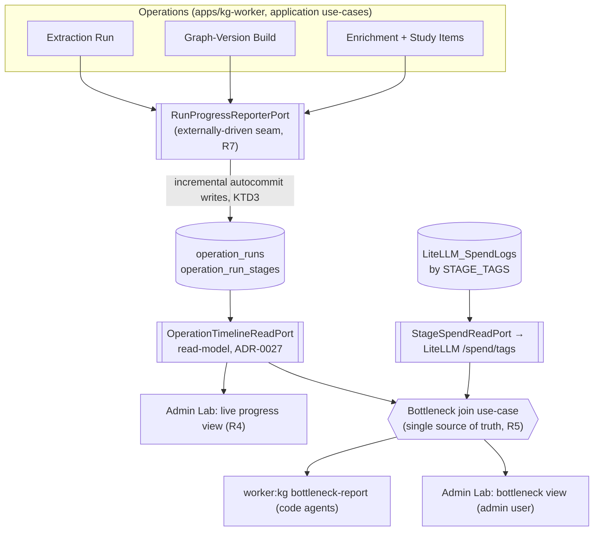
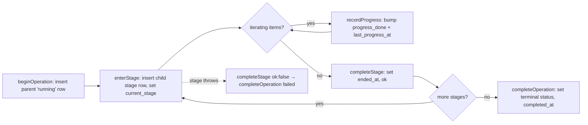

# feat: Durable run-stage timeline for progress and bottleneck observability

## Summary

Give every triggered operation — Extraction Run, Graph-Version Build (minting), and
Enrichment Run (including study-item generation) — a durable, sub-stage-resolved run-stage
timeline in authoritative relational state, written through one externally-driven reporting
seam. One substrate serves two readers: a live operator progress signal in Admin Lab
(current sub-stage + heartbeat, so a slow run is distinguishable from a hung one), and a
standing per-stage bottleneck report that joins the persisted wall-clock with LiteLLM's
per-stage cost. The first target is extraction, which exceeds ten minutes on a single small
document today.

---

## Problem Frame

The authoritative run state is coarse and, critically, **not even live**. The
`extraction_runs` row is `INSERT`ed once — at completion, inside the terminal artifact
transaction (`packages/infrastructure-postgres/src/PostgresStores.ts`
`PostgresExtractionRunStore.persist`). The enrichment run row is the same shape
(`PostgresEnrichmentStores.ts` `PostgresEnrichmentRunStore.persist`). So a client polling
status does not see `running` for ten minutes — it sees **no row at all**, then a finished
one. There is no mid-run substrate to read.

Per-stage timing exists only in-process and only as throwaway stdout: `apps/kg-worker/src/stageTiming.ts` emits `stage_timing` JSON lines, and enrichment feeds them through an
`onStageTiming` callback. Extraction records a single whole-run `latencyMs`. Per-stage cost
and tokens are already collected authoritatively by LiteLLM, which persists every request to
`LiteLLM_SpendLogs` keyed by a stable per-stage tag (`STAGE_TAGS`, in
`packages/infrastructure-litellm/src/stageTags.ts`) and exposes them via `/spend/tags`.
Nothing joins the two signals, and nothing surfaces either back to an operator.

Both asks bottom out in the same missing thing: a persisted, sub-stage-resolved run timeline
with timestamps, written incrementally from operation entry. Progress reporting is a live
read of it; bottleneck measurement is a projection of it joined to LiteLLM cost on the
`STAGE_TAGS` key.

---

## Requirements

Traced from the origin requirements doc (`see origin`).

### Durable substrate

- R1. Each triggered operation records its sub-stages in authoritative relational state with
  per-stage start/end timestamps, a current sub-stage, terminal disposition, and a
  `last_progress_at` heartbeat.
- R2. Extraction, minting, and enrichment+study-items report through one uniform stage
  vocabulary. LLM sub-stages use the existing `STAGE_TAGS` identifiers so cost and wall-clock
  join on the same key; non-LLM sub-stages (document load, persistence) are timed too.
- R3. Long stages that iterate over items update `last_progress_at` and an item progress
  count as items complete, so liveness is visible without waiting for a stage boundary.
- R7. Operations report progress through a single injected reporting seam, not inline writes,
  so a future durable workflow engine can drive the substrate without changing operation
  logic.

### Surfaces

- R4. A read-only inspection projection (ADR-0027 read-model port) exposes each operation's
  current stage, heartbeat, and per-stage timing. Admin Lab renders it as a "where is this
  operation, is it moving" view. No published graph state is mutated.
- R5. A repeatable report joins per-stage wall-clock (from the persisted timeline) with
  per-stage cost and tokens (from LiteLLM `/spend/tags`, projected onto `STAGE_TAGS` so
  LiteLLM's auto-emitted User-Agent pseudo-tags are excluded) into one per-stage view:
  calls, tokens, cost, wall-clock. It is a standing surface for both a code agent and the
  admin user, served from one source of truth.
- R6. The application records time and stage tags only. It must not compute, infer, or
  persist any cost figure; cost is read from LiteLLM at report time.

---

## Key Technical Decisions

- KTD1. **Operation-agnostic timeline tables, not columns on the three run tables.** A new
  parent `operation_runs` and child `operation_run_stages`, keyed by
  `(operation_type, operation_id)`, hold the timeline for all three operations. Extending
  `extraction_runs` / `graph_enrichments` / `graph_versions` separately would not be a
  *shared* model (R2) and would give three divergent read surfaces. One pair of tables yields
  one read-model and one report. (ADR-0017's operation split is preserved — these tables
  describe operations, they do not unify them.)

- KTD2. **Hybrid persistence shape: mutable parent + per-stage child rows.** The parent row
  carries `status`, `current_stage`, `last_progress_at`, and the heartbeat counters
  (`progress_done` / `progress_total`); each child row is one stage with `started_at`,
  `ended_at`, `ok`. Live read is one parent row plus its open stage; per-stage durations are
  `ended_at - started_at`. Chosen over a pure append-only stage-event log, which would be
  more faithful to a future event-sourced engine but costs a fold-on-read for every live
  poll. (Resolves the origin's open persistence-shape question.)

- KTD3. **Reporter writes commit incrementally, outside the operation's terminal transaction.**
  This is the load-bearing decision. Today the run row appears only when `persist` commits at
  the end; mid-run visibility requires each reporter call to commit as it happens. The
  reporter therefore runs on its own statements (autocommit), never enlisted in the
  `persist` transaction, so an in-flight or crashed run still leaves a readable timeline.

- KTD4. **The seam is a `RunProgressReporterPort` with a no-op default.** Operations accept an
  optional reporter and call `beginOperation` / `enterStage` / `recordProgress` /
  `completeStage` / `completeOperation` at boundaries and inside item loops. The worker injects
  the Postgres adapter; tests inject a fake; absent injection a no-op reporter keeps behavior
  unchanged. This is the seam a future Temporal/Restate worker drives (R7) — we keep it open,
  we do not build it.

- KTD5. **The bottleneck report is one application join use-case (the single source of
  truth) with two thin renderers — not an HTTP endpoint.** The use-case joins the timeline
  read-model with a `StageSpendReadPort` over LiteLLM `/spend/tags`. A `worker:kg
  bottleneck-report` CLI command renders it for code agents (stdout table + `--json`); an
  Admin Lab server component renders it for the admin user. A standalone route handler is
  rejected: a code agent would have to boot Next and curl localhost, the Next view calls the
  use-case directly with no HTTP hop, and an API contract is maintenance cost with no current
  consumer. A remote HTTP renderer is a deferrable third surface over the same use-case.

- KTD6. **The report is recomputed, never persisted; cost is never stored (R6).** The durable
  half (timeline) is already in Postgres; the cost half is read live from LiteLLM at report
  time. No report table. The dead, R6-contradicting `extraction_runs.cost_usd` column and the
  `ExtractionRunResult.costUsd` field are removed in the same change (rule 18).

- KTD7. **The durable timeline supersedes the in-process stdout stage-timing.** Once stage
  durations live in `operation_run_stages`, `apps/kg-worker/src/stageTiming.ts` (its
  `withStageTiming` whole-command bracket and `defaultStageTimingSink`) and enrichment's
  `onStageTiming` stdout callback are redundant. They are deleted in the same change that
  lands the reporter (rule 18); no two sources of stage timing.

---

## High-Level Technical Design

### Substrate topology and data flow



Directional guidance for review, not implementation specification.

### Per-operation reporting lifecycle



Non-LLM stages (document load, persistence) flow through the same lifecycle and simply never
appear in the LiteLLM cost half of the join.

---

## Output Structure

New files cluster as follows (existing files modified are listed per unit):

```text
packages/
  ports/src/index.ts                         # + RunProgressReporterPort, StageSpendReadPort,
                                             #   OperationTimeline read-model types/port
  application/src/
    runProgressReporter.ts                   # no-op reporter + shared stage-vocabulary helpers
    bottleneckReport.ts                       # the single-source-of-truth join use-case
  infrastructure-postgres/src/
    PostgresRunProgressReporter.ts           # incremental autocommit reporter adapter
    PostgresOperationTimelineRead.ts         # read-model adapter
  infrastructure-litellm/src/
    LiteLlmStageSpendAdapter.ts              # /spend/tags reader, STAGE_TAGS projection
apps/
  kg-worker/src/knowledgeGraphWorker.ts      # inject reporter; bottleneck-report command
  admin-lab/src/
    lib/operationTimeline.ts                 # server-only thin shell (mirrors lib/inspection.ts)
    app/admin/lab/operations/page.tsx        # live progress view (R4)
    app/admin/lab/operations/bottleneck/page.tsx  # bottleneck view (R5)
```

The tree is a scope declaration, not a constraint; per-unit `Files` lists are authoritative.

---

## Implementation Units

### U1. Operation-agnostic timeline schema

- Goal: Add the durable substrate tables and remove the redundant cost column.
- Requirements: R1, R2, R6.
- Dependencies: none.
- Files:
  - `packages/infrastructure-postgres/src/migrations/0000_initial_lrnki_schema.sql` (edit the
    single initial migration — rule 8; DB reset is allowed — rule 9)
- Approach:
  - `operation_runs`: `operation_run_id uuid PK`, `operation_type text CHECK (in
    'extraction','minting','enrichment','study_items')`, `operation_id uuid` (the
    run/version/enrichment id), `status text CHECK (in 'running','succeeded','failed')`,
    `current_stage text`, `progress_done int`, `progress_total int`, `last_progress_at
    timestamptz`, `started_at timestamptz NOT NULL DEFAULT now()`, `completed_at timestamptz`,
    `UNIQUE (operation_type, operation_id)`.
  - `operation_run_stages`: `operation_run_stage_id uuid PK`, `operation_run_id uuid REFERENCES
    operation_runs`, `stage text NOT NULL`, `started_at timestamptz NOT NULL DEFAULT now()`,
    `ended_at timestamptz`, `ok boolean`, `progress_done int`, `progress_total int`. Index on
    `operation_run_id`.
  - Remove `cost_usd` from `extraction_runs` (dead column, contradicts R6).
- Patterns to follow: existing `extraction_runs` / `graph_enrichments` table style in the same
  migration; `uuid PK` + `timestamptz DEFAULT now()` conventions.
- Test scenarios:
  - Covered indirectly by U3's adapter tests against a reset test database (insert parent +
    child rows, verify constraints reject an unknown `operation_type` and an out-of-set
    `status`).
  - Test expectation: no standalone schema test; the migration is exercised by U3.
- Verification: a fresh DB reset applies the migration cleanly; `extraction_runs` no longer
  has `cost_usd`; both new tables exist with the stated constraints.

### U2. Reporter seam contract + no-op default + stage vocabulary

- Goal: Define the externally-driven seam and the shared stage model in the contract layer.
- Requirements: R2, R7.
- Dependencies: none (can land in parallel with U1).
- Files:
  - `packages/ports/src/index.ts` (add `RunProgressReporterPort` and its argument/result
    types)
  - `packages/application/src/runProgressReporter.ts` (new — `noopRunProgressReporter` plus a
    helper asserting every LLM stage identifier is a member of `STAGE_TAGS`)
  - `packages/application/src/runProgressReporter.test.ts` (new)
- Approach:
  - Port methods: `beginOperation({ operationType, operationId }): Promise<void>`,
    `enterStage({ operationId, stage, total? }): Promise<void>`,
    `recordProgress({ operationId, stage, done }): Promise<void>`,
    `completeStage({ operationId, stage, ok }): Promise<void>`,
    `completeOperation({ operationId, status }): Promise<void>`. All idempotent-tolerant and
    side-effect-only.
  - `noopRunProgressReporter` implements all methods as no-ops so operations stay callable
    without an injected reporter (default-safe).
  - Stage vocabulary: non-LLM stage identifiers (`document_load`, `persist`) are named
    constants alongside the reused `STAGE_TAGS` values; the helper guarantees LLM stages align
    with `STAGE_TAGS` so the R5 join key holds.
- Patterns to follow: existing port interface style in `packages/ports/src/index.ts`; the
  closed-vocabulary discipline in `stageTags.ts`.
- Test scenarios:
  - Happy path: `noopRunProgressReporter` resolves for every method and performs no I/O
    (no throw, returns `undefined`).
  - Edge: the LLM-stage-vocabulary helper returns true for the full extraction + enrichment +
    study-item LLM stage set and false for a fabricated unknown stage.
  - Test expectation: deterministic — pure contract + no-op, no model judgment asserted.
- Verification: `@lrnki/application` and `@lrnki/ports` typecheck; the no-op reporter can be
  passed wherever a reporter is accepted.

### U3. Postgres reporter adapter (incremental, autocommit)

- Goal: Persist the timeline incrementally so progress is visible mid-run.
- Requirements: R1, R3.
- Dependencies: U1, U2.
- Files:
  - `packages/infrastructure-postgres/src/PostgresRunProgressReporter.ts` (new)
  - `packages/infrastructure-postgres/src/index.ts` (export)
  - `packages/infrastructure-postgres/src/PostgresRunProgressReporter.test.ts` (new)
- Approach:
  - Each method is a single autocommitted statement (no `sql.begin` wrapping across calls,
    KTD3): `beginOperation` upserts the parent `running` row; `enterStage` inserts a child row
    and sets `current_stage` + `last_progress_at` on the parent; `recordProgress` bumps the
    parent's `progress_done` / `last_progress_at` (and the open child row's counter);
    `completeStage` sets the child's `ended_at` + `ok`; `completeOperation` sets the parent's
    terminal `status` + `completed_at`.
  - Explicitly never enlist these in an operation's `persist` transaction.
- Patterns to follow: `PostgresExtractionRunStore` constructor/`Sql` injection style in
  `PostgresStores.ts`; `randomUUID()` id generation.
- Test scenarios:
  - Happy path: `beginOperation` then a query in a *separate* connection sees the `running`
    parent row before any stage completes (proves mid-run visibility / KTD3).
  - Happy path: `enterStage` → `recordProgress` × N → `completeStage(ok:true)` yields a child
    row with `started_at < ended_at`, `ok = true`, and `progress_done = N`.
  - Edge: `recordProgress` advances `last_progress_at` monotonically across calls.
  - Error path: `completeStage(ok:false)` followed by `completeOperation('failed')` leaves a
    readable failed parent with the failed stage row intact.
  - Integration: two stages in sequence produce two child rows whose `(ended_at - started_at)`
    durations are independently recoverable for the R5 join.
- Verification: against a reset test DB, the adapter produces the row shapes the read-model
  (U6) and report (U7) consume; mid-run visibility test passes.

### U4. Instrument extraction + worker injection

- Goal: Report extraction stage progress, and make the run row exist from entry.
- Requirements: R1, R2, R3, R7.
- Dependencies: U3.
- Files:
  - `packages/application/src/executeExtractionRun.ts` (accept optional `reporter`; bracket
    stages; per-item heartbeats)
  - `packages/application/src/runExtractionOverSources.ts` (thread the reporter through)
  - `apps/kg-worker/src/knowledgeGraphWorker.ts` (`buildContext` constructs
    `PostgresRunProgressReporter`; `runExtraction` passes it)
  - `packages/application/src/executeExtractionRun.test.ts` (extend)
- Approach:
  - `beginOperation('extraction', runId)` at entry — this is the fix for "no row until done".
  - Stage brackets mapped to `STAGE_TAGS`: `conceptDiscovery`, `admission` (+
    `admissionLabelJudge`), `cepExtraction`, `definitionPassageQuality`, `assertionEntailment`,
    plus non-LLM `persist`. `enterStage`/`completeStage` around each.
  - Heartbeat (R3): in the bounded CEP-extraction loop (`CEP_EXTRACTION_CONCURRENCY`) and the
    admission batch loop, call `recordProgress` as each item resolves (e.g. `cep-extraction
    7/20`).
  - `completeOperation('succeeded'|'failed')` in a `finally`/catch so a thrown stage records
    `failed`; a thrown stage first reports `completeStage(ok:false)`.
- Execution note: instrument behind the no-op default first, then wire the worker — extraction
  behavior must be unchanged when no reporter is injected.
- Patterns to follow: the existing `onRunStart` / `onRunComplete` callback threading in
  `runExtractionOverSources.ts`; `buildContext` adapter construction in the worker.
- Test scenarios:
  - Happy path (fake reporter, canned model output exercising the deterministic transform):
    a successful run emits `beginOperation` → stages in pipeline order → `completeOperation('succeeded')`.
  - Happy path: the CEP-extraction stage emits `recordProgress` once per admitted concept, with
    the final `done` equal to the admitted-concept count.
  - Error path: a thrown CEP-extraction stage emits `completeStage(ok:false)` then
    `completeOperation('failed')`, and does not emit `succeeded`.
  - Edge: with the no-op reporter (default), the run result is byte-identical to pre-change
    behavior (no reporter calls observable).
  - Test expectation: deterministic — canned outputs drive the transform; no model judgment is
    asserted (rule 11).
- Verification: a real extraction (rule 13/14, real LLM calls) leaves a `running` parent row
  observable in Admin Lab while it executes, advancing through stages with a moving heartbeat.

### U5. Instrument minting, enrichment, study-items; remove stdout stage-timing

- Goal: Bring the remaining operations onto the reporter and delete the superseded timing path.
- Requirements: R1, R2, R3, R7.
- Dependencies: U3, U4.
- Files:
  - `packages/application/src/buildGraphVersion.ts` (reporter; minting is non-LLM stages only)
  - `packages/application/src/runGraphEnrichment.ts` (replace `onStageTiming` with reporter
    calls; per-stage brackets aligned to enrichment `STAGE_TAGS`)
  - `packages/application/src/generateStudyItemBank.ts` (reporter; `studyItemGeneration` stage
    + item heartbeat)
  - `apps/kg-worker/src/knowledgeGraphWorker.ts` (pass reporter into `buildVersion`,
    `enrichGraphVersion`, `generateStudyItemsCommand`; drop the whole-command
    `withStageTiming` bracket and the `onStageTiming` stdout sink)
  - Delete `apps/kg-worker/src/stageTiming.ts` and `apps/kg-worker/src/stageTiming.test.ts`
    (rule 18 — superseded by the durable timeline)
  - `packages/application/src/runGraphEnrichment.test.ts` (update — assert reporter calls, not
    stdout)
- Approach:
  - Minting (`operation_type = 'minting'`, keyed by `graphVersionId`): non-LLM stages
    (`load`, `refine`, `persist`) timed for wall-clock; no cost half.
  - Enrichment stages map to `prerequisiteOrdering`, `rescueDurability`, `mintingDurability`,
    `missingPrerequisiteProposal`, `groundingGeneration`, `intrinsicDifficulty`,
    `nodeEmbedding`, `nodeMergeAdjudication`; the existing `onStageTiming` boundary points are
    the exact reporter call sites.
  - Study items (`operation_type = 'study_items'`, keyed by `enrichmentId`):
    `studyItemGeneration` stage with a per-node heartbeat.
- Patterns to follow: the existing enrichment stage-boundary points already wired to
  `onStageTiming` in `runGraphEnrichment.ts` and `knowledgeGraphWorker.ts`.
- Test scenarios:
  - Happy path: an enrichment over canned inputs emits the enrichment stage sequence through
    the fake reporter and `completeOperation('succeeded')`.
  - Happy path: minting emits only non-LLM stages and no stage maps to a `STAGE_TAGS` LLM tag
    (so the R5 cost join yields zero cost rows for minting).
  - Regression: no `stage_timing` line is written to stdout by any command (the deleted path).
  - Test expectation: deterministic — canned inputs, reporter-call assertions only.
- Verification: a real enrichment run leaves a complete enrichment timeline; `grep stage_timing`
  over worker output is empty; `stageTiming.ts` is gone and nothing imports it.

### U6. Live progress read-model + Admin Lab view (R4)

- Goal: Serve and render "where is this operation, is it moving".
- Requirements: R4.
- Dependencies: U3 (needs rows to read).
- Files:
  - `packages/ports/src/index.ts` (add `OperationTimelineSummary`, `OperationTimelineDetail`,
    and `OperationTimelineReadPort`)
  - `packages/infrastructure-postgres/src/PostgresOperationTimelineRead.ts` (new — owns the
    query + row-stitch; no SQL in UI)
  - `packages/infrastructure-postgres/src/PostgresOperationTimelineRead.test.ts` (new)
  - `apps/admin-lab/src/lib/operationTimeline.ts` (new — server-only thin shell over the read
    adapter, `DATABASE_URL`-absent → `undefined`)
  - `apps/admin-lab/src/app/admin/lab/operations/page.tsx` (new — `force-dynamic` list +
    per-operation current stage, heartbeat, per-stage timing)
  - `apps/admin-lab/src/components/AdminShell.tsx` (add the nav entry)
- Approach:
  - Read-model returns finished models (ADR-0027): a list of operation summaries (type, id,
    status, current stage, `last_progress_at`, elapsed) and a per-operation detail (ordered
    stage rows with durations and heartbeat counters). `undefined` only for not-found; real DB
    errors propagate.
  - The page is read-only and mutates no published graph state (rule 12).
- Patterns to follow: `apps/admin-lab/src/lib/inspection.ts` (`withInspectionRead` shell),
  `apps/admin-lab/src/app/admin/lab/runs/page.tsx` (`force-dynamic`, shadcn `Table`/`Card`/`Badge`,
  `LocalDateTime`), and the `RunInspectionReadPort` shape in `ports`.
- Test scenarios:
  - Happy path: the read adapter stitches a parent + its ordered stage rows into one detail
    model with correct per-stage durations.
  - Edge: an in-flight operation (open stage, null `ended_at`) renders as the current stage
    with a live heartbeat, not as complete.
  - Edge: a not-found operation id returns `undefined` (not an error).
  - Integration: a `running` row written by U3 appears in the list before any stage completes.
  - Test expectation: deterministic — seeded rows, no model judgment.
- Verification: during a real extraction, the Admin Lab operations view shows the current
  sub-stage advancing and the heartbeat updating; a stalled run shows a frozen
  `last_progress_at`.

### U7. Bottleneck report: single-source join use-case + two renderers (R5, R6)

- Goal: One source of truth that both a code agent and the admin user analyze for cost/timing.
- Requirements: R5, R6.
- Dependencies: U6 (reuses the timeline read), U1.
- Files:
  - `packages/ports/src/index.ts` (add `StageSpendReadPort` and `StageSpend` type)
  - `packages/infrastructure-litellm/src/LiteLlmStageSpendAdapter.ts` (new — reads
    `/spend/tags`, returns `{ tag, logCount, totalSpend }`, projects onto `STAGE_TAGS`,
    excludes User-Agent pseudo-tags)
  - `packages/infrastructure-litellm/src/index.ts` (export)
  - `packages/application/src/bottleneckReport.ts` (new — the join use-case: timeline
    wall-clock ⋈ stage spend, keyed on stage)
  - `packages/application/src/bottleneckReport.test.ts` (new)
  - `apps/kg-worker/src/knowledgeGraphWorker.ts` (new `bottleneck-report <operationId>` command
    — stdout table, `--json` flag)
  - `apps/admin-lab/src/app/admin/lab/operations/bottleneck/page.tsx` (new — renders the same
    use-case output)
  - `packages/infrastructure-litellm/src/LiteLlmStageSpendAdapter.test.ts` (new)
- Approach:
  - The use-case takes an `OperationTimelineReadPort` and a `StageSpendReadPort`, builds one
    per-stage row `{ stage, calls, tokens, costUsd, wallClockMs }` by left-joining timeline
    stages to spend on the stage key. Non-LLM stages keep wall-clock with absent/zero cost.
  - R6: the application never computes cost — it surfaces LiteLLM's `total_spend` verbatim and
    stores nothing.
  - Both renderers call the use-case; neither re-implements the join (KTD5). No report table
    (KTD6).
- Patterns to follow: the disposable spike `tmp/2026-06-25-run-timing-spike/stage-timing.sh`
  is prior art for the `/spend/tags` shape `{ individual_request_tag, log_count, total_spend }`;
  `LiteLlmForcedToolClient` for the LiteLLM base-URL/transport conventions; the worker command
  dispatch style in `knowledgeGraphWorker.ts`.
- Test scenarios:
  - Happy path: given a fake timeline (two stages with durations) and a fake spend reader, the
    use-case emits one joined row per stage with wall-clock from the timeline and cost from
    spend.
  - Edge: a non-LLM stage (no spend tag) appears with its wall-clock and zero/absent cost.
  - Edge: a LiteLLM User-Agent pseudo-tag in the `/spend/tags` payload is excluded from the
    projection; only `STAGE_TAGS` members survive.
  - Error path: when LiteLLM `/spend/tags` is unavailable, the report still renders the
    wall-clock half and marks cost as unavailable (does not crash).
  - Adapter: the LiteLLM adapter parses a canned `{ individual_request_tag, log_count,
    total_spend }` payload into `StageSpend` rows.
  - Renderer: the CLI command prints a deterministic per-stage table and `--json` emits the
    same structured rows.
  - Test expectation: deterministic — fake ports and a canned spend payload; no model judgment.
- Verification: `worker:kg bottleneck-report <extractionRunId>` prints per-stage calls/tokens/
  cost/wall-clock for a completed real extraction, attributing the bottleneck to specific
  sub-stages; the Admin Lab bottleneck view shows the same numbers for the same operation.

---

## Scope Boundaries

### In scope

- Durable per-operation stage timeline (R1–R3, R7) across extraction, minting,
  enrichment+study-items.
- Live operator progress in Admin Lab (R4).
- Standing single-source bottleneck report with a CLI renderer (code agents) and an Admin Lab
  renderer (admin user) (R5, R6).

### Deferred for later

- A single user-triggered end-to-end "process this document through to study items" pipeline
  run spanning all operations as one journey.
- Adopting a durable workflow engine (Temporal, Restate, or similar). The reporter seam is kept
  open; the engine is not chosen or built here.
- The actual root-cause fix of slow extraction. It follows once the instrument names the
  bottleneck and gets its own rule-21 pass. (The 2026-06-25 provider switch already met the
  >10-min latency motivation; the admission document-prefix cache warming is the next minor
  lever — see `docs/plans/TODO.md` #2.)
- A remote HTTP renderer for the report. Trivial to add later over the same use-case; no
  current consumer.

### Outside this work

- Learner-facing progress UI. This signal is operator/ingestion-facing.
- Any app-level cost computation or storage (R6).

---

## Risks & Dependencies

- LiteLLM `/spend/tags` must remain available and keep the `{ individual_request_tag,
  log_count, total_spend }` shape (confirmed against a prior pull). The report's cost half
  depends on it; the wall-clock half degrades gracefully without it (U7 error-path test).
- `STAGE_TAGS` remains the stable join key. Adding a stage means adding a tag *and* a matching
  timeline stage in the same change (the U2 vocabulary helper enforces alignment at the type
  boundary).
- KTD3 (autocommit, outside the persist transaction) means a crashed run leaves a `running`
  parent row that never reaches a terminal status. This is intended — it is the "hung run"
  signal — but the live view should present a long-stale `last_progress_at` as suspect rather
  than as healthy progress.
- The reporter adds per-item write traffic during heartbeat loops. Bound it to one write per
  completed item (not per token); the existing `CEP_EXTRACTION_CONCURRENCY = 4` keeps the rate
  modest.

---

## Sources / Research

- `packages/infrastructure-postgres/src/PostgresStores.ts` (`PostgresExtractionRunStore.persist`)
  and `packages/infrastructure-postgres/src/PostgresEnrichmentStores.ts`
  (`PostgresEnrichmentRunStore.persist`) — confirm the run row is written only at completion,
  inside the terminal transaction (the core problem-frame fact).
- `packages/infrastructure-litellm/src/stageTags.ts` — the `STAGE_TAGS` closed vocabulary that
  is the R5 join key.
- `apps/kg-worker/src/stageTiming.ts` and `runGraphEnrichment.ts` `onStageTiming` — the
  in-process stdout timing that KTD7 supersedes and deletes.
- `packages/ports/src/index.ts` (Inspection Read Model section, `RunInspectionReadPort`) and
  `apps/admin-lab/src/lib/inspection.ts` + `app/admin/lab/runs/page.tsx` — the ADR-0027
  read-model + thin-shell + `force-dynamic` page pattern U6/U7 mirror.
- ADR-0027 (read-model ports), ADR-0017 (operation split), ADR-0019 (enrichment derived
  layer) — architectural constraints the timeline respects.
- `tmp/2026-06-25-run-timing-spike/FINDINGS.md` and `stage-timing.sh` — the disposable spike
  that located the admission re-send bottleneck and demonstrates the `/spend/tags` query shape.
