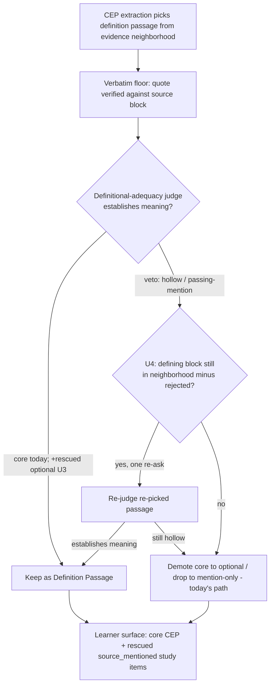

# fix: Guard CEP definition mis-picks on the learner-facing rescue surface

> **Status (2026-06-26): resolved.** U1/U2 measured a 7% learner-facing false-negative rate
> (4/57; 3 in-window mis-picks, 1 non-adjacent window-miss, 0 genuine-absence —
> `tmp/2026-06-26-cep-defn-falseneg/`). **U3 shipped** (commit `18f90e0`,
> `applyRescuedDefinitionQualityJudge`) and neutralizes the learner-facing harm: hollow rescued
> definitions are dropped and the concept stays mention-only. **U4 (bounded re-pick) is deferred** —
> its faithful locus is extraction-time over the full optional population (the declined in-window
> block is absent from the rescue seam's data), too heavy for the 3-concept recall recovery; the
> stronger-extractor branch is not triggered (0 genuine-absence, rule 5 keeps DeepSeek default).
> **U5 (this close-out)** retired the dead section-scoped retrieval lever and reconciled ADR-0007.
> Canonical outcome now lives in `docs/plans/TODO.md` (COMPLETED).

## Summary

Resolve TODO #1 by measuring the real learner-facing risk first, then shipping the smallest durable
fix it justifies. The prompt clause's measured effect is within sampling noise, so it does not close
the item. The dominant measured cause is an *in-window mis-pick*, and the rescue seam shipped this
session turned a previously-discarded class of mis-picks into learner-facing study-item definitions.
The plan extends the disposable measurement to that learner-facing surface, extends the existing
meaning judge to cover rescued optional definitions, and adds a bounded re-pick that recovers a
defining block already sitting in the evidence neighborhood.

---

## Problem Frame

The CEP extractor (DeepSeek V4 Flash) sometimes quotes a passage that *mentions, applies, or
describes* a concept instead of one that states what it **is**, while a genuinely-defining block sits
in the same retrieval window. The 8-run trail at `tmp/2026-06-25-cep-defn-retrieval/before.md`
attributes every observed `core_demoted_hollow_definition` to this *in-window mis-pick* (3/3), with
**zero** window-misses and **zero** genuine-absences — so the deferred section-scoped retrieval
change has nothing to recover. The prompt clause moved demotions 2→1 over 4 runs
(`ab-firstparty.log`), which is inside the noise of the 3/8 base rate.

Two structural facts raise the stakes and point at the fix:

- The meaning judge that catches these mis-picks runs on `core` profiles only
  (`packages/application/src/applyDefinitionPassageQualityJudge.ts:40`; ADR-0007 step 2).
- The rescue seam now carries *optional* definition-bearing candidates to learners as
  `source_mentioned` study-item passages typed `definition` with verbatim citations
  (`packages/application/src/generateStudyItemBank.ts:271-284`). Those optional definitions were
  never definitional-adequacy-judged. The rescue durability judge
  (`packages/application/src/applyRescueDurabilityJudge.ts`) judges *concept durability* and fails
  open — it is not a definitional gate.

So a mis-pick on an optional concept now reaches the learner surface unguarded. That is the open
risk TODO #1 must close.

---

## Requirements

### Measurement

- R1. The disposable instrument quantifies the definitional false-negative rate over the population
  that actually reaches learners — surviving `core` CEP definitions plus rescued `source_mentioned`
  definition passages — not only `core` hollow demotions.
- R2. The false-negative oracle is non-deterministic (self-consistency over the existing
  definitional-adequacy judgment), reporting flips as uncertainty rather than introducing a new
  deterministic surface proxy (ADR-0028).

### Fix

- R3. Every Definition Passage that becomes learner-facing is definitional-adequacy-judged before it
  reaches a study item, including rescued optional definitions.
- R4. When a veto would leave a would-be learner-facing concept without a meaning-bearing definition
  while a defining block remains in its evidence neighborhood, the pipeline re-picks once before
  falling back to demote / mention-only. Conditional on R1's measured rate (see Open Questions).
- R5. The fix stays domain-neutral and keeps the measured semantic judge as the only meaning gate;
  deterministic gates remain verbatim-floor only (rules 16/17).

### Hygiene

- R6. The deferred section-scoped retrieval scope is retired and ADR-0007's core-only judge rationale
  is reconciled with the rescue seam in the same change (rule 18).
- R7. Measurement instruments stay disposable in `tmp/`; only the judge and re-pick modules persist
  (rules 10/11).

---

## Key Technical Decisions

- KTD1. **Measure-first; decide from the rate.** The clause's A/B effect sits inside the 3/8
  base-rate noise, so it is not evidence to close. Per rule 21 and ADR-0028, extend the instrument
  and gate the code fix on the learner-facing false-negative rate, not on demotion counts.
- KTD2. **The blast radius is rescued optional definitions.** The meaning gate is core-only
  (`applyDefinitionPassageQualityJudge.ts:40`); the rescue seam sends optional definitions to study
  items. Extending coverage to that surface is the structural root-cause fix (rule 16: the measured
  semantic judge, not a lexical gate, does the work).
- KTD3. **Re-pick recovers the dominant cause.** In-window mis-pick means a defining block is already
  in the neighborhood. A bounded single re-ask over the neighborhood-minus-rejected-spans recovers it,
  mirroring the whole-set-ordering "one re-prompt then fail closed" pattern. Not a model swap — rule 5
  keeps DeepSeek V4 Flash as the production default; a stronger extractor is a deferred fallback.
- KTD4. **The rescue durability judge is not the definitional gate.** It judges concept durability,
  fails open, and grounds drops in mention evidence. Definitional adequacy reuses the existing
  `DefinitionPassageQualityJudgmentPort` meaning judge — no new alias.
- KTD5. **Independent oracle = self-consistency K-sampling** of the existing definitional-adequacy
  judgment over surviving and rescued definitions (ADR-0028). No new deterministic proxy, no fixture
  tuning (rule 17).

---

## High-Level Technical Design

The fix adds one coverage point (rescued optional definitions) and one branching gate (re-pick on
veto) to the existing definition-passage lifecycle. Solid nodes are today's path; the two dashed
gates are the change.

Placement: the U3 coverage call runs at the rescue seam in `runGraphEnrichment` (after dedupe/merge,
alongside the rescue durability judge, before nodes become study-item grounding) so it judges exactly
the optional definitions that become learner-facing. The U4 re-pick wraps the veto→demote transition
at both the extraction stage and the rescue seam.

---

## Implementation Units

### U1. Extend the disposable false-negative measurement instrument

- Goal: measure the learner-facing definitional false-negative rate, not just `core` hollow demotions.
- Requirements: R1, R2.
- Dependencies: none.
- Files: `tmp/2026-06-26-cep-defn-falseneg/measure.ts` (new disposable, adapted from
  `tmp/2026-06-25-cep-defn-retrieval/measure.ts`), `tmp/2026-06-26-cep-defn-falseneg/tsconfig.json`.
- Approach: run the real pipeline through enrichment so rescued `source_mentioned` nodes exist;
  collect the union of learner-facing definition passages — surviving `core` CEP definitions plus
  rescued optional definition-typed `groundingPassages`. Re-judge each with K-sampled
  definitional-adequacy (self-consistency, ADR-0028) and count false negatives (passages the oracle
  judges not-defining that nonetheless reach learners). For each false negative, reuse
  `selectEvidenceNeighborhood` plus the document-wide defining-block scan from the prior instrument to
  classify it as in-window-recoverable vs. genuine-absence. Disposable.
- Execution note: real LLM calls under rules 11/13/14; reuses existing ports and aliases — no new
  judge, no new alias. Reaching rescued `source_mentioned` nodes requires the full publish → enrich
  path, so this instrument runs heavier than the prior extraction-only, in-memory-store version: it
  needs a real graph-version build and `enrichmentStore.nonCoreRescueCandidates`, which means Postgres
  persistence. Confirm the null-byte ingestion defect the prior trail flagged is handled before the
  run, or the rescued population will be empty.
- Test expectation: none — disposable instrument; verification is the produced report.
- Verification: the instrument runs on the real fixture(s) and emits a false-negative-rate report
  that distinguishes in-window-recoverable from genuine-absence.

### U2. Baseline measurement pass and fix-depth decision gate

- Goal: produce the decision input TODO #1 asks for and pin which fixes ship.
- Requirements: R1.
- Dependencies: U1.
- Files: report under `tmp/2026-06-26-cep-defn-falseneg/`.
- Approach: run U1 across enough stochastic runs to be a population (the defect is rare and
  MoE-stochastic; the prior trail used 8 runs). Record the learner-facing false-negative rate and the
  share that is recoverable in-window. Decision rule: negligible rate → ship U3 as cheap insurance and
  close with documentation; non-negligible with in-window recoverability → also ship U4; far /
  genuine-absence dominant → neither lever helps, escalate to the deferred stronger-extractor branch.
- Execution note: this is a rule-13/14 real-source inspection, not a unit test; a green suite is not
  the evidence.
- Test expectation: none — measurement and validation activity.
- Verification: the report names a false-negative rate and the chosen fix depth with cited evidence.

### U3. Extend definitional-adequacy judging to the learner-facing rescue surface

- Goal: close the structural gap so no learner-facing definition reaches a study item unjudged.
- Requirements: R3, R5.
- Dependencies: U2 (rate confirms need; the structural gap is already known from code).
- Files: `packages/application/src/runGraphEnrichment.ts` (invoke the meaning judge over rescued
  definition passages at the rescue seam), `packages/application/src/applyDefinitionPassageQualityJudge.ts`
  (extract a reusable rescue-definition variant, or a thin sibling reusing the same port),
  `packages/application/src/runGraphEnrichment.test.ts` plus a focused new `*.test.ts`.
- Approach: at the rescue seam — after dedupe/merge, alongside `applyRescueDurabilityJudge`, before
  verbatim-floored nodes become study-item grounding — run the existing
  `DefinitionPassageQualityJudgmentPort` over each rescued node's definition-typed `groundingPassages`.
  Drop hollow definition passages; keep the node mention-only when all its definitions are hollow.
  Fail closed = preserve, exactly as the extraction-time judge does. Never touch mention passages.
  Domain-neutral rubric, unchanged.
- Patterns to follow: `applyDefinitionPassageQualityJudge` (drop-only, index-aligned, fail-closed);
  `applyRescueDurabilityJudge` (rescue-seam placement, disposition recording, fail-open-vs-closed
  discipline — note this stage fails *closed* like the extraction judge, not open like durability).
- Test scenarios:
  - Rescued optional node whose definition passage is a passing-mention or heading → judged hollow →
    dropped; node retained mention-only.
  - Rescued optional node whose definition genuinely defines → kept as a definition passage.
  - Judge transport failure → all passages kept and flagged (fail-closed parity with extraction).
  - Mention passages are never altered by this stage.
  - Covers R3. The study-item bank for that node no longer surfaces the dropped passage as a
    `definition` kind (integration across enrichment → study-item generation).

### U4. Bounded re-pick-on-veto over the evidence neighborhood

- Goal: recover an in-window defining block instead of losing the definition entirely.
- Requirements: R4, R5.
- Dependencies: U2 (gated on measurement), U3.
- Files: `packages/application/src/applyDefinitionPassageQualityJudge.ts` (or a re-pick helper),
  `packages/application/src/executeExtractionRun.ts` (thread the evidence neighborhood / re-pick port),
  `packages/infrastructure-litellm/src/extractionAdapters.ts` (a re-pick definition-selection call that
  excludes rejected spans), tests alongside each.
- Approach: when a profile's definitions are all vetoed (it would go hollow) and the evidence
  neighborhood still holds candidate blocks after excluding the rejected spans, issue exactly one
  re-pick definition-selection call scoped to neighborhood-minus-rejected; re-judge the re-picked
  passage; keep it if it establishes meaning, otherwise fall back to today's demote/drop. Bounded
  single re-ask, fail closed. Two design questions the implementer must resolve first (see Open
  Questions): whether the source evidence neighborhood is reconstructable at the rescue seam — it may
  not be, since enrichment operates over the published graph version and `groundingPassages`, not raw
  source blocks — and whether a blind re-ask is enough when the same extractor already declined the
  defining block, or whether the veto must point the re-pick at the judged-defining candidate.
- Patterns to follow: whole-set-ordering "one re-prompt then fail closed"; reuse the CEP extraction
  adapter's definition-selection prompt.
- Test scenarios:
  - Neighborhood holds a defining block; first pick hollow → re-pick returns the defining block →
    kept, no demotion. Covers the in-window-mispick recovery.
  - Neighborhood holds no defining block → single re-pick fails → demote/drop as today (no loop).
  - The re-pick prompt excludes every rejected span.
  - Re-pick is invoked at most once per concept.
  - A rescued optional concept recovers its in-window definition via the same path (integration).

### U5. Retire dead scope and reconcile docs

- Goal: keep one source of truth (rule 18) and fold the outcome.
- Requirements: R6.
- Dependencies: U2 (TODO reflects the decision), U3 (ADR reflects shipped coverage).
- Files: `docs/plans/TODO.md`, `docs/adr/0007-extract-concept-evidence-profiles-in-concept-context.md`.
- Approach: move TODO #1 to COMPLETED with the measured outcome and trail path; delete the deferred
  section-scoped retrieval scope (U2's single window-miss is non-adjacent, so even section-scoped
  retrieval cannot recover it). Update ADR-0007 step 2 to state the
  meaning judge also covers learner-facing rescued definitions, and record why optional was previously
  exempt and why the rescue seam changed that. Add the rule-14 before/after to VALIDATION.
- Test expectation: none — documentation.
- Verification: no dangling references to the deleted retrieval scope; ADR-0007, TODO, and shipped
  code agree.

---

## Scope Boundaries

### Deferred to Follow-Up Work

- Stronger-extractor / model swap for CEP definition extraction — only if U2 shows in-window
  mis-picks the re-pick cannot recover. Rule 5 keeps DeepSeek V4 Flash as the production default.

### Outside this work

- The section-scoped parent-child retrieval change (the former deferred retrieval scope) — U2 found
  a single window-miss whose defining blocks are non-adjacent, so section-scoped retrieval has
  nothing it could recover. This plan retires it rather than reviving it.
- Intrinsic-difficulty distortion (TODO #2), operator observability (TODO #3), and population
  calibration (ADR-0024, deferred).

---

## Open Questions

- **Fix depth is gated on U2's measured rate** (KTD1). U3 coverage is high-confidence regardless,
  because the structural gap is visible in code; U4 re-pick ships only if in-window recoverability is
  non-negligible.
- **Coverage-judge placement**: the rescue seam in `runGraphEnrichment` (recommended — that is where
  optional definitions become learner-facing) versus extending extraction-time coverage to all
  optional profiles (judges definitions that may never be rescued, more tokens). Pin in U3 once the
  rescue-seam wiring is confirmed.
- **Re-pick locus for optional concepts**: U4's re-pick needs the source evidence neighborhood, which
  enrichment may not hold. Resolve whether to thread source blocks into the rescue seam or to judge +
  re-pick optional definitions at extraction time (before publication, where the neighborhood exists)
  and let the rescue seam carry only already-recovered definitions.
- **Blind re-ask vs judge-guided re-pick**: an in-window mis-pick means the extractor had the defining
  block and declined it, so a blind re-ask may just pick the next hollow block. Decide whether U4
  re-asks freely over the neighborhood-minus-rejected or whether the veto points the re-pick at the
  block the judge found defining (mirroring the whole-set-ordering label-fidelity fix). This may
  shift U4 from "re-pick" toward "judge names the defining block."

---

## Risks & Dependencies

- **Thin, stochastic population.** The defect is rare (3/8 runs). Mitigate with multi-run measurement
  (U2), report uncertainty per ADR-0028, and accept single-fixture measurement per the prior trail's
  policy.
- **Token cost.** Judging rescued definitions and re-picking add LLM calls. Bounded to definition-
  bearing rescued nodes and one re-pick per concept; surfaced by the operation cost report (ADR-0029).
- **Re-pick degeneration.** A naive loop could re-emit the same hollow pick. Bounded to one re-ask
  with rejected spans excluded, fail closed to today's behavior. Residual risk if the same extractor
  keeps declining the defining block — see the judge-guided re-pick Open Question.
- **Measurement harness depth.** Unlike the prior extraction-only instrument, U1 must run the full
  publish → enrich path against Postgres to materialize rescued nodes, and the prior trail flagged a
  null-byte ingestion defect that blocked persistence. If that defect is unresolved, the rescued
  population is empty and the false-negative measurement under-reports. Confirm persistence works
  before treating U2's rate as evidence.

---

## Sources & Research

- Evidence trail: `tmp/2026-06-25-cep-defn-retrieval/before.md` (8-run cause attribution —
  in-window mis-pick 3/3, zero window-miss, zero genuine-absence), `ab-firstparty.log` (clause A/B
  within noise), `measure.ts` (the instrument to adapt).
- Code anchors: `packages/application/src/applyDefinitionPassageQualityJudge.ts:40` (core-only gate),
  `packages/application/src/executeExtractionRun.ts:166-203` (stage order),
  `packages/application/src/reconcileUngroundableCores.ts` (hollow-demotion reason split),
  `packages/application/src/applyRescueDurabilityJudge.ts` (durability ≠ definitional adequacy),
  `packages/application/src/enrichmentNodeMinting.ts:106-128` (rescue node construction),
  `packages/application/src/generateStudyItemBank.ts:271-284` (learner-facing `source_mentioned`
  passages), `packages/infrastructure-litellm/src/extractionAdapters.ts:448-515` (the meaning judge),
  `packages/infrastructure-litellm/src/extractionAdapters.ts:306` (the CEP definition prompt clause).
- ADRs and rules: ADR-0007 (CEP extraction and judge order), ADR-0019 / ADR-0023 (rescue and grounding
  origin), ADR-0028 (non-deterministic measurement), AGENTS rules 16, 17, 21.
