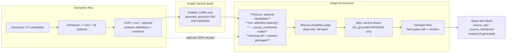

# fix: rescue definition-bearing optional concepts into the derived layer

## Summary

The learner-facing graph is sparse and study items are thin because the **publication →
enrichment seam discards source-grounded knowledge**. Concept Admission extracts complete,
verbatim Concept Evidence Profiles (CEPs) for `optional`-tier concepts (Heap allocation,
`drop`, Copy/Move counterparts, References, Functions/Return Values), but the Graph-Version
Build publishes only `core`. Graph Enrichment's rescue stage then **deliberately excludes any
candidate that has a Definition Passage**, so those concepts fall through to the LLM minter and
are regenerated as the lowest grounding tier (`llm_grounded`, source-quoteless) — or missed.

This plan fixes the seam so definition-bearing `optional` candidates are **rescued into the
derived layer as `source_mentioned` Enrichment Nodes carrying their real verbatim evidence**,
making the minter fall to a genuine residue. It then resets the polluted run history, drives one
clean full-manifest seed, adds a UX guardrail against empty study sessions, and verifies a real
end-to-end learner loop. The asserted-graph contract (core-only, precision-first) is unchanged.

---

## Problem Frame

The user opened `study/123?enrichmentId=a9ba8eb7…&target=Ownership` and saw a 3-node graph with
no study items. Investigation against the live database established:

- **Discovery recall is healthy.** The Rust ch.4.1 fixture (~10 teachable concepts) yields **37
  candidates**; admission produces **7 core + 26 optional** (24 with *complete* CEPs).
- **The asserted graph is correctly precision-first.** Only `core` is published (ADR-0010/0005).
  `a9ba8eb7` was anchored on an old 1-concept version; even the richest version is 9 concepts.
- **The rescue query excludes the best concepts.** `PostgresEnrichmentStores.mentionedNonCoreCandidates`
  (`packages/infrastructure-postgres/src/PostgresEnrichmentStores.ts:161`) filters
  `AND NOT EXISTS (… run_evidence_passages WHERE kind = 'definition')` — so any optional concept
  with a verified definition (e.g. "Heap allocation", definition *"the memory must be requested
  from the memory allocator at runtime"*) is **never rescued**.
- **Minting redundantly regenerates them, worse.** In the richest enrichment (`c2e28622`), rescue
  accepted **1** node and dropped 3, while the minter produced **12 `llm_grounded` nodes** — most
  duplicating optional concepts that already had source CEPs (Heap memory allocation, Borrowing,
  Deep/shallow copy, Pointers, Function Calls and Return Values, Memory management). Result:
  grounding downgrade, label drift ("Scope" vs admitted "Variable scope"; "Borrowing" vs admitted
  "References"), wasted LLM cost, and downstream study items forced to `generated` provenance.
- **Study-item generation itself is sound.** Run `174a3a79` has 38 well-formed items; the sparse
  runs simply never had `generate-study-items` run on them.
- **The run history is polluted.** 226 graph versions / 190 enrichments / 265 source resources for
  6 fixtures — weeks of un-reset measurement runs.

**Problem class (AGENTS rule 21):** provenance-preserving *candidate reuse* / entity-linking over
re-extraction. The recognized best practice is to reuse high-confidence, already-extracted
grounded evidence rather than regenerate it at a lower trust tier. The conventional fix is to
correct the reuse predicate at the seam, not to change admission precision or the minting model.

---

## Root Cause

A single inverted predicate plus a type that cannot represent the better case:

1. `mentionedNonCoreCandidates` **excludes** definition-bearing optional candidates by design.
2. `MentionedNonCoreCandidate` (`packages/domain-core/src/index.ts:816`) carries only `mentions[]`,
   and `SourceMentionGroundingPassage.passageType` (`:733`) is hardcoded to `"mention"` — so even
   if the rows were fetched, the rescued node could not carry a definition passage.

Both are documented as intentional ("carries a verbatim source MENTION but no Definition
Passage"). This plan replaces that decision and deletes the superseded definitions (rule 18).

---

## High-Level Technical Design

The change is entirely at the rescue seam (bold). Everything upstream and downstream is unchanged.

The optional CEP evidence (dashed) is already persisted at the run level; the fix makes the rescue
read reuse it instead of discarding it. Minting becomes a fallback for concepts the source truly
*assumes but never teaches*, not a re-extractor.

---

## Requirements

- **R1** — Definition-bearing `optional` candidates from member runs are rescued into the derived
  layer as `source_mentioned` Enrichment Nodes carrying their verbatim **definition and mention**
  passages.
- **R2** — `reject`-tier candidates are not promoted with definitions; their existing mention-only
  rescue behavior is preserved (precision guard — admission judged them non-atomic).
- **R3** — A rescued label suppresses redundant minting of the same concept within its Declared
  Domain; the minter falls to a genuine residue of source-absent assumed prerequisites.
- **R4** — The verbatim floor hard-gates definition passages exactly as it gates mention passages
  (AGENTS rule 16 intact); a rescued node with zero verified passages is dropped.
- **R5** — Study items generated for rescued nodes draw on the rescued definition passages and are
  labeled `source_mentioned` provenance (no longer `generated`).
- **R6** — The Study surfaces make study-item availability visible and a learner cannot reach a
  dead-end empty session: a 0-item enrichment shows a clear remedy instead of `notFound`.
- **R7** — The run history is hard-reset and one clean full-manifest seed produces a single
  coherent, denser, better-grounded enrichment that carries study items.
- **R8** — A real end-to-end learner-loop session works: study a goal, answer items, and observe
  mastery advance — verified by real-source inspection (rule 13/14), not a green suite.

---

## Key Technical Decisions

- **KTD1 — Reuse over regeneration.** Rescue source-grounded optional CEPs rather than re-minting
  them. This is the rule-21 root-cause fix; it densifies the graph, upgrades grounding, and cuts
  redundant LLM minting (a cost win for the parallel cost work).
- **KTD2 — Asserted graph stays core-only.** The reuse happens only in the derived/enrichment
  layer. No change to ADR-0010 (atomic publication) or ADR-0005 (atomic admission). Enrichment
  Nodes remain `source_mentioned`/`llm_grounded` per CONTEXT.md; rescued nodes are never published
  asserted.
- **KTD3 — Promote `optional` only.** Definition promotion is scoped to the `optional` tier.
  `reject` candidates (section headings, malformed composites, local details) keep their current
  mention-only path; admission already judged them non-atomic, so promoting their definitions would
  reintroduce the noise admission removed.
- **KTD4 — Bound the denser pool with the existing judge, not a new cap.** Rely on the existing
  drop-only, fail-open `RescueDurabilityJudge` to discard non-durable rescued nodes rather than
  adding a numeric rescue cap. A cap is held as an Open Question pending real-source inspection of
  pool size (Rust yields ≤26 optional, manageable). Minting keeps its existing `maxMintedPerRun`.
- **KTD5 — Broaden `passageType` at its single definition.** `SourceMentionGroundingPassage.passageType`
  becomes `"mention" | "definition"`; the `MentionedNonCoreCandidate` type gains a `definitions[]`
  array mirroring `mentions[]` (with `blockText` for the verbatim floor). The superseded type docs
  and the inverted SQL predicate are deleted in the same change (rule 18).
- **KTD6 — Treat the seed/e2e as data hygiene, not new code.** Cleanup and the end-to-end run use
  the existing `scripts/reset-db.sh` and `scripts/seed-demo.sh` (which already reset → register →
  extract → build → enrich → generate-study-items → seed learners). No disposable orchestration is
  added that won't transfer.

---

## Scope Boundaries

**In scope:** the rescue-seam reuse fix (types, port, query, assembly, verbatim floor), the study
UX guardrail, run-history cleanup, one clean full-manifest seed, and rule-14 + e2e verification.

**Out of scope (unchanged contracts):**
- Admission precision / Core Set Selection tuning (it is behaving correctly per ADR-0005).
- Publishing optional concepts into the asserted graph (would change ADR-0010/0005).
- The minting model, proposal port, or near-duplicate embedding adjudication.
- The cost-measurement machinery (recently shipped, in use — not redundant).

**Deferred to follow-up work:**
- A numeric rescue cap or salience ordering, if real-source inspection shows the optional pool
  over-densifies the graph (see Open Questions).
- Synonym-level identity unification between a rescued label and a minted/anchor label beyond the
  existing normalized-label dedup + near-duplicate adjudication.

---

## Implementation Units

### U1. Carry optional definition evidence through the type, port, and rescue read

**Goal:** Make a definition-bearing optional candidate representable and fetched, replacing the
inverted "no definition" predicate.

**Requirements:** R1, R2, KTD3, KTD5.

**Dependencies:** none.

**Files:**
- `packages/domain-core/src/index.ts` — broaden `SourceMentionGroundingPassage.passageType` to
  `"mention" | "definition"`; add `definitions[]` to `MentionedNonCoreCandidate` (same shape as
  `mentions[]`, incl. `blockText`); rewrite both superseded doc comments (rule 18). Consider
  renaming `MentionedNonCoreCandidate` → `NonCoreRescueCandidate` to retire the now-false
  "mentioned … but never defines" name; if renamed, repair all references in the same change.
- `packages/ports/src/index.ts` — update the imported type name and the
  `mentionedNonCoreCandidates`/(renamed) method signature on the enrichment store port.
- `packages/infrastructure-postgres/src/PostgresEnrichmentStores.ts` — remove the
  `AND NOT EXISTS (… kind = 'definition')` exclusion; add a join/aggregation that pulls
  `run_evidence_passages` of `kind = 'definition'` (with their `source_blocks.text` as `blockText`)
  for `optional`-tier candidates; keep `reject`-tier mention-only. Aggregate definition and mention
  passages per candidate.
- `packages/infrastructure-postgres/src/PostgresStores.test.ts` — update the two existing
  `mentionedNonCoreCandidates` live-PG cases (`:481`, lines around `:518`/`:576`).

**Approach:** The query already joins member runs → candidates → admission decisions → mentions →
blocks. Add a parallel pull of definition passages from `run_concept_evidence_profiles` ⋈
`run_evidence_passages (kind='definition')` ⋈ `source_blocks` for `optional` candidates, and stop
excluding them. Reject-tier rows keep returning mention-only with empty `definitions`.

**Patterns to follow:** the existing aggregation-by-candidate `Map` in the same method; the
mention-row shape already carries `blockText` for the verbatim floor — mirror it for definitions.

**Test scenarios (live-PG `maybe` suite, like existing cases):**
- An `optional` candidate with one definition + two mention passages returns one candidate whose
  `definitions` has length 1 and `mentions` length 2, each with non-empty `blockText`.
- A `reject` candidate with a definition passage returns mention-only (`definitions` empty) —
  precision guard (R2).
- A `core` candidate is never returned (still excluded).
- Two member runs mentioning the same optional concept return two candidate rows keyed by run
  (aggregation across runs stays in the assembly layer, unchanged).
- Scoping by `graphVersionId` returns only that version's member-run candidates.

**Verification:** Querying the broadened read for the Rust member run returns "Heap allocation",
"drop function", and Copy-family candidates with non-empty `definitions`.

### U2. Rescue definition-bearing nodes in enrichment-node assembly

**Goal:** Emit `source_mentioned` rescued nodes carrying definition + mention passages, and let
dedup suppress redundant minting.

**Requirements:** R1, R3, KTD1.

**Dependencies:** U1.

**Files:**
- `packages/application/src/enrichmentNodeMinting.ts` — extend `rescuePassages` (`:242`) to emit
  `passageType: "definition"` passages from the candidate's `definitions[]` in addition to
  mentions; confirm rescued labels enter `takenByDomain` (already do, `:114`) so the minter's
  `isTaken` check (`:183`) and `existingNodeLabels` (`:165`) suppress duplicates.
- `packages/application/src/enrichmentNodeMinting.test.ts` — extend the `mention()` fixture
  (`:79`) and add definition-bearing fixtures.

**Approach:** Rescued node grounding becomes definition+mention passages; the `verbatimCheck` stays
provisional `verified` (the floor re-verifies in U3). No change to minting bounds or order — the
residue shrinks naturally because more labels are taken before minting runs.

**Patterns to follow:** the existing `rescuePassages` map and the `takenByDomain` dedupe authority
comment block (`:84`–`:101`).

**Test scenarios:**
- A rescue candidate with a definition + a mention produces one `source_mentioned` node with two
  grounding passages, one `passageType: "definition"`.
- A rescued optional concept whose normalized label matches a later anchor/minted proposal is
  deduped — the minter does not emit a second node for it (R3).
- A mention-only (reject-tier) candidate still produces a mention-only node (no regression).
- Two member-run candidates with the same normalized label collapse to one node merging both runs'
  definition and mention passages.
- Minted residue count drops when definition-bearing concepts that were previously minted are now
  rescued (assert against a fixture mirroring the Rust Heap/Copy case).

### U3. Verify the verbatim floor over definition passages

**Goal:** Confirm the floor hard-gates definition passages identically to mentions, dropping nodes
whose definition quotes do not verify against their cited block.

**Requirements:** R4.

**Dependencies:** U2.

**Files:**
- `packages/application/src/verbatimFloorByGrounding.ts` — confirm the per-passage loop is
  passage-type agnostic (it gates by `groundingOrigin`, then verifies each passage's
  `evidenceQuote` against `blockTextById`); adjust only if it special-cases `passageType`.
- `packages/application/src/verbatimFloorByGrounding.test.ts` (create if absent) or extend the
  nearest existing floor test.
- `packages/application/src/runGraphEnrichment.ts` — confirm `blockTextById` (`:248`–`:251`) is
  populated for definition passages' blocks from the broadened rescue read.

**Approach:** Expected to be a near-no-op in the floor itself; the real work is ensuring U1 carries
`blockText` for definition passages so the floor can verify them. Treat as a guard + characterization.

**Execution note:** Add a failing characterization test first for a definition passage whose quote
does not match its block, asserting the node is dropped — then confirm current code already passes
or make the minimal change.

**Test scenarios:**
- A rescued node with a verified definition passage is kept with that passage retained.
- A rescued node whose only definition passage fails verbatim match is dropped (`failed`).
- A node with one verified mention and one failed definition is kept with only the verified passage.
- The `llm_grounded` exemption is unchanged (records `not_applicable_by_grounding`).

### U4. Upgrade study-item grounding for rescued definitions

**Goal:** Confirm study items for rescued nodes draw on definition passages and carry
`source_mentioned` provenance.

**Requirements:** R5.

**Dependencies:** U2, U3.

**Files:**
- `packages/application/src/generateStudyItemBank.ts` — `selectNodeGrounding` (`:271`) already maps
  a `source_mentioned` node's verified `groundingPassages` by `passage.passageType`, so definition
  passages flow through automatically; confirm no `passageType`-based filtering drops them.
- `packages/application/src/generateStudyItemBank.test.ts` — add a rescued-node-with-definition case.

**Approach:** Likely no production change — verification that the existing provenance mapping
benefits from richer rescued grounding. If a filter assumes mention-only, remove it (rule 18).

**Test scenarios:**
- A rescued `source_mentioned` node with a verified definition passage yields a study item whose
  grounding provenance is `source_mentioned` and whose citation matches the definition quote.
- A node with only mentions still yields `source_mentioned` items (no regression).
- A purely `llm_grounded` minted node still yields `generated` provenance.

### U5. Study UX guardrail against empty sessions

**Goal:** Make study-item availability visible and prevent a dead-end on a 0-item enrichment.

**Requirements:** R6.

**Dependencies:** none (parallelizable with U1–U4).

**Files:**
- `packages/ports/src/index.ts` — add `studyItemCount` to `EnrichmentSummary` (`:681`).
- `packages/infrastructure-postgres/src/PostgresEnrichmentInspectionRead.ts` — populate
  `studyItemCount` in `listEnrichmentSummaries` (`:24`) and `toEnrichmentSummary` (`:181`) via a
  `study_items` count by `enrichment_id`.
- `apps/admin-lab/src/app/admin/lab/study/page.tsx` — render a study-item badge beside the
  concept/edge badges; visually de-emphasize or annotate enrichments with `studyItemCount === 0`.
- `apps/admin-lab/src/app/admin/lab/study/[learnerStateRef]/page.tsx` and
  `apps/admin-lab/src/lib/studySession.ts` — when the chosen enrichment has zero study items, render
  a clear empty-state (explain how to generate items / pick another enrichment) instead of
  `notFound()`.

**Approach:** Read-model only (ADR-0027) — no graph write port. The empty-state is informational;
generation remains a worker CLI action (the page does not trigger LLM calls).

**Patterns to follow:** the existing `Empty`/`EmptyHeader` usage in `study/page.tsx` (`:51`); the
existing badge composition (`:89`).

**Test scenarios:**
- `listEnrichmentSummaries` returns `studyItemCount` matching the row count for an enrichment.
- An enrichment with 0 study items renders the empty-state remedy, not a 404 (component/loader test
  or documented manual check if the page is server-only).
- An enrichment with items renders the study session unchanged.

### U6. Hard-reset run history and drive one clean full-manifest seed

**Goal:** Clear the polluted history and produce one coherent, denser, better-grounded studiable
enrichment.

**Requirements:** R7.

**Dependencies:** U1–U4 (so the seed exercises the fixed seam), U5 optional.

**Files:** none (operational use of `scripts/reset-db.sh`, `scripts/seed-demo.sh`). Touch
`scripts/seed-demo.sh` only if the run surfaces a robustness gap (e.g. the goal-anchor selection
aborts on a sparse DAG) — keep any change minimal and transfer-safe.

**Approach:** `reset-db.sh` (DROP SCHEMA + migrate) then `seed-demo.sh` against a reachable
Postgres + LiteLLM with the real key. Capture the resulting `enrichmentId` and a goal anchor.

**Execution note:** This runs real production LLM calls (AGENTS rule 5/13); a model/service outage
fails the seed loudly rather than seeding partial state — do not work around it.

**Test expectation: none** — operational. Verification is the inspection in U7.

**Verification:** A single published full-manifest graph version exists; its enrichment has anchors
across multiple domains, rescued `source_mentioned` nodes carrying definitions, and a non-empty
Study Item Bank.

### U7. Real-source quality + end-to-end learner-loop verification (rule 14)

**Goal:** Prove the fix improved grounding and that a learner can study and answer end-to-end.

**Requirements:** R3, R5, R8; AGENTS rules 13/14.

**Dependencies:** U6.

**Files:** evidence trail under `tmp/2026-06-26-rescue-seam/` (gitignored, AGENTS rule 10);
fold durable outcomes into `docs/plans/TODO.md` VALIDATION on completion.

**Approach:** Inspect the seeded enrichment directly (DB + Admin Lab):
1. Rescue accepts Heap/Copy/`drop`/References as `source_mentioned` with verbatim definitions.
2. Minting residue is genuinely source-absent assumed prerequisites — not re-mints of optional CEPs.
3. Study items for rescued nodes are `source_mentioned` (citations verify), not `generated`.
4. Graph node count and source-grounded share rise materially versus the pre-fix baseline
   (`c2e28622`: 9 anchors / 12 `llm_grounded` / 1 `source_mentioned`).
5. Drive a learner-loop session on a seeded learner: answer items on the goal cone and confirm
   mastery re-folds and the frontier advances (`/admin/lab/learner-loop/<ref>`).

**Execution note:** A green test suite is not quality evidence (rule 14) — record inspected real
model output and verbatim citation checks.

**Test expectation: none** — this is real-source inspection, captured as an evidence trail.

**Verification:** Documented before/after grounding-origin counts, sampled verified citations, and a
completed learner session with observed mastery advancement.

---

## Risks, Dependencies & Open Questions

- **Over-densification (medium).** Promoting all definition-bearing optionals could inflate the
  derived graph with marginal concepts. Mitigation: the drop-only rescue durability judge (KTD4);
  U7 measures pool size. **Open question:** add a numeric rescue cap or salience ordering if Rust's
  ~26-optional pool proves too dense after judging? Deferred pending U7 evidence.
- **Synonym duplication (low–medium).** A rescued "Heap allocation" and a minted "Heap memory
  allocation" have different normalized labels, so label-dedup won't merge them. Mitigation: the
  minter receives rescued labels in `existingNodeLabels` (reducing re-proposal), and near-duplicate
  embedding adjudication runs separately. U7 checks for residual dups.
- **Reject-tier temptation (low).** Keep `reject` mention-only (KTD3); do not promote their
  definitions — that would undo admission's precision.
- **External dependency.** U6/U7 need a reachable Postgres + LiteLLM and the real provider key
  (AGENTS rule 5). Seed failure is loud by design.
- **Type rename blast radius (low).** If `MentionedNonCoreCandidate` is renamed, repair all
  references (ports, infra, application, tests) in the same change (rule 18).

---

## Sources & Research

- Live database inspection (2026-06-26): admission tier breakdown for run `1a432ca6`, optional CEP
  passages (Heap allocation, drop), rescue dispositions and minted-node origins for enrichment
  `c2e28622`, run-history pollution counts.
- Code: `PostgresEnrichmentStores.mentionedNonCoreCandidates` (the inverted predicate),
  `enrichmentNodeMinting.assembleEnrichmentNodes` / `rescuePassages`, `verbatimFloorByGrounding`,
  `generateStudyItemBank.selectNodeGrounding`, domain-core type definitions.
- Architecture: ADR-0019 (Graph Enrichment / Derived Graph Layer), ADR-0023 (grounding-origin
  model), ADR-0005/0010 (admission + atomic publication — deliberately unchanged), CONTEXT.md
  (Enrichment Node, Concept Evidence Profile, Grounding Provenance), AGENTS rules 16/18/21.
