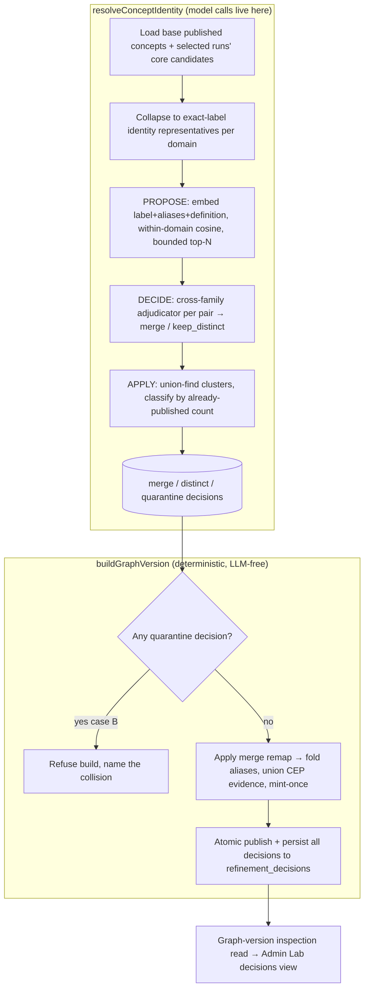
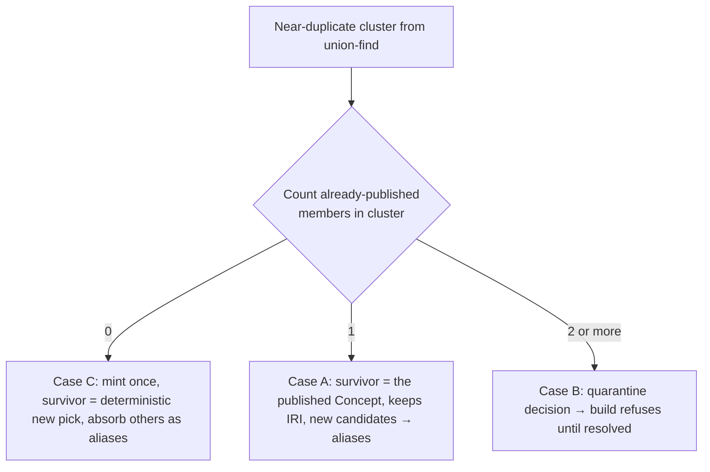

# feat: Published-Concept Semantic Identity Resolution

## Summary

Add a semantic identity-resolution operation that runs before the Graph-Version Build,
proposes within-domain near-duplicate published Concepts by embedding cosine, adjudicates
each pair with a cross-family judge, and writes recorded `merge` / `distinct` / `quarantine`
decisions. The build consumes only those decisions and stays deterministic and LLM-free, so
the "barter"/"owner" same-domain fragmentation collapses to one Concept while a two-already-
published collision is refused, not silently re-keyed.

---

## Problem Frame

Published Concept identity is exact-label-only. `packages/application/src/buildGraphVersion.ts`
(lines 108-217) keys a Concept on `(declaredDomain, normalizedLabel)` and unions only on an
exact normalized match, so obvious same-domain synonyms become separate canonical nodes — run
`0a7ed566` split "barter" in two and split "owner" from "ownership." Every downstream stage
(enrichment ordering, difficulty, learner paths) inherits the fragmentation.

The remedy already exists one layer down and is already authorized. `packages/application/src/deduplicateDerivedNodes.ts`
is a working propose-decide pass — embeddings propose within-domain near-duplicates, a
cross-family adjudicator decides, union-find applies — but it deliberately refuses to touch
published identity (it never proposes an anchor↔anchor pair and skips any cluster with two or
more anchors at line 300). ADR-0015 already permits the merge "through an adjudicated
semantic-deduplication decision under ADR-0012"; only the code for published Concepts is missing.

---

## Key Technical Decisions

- KTD1. Resolution is a standalone operation invoked by the worker's build orchestration immediately
  before `buildGraphVersion`; the build receives the decisions and applies them deterministically.
  The build never makes a model call, so R8 and ADR-0017 hold unchanged (resolves origin Outstanding
  Question 1 — standalone vs. build-internal; standalone is the only seam that keeps the build
  LLM-free). *(see origin: docs/brainstorms/2026-06-26-published-concept-identity-resolution-requirements.md)*

- KTD2. Reuse `NodeEmbeddingPort` and `NodeMergeAdjudicationPort` (with their existing
  `kg-node-embedding` / `kg-independent-judge` adapters) rather than minting dedicated identity
  ports. Both port contracts are domain-neutral and already take label + aliases + bounded evidence
  per side; a second parallel port would violate AGENTS rule 18 (resolves Outstanding Question 2).

- KTD3. Decisions persist into the existing `refinement_decisions` store under new decision types,
  threaded in-memory into the build and written by the build's existing atomic publication. No new
  resolution-artifact table and no resolution-id are introduced; the build stays a pure function of
  (base version + selected runs + decisions). The existing columns (`decision_type`, `subject` jsonb,
  `outcome`, `rationale`, `provenance` jsonb) already hold everything R4 requires, so no migration is
  needed (AGENTS rule 8).

- KTD4. Cluster publication-state classification by union-find over merged pairs, counting
  already-published members: 0 or 1 published (case A / C) emits a `merge` decision that canonicalizes
  automatically; 2 or more published (case B) emits a `quarantine` decision and the build refuses to
  publish. This mirrors the derived layer's "two anchors ⇒ refuse the cluster" rule and preserves
  ADR-0010 append-only publication and ADR-0015 mint-once (resolves Outstanding Question 4).

- KTD5. Resolution operates over exact-label-collapsed identity representatives (one per
  `(declaredDomain, normalizedLabel)`), so it only ever proposes pairs between *distinct* keys and
  never re-adjudicates candidates the build already unions by exact match.

- KTD6. Fail closed everywhere (R9): a per-domain embedding failure yields no merge for that domain
  and is surfaced; an adjudicator throw degrades that pair to `distinct`; no failure path silently
  changes authoritative identity. This is the ADR-0012 contract already proven in the derived pass.

- KTD7. The pass is opt-in like derived-node dedup — it runs only when both ports are supplied — and
  an env flag (`BUILD_DISABLE_IDENTITY_RESOLUTION`) unsets them to reproduce the exact-label baseline
  for the rule-14 calibration comparison, mirroring `ENRICH_DISABLE_DEDUP`.

- KTD8. The survivor of a merge is chosen by resolution and recorded in the decision; the build honors
  it rather than re-deciding. Case A keeps the already-published Concept (and its minted IRI); case C
  mints once for the cluster, with the survivor picked deterministically (most definitions, then lowest
  stable key) so replay is stable.

---

## High-Level Technical Design

Two stages with a hard seam: a model-driven resolution operation that writes decisions, and the
unchanged-deterministic build that reads them. The model calls live entirely on the left of the seam.



Cluster classification is the load-bearing branch. A cluster's members are distinct identity
representatives; "already-published" means the key appears in `existingConceptIdentities()`.



---

## Output Structure

```text
packages/application/src/
  resolveConceptIdentity.ts        (new) propose-decide-classify operation
  resolveConceptIdentity.test.ts   (new)
  buildGraphVersion.ts             (modified) consume identityDecisions + case-B gate + remap
packages/domain-core/src/
  index.ts                         (modified) ConceptIdentityDecision + view types
packages/ports/src/
  index.ts                         (modified) graph-version identity-decision read method + view
packages/infrastructure-postgres/src/
  PostgresInspectionRead.ts        (modified) read identity decisions for a version
apps/kg-worker/src/
  knowledgeGraphWorker.ts          (modified) run resolution before build, thread decisions, summary
apps/admin-lab/src/
  lib/inspection.ts                (modified) thin shell fn
  app/admin/lab/page.tsx           (modified) minimal identity-decisions table near GraphExplorer
```

---

## Requirements

Carried from the origin requirements document; see it for full prose.

**Candidate proposal**

- R1. Candidate proposal runs per Declared Domain over the union of the base version's published
  Concepts and the selected runs' admitted-core candidates, so a new source can merge into an
  existing published Concept and two new candidates can merge with each other.
- R2. Each candidate's embedding text includes its canonical label, aliases, and definition span.

**Adjudication and recorded decisions**

- R3. A cross-family adjudicator decides every proposed pair; cosine orders and bounds proposals but
  never makes a merge.
- R4. Every decision is persisted with both candidate identities, their labels, aliases, definitions,
  and source evidence, the proposed reason, the outcome (`merge` / `distinct` / `quarantine`), and
  the deciding model and configuration.
- R5. Every merge is recorded and inspectable, consistent with ADR-0015.

**Publication-state handling**

- R6. Case A and case C merges canonicalize automatically: the survivor keeps (or mints) the IRI and
  absorbs the other surface label as an alias.
- R7. A cluster containing two or more already-published Concepts is case B: it produces a `quarantine`
  decision and the build refuses to publish, reusing the quarantine gate at `buildGraphVersion.ts:70`.

**Build consumption and failure**

- R8. The Graph-Version Build consumes only the supplied identity decisions and performs no model
  calls, preserving the deterministic, replayable build of ADR-0017.
- R9. The pass fails closed: an embedding failure yields no merge for that domain and is surfaced; an
  adjudicator error degrades that pair to `distinct`; a failure never silently changes authoritative
  identity.

**Inspection**

- R10. Decisions are inspectable through the Admin Lab read-model (ADR-0011) via a read-model port plus
  a minimal Admin Lab surface mirroring the derived-node-merge view; a human-override workflow is
  deferred — quarantine plus re-run is the v1 escape hatch.

---

## Implementation Units

### U1. Concept-identity resolution operation

- **Goal:** A standalone application operation that proposes within-domain near-duplicate published
  Concepts, adjudicates each pair, and returns recorded `merge` / `distinct` / `quarantine` decisions.
- **Requirements:** R1, R2, R3, R4, R5, R6, R7, R9. Covers AE1, AE2, AE4, AE5.
- **Dependencies:** none.
- **Files:**
  - `packages/application/src/resolveConceptIdentity.ts` (new)
  - `packages/application/src/resolveConceptIdentity.test.ts` (new)
  - `packages/domain-core/src/index.ts` (add `ConceptIdentityDecision`, decision-outcome union, and the
    resolution input/result types)
  - `packages/application/src/index.ts` (export the operation)
- **Approach:** Mirror the structure of `deduplicateDerivedNodes.ts`. Input is the base version's
  published Concepts (with CEP definitions + aliases) and the selected runs' core candidates (with CEP
  definitions + aliases), reduced to plain per-side data plus the two ports — so the worker, not this
  operation, owns loading. First collapse inputs to one identity representative per
  `(declaredDomain, normalizedLabel)` (KTD5). PROPOSE: build embedding text as
  `label + aliases + definition span` (R2), embed per Declared Domain so a per-domain failure skips
  only that domain (R9, KTD6), score within-domain cosine, keep bounded top-N pairs above the floor —
  never a cross-domain pair (R1). DECIDE: adjudicate each proposed pair with bounded concurrency; a
  throw degrades the pair to `distinct` (R9). APPLY: union-find over merged pairs, then classify each
  cluster by its count of already-published members (a key present in `existingConceptIdentities()`):
  0/1 → `merge` with a recorded survivor (KTD8), ≥2 → `quarantine` (KTD4). Emit a `distinct` record for
  every adjudicated-distinct pair (R4). Reuse the exported `cosineSimilarity` helper; do not duplicate
  the math. Config (`ConceptIdentityResolutionConfig`) seeds from `DEFAULT_DEDUP_CONFIG` values; exact
  thresholds are recalibrated in U5 (KTD2, KTD8). Surface fail-closed events through an `onUnavailable`
  hook like the derived pass.
- **Patterns to follow:** `packages/application/src/deduplicateDerivedNodes.ts` (propose/decide/apply
  split, `candidatePairsByDomain` pairing shape, union-find in `applyClusters`, fail-closed
  `onUnavailable`); `packages/application/src/mapWithConcurrency.ts` for bounded adjudication.
- **Test scenarios:**
  - Covers AE1. A base published "ownership" and a new candidate "owner" in one domain, adjudicator
    returns `merge`: one `merge` decision whose survivor is the published "ownership" key and whose
    absorbed surface label is "owner".
  - Covers AE2. Two new candidates "barter" and "bartering" in one domain, neither published,
    adjudicator returns `merge`: one `merge` decision, survivor is the deterministic pick, the other is
    absorbed.
  - Covers AE4. A pair above the cosine floor the adjudicator judges distinct: no merge, one `distinct`
    decision recorded.
  - Covers AE5. The embedding port throws for one domain: that domain yields no merges and surfaces an
    unavailable event; a second domain still resolves normally.
  - Embedding text composition includes label, aliases, and the definition span (not the bare label).
  - Cross-domain same-label pair (e.g., "Mercury" in two domains) is never proposed.
  - Exact-label duplicates within a domain are collapsed before proposal and never adjudicated (KTD5).
  - A transitive cluster mixing one published Concept, two new candidates, and a second published
    Concept is classified case B (`quarantine`) by already-published count, not merged (Outstanding
    Question 4).
  - Adjudicator throw on one pair degrades only that pair to `distinct`; other pairs are unaffected.
  - A `merge` decision records both identities, labels, aliases, definitions, evidence, proposing
    score, outcome, and deciding model/config (R4).

### U2. Build consumes identity decisions and refuses case B

- **Goal:** `buildGraphVersion` applies supplied `merge` decisions during identity resolution, refuses
  to publish on any case-B `quarantine` decision, and persists all identity decisions — without making
  a model call.
- **Requirements:** R6, R7, R8. Covers AE1, AE2, AE3.
- **Dependencies:** U1 (for the decision types).
- **Files:**
  - `packages/application/src/buildGraphVersion.ts` (modified)
  - `packages/application/src/buildGraphVersion.test.ts` (modified)
- **Approach:** Add an `identityDecisions: ConceptIdentityDecision[]` input. Extend the existing
  quarantine gate (lines 70-74) so any `quarantine` identity decision throws before assembly, naming the
  colliding published Concepts (R7). Build a `keyRemap` (absorbed identity key → survivor key, resolved
  through the merge decisions) and apply it wherever a cluster key is computed: base-concept seeding and
  the run-candidate loop both route through `effectiveKey`, so absorbed surface labels fold into the
  survivor's aliases and `candidateIdentity` maps absorbed CEP evidence onto the survivor's accumulator
  via the existing union path (R6). The survivor's `canonicalLabel`/IRI come from the survivor key —
  base Concept for case A (keeps IRI, mint-once), the recorded deterministic pick for case C. Append the
  identity decisions to the `refinementDecisions` array the build already persists (KTD3). No new model
  call is added anywhere in this file (R8).
- **Patterns to follow:** the existing cluster/alias/IRI machinery in `buildGraphVersion.ts:108-217`;
  the existing `domain_scoped_merge` / `cross_domain_homograph_flag` refinement-decision records.
- **Test scenarios:**
  - Covers AE1. Given a `merge` decision (new "owner" → published "ownership"), the published snapshot
    carries one Concept keeping the base IRI with "owner" as an alias.
  - Covers AE2. Given a `merge` decision over two new candidates, a single Concept is minted with both
    surface labels and the absorbed label as an alias.
  - Covers AE3. Given a case-B `quarantine` decision, the build throws and names the collision; no IRI is
    minted or retired, and the previously published version is untouched.
  - Absorbed candidate's CEP definitions and mentions union under the survivor Concept (no evidence lost).
  - With an empty `identityDecisions` array the build behaves exactly as today (exact-label only).
  - The build performs no model call: invoked with stub stores and no ports, it still produces a
    snapshot (regression guard for R8).
  - Identity decisions are written to `refinement_decisions` alongside the existing decision types.

### U3. Worker build orchestration

- **Goal:** The worker's build command runs resolution before the build, threads decisions in, surfaces
  the case-B refusal and a resolution summary, and supports the baseline opt-out.
- **Requirements:** R1, R8, R9, R10 (write side). Covers AE3, AE5.
- **Dependencies:** U1, U2.
- **Files:**
  - `apps/kg-worker/src/knowledgeGraphWorker.ts` (modified)
- **Approach:** In `buildVersion`, load the selected runs (`runStore.runsForBuildByIds`) and the base
  snapshot (`graphStore.getPublishedSnapshot`) once, map them into the resolution inputs, and — unless
  `BUILD_DISABLE_IDENTITY_RESOLUTION` is set (KTD7) — run `resolveConceptIdentity` with
  `ctx.nodeEmbedding` and `ctx.nodeMergeAdjudicator`. Pass the resulting decisions into
  `buildGraphVersion`. Print a one-line resolution summary (merges / distinct / quarantine / unavailable)
  mirroring the dedup and ordering summary lines, and let a case-B build refusal surface as the build's
  thrown error with a clear operator message. The double DB read (resolution + the build's own internal
  load) is accepted: both are deterministic reads and keep the build a self-contained pure function.
- **Patterns to follow:** the existing `enrichGraphVersion` wiring of `ctx.nodeEmbedding` /
  `ctx.nodeMergeAdjudicator` with `ENRICH_DISABLE_DEDUP` and the `onDedupSummary` / `onOrderingSummary`
  log lines (`knowledgeGraphWorker.ts:342-369`).
- **Test scenarios:**
  - Test expectation: none for the wiring glue itself, but add a focused test if the worker grows a pure
    mapping helper (runs + base snapshot → resolution input); otherwise covered by U1/U2 unit tests and
    the U5 real-source run.
  - Verified in U5: a real build run prints the resolution summary, and `BUILD_DISABLE_IDENTITY_RESOLUTION`
    reproduces the exact-label baseline.

### U4. Identity-decision inspection read model and Admin Lab surface

- **Goal:** Persisted identity decisions are readable through the Inspection Read Model and rendered in a
  minimal Admin Lab table, mirroring the derived-node-merge view (R10).
- **Requirements:** R5, R10.
- **Dependencies:** U2 (decisions are persisted).
- **Files:**
  - `packages/ports/src/index.ts` (add `ConceptIdentityDecisionView` and a graph-version read method)
  - `packages/infrastructure-postgres/src/PostgresInspectionRead.ts` (modified)
  - `packages/infrastructure-postgres/src/PostgresInspectionRead.test.ts` (modified)
  - `apps/admin-lab/src/lib/inspection.ts` (modified — thin shell fn)
  - `apps/admin-lab/src/app/admin/lab/page.tsx` (modified — minimal decisions table near `GraphExplorer`)
- **Approach:** Add a read-model method that returns the identity decisions for a graph version by
  querying `refinement_decisions` filtered to the identity decision types, mapping each row to a
  `ConceptIdentityDecisionView` (both labels, outcome, proposing score, rationale, deciding model). Mirror
  `PostgresEnrichmentInspectionRead.getDerivedGraphDetail` and its `NodeMergeView` row-stitch. Expose it
  through `inspection.ts`'s `withInspectionRead` shell, and render a compact table on the lab landing page
  beside the published-graph explorer. No write-side change — `PostgresStores.publish` already writes the
  rows (U2 supplies them).
- **Patterns to follow:** `packages/infrastructure-postgres/src/PostgresEnrichmentInspectionRead.ts`
  (`NodeMergeView` mapping at lines 65, 150); `apps/admin-lab/src/lib/inspection.ts` shell;
  `NodeMergeView` table rendering in the enrichment detail component.
- **Test scenarios:**
  - The read method returns `merge`, `distinct`, and `quarantine` decisions for a version with full view
    fields populated.
  - A version with no identity decisions returns an empty list (not an error).
  - The query filters to identity decision types and excludes unrelated refinement decisions
    (`domain_scoped_merge`, `cross_domain_homograph_flag`).
  - Admin Lab surface: covered by a render/smoke test mirroring the existing merge-view component test.

### U5. Real-source calibration and rule-14 quality evaluation

- **Goal:** Calibrate the cosine floor and proposal bounds against the embedding model's own scale on real
  fixtures, confirm the `0a7ed566`-class fragmentation collapses with no wrong merges, and confirm a
  constructed case-B collision refuses the build.
- **Requirements:** R1, R2, R3, R6, R7, R9 (validated end-to-end). Success criteria (all four).
- **Dependencies:** U1, U2, U3, U4.
- **Files:** none in `src` beyond possible config-default adjustments in
  `packages/application/src/resolveConceptIdentity.ts` (the calibrated floor/top-N).
- **Approach:** Apply `.agents/skills/real-use-quality-evaluation/SKILL.md` (AGENTS rules 13, 14). Run a
  probe over real same-domain fixtures to find where genuine same-concept near-duplicates separate from
  clearly-distinct same-domain Concepts on the `qwen3-embedding-8b` cosine scale, and set the floor there
  (mirroring the derived pass's U7 probe), not by assumption (success criterion 4). Re-run a clean seed
  reproducing the `0a7ed566`-class fragmentation and inspect that same-domain synonyms the adjudicator
  judges identical publish as one Concept (criterion 1) with no wrong merge of genuinely distinct
  Concepts (criterion 2, real-source inspection per ADR-0013). Construct a two-already-published collision
  and confirm the build refuses rather than retiring an IRI (criterion 3). Capture the exact-label baseline
  with `BUILD_DISABLE_IDENTITY_RESOLUTION` for comparison.
- **Execution note:** This is a measurement and calibration milestone — its evidence is inspected real
  model output, not a green suite (AGENTS rule 14). Record the trail under `tmp/`.
- **Test scenarios:** Test expectation: none — evidence is real-source inspection per ADR-0013, not unit
  tests. Inspection checks: (a) fragmentation collapse on the re-run; (b) zero wrong merges among
  distinct same-domain Concepts; (c) the constructed case-B build refusal; (d) the chosen floor sits in
  the measured gap between same-concept and distinct-concept cosine on real fixtures.

---

## Risks & Dependencies

- **A wrong merge fuses two ideas in a learner's graph.** This is the precision risk and the reason the
  adjudicator is precision-first, cross-family, and the sole merge authority — cosine only proposes
  (R3, KTD6). Gated by real-source inspection in U5 (criterion 2), not by the test suite.
- **Case B must reliably block.** A two-already-published collision that slipped through would retire a
  minted IRI and break ADR-0010/ADR-0015. Covered by a unit test (U2) and a constructed real run (U5).
- **Embedding-scale assumption.** A floor copied blind from the derived pass could over- or under-propose;
  U5's calibration probe sets it on the model's real scale (success criterion 4).
- **Double load of runs and base snapshot** in the worker (resolution reads them, the build re-reads them
  internally). Accepted: deterministic DB reads that keep the build a self-contained pure function (KTD1).
- **Dependencies:** `qwen3-embedding-8b` (`kg-node-embedding`) and `gpt-oss-120b` (`kg-independent-judge`)
  through LiteLLM. No alias edits are introduced (the existing aliases are reused), so the "restart
  `lrnki-litellm` after alias edits" gotcha does not apply here.

---

## System-Wide Impact

This change touches the one fact the entire graph is keyed on — authoritative published Concept identity.
Collapsing same-domain fragments means the Derived Graph Layer's anchors are already canonical, so
enrichment ordering, difficulty, and learner paths operate on fewer, correct nodes; the incidental
prompt-shrinking is welcome but not the goal. Append-only publication and mint-once are preserved (no IRI
is ever retired). No schema migration is required — identity decisions fit the existing
`refinement_decisions` columns (AGENTS rule 8). The complementary derived-node dedup pass is unchanged.

---

## Scope Boundaries

**Deferred for later**

- Performance and latency reduction — owned by the in-flight pipeline-cost work; only the incidental
  prompt-shrinking side-effect lands here.
- IRI retirement and redirect machinery — case B is refused, not resolved; true cross-published-Concept
  consolidation is a deliberate later identity decision.
- A human-override UI for identity decisions — quarantine plus re-run is the v1 escape hatch (R10).
- Proposal bounding for large domains — current fixtures are small same-domain sets; top-N per node is
  the lever if a domain ever grows, not new machinery.

**Outside this change**

- Cross-domain merges — same-label-across-domains stays a flagged homograph (ADR-0015), never proposed.
- The derived-node dedup pass — it already exists and is complementary; this change does not touch it.
- Evidence retrieval before CEP extraction — measured and de-prioritized; revisiting it needs new
  evidence, not this work.

---

## Sources & Research

- `packages/application/src/buildGraphVersion.ts:70` (quarantine gate reused for case B), `:108-217`
  (exact-label identity, IRI mint-once, CEP union — the path U2 extends).
- `packages/application/src/deduplicateDerivedNodes.ts` — the propose-decide precedent U1 mirrors;
  `:300` is the "two anchors ⇒ refuse the cluster" rule case B parallels; `cosineSimilarity` is reused.
- `packages/ports/src/index.ts:185-205` (`NodeEmbeddingPort`, `NodeMergeAdjudicationPort` reused per KTD2);
  `:252-263` (`GraphVersionStorePort`, `existingConceptIdentities`, `refinementDecisions` persistence).
- `packages/infrastructure-litellm/src/dedupAdapters.ts` — `kg-node-embedding` and `kg-independent-judge`
  adapters reused unchanged.
- `apps/kg-worker/src/knowledgeGraphWorker.ts:298-324` (`buildVersion` command U3 extends),
  `:342-369` (the dedup/ordering wiring + summary-line pattern to mirror).
- `packages/infrastructure-postgres/src/PostgresInspectionRead.ts` and
  `PostgresEnrichmentInspectionRead.ts` (`getDerivedGraphDetail` / `NodeMergeView`) — the R10 read-model
  precedent U4 mirrors; `PostgresStores.ts:405-407` already writes `refinement_decisions`.
- `packages/infrastructure-postgres/src/migrations/0000_initial_lrnki_schema.sql:230-238`
  (`refinement_decisions` columns confirm no migration is needed).
- ADR-0010 (append-only publication), ADR-0012 (embeddings propose, never merge), ADR-0015
  (deterministic cross-source identity, semantic-dedup authorized), ADR-0017 (deterministic LLM-free
  build), ADR-0011 / ADR-0027 (inspection read-model boundary).
