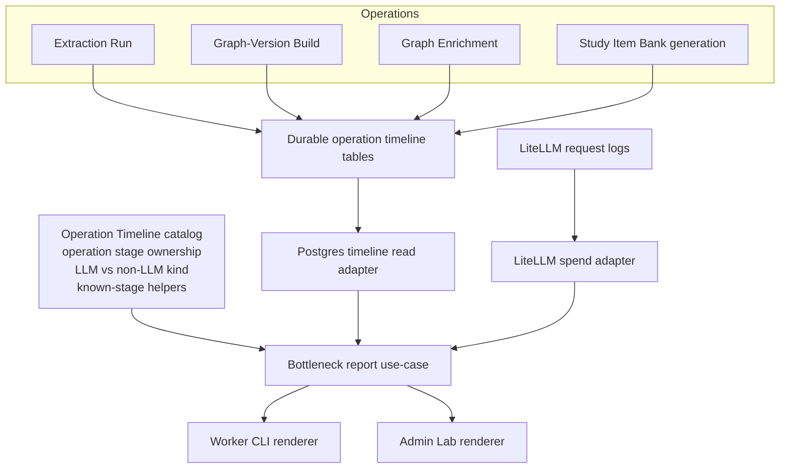

# refactor: make Operation Timeline ownership explicit

## Summary

This plan deepens the Operation Timeline reporting seam by making stage ownership, LLM-stage
classification, and LiteLLM spend joining one application-owned module. It preserves ADR-0017's
separate operation lifecycles, ADR-0029's shared durable timeline tables, existing Postgres reporter
writes, and the current Admin Lab and worker report behavior.

---

## Problem Frame

Durable operation observability is implemented and validated, but the ownership model is still
spread across several shallow modules:

- `packages/application/src/runProgressReporter.ts` owns non-LLM stage strings and
  `isLlmStage`.
- `packages/application/src/bottleneckReport.ts` owns operation-to-stage membership in local sets.
- `packages/infrastructure-litellm/src/LiteLlmSpendLogsReadAdapter.ts` independently decides which
  stage tags to read from LiteLLM by using the LLM stage vocabulary.
- Operation modules and tests still use raw string stage names for non-LLM stages and several
  timeline fixtures.
- Admin Lab and the worker both consume the report output, so drift in report semantics affects two
  operator surfaces.

The deletion test points at one missing module: if the local stage sets in `bottleneckReport` were
deleted today, their complexity would reappear across the report join, spend reader, renderers, and
instrumented operations. That stage ownership is earning its keep, but it is not yet a deep module.

---

## Requirements

**Ownership and semantics**

- R1. Operation stage ownership is defined in one application-facing module that maps each
  `OperationType` to its reportable stages and marks each stage as LLM or non-LLM.
- R2. The bottleneck report derives stage membership and LLM classification from that module, with no
  local operation-specific stage sets.
- R3. The LiteLLM spend read path consumes the same LLM stage vocabulary used by the report, so spend
  rows and wall-clock rows join on one closed stage catalog.
- R4. Existing report semantics remain unchanged for operation scope, Processing Journey scope,
  shared `operation_id` between enrichment and study-item operations, missing spend logs, and
  wall-clock-only stages.

**Instrumentation and consumers**

- R5. Instrumented operations use the stage catalog for all non-LLM stages and report-owned stage
  names where practical, without changing persisted table shape or operation lifecycle semantics.
- R6. Admin Lab operation pages and worker report renderers continue to display the same information,
  but consume any improved stage metadata instead of re-deriving semantics locally.
- R7. Unknown stages are surfaced predictably in reports as timeline-only rows, not silently attached
  to the wrong operation or hidden.
- R8. The plan does not introduce a new workflow identity or merge Extraction Run, Graph-Version
  Build, Graph Enrichment, Study Item Bank generation, or Processing Journey ownership.

---

## Key Technical Decisions

- KTD1. Keep the seam in application, not infrastructure. Operation stage ownership is part of
  application reporting semantics. Postgres and LiteLLM adapters should read and shape data, while
  the application decides which stages belong to which operation and how cost joins wall-clock.
- KTD2. Preserve `OperationType` as the lifecycle key. The catalog may describe stage membership, but
  it must not create a unified pipeline identity. This follows ADR-0017 and ADR-0029.
- KTD3. Treat non-LLM stages as first-class catalog entries. `load`, `refine`, `persist`, and
  `symbolic-disposal` affect operator bottleneck analysis even when they never carry LiteLLM spend.
- KTD4. Let unknown stages remain visible. A stage present in the durable timeline but absent from
  the catalog should appear as a timeline-only row with no spend match and an inspectable
  classification, so instrumentation mistakes are discoverable.
- KTD5. Start with characterization tests. This is a behavior-preserving refactor over a validated
  operator surface; tests should pin existing report output before moving ownership.

---

## High-Level Technical Design



The new catalog is the deep module. It absorbs the local stage sets, non-LLM stage vocabulary, and
classification rules that are currently spread across reporting and instrumentation. Adapters remain
concrete data readers at their existing seams.

---

## Scope Boundaries

**In scope**

- Application-owned Operation Timeline stage catalog and helper functions.
- Bottleneck report refactor to consume the catalog.
- LiteLLM spend adapter alignment with the same closed LLM stage set.
- Instrumentation cleanup for operation modules where raw non-LLM stage strings can be replaced by
  catalog constants without changing behavior.
- Admin Lab and worker consumer verification for unchanged report rendering.

**Out of scope**

- Database schema changes to `operation_runs` or `operation_run_stages`.
- Persisting cost, token counts, or spend aggregates in the application database.
- Introducing a durable Processing Journey entity or workflow orchestration module.
- Changing stage names used in existing LiteLLM tags unless the implementation finds a broken alias
  and records the compatibility impact.
- Changing visual design of Admin Lab operation pages beyond consuming report metadata.

**Deferred to follow-up work**

- Splitting the entire `@lrnki/ports` package by domain seam.
- Moving learner Study session projection into application use-cases.
- Reworking worker adapter composition into operation contexts.

---

## System-Wide Impact

This is a cross-cutting refactor over the operator observability surface. It touches application
reporting, LiteLLM spend reads, Postgres timeline reads, worker command rendering, and Admin Lab
operation pages. The persisted data contract stays unchanged: timelines remain in Postgres,
operation-scoped cost remains in LiteLLM request logs, and the report joins them at read time.

---

## Implementation Units

### U1. Add characterization coverage for current report semantics

**Goal:** Pin the existing Operation Timeline report behavior before moving stage ownership.

**Requirements:** R4, R7, KTD5.

**Dependencies:** none.

**Files:**

- `packages/application/src/bottleneckReport.test.ts`
- `packages/application/src/rankBottleneckTargets.test.ts`
- `packages/infrastructure-litellm/src/LiteLlmSpendLogsReadAdapter.test.ts`

**Approach:** Extend current pure tests around the behavior that must not drift. Focus on the
join contract: operation type disambiguation, stage ordering, cost unavailable behavior, non-LLM
wall-clock-only rows, and unknown-stage visibility.

**Execution note:** Add the characterization tests before refactoring `bottleneckReport`.

**Patterns to follow:** Current `detail(...)` and `ports(...)` fakes in
`packages/application/src/bottleneckReport.test.ts`; current pure row shaping test in
`packages/infrastructure-litellm/src/LiteLlmSpendLogsReadAdapter.test.ts`.

**Test scenarios:**

- Operation scope with `operationType` set to `study_items` returns only the study-item operation
  when enrichment and study items share one `operation_id`.
- Processing Journey scope rolls up extraction runs, Graph-Version Build, Graph Enrichment, and
  Study Item Bank generation in the same operation order as today.
- Cost-source failure preserves wall-clock totals and sets calls, tokens, and cost to `null`.
- Non-LLM stages such as `load`, `refine`, `persist`, and `symbolic-disposal` keep wall-clock and
  zero or absent spend according to current report semantics.
- A durable timeline stage not known to the stage catalog appears in the report as a timeline-only
  row with `isLlmStage: false` or successor metadata that renders as non-LLM/unknown, and it does
  not receive spend from another operation.
- Ranking behavior remains unchanged for cost-ranked and wall-ranked targets after the report row
  shape is refactored.

**Verification:** Existing report tests and the new characterization tests pass before any
ownership move starts.

### U2. Introduce the Operation Timeline stage catalog

**Goal:** Define operation stage ownership and stage classification in one application-owned module.

**Requirements:** R1, R3, R5, KTD1, KTD2, KTD3, KTD4.

**Dependencies:** U1.

**Files:**

- `packages/application/src/operationTimelineCatalog.ts` (new)
- `packages/application/src/operationTimelineCatalog.test.ts` (new)
- `packages/application/src/runProgressReporter.ts`
- `packages/application/src/index.ts`
- `packages/domain-core/src/index.ts` only if the implementation confirms the existing LLM stage
  vocabulary is actually owned there and needs a missing source export repaired.

**Approach:** Add a catalog module that imports or reuses the existing closed LLM stage vocabulary,
adds non-LLM stage names, and declares which stages belong to each `OperationType`. The catalog
should expose helpers for stage kind and operation membership. Keep exact naming flexible during
implementation, but the module should answer these questions from one place:

- Is this stage a known LLM stage?
- Is this stage a known non-LLM stage?
- Which operation types own this stage?
- Should a spend row for this stage be considered when building a report for this operation?
- Which LLM stage tags should the LiteLLM spend adapter read?

**Technical design:** Directional shape, not implementation specification:

```text
operation stage catalog
  operation type -> ordered stage descriptors
  descriptor -> stage name, kind, report ownership
  helper -> isKnownStage(stage)
  helper -> isLlmStage(stage)
  helper -> stageBelongsToOperation(stage, operationType)
  helper -> llmSpendStageTags()
```

**Patterns to follow:** Existing `NON_LLM_STAGES`, `isLlmStage`, and `bracketStage` exports in
`packages/application/src/runProgressReporter.ts`; existing `OperationType` in `packages/ports/src/index.ts`.

**Test scenarios:**

- Every value in the LLM stage vocabulary is classified as LLM.
- Every non-LLM stage currently used by operations is classified as non-LLM.
- Extraction owns discovery, admission, admission-label judge, CEP extraction, Definition-Passage
  quality, assertion entailment, and persist.
- Graph-Version Build (`minting`) owns load, refine, and persist but no LLM stages.
- Graph Enrichment owns prerequisite ordering, rescue/minting/proposal/grounding/difficulty/dedup
  LLM stages, `symbolic-disposal`, and persist.
- Study Item Bank generation owns study-item generation and persist.
- Unknown stage classification is stable and does not claim LLM spend.
- The LiteLLM spend-stage list includes LLM stages only and excludes non-LLM stages.

**Verification:** The catalog tests pass and `packages/application/src/index.ts` exports the catalog
or its public helpers needed by infrastructure and UI consumers.

### U3. Refactor bottleneck reporting to consume the catalog

**Goal:** Remove local stage ownership from `bottleneckReport` and make the report use the catalog.

**Requirements:** R1, R2, R4, R7.

**Dependencies:** U1, U2.

**Files:**

- `packages/application/src/bottleneckReport.ts`
- `packages/application/src/bottleneckReport.test.ts`
- `packages/application/src/rankBottleneckTargets.ts`
- `packages/application/src/rankBottleneckTargets.test.ts`

**Approach:** Replace `EXTRACTION_STAGES`, `ENRICHMENT_STAGES`, and the local study-item check with
catalog helper calls. Preserve the report row fields unless U4 intentionally adds optional metadata
for renderers. Keep the join behavior operation-scoped: an enrichment spend row and a study-item
spend row may share the same `operationId`, so stage ownership must still be filtered by
`operationType`.

**Patterns to follow:** Existing `buildOperationReport` aggregation over duplicate timeline stage
rows; existing `sumStageRows` and `sumTotals` behavior for cost unavailable.

**Test scenarios:**

- Existing U1 characterization scenarios still pass.
- A spend row with a valid stage for a different operation type is excluded from the operation's
  subtotal.
- A spend row for an unknown stage is not joined to a known operation unless the catalog marks that
  stage as owned by that operation.
- Duplicate timeline stage rows still sum wall-clock under one report stage row.
- Ranked targets consume the refactored report row shape without changing ordering or share
  calculations.

**Verification:** No operation-to-stage membership set remains in `bottleneckReport.ts`; all stage
membership checks flow through the catalog.

### U4. Align LiteLLM spend reads with the catalog

**Goal:** Make the LiteLLM spend adapter consume the same report-owned LLM stage list as the
bottleneck report.

**Requirements:** R3, R4.

**Dependencies:** U2.

**Files:**

- `packages/infrastructure-litellm/src/LiteLlmSpendLogsReadAdapter.ts`
- `packages/infrastructure-litellm/src/LiteLlmSpendLogsReadAdapter.test.ts`
- `packages/infrastructure-litellm/src/index.ts`
- Package dependency metadata if the adapter needs a new import path from `@lrnki/application`.

**Approach:** Replace direct `STAGE_TAGS` enumeration with a catalog-provided LLM spend-stage list.
If importing from `@lrnki/application` would create an undesirable dependency direction or cycle,
move only the shared stage vocabulary to a neutral location already used by both application and
LiteLLM, then keep operation ownership in application.

**Patterns to follow:** Current `shapeOperationStageSpend` pure test; current adapter behavior of
returning zero spend/tokens for null database aggregates.

**Test scenarios:**

- The generated SQL stage list contains every LLM stage and no non-LLM stage.
- Numeric shaping still converts string, number, and null aggregates as today.
- An empty `operationIds` input returns an empty list without querying spend rows.
- A spend row for a new catalog LLM stage is included without changing adapter-local code.

**Verification:** `LiteLlmSpendLogsReadAdapter.ts` no longer imports the LLM stage vocabulary
directly from a separate source than the report uses.

### U5. Clean up operation instrumentation to use catalog constants

**Goal:** Remove avoidable raw stage strings from instrumented operations and tests.

**Requirements:** R5, R8.

**Dependencies:** U2.

**Files:**

- `packages/application/src/executeExtractionRun.ts`
- `packages/application/src/buildGraphVersion.ts`
- `packages/application/src/runGraphEnrichment.ts`
- `packages/application/src/generateStudyItemBank.ts`
- `packages/application/src/enrichmentNodeMinting.ts`
- `packages/application/src/deduplicateDerivedNodes.ts`
- Existing tests for those modules:
  - `packages/application/src/executeExtractionRun.test.ts`
  - `packages/application/src/buildGraphVersion.test.ts`
  - `packages/application/src/runGraphEnrichment.test.ts`
  - `packages/application/src/generateStudyItemBank.test.ts`
  - `packages/application/src/enrichmentNodeMinting.test.ts`
  - `packages/application/src/deduplicateDerivedNodes.test.ts`
- `packages/infrastructure-postgres/src/PostgresRunProgressReporter.test.ts`
- `packages/infrastructure-postgres/src/PostgresOperationTimelineRead.test.ts`

**Approach:** Replace hardcoded non-LLM strings such as `symbolic-disposal` and repeated test fixture
strings with catalog constants where doing so improves locality. Do not rename persisted stage
values. Keep raw strings only in tests that are intentionally verifying unknown-stage behavior.

**Patterns to follow:** Existing `STAGE_TAGS` usage for LLM stages; existing `NON_LLM_STAGES`
usage for `load`, `refine`, and `persist`.

**Test scenarios:**

- Extraction reporter stage order remains discovery, admission, CEP extraction,
  Definition-Passage quality, assertion entailment, persist.
- Graph-Version Build reporter stage order remains load, refine, persist, and failure still marks
  the failed stage and operation.
- Graph Enrichment still emits fine-grained LLM stages for rescue/minting/dedup plus
  `symbolic-disposal` and persist.
- Study Item Bank generation still emits study-item generation with heartbeat progress and persist.
- The shared `operation_id` integration test for enrichment plus study items still passes.

**Verification:** Raw known-stage strings are limited to the catalog, migration comments, and tests
that intentionally exercise unknown stages.

### U6. Update Admin Lab and worker consumers for catalog-backed metadata

**Goal:** Keep operator rendering behavior stable while making consumers rely on report metadata from
the deeper module.

**Requirements:** R4, R6, R7.

**Dependencies:** U3.

**Files:**

- `apps/admin-lab/src/app/admin/lab/operations/_components/BottleneckReportView.tsx`
- `apps/admin-lab/src/app/admin/lab/operations/page.tsx`
- `apps/admin-lab/src/lib/operationTimeline.ts`
- `apps/kg-worker/src/knowledgeGraphWorker.ts`
- Existing or new component tests if the current app test setup can render the report component:
  - `apps/admin-lab/src/components/*`
  - or a new colocated test for `BottleneckReportView`

**Approach:** If U3 keeps `isLlmStage` as the only report-row classification, this unit should be a
small verification pass. If U3 adds richer row metadata such as `stageKind`, update Admin Lab badges
and worker text rendering to consume it while preserving existing visible content for LLM and
non-LLM rows. Unknown stages should be visible rather than hidden.

**Patterns to follow:** Existing `BottleneckReportView` table rendering and worker `renderBottleneckTable` /
`renderRankedTargets` functions.

**Test scenarios:**

- Admin Lab report view renders LLM, non-LLM, and unknown/timeline-only stage rows without dropping
  totals.
- Admin Lab displays `cost unavailable` exactly when `report.costAvailable` is false.
- Worker `--json` output keeps the report object shape expected by current consumers unless U3
  intentionally adds backward-compatible optional fields.
- Worker ranked output still orders cost and wall targets as `rankBottleneckTargets` returns them.
- Operations page links still pass both `operationId` and `operationType` for operation-scoped
  bottleneck reports.

**Verification:** Admin Lab and worker report consumers render the same information from the
refactored report use-case; no consumer re-implements stage ownership.

### U7. Update documentation and validation trail

**Goal:** Record the refactor in the canonical operations docs and leave a validation trail.

**Requirements:** R8.

**Dependencies:** U1 through U6.

**Files:**

- `docs/plans/TODO.md`
- `docs/plans/README.md`
- `docs/adr/0029-persist-shared-operation-stage-timelines.md` only if implementation changes the
  durable decision wording around stage ownership.
- `packages/infrastructure-postgres/src/migrations/0000_initial_lrnki_schema.sql` comments only if
  existing comments become inaccurate.
- `tmp/` validation notes generated during implementation.

**Approach:** Keep ADR-0029 unchanged unless the implementation changes its durable rationale. Update
`TODO.md` after implementation with the completed outcome and validation summary, not with copied
plan requirements. If the initial migration comment still says the application joins on a closed
`STAGE_TAGS` vocabulary but the catalog has a new name, update the comment in the same change.

**Test scenarios:** Test expectation: none for documentation-only edits, but docs must be checked for
stale references to retired stage ownership locations.

**Verification:** Documentation points to one stage ownership location and does not imply a unified
pipeline identity.

---

## Acceptance Examples

- AE1. Given enrichment and study-item operations share the same `operation_id`, when the operator
  opens the study-item bottleneck report with `operationType=study_items`, then only
  study-item-generation spend and wall-clock appear in that operation subtotal.
- AE2. Given a Processing Journey with two Extraction Runs, one Graph-Version Build, one Graph
  Enrichment run, and one Study Item Bank generation run, when the journey cost report is generated,
  then all operation totals roll up and Graph-Version Build contributes wall-clock but no LLM cost.
- AE3. Given LiteLLM spend logs are unavailable, when a bottleneck report is generated, then
  wall-clock rows remain visible and calls/tokens/cost are marked unavailable instead of zero.
- AE4. Given a new operation stage is persisted before the catalog is updated, when a bottleneck
  report is generated, then the stage appears as a timeline-only or unknown row and is not joined to
  unrelated spend.
- AE5. Given Admin Lab and worker render the same report, when stage classification changes inside
  the catalog, then both surfaces show consistent stage kind labels without local stage lists.

---

## Risks & Dependencies

- **Dependency direction risk:** `infrastructure-litellm` currently imports `STAGE_TAGS` from
  `@lrnki/domain-core`. Pulling from `@lrnki/application` may violate package direction. Mitigation:
  keep operation ownership in application but place the neutral LLM stage vocabulary where both
  application and LiteLLM can depend on it without a cycle.
- **Stage rename risk:** LiteLLM joins by exact tag string, so renaming a stage breaks historical
  cost joins. Mitigation: do not rename persisted stage values in this refactor.
- **Unknown-stage handling risk:** Hiding unknown stages would mask instrumentation drift. Mitigation:
  require visible unknown/timeline-only report rows.
- **Consumer compatibility risk:** Worker `--json` output may be used by scripts. Mitigation: prefer
  additive optional metadata over replacing existing fields.

---

## Documentation / Operational Notes

No database reset or migration is part of this work. The implementer should run normal typecheck and
test validation, plus a small real operation or existing timeline fixture check if a development
database and LiteLLM spend database are available. Because this refactor only changes ownership of
reporting semantics, real-use quality evaluation is not required unless implementation also changes
Graph Enrichment, Study Item Bank generation, learner projection, LLM prompts, or tool schemas.

---

## Sources / Research

- `CONTEXT.md` defines Processing Journey as a read-only lineage scope, not a durable pipeline
  identity.
- `docs/adr/0017-split-extraction-runs-from-graph-version-builds.md` keeps Extraction Runs and
  Graph-Version Builds separate.
- `docs/adr/0027-serve-inspection-through-read-model-ports.md` keeps inspection as finished read
  models and learner projections as application use-cases.
- `docs/adr/0029-persist-shared-operation-stage-timelines.md` owns the shared durable timeline and
  LiteLLM spend join contract.
- `packages/application/src/runProgressReporter.ts` owns current reporter bracketing and non-LLM
  stages.
- `packages/application/src/bottleneckReport.ts` owns the current operation-stage filtering that
  this plan deepens.
- `packages/infrastructure-litellm/src/LiteLlmSpendLogsReadAdapter.ts` owns current LiteLLM spend
  aggregation.
- `apps/kg-worker/src/knowledgeGraphWorker.ts` and
  `apps/admin-lab/src/app/admin/lab/operations/_components/BottleneckReportView.tsx` are the two
  report consumers that must remain consistent.

External research was not load-bearing. The codebase and ADRs already define the relevant reporting,
adapter, and read-model patterns.
